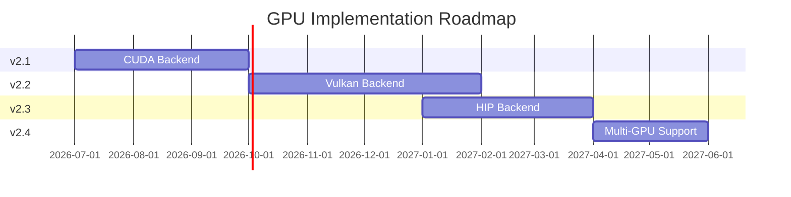

## Overview

Master tracking issue for complete GPU-accelerated vector indexing implementation across all backends.

**Target Timeline:** Q3 2026 - Q2 2027  
**Priority:** High  
**Status:** Planning  

## Context

GPU vector indexing backends were removed in v1.5.0 as incomplete stubs. This epic tracks the complete, production-ready implementation across multiple GPU backends.

**References:**
- Roadmap: `docs/FUTURE_GPU_SUPPORT.md`
- Migration Guide: `docs/GPU_SUPPORT_ROADMAP.md`
- Architecture: `docs/GPU_VECTOR_INDEXING_ARCHITECTURE.md`

## Roadmap Timeline



### v2.1 - CUDA Backend (Q3 2026)
**Timeline:** July - September 2026  
**Effort:** 3-4 weeks  
**Priority:** Critical  

#### Deliverables
- [ ] CUDA kernels for distance computation
- [ ] Memory management (device, unified)
- [ ] Mixed precision support (FP16, TF32)
- [ ] Tensor Core acceleration
- [ ] CUDA graphs for kernel fusion
- [ ] Performance: 250K QPS, 10x speedup for batches
- [ ] Tests: >95% coverage
- [ ] Documentation: Complete user guide

#### Related Issue
- [ ] #XXX - GPU-CUDA Implementation

### v2.2 - Vulkan Backend (Q4 2026)
**Timeline:** October - December 2026  
**Effort:** 4-5 weeks  
**Priority:** High  

#### Deliverables
- [ ] Vulkan compute shaders (GLSL/SPIR-V)
- [ ] Cross-platform support (Linux, Windows, macOS)
- [ ] Buffer and memory management
- [ ] Pipeline creation and execution
- [ ] MoltenVK support for macOS
- [ ] Performance: 200K QPS
- [ ] Tests: >90% coverage
- [ ] Works on NVIDIA, AMD, Intel, Apple GPUs

#### Related Issue
- [ ] #XXX - GPU-VULKAN Implementation

### v2.3 - HIP/ROCm Backend (Q1 2027)
**Timeline:** January - March 2027  
**Effort:** 3-4 weeks  
**Priority:** Medium  

#### Deliverables
- [ ] HIP kernels for AMD GPUs
- [ ] rocBLAS integration
- [ ] Wave64/Wave32 optimizations
- [ ] RDNA2/RDNA3/CDNA optimizations
- [ ] Performance: 200K QPS on AMD
- [ ] Tests: >90% coverage
- [ ] Works on RX 6000/7000, MI100/200/300

#### Related Issue
- [ ] #XXX - GPU-HIP Implementation

### v2.4 - Multi-GPU Support (Q2 2027)
**Timeline:** April - May 2027  
**Effort:** 4-6 weeks  
**Priority:** Medium  

#### Deliverables
- [ ] NCCL integration (NVIDIA multi-GPU)
- [ ] RCCL integration (AMD multi-GPU)
- [ ] Data partitioning strategies
- [ ] Load balancing (static + dynamic)
- [ ] Fault tolerance
- [ ] Scaling efficiency >80% (8 GPUs)
- [ ] Tests: Scalability benchmarks
- [ ] Works with CUDA, Vulkan, HIP

#### Related Issue
- [ ] #XXX - GPU-MULTI Implementation

## Overall Goals

### Performance Targets
| Metric | v1.5 (CPU) | v2.1 (CUDA) | v2.2 (Vulkan) | v2.3 (HIP) | v2.4 (8 GPUs) |
|--------|-----------|-------------|---------------|-----------|---------------|
| Single Query | 0.5 ms | 0.8 ms | 1.0 ms | 0.9 ms | 5 ms |
| Batch (512) | 150 ms | 15 ms | 20 ms | 18 ms | 2 ms |
| Throughput | 30K QPS | 250K QPS | 200K QPS | 200K QPS | 1.6M QPS |
| Index Build | 60 sec | 15 sec | 20 sec | 18 sec | 3 sec |

### Quality Targets
- [ ] Unit test coverage >90%
- [ ] Integration test coverage >80%
- [ ] Performance regression tests
- [ ] Memory leak detection (Valgrind, CUDA-MEMCHECK)
- [ ] Static analysis (cppcheck, clang-tidy)
- [ ] Documentation >95% complete

### Compatibility Targets
- [ ] NVIDIA GPUs: Volta, Turing, Ampere, Hopper
- [ ] AMD GPUs: RDNA2, RDNA3, CDNA
- [ ] Intel GPUs: Arc, Xe
- [ ] Apple GPUs: M1/M2/M3 (via MoltenVK)
- [ ] Platforms: Linux, Windows, macOS

## Common Infrastructure

### Shared Components
- [ ] **Base Classes**
  - [ ] `GPUVectorIndex` - Unified API
  - [ ] `GPUBackend` - Abstract backend interface
  - [ ] `GPUMemoryManager` - Memory management
  - [ ] `GPUKernel` - Kernel wrapper

- [ ] **CMake Build System**
  - [ ] Detect CUDA Toolkit
  - [ ] Detect Vulkan SDK
  - [ ] Detect ROCm/HIP
  - [ ] Conditional compilation
  - [ ] GPU test infrastructure

- [ ] **Testing Framework**
  - [ ] GPU test base class
  - [ ] Result accuracy validator
  - [ ] Performance benchmark harness
  - [ ] Hardware detection

- [ ] **Documentation**
  - [ ] API reference (Doxygen)
  - [ ] User guides per backend
  - [ ] Performance tuning guide
  - [ ] Troubleshooting guide

### Cross-Backend Tests
- [ ] Distance computation accuracy
- [ ] Top-k selection correctness
- [ ] Memory leak detection
- [ ] Error handling
- [ ] CPU vs GPU result validation

## Dependencies

### External Dependencies
| Dependency | CUDA | Vulkan | HIP | Multi-GPU |
|------------|------|--------|-----|-----------|
| GPU Drivers | ✅ | ✅ | ✅ | ✅ |
| CUDA Toolkit | ✅ | ❌ | ❌ | ✅ |
| Vulkan SDK | ❌ | ✅ | ❌ | ❌ |
| ROCm | ❌ | ❌ | ✅ | ❌ |
| NCCL | ❌ | ❌ | ❌ | ✅ |
| RCCL | ❌ | ❌ | ❌ | ✅ |

### Internal Dependencies
- [ ] Updated `include/index/gpu_vector_index.h`
- [ ] Backend factory pattern
- [ ] Configuration system
- [ ] Error handling framework
- [ ] Logging and monitoring

## CI/CD Strategy

### Build Matrix
```yaml
os: [ubuntu-22.04, windows-2022, macos-12]
gpu: [cuda-12.1, vulkan-1.3, rocm-5.7]
build_type: [Debug, Release]
```

### Test Strategy
- [ ] Unit tests on CPU (all platforms)
- [ ] Integration tests on GPU (when available)
- [ ] Nightly performance benchmarks
- [ ] Weekly compatibility tests

### GPU Runners
- [ ] GitHub Actions with NVIDIA GPU
- [ ] Self-hosted AMD GPU runner
- [ ] Cloud GPU instances (AWS, Azure, GCP)

## Risks & Mitigations

### Risk 1: GPU Hardware Availability
**Impact:** High  
**Probability:** Medium  
**Mitigation:** Use cloud GPU instances, partner with hardware vendors

### Risk 2: Driver Compatibility Issues
**Impact:** Medium  
**Probability:** High  
**Mitigation:** Test on multiple driver versions, document requirements

### Risk 3: Performance Not Meeting Targets
**Impact:** High  
**Probability:** Medium  
**Mitigation:** Profiling early, iterate on optimizations, adjust targets if needed

### Risk 4: Cross-Platform Bugs
**Impact:** Medium  
**Probability:** Medium  
**Mitigation:** Extensive cross-platform testing, platform-specific test suites

### Risk 5: Resource Constraints
**Impact:** High  
**Probability:** Low  
**Mitigation:** Prioritize CUDA first, delay other backends if needed

## Success Metrics

### Technical Metrics
- [ ] 10x speedup for batch queries (CUDA vs CPU)
- [ ] <1e-5 distance computation error
- [ ] 100% top-k selection accuracy
- [ ] >80% multi-GPU scaling efficiency
- [ ] Zero memory leaks in production
- [ ] <5% performance regression between releases

### Quality Metrics
- [ ] >90% test coverage (unit + integration)
- [ ] Zero critical bugs in production
- [ ] <10 open issues per backend
- [ ] Documentation completeness >95%

### Adoption Metrics
- [ ] >50% of users enable GPU acceleration
- [ ] <5% fallback to CPU due to GPU failures
- [ ] >90% user satisfaction (surveys)
- [ ] >10 community contributions

## Communication Plan

### Stakeholder Updates
- [ ] Monthly progress reports
- [ ] Quarterly roadmap reviews
- [ ] Release announcements per version
- [ ] Performance benchmark publications

### Community Engagement
- [ ] Blog posts for each release
- [ ] Conference talks (GTC, SIGGRAPH)
- [ ] Reddit/HN announcements
- [ ] User feedback surveys

## Budget & Resources

### Engineering Resources
- 1-2 GPU engineers (full-time)
- 1 QA engineer (part-time)
- 1 technical writer (part-time)

### Hardware Resources
- NVIDIA GPU (RTX 3090 or A100)
- AMD GPU (RX 7900 XTX or MI200)
- Intel GPU (Arc A770)
- Apple Silicon (M1 Mac)

### Cloud Resources
- AWS: g5.xlarge (NVIDIA A10G)
- Azure: NC6s_v3 (NVIDIA V100)
- GCP: a2-highgpu-1g (NVIDIA A100)

**Estimated Budget:** $50K - $80K (hardware + cloud)

## Related Documentation

### Planning
- [ ] `docs/FUTURE_GPU_SUPPORT.md` - Detailed roadmap
- [ ] `docs/GPU_SUPPORT_ROADMAP.md` - Migration guide
- [ ] `docs/GPU_VECTOR_INDEXING_ARCHITECTURE.md` - Architecture

### Implementation
- [ ] `include/index/gpu_vector_index.h` - API header
- [ ] `src/index/gpu_vector_index.cpp` - Base implementation
- [ ] `examples/gpu_vector_index_example.cpp` - Usage example
- [ ] `benchmarks/bench_gpu_vector_index.cpp` - Benchmarks

## Related Issues

### Backend Implementation
- [ ] #XXX - [GPU-CUDA] CUDA Backend (v2.1)
- [ ] #XXX - [GPU-VULKAN] Vulkan Backend (v2.2)
- [ ] #XXX - [GPU-HIP] HIP/ROCm Backend (v2.3)
- [ ] #XXX - [GPU-MULTI] Multi-GPU Support (v2.4)

### Infrastructure
- [ ] #XXX - GPU test framework
- [ ] #XXX - GPU benchmarking suite
- [ ] #XXX - GPU CI/CD setup
- [ ] #XXX - GPU monitoring and metrics

### Documentation
- [ ] #XXX - GPU user guide
- [ ] #XXX - GPU developer guide
- [ ] #XXX - GPU troubleshooting guide
- [ ] #XXX - GPU performance tuning guide

## Decision Log

| Date | Decision | Rationale |
|------|----------|-----------|
| 2026-02 | Remove GPU stubs | Incomplete, misleading users |
| 2026-02 | Start with CUDA | Most mature, largest user base |
| 2026-02 | Add Vulkan second | Cross-platform support |
| 2026-02 | Add HIP third | AMD GPU support |
| 2026-02 | Multi-GPU last | Lower priority, complex |

## Questions & Discussions

### Open Questions
1. Should we support mixed GPU types in multi-GPU? (NVIDIA + AMD)
2. What minimum GPU memory should we target? (4GB? 8GB?)
3. Should we support INT8 quantization for memory savings?
4. How to handle CPU-GPU hybrid queries?

### Resolved Questions
1. ✅ Why remove GPU stubs? → Incomplete, misleading
2. ✅ Why CUDA first? → Most users have NVIDIA GPUs
3. ✅ Support Windows? → Yes, via CUDA and Vulkan

---

**Labels:** `gpu-acceleration`, `epic`, `tracking`, `v2.x`  
**Milestone:** v2.x  
**Assignee:** GPU Team Lead  
**Start Date:** 2026-07-01  
**Target Completion:** 2027-06-30  

**Progress Tracking:**
- [ ] v2.1 CUDA (0%)
- [ ] v2.2 Vulkan (0%)
- [ ] v2.3 HIP (0%)
- [ ] v2.4 Multi-GPU (0%)
- [ ] Overall: 0% complete

**Next Steps:**
1. Review and approve this roadmap
2. Assign resources and budget
3. Set up GPU development environment
4. Create individual backend issues
5. Begin v2.1 CUDA implementation
