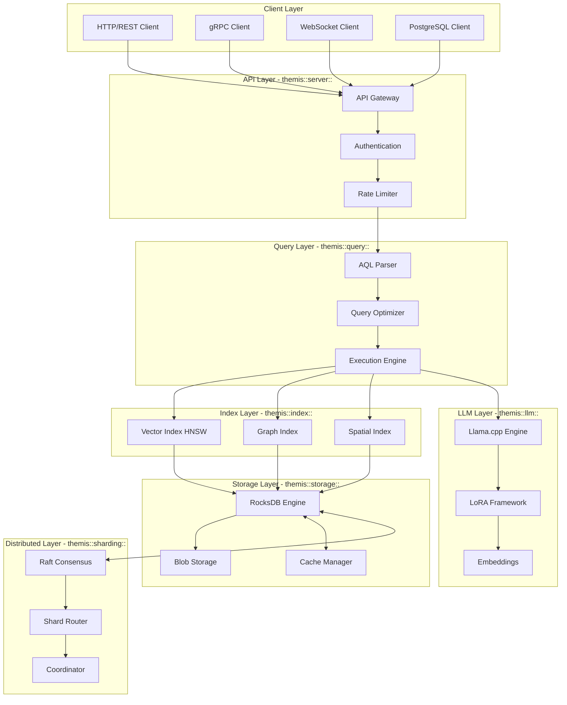
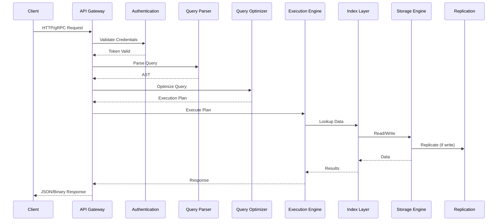
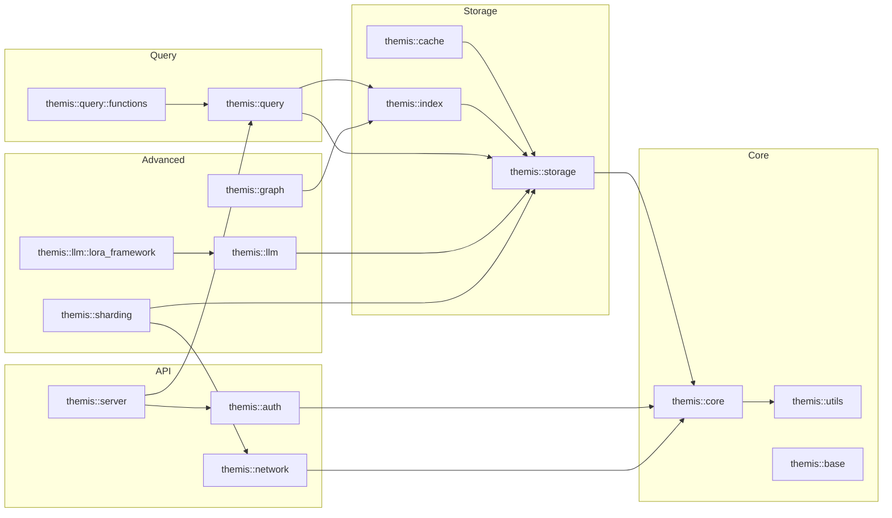

# ThemisDB Architecture Documentation

## Overview

ThemisDB is a high-performance, multi-model database system that integrates relational, graph, vector, and document models with native AI/LLM capabilities. The architecture is organized into modular, namespace-organized components that work together to provide a complete enterprise database solution.

**Core Principles:**
- **Modularity**: Optional components, selectable at build time (MINIMAL, COMMUNITY, ENTERPRISE, HYPERSCALER editions)
- **Layered Architecture**: Clear separation between API, Query, Storage, and Distributed concerns
- **Namespace Organization**: Logical grouping using C++ namespaces (themis::*)
- **High Performance**: GPU acceleration, SIMD optimizations, adaptive indexing
- **Enterprise Ready**: ACID transactions, encryption, audit logging, observability

---

## Main Directory Structure

### `/src/` - Implementation (62 integrated modules)

| Directory | Purpose | Key Classes |
|-----------|---------|-------------|
| **acceleration/** | GPU & hardware backends (CUDA, HIP, Vulkan, OpenCL); AI hardware dispatcher with NPU priority chain | CudaBackend, HipBackend, VulkanBackend, AiHardwareDispatcher |
| **analytics/** | Process mining, OLAP, diff engine, NLP analysis, multi-stream joins | OlapEngine, DiffEngine, ProcessAnalyzer, HashJoin, IntervalJoin |
| **api/** | GraphQL API, HTTP server setup | GraphQLAPI |
| **aql/** | AQL-specific handlers and assistant functions | LlmAqlHandler, DocsAssistant |
| **auth/** | Authentication (JWT, GSSAPI, MFA) | JWTValidator, GSSAPIAuthenticator |
| **base/** | Core module loader and initialization | ModuleLoader |
| **cache/** | Semantic caching, query caching, embedding caching, singleflight coalescing | SemanticCache, AdaptiveQueryCache, RequestCoalescer |
| **cdc/** | Change Data Capture and changefeeds | ChangeFeed, ChangeBuffer |
| **chaos/** | Fault injection framework for chaos engineering | FaultInjector, ChaosScheduler |
| **chimera/** | Adapter factory for database compatibility | ThemisDBAdapter, IDatabaseAdapter |
| **config/** | Backward-compatible config path resolution, LRU caching, JSON Schema validation | ConfigPathResolver, ConfigSchemaValidator, ConfigAuditLog |
| **content/** | Multimodal ingestion (PDF, images, audio, video, CAD) | ContentManager, AsyncIngestionWorker |
| **core/** | Security initialization, concerns context (logging, tracing) | ConcernsContext, SecurityInit |
| **distributed_knowledge/** | Federation flows: adapter capability gossip, federated LoRA gradient aggregation, cross-shard RAG merge, cross-shard RLAIF feedback sync; zero raw-data egress | AdapterCapabilityAnnouncement, LoRAFederationCoordinator, FederatedRAGMerger, CrossShardFeedbackSync |
| **ethics_ai/** | Ethical discourse engine, 5-dimension decision scoring, RAG context retrieval | EthicsEvaluator, EthicalDiscourseEngine, RAGContextEngine |
| **exporters/** | Data export in various formats | JsonlLlmExporter |
| **failover/** | Automatic failover orchestration and disaster recovery plan execution. ✅ **Phase 2-3 complete (2026-07-29):** real canTransition() state machine, preventSplitBrain() fail-closed, DR executePlan concurrency guard, batch stats, emitDiagnostic() helper, diagnostics framework. Tests: P23-01..08. Benchmarks: FP23-01..06 gates (latency ≤200µs). | AutoFailoverManager, DisasterRecoveryOrchestrator |
| **geo/** | Geospatial query processing and indexing. ✅ **Phase 1-6 hardening in progress:** GIS query optimization, CUDA distance kernels, containment checks, spatial filtering with GPU acceleration. | SpatialBackend, GpuBackend |
| **governance/** | Policy engine, compliance, versioning | PolicyEngine, ComplianceReporter |
| **graph/** | Query planning, traversal (parallel/distributed/GPU), constraints, semantic reasoning, tensor-fingerprint utilities. ✅ **L0 VERIFIED: 0 gaps (all 9 findings reclassified as defensive patterns; production-ready)**. | GraphQueryOptimizer, PathConstraints, DistributedGraph, KnowledgeGraphReasoner |
| **gpu/** | GPU-specific memory and acceleration | GpuMemoryManager |
| **importers/** | Data import (PostgreSQL, MySQL/MariaDB, etc.) | PostgresImporter, MysqlImporter |
| **index/** | Vector indexing (HNSW, quantization), graph indices, secondary indices with ACID | VectorIndex, GraphIndex, HnswIndex, SecondaryIndex |
| **ingestion/** | Multi-source data intake (filesystem, HuggingFace, REST API), rate limiting, checkpointing | IngestionManager, FileSystemIngester, HuggingFaceConnector |
| **llama_cpp/** | llama.cpp plugin — streaming inference, batch inference, LoRA, PluginManager hot-plug | LlamaCppPlugin, ILLMPlugin |
| **llm/** | LLM integration, inference, LoRA, embeddings, vision | EmbeddedLlm, LoraFramework, FlashAttention |
| **maintenance/** | Centralized DB maintenance orchestration: cron scheduling, maintenance windows, health aggregation, MVCC cleanup, storage compaction | DatabaseMaintenanceOrchestrator, MaintenanceRegistry, MvccCleanupHandler, StorageCompactionHandler |
| **metadata/** | Schema management | SchemaManager |
| **network/** | Wire protocol, socket management, io_uring batched send | WireProtocolServer, IoUringBatchedSender |
| **observability/** | Metrics, profiling, alerting | MetricsCollector, QueryProfiler |
| **onnx_clip/** | ONNX CLIP plugin for image analysis with multi-backend (CPU/CUDA/DirectML/TensorRT) | ONNXClipPlugin, IImageAnalysisBackend |
| **performance/** | Advanced data structures (RCU, LIRS, lock-free buffers, lock-free histograms) | PerformanceOptimizations, LockFreeHistogram, LirsCache |
| **plugins/** | Plugin system, hot-plugging, RPC interfaces | PluginManager, PluginRegistry |
| **process/** | BPMN 2.0, EPK, VCC-VPB process model management; LLM descriptors; Graph-RAG for Verwaltungsvorgänge. ✅ **Phase 1-6 complete (2026-08-06):** 101 files, 33,106+ LOC, 87 acceptance criteria, 42 benchmark gates, 72+ test cases. Production-ready. | ProcessModelManager, BpmnSerializer, EpkSerializer, ProcessLinker, ProcessGraphRag |
| **projects/** | Project management layer: lifecycle state machine, snapshot versioning, structural diff/merge, template instantiation, collaboration session management | ProjectLifecycle, ProjectVersioning, ProjectDiff, ProjectMerge, ProjectTemplate, CollaborationManager |
| **prompt_engineering/** | Prompt template lifecycle, version control, A/B testing, self-optimization, injection detection | PromptManager, PromptOptimizer, SelfImprovementOrchestrator, PromptInjectionDetector |
| **query/** | AQL parser, optimizer, execution engine | QueryEngine, AqlParser, QueryOptimizer |
| **rag/** | RAG evaluation (faithfulness, relevance, bias detection) | RagJudge, CoherenceEvaluator |
| **replication/** | Multi-master replication | ReplicationManager |
| **rpc_grpc/** | gRPC server plugin with mTLS and fail-closed TLS | GRPCServer, GRPCPlugin |
| **scheduler/** | Task scheduling, retention management | TaskScheduler, HybridRetentionManager |
| **search/** | Hybrid search (vector + full-text) | HybridSearch |
| **security/** | Encryption, key management, PKI, RBAC, audit | RbacManager, FieldEncryption, KeyProvider |
| **server/** | HTTP/gRPC servers, 40+ API handlers, rate limiting, tenant management | HttpServer, ApiGateway, QueryApiHandler, RateLimiter, TenantManager |
| **sharding/** | Horizontal scaling, consensus (Raft/Paxos/Gossip) | ShardRouter, RaftConsensus, DistributedCoordinator |
| **stable_diffusion/** | Stable Diffusion image generation plugin with content-policy sanitizer | SDGenerator, SDPromptSanitizer, IImageGenerationBackend |
| **storage/** | RocksDB wrapper, compression, blob storage, transactions, streaming ingest, columnar cache | StorageEngine, BlobStorageManager, StreamingIngestManager, ColumnarCache |
| **temporal/** | Conflict resolution for temporal data; LZ4 compression for temporal histories | TemporalConflictResolver, TemporalCompressor |
| **themis/** | Core framework: build info, edition management, license validation, secure module loading (Linux/Windows), Wire Protocol V2 | EditionManager, ModuleLoader, ModuleSecurityVerifier, WireProtocolServer |
| **timeseries/** | Time series compression (Gorilla), aggregates, retention, streaming cursor, batch writes | TimeSeriesManager, GorillaEncoder, GorillaDecoder, TsStreamCursor |
| **toolbox/** | System-wide integration layer bridging ingestion pipeline with content storage; process-global IngestionToolbox registry for all modules | IngestionToolbox, ToolboxBuilder, ContentToolboxBridge, ToolboxRegistry |
| **training/** | Domain-specific LLM fine-tuning, LoRA adapter management, knowledge graph enrichment | LegalAutoLabeler, IncrementalLoRATrainer, KnowledgeGraphEnricher |
| **transaction/** | ACID transactions, SAGA pattern, branching | TransactionManager, SagaManager |
| **updates/** | Hot reload, manifest management, version control. ✅ **Phase 1-6 hardening in progress:** error codes [7400-7499], DiagnosticEmitter listener pattern, ErrorContext JSON serialization, rollback with checkpoints, coordinated updates (reverse-sequence, leader-last). Tests: 118 focused tests, 32 test refs. | HotReloadEngine, ReleaseManifest |
| **user_storage_encrypted/** | Encrypted per-user storage via GocryptFS with Argon2id KDF and key rotation | GocryptfsBackend, KeyRotationScheduler |
| **utils/** | Logging, PII detection, compression, UUID v7, streaming ZSTD | Logger, PiiDetector, Serialization, generate_uuid_v7, zstd_compress_stream |
| **voice/** | Voice assistant integration | VoiceAssistant |
| **whisper/** | Whisper STT plugin for audio transcription via whisper.cpp | WhisperPlugin, WhisperCppTranscriber |

### `/include/` - Public Headers

Headers organized by component with consistent namespace patterns covering query engines, storage, sharding, LLM frameworks, indexing, security, servers, content processing, and governance.

---

## Architectural Layers

### 1. **API & Protocol Layer** (Server Tier)
**Namespace:** `themis::server::*`

Handles multiple protocol frontends:
- **HTTP/2/3**: REST API, GraphQL endpoint
- **gRPC**: Binary protocol for high-performance clients
- **WebSocket**: Real-time streaming and subscriptions
- **PostgreSQL Wire Protocol**: PostgreSQL client compatibility
- **MQTT**: IoT device integration
- **Binary Wire Protocol**: Custom high-performance protocol

**Key Components:**
- 40+ specialized API handlers for different domains (query, storage, LLM, geo, graph, etc.)
- API Gateway with authentication, rate limiting (V1/V2), load shedding
- Tenant management with resource quotas and isolation
- SSE connection manager for changefeed streaming with rate limits
- Request routing and protocol translation

### 2. **Query Processing Layer**
**Namespace:** `themis::query::*`

Complete SQL-like query processing pipeline:

```
Request → Parser → Translator → Optimizer → Executor → ResultStream
```

**Features:**
- **AQL Parser**: Parse Advanced Query Language queries
- **Query Optimizer**: Cost-based optimization with learned models
- **Execution Engine**: Streaming execution with pipelining
- **100+ Built-in Functions**: Across 12 categories (vector, graph, geo, string, math, etc.)
- **CTE Support**: Common Table Expressions with caching
- **Window Functions**: Ranking, aggregation over partitions
- **UDF Support**: User-defined functions

**Function Categories:**
- Vector operations (similarity, embeddings)
- Graph algorithms (traversal, shortest path, community detection)
- Geospatial (distance, containment, spatial operations)
- String manipulation (concatenation, regex, NLP)
- Mathematical (arithmetic, statistical)
- Relational (joins, aggregations, window functions)
- Array operations
- Date/time functions
- AI/ML functions
- Ethics functions (fairness metrics, bias detection)
- Security functions (encryption, hashing)
- LoRA-specific operations

### 3. **Index & Vector Layer**
**Namespace:** `themis::index::*`

Advanced indexing for multi-model data:

**Vector Indexing:**
- HNSW (Hierarchical Navigable Small World) index
- GPU-accelerated vector search (CUDA, HIP, Vulkan)
- Quantization support (product quantization, scalar quantization)
- Faiss integration for large-scale vector search
- Hybrid search combining vector and full-text

**Graph Indexing:**
- Property graph index
- Path constraint optimization
- Community detection indices

**Spatial Indexing:**
- R-tree for 2D/3D spatial queries
- H3 hexagonal hierarchical indexing
- GPU-accelerated spatial operations

### 4. **LLM Integration Layer**
**Namespace:** `themis::llm::*`

Native large language model capabilities integrated directly into the database:

**Core Components:**
- **EmbeddedLlm**: Native llama.cpp integration for inference
- **LoRA Framework**: Multi-GPU training with NCCL/RCCL
- **Flash Attention**: Optimized attention mechanisms (CUDA, HIP, Vulkan)
- **Vision Processing**: Image and video understanding, CLIP integration
- **RAG Evaluation**: Faithfulness, coherence, relevance, bias detection

**Features:**
- Async inference engine with continuous batching
- Paged KV-cache for memory efficiency
- Prefix caching for repeated prompts
- Adaptive VRAM allocation
- Mixed precision training (FP16, BF16, INT8)
- Quantized model support (GGUF format)
- Grammar-constrained generation
- Multi-LoRA adapter management
- Model hot-swapping
- Ethical guidelines enforcement

**LoRA Framework Components (40+):**
- Multi-GPU distributed training
- Gradient checkpointing
- Mixed precision optimization
- Quantization-aware training
- Adaptive batching
- Resource profiling
- GPU memory management
- Model compatibility checks
- Audit logging
- Feedback collection

### 5. **Storage Layer**
**Namespace:** `themis::storage::*`

Robust persistent storage built on RocksDB:

**Features:**
- RocksDB-based key-value store
- Compression (LZ4, Zstd, Snappy)
- Field-level encryption
- Blob storage backends:
  - S3-compatible storage
  - Azure Blob Storage
  - WebDAV
  - Local filesystem
- Erasure coding for redundancy
- Write-ahead logging (WAL)
- Snapshot isolation

**Storage Engine:**
- Column families for data organization
- Bloom filters for fast lookups
- LSM tree optimization
- Compaction strategies
- Cache management

### 6. **Distributed & Sharding Layer**
**Namespace:** `themis::sharding::*`

Horizontal scaling and distributed coordination:

**Consensus Algorithms:**
- **Raft**: Leader-based consensus for strong consistency
- **Paxos**: Leaderless consensus for fault tolerance
- **Gossip**: Eventual consistency for high availability

**Features:**
- Cross-shard transactions
- Distributed query execution
- Cluster management
- Health monitoring
- Automatic failover
- Data rebalancing
- Geo-sharding support

**Components:**
- ShardRouter: Query routing to responsible shards
- DistributedCoordinator: Cluster state management
- ConsensusFactory: Pluggable consensus implementations
- HealthMonitor: Node health tracking

### 7. **Transaction Layer**
**Namespace:** `themis::transaction::*`

ACID guarantees for reliable data operations:

**Features:**
- MVCC (Multi-Version Concurrency Control)
- Snapshot isolation
- SAGA pattern for distributed transactions
- Transaction branching
- Versioning and time-travel queries
- Optimistic concurrency control
- Deadlock detection
- Automatic rollback on failure

**Transaction Manager:**
- Begin/commit/rollback operations
- Lock management
- Conflict resolution
- Transaction log
- Recovery mechanisms

### 8. **Content & Data Processing Layer**
**Namespace:** `themis::content::*`

Multimodal data ingestion and processing:

**Supported Formats:**
- **Documents**: PDF, Word, Excel, PowerPoint
- **Images**: JPEG, PNG, TIFF, WebP
- **Audio**: MP3, WAV, FLAC
- **Video**: MP4, AVI, MKV
- **CAD**: DWG, DXF, STL
- **Archives**: ZIP, TAR, GZ

**Features:**
- Async processing pipelines
- Bulk upload support
- Content version management
- Metadata extraction (ML-based)
- Document classification
- Text extraction (OCR)
- Image analysis
- Audio transcription

### 9. **Analytics & Observability Layer**
**Namespace:** `themis::analytics::*, themis::observability::*`

Business intelligence and system monitoring:

**Analytics:**
- OLAP queries with columnar processing
- Process mining and workflow analysis
- Diff engine for change analysis
- NLP-based text analytics
- Statistical analysis functions

**Observability:**
- Metrics collection (Prometheus-compatible)
- Query profiling
- Performance monitoring
- Alerting system
- Distributed tracing (OpenTelemetry)
- Log aggregation
- Health checks

### 10. **Governance & Compliance Layer**
**Namespace:** `themis::governance::*`

Policy enforcement and regulatory compliance:

**Features:**
- Policy engine for data governance
- Compliance reporting (GDPR, HIPAA, SOC2)
- Data lineage tracking
- Version control for schema and policies
- Automated policy reviews
- Audit trail
- Data retention policies
- PII detection and masking

### 11. **Configuration & Ingestion Layer**
**Namespaces:** `themis::config::*, themis::ingestion::*`

Infrastructure for configuration management and data intake:

**Config:**
- Backward-compatible legacy-to-new config path resolution (50+ mapped paths)
- LRU cache with configurable capacity and TTL for resolved paths
- Path traversal prevention and symlink escape detection
- JSON Schema (Draft 7) validation for YAML/JSON configuration files
- Typed exception hierarchy (`ConfigNotFoundException`, `InvalidPathException`)
- Deprecation metadata with migration guide URLs per path
- Prometheus metrics export via `/metrics` endpoint

**Ingestion:**
- Multi-source document intake: filesystem, HuggingFace datasets, generic REST APIs
- Parallel source orchestration via thread pool with configurable concurrency
- Token-bucket rate limiting per source
- Incremental checkpoint-based ingestion (skip already-processed records)
- Quarantine queue for persistently failing documents with per-record retry
- Dry-run mode for pipeline validation without database writes
- Binary MIME detection (PDF, DOCX) before content dispatch
- Prometheus-compatible throughput and error metrics

### 12. **Prompt Engineering & Training Layer**
**Namespaces:** `themis::prompt_engineering::*, themis::training::*`

Lifecycle management for LLM prompts and domain-specific fine-tuning adapters:

**Prompt Engineering:**
- Template CRUD with RocksDB persistence and YAML bulk-load
- Git-like version control: branches, commits, diffs, rollback
- Iterative prompt optimization via meta-prompts and feedback loops
- A/B testing with statistical significance (Welch's t-test / normal CDF)
- Self-improvement orchestrator: background thread auto-detects underperforming templates
- Prompt injection detection and sanitization (10+ built-in patterns)
- Prometheus metrics with crash-safe snapshot/restore
- Integration façade combining all subsystems

**Training:**
- `LegalAutoLabeler`: NLP modality extraction from domain documents (legal, multi-language)
- `IncrementalLoRATrainer`: LoRA adapter training with checkpoint/resume, configurable rank/alpha/lr
- `KnowledgeGraphEnricher`: AQL-based context enrichment via graph traversal
- Adapter version management: deploy, rollback, traffic splitting
- Confidence gating for human review of low-confidence training samples
- Pimpl pattern for ABI stability across all components

---

---

## Module Classification (Core, Integrated Modules, Plugins)

For a comprehensive classification of all 62 modules and their architectural tier assignment, see:

**Primary:** [`ai_context/ARCHITECTURE_CLASSIFICATION.md`](ai_context/ARCHITECTURE_CLASSIFICATION.md)  
**Companion:** [`ai_context/MODULES_AND_NAMESPACES.md`](ai_context/MODULES_AND_NAMESPACES.md) (with tier, namespace, and plugin version columns)  
**Plugin Guide:** [`plugins/ARCHITECTURE.md`](plugins/ARCHITECTURE.md) (T5 public/private plugin architecture)

**Quick Reference:**
- **T0 Core** (5 modules): base, core, plugins, themis, utils
- **T1–T2 Engine** (7 modules): aql, cache, execution, index, metadata, query, storage
- **T3–T4 Infrastructure** (50 modules): all other `src/` modules
- **T5 Plugins** (14 public + 4 Wave-1 private): public plugins in `plugins/`, private submodules in `plugins/private/`

Key insights:
- Some modules have both integrated (`src/`) and plugin versions for gradual externalization
- Wave-1 private plugins (ethics_ai, user_storage_encrypted, importers, llm_wiki) are enterprise-exclusive
- Public plugins are optional runtime extensions; core integrated modules are always built
- Integrated fallback ensures Community/Minimal editions don't require runtime plugin loading

---

## Security & Hardening Tiering Model (Core Module -> Plugin)

To make security ownership and hardening requirements explicit, ThemisDB uses a
strict tier model from trusted core modules to untrusted plugin boundaries.

### Tier Definitions

| Tier | Scope | Typical Modules | Trust Level | Blast Radius |
|---|---|---|---|---|
| **T0: Trusted Core** | Minimal trusted computing base, bootstrapping, memory/lifecycle primitives | `src/core/`, `src/base/`, `src/themis/`, `src/utils/` | Highest | System-wide compromise risk |
| **T1: Security & Platform Services** | Identity, cryptography, policy, config validation, audit | `src/security/`, `src/auth/`, `src/governance/`, `src/config/` | Very high | Cross-module security policy bypass |
| **T2: Data Plane Engines** | Query, transaction, storage, index, sharding/replication logic | `src/query/`, `src/storage/`, `src/index/`, `src/transaction/`, `src/sharding/`, `src/replication/` | High | Data corruption, consistency and integrity impact |
| **T3: Interface & Protocol Edge** | External protocol handling and request ingress | `src/server/`, `src/network/`, `src/rpc_grpc/`, `src/api/`, `src/cdc/` | Medium | Remote attack surface and tenant boundary violations |
| **T4: Managed Extension Runtime** | In-tree feature extensions with controlled interfaces | `src/llm/`, `src/llama_cpp/`, `src/whisper/`, `src/stable_diffusion/`, `src/content/`, `src/onnx_clip/` | Medium-low | Feature-domain scoped, can escalate if guardrails fail |
| **T5: Plugin Boundary (Least Trusted)** | Dynamically loaded or remotely controlled plugin code and adapters | `src/plugins/`, selected adapters in `adapters/` | Lowest | Arbitrary code execution within plugin sandbox scope |

### Dependency and Privilege Rules (Mandatory)

1. **One-way dependency direction:** Higher-numbered tiers may depend on lower-numbered tiers; lower tiers must not depend on higher tiers.
2. **No direct T5 -> T0/T1 privileged calls:** Plugins interact via brokered interfaces (`PluginManager`, RPC contracts, policy checks).
3. **Security mediation at boundaries:** Every T3/T4/T5 entry path must pass authentication, authorization, input validation, rate limits, and audit hooks.
4. **Least privilege by default:** Capabilities must be explicitly granted and denied by default (network, filesystem, model loading, data export).
5. **Fail-closed behavior:** On policy/config/auth uncertainty, requests must be rejected rather than downgraded.

### Hardening Baseline per Tier

| Tier | Required Security Controls | Hardening Requirements | Release Gate Evidence |
|---|---|---|---|
| **T0** | Memory-safety review, strict ownership/lifetime validation, anti-tamper bootstrap checks | Warnings-as-errors, UB/sanitizer clean paths where supported, deterministic startup invariants | Security maintainer sign-off + focused unit/integration tests |
| **T1** | Cryptographic policy enforcement, key-material isolation, immutable audit trail, RBAC enforcement | Production-mode gating (`THEMIS_PRODUCTION_MODE`), no insecure fallback in production, explicit error taxonomy | Security regression suite + audit evidence in `audit/` |
| **T2** | Transaction integrity, input/schema validation, secure defaults in persistence/indexing | Safe failure semantics, WAL/recovery correctness, resource limits and quota enforcement | CTest coverage for recovery/conflict/security-relevant paths |
| **T3** | Protocol authentication, request validation, DoS/rate limiting, tenant isolation | TLS/mTLS profile checks, strict parser limits, bounded request/body/stream settings | API security tests + protocol-specific focused tests |
| **T4** | Model/plugin operation policy checks, content sanitization, output filtering | Runtime capability gates, bounded resource budgets, deterministic fallback behavior | Feature security tests + policy conformance checks |
| **T5** | Signature verification, sandboxing, capability-scoped RPC, provenance checks | No implicit trust of plugin manifests, explicit allowlist/denylist, kill-switch support | Plugin verification tests + signed artifact validation |

### Promotion and Change Management

- Any component moving toward a lower-trust tier (for example, from T4 to T5) must include an explicit threat model update and new boundary tests.
- Any component requiring higher trust (for example, T3 -> T2) requires architecture review plus security maintainer approval.
- Public interfaces crossing tier boundaries must document auth model, input contract, error behavior, and audit events.

This tiering is normative for architecture changes and complements the controls in [SECURITY.md](SECURITY.md), [AUDIT.md](AUDIT.md), and [GOVERNANCE.md](GOVERNANCE.md).

---

## Namespace Organization

### Hierarchy

```
themis::                          # Primary root namespace (most components)
themisdb::                        # Secondary root namespace (sharding, replication, some query functions)
├── query::
│   ├── functions::               # Query functions (12+ categories)
│   │   ├── vector_functions
│   │   ├── graph_functions
│   │   ├── geo_functions
│   │   ├── ethics_functions
│   │   └── [8+ more categories]
│   ├── parser::                  # AQL parser
│   └── optimizer::               # Query optimization
├── llm::
│   ├── lora_framework::          # Multi-GPU LoRA training
│   │   ├── cuda::                # CUDA kernels
│   │   ├── hip::                 # AMD HIP kernels
│   │   ├── directx::             # DirectX compute
│   │   └── vulkan::              # Vulkan compute
│   ├── attention::               # Flash Attention implementations
│   ├── applications::            # LLM applications
│   └── security::                # LLM security validators
├── sharding::                    # Consensus & distributed coordination
│   ├── raft::                    # Raft consensus
│   ├── paxos::                   # Paxos consensus
│   └── gossip::                  # Gossip protocol
├── storage::                     # RocksDB & blob storage
│   ├── blob::                    # Blob storage backends
│   └── compression::             # Compression algorithms
├── index::                       # Vector, graph, spatial indices
│   ├── vector::                  # Vector indexing
│   ├── graph::                   # Graph indexing
│   └── spatial::                 # Spatial indexing
├── server::                      # API handlers & protocols
│   ├── rpc::                     # RPC handlers
│   └── handlers::                # Protocol-specific handlers
├── security::                    # Encryption & access control
│   ├── encryption::              # Encryption services
│   ├── rbac::                    # Role-based access control
│   └── audit::                   # Audit logging
├── content::
│   └── pipeline::                # Content processing pipelines
├── governance::                  # Policy & compliance
├── acceleration::                # GPU backends
│   ├── cuda::                    # NVIDIA CUDA
│   ├── hip::                     # AMD HIP
│   ├── vulkan::                  # Vulkan compute
│   └── opencl::                  # OpenCL
├── analytics::                   # OLAP & process mining
├── transaction::                 # Transaction management
├── auth::                        # Authentication
├── cache::                       # Caching layers
├── config::                      # Config path resolution & schema validation
├── geo::                         # Geospatial operations
├── graph::                       # Graph processing
├── ingestion::                   # Multi-source data intake pipeline
├── toolbox::                     # Global ingestion service (WorkflowEngine, StepRegistry, ITextGenerationBackend)
│   └── (AQLIngestionBridge lives in aql/ and depends on toolbox/)
├── maintenance::                 # Centralized DB maintenance orchestration
├── metadata::                    # Schema management
├── network::                     # Network protocols
├── observability::               # Monitoring & metrics
├── plugins::                     # Plugin system
├── process::                     # BPMN/EPK/VCC-VPB process model management & Graph-RAG
├── prompt_engineering::          # Prompt template lifecycle & optimization
├── rag::                         # RAG evaluation
├── replication::                 # Data replication
├── scheduler::                   # Task scheduling
├── search::                      # Search functionality
├── temporal::                    # Temporal operations
├── timeseries::                  # Time series data
├── training::                    # Domain-specific LLM fine-tuning
├── updates::                     # Hot reload & updates
├── utils::                       # Utility functions
│   ├── geo::                     # Geo utilities
│   └── memory::                  # Memory utilities
└── voice::                       # Voice assistant
```

---

## Global Ingestion Toolbox

The **`themis::toolbox`** module (introduced in v1.9.0) exposes the ingestion
infrastructure as a system-wide, injectable service so that modules such as
`aql/`, `rag/`, and the query engine can access NER, entity assembly, and
workflow orchestration without creating circular dependencies.

### Components

| Class / File | Purpose |
|---|---|
| `include/toolbox/ingestion_toolbox.h` | `IngestionToolbox` — holds `WorkflowEngine`, `StepRegistry`, `ITextGenerationBackend` |
| `include/aql/aql_ingestion_bridge.h` | `AQLIngestionBridge` — connects the toolbox to AQL DML and NL→AQL translation |

### Design Constraints

1. **No reverse dependency**: `ingestion/` never imports `toolbox/` or `aql/`.
   The dependency arrow is `aql/ → toolbox/ → ingestion/`.
2. **Opt-in / additive**: All consumer-side integration is guarded by
   `if (bridge)` / `withIngestionEnrichment()` checks — no breaking change
   to existing code paths.
3. **No singleton**: `IngestionToolbox` is always injected via constructor or
   setter; `createDefault()` is a factory, not `getInstance()`.

### Usage Pattern

```cpp
// Bootstrap (server startup)
auto toolbox = themis::toolbox::IngestionToolbox::createDefault();
auto bridge  = std::make_shared<themis::aql::AQLIngestionBridge>(toolbox);
llm_handler.setIngestionBridge(bridge);

// INSERT enrichment
nlohmann::json doc = {{"text", raw_text}};
bridge->enrichInsertPayload(doc);   // appends "_entities" array

// NL→AQL context injection
auto entities = bridge->extractEntitiesForContext(nl_query);
auto ctx_str  = themis::aql::AQLIngestionBridge::buildEntityContext(entities);
handler.translateNLToAQL(nl_query, base_schema + ctx_str);
```

### Roadmap

See [`include/toolbox/ROADMAP.md`](include/toolbox/ROADMAP.md) for planned
`ToolboxBuilder`, `RAGIngestionBridge`, and observability metrics.

---

## Key Architectural Patterns

### 1. **Namespace Isolation**
Each component lives in its own namespace, preventing naming conflicts and making dependencies explicit. This enables:
- Clear component boundaries
- Easy dependency tracking
- Modular compilation
- Independent testing

### 2. **Interface-Based Design**
Critical systems use abstract interfaces enabling pluggable implementations:
- `QueryInterface`: Pluggable query engines
- `IndexInterface`: Different indexing strategies
- `StorageInterface`: Multiple storage backends
- `ConsensusInterface`: Various consensus protocols

### 3. **Consensus Abstraction**
Different replication scenarios use pluggable consensus via `ConsensusFactory`:
- **RaftConsensus**: Leader-based replication for strong consistency
- **PaxosConsensus**: Leaderless replication for fault tolerance
- **GossipConsensus**: Eventual consistency for high availability

Selection is based on:
- Consistency requirements
- Latency tolerance
- Network partition behavior
- Geographic distribution

### 4. **SAGA Pattern**
`SagaManager` coordinates multi-step distributed transactions with:
- Automatic rollback on failure
- Compensation actions for each step
- Progress tracking
- Idempotent operations
- Retry mechanisms

### 5. **Adaptive Optimization**
`QueryOptimizer` uses cost-based planning with:
- Learned cost models from query history
- Adaptive index selection based on data distribution
- Runtime plan adjustments
- Statistics collection
- Cardinality estimation

### 6. **Plugin Architecture**
`PluginManager` supports dynamic loading with:
- Hot-reloading without downtime
- Versioning and compatibility checks
- Sandboxed execution
- Plugin discovery
- RPC interface for plugin communication

Types of plugins:
- Content processors
- LLM models and adapters
- Custom query functions
- Storage backends
- Authentication providers

---

## Request Flow

### Complete Request Path

```
Client (HTTP/gRPC/WebSocket/MQTT)
    ↓
┌─────────────────────────────────────┐
│  API Gateway & Middleware           │
│  - Authentication (JWT/GSSAPI/MFA)  │
│  - Rate Limiting                    │
│  - Load Shedding                    │
│  - Request Logging                  │
└─────────────────────────────────────┘
    ↓
┌─────────────────────────────────────┐
│  Query Parser (AqlParser)           │
│  - Lexical analysis                 │
│  - Syntax parsing                   │
│  - Semantic validation              │
└─────────────────────────────────────┘
    ↓
┌─────────────────────────────────────┐
│  Query Optimizer                    │
│  - Cost-based optimization          │
│  - Index selection                  │
│  - Join ordering                    │
│  - Predicate pushdown               │
└─────────────────────────────────────┘
    ↓
┌─────────────────────────────────────┐
│  Execution Engine                   │
│  - Operator pipeline                │
│  - Result streaming                 │
└─────────────────────────────────────┘
    ↓
        ┌────────────────┐
        │ Routing?       │
        │ Local/Remote   │
        └────────────────┘
          ↓           ↓
    [Local]      [Remote Shard]
          ↓           ↓
    ┌──────────────────────┐
    │  Index Selection     │
    │  - Vector (HNSW)     │
    │  - Graph             │
    │  - Spatial (R-tree)  │
    │  - or Direct Storage │
    └──────────────────────┘
          ↓
    ┌──────────────────────┐
    │  Storage Engine      │
    │  (RocksDB)           │
    │  + Cache Layer       │
    └──────────────────────┘
          ↓
    ┌──────────────────────┐
    │  Replication         │
    │  Raft/Paxos/Gossip   │
    └──────────────────────┘
          ↓
    ┌──────────────────────┐
    │  Persistence         │
    │  (Disk + WAL)        │
    └──────────────────────┘
```

### Query Execution Flow Details

1. **Request Reception**: Protocol-specific server receives request
2. **Authentication**: Validate credentials, check permissions
3. **Rate Limiting**: Enforce request rate limits per client (V1 token bucket or V2 priority lanes)
4. **Tenant Quota Check**: Verify tenant resource quotas (connections, queries, storage)
5. **Parsing**: Convert query string to AST (Abstract Syntax Tree)
6. **Validation**: Check schema, permissions, syntax
7. **Optimization**: Generate optimal execution plan
8. **Execution**: Execute plan with pipelining
9. **Index Usage**: Utilize appropriate indices for fast lookups
10. **Storage Access**: Read/write data from/to RocksDB
11. **Replication**: Replicate writes to other nodes (if configured)
12. **Result Formatting**: Convert internal format to requested format
13. **Response**: Send results back to client

### Resource Limits & Protection

ThemisDB implements comprehensive resource limits to ensure system stability and fair resource allocation:

**Rate Limiting:**
- **V1 (Legacy)**: Token bucket with per-IP and per-user limits
- **V2 (Preferred)**: Priority lanes (HIGH/NORMAL/LOW) for VIP client support
- Configurable burst capacity and sustained rates
- Automatic idle client cleanup

**Tenant Quotas:**
- Per-tenant resource isolation (storage, documents, collections)
- Connection limits (default: 50 per tenant)
- Concurrent query limits (default: 100 per tenant)
- Rate limits per tenant (default: 1000 req/s)
- Enforced at HTTP server and API Gateway layers

**SSE/Changefeed Limits:**
- Per-connection rate caps (max events/second)
- Buffer limits (default: 1000 events per connection)
- Heartbeat mechanism (15s interval) to prevent timeouts
- Configurable overflow policy (drop oldest/newest)

**Connection Limits:**
- Max concurrent requests (default: 1000)
- HTTP/2 stream limits (default: 100)
- Request body size limits
- Load shedding at 90% capacity

See [RESOURCE_LIMITS_GUIDE.md](docs/RESOURCE_LIMITS_GUIDE.md) for detailed configuration and best practices.

---

## Edition Differences

ThemisDB offers different build editions to suit various deployment scenarios:

### **MINIMAL**
Basic database functionality without advanced features.

**Components:**
- Core query engine
- Storage layer (RocksDB)
- Basic indexing
- HTTP API
- Authentication

**Use Cases:**
- Development and testing
- Embedded applications
- Resource-constrained environments

### **COMMUNITY**
Adds replication and basic AI capabilities.

**Additional Components:**
- Raft replication
- llama.cpp LLM integration
- Vector indexing (CPU-only)
- GraphQL API
- Audit logging

**Use Cases:**
- Small to medium deployments
- Basic AI workloads
- Open-source projects

### **ENTERPRISE**
Full-featured edition with advanced AI and security.

**Additional Components:**
- GPU acceleration (CUDA, HIP, Vulkan)
- LoRA training framework
- Field-level encryption
- RBAC and MFA
- Governance and compliance tools
- Paxos and Gossip consensus
- Change Data Capture
- Content processing (all formats)
- Advanced observability

**Use Cases:**
- Production deployments
- Regulated industries
- Complex AI workloads
- Multi-region deployments

### **HYPERSCALER**
Maximum scale and resilience for cloud deployments.

**Additional Components:**
- GPU erasure coding
- Predictive failure detection
- Geo-sharding with cross-region coordination
- Advanced load balancing
- Automated scaling
- Cost optimization

**Use Cases:**
- Cloud-native deployments
- Global scale applications
- Mission-critical systems
- Multi-cloud strategies

**Build Configuration:**
Editions are selected via CMake:
```bash
cmake -B build -DTHEMISDB_EDITION=ENTERPRISE
```

---

## Performance Characteristics

### Benchmarks (Single Node)

| Operation | Throughput | Latency (p99) |
|-----------|-----------|---------------|
| Writes | 45,000 ops/s | 8ms |
| Reads | 120,000 ops/s | 2ms |
| Vector Search (CPU) | 5,000 queries/s | 15ms |
| Vector Search (GPU) | 25,000 queries/s | 3ms |
| Graph Traversal | 10,000 queries/s | 10ms |

### Scalability

- **Horizontal Scaling**: Linear scale-out to 100+ nodes
- **Storage**: Petabyte-scale with blob storage backends
- **Concurrent Connections**: 100,000+ with connection pooling
- **Transaction Rate**: 1M+ transactions/second (clustered)

### Optimization Techniques

- **SIMD**: Vectorized operations for data processing
- **GPU Acceleration**: CUDA, HIP, Vulkan for compute-intensive tasks
- **Lock-Free Structures**: High-concurrency data structures
- **Cache Optimization**: Multi-level caching (L1, L2, distributed)
- **Compression**: Reduces storage and network overhead
- **Pipelining**: Overlapped execution stages
- **Adaptive Indexing**: Automatic index creation based on workload

---

## Security Features

### Encryption
- **TLS 1.3**: Encrypted network communication
- **Field-Level Encryption**: Encrypt sensitive fields at rest
- **Key Management**: Integration with HSM and key vaults
- **Certificate Management**: Automatic certificate rotation

### Authentication
- **JWT**: Token-based authentication
- **GSSAPI**: Kerberos integration
- **MFA**: Multi-factor authentication
- **OAuth2/OIDC**: Third-party authentication

### Authorization
- **RBAC**: Role-based access control with fine-grained permissions
- **Column-Level Security**: Restrict access to specific columns
- **Row-Level Security**: Filter data based on user context
- **Query-Level Policies**: Enforce policies at query time

### Audit & Compliance
- **Audit Logging**: Comprehensive audit trail for all operations
- **PII Detection**: Automatic detection and masking of sensitive data
- **Compliance Reports**: GDPR, HIPAA, SOC2 reporting
- **Data Lineage**: Track data origin and transformations

### 🛡️ AI Safety Layer (Planned: Q2–Q4 2026)

KI-Agenten, die über MCP-Server oder AI Orchestrator auf ThemisDB zugreifen, werden durch
einen mehrschichtigen **AI Safety Layer** vor unkontrollierten destruktiven Operationen geschützt.

**Hintergrund:** Der Cursor-KI-Vorfall (April 2026) zeigte, dass KI-Agenten ohne geeignete
Schutzmaßnahmen Produktionsdatenbanken unwiederbringlich löschen können.

| Schicht | Name | Schutz |
|---|---|---|
| 1 | Destructive Operation Guard | Operationsklassifikation (READ_ONLY/WRITE_SAFE/DESTRUCTIVE/CRITICAL) |
| 2 | Human-in-the-Loop Gate | Approval-Workflow vor destruktiven Operationen |
| 3 | AQL Read-Only Enforcer | Blockiert Mutationen in `read-only`-deklarierten Tools |
| 4 | IntentClassifier AQL-Awareness | Erkennt AQL-native Angriffsmuster (REMOVE/DROP) |
| 5 | Pre-Operation Snapshot | Automatische Checkpoints vor genehmigten Writes |
| 6 | Environment Isolation Guard | Produktions-/Entwicklungsisolation |
| 7 | AI Session Audit Trail | Forensisch verwertbarer, manipulationssicherer KI-Log |

**Vollständige Dokumentation:** `docs/de/security/ai_safety/AI_SAFETY_ARCHITECTURE.md`
**Implementierungsplan:** `src/security/ROADMAP.md` — Phase 5 (ASL-1 bis ASL-15)
**Konfiguration:** `config/security.yaml` → `environment:` + `ai_safety:` Blöcke

---

## Root-Dokument-Abgleich (Architektur / Security / Audit / Performance)

Die folgenden Architekturannahmen sind für Root-Dokumente verbindlich und werden
in `SECURITY.md`, `AUDIT.md`, `CTEST.md`, `docs/performance/PERFORMANCE_EXPECTATIONS.md`,
`docs/performance/PERFORMANCE_OPTIMIZATION_PLAN.md` und `docs/performance/PERFORMANCE_BOTTLENECKS.md` gespiegelt:

| Kontrollpunkt | Architekturannahme | Referenzpfade |
|---|---|---|
| Produktionsmodus | Sicherheitshärtung basiert auf explizitem Production Mode (`THEMIS_PRODUCTION_MODE=1`) und produktionsspezifischer Umgebung | [SECURITY.md](SECURITY.md), [docs/production/SECURITY_POSTURE.md](docs/production/SECURITY_POSTURE.md) |
| Transportschutz | TLS 1.3 als Primärpfad, TLS 1.2 Fallback nur aus Kompatibilitätsgründen; mTLS für sensible Cluster-/WAL-Pfade | [SECURITY.md](SECURITY.md), [AUDIT.md](AUDIT.md) |
| Zugriffskontrolle | RBAC Least-Privilege und rollenbasierte Maintenance-/Admin-Gates sind Teil der Kernarchitektur | [SECURITY.md](SECURITY.md), [audit/AUDIT.md](audit/AUDIT.md) |
| Nachvollziehbarkeit | Audit-Trail ist manipulationserschwerend ausgelegt (Encrypt-then-Sign, Hash-Chain, SIEM-Anbindung) | [SECURITY.md](SECURITY.md), [audit/AUDIT.md](audit/AUDIT.md), [CTEST.md](CTEST.md) |
| Performance-Gates | Performanceziele gelten nur mit aktivierten Sicherheitskontrollen und reproduzierbaren Verifikationspfaden | [docs/performance/PERFORMANCE_EXPECTATIONS.md](docs/performance/PERFORMANCE_EXPECTATIONS.md), [docs/performance/PERFORMANCE_OPTIMIZATION_PLAN.md](docs/performance/PERFORMANCE_OPTIMIZATION_PLAN.md), [docs/performance/PERFORMANCE_BOTTLENECKS.md](docs/performance/PERFORMANCE_BOTTLENECKS.md) |

---

## Starting Points for Exploration

### For Developers

1. **Query Execution**: `include/query/query_engine.h`
   - Understand how queries are parsed, optimized, and executed

2. **Storage Layer**: `include/storage/storage_engine.h`
   - Explore RocksDB integration and storage abstractions

3. **Sharding**: `include/sharding/distributed_coordinator.h`
   - Learn about distributed query execution and coordination

4. **LLM Integration**: `include/llm/embedded_llm.h`
   - Discover native LLM capabilities

5. **API Handlers**: `include/server/*_api_handler.h`
   - See how different APIs are implemented

### For Operations

1. **Configuration**: `config/` directory
   - Server configuration, clustering setup

2. **Deployment**: `deploy/` and `helm/` directories
   - Docker, Kubernetes deployment manifests

3. **Monitoring**: `prometheus/` and `grafana/` directories
   - Metrics and dashboards

4. **Security**: `security/` directory
   - Certificate management, key configuration

### For Build System

1. **CMake Build**: `CMakeLists.txt`
   - Main build configuration

2. **Edition Selection**: `cmake/editions/`
   - Different build editions and feature flags

3. **Feature Modules**: `cmake/features/`
   - Optional feature configuration

4. **Dependencies**: `vcpkg.json`
   - Dependency management

---

## Integration Points

### Client Libraries
- **C++**: Native client
- **Python**: `themisdb-python` SDK
- **JavaScript/TypeScript**: `themisdb-js` SDK
- **Java**: JDBC driver
- **Go**: Go client library
- **Rust**: Rust client library

### External Systems
- **PostgreSQL**: Wire protocol compatibility
- **S3**: Storage backend integration
- **Prometheus**: Metrics export
- **Grafana**: Visualization dashboards
- **OpenTelemetry**: Distributed tracing
- **Kafka**: Event streaming (via CDC)

### Plugins
- Content processors (custom document formats)
- LLM models (custom models via llama.cpp)
- Authentication providers (custom auth backends)
- Storage backends (custom storage systems)

---

## Development Workflow

### Building from Source
```bash
# Clone repository
git clone https://github.com/makr-code/ThemisDB.git
cd ThemisDB

# Configure with vcpkg
cmake -B build -DCMAKE_TOOLCHAIN_FILE=vcpkg/scripts/buildsystems/vcpkg.cmake

# Build
cmake --build build -j$(nproc)

# Run tests
ctest --test-dir build
```

### Cross-Compilation Validation Rules

Cross-compilation configure runs enforce a strict consistency check in
`cmake/validation/CrossCompileValidation.cmake`:

- `CMAKE_CROSSCOMPILING=TRUE` requires `CMAKE_TOOLCHAIN_FILE`.
- `VCPKG_TARGET_TRIPLET` must match `CMAKE_SYSTEM_PROCESSOR` + `CMAKE_SYSTEM_NAME`
  (for example `arm64-linux`, `arm-linux`, `x64-windows`, `x64-mingw-static`).
- `CMAKE_SYSROOT` is mandatory for Linux ARM cross targets (`arm64`, `armv7`) and must exist.

The CI workflow `.github/workflows/cmake-multi-platform.yml` validates these
rules via a triplet matrix before regular build/test execution.

### Running Locally
```bash
# Start server
./build/themisdb --config config/config.yaml

# Or with Docker
docker-compose -f docker/docker-compose.yml up -d
```

### Testing
- **Unit Tests**: `tests/unit/`
- **Integration Tests**: `tests/integration/`
- **Performance Tests**: `benchmarks/`
- **Fuzz Tests**: `fuzz/`

---

## Contributing

When contributing to ThemisDB architecture:

1. **Namespace Consistency**: Follow existing namespace patterns
2. **Interface Design**: Use abstract interfaces for pluggability
3. **Documentation**: Update this file when adding major components
4. **Testing**: Add tests for new functionality
5. **Performance**: Benchmark performance-critical changes
6. **Security**: Consider security implications

See [CONTRIBUTING.md](CONTRIBUTING.md) for detailed guidelines.

---

## Visual Architecture Diagrams

### Component Interaction Diagram



### Data Flow Diagram



### Namespace Dependency Graph



---

## Dependency Management

### Core Dependencies

| Dependency | Purpose | Version | License |
|------------|---------|---------|---------|
| **RocksDB** | Storage engine | 8.x+ | Apache 2.0 |
| **Boost** | C++ libraries (ASIO, Beast) | 1.70+ | Boost |
| **llama.cpp** | LLM inference | Latest | MIT |
| **OpenSSL** | TLS/Encryption | 3.x | Apache 2.0 |
| **gRPC** | RPC framework | 1.50+ | Apache 2.0 |
| **Protobuf** | Serialization | 3.21+ | BSD |
| **FAISS** | Vector search | 1.7+ | MIT |

### Optional Dependencies (by Edition)

**COMMUNITY:**
- `libcurl` - HTTP client
- `yaml-cpp` - Configuration parsing

**ENTERPRISE:**
- **CUDA** - NVIDIA GPU acceleration
- **HIP** - AMD GPU acceleration  
- **Vulkan** - Cross-platform GPU compute
- **NCCL/RCCL** - Multi-GPU communication

**HYPERSCALER:**
- Additional cloud SDK integrations
- Advanced monitoring libraries

### Build System

```cmake
# Edition selection
cmake -B build -DTHEMIS_EDITION=ENTERPRISE

# Feature flags
-DENABLE_LLM=ON          # LLM integration
-DENABLE_GPU=ON          # GPU acceleration
-DENABLE_ENCRYPTION=ON   # Field encryption
-DENABLE_SHARDING=ON     # Distributed mode
```

See `cmake/editions/` and `cmake/features/` for detailed options.

---

## Common Development Patterns

### Adding a New Query Function

**Location:** `src/query/functions/` and `include/query/functions/`

```cpp
// 1. Define in header (include/query/functions/my_functions.h)
namespace themis::query::functions {
    
class MyFunction : public FunctionInterface {
public:
    Value execute(const std::vector<Value>& args) override;
    std::string getName() const override { return "MY_FUNC"; }
    size_t getMinArgs() const override { return 1; }
};

} // namespace themis::query::functions

// 2. Implement (src/query/functions/my_functions.cpp)
namespace themis::query::functions {

Value MyFunction::execute(const std::vector<Value>& args) {
    // Implementation
    return result;
}

} // namespace themis::query::functions

// 3. Register in function registry
REGISTER_FUNCTION(MyFunction);
```

### Adding a New API Handler

**Location:** `src/server/` and `include/server/`

```cpp
// 1. Create handler (include/server/my_api_handler.h)
namespace themis::server {

class MyApiHandler : public ApiHandlerInterface {
public:
    void handleRequest(const Request& req, Response& resp) override;
    std::string getPath() const override { return "/api/v1/myendpoint"; }
};

} // namespace themis::server

// 2. Register in server initialization
server.registerHandler(std::make_unique<MyApiHandler>());
```

### Adding a New Index Type

**Location:** `src/index/` and `include/index/`

```cpp
// 1. Implement index interface
namespace themis::index {

class MyIndex : public IndexInterface {
public:
    void insert(const Key& key, const Value& value) override;
    std::vector<Value> search(const Query& query) override;
    void remove(const Key& key) override;
};

} // namespace themis::index

// 2. Register index type
REGISTER_INDEX_TYPE("my_index", MyIndex);
```

---

## Troubleshooting Guide

### Build Issues

**Problem:** CMake configuration fails
```bash
# Solution: Update vcpkg and dependencies
cd vcpkg && git pull
./bootstrap-vcpkg.sh
./vcpkg install
```

**Problem:** Linker errors with RocksDB
```bash
# Solution: Clean and rebuild with verbose output
rm -rf build/
cmake -B build -DCMAKE_VERBOSE_MAKEFILE=ON
cmake --build build -j$(nproc) 2>&1 | tee build.log
```

### Runtime Issues

**Problem:** GPU not detected
```bash
# Check GPU availability
nvidia-smi  # NVIDIA
rocm-smi    # AMD

# Enable GPU for vector indexing in config/config.yaml
vector_index:
  use_gpu: true
```

**Problem:** Out of memory during vector indexing
```yaml
# Adjust vector index and storage cache settings in config/config.yaml
vector_index:
  # Reduce concurrency or segment size if you see OOM during indexing
  max_concurrent_builds: 4
  max_segment_size_mb: 256

rocksdb:
  # Increase block cache if you have enough RAM to reduce read amplification
  block_cache_size_mb: 2048
```

### Performance Tuning

**Query Performance:**
- Check query plan with `EXPLAIN` command
- Verify appropriate indices exist
- Monitor with `PROFILE` command
- Review slow query log

**Storage Performance:**
- Adjust RocksDB compaction settings
- Enable compression (LZ4/Zstd)
- Monitor disk I/O with `iostat`
- Check cache hit rates

**Replication Performance:**
- Tune Raft heartbeat interval
- Adjust batch size for writes
- Monitor network latency
- Use async replication for reads

---

## Glossary

| Term | Definition |
|------|------------|
| **AQL** | Advanced Query Language - ThemisDB's SQL-like query language |
| **HNSW** | Hierarchical Navigable Small World - Vector search algorithm |
| **LoRA** | Low-Rank Adaptation - Efficient LLM fine-tuning method |
| **MVCC** | Multi-Version Concurrency Control - Transaction isolation technique |
| **SAGA** | Sequence of transactions for distributed operations |
| **Raft** | Consensus algorithm for leader-based replication |
| **Paxos** | Consensus algorithm for leaderless replication |
| **KV-Cache** | Key-Value cache for LLM inference optimization |
| **Flash Attention** | Memory-efficient attention mechanism for transformers |
| **Sharding** | Horizontal data partitioning across nodes |
| **RBAC** | Role-Based Access Control |
| **CDC** | Change Data Capture - Track data modifications |
| **PITR** | Point-In-Time Recovery |
| **WAL** | Write-Ahead Log |
| **LSM** | Log-Structured Merge-tree (RocksDB storage structure) |

---

## Frequently Asked Questions

### General

**Q: What makes ThemisDB different from other databases?**  
A: Native multi-model support (relational, graph, vector, document) with integrated LLM capabilities, all with full ACID transactions.

**Q: Can I use ThemisDB without the LLM features?**  
A: Yes, LLM features are optional. Use MINIMAL or COMMUNITY editions for traditional database functionality.

**Q: Is ThemisDB production-ready?**  
A: ThemisDB is designed as a production-ready multi-model database with comprehensive testing, monitoring, and enterprise features. Currently at v1.8.0. See [CHANGELOG.md](CHANGELOG.md) for version-specific details and [README.md](README.md) for current production status.

### Architecture

**Q: How does ThemisDB handle distributed transactions?**  
A: Using the SAGA pattern with compensation actions, coordinated via Raft/Paxos consensus.

**Q: What consensus algorithms are supported?**  
A: Raft (leader-based), Paxos (leaderless), and Gossip (eventual consistency) - selectable based on requirements.

**Q: How is data partitioned across shards?**  
A: Hash-based or range-based partitioning, with support for custom partition functions.

### Performance

**Q: What are the performance characteristics?**  
A: 45K writes/s, 120K reads/s (single node). Linear scale-out to 100+ nodes. GPU acceleration provides 5x speedup for vector operations.

**Q: How much memory does ThemisDB require?**  
A: Minimum 4GB for MINIMAL edition, 16GB recommended for ENTERPRISE with LLM features.

**Q: Can ThemisDB handle petabyte-scale data?**  
A: Yes, with blob storage backends (S3, Azure) and horizontal sharding.

### Development

**Q: What languages can I use to interact with ThemisDB?**  
A: C++, Python, JavaScript/TypeScript, Java, Go, Rust - with official client libraries.

**Q: How do I contribute to ThemisDB?**  
A: See [CONTRIBUTING.md](CONTRIBUTING.md) for guidelines. Follow namespace patterns and add tests for new features.

**Q: Where can I find code examples?**  
A: Check the `examples/` directory and [online documentation](https://makr-code.github.io/ThemisDB/).

---

## Additional Resources

- **[README.md](README.md)**: Project overview and quick start
- **[QUICKSTART.md](QUICKSTART.md)**: Getting started guide
- **[CHANGELOG.md](CHANGELOG.md)**: Version history and release notes
- **[Documentation](https://makr-code.github.io/ThemisDB/)**: Full online documentation
- **[CONTRIBUTING.md](CONTRIBUTING.md)**: Contribution guidelines
- **[SECURITY.md](SECURITY.md)**: Security policies and reporting
- **[API Reference](docs/api/)**: API documentation
- **[Examples](examples/)**: Code examples and tutorials
- **[BRANCHING_STRATEGY.md](BRANCHING_STRATEGY.md)**: Git workflow guide
- **[BENCHMARK_RUNBOOK.md](docs/performance/BENCHMARK_RUNBOOK.md)**: Performance testing guide

### Acceleration Module ROADMAP Audit

The acceleration module ROADMAP (`src/acceleration/ROADMAP.md`) is subject to an
automated audit process to ensure that checkbox statuses (`[x]`, `[P]`, `[I]`,
etc.) are consistent with the actual GitHub issue state and the presence of
implementation files.

#### Running the Audit

```bash
# Unauthenticated (60 req/h rate limit, sufficient for one-off runs)
python3 scripts/acceleration_roadmap_audit.py

# Authenticated run (recommended — 5 000 req/h)
GITHUB_TOKEN=ghp_xxx python3 scripts/acceleration_roadmap_audit.py

# Pull token from gh CLI session
python3 scripts/acceleration_roadmap_audit.py --gh-cli

# Write reports to a custom directory
python3 scripts/acceleration_roadmap_audit.py --output-dir /tmp/audit
```

Reports are written to:
- `docs/audits/acceleration-roadmap-audit.json` — machine-readable
- `docs/audits/acceleration-roadmap-audit.md` — human-readable

The script exits with code `0` when no discrepancies are found, `1` when
discrepancies are detected, and `2` on fatal errors (missing file, API failure).

#### Token / Scopes

Set `GITHUB_TOKEN` (or `GH_TOKEN`) to a personal access token with at least
the `public_repo` scope.  Without a token the tool falls back to unauthenticated
requests which are rate-limited to 60 requests per hour per IP address.

#### ROADMAP Checkbox Policy

| Status | Meaning | When to use |
|---|---|---|
| `[x]` | Done | A **merged PR or commit** exists AND files are present on disk |
| `[~]` | In progress | Active work; open PR or ongoing commits |
| `[P]` | PR open | PR exists but not yet merged |
| `[I]` | Issue open | GitHub Issue is open, work not started |
| `[ ]` | Planned | Planned item; no issue yet |
| `[?]` | Blocked | Needs human decision |
| `[!]` | Unclear | Status unknown; needs investigation |

> **Rule:** A closed GitHub issue alone is **not** sufficient to mark an item `[x]`.
> The implementation files must exist in the repository.  If they do not, use `[~]`
> (in progress) or `[?]` (blocked) until the code is merged.

#### CI Integration

A GitHub Actions workflow (`.github/workflows/acceleration-roadmap-audit.yml`)
runs the audit automatically on:
- Pushes to `develop` or `community` that touch `src/acceleration/ROADMAP.md`
- Pull requests that touch `src/acceleration/**` or `ROADMAP.md`
- Manual `workflow_dispatch`

The workflow uploads the JSON and Markdown reports as artifacts and fails the
build if any discrepancies are found.

### Related Documentation

- **[00_DOCUMENTATION_INDEX.md](docs/00_DOCUMENTATION_INDEX.md)**: Complete documentation index
- **[VECTOR_INDEXING_ARCHITECTURE.md](docs/de/architecture/VECTOR_INDEXING_ARCHITECTURE.md)**: Vector search deep dive
- **[DISTRIBUTED_SHARDING_IMPLEMENTATION_SUMMARY.md](docs/ARCHIVED/implementation-summaries/DISTRIBUTED_SHARDING_IMPLEMENTATION_SUMMARY.md)**: Sharding details
- **[LLM_LORA_IMPLEMENTATION_STATUS.md](docs/en/llm/LLM_LORA_IMPLEMENTATION_STATUS.md)**: LLM integration status

---

*Last Updated: 2026-03-24 | Generated from codebase analysis*

---
Zuletzt geprueft (Root-Sync): 2026-07-27
