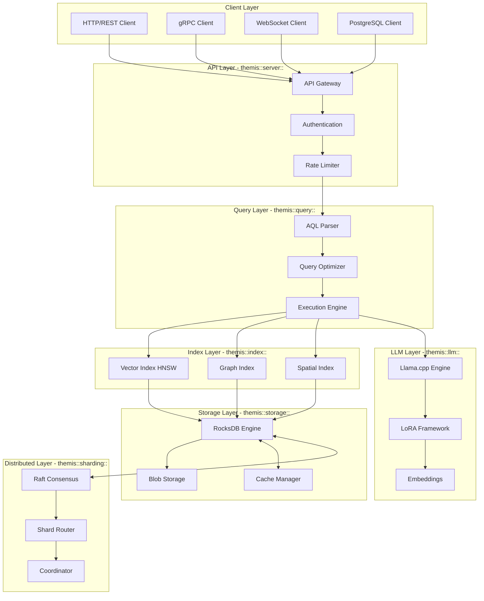
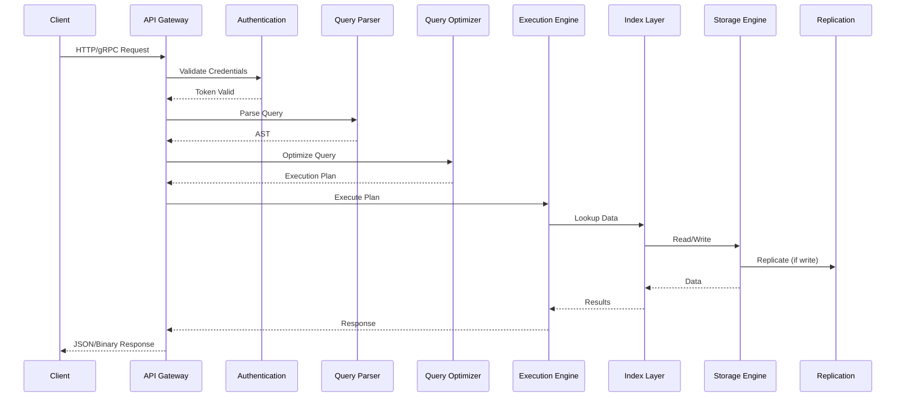
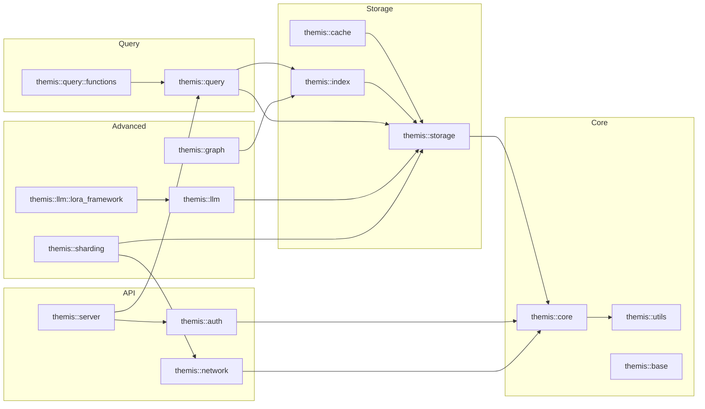

# ThemisDB Architecture Documentation

## Overview

ThemisDB is a high-performance, multi-model database system that integrates relational, graph, vector, and document models with native AI/LLM capabilities. The architecture is organized into modular, namespace-organized components that work together to provide a complete enterprise database solution.

**Core Principles:**
- **Modularity**: Optional components, selectable at build time (MINIMAL, COMMUNITY, ENTERPRISE, HYPERSCALER editions)
- **Layered Architecture**: Clear separation between API, Query, Storage, and Distributed concerns
- **Namespace Organization**: Logical grouping using C++ namespaces (themis::*)
- **High Performance**: GPU acceleration, SIMD optimizations, adaptive indexing
- **Enterprise Ready**: ACID transactions, encryption, audit logging, observability

---

## Main Directory Structure

### `/src/` - Implementation (34 Core Components)

| Directory | Purpose | Key Classes |
|-----------|---------|-------------|
| **acceleration/** | GPU & hardware backends (CUDA, HIP, Vulkan, OpenCL) | CudaBackend, HipBackend, VulkanBackend |
| **analytics/** | Process mining, OLAP, diff engine, NLP analysis | OlapEngine, DiffEngine, ProcessAnalyzer |
| **api/** | GraphQL API, HTTP server setup | GraphQLAPI |
| **aql/** | AQL-specific handlers and assistant functions | LlmAqlHandler, DocsAssistant |
| **auth/** | Authentication (JWT, GSSAPI, MFA) | JWTValidator, GSSAPIAuthenticator |
| **base/** | Core module loader and initialization | ModuleLoader |
| **cache/** | Semantic caching, query caching, embedding caching | SemanticCache, AdaptiveQueryCache |
| **cdc/** | Change Data Capture and changefeeds | ChangeFeed, ChangeBuffer |
| **chimera/** | Adapter factory for database compatibility | ThemisDBAdapter, IDatabaseAdapter |
| **content/** | Multimodal ingestion (PDF, images, audio, video, CAD) | ContentManager, AsyncIngestionWorker |
| **core/** | Security initialization, concerns context (logging, tracing) | ConcernsContext, SecurityInit |
| **exporters/** | Data export in various formats | JsonlLlmExporter |
| **geo/** | Geospatial query processing and indexing | SpatialBackend, GpuBackend |
| **governance/** | Policy engine, compliance, versioning | PolicyEngine, ComplianceReporter |
| **graph/** | Property graphs, graph indexing, path constraints | PropertyGraph, GraphIndex |
| **gpu/** | GPU-specific memory and acceleration | GpuMemoryManager |
| **importers/** | Data import (PostgreSQL, etc.) | PostgresImporter |
| **index/** | Vector indexing (HNSW, quantization), graph indices | VectorIndex, GraphIndex, HnswIndex |
| **llm/** | LLM integration, inference, LoRA, embeddings, vision | EmbeddedLlm, LoraFramework, FlashAttention |
| **metadata/** | Schema management | SchemaManager |
| **network/** | Wire protocol, socket management | WireProtocolServer |
| **observability/** | Metrics, profiling, alerting | MetricsCollector, QueryProfiler |
| **performance/** | Advanced data structures (RCU, LIRS, lock-free buffers) | PerformanceOptimizations |
| **plugins/** | Plugin system, hot-plugging, RPC interfaces | PluginManager, PluginRegistry |
| **query/** | AQL parser, optimizer, execution engine | QueryEngine, AqlParser, QueryOptimizer |
| **rag/** | RAG evaluation (faithfulness, relevance, bias detection) | RagJudge, CoherenceEvaluator |
| **replication/** | Multi-master replication | ReplicationManager |
| **scheduler/** | Task scheduling, retention management | TaskScheduler, HybridRetentionManager |
| **search/** | Hybrid search (vector + full-text) | HybridSearch |
| **security/** | Encryption, key management, PKI, RBAC, audit | RbacManager, FieldEncryption, KeyProvider |
| **server/** | HTTP/gRPC servers, 40+ API handlers | HttpServer, ApiGateway, QueryApiHandler |
| **sharding/** | Horizontal scaling, consensus (Raft/Paxos/Gossip) | ShardRouter, RaftConsensus, DistributedCoordinator |
| **storage/** | RocksDB wrapper, compression, blob storage, transactions | StorageEngine, BlobStorageManager |
| **temporal/** | Conflict resolution for temporal data | TemporalConflictResolver |
| **timeseries/** | Time series compression (Gorilla), aggregates, retention | TimeSeriesManager, GorillaEncoder, GorillaDecoder |
| **transaction/** | ACID transactions, SAGA pattern, branching | TransactionManager, SagaManager |
| **updates/** | Hot reload, manifest management, version control | HotReloadEngine, ReleaseManifest |
| **utils/** | Logging, PII detection, compression, utilities | Logger, PiiDetector, Serialization |
| **voice/** | Voice assistant integration | VoiceAssistant |

### `/include/` - Public Headers

Headers organized by component with consistent namespace patterns covering query engines, storage, sharding, LLM frameworks, indexing, security, servers, content processing, and governance.

---

## Architectural Layers

### 1. **API & Protocol Layer** (Server Tier)
**Namespace:** `themis::server::*`

Handles multiple protocol frontends:
- **HTTP/2/3**: REST API, GraphQL endpoint
- **gRPC**: Binary protocol for high-performance clients
- **WebSocket**: Real-time streaming and subscriptions
- **PostgreSQL Wire Protocol**: PostgreSQL client compatibility
- **MQTT**: IoT device integration
- **Binary Wire Protocol**: Custom high-performance protocol

**Key Components:**
- 40+ specialized API handlers for different domains (query, storage, LLM, geo, graph, etc.)
- API Gateway with authentication, rate limiting, load shedding
- Request routing and protocol translation

### 2. **Query Processing Layer**
**Namespace:** `themis::query::*`

Complete SQL-like query processing pipeline:

```
Request → Parser → Translator → Optimizer → Executor → ResultStream
```

**Features:**
- **AQL Parser**: Parse Advanced Query Language queries
- **Query Optimizer**: Cost-based optimization with learned models
- **Execution Engine**: Streaming execution with pipelining
- **100+ Built-in Functions**: Across 12 categories (vector, graph, geo, string, math, etc.)
- **CTE Support**: Common Table Expressions with caching
- **Window Functions**: Ranking, aggregation over partitions
- **UDF Support**: User-defined functions

**Function Categories:**
- Vector operations (similarity, embeddings)
- Graph algorithms (traversal, shortest path, community detection)
- Geospatial (distance, containment, spatial operations)
- String manipulation (concatenation, regex, NLP)
- Mathematical (arithmetic, statistical)
- Relational (joins, aggregations, window functions)
- Array operations
- Date/time functions
- AI/ML functions
- Ethics functions (fairness metrics, bias detection)
- Security functions (encryption, hashing)
- LoRA-specific operations

### 3. **Index & Vector Layer**
**Namespace:** `themis::index::*`

Advanced indexing for multi-model data:

**Vector Indexing:**
- HNSW (Hierarchical Navigable Small World) index
- GPU-accelerated vector search (CUDA, HIP, Vulkan)
- Quantization support (product quantization, scalar quantization)
- Faiss integration for large-scale vector search
- Hybrid search combining vector and full-text

**Graph Indexing:**
- Property graph index
- Path constraint optimization
- Community detection indices

**Spatial Indexing:**
- R-tree for 2D/3D spatial queries
- H3 hexagonal hierarchical indexing
- GPU-accelerated spatial operations

### 4. **LLM Integration Layer**
**Namespace:** `themis::llm::*`

Native large language model capabilities integrated directly into the database:

**Core Components:**
- **EmbeddedLlm**: Native llama.cpp integration for inference
- **LoRA Framework**: Multi-GPU training with NCCL/RCCL
- **Flash Attention**: Optimized attention mechanisms (CUDA, HIP, Vulkan)
- **Vision Processing**: Image and video understanding, CLIP integration
- **RAG Evaluation**: Faithfulness, coherence, relevance, bias detection

**Features:**
- Async inference engine with continuous batching
- Paged KV-cache for memory efficiency
- Prefix caching for repeated prompts
- Adaptive VRAM allocation
- Mixed precision training (FP16, BF16, INT8)
- Quantized model support (GGUF format)
- Grammar-constrained generation
- Multi-LoRA adapter management
- Model hot-swapping
- Ethical guidelines enforcement

**LoRA Framework Components (40+):**
- Multi-GPU distributed training
- Gradient checkpointing
- Mixed precision optimization
- Quantization-aware training
- Adaptive batching
- Resource profiling
- GPU memory management
- Model compatibility checks
- Audit logging
- Feedback collection

### 5. **Storage Layer**
**Namespace:** `themis::storage::*`

Robust persistent storage built on RocksDB:

**Features:**
- RocksDB-based key-value store
- Compression (LZ4, Zstd, Snappy)
- Field-level encryption
- Blob storage backends:
  - S3-compatible storage
  - Azure Blob Storage
  - WebDAV
  - Local filesystem
- Erasure coding for redundancy
- Write-ahead logging (WAL)
- Snapshot isolation

**Storage Engine:**
- Column families for data organization
- Bloom filters for fast lookups
- LSM tree optimization
- Compaction strategies
- Cache management

### 6. **Distributed & Sharding Layer**
**Namespace:** `themis::sharding::*`

Horizontal scaling and distributed coordination:

**Consensus Algorithms:**
- **Raft**: Leader-based consensus for strong consistency
- **Paxos**: Leaderless consensus for fault tolerance
- **Gossip**: Eventual consistency for high availability

**Features:**
- Cross-shard transactions
- Distributed query execution
- Cluster management
- Health monitoring
- Automatic failover
- Data rebalancing
- Geo-sharding support

**Components:**
- ShardRouter: Query routing to responsible shards
- DistributedCoordinator: Cluster state management
- ConsensusFactory: Pluggable consensus implementations
- HealthMonitor: Node health tracking

### 7. **Transaction Layer**
**Namespace:** `themis::transaction::*`

ACID guarantees for reliable data operations:

**Features:**
- MVCC (Multi-Version Concurrency Control)
- Snapshot isolation
- SAGA pattern for distributed transactions
- Transaction branching
- Versioning and time-travel queries
- Optimistic concurrency control
- Deadlock detection
- Automatic rollback on failure

**Transaction Manager:**
- Begin/commit/rollback operations
- Lock management
- Conflict resolution
- Transaction log
- Recovery mechanisms

### 8. **Content & Data Processing Layer**
**Namespace:** `themis::content::*`

Multimodal data ingestion and processing:

**Supported Formats:**
- **Documents**: PDF, Word, Excel, PowerPoint
- **Images**: JPEG, PNG, TIFF, WebP
- **Audio**: MP3, WAV, FLAC
- **Video**: MP4, AVI, MKV
- **CAD**: DWG, DXF, STL
- **Archives**: ZIP, TAR, GZ

**Features:**
- Async processing pipelines
- Bulk upload support
- Content version management
- Metadata extraction (ML-based)
- Document classification
- Text extraction (OCR)
- Image analysis
- Audio transcription

### 9. **Analytics & Observability Layer**
**Namespace:** `themis::analytics::*, themis::observability::*`

Business intelligence and system monitoring:

**Analytics:**
- OLAP queries with columnar processing
- Process mining and workflow analysis
- Diff engine for change analysis
- NLP-based text analytics
- Statistical analysis functions

**Observability:**
- Metrics collection (Prometheus-compatible)
- Query profiling
- Performance monitoring
- Alerting system
- Distributed tracing (OpenTelemetry)
- Log aggregation
- Health checks

### 10. **Governance & Compliance Layer**
**Namespace:** `themis::governance::*`

Policy enforcement and regulatory compliance:

**Features:**
- Policy engine for data governance
- Compliance reporting (GDPR, HIPAA, SOC2)
- Data lineage tracking
- Version control for schema and policies
- Automated policy reviews
- Audit trail
- Data retention policies
- PII detection and masking

---

## Namespace Organization

### Hierarchy

```
themis::                          # Primary root namespace (most components)
themisdb::                        # Secondary root namespace (sharding, replication, some query functions)
├── query::
│   ├── functions::               # Query functions (12+ categories)
│   │   ├── vector_functions
│   │   ├── graph_functions
│   │   ├── geo_functions
│   │   ├── ethics_functions
│   │   └── [8+ more categories]
│   ├── parser::                  # AQL parser
│   └── optimizer::               # Query optimization
├── llm::
│   ├── lora_framework::          # Multi-GPU LoRA training
│   │   ├── cuda::                # CUDA kernels
│   │   ├── hip::                 # AMD HIP kernels
│   │   ├── directx::             # DirectX compute
│   │   └── vulkan::              # Vulkan compute
│   ├── attention::               # Flash Attention implementations
│   ├── applications::            # LLM applications
│   └── security::                # LLM security validators
├── sharding::                    # Consensus & distributed coordination
│   ├── raft::                    # Raft consensus
│   ├── paxos::                   # Paxos consensus
│   └── gossip::                  # Gossip protocol
├── storage::                     # RocksDB & blob storage
│   ├── blob::                    # Blob storage backends
│   └── compression::             # Compression algorithms
├── index::                       # Vector, graph, spatial indices
│   ├── vector::                  # Vector indexing
│   ├── graph::                   # Graph indexing
│   └── spatial::                 # Spatial indexing
├── server::                      # API handlers & protocols
│   ├── rpc::                     # RPC handlers
│   └── handlers::                # Protocol-specific handlers
├── security::                    # Encryption & access control
│   ├── encryption::              # Encryption services
│   ├── rbac::                    # Role-based access control
│   └── audit::                   # Audit logging
├── content::
│   └── pipeline::                # Content processing pipelines
├── governance::                  # Policy & compliance
├── acceleration::                # GPU backends
│   ├── cuda::                    # NVIDIA CUDA
│   ├── hip::                     # AMD HIP
│   ├── vulkan::                  # Vulkan compute
│   └── opencl::                  # OpenCL
├── analytics::                   # OLAP & process mining
├── transaction::                 # Transaction management
├── auth::                        # Authentication
├── cache::                       # Caching layers
├── geo::                         # Geospatial operations
├── graph::                       # Graph processing
├── metadata::                    # Schema management
├── network::                     # Network protocols
├── observability::               # Monitoring & metrics
├── plugins::                     # Plugin system
├── rag::                         # RAG evaluation
├── replication::                 # Data replication
├── scheduler::                   # Task scheduling
├── search::                      # Search functionality
├── temporal::                    # Temporal operations
├── timeseries::                  # Time series data
├── updates::                     # Hot reload & updates
├── utils::                       # Utility functions
│   ├── geo::                     # Geo utilities
│   └── memory::                  # Memory utilities
└── voice::                       # Voice assistant
```

---

## Key Architectural Patterns

### 1. **Namespace Isolation**
Each component lives in its own namespace, preventing naming conflicts and making dependencies explicit. This enables:
- Clear component boundaries
- Easy dependency tracking
- Modular compilation
- Independent testing

### 2. **Interface-Based Design**
Critical systems use abstract interfaces enabling pluggable implementations:
- `QueryInterface`: Pluggable query engines
- `IndexInterface`: Different indexing strategies
- `StorageInterface`: Multiple storage backends
- `ConsensusInterface`: Various consensus protocols

### 3. **Consensus Abstraction**
Different replication scenarios use pluggable consensus via `ConsensusFactory`:
- **RaftConsensus**: Leader-based replication for strong consistency
- **PaxosConsensus**: Leaderless replication for fault tolerance
- **GossipConsensus**: Eventual consistency for high availability

Selection is based on:
- Consistency requirements
- Latency tolerance
- Network partition behavior
- Geographic distribution

### 4. **SAGA Pattern**
`SagaManager` coordinates multi-step distributed transactions with:
- Automatic rollback on failure
- Compensation actions for each step
- Progress tracking
- Idempotent operations
- Retry mechanisms

### 5. **Adaptive Optimization**
`QueryOptimizer` uses cost-based planning with:
- Learned cost models from query history
- Adaptive index selection based on data distribution
- Runtime plan adjustments
- Statistics collection
- Cardinality estimation

### 6. **Plugin Architecture**
`PluginManager` supports dynamic loading with:
- Hot-reloading without downtime
- Versioning and compatibility checks
- Sandboxed execution
- Plugin discovery
- RPC interface for plugin communication

Types of plugins:
- Content processors
- LLM models and adapters
- Custom query functions
- Storage backends
- Authentication providers

---

## Request Flow

### Complete Request Path

```
Client (HTTP/gRPC/WebSocket/MQTT)
    ↓
┌─────────────────────────────────────┐
│  API Gateway & Middleware           │
│  - Authentication (JWT/GSSAPI/MFA)  │
│  - Rate Limiting                    │
│  - Load Shedding                    │
│  - Request Logging                  │
└─────────────────────────────────────┘
    ↓
┌─────────────────────────────────────┐
│  Query Parser (AqlParser)           │
│  - Lexical analysis                 │
│  - Syntax parsing                   │
│  - Semantic validation              │
└─────────────────────────────────────┘
    ↓
┌─────────────────────────────────────┐
│  Query Optimizer                    │
│  - Cost-based optimization          │
│  - Index selection                  │
│  - Join ordering                    │
│  - Predicate pushdown               │
└─────────────────────────────────────┘
    ↓
┌─────────────────────────────────────┐
│  Execution Engine                   │
│  - Operator pipeline                │
│  - Result streaming                 │
└─────────────────────────────────────┘
    ↓
        ┌────────────────┐
        │ Routing?       │
        │ Local/Remote   │
        └────────────────┘
          ↓           ↓
    [Local]      [Remote Shard]
          ↓           ↓
    ┌──────────────────────┐
    │  Index Selection     │
    │  - Vector (HNSW)     │
    │  - Graph             │
    │  - Spatial (R-tree)  │
    │  - or Direct Storage │
    └──────────────────────┘
          ↓
    ┌──────────────────────┐
    │  Storage Engine      │
    │  (RocksDB)           │
    │  + Cache Layer       │
    └──────────────────────┘
          ↓
    ┌──────────────────────┐
    │  Replication         │
    │  Raft/Paxos/Gossip   │
    └──────────────────────┘
          ↓
    ┌──────────────────────┐
    │  Persistence         │
    │  (Disk + WAL)        │
    └──────────────────────┘
```

### Query Execution Flow Details

1. **Request Reception**: Protocol-specific server receives request
2. **Authentication**: Validate credentials, check permissions
3. **Rate Limiting**: Enforce request rate limits per client
4. **Parsing**: Convert query string to AST (Abstract Syntax Tree)
5. **Validation**: Check schema, permissions, syntax
6. **Optimization**: Generate optimal execution plan
7. **Execution**: Execute plan with pipelining
8. **Index Usage**: Utilize appropriate indices for fast lookups
9. **Storage Access**: Read/write data from/to RocksDB
10. **Replication**: Replicate writes to other nodes (if configured)
11. **Result Formatting**: Convert internal format to requested format
12. **Response**: Send results back to client

---

## Edition Differences

ThemisDB offers different build editions to suit various deployment scenarios:

### **MINIMAL**
Basic database functionality without advanced features.

**Components:**
- Core query engine
- Storage layer (RocksDB)
- Basic indexing
- HTTP API
- Authentication

**Use Cases:**
- Development and testing
- Embedded applications
- Resource-constrained environments

### **COMMUNITY**
Adds replication and basic AI capabilities.

**Additional Components:**
- Raft replication
- llama.cpp LLM integration
- Vector indexing (CPU-only)
- GraphQL API
- Audit logging

**Use Cases:**
- Small to medium deployments
- Basic AI workloads
- Open-source projects

### **ENTERPRISE**
Full-featured edition with advanced AI and security.

**Additional Components:**
- GPU acceleration (CUDA, HIP, Vulkan)
- LoRA training framework
- Field-level encryption
- RBAC and MFA
- Governance and compliance tools
- Paxos and Gossip consensus
- Change Data Capture
- Content processing (all formats)
- Advanced observability

**Use Cases:**
- Production deployments
- Regulated industries
- Complex AI workloads
- Multi-region deployments

### **HYPERSCALER**
Maximum scale and resilience for cloud deployments.

**Additional Components:**
- GPU erasure coding
- Predictive failure detection
- Geo-sharding with cross-region coordination
- Advanced load balancing
- Automated scaling
- Cost optimization

**Use Cases:**
- Cloud-native deployments
- Global scale applications
- Mission-critical systems
- Multi-cloud strategies

**Build Configuration:**
Editions are selected via CMake:
```bash
cmake -B build -DTHEMISDB_EDITION=ENTERPRISE
```

---

## Performance Characteristics

### Benchmarks (Single Node)

| Operation | Throughput | Latency (p99) |
|-----------|-----------|---------------|
| Writes | 45,000 ops/s | 8ms |
| Reads | 120,000 ops/s | 2ms |
| Vector Search (CPU) | 5,000 queries/s | 15ms |
| Vector Search (GPU) | 25,000 queries/s | 3ms |
| Graph Traversal | 10,000 queries/s | 10ms |

### Scalability

- **Horizontal Scaling**: Linear scale-out to 100+ nodes
- **Storage**: Petabyte-scale with blob storage backends
- **Concurrent Connections**: 100,000+ with connection pooling
- **Transaction Rate**: 1M+ transactions/second (clustered)

### Optimization Techniques

- **SIMD**: Vectorized operations for data processing
- **GPU Acceleration**: CUDA, HIP, Vulkan for compute-intensive tasks
- **Lock-Free Structures**: High-concurrency data structures
- **Cache Optimization**: Multi-level caching (L1, L2, distributed)
- **Compression**: Reduces storage and network overhead
- **Pipelining**: Overlapped execution stages
- **Adaptive Indexing**: Automatic index creation based on workload

---

## Security Features

### Encryption
- **TLS 1.3**: Encrypted network communication
- **Field-Level Encryption**: Encrypt sensitive fields at rest
- **Key Management**: Integration with HSM and key vaults
- **Certificate Management**: Automatic certificate rotation

### Authentication
- **JWT**: Token-based authentication
- **GSSAPI**: Kerberos integration
- **MFA**: Multi-factor authentication
- **OAuth2/OIDC**: Third-party authentication

### Authorization
- **RBAC**: Role-based access control with fine-grained permissions
- **Column-Level Security**: Restrict access to specific columns
- **Row-Level Security**: Filter data based on user context
- **Query-Level Policies**: Enforce policies at query time

### Audit & Compliance
- **Audit Logging**: Comprehensive audit trail for all operations
- **PII Detection**: Automatic detection and masking of sensitive data
- **Compliance Reports**: GDPR, HIPAA, SOC2 reporting
- **Data Lineage**: Track data origin and transformations

---

## Starting Points for Exploration

### For Developers

1. **Query Execution**: `include/query/query_engine.h`
   - Understand how queries are parsed, optimized, and executed

2. **Storage Layer**: `include/storage/storage_engine.h`
   - Explore RocksDB integration and storage abstractions

3. **Sharding**: `include/sharding/distributed_coordinator.h`
   - Learn about distributed query execution and coordination

4. **LLM Integration**: `include/llm/embedded_llm.h`
   - Discover native LLM capabilities

5. **API Handlers**: `include/server/*_api_handler.h`
   - See how different APIs are implemented

### For Operations

1. **Configuration**: `config/` directory
   - Server configuration, clustering setup

2. **Deployment**: `deploy/` and `helm/` directories
   - Docker, Kubernetes deployment manifests

3. **Monitoring**: `prometheus/` and `grafana/` directories
   - Metrics and dashboards

4. **Security**: `security/` directory
   - Certificate management, key configuration

### For Build System

1. **CMake Build**: `CMakeLists.txt`
   - Main build configuration

2. **Edition Selection**: `cmake/editions/`
   - Different build editions and feature flags

3. **Feature Modules**: `cmake/features/`
   - Optional feature configuration

4. **Dependencies**: `vcpkg.json`
   - Dependency management

---

## Integration Points

### Client Libraries
- **C++**: Native client
- **Python**: `themisdb-python` SDK
- **JavaScript/TypeScript**: `themisdb-js` SDK
- **Java**: JDBC driver
- **Go**: Go client library
- **Rust**: Rust client library

### External Systems
- **PostgreSQL**: Wire protocol compatibility
- **S3**: Storage backend integration
- **Prometheus**: Metrics export
- **Grafana**: Visualization dashboards
- **OpenTelemetry**: Distributed tracing
- **Kafka**: Event streaming (via CDC)

### Plugins
- Content processors (custom document formats)
- LLM models (custom models via llama.cpp)
- Authentication providers (custom auth backends)
- Storage backends (custom storage systems)

---

## Development Workflow

### Building from Source
```bash
# Clone repository
git clone https://github.com/makr-code/ThemisDB.git
cd ThemisDB

# Configure with vcpkg
cmake -B build -DCMAKE_TOOLCHAIN_FILE=vcpkg/scripts/buildsystems/vcpkg.cmake

# Build
cmake --build build -j$(nproc)

# Run tests
ctest --test-dir build
```

### Running Locally
```bash
# Start server
./build/themisdb --config config/config.yaml

# Or with Docker
docker-compose -f docker/docker-compose.yml up -d
```

### Testing
- **Unit Tests**: `tests/unit/`
- **Integration Tests**: `tests/integration/`
- **Performance Tests**: `benchmarks/`
- **Fuzz Tests**: `fuzz/`

---

## Contributing

When contributing to ThemisDB architecture:

1. **Namespace Consistency**: Follow existing namespace patterns
2. **Interface Design**: Use abstract interfaces for pluggability
3. **Documentation**: Update this file when adding major components
4. **Testing**: Add tests for new functionality
5. **Performance**: Benchmark performance-critical changes
6. **Security**: Consider security implications

See [CONTRIBUTING.md](CONTRIBUTING.md) for detailed guidelines.

---

## Visual Architecture Diagrams

### Component Interaction Diagram



### Data Flow Diagram



### Namespace Dependency Graph



---

## Dependency Management

### Core Dependencies

| Dependency | Purpose | Version | License |
|------------|---------|---------|---------|
| **RocksDB** | Storage engine | 8.x+ | Apache 2.0 |
| **Boost** | C++ libraries (ASIO, Beast) | 1.70+ | Boost |
| **llama.cpp** | LLM inference | Latest | MIT |
| **OpenSSL** | TLS/Encryption | 3.x | Apache 2.0 |
| **gRPC** | RPC framework | 1.50+ | Apache 2.0 |
| **Protobuf** | Serialization | 3.21+ | BSD |
| **FAISS** | Vector search | 1.7+ | MIT |

### Optional Dependencies (by Edition)

**COMMUNITY:**
- `libcurl` - HTTP client
- `yaml-cpp` - Configuration parsing

**ENTERPRISE:**
- **CUDA** - NVIDIA GPU acceleration
- **HIP** - AMD GPU acceleration  
- **Vulkan** - Cross-platform GPU compute
- **NCCL/RCCL** - Multi-GPU communication

**HYPERSCALER:**
- Additional cloud SDK integrations
- Advanced monitoring libraries

### Build System

```cmake
# Edition selection
cmake -B build -DTHEMIS_EDITION=ENTERPRISE

# Feature flags
-DENABLE_LLM=ON          # LLM integration
-DENABLE_GPU=ON          # GPU acceleration
-DENABLE_ENCRYPTION=ON   # Field encryption
-DENABLE_SHARDING=ON     # Distributed mode
```

See `cmake/editions/` and `cmake/features/` for detailed options.

---

## Common Development Patterns

### Adding a New Query Function

**Location:** `src/query/functions/` and `include/query/functions/`

```cpp
// 1. Define in header (include/query/functions/my_functions.h)
namespace themis::query::functions {
    
class MyFunction : public FunctionInterface {
public:
    Value execute(const std::vector<Value>& args) override;
    std::string getName() const override { return "MY_FUNC"; }
    size_t getMinArgs() const override { return 1; }
};

} // namespace themis::query::functions

// 2. Implement (src/query/functions/my_functions.cpp)
namespace themis::query::functions {

Value MyFunction::execute(const std::vector<Value>& args) {
    // Implementation
    return result;
}

} // namespace themis::query::functions

// 3. Register in function registry
REGISTER_FUNCTION(MyFunction);
```

### Adding a New API Handler

**Location:** `src/server/` and `include/server/`

```cpp
// 1. Create handler (include/server/my_api_handler.h)
namespace themis::server {

class MyApiHandler : public ApiHandlerInterface {
public:
    void handleRequest(const Request& req, Response& resp) override;
    std::string getPath() const override { return "/api/v1/myendpoint"; }
};

} // namespace themis::server

// 2. Register in server initialization
server.registerHandler(std::make_unique<MyApiHandler>());
```

### Adding a New Index Type

**Location:** `src/index/` and `include/index/`

```cpp
// 1. Implement index interface
namespace themis::index {

class MyIndex : public IndexInterface {
public:
    void insert(const Key& key, const Value& value) override;
    std::vector<Value> search(const Query& query) override;
    void remove(const Key& key) override;
};

} // namespace themis::index

// 2. Register index type
REGISTER_INDEX_TYPE("my_index", MyIndex);
```

---

## Troubleshooting Guide

### Build Issues

**Problem:** CMake configuration fails
```bash
# Solution: Update vcpkg and dependencies
cd vcpkg && git pull
./bootstrap-vcpkg.sh
./vcpkg install
```

**Problem:** Linker errors with RocksDB
```bash
# Solution: Clean and rebuild with verbose output
rm -rf build/
cmake -B build -DCMAKE_VERBOSE_MAKEFILE=ON
cmake --build build -j$(nproc) 2>&1 | tee build.log
```

### Runtime Issues

**Problem:** GPU not detected
```bash
# Check GPU availability
nvidia-smi  # NVIDIA
rocm-smi    # AMD

# Enable GPU for vector indexing in config/config.yaml
vector_index:
  use_gpu: true
```

**Problem:** Out of memory during vector indexing
```yaml
# Adjust vector index and storage cache settings in config/config.yaml
vector_index:
  # Reduce concurrency or segment size if you see OOM during indexing
  max_concurrent_builds: 4
  max_segment_size_mb: 256

rocksdb:
  # Increase block cache if you have enough RAM to reduce read amplification
  block_cache_size_mb: 2048
```

### Performance Tuning

**Query Performance:**
- Check query plan with `EXPLAIN` command
- Verify appropriate indices exist
- Monitor with `PROFILE` command
- Review slow query log

**Storage Performance:**
- Adjust RocksDB compaction settings
- Enable compression (LZ4/Zstd)
- Monitor disk I/O with `iostat`
- Check cache hit rates

**Replication Performance:**
- Tune Raft heartbeat interval
- Adjust batch size for writes
- Monitor network latency
- Use async replication for reads

---

## Glossary

| Term | Definition |
|------|------------|
| **AQL** | Advanced Query Language - ThemisDB's SQL-like query language |
| **HNSW** | Hierarchical Navigable Small World - Vector search algorithm |
| **LoRA** | Low-Rank Adaptation - Efficient LLM fine-tuning method |
| **MVCC** | Multi-Version Concurrency Control - Transaction isolation technique |
| **SAGA** | Sequence of transactions for distributed operations |
| **Raft** | Consensus algorithm for leader-based replication |
| **Paxos** | Consensus algorithm for leaderless replication |
| **KV-Cache** | Key-Value cache for LLM inference optimization |
| **Flash Attention** | Memory-efficient attention mechanism for transformers |
| **Sharding** | Horizontal data partitioning across nodes |
| **RBAC** | Role-Based Access Control |
| **CDC** | Change Data Capture - Track data modifications |
| **PITR** | Point-In-Time Recovery |
| **WAL** | Write-Ahead Log |
| **LSM** | Log-Structured Merge-tree (RocksDB storage structure) |

---

## Frequently Asked Questions

### General

**Q: What makes ThemisDB different from other databases?**  
A: Native multi-model support (relational, graph, vector, document) with integrated LLM capabilities, all with full ACID transactions.

**Q: Can I use ThemisDB without the LLM features?**  
A: Yes, LLM features are optional. Use MINIMAL or COMMUNITY editions for traditional database functionality.

**Q: Is ThemisDB production-ready?**  
A: ThemisDB is designed as a production-ready multi-model database with comprehensive testing, monitoring, and enterprise features. Currently at v1.5.0-dev. See [CHANGELOG.md](CHANGELOG.md) for version-specific details and [README.md](README.md) for current production status.

### Architecture

**Q: How does ThemisDB handle distributed transactions?**  
A: Using the SAGA pattern with compensation actions, coordinated via Raft/Paxos consensus.

**Q: What consensus algorithms are supported?**  
A: Raft (leader-based), Paxos (leaderless), and Gossip (eventual consistency) - selectable based on requirements.

**Q: How is data partitioned across shards?**  
A: Hash-based or range-based partitioning, with support for custom partition functions.

### Performance

**Q: What are the performance characteristics?**  
A: 45K writes/s, 120K reads/s (single node). Linear scale-out to 100+ nodes. GPU acceleration provides 5x speedup for vector operations.

**Q: How much memory does ThemisDB require?**  
A: Minimum 4GB for MINIMAL edition, 16GB recommended for ENTERPRISE with LLM features.

**Q: Can ThemisDB handle petabyte-scale data?**  
A: Yes, with blob storage backends (S3, Azure) and horizontal sharding.

### Development

**Q: What languages can I use to interact with ThemisDB?**  
A: C++, Python, JavaScript/TypeScript, Java, Go, Rust - with official client libraries.

**Q: How do I contribute to ThemisDB?**  
A: See [CONTRIBUTING.md](CONTRIBUTING.md) for guidelines. Follow namespace patterns and add tests for new features.

**Q: Where can I find code examples?**  
A: Check the `examples/` directory and [online documentation](https://makr-code.github.io/ThemisDB/).

---

## Additional Resources

- **[README.md](README.md)**: Project overview and quick start
- **[QUICKSTART.md](QUICKSTART.md)**: Getting started guide
- **[CHANGELOG.md](CHANGELOG.md)**: Version history and release notes
- **[Documentation](https://makr-code.github.io/ThemisDB/)**: Full online documentation
- **[CONTRIBUTING.md](CONTRIBUTING.md)**: Contribution guidelines
- **[SECURITY.md](SECURITY.md)**: Security policies and reporting
- **[API Reference](docs/api/)**: API documentation
- **[Examples](examples/)**: Code examples and tutorials
- **[BRANCHING_STRATEGY.md](docs/BRANCHING_STRATEGY.md)**: Git workflow guide
- **[BENCHMARK_RUNBOOK.md](docs/BENCHMARK_RUNBOOK.md)**: Performance testing guide

### Related Documentation

- **[00_DOCUMENTATION_INDEX.md](docs/00_DOCUMENTATION_INDEX.md)**: Complete documentation index
- **[VECTOR_INDEXING_ARCHITECTURE.md](VECTOR_INDEXING_ARCHITECTURE.md)**: Vector search deep dive
- **[DISTRIBUTED_SHARDING_IMPLEMENTATION_SUMMARY.md](DISTRIBUTED_SHARDING_IMPLEMENTATION_SUMMARY.md)**: Sharding details
- **[LLM_LORA_IMPLEMENTATION_STATUS.md](docs/LLM_LORA_IMPLEMENTATION_STATUS.md)**: LLM integration status

---

*Last Updated: 2026-02-06 | Generated from codebase analysis*
