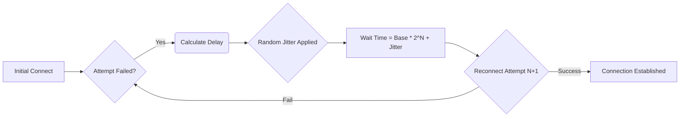

# ThemisDB Developer Guide: WebSocket Handler (ws_handler)

This section guides developers on implementing, understanding, and extending the real-time connectivity features of ThemisDB using its dedicated `ws_handler` component.

---

## 1. Overview
The `ws_handler` is responsible for managing all client connections via WebSockets. It acts as the primary gateway for real-time data streaming, state synchronization, and command broadcasting across various services connected to ThemisDB. A thorough understanding of this handler's life cycle—from initial connection establishment to graceful disconnection—is crucial for building reliable distributed applications built on top of our platform.

## 2. Key Concepts
*   **Connection Lifecycle:** Managing `connect()`, `disconnect()`, and the corresponding event handlers (e.g., `onOpen`, `onClose`).
*   **Message Protocols:** Understanding the expected JSON/binary payloads for message exchange, including versioning and error semantics.
*   **State Synchronization:** How connection events trigger the internal state machine of ThemisDB components.

## 3. API Function Walkthroughs
*   **Connecting and Disconnecting:** `connect()`, `disconnect()`.
*   **Publishing and Subscribing:** `publish()`, `subscribe()`.
*   **Message Handling:** `onMessage()`, `onClose()`.

### 4.4. Error Handling and Exceptions (Crucial)

Network communication is inherently unreliable, making robust error handling paramount. The `ws_handler` provides several defined exceptions that developers **must** anticipate and catch when implementing client logic.

*   **Authentication Failed (`AuthException`)**: Thrown if the provided credentials during `connect()` are rejected by the server. Always check the status code accompanying this exception for detailed failure reasons (e.g., expired token, invalid scope).
*   **Payload Malformed (`SerializationException`)**: Indicates that an incoming or outgoing message does not adhere to the expected schema. The handler will log the raw problematic payload and dispatch a `SCHEMA_VIOLATION` event. Never assume correct data structure when receiving messages from untrusted sources.
*   **Topic Unsubscribed (`TopicNotFoundException`)**: Occurs when attempting to `publish()` to a topic that currently has no active subscribers. This is often benign but indicates a potential breakdown in the publishing workflow; monitor these events if they occur frequently.

### 4.5. Disconnection Handling and Lifecycle Management (Advanced)

Managing the lifecycle of a WebSocket connection is significantly more complex than merely establishing it. Developers must differentiate between several disconnection scenarios to maintain application state correctly.

#### 4.5.1. Graceful Disconnect vs. Abnormal Close

*   **Graceful Disconnect**: This occurs when either client or server intentionally closes the connection (e.g., user explicitly logging out). The handler emits a `DISCONNECT_GRACEFUL` event, often accompanied by an HTTP status code (like 401 for unauthorized logout) on the initial message exchange.
    *   **Action Required**: On receiving this event, the client should execute appropriate cleanup routines: clear locally cached session data and update the UI state to 'Offline - Logged Out'.
*   **Abnormal Close**: This occurs due to network failures (e.g., proxy timeout, Wi-Fi dropout) or unhandled server crashes. The connection will simply drop without an explicit closing frame or corresponding event from the peer. These are signaled by a transport-level error or `on(error)` callback firing *before* any disconnect event is processed.
    *   **Action Required**: When an abnormal close is detected, implement exponential backoff retry logic (see Section 6). Do **not** automatically assume authentication status; re-verify session validity upon reconnecting.

#### 4.5.2. Reconnection Strategies with Backoff Jitter

Network components are unreliable. The library provides primitives to help manage automatic retries:

1.  **Exponential Backoff**: After $N$ failed attempts, the delay increases (e.g., $T, 2T, 4T, 8T\dots$).
2.  **Jitter**: To prevent thousands of clients from simultaneously hammering the server after a major outage (the "Thundering Herd" problem), random "jitter" must be added to the calculated backoff delay.

**Conceptual Failure Flow:**

> **Note to Implementers:** The library provides `Handler.setBackoffStrategy({ baseDelay: 1s, maxAttempts: 20, jitterFactor: 0.5 })`. Misconfiguring the `jitterFactor` can lead to congestion at the service level, so proceed with caution.

**Best Practice:** Always wrap all interaction with the handler's state or methods within dedicated error handling blocks (e.g., `try-catch` in C++). Use the registered event listeners to manage exceptions asynchronously, as synchronous throws might be masked by the network driver layer.