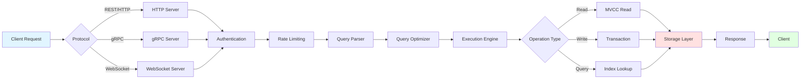
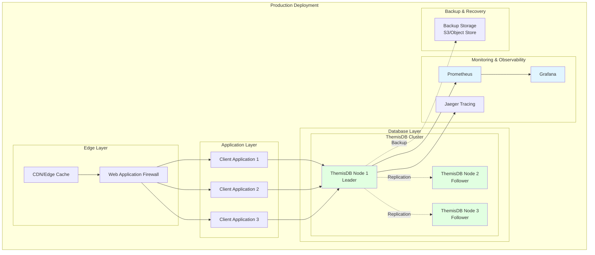
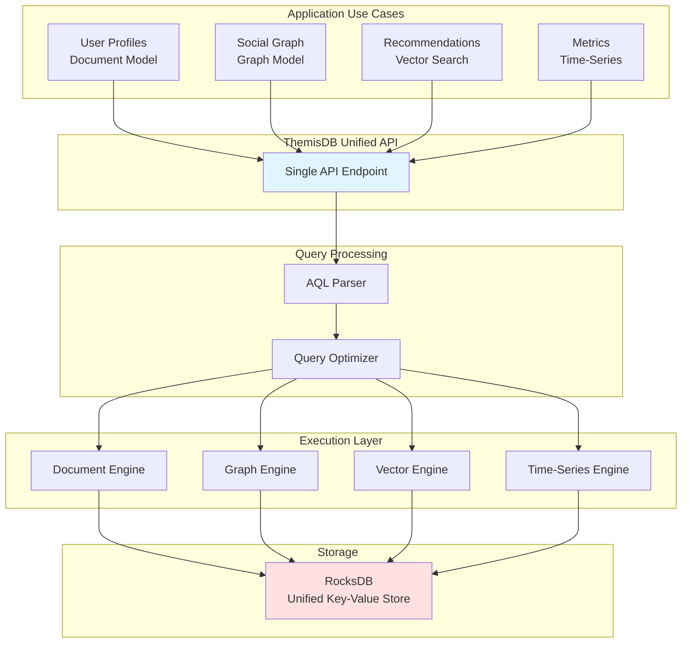
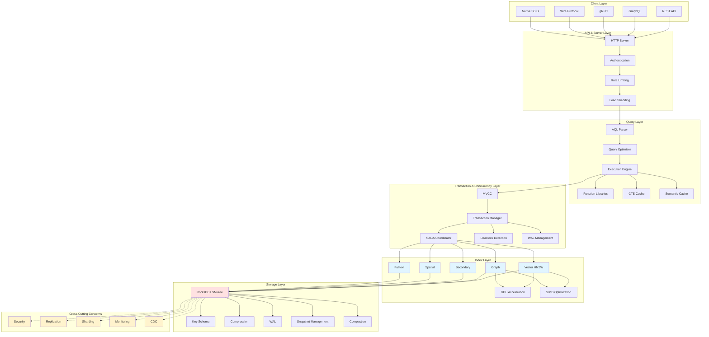
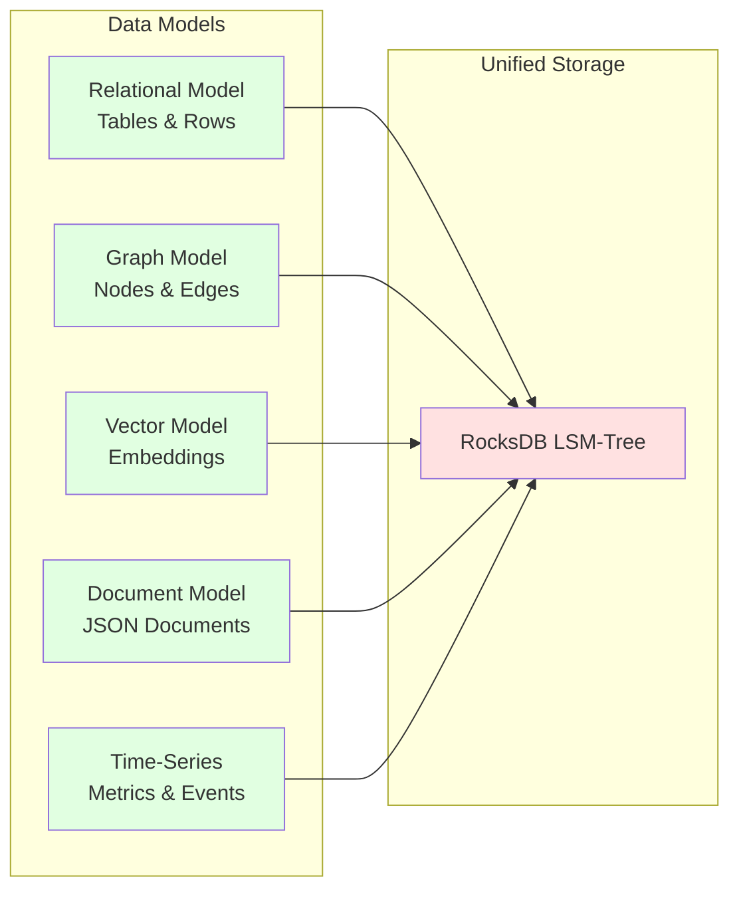
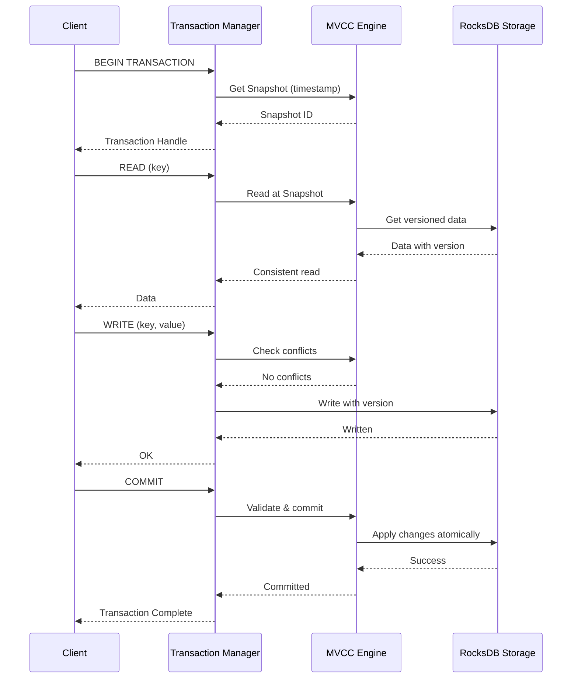
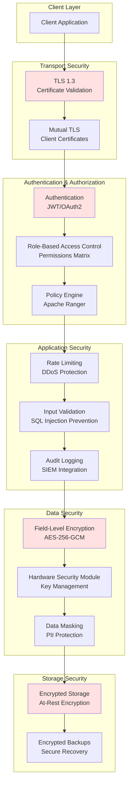
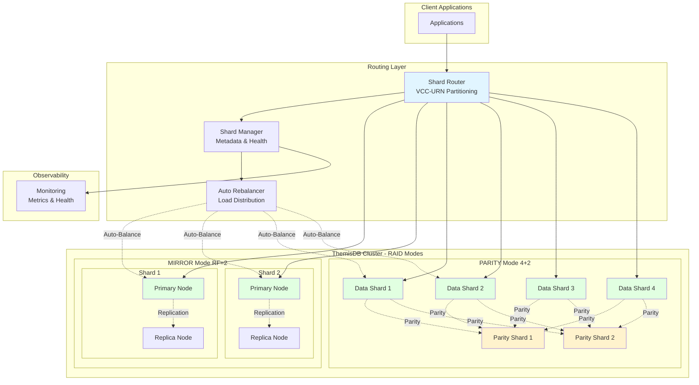

<div align="center">
  <h1>🗄️ ThemisDB</h1>
  <p><strong>High-Performance Multi-Model Database with Native AI/LLM Integration</strong></p>
  
  [](https://github.com/makr-code/ThemisDB/actions/workflows/ci.yml)
  [](https://github.com/makr-code/ThemisDB/actions/workflows/security-scan.yml)
  [](https://github.com/makr-code/ThemisDB/actions/workflows/docs.yml)
  [](https://makr-code.github.io/ThemisDB/coverage/)
  [](https://hub.docker.com/r/themisdb/themisdb)
  [](https://github.com/makr-code/ThemisDB/releases)
  [](LICENSE)
</div>

## What is ThemisDB?

ThemisDB is a **production-ready multi-model database** that combines relational, graph, vector, and document models in a single system with full ACID transaction support. Built on RocksDB for high performance and reliability.

> *"ThemisDB keeps its own llamas."* – Optional native LLM integration with llama.cpp for AI workloads directly in your database.

### Key Features

- 🔒 **ACID Transactions** - Full snapshot isolation with MVCC
- 🔍 **Multi-Model** - Relational, Graph, Vector, Document in one database
- 🚀 **High Performance** - 45K writes/s, 120K reads/s, GPU-accelerated vector search
- 🛡️ **Enterprise Security** - TLS 1.3, RBAC, field-level encryption, audit logging
- 🧠 **AI-Ready** - Optional LLM engine, vector search, image analysis, voice assistant
- 🌐 **Modern Protocols** - HTTP/2, WebSocket, gRPC, MQTT, PostgreSQL Wire, GraphQL

**📚 [Full Documentation](https://makr-code.github.io/ThemisDB/)** · **[Release Notes](CHANGELOG.md)**

---

## Quick Start

### Request Flow Overview



### 🐳 Docker (Recommended)

```bash
# Pull and run the latest version
docker pull themisdb/themisdb:latest

# Run with Docker
docker run -d \
  --name themis \
  -p 8080:8080 \
  -p 18765:18765 \
  -p 4318:4318 \
  -v themis_data:/data \
  themisdb/themisdb:latest

# Verify installation
curl http://localhost:8080/health
```

**Default Ports:**
- `8080` - HTTP/REST API, GraphQL
- `18765` - Binary Wire Protocol, gRPC
- `4318` - OpenTelemetry/Prometheus metrics

> **📖 Complete Port Reference:** See [docs/de/deployment/PORT_REFERENCE.md](docs/de/deployment/PORT_REFERENCE.md)

### 💻 From Source

```bash
# Clone repository
git clone https://github.com/makr-code/ThemisDB.git
cd ThemisDB

# Setup and build (Linux/macOS)
./scripts/setup.sh
./scripts/build.sh

# Setup and build (Windows)
.\scripts\setup.ps1
.\scripts\build.ps1

# Start server
./build/themis_server --config config.yaml
```

> **📖 Build Guide:** See [docs/de/guides/guides_build_strategy.md](docs/de/guides/guides_build_strategy.md) for detailed build instructions.

### Deployment Architecture



### 📦 Package Managers

**Linux (Debian/Ubuntu):**
```bash
# Download the latest release from GitHub
wget https://github.com/makr-code/ThemisDB/releases/latest/download/themisdb_amd64.deb
sudo apt install ./themisdb_amd64.deb
sudo systemctl start themisdb
```

**macOS (Homebrew):**
```bash
brew install themisdb
brew services start themisdb
```

**Windows (Chocolatey):**
```powershell
choco install themisdb
```

---

## 5-Minute Tutorial

### Data Models Integration



```bash
# 1. Check server health
curl http://localhost:8080/health

# 2. Create an entity
curl -X PUT http://localhost:8080/entities/users:alice \
  -H "Content-Type: application/json" \
  -d '{"blob":"{\"name\":\"Alice\",\"age\":30,\"city\":\"Berlin\"}"}'

# 3. Create an index
curl -X POST http://localhost:8080/index/create \
  -H "Content-Type: application/json" \
  -d '{"table":"users","column":"city"}'

# 4. Query by index
curl -X POST http://localhost:8080/query \
  -H "Content-Type: application/json" \
  -d '{"table":"users","predicates":[{"column":"city","value":"Berlin"}],"return":"entities"}'

# 5. View metrics
curl http://localhost:8080/metrics
```

**💡 Learn More:**
- 🚀 **[10-Minute Quickstart](docs/EXAMPLES_QUICKSTART.md)** - Hello World and CRUD operations
- 📚 **[Examples Index](docs/EXAMPLES_INDEX.md)** - Browse 37+ examples by feature
- 🎓 **[Learning Paths](docs/EXAMPLES_INDEX.md#-learning-paths)** - Guided paths for different roles

---

## Core Capabilities

### Architecture Overview



### Multi-Model Database
- **Relational**: SQL-like queries with secondary indexes
- **Graph**: BFS, Dijkstra, A* traversals with path constraints
- **Vector**: HNSW and FAISS for similarity search (GPU-accelerated)
- **Document**: JSON storage with flexible schema
- **Time-Series**: Gorilla compression, continuous aggregates



### Transaction Support



- Full ACID guarantees with snapshot isolation
- Write-write conflict detection
- Atomic updates across all index types

### Security & Compliance



- TLS 1.3 with mTLS support
- Role-Based Access Control (RBAC)
- Field-level encryption
- Audit logging with SIEM integration

### Distribution & Scaling



- VCC-URN based sharding with consistent hashing (Enterprise)
- RAID-like redundancy modes: MIRROR, STRIPE, PARITY, GEO_MIRROR (Enterprise)
- Auto-rebalancing with zero-downtime migration (Enterprise)
- Multi-region deployment support (Enterprise)

**[→ View All Features](docs/de/features/features_overview.md)**

---

## Editions

| Edition | License | Features | Use Case |
|---------|---------|----------|----------|
| 🔹 **Minimal** | Open Source (MIT) | Core database only | Embedded systems, IoT, edge devices |
| 🆓 **Community** | Open Source (MIT) | Full-featured single-node | Development, startups, single-server |
| 🔒 **Enterprise** | Commercial | + Horizontal scaling, HA, replication | Large-scale production deployments |

**[→ Minimal Edition Details](docs/MINIMAL_EDITION.md)** | **[→ Enterprise Edition Details](docs/reports/ENTERPRISE.md)**

---

## Documentation

**Getting Started:**
- 🚀 [Quick Start](#quick-start) - Get up and running in 5 minutes
- 🐳 [Docker Deployment](docs/de/deployment/DOCKER_DEPLOYMENT.md) - Container-based deployment
- 🔧 [Building from Source](docs/de/guides/guides_build_strategy.md) - Compile from source code

**Core Concepts:**
- 🏗️ [Architecture Overview](docs/de/architecture/ARCHITECTURE_OVERVIEW.md) - System design and components
- 💾 [Multi-Model Design](docs/de/architecture/architecture_base_entity.md) - Unified storage architecture
- 🔄 [Transaction Management](docs/de/features/features_transactions.md) - ACID and MVCC details
- 🔍 [AQL Query Language](docs/de/aql/aql_syntax.md) - Advanced Query Language syntax
- 🔀 [Git/GitOps Research](docs/research/git_gitops_themis_vergleich.md) - Version control concepts comparison

**Features:**
- 🎯 [Vector Search](docs/de/features/features_vector_ops.md) - Similarity search and embeddings
- 🕸️ Graph Operations - Graph traversals and algorithms
- 📈 [Time-Series Engine](docs/de/features/features_time_series.md) - Time-series data handling
- 🔐 [Security & Compliance](docs/de/security/security_implementation.md) - Security features

**Operations:**
- ⚙️ [Configuration Guide](docs/en/guides/guides_configuration.md) - Server configuration
- 📊 [Monitoring & Metrics](docs/de/observability/observability_prometheus.md) - Prometheus and Grafana
- 💾 [Backup & Recovery](docs/de/guides/guides_deployment.md#backup--recovery) - Data protection
- ⚡ [Performance Tuning](docs/de/performance/performance_memory.md) - Optimization tips

**Development:**
- 🤝 [Contributing](CONTRIBUTING.md) - How to contribute
- 🌿 [Branching Strategy](docs/BRANCHING_STRATEGY.md) - Git Flow workflow
- 📖 [API Reference](docs/api/API_REFERENCE.md) - REST and GraphQL APIs
- 📦 [Client SDKs](clients/README.md) - Available client libraries

**LLM/LoRA System:**
- ✅ [**LLM Core Status (Master)**](docs/LLM_CORE_STATUS_MASTER.md) - **Single source of truth** for implementation status
- 📊 [Comprehensive Audit Report](docs/LLM_CORE_AUDIT_REPORT.md) - Detailed code audit findings
- 🔍 [Decision Matrix](docs/LLM_CORE_DECISION_MATRIX.md) - Resolution of conflicting documentation
- 📋 [Progress Checklist](docs/LLM_LORA_CHECKLIST.md) - Detailed task tracking
- 📚 [Archived Docs](docs/ARCHIVED/README.md) - Historical documentation (superseded)
- ✅ **Status**: Core 100% production-ready, Integration 95% complete

> **📚 Full Documentation:** [https://makr-code.github.io/ThemisDB/](https://makr-code.github.io/ThemisDB/)

---

## Performance

> **Test Environment:** Release build, Windows x64, 20 cores @ 3696 MHz

| Operation | Throughput | Latency (avg) |
|-----------|:----------:|:-------------:|
| 📝 Entity PUT | 45,000 ops/s | 0.02 ms |
| 📖 Entity GET | 120,000 ops/s | 0.008 ms |
| 🔍 Indexed Query | 3.4M queries/s | 0.29 μs |
| 🕸️ Graph Traverse | 9.56M ops/s | 0.105 μs |
| 🎯 Vector Search | 59.7M queries/s | 0.017 μs |
| 📊 Vector Insert (384D) | 411k vectors/s | 2.44 μs |

> **Note:** Benchmarks represent optimal conditions. Actual performance varies based on hardware, data size, and workload.

### CHIMERA Suite - Scientific Benchmark Framework

ThemisDB performance is evaluated using the **CHIMERA Suite** (_Comprehensive Hybrid Inferencing & Multi-model Evaluation Resource Assessment_) - an industry-leading, vendor-neutral benchmark framework for multi-model databases with AI integration.

**Key Features:**
- 🔬 IEEE/ACM compliant scientific methodology
- 🎯 Multi-model workload testing (Graph, Vector, Relational, Document)
- 🤖 Native AI/LLM benchmark support (inference, LoRA, RAG)
- 🌐 Vendor-neutral, color-blind friendly reporting
- 📊 Statistical rigor with confidence intervals

**📊 [CHIMERA Suite Documentation](benchmarks/chimera/README.md)** | **[Complete Benchmark Results](benchmarks/BENCHMARK_DETAILED_RESULTS.md)**

---

## Community & Support

| Resource | Description | Link |
|----------|-------------|------|
| 📚 **Documentation** | Complete guides and API reference | [Docs Site](https://makr-code.github.io/ThemisDB/) |
| 🚀 **Production Ops** | Deployment, monitoring, troubleshooting | [Operations Guide](docs/OPERATIONS.md) |
| 🐛 **Issues** | Report bugs or request features | [GitHub Issues](https://github.com/makr-code/ThemisDB/issues) |
| 💬 **Discussions** | Community Q&A and discussions | [GitHub Discussions](https://github.com/makr-code/ThemisDB/discussions) |
| 🤝 **Contributing** | How to contribute to ThemisDB | [Contributing Guide](CONTRIBUTING.md) |
| 🔒 **Security** | Responsible disclosure policy | [Security Policy](SECURITY.md) |

---

## License

**Community Edition:** Released under the [MIT License](LICENSE) - Free to use, modify, and distribute.

**Enterprise Edition:** Available under commercial license with additional features (horizontal sharding, advanced analytics, HA/replication).

**Enterprise Inquiries:** sales@themisdb.com

---

## Acknowledgments

ThemisDB builds upon excellent open-source projects:

- **RocksDB** - High-performance LSM-Tree storage engine
- **FAISS** - Efficient similarity search library
- **llama.cpp** - LLM inference engine (optional)
- **ArangoDB** - Multi-model architecture inspiration
- **CozoDB** - Hybrid relational-graph-vector design inspiration

**[→ Complete Attribution & Dependencies](docs/de/legal/ATTRIBUTIONS.md)**  
**[→ Implementation Origins & Code Attribution](IMPLEMENTATION_ORIGINS.md)**

---

## Contributing & Community

We welcome contributions! Please see our:
- 🤝 [Contributing Guide](CONTRIBUTING.md) - Development workflow and guidelines
- 📋 [Code of Conduct](CODE_OF_CONDUCT.md) - Community standards
- 💬 [Support](SUPPORT.md) - How to get help
- 🔒 [Security Policy](SECURITY.md) - Reporting security issues

---

<div align="center">
  
**Built with ❤️ for the database community**

[⭐ Star us on GitHub](https://github.com/makr-code/ThemisDB) · [📖 Read the Docs](https://makr-code.github.io/ThemisDB/) · [🤝 Contribute](CONTRIBUTING.md)

</div>
