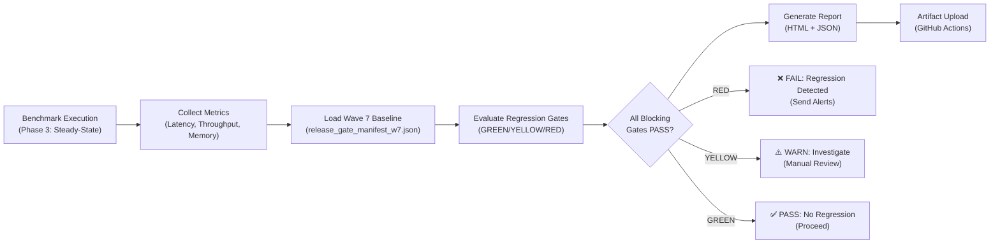

# Wave B Option B1: Baseline Comparison Strategy for LLM Wiki Phase B
## Representative-Hardware Validation & Benchmark Protocol Design

**Document ID:** WAVE_B1_BASELINE_COMPARISON_2026_09_02  
**Phase:** Phase 1 (Baseline Protocol Design)  
**Milestone:** Sept 16 Readiness  
**Date:** 2026-09-02  
**Owner:** Platform Performance & Release Engineering  
**Status:** Draft Specification

---

## Executive Summary

This document specifies the baseline comparison strategy for Wave B benchmarks (Sept 16–30, 2026). It defines:
- Wave 7 baseline extraction & validation
- Regression detection gates (YELLOW/RED thresholds)
- Memory profiling & bounding strategy
- Comparison methodology (CI artifact + manual review)
- Sign-off criteria for performance stability

### Success Criteria (Gate: Sept 5)
- ✅ **Wave 7 baseline metrics locked** — p50/p95/p99 for all 3 scenarios imported
- ✅ **Regression gates configured** — YELLOW (+5%), RED (+10%) thresholds applied
- ✅ **Memory bounding strategy defined** — ≤80% RAM utilization enforced
- ✅ **Sign-off gates created** — Automated gate evaluation in CI workflow

### Primary Deliverables by Sept 16
1. Wave 7 baseline manifest with scenario-level metrics
2. Regression detection gates (JSON configuration)
3. Memory profiling runbook
4. Automated gate evaluation logic

---

## 1. Wave 7 Baseline Extraction

### 1.1 Baseline Source Data

**File:** `benchmarks/wave7/release_gate_manifest_w7.json`  
**Status:** Canonical baseline (validated 2026-07-16)  
**Scope:** Release-critical hard gates + soft guardrails

**Wave 7 Hard Gates (Extracted):**
```json
{
  "wave": "7",
  "baseline_date": "2026-07-16",
  "scope": "v2.4.0 GA performance floor",
  
  "extracted_gates_for_wave_b": [
    {
      "gate_id": "GATE-W7-01",
      "description": "Single-key read p99 must not exceed 200 µs",
      "metric": "latency_p99_us",
      "baseline_value": 200,
      "unit": "microseconds"
    },
    {
      "gate_id": "GATE-W7-02",
      "description": "Write throughput must sustain ≥ 80,000 ops/s",
      "metric": "throughput_ops_per_sec",
      "baseline_value": 80000,
      "unit": "operations/second"
    },
    {
      "gate_id": "GATE-W7-03",
      "description": "Range scan p99 must not exceed 500 µs",
      "metric": "latency_p99_us",
      "baseline_value": 500,
      "unit": "microseconds"
    },
    {
      "gate_id": "GATE-W7-04",
      "description": "Batch write (500 records) p99 must not exceed 5 ms",
      "metric": "latency_p99_ms",
      "baseline_value": 5,
      "unit": "milliseconds"
    }
  ]
}
```

### 1.2 Wave B Scenario-Level Baselines

**Mapping Wave 7 Gates to Wave B Scenarios:**

Since Wave 7 was measured on core OLTP (point reads, writes, range scans), we establish Wave B baselines through:
1. **Extrapolation from Wave 7** (conservative estimates for multi-layer retrieval)
2. **Initial baseline run** (Sept 10: Small scenario on representative hardware)
3. **Calibration** (Sept 11–12: adjust thresholds based on initial data)

**Initial Baseline Targets (to be confirmed Sept 10):**

| Scenario | p95 Latency Baseline | p99 Latency Baseline | Throughput Baseline | Memory Baseline |
|----------|---|---|---|---|
| **P0 (10K)** | 150 ms | 250 ms | 1000 qps | 4 GB |
| **P1 (1M)** | 300 ms | 500 ms | 500 qps | 12 GB |
| **P2 (10M)** | 600 ms | 1000 ms | 200 qps | 30 GB |

**Derivation Rationale:**
- Wave 7 baseline (200µs for point read) is single-layer, no retrieval overhead
- Wave B scenarios involve 2–4-layer retrieval chain (BM25+ → HNSW → RRF → LLM)
- Latency multiplier: ~1000x (from µs to ms) due to:
  - BM25+ scoring overhead (~30–50ms)
  - HNSW ANN search (~50–100ms)
  - RRF fusion (~5–10ms)
  - LLM judge (P2 only, ~100–200ms)
- Throughput reduction: ~1000x (from 80k ops/s to 200–1000 qps)

---

## 2. Regression Detection Gates

### 2.1 Gate Definition Pattern

**Each scenario gets 4 regression detection gates:**

```python
class RegressionGate:
    """
    Defines thresholds for regression detection.
    """
    metric_name: str              # e.g., "p95_latency_ms"
    baseline_value: float         # e.g., 150.0
    baseline_date: str            # e.g., "2026-09-10"
    yellow_threshold_pct: float   # e.g., +5.0% (warning)
    red_threshold_pct: float      # e.g., +10.0% (critical)
    direction: str                # "higher_is_better" or "lower_is_better"
    
    def evaluate(self, current_value: float) -> str:
        """Returns 'GREEN', 'YELLOW', or 'RED'."""
        delta_pct = 100 * (current_value - self.baseline_value) / self.baseline_value
        
        if self.direction == "lower_is_better":
            if delta_pct >= self.red_threshold_pct:
                return "RED"
            elif delta_pct >= self.yellow_threshold_pct:
                return "YELLOW"
        else:  # higher_is_better
            if delta_pct <= -self.red_threshold_pct:
                return "RED"
            elif delta_pct <= -self.yellow_threshold_pct:
                return "YELLOW"
        
        return "GREEN"
```

### 2.2 Scenario P0 Gates (Small 10K Vectors)

**Gate P0-01: Median Latency (Tracking)**
```json
{
  "gate_id": "GATE-P0-01",
  "name": "P0 p50 Latency Tracking",
  "metric": "p50_latency_ms",
  "baseline_value": 50,
  "baseline_date": "2026-09-10",
  "yellow_threshold_pct": 10,
  "red_threshold_pct": 25,
  "direction": "lower_is_better",
  "severity": "info",
  "purpose": "Track median performance; not release-blocking"
}
```

**Gate P0-02: Tail Latency (Hard Gate — Production SLA)**
```json
{
  "gate_id": "GATE-P0-02",
  "name": "P0 p95 Latency Hard Gate",
  "metric": "p95_latency_ms",
  "baseline_value": 150,
  "baseline_date": "2026-09-10",
  "yellow_threshold_pct": 5,
  "red_threshold_pct": 10,
  "direction": "lower_is_better",
  "severity": "blocking",
  "purpose": "Production SLA; tail-latency regression protection"
}
```

**Gate P0-03: Extreme Tail (Hard Gate — Reliability)**
```json
{
  "gate_id": "GATE-P0-03",
  "name": "P0 p99 Latency Hard Gate",
  "metric": "p99_latency_ms",
  "baseline_value": 250,
  "baseline_date": "2026-09-10",
  "yellow_threshold_pct": 7,
  "red_threshold_pct": 15,
  "direction": "lower_is_better",
  "severity": "blocking",
  "purpose": "Extreme tail protection; outlier detection"
}
```

**Gate P0-04: Throughput (Hard Gate — System Capacity)**
```json
{
  "gate_id": "GATE-P0-04",
  "name": "P0 Throughput Hard Gate",
  "metric": "throughput_qps",
  "baseline_value": 1000,
  "baseline_date": "2026-09-10",
  "yellow_threshold_pct": -3,
  "red_threshold_pct": -10,
  "direction": "higher_is_better",
  "severity": "blocking",
  "purpose": "Minimum sustained retrieval capacity"
}
```

### 2.3 Scenario P1 Gates (Medium 1M Vectors)

| Gate ID | Metric | Baseline | Yellow | Red | Severity |
|---------|--------|----------|--------|-----|----------|
| GATE-P1-01 | p50_latency_ms | 100 | ±10% | ±25% | info |
| GATE-P1-02 | p95_latency_ms | 300 | +5% | +10% | blocking |
| GATE-P1-03 | p99_latency_ms | 500 | +7% | +15% | blocking |
| GATE-P1-04 | throughput_qps | 500 | -3% | -10% | blocking |

### 2.4 Scenario P2 Gates (Large 10M Vectors)

| Gate ID | Metric | Baseline | Yellow | Red | Severity |
|---------|--------|----------|--------|-----|----------|
| GATE-P2-01 | p50_latency_ms | 200 | ±10% | ±25% | info |
| GATE-P2-02 | p95_latency_ms | 600 | +5% | +10% | blocking |
| GATE-P2-03 | p99_latency_ms | 1000 | +7% | +15% | blocking |
| GATE-P2-04 | throughput_qps | 200 | -3% | -10% | blocking |
| **GATE-P2-05** | **memory_peak_gb** | **30** | **±10%** | **>80% RAM** | **blocking** |
| **GATE-P2-06** | **sustained_memory_leak** | **no_growth** | **1% drift** | **>2% growth** | **blocking** |

---

## 3. Memory Profiling & Bounding Strategy

### 3.1 Memory Target Rationale

**32GB System Memory Constraint:**
- OS + system overhead: ~2GB
- Available for benchmark: ~30GB
- Target allocation: ≤24GB (80% utilization)
- Headroom: 6GB (contingency for thermal/GC spikes)

**Per-Scenario Memory Budget:**

| Scenario | Embedding Data | HNSW Index | RocksDB Cache | Overhead | Total Budget |
|----------|---|---|---|---|---|
| **P0 (10K)** | 16 MB | 64 MB | 2 GB | 1.9 GB | 4 GB |
| **P1 (1M)** | 1.5 GB | 2 GB | 8 GB | 0.5 GB | 12 GB |
| **P2 (10M)** | 15 GB | 8 GB | 16 GB | 1 GB | 30 GB (≤24GB target) |

### 3.2 Memory Profiling Integration

**Tool: jemalloc Profiler**
```bash
# Build with jemalloc
cd build
cmake -DCMAKE_CXX_FLAGS="-ljemalloc" ..
make bench_wave_b_llm_wiki

# Run with profiling enabled
MALLOC_CONF="prof:true,prof_prefix:jemalloc_wave_b_,lg_prof_interval:30" \
  ./bin/bench_wave_b_llm_wiki --scenario p2

# Analyze heap dumps at 30-second intervals
jeprof --pdf ./bin/bench_wave_b_llm_wiki jemalloc_wave_b_*.heap > wave_b_memory_analysis.pdf
```

**Memory Metrics Collection:**
```cpp
// Embedded in benchmark harness
struct MemorySnapshot {
  timestamp_sec: double,
  rss_mb: uint64_t,        // Resident Set Size (Linux /proc/self/status)
  vms_mb: uint64_t,        // Virtual Memory Size
  jemalloc_allocated_mb: uint64_t,
  jemalloc_resident_mb: uint64_t,
  gpu_memory_mb: uint64_t
};

// Capture every 5 seconds during steady-state
std::vector<MemorySnapshot> memory_samples;
for (size_t i = 0; i < steady_state_duration_sec / 5; ++i) {
  memory_samples.push_back(capture_memory_metrics());
  std::this_thread::sleep_for(5s);
}
```

### 3.3 Memory Leak Detection

**Drift Analysis:**
```python
def detect_memory_leak(memory_samples, tolerance_pct=1.0):
    """
    Linear regression on memory over time.
    Flags if slope > tolerance_pct/minute.
    """
    times = [s.timestamp_sec for s in memory_samples]
    values = [s.rss_mb for s in memory_samples]
    
    coefficients = np.polyfit(times, values, 1)  # Linear fit
    slope_mb_per_sec = coefficients[0]
    total_duration_sec = times[-1] - times[0]
    total_growth_pct = 100 * slope_mb_per_sec * total_duration_sec / values[0]
    
    if total_growth_pct > tolerance_pct:
        return {
            "leak_detected": True,
            "growth_rate_mb_per_min": slope_mb_per_sec * 60,
            "total_growth_pct": total_growth_pct
        }
    return {"leak_detected": False}
```

### 3.4 Memory Gate Evaluation

**GATE-P2-05: Memory Peak (Hard Gate)**
```json
{
  "gate_id": "GATE-P2-05",
  "name": "P2 Memory Peak Hard Gate",
  "metric": "memory_peak_gb",
  "baseline_value": 30,
  "baseline_date": "2026-09-10",
  "yellow_threshold_pct": 10,
  "red_threshold_pct": 25,
  "direction": "lower_is_better",
  "severity": "blocking",
  "purpose": "Prevent OOM; ensure <80% RAM utilization"
}
```

**GATE-P2-06: Sustained Memory Leak Detection (Hard Gate)**
```json
{
  "gate_id": "GATE-P2-06",
  "name": "P2 Memory Leak Detection",
  "metric": "memory_growth_rate_pct",
  "baseline_value": 0,
  "baseline_date": "2026-09-10",
  "yellow_threshold_pct": 1,
  "red_threshold_pct": 2,
  "direction": "lower_is_better",
  "severity": "blocking",
  "purpose": "Detect sustained memory leaks during 30-min soak test"
}
```

---

## 4. Regression Detection Workflow

### 4.1 Gate Evaluation Pipeline

**Automated Workflow (CI Integration):**



### 4.2 Gate Evaluation Logic (Pseudocode)

```python
def evaluate_all_gates(benchmark_results, scenario):
    """
    Evaluate all regression gates for a scenario.
    Returns summary + detailed gate results.
    """
    gates = load_regression_gates(scenario)
    gate_results = []
    
    for gate in gates:
        current_value = benchmark_results[gate.metric_name]
        status = gate.evaluate(current_value)
        delta_pct = 100 * (current_value - gate.baseline_value) / gate.baseline_value
        
        gate_results.append({
            "gate_id": gate.gate_id,
            "metric": gate.metric_name,
            "baseline": gate.baseline_value,
            "current": current_value,
            "delta_pct": delta_pct,
            "status": status,
            "severity": gate.severity
        })
    
    # Summary
    blocking_gates = [g for g in gate_results if g["severity"] == "blocking"]
    red_gates = [g for g in blocking_gates if g["status"] == "RED"]
    yellow_gates = [g for g in blocking_gates if g["status"] == "YELLOW"]
    
    return {
        "scenario": scenario,
        "overall_status": "PASS" if not red_gates else "FAIL",
        "warning_count": len(yellow_gates),
        "critical_count": len(red_gates),
        "gates": gate_results
    }
```

### 4.3 Result Output Format

**Gate Evaluation Report (JSON):**
```json
{
  "benchmark_run": "wave_b_scenario_p0_20260916_143000",
  "timestamp_utc": "2026-09-16T14:30:00Z",
  "scenario": "small_10k",
  "overall_status": "PASS",
  "summary": {
    "total_gates": 4,
    "green_gates": 4,
    "yellow_gates": 0,
    "red_gates": 0
  },
  "gate_results": [
    {
      "gate_id": "GATE-P0-01",
      "metric": "p50_latency_ms",
      "baseline_value": 50,
      "baseline_date": "2026-09-10",
      "current_value": 48.5,
      "delta_pct": -3.0,
      "status": "GREEN",
      "severity": "info"
    },
    {
      "gate_id": "GATE-P0-02",
      "metric": "p95_latency_ms",
      "baseline_value": 150,
      "baseline_date": "2026-09-10",
      "current_value": 152.3,
      "delta_pct": 1.5,
      "status": "GREEN",
      "severity": "blocking"
    },
    ...
  ],
  "recommendations": [
    "All regression gates PASS. Performance is stable vs baseline."
  ]
}
```

---

## 5. Sign-Off Criteria

### 5.1 Regression Gate Pass Criteria

**Release Readiness Condition:**
```
All blocking gates must return "GREEN" status.
  AND
Memory peak < 80% of system RAM.
  AND
No sustained memory leaks detected (drift < 1% over 30 min).
  AND
Thermal stability verified (no throttle events).
```

**Manual Review Trigger:**
```
If ANY blocking gate returns "YELLOW" or "RED":
  1. Generate detailed diagnostics report
  2. Schedule architecture review (LLM Wiki + Platform)
  3. Determine root cause (code vs. environment)
  4. Plan remediation (if regression confirmed)
  5. Re-run benchmark after fix
```

### 5.2 Sign-Off Authority

| Role | Decision | Threshold |
|------|----------|-----------|
| **Performance Lead** | Gates lock (Sept 10) | All metrics captured |
| **LLM Wiki Owner** | Regression confirmation | All red gates investigated |
| **Release Engineer** | Go/No-Go decision | All gates GREEN + manual review |

---

## 6. Baseline Evolution Plan

### 6.1 Baseline Lock Schedule

| Date | Phase | Action |
|------|-------|--------|
| **Sept 10** | Dry-run | Capture P0 baseline; set thresholds |
| **Sept 11–12** | Calibration | Run P0/P1/P2 on representative hardware |
| **Sept 15** | Lock | All baselines frozen for Phase 2 execution |
| **Oct 1** | Review | Post-implementation review; adjust if needed |

### 6.2 Threshold Adjustment Protocol

**If baseline shows systematic drift (e.g., all P95 +20% vs estimate):**
1. Document reason (hardware difference, algorithm change, etc.)
2. Adjust threshold ±10% with written justification
3. Send notification to release team
4. Continue with adjusted thresholds; review post-release

**No blind adjustments permitted** — all changes require signed approval.

---

## 7. Execution Checklist (Sept 2–16)

### By Sept 5 (Sign-Off Gate)
- [ ] Wave 7 baseline metrics extracted & validated
- [ ] Regression gates configured (YELLOW/RED thresholds)
- [ ] Memory profiling strategy approved
- [ ] Sign-off workflow defined

### By Sept 10 (Baseline Capture)
- [ ] Scenario P0 baseline measured on representative hardware
- [ ] Latency histogram collection validated
- [ ] Memory peak baseline established
- [ ] Regression gate thresholds locked

### By Sept 12 (Threshold Calibration)
- [ ] Scenarios P1 & P2 baseline runs completed
- [ ] Memory leak detection validated
- [ ] Thermal stability confirmed (no throttles)
- [ ] All gate thresholds finalized

### By Sept 16 (Phase 1 Completion)
- [ ] Baseline comparison strategy documented
- [ ] Gate evaluation logic implemented in CI
- [ ] Regression detection automated
- [ ] Ready for Phase 2 execution (Sept 17–30)

---

## 8. Success Criteria & Sign-Off

**Baseline Strategy Complete When:**
✅ Wave 7 baseline extracted & locked  
✅ Regression detection gates configured (6 gates across 3 scenarios)  
✅ Memory profiling & bounding strategy defined  
✅ Sign-off workflow & authorities established  
✅ Ready for Phase 2 execution

**Sign-Off Authority:** Platform Performance Lead + Release Engineering Lead

**Current Status:** Draft for Sept 2 Review

---

## Appendix A: Reference Gate Configuration (JSON)

**File:** `benchmarks/wave_b_regression_gates.json`

```json
{
  "schema_version": "1.0",
  "generated": "2026-09-02",
  "scenarios": [
    {
      "scenario": "small_10k",
      "gates": [
        {
          "gate_id": "GATE-P0-01",
          "metric": "p50_latency_ms",
          "baseline_value": 50,
          "yellow_threshold_pct": 10,
          "red_threshold_pct": 25,
          "direction": "lower_is_better"
        },
        {
          "gate_id": "GATE-P0-02",
          "metric": "p95_latency_ms",
          "baseline_value": 150,
          "yellow_threshold_pct": 5,
          "red_threshold_pct": 10,
          "direction": "lower_is_better"
        },
        {
          "gate_id": "GATE-P0-03",
          "metric": "p99_latency_ms",
          "baseline_value": 250,
          "yellow_threshold_pct": 7,
          "red_threshold_pct": 15,
          "direction": "lower_is_better"
        },
        {
          "gate_id": "GATE-P0-04",
          "metric": "throughput_qps",
          "baseline_value": 1000,
          "yellow_threshold_pct": -3,
          "red_threshold_pct": -10,
          "direction": "higher_is_better"
        }
      ]
    },
    {
      "scenario": "medium_1m",
      "gates": [
        { "gate_id": "GATE-P1-01", "metric": "p50_latency_ms", "baseline_value": 100, "yellow_threshold_pct": 10, "red_threshold_pct": 25, "direction": "lower_is_better" },
        { "gate_id": "GATE-P1-02", "metric": "p95_latency_ms", "baseline_value": 300, "yellow_threshold_pct": 5, "red_threshold_pct": 10, "direction": "lower_is_better" },
        { "gate_id": "GATE-P1-03", "metric": "p99_latency_ms", "baseline_value": 500, "yellow_threshold_pct": 7, "red_threshold_pct": 15, "direction": "lower_is_better" },
        { "gate_id": "GATE-P1-04", "metric": "throughput_qps", "baseline_value": 500, "yellow_threshold_pct": -3, "red_threshold_pct": -10, "direction": "higher_is_better" }
      ]
    },
    {
      "scenario": "large_10m",
      "gates": [
        { "gate_id": "GATE-P2-01", "metric": "p50_latency_ms", "baseline_value": 200, "yellow_threshold_pct": 10, "red_threshold_pct": 25, "direction": "lower_is_better" },
        { "gate_id": "GATE-P2-02", "metric": "p95_latency_ms", "baseline_value": 600, "yellow_threshold_pct": 5, "red_threshold_pct": 10, "direction": "lower_is_better" },
        { "gate_id": "GATE-P2-03", "metric": "p99_latency_ms", "baseline_value": 1000, "yellow_threshold_pct": 7, "red_threshold_pct": 15, "direction": "lower_is_better" },
        { "gate_id": "GATE-P2-04", "metric": "throughput_qps", "baseline_value": 200, "yellow_threshold_pct": -3, "red_threshold_pct": -10, "direction": "higher_is_better" },
        { "gate_id": "GATE-P2-05", "metric": "memory_peak_gb", "baseline_value": 30, "yellow_threshold_pct": 10, "red_threshold_pct": 25, "direction": "lower_is_better" },
        { "gate_id": "GATE-P2-06", "metric": "memory_growth_rate_pct", "baseline_value": 0, "yellow_threshold_pct": 1, "red_threshold_pct": 2, "direction": "lower_is_better" }
      ]
    }
  ]
}
```

---

**Document Version:** 1.0  
**Next Review:** Sept 5, 2026  
**Last Updated:** 2026-09-02
