# ThemisDB Architecture

> **Auto-generated** — do not edit manually.
> Source: `tools/architecture-generator/generate_architecture.py`
> Generated: `2026-09-09T07:22:07.285466+00:00`

## Statistics

| Metric | Value |
|--------|-------|
| Total modules | 68 |
| Total relationships | 47 |
| Modules with public plugin | 10 |
| Modules with private plugin | 4 |
| Modules with API contracts | 6 |
| Documentation sources scanned | 1166 |
| LLM Wiki source files | 7718 |
| LLM Wiki module/API entries | 80 |
| LLM Wiki generated | `2026-09-07T03:02:22+00:00` |
| ai_working artifacts | 64 |

## Module Architecture Diagram

```mermaid
flowchart TD
    subgraph T0["T0: Trusted Core"]
        mod_base["base"]
        mod_core["core"]
        mod_plugins["plugins"]
        mod_themis["themis"]
        mod_utils["utils"]
    end
    subgraph T1["T1: Engine (Query/Storage/Index)"]
        mod_aql["aql"]
        mod_cache["cache"]
        mod_execution["execution"]
        mod_index["index"]
        mod_metadata["metadata"]
        mod_query["query"]
        mod_storage["storage"]
    end
    subgraph T3["T3: Infrastructure & Governance"]
        mod_acceleration["acceleration"]
        mod_access_model["access_model"]
        mod_ai["ai"]
        mod_analytics["analytics"]
        mod_api["api"]
        mod_auth["auth"]
        mod_cdc["cdc"]
        mod_chaos["chaos"]
        mod_chimera["chimera"]
        mod_config["config"]
        mod_content["content"]
        mod_distributed_knowledge["distributed_knowledge"]
        mod_distributed_tensor["distributed_tensor"]
        mod_document["document"]
        mod_ethics_ai["ethics_ai 🔒"]
        mod_evaluation["evaluation"]
        mod_exporters["exporters ✅"]
        mod_failover["failover"]
        mod_geo["geo ✅"]
        mod_governance["governance"]
        mod_gpu["gpu"]
        mod_graph["graph"]
        mod_importers["importers 🔒"]
        mod_ingestion["ingestion"]
        mod_llama_cpp["llama_cpp ✅"]
        mod_llm["llm"]
        mod_llm_wiki["llm_wiki 🔒"]
        mod_maintenance["maintenance"]
        mod_network["network"]
        mod_observability["observability"]
        mod_onnx_clip["onnx_clip"]
        mod_performance["performance"]
        mod_process["process"]
        mod_projects["projects"]
        mod_prompt_engineering["prompt_engineering"]
        mod_rag["rag"]
        mod_replication["replication"]
        mod_retrieval["retrieval"]
        mod_rpc_grpc["rpc_grpc"]
        mod_scheduler["scheduler"]
        mod_scraper["scraper ✅"]
        mod_search["search"]
        mod_security["security"]
        mod_server["server"]
        mod_sharding["sharding"]
        mod_stable_diffusion["stable_diffusion ✅"]
        mod_temporal["temporal"]
        mod_tensor["tensor"]
        mod_timeseries["timeseries ✅"]
        mod_toolbox["toolbox"]
        mod_training["training"]
        mod_transaction["transaction"]
        mod_updates["updates"]
        mod_user_storage_encrypted["user_storage_encrypted 🔒"]
        mod_voice["voice"]
        mod_whisper["whisper ✅"]
    end

    mod_aql -->|"parses/plans"| mod_core
    mod_query -->|"optimizes"| mod_aql
    mod_execution -->|"executes"| mod_query
    mod_execution -->|"reads/writes"| mod_storage
    mod_execution -->|"uses"| mod_index
    mod_index -->|"persists"| mod_storage
    mod_cache -->|"caches"| mod_execution
    mod_metadata -->|"schema store"| mod_storage
    mod_transaction -->|"MVCC"| mod_core
    mod_transaction -->|"data commit"| mod_storage
    mod_transaction -->|"distributes"| mod_replication
    mod_replication -->|"replica I/O"| mod_storage
    mod_sharding -->|"partitions"| mod_storage
    mod_sharding -->|"replicates shards"| mod_replication
    mod_api -->|"routes"| mod_server
    mod_api -->|"authenticates"| mod_auth
    mod_server -->|"dispatches"| mod_execution
    mod_auth -->|"primitives"| mod_security
    mod_governance -->|"policy check"| mod_auth
    mod_governance -->|"audit events"| mod_observability
    mod_rag -->|"retrieves"| mod_retrieval
    mod_rag -->|"generates"| mod_llm
    mod_rag -->|"knowledge store"| mod_storage
    mod_llm -->|"local inference"| mod_llama_cpp
    mod_llm_wiki -->|"wiki retrieval"| mod_llm
    mod_llm_wiki -->|"provenance"| mod_rag
    mod_retrieval -->|"vector search"| mod_index
    mod_ai -->|"orchestrates"| mod_llm
    mod_ai -->|"semantic search"| mod_retrieval
    mod_acceleration -->|"GPU dispatch"| mod_gpu
    mod_observability -->|"metrics hooks"| mod_core
    mod_network -->|"transport"| mod_server
    mod_distributed_knowledge -->|"knowledge graph"| mod_graph
    mod_distributed_knowledge -->|"distributed"| mod_replication
    mod_analytics -->|"reads data"| mod_storage
    mod_training -->|"fine-tunes"| mod_llm
    mod_training -->|"model storage"| mod_storage
    mod_content -->|"content store"| mod_storage
    mod_search -->|"fulltext index"| mod_index
    mod_search -->|"semantic search"| mod_retrieval
    mod_security -->|"crypto primitives"| mod_core
    mod_config -->|"config bootstrap"| mod_core
    mod_process -->|"lifecycle"| mod_core
    mod_utils -->|"utilities"| mod_base
    mod_themis -->|"root aggregation"| mod_core
    mod_themis -->|"plugin loader"| mod_plugins
    mod_plugins -->|"plugin base"| mod_base

    click mod_base href "https://github.com/makr-code/ThemisDB/blob/develop/src/base/ROADMAP.md" "themis::resource — module documentation" _blank
    click mod_core href "https://github.com/makr-code/ThemisDB/blob/develop/src/core/ROADMAP.md" "themis::core — module documentation" _blank
    click mod_plugins href "https://github.com/makr-code/ThemisDB/blob/develop/src/plugins/ROADMAP.md" "themis::plugins — module documentation" _blank
    click mod_themis href "https://github.com/makr-code/ThemisDB/blob/develop/src/themis/ROADMAP.md" "themis — module documentation" _blank
    click mod_utils href "https://github.com/makr-code/ThemisDB/blob/develop/src/utils/ROADMAP.md" "themis::utils — module documentation" _blank
    click mod_aql href "https://github.com/makr-code/ThemisDB/blob/develop/src/aql/ROADMAP.md" "themis::aql — module documentation" _blank
    click mod_cache href "https://github.com/makr-code/ThemisDB/blob/develop/src/cache/ROADMAP.md" "themis::cache — module documentation" _blank
    click mod_execution href "https://github.com/makr-code/ThemisDB/blob/develop/src/execution/ROADMAP.md" "themis::execution — module documentation" _blank
    click mod_index href "https://github.com/makr-code/ThemisDB/wiki/Index-Module" "themis::index — module documentation" _blank
    click mod_metadata href "https://github.com/makr-code/ThemisDB/blob/develop/src/metadata/ROADMAP.md" "themis::metadata — module documentation" _blank
    click mod_query href "https://github.com/makr-code/ThemisDB/blob/develop/src/query/ROADMAP.md" "themis::query — module documentation" _blank
    click mod_storage href "https://github.com/makr-code/ThemisDB/wiki/Storage-Module" "themis::storage — module documentation" _blank
    click mod_acceleration href "https://github.com/makr-code/ThemisDB/wiki/Acceleration-Module" "themis::acceleration — module documentation" _blank
    click mod_access_model href "https://github.com/makr-code/ThemisDB/blob/develop/src/access_model/ROADMAP.md" "themis::access_model — module documentation" _blank
    click mod_ai href "https://github.com/makr-code/ThemisDB/blob/develop/src/ai/ROADMAP.md" "themis::ai — module documentation" _blank
    click mod_analytics href "https://github.com/makr-code/ThemisDB/blob/develop/src/analytics/ROADMAP.md" "themis::analytics — module documentation" _blank
    click mod_api href "https://github.com/makr-code/ThemisDB/wiki/API-Module" "themis::api — module documentation" _blank
    click mod_auth href "https://github.com/makr-code/ThemisDB/wiki/Auth-Module" "themis::auth — module documentation" _blank
    click mod_cdc href "https://github.com/makr-code/ThemisDB/blob/develop/src/cdc/ROADMAP.md" "themis::cdc — module documentation" _blank
    click mod_chaos href "https://github.com/makr-code/ThemisDB/blob/develop/src/chaos/ROADMAP.md" "themis::chaos — module documentation" _blank
    click mod_chimera href "https://github.com/makr-code/ThemisDB/blob/develop/src/chimera/ROADMAP.md" "themis::chimera — module documentation" _blank
    click mod_config href "https://github.com/makr-code/ThemisDB/blob/develop/src/config/ROADMAP.md" "themis::config — module documentation" _blank
    click mod_content href "https://github.com/makr-code/ThemisDB/blob/develop/src/content/ROADMAP.md" "themis::content — module documentation" _blank
    click mod_distributed_knowledge href "https://github.com/makr-code/ThemisDB/blob/develop/src/distributed_knowledge/ROADMAP.md" "themis::distributed_knowledge — module documentation" _blank
    click mod_distributed_tensor href "https://github.com/makr-code/ThemisDB/blob/develop/src/distributed_tensor/ROADMAP.md" "themis::distributed_tensor — module documentation" _blank
    click mod_document href "https://github.com/makr-code/ThemisDB/blob/develop/src/document/ROADMAP.md" "themis::document — module documentation" _blank
    click mod_ethics_ai href "https://github.com/makr-code/ThemisDB/blob/develop/src/ethics_ai/ROADMAP.md" "themis::ethics_ai — module documentation" _blank
    click mod_evaluation href "https://github.com/makr-code/ThemisDB/blob/develop/src/evaluation/ROADMAP.md" "themis::evaluation — module documentation" _blank
    click mod_exporters href "https://github.com/makr-code/ThemisDB/blob/develop/src/exporters/ROADMAP.md" "themis::exporters — module documentation" _blank
    click mod_failover href "https://github.com/makr-code/ThemisDB/blob/develop/src/failover/ROADMAP.md" "themis::failover — module documentation" _blank
    click mod_geo href "https://github.com/makr-code/ThemisDB/blob/develop/src/geo/ROADMAP.md" "themis::geo — module documentation" _blank
    click mod_governance href "https://github.com/makr-code/ThemisDB/blob/develop/src/governance/ROADMAP.md" "themis::governance — module documentation" _blank
    click mod_gpu href "https://github.com/makr-code/ThemisDB/blob/develop/src/gpu/ROADMAP.md" "themis::gpu — module documentation" _blank
    click mod_graph href "https://github.com/makr-code/ThemisDB/wiki/Graph-Module" "themis::graph — module documentation" _blank
    click mod_importers href "https://github.com/makr-code/ThemisDB/blob/develop/src/importers/ROADMAP.md" "themis::importers — module documentation" _blank
    click mod_ingestion href "https://github.com/makr-code/ThemisDB/blob/develop/src/ingestion/ROADMAP.md" "themis::ingestion — module documentation" _blank
    click mod_llama_cpp href "https://github.com/makr-code/ThemisDB/blob/develop/src/llama_cpp/ROADMAP.md" "themis::llama_cpp — module documentation" _blank
    click mod_llm href "https://github.com/makr-code/ThemisDB/wiki/LLM-Module" "themis::llm — module documentation" _blank
    click mod_llm_wiki href "https://github.com/makr-code/ThemisDB/wiki/LLM-Wiki" "themis::llm_wiki — module documentation" _blank
    click mod_maintenance href "https://github.com/makr-code/ThemisDB/blob/develop/src/maintenance/ROADMAP.md" "themis::maintenance — module documentation" _blank
    click mod_network href "https://github.com/makr-code/ThemisDB/blob/develop/src/network/ROADMAP.md" "themis::network — module documentation" _blank
    click mod_observability href "https://github.com/makr-code/ThemisDB/wiki/Observability-Module" "themis::observability — module documentation" _blank
    click mod_onnx_clip href "https://github.com/makr-code/ThemisDB/blob/develop/src/onnx_clip/ROADMAP.md" "themis::onnx_clip — module documentation" _blank
    click mod_performance href "https://github.com/makr-code/ThemisDB/blob/develop/src/performance/ROADMAP.md" "themis::performance — module documentation" _blank
    click mod_process href "https://github.com/makr-code/ThemisDB/blob/develop/src/process/ROADMAP.md" "themis::process — module documentation" _blank
    click mod_projects href "https://github.com/makr-code/ThemisDB/blob/develop/src/projects/ROADMAP.md" "themis::projects — module documentation" _blank
    click mod_prompt_engineering href "https://github.com/makr-code/ThemisDB/blob/develop/src/prompt_engineering/ROADMAP.md" "themis::prompt_engineering — module documentation" _blank
    click mod_rag href "https://github.com/makr-code/ThemisDB/wiki/RAG-Module" "themis::rag — module documentation" _blank
    click mod_replication href "https://github.com/makr-code/ThemisDB/wiki/Replication-Module" "themis::replication — module documentation" _blank
    click mod_retrieval href "https://github.com/makr-code/ThemisDB/blob/develop/src/retrieval/ROADMAP.md" "themis::retrieval — module documentation" _blank
    click mod_rpc_grpc href "https://github.com/makr-code/ThemisDB/blob/develop/src/rpc_grpc/ROADMAP.md" "themis::rpc_grpc — module documentation" _blank
    click mod_scheduler href "https://github.com/makr-code/ThemisDB/blob/develop/src/scheduler/ROADMAP.md" "themis::scheduler — module documentation" _blank
    click mod_scraper href "https://github.com/makr-code/ThemisDB/blob/develop/src/scraper/ROADMAP.md" "themis::scraper — module documentation" _blank
    click mod_search href "https://github.com/makr-code/ThemisDB/blob/develop/src/search/ROADMAP.md" "themis::search — module documentation" _blank
    click mod_security href "https://github.com/makr-code/ThemisDB/wiki/Security-Module" "themis::security — module documentation" _blank
    click mod_server href "https://github.com/makr-code/ThemisDB/blob/develop/src/server/ROADMAP.md" "themis::server — module documentation" _blank
    click mod_sharding href "https://github.com/makr-code/ThemisDB/wiki/Sharding-Module" "themis::sharding — module documentation" _blank
    click mod_stable_diffusion href "https://github.com/makr-code/ThemisDB/blob/develop/src/stable_diffusion/ROADMAP.md" "themis::stable_diffusion — module documentation" _blank
    click mod_temporal href "https://github.com/makr-code/ThemisDB/blob/develop/src/temporal/ROADMAP.md" "themis::temporal — module documentation" _blank
    click mod_tensor href "https://github.com/makr-code/ThemisDB/blob/develop/src/tensor/ROADMAP.md" "themis::tensor — module documentation" _blank
    click mod_timeseries href "https://github.com/makr-code/ThemisDB/blob/develop/src/timeseries/ROADMAP.md" "themis::timeseries — module documentation" _blank
    click mod_toolbox href "https://github.com/makr-code/ThemisDB/blob/develop/src/toolbox/ROADMAP.md" "themis::toolbox — module documentation" _blank
    click mod_training href "https://github.com/makr-code/ThemisDB/blob/develop/src/training/ROADMAP.md" "themis::training — module documentation" _blank
    click mod_transaction href "https://github.com/makr-code/ThemisDB/wiki/Transaction-Module" "themis::transaction — module documentation" _blank
    click mod_updates href "https://github.com/makr-code/ThemisDB/blob/develop/src/updates/ROADMAP.md" "themis::updates — module documentation" _blank
    click mod_user_storage_encrypted href "https://github.com/makr-code/ThemisDB/blob/develop/src/user_storage_encrypted/ROADMAP.md" "themis::user_storage_encrypted — module documentation" _blank
    click mod_voice href "https://github.com/makr-code/ThemisDB/blob/develop/src/voice/ROADMAP.md" "themis::voice — module documentation" _blank
    click mod_whisper href "https://github.com/makr-code/ThemisDB/blob/develop/src/whisper/ROADMAP.md" "themis::whisper — module documentation" _blank
```

## Tier Classification

| Tier | Description | Count | Modules (sample) |
|------|-------------|-------|-------------------|
| T0 | Trusted Core | 5 | base, core, plugins, themis, utils |
| T1 | Engine (Query/Storage/Index) | 7 | aql, cache, execution, index, metadata, query … |
| T3 | Infrastructure & Governance | 56 | acceleration, access_model, ai, analytics, api, auth … |

## Consumer / Provider Dependencies

Top modules by outgoing dependency count:

| Module | Provides to (count) | Consumes from |
|--------|---------------------|---------------|
| `execution` | 3 | `index`, `query`, `storage` |
| `transaction` | 3 | `core`, `replication`, `storage` |
| `rag` | 3 | `llm`, `retrieval`, `storage` |
| `sharding` | 2 | `replication`, `storage` |
| `api` | 2 | `auth`, `server` |
| `governance` | 2 | `auth`, `observability` |
| `llm_wiki` | 2 | `llm`, `rag` |
| `ai` | 2 | `llm`, `retrieval` |
| `distributed_knowledge` | 2 | `graph`, `replication` |
| `training` | 2 | `llm`, `storage` |
| `search` | 2 | `index`, `retrieval` |
| `themis` | 2 | `core`, `plugins` |
| `aql` | 1 | `core` |
| `query` | 1 | `aql` |
| `index` | 1 | `storage` |
| `cache` | 1 | `execution` |
| `metadata` | 1 | `storage` |
| `replication` | 1 | `storage` |
| `server` | 1 | `execution` |
| `auth` | 1 | `security` |

## Knowledge Sources

### Developer LLM Wiki
- Generated at: `2026-09-07T03:02:22+00:00`
- Source hash: `407f4e67669f74c9943811d098f5937155a55ca4220a2c0499e0acb56102706d`
- Source file count: 7718
- Module/API entries indexed: 80

### ai_working Artifacts
Wave/batch reports: 42
JSON analysis artifacts: 7

### Documentation Sources
1166 documentation files scanned from `docs/` and repository root governance files.

## Source Hashes

| Source | SHA-256 prefix |
|--------|----------------|
| `ARCHITECTURE.md` | `4e17d46197ca1d0f` |
| `FUTURE_ENHANCEMENTS.md` | `27719b9a0d59d926` |
| `ROADMAP.md` | `84e7325175bb2229` |
| `ai_context/ARCHITECTURE_CLASSIFICATION.md` | `57a7f2182a1193c8` |
| `ai_context/MODULES_AND_NAMESPACES.md` | `bf42dba44a39f8cb` |
| `ai_context/api_contracts/` | `327db5382688c4b9` |
| `ai_context/developer_llm_wiki/` | `a1c14f1daa494f60` |
| `ai_working/` | `23010ee516eb01da` |
| `docs/` | `4e41caa1db36a619` |
