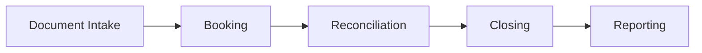

# default_accounting_process.yaml — Detailerklärung

## Zweck
Buchhaltungsprozess von Belegerfassung bis Abschlussbericht mit Reconciliation-Kontrolle.

## Prozessbild

```mermaid
flowchart LR
  A[Document Intake] --> B[Booking]
  B --> C[Reconciliation]
  C --> D[Closing]
  D --> E[Reporting]
```
