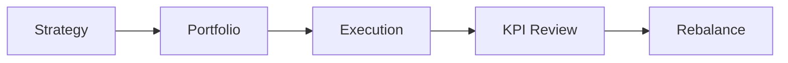

# default_corporate_process.yaml — Detailerklärung

## Zweck
Unternehmensprozess zur Verbindung von Strategie, Portfolio-Entscheidungen und operativer Umsetzung.

## Prozessbild

```mermaid
flowchart LR
  A[Strategy] --> B[Portfolio]
  B --> C[Execution]
  C --> D[KPI Review]
  D --> E[Rebalance]
```
