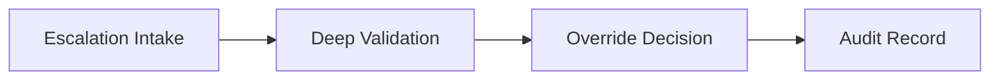

# default_executive_submodel.yaml — Detailerklärung

## Zweck
Submodel für Eskalations- und Ausnahmebehandlung in `executive`-Prozessen.

## Prozessbild

```mermaid
flowchart LR
  A[Escalation Intake] --> B[Deep Validation]
  B --> C[Override Decision]
  C --> D[Audit Record]
```
