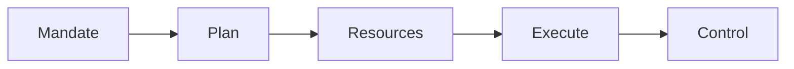

# default_exicutive_process.yaml — Detailerklärung

## Zweck
Standardprozess zur Umsetzung beschlossener Maßnahmen inklusive Monitoring und Nachsteuerung.

## Prozessbild

```mermaid
flowchart LR
  A[Mandate] --> B[Plan]
  B --> C[Resources]
  C --> D[Execute]
  D --> E[Control]
```
