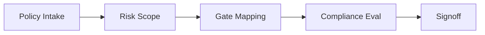

# default_governance_process.yaml — Detailerklärung

## Zweck
Rahmenprozess für policy-konforme Entscheidungen mit nachvollziehbarer Freigabe.

## Prozessbild

```mermaid
flowchart LR
  A[Policy Intake] --> B[Risk Scope]
  B --> C[Gate Mapping]
  C --> D[Compliance Eval]
  D --> E[Signoff]
```
