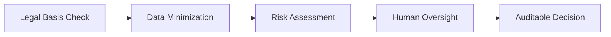

# people_assessment_compliant.yaml — Detailerklärung

## Zweck
Rechts- und ethikgebundenes Personen-Assessment für Schutz- und Risikomanagement.

## Grenzen
Keine verdeckte Massenüberwachung, kein diskriminierendes Profiling, nur mit Rechtsgrundlage, Zweckbindung und Human Oversight.

## Prozessbild

