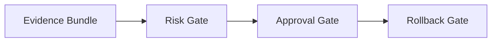

# default_legal_reusable_model.yaml — Detailerklärung

## Zweck
Reusable-Modell mit wiederverwendbaren BPMN-Bausteinen für `legal`.

## Prozessbild

```mermaid
flowchart LR
  A[Evidence Bundle] --> B[Risk Gate]
  B --> C[Approval Gate]
  C --> D[Rollback Gate]
```
