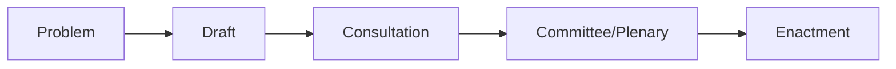

# default_legislative_process.yaml — Detailerklärung

## Zweck
Modelliert den Weg von einem Regelungsbedarf bis zum verabschiedeten und veröffentlichten Normtext.

## Prozessbild

```mermaid
flowchart LR
  A[Problem] --> B[Draft]
  B --> C[Consultation]
  C --> D[Committee/Plenary]
  D --> E[Enactment]
```
