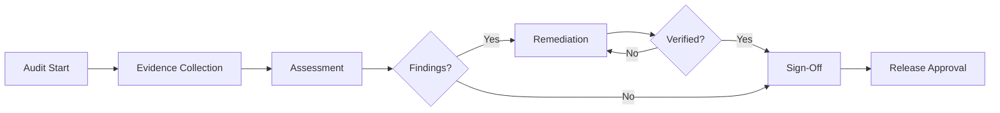

# ThemisDB Audit Gate Template

**Version:** 1.0  
**Release:** [RELEASE_VERSION]  
**Date:** [AUDIT_DATE]  
**Auditor:** [LEAD_AUDITOR]  
**Status:** 🔄 In Progress

---

## 📋 Quick Navigation

- [Audit Gate Overview](#audit-gate-overview)
- [Audit Summary](#audit-summary)
- [13 Audit Dimensions](#13-audit-dimensions)
- [Evidence Tracking](#evidence-tracking)
- [Findings Management](#findings-management)
- [Sign-Off and Approval](#sign-off-and-approval)

---

## Audit Gate Overview

### Purpose
This template provides a comprehensive checklist for conducting repeatable security and compliance audits for ThemisDB releases. Each dimension must be evaluated and signed off before release approval.

### Scope
- **Version:** [RELEASE_VERSION]
- **Branch:** [GIT_BRANCH]
- **Commit:** [GIT_COMMIT_SHA]
- **Audit Start Date:** [START_DATE]
- **Target Release Date:** [RELEASE_DATE]

### Standards Coverage
- ✅ ISO/IEC 27001:2022
- ✅ NIST Cybersecurity Framework v1.1
- ✅ OWASP ASVS v4.0 (Level 2)
- ✅ BSI C5 (Cloud Computing Compliance)
- ✅ SOC 2 Trust Services Criteria
- ✅ SLSA Level 3 (Supply Chain Security)

### Audit Workflow



---

## Audit Summary

### Overall Status

| Category | Total | Passed | Failed | N/A | % Complete |
|----------|-------|--------|--------|-----|------------|
| **Governance & Planning** | 8 | 0 | 0 | 0 | 0% |
| **Risk Assessment** | 10 | 0 | 0 | 0 | 0% |
| **Security Controls** | 15 | 0 | 0 | 0 | 0% |
| **Compliance Mapping** | 12 | 0 | 0 | 0 | 0% |
| **Code Quality & SAST** | 12 | 0 | 0 | 0 | 0% |
| **Testing & QA** | 10 | 0 | 0 | 0 | 0% |
| **Performance & Reliability** | 8 | 0 | 0 | 0 | 0% |
| **Documentation** | 8 | 0 | 0 | 0 | 0% |
| **Deployment Hardening** | 10 | 0 | 0 | 0 | 0% |
| **Findings Management** | 6 | 0 | 0 | 0 | 0% |
| **Reporting** | 5 | 0 | 0 | 0 | 0% |
| **Sign-Off & Approval** | 4 | 0 | 0 | 0 | 0% |
| **Post-Audit Improvement** | 5 | 0 | 0 | 0 | 0% |
| **TOTAL** | **113** | **0** | **0** | **0** | **0%** |

### Critical Findings Summary
- **P0 (Critical):** 0 findings - [BLOCKER - Must fix before release]
- **P1 (High):** 0 findings - [Must address or document risk acceptance]
- **P2 (Medium):** 0 findings - [Should fix in next release]
- **P3 (Low):** 0 findings - [Technical debt, future improvement]

---

## 13 Audit Dimensions

## 1️⃣ Governance & Planning

**Objective:** Ensure audit governance, planning, and organizational alignment.

**Standards:** ISO 27001 (Clause 5), COSO ERM, IIA Standards

### Checklist

- [ ] **1.1** Audit charter reviewed and approved
  - **Evidence:** `audit_charter_planning.md` dated and signed
  - **Status:** ⬜ Not Started | 🔄 In Progress | ✅ Pass | ❌ Fail | ⚪ N/A
  - **Notes:**

- [ ] **1.2** Audit scope clearly defined
  - **Evidence:** Scope section documented with boundaries
  - **Status:** ⬜ | 🔄 | ✅ | ❌ | ⚪
  - **Notes:**

- [ ] **1.3** Audit team roles assigned
  - **Evidence:** Team roster with responsibilities
  - **Status:** ⬜ | 🔄 | ✅ | ❌ | ⚪
  - **Notes:**

- [ ] **1.4** Previous audit findings reviewed
  - **Evidence:** Previous audit report reviewed, open findings tracked
  - **Status:** ⬜ | 🔄 | ✅ | ❌ | ⚪
  - **Notes:**

- [ ] **1.5** Audit schedule established
  - **Evidence:** Timeline with milestones
  - **Status:** ⬜ | 🔄 | ✅ | ❌ | ⚪
  - **Notes:**

- [ ] **1.6** Risk assessment updated
  - **Evidence:** Current risk register with ratings
  - **Status:** ⬜ | 🔄 | ✅ | ❌ | ⚪
  - **Notes:**

- [ ] **1.7** Stakeholder communication plan
  - **Evidence:** Communication matrix, notification sent
  - **Status:** ⬜ | 🔄 | ✅ | ❌ | ⚪
  - **Notes:**

- [ ] **1.8** Audit resources allocated
  - **Evidence:** Team availability confirmed, tools accessible
  - **Status:** ⬜ | 🔄 | ✅ | ❌ | ⚪
  - **Notes:**

---

## 2️⃣ Risk Assessment (NIST CSF - Identify)

**Objective:** Identify and assess security risks in current release.

**Standards:** NIST CSF (Identify), ISO 27001 (Clause 6), NIST RMF

### Checklist

- [ ] **2.1** Asset inventory updated
  - **Evidence:** Complete list of code modules, dependencies, infrastructure
  - **Standard:** NIST CSF ID.AM-1, ID.AM-2
  - **Status:** ⬜ | 🔄 | ✅ | ❌ | ⚪
  - **Notes:**

- [ ] **2.2** Threat modeling performed
  - **Evidence:** STRIDE/DREAD analysis, threat scenarios documented
  - **Standard:** NIST CSF ID.RA-3
  - **Status:** ⬜ | 🔄 | ✅ | ❌ | ⚪
  - **Notes:**

- [ ] **2.3** Vulnerability scan completed
  - **Evidence:** SAST/DAST scan reports (cppcheck, OWASP ZAP)
  - **Standard:** NIST CSF ID.RA-1
  - **Status:** ⬜ | 🔄 | ✅ | ❌ | ⚪
  - **Notes:**

- [ ] **2.4** Dependency vulnerabilities assessed
  - **Evidence:** Dependency scan report (npm audit, snyk, etc.)
  - **Standard:** NIST CSF ID.RA-2
  - **Status:** ⬜ | 🔄 | ✅ | ❌ | ⚪
  - **Notes:**

- [ ] **2.5** Risk ratings assigned to findings
  - **Evidence:** Risk matrix with likelihood × impact
  - **Standard:** ISO 27001 (6.1.2)
  - **Status:** ⬜ | 🔄 | ✅ | ❌ | ⚪
  - **Notes:**

- [ ] **2.6** Critical risks identified and escalated
  - **Evidence:** P0/P1 findings documented, stakeholders notified
  - **Standard:** NIST CSF ID.RA-5
  - **Status:** ⬜ | 🔄 | ✅ | ❌ | ⚪
  - **Notes:**

- [ ] **2.7** Supply chain risks assessed (SLSA)
  - **Evidence:** Build provenance verified, dependency sources checked
  - **Standard:** SLSA Level 3
  - **Status:** ⬜ | 🔄 | ✅ | ❌ | ⚪
  - **Notes:**

- [ ] **2.8** Data flow analysis completed
  - **Evidence:** Data flow diagrams, sensitive data identified
  - **Standard:** NIST CSF ID.AM-5, ISO 27001 (A.8)
  - **Status:** ⬜ | 🔄 | ✅ | ❌ | ⚪
  - **Notes:**

- [ ] **2.9** Third-party risk assessment
  - **Evidence:** Vendor security questionnaires, SLA reviews
  - **Standard:** ISO 27001 (A.5.19), BSI C5 (OPS-04)
  - **Status:** ⬜ | 🔄 | ✅ | ❌ | ⚪
  - **Notes:**

- [ ] **2.10** Risk treatment plan documented
  - **Evidence:** Remediation roadmap, risk acceptance forms
  - **Standard:** ISO 27001 (6.1.3)
  - **Status:** ⬜ | 🔄 | ✅ | ❌ | ⚪
  - **Notes:**

---

## 3️⃣ Security Controls & Implementation

**Objective:** Verify implementation of security controls across all layers.

**Standards:** ISO 27001 (Annex A), NIST SP 800-53, OWASP ASVS, BSI C5

### Checklist

- [ ] **3.1** Authentication mechanisms verified
  - **Evidence:** RBAC implementation tested, auth flow reviewed
  - **Standard:** OWASP ASVS V2, ISO 27001 (A.5.15), BSI C5 (IDM-01)
  - **Status:** ⬜ | 🔄 | ✅ | ❌ | ⚪
  - **Notes:**

- [ ] **3.2** Authorization controls validated
  - **Evidence:** Permission matrix tested, privilege escalation tests
  - **Standard:** OWASP ASVS V4, ISO 27001 (A.5.18), BSI C5 (IDM-03)
  - **Status:** ⬜ | 🔄 | ✅ | ❌ | ⚪
  - **Notes:**

- [ ] **3.3** Encryption implementation reviewed
  - **Evidence:** TLS 1.3 config, field-level encryption tested, key management
  - **Standard:** OWASP ASVS V6, ISO 27001 (A.8.24), BSI C5 (CRY-01)
  - **Status:** ⬜ | 🔄 | ✅ | ❌ | ⚪
  - **Notes:**

- [ ] **3.4** Input validation implemented
  - **Evidence:** SQL injection tests, XSS tests, parameter validation
  - **Standard:** OWASP ASVS V5, OWASP Top 10 (A03:2021)
  - **Status:** ⬜ | 🔄 | ✅ | ❌ | ⚪
  - **Notes:**

- [ ] **3.5** Session management secure
  - **Evidence:** Session timeout, token security, concurrent session handling
  - **Standard:** OWASP ASVS V3, ISO 27001 (A.5.16)
  - **Status:** ⬜ | 🔄 | ✅ | ❌ | ⚪
  - **Notes:**

- [ ] **3.6** Audit logging comprehensive
  - **Evidence:** Audit log review, completeness check, tamper protection
  - **Standard:** OWASP ASVS V7, ISO 27001 (A.8.15), BSI C5 (LOG-01)
  - **Status:** ⬜ | 🔄 | ✅ | ❌ | ⚪
  - **Notes:**

- [ ] **3.7** Error handling secure
  - **Evidence:** Error messages reviewed, no sensitive data in errors
  - **Standard:** OWASP ASVS V7, CWE-209
  - **Status:** ⬜ | 🔄 | ✅ | ❌ | ⚪
  - **Notes:**

- [ ] **3.8** Rate limiting and DoS protection
  - **Evidence:** Rate limit testing, resource exhaustion tests
  - **Standard:** OWASP ASVS V11, ISO 27001 (A.8.16)
  - **Status:** ⬜ | 🔄 | ✅ | ❌ | ⚪
  - **Notes:**

- [ ] **3.9** API security controls
  - **Evidence:** API authentication, authorization, input validation
  - **Standard:** OWASP API Security Top 10, OWASP ASVS V13
  - **Status:** ⬜ | 🔄 | ✅ | ❌ | ⚪
  - **Notes:**

- [ ] **3.10** Database security hardening
  - **Evidence:** Least privilege, encryption at rest, backup protection
  - **Standard:** ISO 27001 (A.8.10), BSI C5 (DAS-01)
  - **Status:** ⬜ | 🔄 | ✅ | ❌ | ⚪
  - **Notes:**

- [ ] **3.11** Memory safety verified
  - **Evidence:** Memory leak tests, buffer overflow tests, ASAN/MSAN reports
  - **Standard:** CWE Top 25, SEI CERT C++
  - **Status:** ⬜ | 🔄 | ✅ | ❌ | ⚪
  - **Notes:**

- [ ] **3.12** Secure defaults configured
  - **Evidence:** Default configuration review, security baselines
  - **Standard:** OWASP ASVS V14, CIS Benchmarks
  - **Status:** ⬜ | 🔄 | ✅ | ❌ | ⚪
  - **Notes:**

- [ ] **3.13** Security headers implemented
  - **Evidence:** HTTP security headers (CSP, HSTS, X-Frame-Options, etc.)
  - **Standard:** OWASP ASVS V14, OWASP Secure Headers
  - **Status:** ⬜ | 🔄 | ✅ | ❌ | ⚪
  - **Notes:**

- [ ] **3.14** File upload security
  - **Evidence:** File type validation, size limits, virus scanning
  - **Standard:** OWASP ASVS V12, CWE-434
  - **Status:** ⬜ | 🔄 | ✅ | ❌ | ⚪
  - **Notes:**

- [ ] **3.15** Business logic security
  - **Evidence:** Race condition tests, business flow validation
  - **Standard:** OWASP ASVS V10
  - **Status:** ⬜ | 🔄 | ✅ | ❌ | ⚪
  - **Notes:**

---

## 4️⃣ Compliance & Standards Mapping

**Objective:** Verify compliance with all applicable standards and regulations.

**Standards:** All (ISO 27001, NIST, OWASP, BSI C5, SOC 2, SLSA)

### Checklist

- [ ] **4.1** ISO 27001 compliance verified
  - **Evidence:** Control implementation checklist, Annex A mapping complete
  - **Standard:** ISO 27001:2022
  - **Status:** ⬜ | 🔄 | ✅ | ❌ | ⚪
  - **Notes:**

- [ ] **4.2** NIST CSF maturity assessed
  - **Evidence:** CSF implementation tiers, function coverage
  - **Standard:** NIST CSF v1.1
  - **Status:** ⬜ | 🔄 | ✅ | ❌ | ⚪
  - **Notes:**

- [ ] **4.3** OWASP ASVS Level 2 achieved
  - **Evidence:** ASVS checklist completed, verification tests passed
  - **Standard:** OWASP ASVS v4.0
  - **Status:** ⬜ | 🔄 | ✅ | ❌ | ⚪
  - **Notes:**

- [ ] **4.4** BSI C5 controls implemented
  - **Evidence:** C5 control mapping, attestation preparation
  - **Standard:** BSI C5 2020
  - **Status:** ⬜ | 🔄 | ✅ | ❌ | ⚪
  - **Notes:**

- [ ] **4.5** SOC 2 Trust Services Criteria met
  - **Evidence:** CC1-CC9 control evidence, operational effectiveness
  - **Standard:** SOC 2 Type II
  - **Status:** ⬜ | 🔄 | ✅ | ❌ | ⚪
  - **Notes:**

- [ ] **4.6** SLSA Level 3 requirements satisfied
  - **Evidence:** Build provenance, signed artifacts, immutable build
  - **Standard:** SLSA v1.0
  - **Status:** ⬜ | 🔄 | ✅ | ❌ | ⚪
  - **Notes:**

- [ ] **4.7** NIST SP 800-53 controls assessed
  - **Evidence:** Control family implementation, testing results
  - **Standard:** NIST SP 800-53 Rev. 5
  - **Status:** ⬜ | 🔄 | ✅ | ❌ | ⚪
  - **Notes:**

- [ ] **4.8** CIS Controls implemented
  - **Evidence:** CIS Critical Security Controls v8 checklist
  - **Standard:** CIS Controls v8
  - **Status:** ⬜ | 🔄 | ✅ | ❌ | ⚪
  - **Notes:**

- [ ] **4.9** GDPR requirements assessed (if applicable)
  - **Evidence:** Data protection impact assessment, consent mechanisms
  - **Standard:** GDPR (EU 2016/679)
  - **Status:** ⬜ | 🔄 | ✅ | ❌ | ⚪
  - **Notes:**

- [ ] **4.10** Compliance documentation updated
  - **Evidence:** Compliance mapping matrix current, evidence documented
  - **Standard:** All
  - **Status:** ⬜ | 🔄 | ✅ | ❌ | ⚪
  - **Notes:**

- [ ] **4.11** Regulatory obligations tracked
  - **Evidence:** Regulatory change log, obligation matrix
  - **Standard:** ISO 27001 (4.2)
  - **Status:** ⬜ | 🔄 | ✅ | ❌ | ⚪
  - **Notes:**

- [ ] **4.12** External audit readiness
  - **Evidence:** Audit evidence repository, document control
  - **Standard:** All
  - **Status:** ⬜ | 🔄 | ✅ | ❌ | ⚪
  - **Notes:**

---

## 5️⃣ Code Quality & Static Analysis (SAST)

**Objective:** Ensure code quality, security, and maintainability through static analysis.

**Standards:** OWASP ASVS V14, SEI CERT, NIST SSDF, CWE

### Checklist

- [ ] **5.1** Static analysis tools executed
  - **Evidence:** cppcheck, clang-tidy reports clean or findings triaged
  - **Standard:** NIST SSDF PO.3
  - **Status:** ⬜ | 🔄 | ✅ | ❌ | ⚪
  - **Notes:**

- [ ] **5.2** Code style and formatting consistent
  - **Evidence:** clang-format applied, linting passed
  - **Standard:** NIST SSDF RV.1
  - **Status:** ⬜ | 🔄 | ✅ | ❌ | ⚪
  - **Notes:**

- [ ] **5.3** Security-focused SAST passed
  - **Evidence:** Security-specific rules clean (CWE, CERT)
  - **Standard:** OWASP ASVS V14, CWE Top 25
  - **Status:** ⬜ | 🔄 | ✅ | ❌ | ⚪
  - **Notes:**

- [ ] **5.4** Code complexity within limits
  - **Evidence:** Cyclomatic complexity < 15, function length reasonable
  - **Standard:** Software Engineering Best Practices
  - **Status:** ⬜ | 🔄 | ✅ | ❌ | ⚪
  - **Notes:**

- [ ] **5.5** No hardcoded secrets detected
  - **Evidence:** Gitleaks scan passed, no credentials in code
  - **Standard:** CWE-798, OWASP A02:2021
  - **Status:** ⬜ | 🔄 | ✅ | ❌ | ⚪
  - **Notes:**

- [ ] **5.6** Memory safety checks passed
  - **Evidence:** ASAN/MSAN/UBSAN clean, no memory leaks
  - **Standard:** CWE-119, CWE-404, SEI CERT C++
  - **Status:** ⬜ | 🔄 | ✅ | ❌ | ⚪
  - **Notes:**

- [ ] **5.7** Dependency vulnerabilities resolved
  - **Evidence:** Dependency scan clean or exceptions documented
  - **Standard:** NIST SSDF RV.1.3
  - **Status:** ⬜ | 🔄 | ✅ | ❌ | ⚪
  - **Notes:**

- [ ] **5.8** Dead code and unused code removed
  - **Evidence:** Code coverage analysis, unused code identified
  - **Standard:** Software Engineering Best Practices
  - **Status:** ⬜ | 🔄 | ✅ | ❌ | ⚪
  - **Notes:**

- [ ] **5.9** TODO/FIXME items tracked
  - **Evidence:** Technical debt backlog, critical TODOs resolved
  - **Standard:** Software Engineering Best Practices
  - **Status:** ⬜ | 🔄 | ✅ | ❌ | ⚪
  - **Notes:**

- [ ] **5.10** Code review completed
  - **Evidence:** PR reviews approved, security review sign-off
  - **Standard:** NIST SSDF RV.1
  - **Status:** ⬜ | 🔄 | ✅ | ❌ | ⚪
  - **Notes:**

- [ ] **5.11** API and interface consistency
  - **Evidence:** API documentation matches implementation
  - **Standard:** Software Engineering Best Practices
  - **Status:** ⬜ | 🔄 | ✅ | ❌ | ⚪
  - **Notes:**

- [ ] **5.12** License compliance verified
  - **Evidence:** License headers present, third-party licenses compatible
  - **Standard:** Open Source Compliance
  - **Status:** ⬜ | 🔄 | ✅ | ❌ | ⚪
  - **Notes:**

---

## 6️⃣ Testing & Quality Assurance

**Objective:** Validate comprehensive testing coverage and effectiveness.

**Standards:** NIST SSDF, OWASP ASVS, ISO 29119, ISTQB

### Checklist

- [ ] **6.1** Unit test coverage adequate (>80%)
  - **Evidence:** Code coverage report, critical paths covered
  - **Standard:** NIST SSDF RV.2
  - **Status:** ⬜ | 🔄 | ✅ | ❌ | ⚪
  - **Notes:**

- [ ] **6.2** Integration tests passed
  - **Evidence:** Integration test suite results, all tests green
  - **Standard:** NIST SSDF RV.2
  - **Status:** ⬜ | 🔄 | ✅ | ❌ | ⚪
  - **Notes:**

- [ ] **6.3** Security tests executed
  - **Evidence:** Authentication, authorization, injection tests passed
  - **Standard:** OWASP ASVS, NIST SSDF RV.3
  - **Status:** ⬜ | 🔄 | ✅ | ❌ | ⚪
  - **Notes:**

- [ ] **6.4** Performance tests passed
  - **Evidence:** Load testing, stress testing results within SLA
  - **Standard:** ISO 29119, Performance Testing Best Practices
  - **Status:** ⬜ | 🔄 | ✅ | ❌ | ⚪
  - **Notes:**

- [ ] **6.5** Regression tests clean
  - **Evidence:** No new regressions introduced, existing tests pass
  - **Standard:** Software Testing Best Practices
  - **Status:** ⬜ | 🔄 | ✅ | ❌ | ⚪
  - **Notes:**

- [ ] **6.6** Fuzz testing completed
  - **Evidence:** Fuzzing run, crashes resolved or accepted
  - **Standard:** NIST SSDF RV.3.3
  - **Status:** ⬜ | 🔄 | ✅ | ❌ | ⚪
  - **Notes:**

- [ ] **6.7** Chaos/durability tests passed
  - **Evidence:** Chaos tests, failure scenarios tested
  - **Standard:** Site Reliability Engineering Best Practices
  - **Status:** ⬜ | 🔄 | ✅ | ❌ | ⚪
  - **Notes:**

- [ ] **6.8** End-to-end tests validated
  - **Evidence:** E2E test scenarios cover critical user journeys
  - **Standard:** Software Testing Best Practices
  - **Status:** ⬜ | 🔄 | ✅ | ❌ | ⚪
  - **Notes:**

- [ ] **6.9** Test data management secure
  - **Evidence:** No production data in tests, test data isolated
  - **Standard:** ISO 27001 (A.8.11), GDPR
  - **Status:** ⬜ | 🔄 | ✅ | ❌ | ⚪
  - **Notes:**

- [ ] **6.10** Test automation maintained
  - **Evidence:** CI/CD tests run automatically, flaky tests addressed
  - **Standard:** DevOps Best Practices
  - **Status:** ⬜ | 🔄 | ✅ | ❌ | ⚪
  - **Notes:**

---

## 7️⃣ Performance & Reliability

**Objective:** Ensure system performance, availability, and reliability meet requirements.

**Standards:** ISO 25010, SRE Principles, SOC 2 (Availability)

### Checklist

- [ ] **7.1** Performance benchmarks met
  - **Evidence:** Benchmark results (45K writes/s, 120K reads/s targets)
  - **Standard:** ISO 25010 (Performance Efficiency)
  - **Status:** ⬜ | 🔄 | ✅ | ❌ | ⚪
  - **Notes:**

- [ ] **7.2** Response time within SLA
  - **Evidence:** Latency measurements, p95/p99 acceptable
  - **Standard:** SOC 2 (A1.2)
  - **Status:** ⬜ | 🔄 | ✅ | ❌ | ⚪
  - **Notes:**

- [ ] **7.3** Resource utilization optimized
  - **Evidence:** CPU, memory, disk I/O profiling results
  - **Standard:** ISO 25010 (Resource Utilization)
  - **Status:** ⬜ | 🔄 | ✅ | ❌ | ⚪
  - **Notes:**

- [ ] **7.4** Scalability validated
  - **Evidence:** Horizontal scaling tests, sharding performance
  - **Standard:** ISO 25010 (Scalability)
  - **Status:** ⬜ | 🔄 | ✅ | ❌ | ⚪
  - **Notes:**

- [ ] **7.5** Availability targets achieved
  - **Evidence:** Uptime metrics, failover testing
  - **Standard:** SOC 2 (A1.1), SRE (99.9% target)
  - **Status:** ⬜ | 🔄 | ✅ | ❌ | ⚪
  - **Notes:**

- [ ] **7.6** Fault tolerance verified
  - **Evidence:** Node failure tests, network partition tests
  - **Standard:** ISO 25010 (Fault Tolerance)
  - **Status:** ⬜ | 🔄 | ✅ | ❌ | ⚪
  - **Notes:**

- [ ] **7.7** Backup and recovery tested
  - **Evidence:** Backup procedures tested, RTO/RPO met
  - **Standard:** ISO 27001 (A.8.13), SOC 2 (A1.2)
  - **Status:** ⬜ | 🔄 | ✅ | ❌ | ⚪
  - **Notes:**

- [ ] **7.8** Monitoring and alerting functional
  - **Evidence:** Metrics dashboards, alerting rules tested
  - **Standard:** SOC 2 (CC7.2), SRE Best Practices
  - **Status:** ⬜ | 🔄 | ✅ | ❌ | ⚪
  - **Notes:**

---

## 8️⃣ Documentation & Evidence

**Objective:** Ensure comprehensive, accurate, and up-to-date documentation.

**Standards:** ISO 27001 (7.5), NIST SSDF, SOC 2 (CC1.4)

### Checklist

- [ ] **8.1** Architecture documentation current
  - **Evidence:** Architecture diagrams match implementation
  - **Standard:** NIST SSDF PO.1
  - **Status:** ⬜ | 🔄 | ✅ | ❌ | ⚪
  - **Notes:**

- [ ] **8.2** API documentation complete
  - **Evidence:** All endpoints documented, examples provided
  - **Standard:** OpenAPI Specification, Documentation Best Practices
  - **Status:** ⬜ | 🔄 | ✅ | ❌ | ⚪
  - **Notes:**

- [ ] **8.3** Security documentation updated
  - **Evidence:** Security policies, procedures, guidelines current
  - **Standard:** ISO 27001 (7.5), BSI C5 (OIS-01)
  - **Status:** ⬜ | 🔄 | ✅ | ❌ | ⚪
  - **Notes:**

- [ ] **8.4** Deployment guides accurate
  - **Evidence:** Installation, configuration, troubleshooting docs
  - **Standard:** Documentation Best Practices
  - **Status:** ⬜ | 🔄 | ✅ | ❌ | ⚪
  - **Notes:**

- [ ] **8.5** Changelog updated
  - **Evidence:** Release notes complete with changes, fixes, known issues
  - **Standard:** Semantic Versioning, Documentation Best Practices
  - **Status:** ⬜ | 🔄 | ✅ | ❌ | ⚪
  - **Notes:**

- [ ] **8.6** Compliance evidence collected
  - **Evidence:** Evidence repository organized, cross-referenced
  - **Standard:** ISO 27001 (7.5.3), SOC 2 (CC1.4)
  - **Status:** ⬜ | 🔄 | ✅ | ❌ | ⚪
  - **Notes:**

- [ ] **8.7** Code comments adequate
  - **Evidence:** Complex logic explained, public APIs documented
  - **Standard:** Coding Best Practices
  - **Status:** ⬜ | 🔄 | ✅ | ❌ | ⚪
  - **Notes:**

- [ ] **8.8** Runbooks and SOPs documented
  - **Evidence:** Operational procedures for common tasks
  - **Standard:** SOC 2 (CC7.3), ITIL
  - **Status:** ⬜ | 🔄 | ✅ | ❌ | ⚪
  - **Notes:**

---

## 9️⃣ Deployment & Infrastructure Hardening

**Objective:** Ensure secure deployment and infrastructure configuration.

**Standards:** ISO 27001 (A.8), CIS Benchmarks, NIST SP 800-123, BSI C5

### Checklist

- [ ] **9.1** Container images scanned for vulnerabilities
  - **Evidence:** Docker image scan report (Trivy, Clair, Snyk)
  - **Standard:** NIST SP 800-190, BSI C5 (CON-01)
  - **Status:** ⬜ | 🔄 | ✅ | ❌ | ⚪
  - **Notes:**

- [ ] **9.2** Container images signed
  - **Evidence:** Docker Content Trust enabled, signatures verified
  - **Standard:** SLSA Level 3, NIST SP 800-190
  - **Status:** ⬜ | 🔄 | ✅ | ❌ | ⚪
  - **Notes:**

- [ ] **9.3** Kubernetes security policies enforced
  - **Evidence:** Pod Security Standards, Network Policies, RBAC
  - **Standard:** CIS Kubernetes Benchmark, BSI C5 (CON-02)
  - **Status:** ⬜ | 🔄 | ✅ | ❌ | ⚪
  - **Notes:**

- [ ] **9.4** Network segmentation implemented
  - **Evidence:** Network policies, firewall rules, zero trust architecture
  - **Standard:** ISO 27001 (A.8.22), NIST SP 800-53 (AC-4)
  - **Status:** ⬜ | 🔄 | ✅ | ❌ | ⚪
  - **Notes:**

- [ ] **9.5** Secrets management secure
  - **Evidence:** Kubernetes Secrets, HashiCorp Vault, no plaintext secrets
  - **Standard:** ISO 27001 (A.8.24), BSI C5 (CRY-02)
  - **Status:** ⬜ | 🔄 | ✅ | ❌ | ⚪
  - **Notes:**

- [ ] **9.6** TLS/SSL certificates valid
  - **Evidence:** Certificate expiry checked, strong ciphers configured
  - **Standard:** ISO 27001 (A.8.24), NIST SP 800-52
  - **Status:** ⬜ | 🔄 | ✅ | ❌ | ⚪
  - **Notes:**

- [ ] **9.7** Infrastructure as Code reviewed
  - **Evidence:** Terraform/Helm charts security reviewed, no hardcoded secrets
  - **Standard:** DevSecOps Best Practices
  - **Status:** ⬜ | 🔄 | ✅ | ❌ | ⚪
  - **Notes:**

- [ ] **9.8** CI/CD pipeline secured
  - **Evidence:** Pipeline security review, secrets management, signed commits
  - **Standard:** SLSA Level 3, NIST SSDF
  - **Status:** ⬜ | 🔄 | ✅ | ❌ | ⚪
  - **Notes:**

- [ ] **9.9** Least privilege applied
  - **Evidence:** Service accounts minimal permissions, no root containers
  - **Standard:** ISO 27001 (A.5.18), NIST SP 800-53 (AC-6)
  - **Status:** ⬜ | 🔄 | ✅ | ❌ | ⚪
  - **Notes:**

- [ ] **9.10** Security baselines applied
  - **Evidence:** CIS benchmarks applied to OS, containers, Kubernetes
  - **Standard:** CIS Benchmarks, NIST SP 800-123
  - **Status:** ⬜ | 🔄 | ✅ | ❌ | ⚪
  - **Notes:**

---

## 🔟 Findings Management & Root Cause Analysis

**Objective:** Effectively manage, track, and resolve audit findings.

**Standards:** ISO 27001 (10.1), NIST CSF (Respond), IIA Standards

### Checklist

- [ ] **10.1** All findings documented
  - **Evidence:** Findings register with ID, description, risk rating
  - **Standard:** ISO 27001 (10.1), IIA Standard 2410
  - **Status:** ⬜ | 🔄 | ✅ | ❌ | ⚪
  - **Notes:**

- [ ] **10.2** Root cause analysis performed
  - **Evidence:** 5 Whys, Fishbone diagrams for critical findings
  - **Standard:** NIST CSF RS.AN-1, IIA Standard 2320
  - **Status:** ⬜ | 🔄 | ✅ | ❌ | ⚪
  - **Notes:**

- [ ] **10.3** Remediation plans documented
  - **Evidence:** Action items with owners, timelines, dependencies
  - **Standard:** ISO 27001 (10.1.2), NIST CSF RS.MI-1
  - **Status:** ⬜ | 🔄 | ✅ | ❌ | ⚪
  - **Notes:**

- [ ] **10.4** Critical findings resolved
  - **Evidence:** P0/P1 findings closed with verification evidence
  - **Standard:** Risk Management Best Practices
  - **Status:** ⬜ | 🔄 | ✅ | ❌ | ⚪
  - **Notes:**

- [ ] **10.5** Risk acceptance documented (if applicable)
  - **Evidence:** Risk acceptance forms signed by authorized personnel
  - **Standard:** ISO 27001 (8.3), Risk Management
  - **Status:** ⬜ | 🔄 | ✅ | ❌ | ⚪
  - **Notes:**

- [ ] **10.6** Findings tracked to closure
  - **Evidence:** Tracking system (GitHub Issues) with status updates
  - **Standard:** IIA Standard 2500
  - **Status:** ⬜ | 🔄 | ✅ | ❌ | ⚪
  - **Notes:**

---

## 1️⃣1️⃣ Reporting & Communication

**Objective:** Communicate audit results effectively to stakeholders.

**Standards:** IIA Standards (2400 series), ISO 27001 (7.4)

### Checklist

- [ ] **11.1** Executive summary prepared
  - **Evidence:** High-level summary for leadership, key metrics
  - **Standard:** IIA Standard 2410
  - **Status:** ⬜ | 🔄 | ✅ | ❌ | ⚪
  - **Notes:**

- [ ] **11.2** Detailed audit report completed
  - **Evidence:** Comprehensive report with findings, evidence, recommendations
  - **Standard:** IIA Standard 2420
  - **Status:** ⬜ | 🔄 | ✅ | ❌ | ⚪
  - **Notes:**

- [ ] **11.3** Metrics and KPIs reported
  - **Evidence:** Security metrics dashboard, trend analysis
  - **Standard:** SOC 2 (CC1.4), NIST CSF (Measure)
  - **Status:** ⬜ | 🔄 | ✅ | ❌ | ⚪
  - **Notes:**

- [ ] **11.4** Stakeholders briefed
  - **Evidence:** Meeting notes, presentation slides, Q&A addressed
  - **Standard:** IIA Standard 2440
  - **Status:** ⬜ | 🔄 | ✅ | ❌ | ⚪
  - **Notes:**

- [ ] **11.5** Audit artifacts archived
  - **Evidence:** Evidence repository organized, indexed, accessible
  - **Standard:** ISO 27001 (7.5.3), Records Management
  - **Status:** ⬜ | 🔄 | ✅ | ❌ | ⚪
  - **Notes:**

---

## 1️⃣2️⃣ Sign-Off & Approval

**Objective:** Obtain formal approval for release based on audit results.

**Standards:** Change Management, Release Management Best Practices

### Checklist

- [ ] **12.1** Lead Auditor sign-off
  - **Evidence:** Lead Auditor approval with signature and date
  - **Approver:** [LEAD_AUDITOR_NAME]
  - **Status:** ⬜ | 🔄 | ✅ | ❌
  - **Date:**

- [ ] **12.2** Security Team sign-off
  - **Evidence:** Security team approval, no blocking security issues
  - **Approver:** [SECURITY_LEAD_NAME]
  - **Status:** ⬜ | 🔄 | ✅ | ❌
  - **Date:**

- [ ] **12.3** Compliance Officer sign-off
  - **Evidence:** Compliance requirements met, evidence sufficient
  - **Approver:** [COMPLIANCE_OFFICER_NAME]
  - **Status:** ⬜ | 🔄 | ✅ | ❌
  - **Date:**

- [ ] **12.4** Release Manager approval
  - **Evidence:** Release approved for production deployment
  - **Approver:** [RELEASE_MANAGER_NAME]
  - **Status:** ⬜ | 🔄 | ✅ | ❌
  - **Date:**

---

## 1️⃣3️⃣ Post-Audit & Continuous Improvement

**Objective:** Learn from audit, improve processes, track remediation.

**Standards:** ISO 27001 (10.2), NIST CSF (Continuous Improvement)

### Checklist

- [ ] **13.1** Lessons learned session held
  - **Evidence:** Retrospective meeting notes, improvement actions
  - **Standard:** IIA Best Practices
  - **Status:** ⬜ | 🔄 | ✅ | ❌ | ⚪
  - **Notes:**

- [ ] **13.2** Process improvements identified
  - **Evidence:** Process change requests, automation opportunities
  - **Standard:** ISO 27001 (10.2), Continuous Improvement
  - **Status:** ⬜ | 🔄 | ✅ | ❌ | ⚪
  - **Notes:**

- [ ] **13.3** Audit framework updated
  - **Evidence:** Charter, checklist, runbook updated based on learnings
  - **Standard:** IIA Standard 2500
  - **Status:** ⬜ | 🔄 | ✅ | ❌ | ⚪
  - **Notes:**

- [ ] **13.4** Post-release monitoring plan
  - **Evidence:** Monitoring plan for newly released features
  - **Standard:** SOC 2 (CC7.2), DevOps Best Practices
  - **Status:** ⬜ | 🔄 | ✅ | ❌ | ⚪
  - **Notes:**

- [ ] **13.5** Remediation tracking established
  - **Evidence:** Medium/low findings tracked in backlog with priorities
  - **Standard:** Issue Management Best Practices
  - **Status:** ⬜ | 🔄 | ✅ | ❌ | ⚪
  - **Notes:**

---

## Evidence Tracking

### Evidence Repository Structure

```
audit-evidence/
├── [RELEASE_VERSION]/
│   ├── scans/
│   │   ├── sast-cppcheck.txt
│   │   ├── sast-clang-tidy.txt
│   │   ├── dast-owasp-zap.json
│   │   ├── dependency-scan.txt
│   │   ├── secret-scan-gitleaks.json
│   │   └── container-scan-trivy.json
│   ├── test-results/
│   │   ├── unit-tests.xml
│   │   ├── integration-tests.xml
│   │   ├── security-tests.xml
│   │   ├── performance-benchmarks.txt
│   │   └── coverage-report.html
│   ├── compliance/
│   │   ├── iso27001-checklist.md
│   │   ├── nist-csf-assessment.md
│   │   ├── owasp-asvs-checklist.md
│   │   ├── bsi-c5-mapping.md
│   │   ├── soc2-evidence.md
│   │   └── slsa-provenance.json
│   ├── code-review/
│   │   ├── pr-reviews/
│   │   └── security-review-notes.md
│   ├── findings/
│   │   ├── findings-register.md
│   │   ├── remediation-plans.md
│   │   └── risk-acceptance-forms/
│   └── reports/
│       ├── audit-report-executive.md
│       ├── audit-report-detailed.md
│       ├── metrics-dashboard.png
│       └── sign-off-approvals.pdf
```

### Evidence Checklist

- [ ] SAST scan reports collected
- [ ] DAST scan reports collected
- [ ] Dependency scan reports collected
- [ ] Test result reports collected
- [ ] Code coverage reports collected
- [ ] Compliance checklists completed
- [ ] Code review records collected
- [ ] Findings register maintained
- [ ] Remediation evidence documented
- [ ] Sign-off approvals obtained

---

## Findings Management

### Findings Register Template

| ID | Category | Description | Risk | CVSS | Status | Owner | Target Date | Evidence |
|----|----------|-------------|------|------|--------|-------|-------------|----------|
| F-001 | [Category] | [Brief description] | P0/P1/P2/P3 | [Score] | Open/In Progress/Resolved | [Name] | [Date] | [Link] |

### Finding Lifecycle

1. **Identified:** Finding discovered during audit
2. **Documented:** Finding recorded in register with details
3. **Assessed:** Risk and priority assigned
4. **Assigned:** Owner and target date assigned
5. **In Progress:** Remediation work started
6. **Resolved:** Fix implemented
7. **Verified:** Fix validated by auditor
8. **Closed:** Finding closed with evidence

### Remediation Tracking

- **P0 (Critical):** Must be resolved before release (blocker)
- **P1 (High):** Must be resolved or formally accepted before release
- **P2 (Medium):** Should be resolved in next release
- **P3 (Low):** Track as technical debt, resolve opportunistically

---

## Sign-Off and Approval

### Approval Criteria

**Release can proceed if:**
- ✅ All P0 findings resolved and verified
- ✅ All P1 findings resolved OR formally accepted with risk acceptance
- ✅ Security test coverage > 80%
- ✅ SAST/DAST scans show no critical vulnerabilities
- ✅ Compliance mapping complete and evidence documented
- ✅ All required sign-offs obtained

**Release must be blocked if:**
- ❌ Any P0 findings remain unresolved
- ❌ P1 findings unresolved without risk acceptance
- ❌ Critical security vulnerabilities unpatched
- ❌ Compliance gaps identified in mandatory standards
- ❌ Required approvals missing

### Sign-Off Record

```markdown
## Audit Gate Sign-Off

**Release Version:** [RELEASE_VERSION]
**Audit Completion Date:** [DATE]
**Overall Assessment:** ✅ PASS | ⚠️ PASS WITH CONDITIONS | ❌ FAIL

### Approvals

| Role | Name | Signature | Date | Decision |
|------|------|-----------|------|----------|
| Lead Auditor | | | | ✅ Approve / ❌ Reject |
| Security Lead | | | | ✅ Approve / ❌ Reject |
| Compliance Officer | | | | ✅ Approve / ❌ Reject |
| Release Manager | | | | ✅ Approve / ❌ Reject |

### Conditions (if applicable)

[List any conditions or contingencies for approval]

### Risk Acceptances (if applicable)

[List any risks formally accepted]

### Comments

[Any additional comments or notes]
```

---

## Audit Metrics Dashboard

### Key Metrics for This Audit

| Metric | Target | Actual | Status |
|--------|--------|--------|--------|
| **Security Test Coverage** | >80% | __%| ⬜ |
| **Code Coverage** | >80% | __%| ⬜ |
| **Critical Findings (P0)** | 0 | __| ⬜ |
| **High Findings (P1)** | <5 | __| ⬜ |
| **SAST Pass Rate** | >95% | __%| ⬜ |
| **Vulnerability Density** | <1/1000 LOC | __| ⬜ |
| **Compliance Rate** | >95% | __%| ⬜ |
| **Days to Remediate Critical** | <7 | __ days| ⬜ |
| **Audit Cycle Time** | <10 days | __ days| ⬜ |

### Trend Analysis

[Compare metrics with previous releases to identify improvements or regressions]

---

## Appendix: References

- **Audit Charter:** `audit_charter_planning.md`
- **Audit Runbook:** `AUDIT_RUNBOOK.md`
- **Compliance Mapping:** `COMPLIANCE_MAPPING.md`
- **Security Policy:** `/SECURITY.md`
- **Release Checklist:** [Link to release checklist]

### Completed Audit Reports

- **v1.4.1 Audit Reports:** [`docs/audit-reports/v1.4.1/`](../audit-reports/v1.4.1/README.md) - Complete audit package for v1.4.1 release (January 2026)
  - 12 comprehensive audit reports covering code quality, security, testing, compliance, performance, deployment, and dependencies
  - 62 findings documented with risk assessment and remediation tracking
  - Overall score: 89.3/100 (B+ grade)
  - Status: ✅ Production Ready with Conditions

---

## How to Use This Template

1. **Copy this template** for each release audit
2. **Fill in release details** at the top
3. **Work through each dimension** systematically
4. **Update status** for each checkpoint (⬜ → 🔄 → ✅/❌/⚪)
5. **Document evidence** with links and references
6. **Add findings** to findings register
7. **Track remediation** for all findings
8. **Obtain sign-offs** from all required approvers
9. **Archive audit** in evidence repository
10. **Learn and improve** audit process for next cycle

---

**Template Version:** 1.0  
**Last Updated:** April 2026  
**Maintained By:** ThemisDB Security & Compliance Team

---

*This template is designed to be comprehensive yet flexible. Adapt as needed for your specific release context while maintaining compliance with all applicable standards.*
