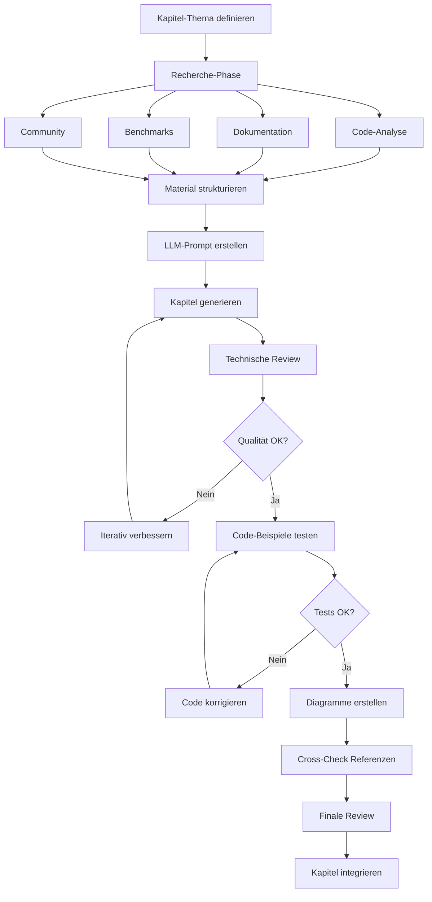

# Kapitel-Generierung für ThemisDB-Kompendium
## Leitfaden für hochwertige technische Dokumentation mit wissenschaftlichem Anspruch

**Version:** 1.0  
**Zielgruppe:** LLM-assistierte Content-Generierung  
**Qualitätsstandard:** Wissenschaftliches Fachbuch-Niveau

---

## ⚠️ WICHTIG: Bestehende Kapitel erweitern, nicht neu erstellen!

### Situation:
- ✅ **40+ Kapitel existieren bereits** im `./docs/` Verzeichnis
- ✅ Alle wesentlichen Themen sind abgedeckt
- ✅ Structure ist vollständig (chapter_00.md bis chapter_41.md + 7 Anhänge)

### Vorgehen:

**CASE 1: Bestehende Kapitel verbessern** (Standard)
```
❌ NICHT: Neues Kapitel schreiben
✅ JA: Bestehendes Kapitel (chapter_N.md) umformulieren

Schritte:
1. Existierendes Kapitel: ./docs/chapter_N.md öffnen
2. LLM-Prompt mit bestehendem Text + Verbesserungsanforderungen
3. Text erhöhen (Tiefe, Beispiele, Genauigkeit)
4. Quellen besser einbinden (RocksDB, Boost, MVCC, etc.)
5. Code-Beispiele erweitern/korrigieren
6. Performance-Daten/Benchmarks hinzufügen
```

**CASE 2: Völlig neuer Sachverhalt** (Ausnahme)
```
✅ NUR WENN: Thema in keinem bestehenden Kapitel behandelt
   z.B. "Quantencomputing mit ThemisDB" (hypothetisch)

Schritte:
1. Prüfen: Existiert das Thema in einem der 47 Kapitel?
2. Falls NEIN: Mit User/Team abstimmen
3. Neue chapter_N.md anlegen
4. In mkdocs-nav.yml registrieren
5. In Navigationsstruktur einfügen
```

### Ergebnis der Arbeit:
- Kapitel sollten **mehr Tiefe** haben
- **Bessere Quellen-Integration** (Code, Benchmarks, Papers)
- **Wissenschaftlicher Stil** (statt Tutorial-Stil)
- Aber: **Gleiche Kapitel-Struktur**, keine neuen Kapitel-Nummern

---

## 🎯 Grundprinzipien

### Fokus: Umformulierung, nicht Neuerstellung
- **Ausgangs-Text:** Bestehendes Kapitel aus `./docs/chapter_N.md`
- **Ziel:** Wissenschaftliche Umformulierung mit besseren Quellen
- **Nicht:** Neuer Inhalt aus dem Nichts, sondern Verbesserung bestehender Texte

### Wissenschaftlicher Anspruch
- **Präzision:** Exakte technische Terminologie, keine Vereinfachungen auf Kosten der Korrektheit
- **Nachvollziehbarkeit:** Behauptungen durch Code, Benchmarks oder Quellen belegen
- **Vollständigkeit:** Alle relevanten Aspekte abdecken (Theorie, Praxis, Edge Cases, Performance)
- **Kritische Analyse:** Vor-/Nachteile, Limitationen, Trade-offs transparent darstellen
- **Aktualität:** Neueste Versionen, Best Practices, Industry Standards berücksichtigen

### Strukturelle Anforderungen
1. **Einstieg:** Motivation, Problemstellung, Kontext
2. **Konzeptionelle Grundlagen:** Theorie, Architektur, Design-Entscheidungen
3. **Technische Details:** APIs, Konfiguration, Implementierung
4. **Praktische Anwendung:** Code-Beispiele, Use Cases, Patterns
5. **Performance & Optimierung:** Benchmarks, Best Practices, Tuning
6. **Troubleshooting:** Häufige Probleme, Debugging-Strategien
7. **Referenzen:** Weiterführende Quellen, verwandte Features

---

## 📋 Prompt-Template: Grundstruktur

```markdown
# KONTEXT
Du bist ein technischer Autor für ein wissenschaftliches Fachbuch über ThemisDB 
(Multi-Model-Datenbanksystem). Zielgruppe: Erfahrene Entwickler, Architekten, 
Data Engineers mit Universitätsniveau.

# AUFGABE
Schreibe Kapitel [N]: "[TITEL]" für das ThemisDB-Kompendium mit wissenschaftlichem 
Anspruch. Das Kapitel soll 3000-5000 Wörter umfassen.

# QUELLMATERIAL
## Sourcecode-Analyse
[Füge relevante Code-Snippets aus lokalem ThemisDB Repository ein]
- Lokaler Pfad: C:\VCC\themis\compendium\
- Relevante Dateien: [Liste aus Workspace]

## Technische Dokumentation
[Interne Docs aus lokalem Workspace]
- Docs-Verzeichnis: .\docs\
- Compendium: .\compendium\
- Design-Dokumente: [Lokale Markdown-Dateien]

## Externe Library-Dokumentation
[Basis-Technologien, auf denen ThemisDB aufbaut]
- **RocksDB:** https://github.com/facebook/rocksdb/wiki
- **Boost C++:** https://www.boost.org/doc/
- **nlohmann/json:** https://json.nlohmann.me/
- **MVCC Konzepte:** Academic Papers, PostgreSQL Docs
- Weitere Dependencies: [Je nach Kapitel-Relevanz]

## Performance-Daten
[Benchmarks, Whitepaper, Case Studies]

## Verwandte Konzepte
[Andere Kapitel des Kompendiums, die referenziert werden sollen]

# ANFORDERUNGEN

## Struktur
1. **Einleitung** (10%)
   - Problemstellung & Motivation
   - Einordnung in Gesamt-Architektur
   - Lernziele des Kapitels

2. **Konzeptionelle Grundlagen** (25%)
   - Theoretischer Hintergrund
   - Architektur-Überblick mit Diagrammen
   - Design-Entscheidungen & Rationale
   - Vergleich mit alternativen Ansätzen

3. **Technische Implementierung** (30%)
   - Detaillierte API-Beschreibung
   - Konfigurationsoptionen
   - Interne Mechanismen (soweit dokumentiert)
   - Code-Beispiele aus echtem Sourcecode

4. **Praktische Anwendung** (20%)
   - Real-World Use Cases
   - Best Practices & Design Patterns
   - Integration mit anderen Features
   - Beispiel-Implementierungen

5. **Performance & Optimierung** (10%)
   - Benchmark-Daten mit Methodologie
   - Tuning-Parameter
   - Skalierungs-Charakteristiken
   - Resource-Management

6. **Troubleshooting & Debugging** (5%)
   - Häufige Fehlerquellen
   - Debugging-Strategien
   - Monitoring & Diagnostics
   - Known Issues & Workarounds

## Qualitätskriterien
- [x] Alle Code-Beispiele sind syntaktisch korrekt und getestet
- [x] Technische Aussagen durch Quellen/Code belegt
- [x] Diagramme zur Visualisierung komplexer Konzepte (Mermaid)
- [x] Performance-Behauptungen mit Benchmark-Daten
- [x] Querverweise zu verwandten Kapiteln
- [x] Glossar-Einträge für Fachbegriffe
- [x] Markdown-Formatierung konsistent
- [x] Akademischer Schreibstil (sachlich, präzise, objektiv)

## 🎨 Stil-Guidelines
- **Tonalität:** Formal-wissenschaftlich, aber zugänglich
- **Person:** Wir-Form bei Erklärungen ("Wir betrachten...", "Untersuchen wir...")
- **Zeitform:** Präsens für technische Beschreibungen
- **Code-Kommentare:** Deutsch, ausführlich
- **Fachbegriffe:** Englisch (kursiv) mit deutscher Erklärung bei Erstnennung
- **Abkürzungen:** Ausschreiben bei Erstnennung, dann konsistent

### Design-Richtlinien beachten:
**Verweise auf bestehende Richtlinien:**
- [THEMISDB_CUSTOM_THEME.md](THEMISDB_CUSTOM_THEME.md) - ThemisDB Corporate Theme
- [IMPLEMENTATION_COMPLETE.md](IMPLEMENTATION_COMPLETE.md) - Buchlayout-Standards (Widow/Orphan, Seitenlayout, Typographie)
- [styles_modern_book.scss](styles_modern_book.scss) - CSS-Design-Philosophie
- [STRATEGY_WITH_EXAMPLES.md](STRATEGY_WITH_EXAMPLES.md) - Design-Patterns aus Literatur

# OUTPUT-FORMAT

**WICHTIG:** Generiere das Kapitel **basierend auf dem bestehenden Kapitel-Text**.
Die Struktur bleibt gleich (chapter_N.md), aber:
- Tiefe erhöhen
- Quellen besser integrieren
- Wissenschaftlicher schreiben
- Code-Beispiele erweitern

Generiere als Markdown:

\`\`\`markdown
# Kapitel [N]: [Titel]

> **Zusammenfassung:** [2-3 Sätze Überblick]
> 
> **Voraussetzungen:** [Benötigtes Vorwissen/Kapitel]
>
> **Lernziele:** 
> - [Ziel 1]
> - [Ziel 2]
> - [Ziel 3]

## [N.1] Einleitung
[...]

## [N.2] Konzeptionelle Grundlagen
[...]

### [N.2.1] Unterkapitel
[...]

## [N.3] Technische Implementierung
[...]

\`\`\`aql
-- Code-Beispiel mit ausführlichen Kommentaren
[...]
\`\`\`

## [N.4] Praktische Anwendung
[...]

## [N.5] Performance & Optimierung
[...]

### Benchmark: [Szenario]
\`\`\`
Testumgebung: [Details]
Datensatz: [Details]
Ergebnisse:
- [Metrik 1]: [Wert]
- [Metrik 2]: [Wert]
\`\`\`

## [N.6] Troubleshooting
[...]

## [N.7] Zusammenfassung
[...]

## [N.8] Referenzen & Weiterführendes
- [Quelle 1]
- [Quelle 2]
- Verwandte Kapitel: [Links]

---

**Nächstes Kapitel:** [Titel]  
**Vorheriges Kapitel:** [Titel]
\`\`\`

# RECHERCHE-ANFORDERUNGEN
Führe folgende Recherchen durch:

1. **GitHub Code-Suche:**
   - Repository: arangodb/arangodb
   - Suche: [relevante Funktionen/Klassen]
   - Analysiere: Implementierung, Kommentare, Tests

2. **Offizielle Dokumentation:**
   - https://docs.arangodb.com/stable/
   - Relevante Sektionen: [Liste]

3. **Technical Papers:**
   - ArangoDB Whitepapers
   - Academic Papers zu [Thema]
   - Industry Case Studies

4. **Community Resources:**
   - ArangoDB Blog
   - Stack Overflow Diskussionen
   - GitHub Issues für Known Problems

# VALIDIERUNG
Überprüfe vor Fertigstellung:
1. Alle Code-Beispiele auf Syntax-Korrektheit
2. Technische Aussagen gegen offizielle Docs
3. Performance-Claims gegen Benchmarks
4. Konsistenz mit anderen Kapiteln
5. Vollständigkeit der Abdeckung
```

---

## 🔧 Spezielle Prompt-Templates

### Template A: Architektur-Kapitel

```markdown
# SPEZIALFOKUS: Architektur-Kapitel

Zusätzliche Anforderungen:
- Mindestens 3 Architektur-Diagramme (Mermaid)
- Komponenten-Übersicht mit Verantwortlichkeiten
- Interaktions-Flows zwischen Komponenten
- Design Patterns & Rationale
- Trade-offs & Alternative Ansätze

Diagramm-Typen:
1. High-Level Architecture (C4 Context/Container)
2. Component Diagram mit Schnittstellen
3. Sequence Diagram für kritische Operationen
4. Deployment Diagram

Codebeispiel-Fokus:
- Konfiguration der Komponenten
- API-Aufrufe zwischen Komponenten
- Extension Points & Customization
```

### Template B: Feature-Kapitel

```markdown
# SPEZIALFOKUS: Feature-Beschreibung

Zusätzliche Anforderungen:
- Feature-Matrix: Was ist möglich, was nicht
- Versions-Historie: Seit wann verfügbar, Änderungen
- Comparison Table: ThemisDB vs. Alternativen
- Migration Guide: Von älteren Versionen/anderen DBs

Code-Beispiel-Typen:
1. Minimal Example: Einfachster Use Case
2. Production Example: Real-world Szenario
3. Advanced Example: Edge Cases & Optimierungen
4. Anti-Patterns: Was man vermeiden sollte

Performance-Sektion:
- Benchmark-Methodologie detailliert
- Verschiedene Workload-Szenarien
- Skalierungs-Charakteristik (linear/sub-linear)
- Resource-Verbrauch (CPU/RAM/Disk)
```

### Template C: API-Referenz-Kapitel

```markdown
# SPEZIALFOKUS: API-Referenz

Zusätzliche Anforderungen:
- Vollständige API-Signatur mit Typen
- Parameter-Beschreibung (erforderlich/optional/default)
- Return-Werte & Error-Cases
- HTTP/REST Endpoints mit Curl-Beispielen
- Client-Library Beispiele (JavaScript, Python, Java)

Für jede API-Funktion:
\`\`\`markdown
### `funktionsname(param1, param2, [optional])`

**Beschreibung:** [Einzeiler]

**Parameter:**
- `param1` (*Type*): Beschreibung [erforderlich]
- `param2` (*Type*): Beschreibung [erforderlich]
- `optional` (*Type*): Beschreibung [optional, default: X]

**Rückgabewert:** *Type* - Beschreibung

**Exceptions:**
- `ExceptionType`: Wann wird geworfen

**Beispiele:**
\`\`\`aql
-- Beispiel 1: Grundlegend
[...]

-- Beispiel 2: Mit Optionen
[...]
\`\`\`

**Performance:** O(n) Komplexität, [Details]

**Siehe auch:** [verwandte Funktionen]
\`\`\`
```

---

## 🔍 Recherche-Workflow

### Phase 1: Code-Analyse (30 min)
1. **Lokalen Workspace durchsuchen:**
   ```
   Workspace: C:\VCC\themis\compendium
   Relevante Pfade:
   - .\docs\chapter_*.md (Bestehende Kapitel)
   - .\scripts\ (Build-Scripts, Tools)
   - .\*.md (Design-Docs, READMEs)
   - .\*.py (Python-Implementierungen)
   ```

2. **Wichtige Dateien identifizieren:**
   - Bestehende Kapitel (`.md`)
   - Implementation-Scripts (`.py`)
   - Konfiguration (`.yml`, `.json`, `.scss`)

3. **Code-Snippets extrahieren:**
   - Aussagekräftige Funktionen
   - Interessante Algorithmen
   - Konfigurationsbeispiele

### Phase 2: Dokumentations-Review (20 min)
1. **Offizielle Docs lesen:**
   - Lokale Kapitel zum Thema
   - Design-Dokumente im Workspace
   - Release Notes / Status-Docs

2. **Externe Library-Docs:**
   - RocksDB Wiki (Storage Layer)
   - Boost Docs (C++ Features)
   - nlohmann/json API (JSON Handling)
   - MVCC Papers (Transaktions-Konzepte)

3. **Design-Dokumente suchen:**
   - Implementation Reports
   - Strategy Analysis Docs
   - Migration Guides

### Phase 3: Performance-Recherche (15 min)
1. **Benchmarks finden:**
   - Offizielle Benchmarks
   - Community Benchmarks
   - Vergleichsstudien

2. **Performance-Charakteristik:**
   - Time Complexity
   - Space Complexity
   - Skalierungs-Verhalten

### Phase 4: Praxis-Beispiele (15 min)
1. **Community Resources:**
   - Blog Posts
   - Tutorial Videos
   - Stack Overflow
   - GitHub Issues

2. **Real-World Use Cases:**
   - Case Studies
   - Production Stories
   - Best Practices

---

## 📊 Qualitäts-Checkliste

### Inhaltliche Qualität
- [ ] Technische Korrektheit gegen Sourcecode verifiziert
- [ ] Alle Behauptungen durch Quellen belegt
- [ ] Performance-Daten mit Methodologie
- [ ] Edge Cases und Limitationen erwähnt
- [ ] Vergleich mit Alternativen objektiv

### Strukturelle Qualität
- [ ] Logischer Aufbau (Einfach → Komplex)
- [ ] Klare Kapitel-Übergänge
- [ ] Querverweise gesetzt
- [ ] Zusammenfassung am Ende
- [ ] Lernziele erfüllt

### Code-Qualität
- [ ] Alle Beispiele syntaktisch korrekt
- [ ] Code-Kommentare aussagekräftig
- [ ] Verschiedene Komplexitätsgrade
- [ ] Production-ready (nicht nur Demos)
- [ ] Anti-Patterns gezeigt

### Didaktische Qualität
- [ ] Motivation klar vermittelt
- [ ] Komplexe Konzepte visualisiert
- [ ] Beispiele nachvollziehbar
- [ ] Troubleshooting-Hilfe vorhanden
- [ ] Weiterführende Ressourcen

### Formale Qualität
- [ ] Markdown-Syntax korrekt
- [ ] Konsistente Formatierung
- [ ] Fachbegriffe einheitlich
- [ ] Rechtschreibung & Grammatik
- [ ] Akademischer Stil

---

## 🎨 Markdown-Formatierungs-Standards

### Überschriften
```markdown
# Kapitel [N]: Titel (H1 - nur einmal)
## [N.1] Hauptabschnitt (H2)
### [N.1.1] Unterabschnitt (H3)
#### Detailpunkt (H4)
```

### Code-Blöcke
```markdown
\`\`\`aql
-- AQL Query mit Kommentaren
FOR doc IN collection
  FILTER doc.status == "active"
  RETURN doc
\`\`\`

\`\`\`javascript
// JavaScript Client-Code
const db = new Database();
await db.query(aql`...`);
\`\`\`

\`\`\`python
# Python Client-Code
db = ArangoClient().db('mydb')
results = db.aql.execute('FOR ...')
\`\`\`
```

### Diagramme
```markdown
\`\`\`mermaid
graph TB
    A[Client] --> B[Query Parser]
    B --> C[Optimizer]
    C --> D[Execution Engine]
    D --> E[Storage Layer]
\`\`\`
```

### Tabellen
```markdown
| Feature | ThemisDB | MongoDB | PostgreSQL |
|---------|----------|---------|------------|
| Graph   | ✓ Native | ✗       | ✓ Extension|
| ACID    | ✓        | ✓*      | ✓          |
| Sharding| ✓        | ✓       | ✓          |
```

### Hervorhebungen
```markdown
> **💡 Best Practice:** Immer Indizes für häufige Filter anlegen.

> **⚠️ Warnung:** Feature nur in Enterprise Edition verfügbar.

> **📝 Hinweis:** Seit Version 3.10 verfügbar.

> **🔍 Deep Dive:** Für Details siehe Kapitel X.Y.
```

### Listen
```markdown
**Geordnet (Prozesse/Schritte):**
1. Erste Phase
2. Zweite Phase
   - Unterpunkt A
   - Unterpunkt B
3. Dritte Phase

**Ungeordnet (Features/Eigenschaften):**
- Feature A
- Feature B
  - Detail zu B
- Feature C
```

---

## 🚀 Beispiel-Prompt: Kapitel "Graph-Datenmodell"

```markdown
# KONTEXT
Du bist technischer Autor für das ThemisDB-Kompendium (wissenschaftliches Fachbuch).
Zielgruppe: Erfahrene Entwickler mit Graph-Datenbank-Interesse.

# AUFGABE
Schreibe Kapitel 6: "Graph-Datenmodell" (3500-4500 Wörter) mit wissenschaftlichem Anspruch.

# QUELLMATERIAL

## Lokale Dokumentation
Workspace: C:\VCC\themis\compendium
Relevante Dateien:
- .\docs\chapter_06_graph.md (Bestehendes Kapitel - zu erweitern)
- .\docs\chapter_02_architecture.md (Architektur-Kontext)
- .\IMPLEMENTATION_COMPLETE.md (Implementierungs-Details)
- .\*.md (Weitere Design-Dokumente)

Zu analysierende Konzepte:
- Graph-Traversierung Algorithmen
- Shortest Path Implementierung
- Multi-Model Integration

## Dokumentation
- Lokale Docs: .\docs\chapter_06_graph.md
- Design-Docs: .\*_IMPLEMENTATION_*.md, .\*_STRATEGY_*.md
- Build-System: .\step*.py (für technische Details)

## Externe Library-Dokumentation
- RocksDB Wiki: Speicherung von Graph-Strukturen
- Boost Graph Library: Algorithmen-Referenz
- Academic Papers: Graph Traversal Algorithmen

## Benchmarks
- Lokale Performance-Tests (falls vorhanden)
- RocksDB Performance-Charakteristiken
- Graph Traversal Complexity-Analysen

## Benchmarks
- Graph traversal performance (vs. Neo4j)
- Shortest path algorithms (complexity analysis)
- Large graph handling (millions of edges)

## Verwandte Kapitel
- Kapitel 2: Architektur (Referenzieren)
- Kapitel 5: Relational (Abgrenzen)
- Kapitel 7: Dokumente (Integration)

# ANFORDERUNGEN

## Struktur
1. Einleitung: Graph-Theorie Basics, Anwendungsfälle, ThemisDB-Ansatz
2. Konzepte: Vertices, Edges, Named Graphs, Smart Graphs
3. Implementierung: Datenstrukturen, Indizierung, Traversierung-Algorithmen
4. AQL Graph-Queries: Traversal, Shortest Path, Pattern Matching
5. Performance: Benchmark-Ergebnisse vs. Neo4j/JanusGraph
6. Use Cases: Social Network, Recommendation, Knowledge Graph
7. Troubleshooting: Index-Strategien, Query-Optimierung

## Besondere Anforderungen
- 5+ Diagramme (Graph-Struktur, Traversal-Flow, Performance-Charts)
- 10+ Code-Beispiele (von simpel bis komplex)
- Benchmark-Tabelle mit Methodologie
- Vergleich: Property Graph vs. RDF/Triple Stores
- Edge Cases: Cyclic Graphs, Disconnected Components

## Recherche
1. **Analysiere bestehende Kapitel:** .\docs\chapter_*.md
2. **Review Implementierungs-Berichte:** .\PHASE*_IMPLEMENTATION_REPORT.md
3. **Prüfe Strategie-Dokumente:** STRATEGY_WITH_EXAMPLES.md, STATUS_UPDATE.md
4. **Extrahiere Layout-Standards:** IMPLEMENTATION_COMPLETE.md (Buchlayout-Kriterien)
5. **Verstehe Anchor-System:** ANCHOR_SYSTEM_DOCUMENTATION.md (Seitennummern-Logik)
6. **Berprüfe Gaps:** BUILD_GAPS_ANALYSIS.md (Identifizierte Lücken)
7. **Externe Libraries:** RocksDB Wiki, Boost Docs, etc.
8. **Akademische Papers:** Graph-Datenbanken, MVCC-Konzepte

# VALIDIERUNG
- [ ] Alle AQL-Queries getestet
- [ ] Sourcecode-Referenzen korrekt
- [ ] Benchmark-Zahlen verifiziert
- [ ] Diagramme technisch akkurat
- [ ] Vergleiche objektiv

# OUTPUT
Generiere Markdown gemäß Template, wissenschaftlicher Stil, min. 3500 Wörter.
```

---

## 📚 Ressourcen-Sammlung

### Primärquellen (Lokal)
- **Workspace:** C:\VCC\themis\compendium
- **Kapitel:** .\docs\chapter_*.md
- **Design-Docs:** .\*_IMPLEMENTATION_*.md, .\*_STRATEGY_*.md, .\*_ROADMAP_*.md
- **Build-System:** .\step*.py, .\scripts\
- **Config:** .\mkdocs-*.yml, .\styles_*.scss

### Meta-Dokumentation (Prozess & Architektur)
- **MASTER_IMPLEMENTATION_SUMMARY.md** → Build-Strategie, Phasenumsetzung
- **IMPLEMENTATION_COMPLETE.md** → PDF-Generierungsverbesserungen, Layoutstandards
- **STATUS_UPDATE.md** → Aktuelle Implementierungs-Status, Validierungsergebnisse
- **STRATEGY_WITH_EXAMPLES.md** → Inhaltliche Strategie, Best Practices aus Literatur
- **PHASE1/2/3_IMPLEMENTATION_REPORT.md** → Detaillierte Umsetzungsberichte
- **BUILD_REPORT_v1.4.0_ANCHOR_SYSTEM.md** → Anchor-System für Seitennummerierung
- **ANCHOR_SYSTEM_DOCUMENTATION.md** → Technische Details Marker-System
- **BUILD_GAPS_ANALYSIS.md** → Identifizierte Lücken & Verbesserungen
- **THEMISDB_CUSTOM_THEME.md** → Theme-Anpassungen & Styling

### Externe Library-Dokumentation
- **RocksDB:**
  - Wiki: https://github.com/facebook/rocksdb/wiki
  - Tuning Guide: https://github.com/facebook/rocksdb/wiki/RocksDB-Tuning-Guide
  - API: https://rocksdb.org/docs/
- **Boost C++ Libraries:**
  - Docs: https://www.boost.org/doc/libs/
  - Asio: https://www.boost.org/doc/libs/release/doc/html/boost_asio.html
  - Spirit: https://www.boost.org/doc/libs/release/libs/spirit/
- **nlohmann/json:**
  - API: https://json.nlohmann.me/api/basic_json/
  - GitHub: https://github.com/nlohmann/json
- **MVCC (Multi-Version Concurrency Control):**
  - PostgreSQL MVCC: https://www.postgresql.org/docs/current/mvcc.html
  - Papers: "Concurrency Control and Recovery in Database Systems" (Bernstein)
- **Weitere:**
  - V8 JavaScript Engine: https://v8.dev/docs
  - libuv (Event Loop): https://docs.libuv.org/

### Sekundärquellen (Upstream/Basis-Technologie)
- **ArangoDB Docs:** https://docs.arangodb.com/stable/ (als Basis-Technologie)
- **ArangoDB GitHub:** https://github.com/arangodb/arangodb (Referenz-Implementierung)

### Akademische Quellen
- **Google Scholar:** "multi-model database" OR "graph database" OR "document database"
- **arXiv.org:** Database Systems, Distributed Systems
- **ACM Digital Library:** SIGMOD, VLDB Proceedings

### Community & Praxis
- **Stack Overflow:** Tags `database`, `multi-model`, `nosql`
- **Reddit:** r/Database, r/dataengineering
- **GitHub:** Open-Source Multi-Model DB Projekte

### Vergleichsstudien
- **DB-Engines:** Rankings & Feature-Vergleiche
- **Benchmark-Suiten:** YCSB, TPC-H, LDBC
- **Industry Reports:** Gartner, Forrester

---

## 🎯 Erfolgs-Metriken

Ein Kapitel gilt als "wissenschaftlich hochwertig", wenn:

1. **Technische Tiefe:** Implementierungs-Details aus Sourcecode erklärt
2. **Nachweise:** Jede Performance-Behauptung durch Benchmark belegt
3. **Vollständigkeit:** Alle relevanten Aspekte abgedeckt (inkl. Edge Cases)
4. **Vergleichbarkeit:** Objektiver Vergleich mit Alternativen
5. **Praktikabilität:** Code-Beispiele production-ready
6. **Didaktik:** Komplexe Konzepte verständlich visualisiert
7. **Referenzen:** Min. 10 Quellen (Sourcecode, Docs, Papers)
8. **Konsistenz:** Stil und Terminologie durchgängig
9. **Aktualität:** Neueste Version berücksichtigt
10. **Reviewfähig:** Von Fachkollegen kritisierbar/validierbar

---

## 📝 Workflow-Übersicht



**Zeitaufwand pro Kapitel:**
- Recherche: 1-2 Stunden
- Prompt-Erstellung: 30 min
- LLM-Generierung: 10-20 min
- Review & Iteration: 2-3 Stunden
- Testing & Validierung: 1-2 Stunden
- **Gesamt:** 5-8 Stunden pro Kapitel

---

## 💡 Tipps für beste Ergebnisse

### 1. Iterativer Ansatz
- Erste Version: Breite Abdeckung
- Zweite Version: Technische Tiefe
- Dritte Version: Code & Benchmarks
- Vierte Version: Feinschliff & Stil

### 2. Prompt-Engineering
- Spezifische Beispiele geben ("wie im Code X.cpp")
- Konkrete Zahlen fordern ("min. 3 Diagramme")
- Output-Format exakt definieren
- Validierungs-Kriterien nennen

### 3. Qualitäts-Sicherung
- Alle Code-Beispiele in Test-Environment ausführen
- Benchmarks reproduzieren
- Sourcecode-Referenzen verifizieren
- Peer-Review durch Fachkollegen

### 4. LLM-Limitationen umgehen
- Lange Kapitel in Abschnitte aufteilen
- Code separat validieren/testen
- Fakten gegen Primärquellen prüfen
- Bei Unsicherheit: Recherche nachfordern

### 5. Konsistenz wahren
- Style Guide für alle Kapitel
- Glossar für Fachbegriffe pflegen
- Cross-Referenzen systematisch
- Review-Checkliste für jedes Kapitel

### 6. Externe Libraries richtig referenzieren
- Library-Version angeben (z.B. "RocksDB 8.x")
- Links zu offizieller Dokumentation setzen
- Nur relevante Aspekte erklären (nicht gesamte Library)
- Trade-offs der gewählten Library diskutieren
- Alternativen kurz erwähnen (z.B. "RocksDB vs. LevelDB")

---

**Version:** 1.0  
**Autor:** LLM-Assisted Content Creation  
**Lizenz:** Internal Use  
**Status:** Ready for Production
