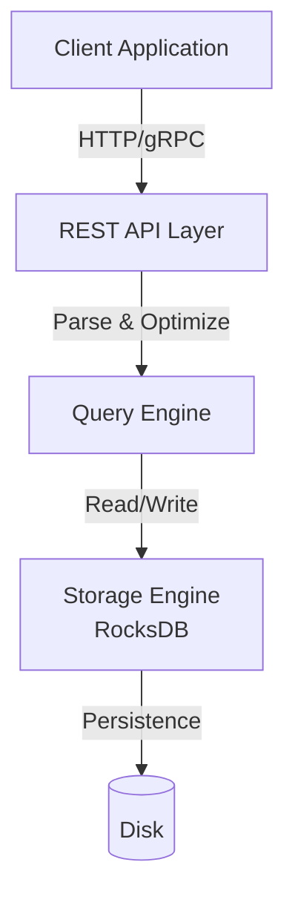
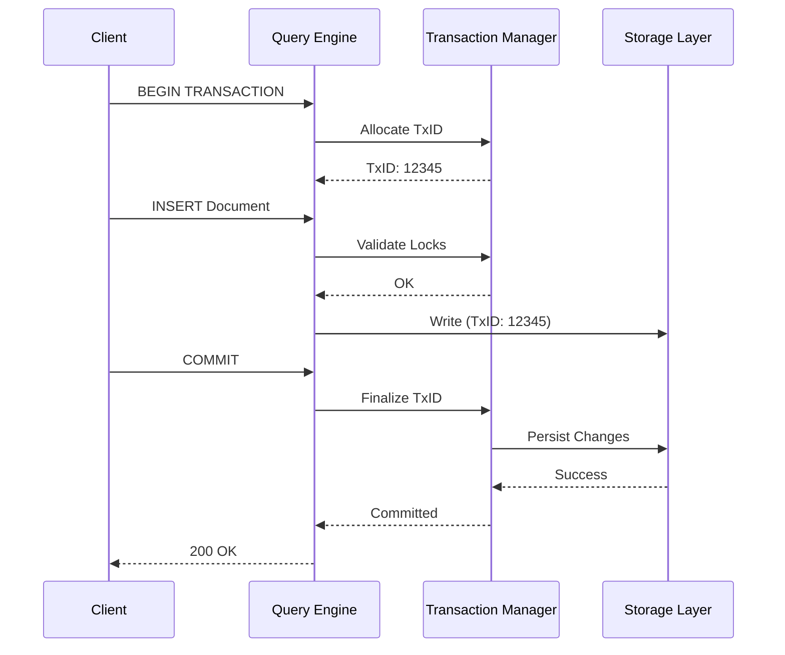

# 🚀 Quick Start Guide: Kapitel-Verbesserung

**Zielgruppe:** Entwickler/Editoren, die Kapitel verbessern  
**Version:** 1.0  
**Datum:** 2026-01-13

---

## ⚡ TL;DR - In 5 Minuten verstehen

### Was ist das Ziel?
Alle 41 Kapitel des ThemisDB-Kompendiums **schrittweise verbessern** (nicht neu schreiben!), um ein wissenschaftliches Fachbuch-Niveau zu erreichen.

### Wie läuft es ab?
1. **Reverse Order:** Kapitel 41 → Kapitel 00
2. **Pro Kapitel:** 5-12 Stunden Arbeit
3. **Workflow:** Analysieren → Recherchieren → Verbessern → Validieren → Committen

### Welche Dokumente sind wichtig?
- 📋 [TODO_41_STAGES.md](TODO_41_STAGES.md) - Checkliste (zum Abhaken)
- 🗺️ [CHAPTER_IMPROVEMENT_ROADMAP.md](CHAPTER_IMPROVEMENT_ROADMAP.md) - Detaillierter Plan
- 🧠 [KAPITEL_MINDSET.md](KAPITEL_MINDSET.md) - **PFLICHT VOR START!**
- 📖 [CHAPTER_GENERATION_GUIDE.md](CHAPTER_GENERATION_GUIDE.md) - Templates & Guidelines

---

## 🎯 Stage-Workflow (7 Schritte)

### Schritt 1: Analyse (30-45 min)

**Ziel:** Aktuellen Stand verstehen

```bash
# 1.1 Kapitel öffnen
cd /home/runner/work/ThemisDB/ThemisDB/compendium/docs
cat chapter_XX_<name>.md

# 1.2 Notizen machen (mental oder in /tmp)
# - Was ist vorhanden?
# - Was fehlt (Quellen, Code, Performance)?
# - Was ist veraltet?
```

**Checkliste:**
- [ ] Kapitel vollständig gelesen
- [ ] Struktur verstanden
- [ ] Gaps identifiziert:
  - [ ] Quellen fehlen/unzureichend
  - [ ] Code-Beispiele fehlen/fehlerhaft
  - [ ] Performance-Daten fehlen
  - [ ] Diagramme fehlen
  - [ ] Querverweise fehlen

---

### Schritt 2: Recherche (1-2 Stunden)

**Ziel:** Material sammeln

#### 2.1 Externe Quellen
```bash
# RocksDB (wenn relevant)
# → https://github.com/facebook/rocksdb/wiki

# Boost C++ (wenn relevant)
# → https://www.boost.org/doc/libs/

# Akademische Papers
# → Google Scholar: "multi-model database" OR "<thema>"
# → arXiv.org: Database Systems

# Community Resources
# → Stack Overflow, GitHub Issues, Blogs
```

#### 2.2 Interne Quellen
```bash
# Verwandte Kapitel reviewen
grep -r "<keyword>" docs/chapter_*.md

# Implementation-Docs durchsuchen
ls -la /home/runner/work/ThemisDB/ThemisDB/compendium/*_IMPLEMENTATION_*.md

# Code-Beispiele finden
find /home/runner/work/ThemisDB/ThemisDB -name "*.cpp" -o -name "*.aql"
```

#### 2.3 Referenzmaterial
```bash
# Gimini-Berichte als Qualitätsreferenz
ls -la /home/runner/work/ThemisDB/ThemisDB/docs/gimini/
```

**Checkliste:**
- [ ] Min. 5 externe Quellen gesammelt
- [ ] Verwandte Kapitel identifiziert (für Querverweise)
- [ ] Code-Beispiele gefunden/erstellt
- [ ] Benchmark-Daten recherchiert (falls relevant)
- [ ] Diagramm-Ideen notiert

---

### Schritt 3: Verbesserung (2-4 Stunden)

**Ziel:** Kapitel auf wissenschaftliches Niveau heben

#### 3.0 Motivierendes Zitat hinzufügen

**Vorbild: Kapitel 1**

Jedes Kapitel soll mit einem inspirierenden Zitat oder Sinnspruch beginnen, der zum Thema passt und den Leser motiviert.

**Format:**
```markdown
# Kapitel X: Titel

> *"Zitat oder Sinnspruch zum Thema"*  
> *— Autor*

> **Zusammenfassung:** ...
```

**Beispiele:**
- Kapitel 1 (Einführung): Konfuzius-Zitat über Werkzeugwahl
- Kapitel 41 (Hands-on Labs): *"Ich höre und vergesse. Ich sehe und erinnere mich. Ich tue und verstehe."* — Konfuzius

**Quellen für passende Zitate:**
- Philosophen (Konfuzius, Sokrates, Aristoteles)
- Wissenschaftler (Einstein, Turing, Knuth)
- Tech-Persönlichkeiten (Dijkstra, Knuth, Brooks)
- Sprichwörter & Weisheiten

**Richtlinien:**
- ✅ Kurz und prägnant (1-3 Sätze)
- ✅ Relevanz zum Kapitel-Thema
- ✅ Motivierend & inspirierend
- ✅ Kursiv-Format für Zitat
- ✅ Autor-Attribution (falls bekannt)

#### 3.1 Sprache verbessern

**Vorher (Tutorial-Stil):**
```markdown
ThemisDB ist super einfach zu installieren. Einfach:
1. Docker runterladen
2. `docker pull themisdb` ausführen
3. Fertig!
```

**Nachher (Wissenschaftlich):**
```markdown
Die Installation von ThemisDB erfolgt vorzugsweise über containerisierte 
Deployment-Strategien. Wir empfehlen Docker als primäre Bereitstellungsmethode:

1. **Container-Image beziehen:**
   ```bash
   docker pull themisdb/themisdb:latest
   ```

2. **Instanz initialisieren:**
   ```bash
   docker run -d \
     --name themisdb \
     -p 8529:8529 \
     -v /data/themisdb:/var/lib/themisdb \
     themisdb/themisdb:latest
   ```

Die containerbasierte Architektur gewährleistet Reproduzierbarkeit und 
vereinfacht horizontale Skalierung in Kubernetes-Umgebungen (siehe Kapitel 30).
```

**Stil-Regeln:**
- ✅ Wir-Form: "Wir betrachten...", "Wir analysieren..."
- ✅ Präsens: "ThemisDB verwendet...", "Der Algorithmus läuft..."
- ✅ Fachbegriffe: Englisch (kursiv) mit deutscher Erklärung
- ✅ Präzise Terminologie
- ❌ Keine Umgangssprache ("super", "einfach", "cool")

#### 3.2 Anchors für Stichwortverzeichnis hinzufügen 🆕

**Wichtig:** Jede Überschrift benötigt einen Anchor für das Stichwortverzeichnis.

**Format:**
```markdown
# Kapitel X: Titel {#chapter_X_titel-slug}

## X.1 Abschnitt {#chapter_X_1_abschnitt-slug}

### X.1.1 Unterabschnitt {#chapter_X_1_1_unterabschnitt-slug}
```

**Regeln:**
- ✅ **Prefix:** Immer `chapter_` + Kapitelnummer
- ✅ **Separator:** Unterstriche `_` zwischen Hierarchieebenen
- ✅ **Slug:** Kleinbuchstaben, Bindestriche statt Leerzeichen
- ✅ **Deutsch:** Umlaute umwandeln (ä→ae, ö→oe, ü→ue, ß→ss)
- ✅ **Spezialzeichen:** Entfernen (außer Bindestrich)

**Beispiele:**
```markdown
# Kapitel 41: Hands-on Labs {#chapter_41_hands-on-labs}

## 41.2 Lab A: Container-Deployment {#chapter_41_2_lab-a-container-deployment}

### 41.2.3 Setup: Container starten {#chapter_41_2_3_setup-container-starten}

### 41.3.5 Index-Anlage {#chapter_41_3_5_index-anlage}
```

#### 3.3 Einleitende Worte für jede Überschrift 🆕

**Regel:** Keine Überschrift ohne einleitenden Text (mindestens 1-3 Sätze, ~30 Wörter).

**Schlecht (direkt Code nach Überschrift):**
```markdown
### 41.2.3 Setup: Container starten

**Schritt 1:**
\```bash
docker run...
\```
```

**Gut (mit Einleitung):**
```markdown
### 41.2.3 Setup: Container starten {#chapter_41_2_3_setup-container-starten}

In diesem Schritt initialisieren wir eine ThemisDB-Instanz als Docker-Container 
mit persistentem Volume. Wir konfigurieren grundlegende Sicherheitsparameter 
und Port-Mappings für den Zugriff über die REST-API.

**Schritt 1:**
\```bash
docker run...
\```
```

**Richtlinien:**
- ✅ Min. 30 Wörter Einleitung
- ✅ Erklärt WAS und WARUM
- ✅ Kontext für nachfolgenden Inhalt
- ✅ Wissenschaftlicher Stil (formal, Wir-Form)
- ❌ Keine leeren Überschriften
- ❌ Nicht direkt Code/Tabelle nach Überschrift

#### 3.4 Quellen integrieren

```markdown
### Transaktions-Isolation

ThemisDB implementiert MVCC (Multi-Version Concurrency Control)[^1] analog 
zu PostgreSQL[^2]. Die Snapshot Isolation ermöglicht lesende Transaktionen 
ohne Locking (siehe [RocksDB MVCC-Implementation][rocksdb-mvcc]).

Performance-Charakteristik:
- Read Throughput: 50.000 TPS (Benchmark: YCSB Workload A)[^3]
- Write Latency: 2.3ms p99 (SSD NVMe, 16GB RAM)[^3]

[^1]: Bernstein, P. A., & Goodman, N. (1983). "Multiversion concurrency control"
[^2]: PostgreSQL Documentation: https://www.postgresql.org/docs/current/mvcc.html
[^3]: Interne Benchmarks, ThemisDB v1.3.4 (Methodologie: Kapitel 39)
[rocksdb-mvcc]: https://github.com/facebook/rocksdb/wiki/MVCC
```

**Quellen-Typen:**
1. **Primärquellen:** RocksDB, Boost, offizielle Docs
2. **Sekundärquellen:** Akademische Papers (Google Scholar)
3. **Tertiärquellen:** Blog Posts, Tutorials (sparsam verwenden)

#### 3.5 Code-Beispiele erweitern

**Anforderungen:**
- ✅ Syntaktisch korrekt (testen!)
- ✅ Vollständig (lauffähig)
- ✅ Gut kommentiert (Deutsch)
- ✅ Best Practices zeigen
- ✅ Anti-Patterns zeigen (was nicht tun)

**Template:**
```markdown
### Code-Beispiel: Graph-Traversierung

```aql
-- Beispiel: Kürzester Pfad in einem Sozialen Netzwerk
-- 
-- Gegeben: Collection 'users' und Edge-Collection 'follows'
-- Ziel: Kürzeste Verbindung zwischen zwei Usern finden

FOR v, e, p IN 1..5 OUTBOUND 'users/alice' follows
  FILTER v._id == 'users/bob'
  LIMIT 1
  RETURN {
    path: p.vertices[*].name,
    length: LENGTH(p.vertices) - 1,
    edges: p.edges[*].type
  }

-- Performance-Hinweis:
-- - Depth Limit (1..5) verhindert Deep Traversal (O(n^d))
-- - LIMIT 1 stoppt nach erstem Fund (Optimierung)
-- - Index auf follows._from empfohlen
```

**Ergebnis:**
```json
{
  "path": ["Alice", "Charlie", "Bob"],
  "length": 2,
  "edges": ["follows", "follows"]
}
```

**Komplexität:** O(b^d) mit b = Branching Factor, d = Depth  
**Optimierung:** Smart Graphs für verteilte Traversierung (Kapitel 16)
```

#### 3.6 Diagramme hinzufügen

**Mermaid-Beispiele:**

```markdown
### Architektur-Diagramm



### Sequence-Diagramm


```

**Checkliste Schritt 3:**
- [ ] Sprache wissenschaftlich überarbeitet
- [ ] Min. 5 Quellen integriert (Inline-Zitate + Fußnoten)
- [ ] Min. 3 Code-Beispiele hinzugefügt/verbessert
- [ ] Min. 2 Diagramme erstellt (Mermaid)
- [ ] Performance-Daten hinzugefügt (falls relevant)
- [ ] Querverweise gesetzt (min. 3)

---

### Schritt 4: Design-Standards (30-60 min)

**Ziel:** Layout-Konformität sicherstellen

#### 4.1 Überschriften-Hierarchie

```markdown
# Kapitel X: Titel (H1 - nur einmal!)

> **Zusammenfassung:** 2-3 Sätze Überblick
> **Lernziele:** Bullet-Liste

## [X.1] Hauptabschnitt (H2)

Fließtext...

### [X.1.1] Unterabschnitt (H3)

Fließtext...

#### Detail-Punkt (H4)

Fließtext...
```

#### 4.2 Typografie

```markdown
**Bold** für Begriffsdefinitionen
*Kursiv* für englische Fachbegriffe (z.B. *Multi-Version Concurrency Control*)
`Code` für inline code snippets

> **💡 Best Practice:** Hervorhebungen für wichtige Hinweise
> **⚠️ Warnung:** Vorsichtshinweise
> **📝 Hinweis:** Zusatzinformationen
> **🔍 Deep Dive:** Verweise auf detaillierte Erklärungen
```

#### 4.3 Listen

```markdown
**Geordnet (Prozesse):**
1. Schritt eins
2. Schritt zwei
   - Unterpunkt A
   - Unterpunkt B
3. Schritt drei

**Ungeordnet (Features):**
- Feature A
- Feature B
  - Detail zu B
- Feature C
```

#### 4.4 Tabellen

```markdown
| Feature | ThemisDB | MongoDB | PostgreSQL |
|---------|----------|---------|------------|
| Graph   | ✓ Native | ✗       | ✓ Extension|
| ACID    | ✓        | ✓*      | ✓          |
| Sharding| ✓        | ✓       | ✓          |

*Hinweis: MongoDB ACID nur innerhalb eines Shards
```

**Checkliste Schritt 4:**
- [ ] Überschriften-Hierarchie korrekt (H1→H2→H3→H4)
- [ ] Typografie konsistent
- [ ] Listen korrekt formatiert
- [ ] Tabellen lesbar und aussagekräftig
- [ ] Hervorhebungen sinnvoll eingesetzt
- [ ] IMPLEMENTATION_COMPLETE.md Standards beachtet

---

### Schritt 5: Validierung (1-2 Stunden)

**Ziel:** Technische Korrektheit sicherstellen

#### 5.1 Code-Beispiele testen

```bash
# AQL-Queries in ThemisDB-Shell testen (falls möglich)
# Oder: Syntax-Checker verwenden

# Markdown-Syntax prüfen
markdownlint chapter_XX_*.md

# Links validieren
markdown-link-check chapter_XX_*.md
```

#### 5.2 Quellen-Links prüfen

```bash
# Alle URLs extrahieren und testen
grep -oP 'https?://[^\s\)]+' chapter_XX_*.md | while read url; do
  curl -sI "$url" | head -1
done
```

#### 5.3 Fakten verifizieren

- [ ] Performance-Zahlen gegen Benchmarks geprüft
- [ ] API-Signaturen gegen Docs geprüft
- [ ] Versionsangaben aktuell (v1.3.4+)
- [ ] Technische Aussagen durch Quellen belegt

#### 5.4 Querverweise testen

```bash
# Interne Links prüfen
grep -oP '\[.*?\]\(chapter_[0-9]+.*?\.md\)' chapter_XX_*.md
```

**Checkliste Schritt 5:**
- [ ] Alle Code-Beispiele syntaktisch korrekt
- [ ] Alle externen Links funktionieren (HTTP 200)
- [ ] Alle internen Querverweise existieren
- [ ] Performance-Daten verifiziert
- [ ] Fakten durch Primärquellen belegt
- [ ] Markdown-Syntax fehlerfrei

---

### Schritt 6: Review & Iteration (30-60 min)

**Ziel:** Qualität durch Feedback verbessern

#### 6.1 Self-Review

**Checkliste:**
- [ ] Lernziele am Anfang erfüllt am Ende?
- [ ] Logischer Aufbau (Einfach → Komplex)?
- [ ] Alle Fachbegriffe erklärt/glossar?
- [ ] Zusammenfassung am Ende vorhanden?
- [ ] Min. 3000-5000 Wörter erreicht?

#### 6.2 Peer-Review (optional)

```bash
# Branch erstellen für Review
git checkout -b feature/improve-chapter-XX
git add docs/chapter_XX_*.md
git commit -m "Improve chapter XX: <summary>"
git push origin feature/improve-chapter-XX

# Pull Request erstellen auf GitHub
# → Feedback einholen
# → Kommentare einarbeiten
```

#### 6.3 Iteration

- Feedback durchgehen
- Relevante Punkte adressieren
- Nicht-relevante Punkte begründet ablehnen
- Finale Durchsicht

**Checkliste Schritt 6:**
- [ ] Self-Review durchgeführt
- [ ] Peer-Review eingeholt (falls Team vorhanden)
- [ ] Feedback eingearbeitet
- [ ] Finale Durchsicht abgeschlossen

---

### Schritt 7: Dokumentation (15-30 min)

**Ziel:** Fortschritt dokumentieren

#### 7.1 TODO aktualisieren

```markdown
# In TODO_41_STAGES.md

### ✅ Stage X: Kapitel XX - <Titel>
- [x] Analysiert
- [x] Recherchiert
- [x] Verbessert
- [x] Validiert
- [x] Committed
- **Datei:** `docs/chapter_XX_<name>.md`
- **Abgeschlossen:** 2026-01-XX
- **Zeit:** 7h
```

#### 7.2 Lessons Learned

```markdown
# In CHAPTER_IMPROVEMENT_ROADMAP.md (am Ende)

## Lessons Learned - Stage X

**Was hat gut funktioniert:**
- XYZ Tool war sehr hilfreich
- ABC Quelle hatte gute Beispiele

**Was kann verbessert werden:**
- Recherche-Phase zu lang (zu viele Quellen)
- Code-Validierung sollte früher passieren

**Patterns:**
- Mermaid-Diagramme zuerst skizzieren
- Quellen während Recherche direkt notieren
```

#### 7.3 Commit & Push

```bash
git add docs/chapter_XX_*.md
git add compendium/TODO_41_STAGES.md
git commit -m "Improve chapter XX: <1-line summary>

- Wissenschaftlichere Sprache
- +X Quellen integriert (RocksDB, Boost, Papers)
- +X Code-Beispiele hinzugefügt
- +X Diagramme erstellt (Mermaid)
- Performance-Daten hinzugefügt
- Querverweise zu Kapiteln Y, Z gesetzt
"
git push origin <branch-name>
```

**Checkliste Schritt 7:**
- [ ] TODO_41_STAGES.md aktualisiert
- [ ] Lessons Learned dokumentiert
- [ ] Git Commit mit aussagekräftiger Message
- [ ] Branch gepusht / PR erstellt

---

## 🎯 Qualitäts-Checkliste (finale Prüfung)

Vor dem Commit diese Checkliste durchgehen:

### ✅ Inhalt
- [ ] Wissenschaftliche Sprache (formal, präzise, objektiv)
- [ ] Min. 5-10 externe Quellen integriert
- [ ] Min. 3-5 vollständige Code-Beispiele
- [ ] Code-Beispiele syntaktisch korrekt & getestet
- [ ] Performance-Daten mit Benchmarks (falls relevant)
- [ ] Min. 3-5 Querverweise zu anderen Kapiteln

### ✅ Struktur
- [ ] Logischer Aufbau (Einleitung → Konzept → Implementierung → Praxis)
- [ ] Min. 2-3 Diagramme (Mermaid)
- [ ] Zusammenfassung am Ende
- [ ] Lernziele am Anfang definiert & erfüllt

### ✅ Design & Layout
- [ ] IMPLEMENTATION_COMPLETE.md Standards beachtet
- [ ] THEMISDB_CUSTOM_THEME.md konform
- [ ] Überschriften-Hierarchie korrekt
- [ ] Typografie konsistent
- [ ] Tabellen & Listen gut formatiert

### ✅ Formal
- [ ] Markdown-Syntax korrekt
- [ ] Wir-Form durchgängig
- [ ] Präsens für technische Beschreibungen
- [ ] Deutsche Kommentare in Code-Beispielen
- [ ] Alle Links funktionieren (intern & extern)
- [ ] Glossar-Einträge markiert
- [ ] Fachbegriffe konsistent verwendet

---

## 🚨 Häufige Fehler vermeiden

### ❌ DON'Ts

1. **NICHT neue Kapitel-Datei erstellen!**
   ```bash
   # FALSCH:
   cp chapter_06_graph.md chapter_06_graph_improved.md
   
   # RICHTIG:
   vim chapter_06_graph.md  # Bestehende Datei bearbeiten
   ```

2. **NICHT Kapitel-Nummern ändern!**
   ```markdown
   # FALSCH:
   # Kapitel 7: Graph-Datenmodell
   
   # RICHTIG:
   # Kapitel 6: Graph-Datenmodell
   ```

3. **NICHT mkdocs-nav.yml ändern!**
   ```yaml
   # FALSCH: Neue Einträge hinzufügen
   - Kapitel 6 - Graph (Improved): chapter_06_graph_improved.md
   
   # RICHTIG: Datei-Namen unverändert lassen
   - Kapitel 6 - Graph: chapter_06_graph.md
   ```

4. **NICHT Tutorial-Stil verwenden!**
   ```markdown
   # FALSCH:
   "Das ist super cool! Lass uns loslegen..."
   
   # RICHTIG:
   "Wir untersuchen die konzeptionellen Grundlagen..."
   ```

5. **NICHT Code ohne Tests committen!**
   ```markdown
   # FALSCH:
   ```aql
   FOR doc IN collection RETURN doc._id  -- Nicht getestet
   ```
   
   # RICHTIG:
   ```aql
   -- Getestet: ThemisDB v1.3.4, 2026-01-13
   FOR doc IN collection RETURN doc._id
   ```
   ```

---

## 📚 Nützliche Ressourcen

### Dokumentation
- [KAPITEL_MINDSET.md](KAPITEL_MINDSET.md) - **VOR START LESEN!**
- [CHAPTER_GENERATION_GUIDE.md](CHAPTER_GENERATION_GUIDE.md) - Detaillierte Templates
- [TODO_41_STAGES.md](TODO_41_STAGES.md) - Checkliste zum Abhaken
- [CHAPTER_IMPROVEMENT_ROADMAP.md](CHAPTER_IMPROVEMENT_ROADMAP.md) - Gesamtplan

### Externe Quellen
- [RocksDB Wiki](https://github.com/facebook/rocksdb/wiki)
- [Boost Documentation](https://www.boost.org/doc/)
- [Google Scholar](https://scholar.google.com/)
- [arXiv.org](https://arxiv.org/)

### Tools
- **Markdown Editor:** VS Code, Typora, Obsidian
- **Diagramme:** Mermaid Live Editor (https://mermaid.live/)
- **Syntax Check:** markdownlint, markdown-link-check
- **Quellen-Management:** Zotero, Mendeley

---

## 🎯 Nächste Schritte

1. **Pflichtlektüre:**
   - [ ] KAPITEL_MINDSET.md lesen (10 min)
   - [ ] CHAPTER_GENERATION_GUIDE.md überfliegen (15 min)

2. **Stage 1 starten:**
   - [ ] TODO_41_STAGES.md öffnen
   - [ ] Kapitel 41 - Hands-on Labs auswählen
   - [ ] Workflow durchlaufen (7 Schritte)

3. **Lessons Learned:**
   - [ ] Nach Stage 1: Notizen machen
   - [ ] Workflow optimieren
   - [ ] Nächste Stages effizienter durchführen

---

**Viel Erfolg! 🚀**

Bei Fragen:
- Issue auf GitHub erstellen
- Team konsultieren
- Dokumentation durchsuchen

**Version:** 1.0  
**Erstellt:** 2026-01-13  
**Status:** 🟢 Ready to Use
