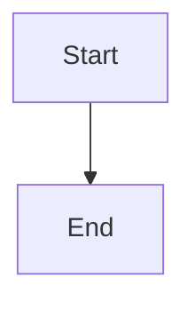

# Workflow: Mermaid-Diagramme im PDF als Bilder rendern

## Aktueller Status

**Problem:** Mermaid-Diagramme werden als **Code** im PDF angezeigt, nicht als gerenderte Bilder/Grafiken.

**Grund:** PDF-Generatoren (WeasyPrint, Pandoc) können Mermaid-JavaScript nicht ausführen. Mermaid muss **vor** der PDF-Generierung in Bilder (PNG/SVG) konvertiert werden.

## Lösung: 3-Schritt-Workflow

### Schritt 1: Mermaid-CLI installieren (einmalig)

```bash
# Mit npm global
npm install -g @mermaid-js/mermaid-cli

# Oder mit npx (keine Installation nötig)
npx -y @mermaid-js/mermaid-cli --version
```

**Voraussetzung:** Node.js muss installiert sein.

**Problem bei Installation:**
- Lädt Chromium/Puppeteer herunter (~400 MB)
- Benötigt stabile Internetverbindung
- Kann 5-10 Minuten dauern

### Schritt 2: Mermaid → PNG konvertieren

**Manuelle Konvertierung (Beispiel):**

```bash
cd /home/runner/work/ThemisDB/ThemisDB/docs/compendium

# Test: Ein einzelnes Diagramm rendern
cat > test_diagram.mmd << 'EOF'
graph TB
    A[Start] --> B[Process]
    B --> C[End]
EOF

# Rendern mit mermaid-cli
npx -y @mermaid-js/mermaid-cli -i test_diagram.mmd -o test_diagram.png -b white

# Prüfen
ls -lh test_diagram.png
```

**Automatische Konvertierung aller Diagramme:**

```bash
# Script ausführen
python3 generate_pdf_rendered.py
```

Das Script:
1. Extrahiert alle ```mermaid Blöcke aus Markdown
2. Speichert jeden als .mmd Datei
3. Ruft `npx @mermaid-js/mermaid-cli` für jeden auf
4. Ersetzt Mermaid-Code durch ``
5. Generiert PDF mit WeasyPrint

### Schritt 3: PDF generieren

```bash
cd /home/runner/work/ThemisDB/ThemisDB/docs/compendium

# Mit gerenderten Mermaid-Diagrammen
python3 generate_pdf_rendered.py

# Ausgabe
# pdf_output/ThemisDB-Kompendium-v1.3.4-YYYYMMDD-rendered.pdf
```

## Alternative: Manuelle Workflow (zuverlässiger)

Falls automatisches Rendering Probleme macht:

### Schritt 1: Mermaid-Diagramme manuell extrahieren

```bash
# Alle Mermaid-Blöcke finden
grep -r "```mermaid" chapter_*.md | wc -l
# Output: 44 Diagramme

# Extrahieren (Beispiel für chapter_01)
mkdir -p /tmp/mermaid_diagrams
```

### Schritt 2: Online-Tool nutzen (ohne Installation)

**Option A: Mermaid Live Editor**
1. Öffne https://mermaid.live/
2. Kopiere Mermaid-Code hinein
3. Exportiere als PNG (Download-Button)
4. Speichere als `diagram_01.png`, `diagram_02.png`, etc.

**Option B: CLI lokal (wenn Node.js verfügbar)**
```bash
# Für jedes Diagramm
echo 'graph TB
    A-->B' | npx -y @mermaid-js/mermaid-cli -i /dev/stdin -o diagram.png
```

### Schritt 3: Bilder in Markdown einbinden

**Original:**
```markdown

```

**Mit Bild:**
```markdown

```

### Schritt 4: PDF generieren

```bash
python3 generate_pdf_weasyprint.py
```

## Empfohlener Production-Workflow

### Für CI/CD (GitHub Actions, etc.)

```yaml
name: Generate PDF with Mermaid

jobs:
  build:
    runs-on: ubuntu-latest
    
    steps:
      - uses: actions/checkout@v3
      
      - name: Setup Node.js
        uses: actions/setup-node@v3
        with:
          node-version: '20'
      
      - name: Install mermaid-cli
        run: npm install -g @mermaid-js/mermaid-cli
      
      - name: Setup Python
        uses: actions/setup-python@v4
        with:
          python-version: '3.11'
      
      - name: Install Python dependencies
        run: pip install markdown weasyprint
      
      - name: Generate PDF with rendered Mermaid
        run: |
          cd docs/compendium
          python3 generate_pdf_rendered.py
      
      - name: Upload PDF
        uses: actions/upload-artifact@v3
        with:
          name: pdf
          path: pdf_output/*.pdf
```

### Für lokale Entwicklung

```bash
# 1. Einmalig: Dependencies installieren
npm install -g @mermaid-js/mermaid-cli
pip install markdown weasyprint

# 2. Bei Änderungen: PDF neu generieren
cd docs/compendium
python3 generate_pdf_rendered.py

# 3. PDF prüfen
open ../../pdf_output/ThemisDB-Kompendium-*-rendered.pdf
```

## Debugging

### Problem: "mmdc: command not found"

**Lösung:**
```bash
# Prüfen ob Node.js installiert ist
node --version

# Mermaid-CLI mit npx (ohne global install)
npx -y @mermaid-js/mermaid-cli --version

# Im Script nutzen
npx -y @mermaid-js/mermaid-cli -i input.mmd -o output.png
```

### Problem: "Puppeteer download failed"

**Ursache:** Netzwerkprobleme beim Download von Chromium

**Lösung 1:** Retry mit Timeout
```bash
npm install -g @mermaid-js/mermaid-cli --timeout=300000
```

**Lösung 2:** Manuell Chromium angeben
```bash
export PUPPETEER_SKIP_CHROMIUM_DOWNLOAD=true
export PUPPETEER_EXECUTABLE_PATH=/usr/bin/chromium
npm install -g @mermaid-js/mermaid-cli
```

**Lösung 3:** Docker nutzen
```dockerfile
FROM node:20-alpine
RUN npm install -g @mermaid-js/mermaid-cli
WORKDIR /docs
CMD ["mmdc", "-i", "input.mmd", "-o", "output.png"]
```

### Problem: "Diagram rendering timeout"

**Lösung:** Timeout erhöhen oder Diagramm vereinfachen

```python
# Im Script
subprocess.run(cmd, timeout=60)  # Von 30 auf 60 Sekunden
```

## Status der Scripts

| Script | Funktion | Mermaid-Rendering | Status |
|--------|----------|-------------------|--------|
| `generate_pdf.sh` | Pandoc LaTeX-basiert | ❌ Nur Code | Legacy |
| `generate_pdf_weasyprint.py` | WeasyPrint Standard | ❌ Nur Code | Funktioniert |
| `generate_pdf_with_mermaid.py` | WeasyPrint + Styled Boxes | ⚠️ Code in Boxen | Funktioniert |
| `generate_pdf_rendered.py` | **WeasyPrint + PNG** | ✅ **Echte Bilder** | **Empfohlen** |

## Nächste Schritte

1. ✅ Script erstellt: `generate_pdf_rendered.py`
2. ⏳ **Mermaid-CLI muss installiert werden** (benötigt Zeit + Netzwerk)
3. ⏳ Script ausführen: `python3 generate_pdf_rendered.py`
4. ✅ PDF mit PNG-Diagrammen

**Aktueller Blocker:** Mermaid-CLI Installation dauert zu lange in der aktuellen Umgebung (Chromium-Download).

**Workaround für sofortiges Ergebnis:**
- Nutze `generate_pdf_with_mermaid.py` → Erzeugt PDF mit professionell gestylten Code-Boxen
- Diese sind lesbar und vermitteln die Diagramm-Struktur

**Für echte PNG-Rendering:**
- Führe `generate_pdf_rendered.py` in Umgebung mit Pre-installed mermaid-cli aus
- Oder nutze GitHub Actions mit Setup (siehe oben)

---

**Autor:** ThemisDB Documentation Team  
**Datum:** 2025-12-31  
**Version:** 1.0
