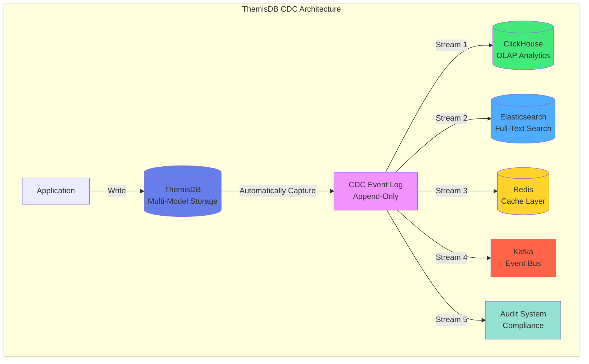
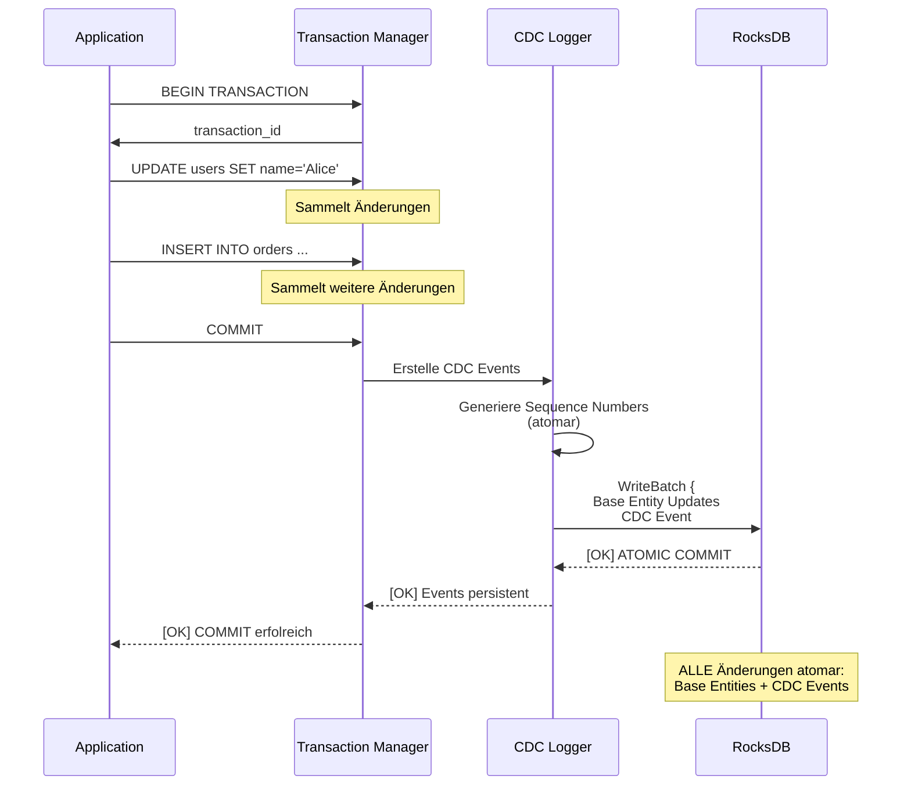

# Chapter 11: Realtime Data Streaming mit Change Data Capture

## 11.1 Einführung: Die Streaming-Architektur

Change Data Capture (CDC) ist eine kritische Komponente moderner Datenarchitekturen, die Echtzeit-Datenströme ermöglicht. ThemisDB implementiert CDC als natives Feature, das automatisch alle Mutationen (CREATE, UPDATE, DELETE) in einem append-only Event Log aufzeichnet. Dies ist ein fundamentaler Unterschied zu polyglot Systemen, die externe Tools wie Debezium benötigen, um Änderungen aus dem Write-Ahead Log (WAL) zu extrahieren.

### Warum CDC in ThemisDB?

**Architektonischer Vorteil:** Da ThemisDB alle Datenmodelle (relational, graph, document, vector) in einem einheitlichen "Base Entity"-Format speichert (siehe Chapter 2), kann ein einzelner CDC-Stream **alle** Datentypen erfassen. In einem Polyglot-Setup müsste man separate CDC-Pipelines für PostgreSQL, Neo4j und ChromaDB betreiben, was die Komplexität vervielfacht und die Konsistenz gefährdet.

**Use Cases:**
1. **Real-Time Analytics:** Streaming von Datenänderungen in ein OLAP-System (z.B. ClickHouse)
2. **Event Sourcing:** Rekonstruktion des Anwendungszustands aus dem Event Log
3. **Materialized Views:** Automatische Aktualisierung von Aggregationen
4. **Audit Trails:** BSI-konforme Nachvollziehbarkeit aller Datenänderungen
5. **Cross-System Sync:** Spiegelung von Daten in externe Systeme (Elasticsearch, Redis Cache)
6. **Kafka Integration:** Streaming in ein zentrales Event-Bus-System



## 11.2 CDC-Architektur und Datenmodell

### 11.2.1 Event-Struktur

Jedes CDC-Event in ThemisDB folgt einem standardisierten Schema, das maximale Flexibilität bietet:

```json
{
  "sequence": 42,
  "type": "PUT",
  "key": "user:alice",
  "value": "{\"name\":\"Alice\",\"email\":\"alice@example.com\"}",
  "timestamp_ms": 1730294567123,
  "metadata": {
    "table": "user",
    "pk": "alice",
    "operation_type": "update",
    "user_id": "admin@example.com"
  }
}
```

**Feld-Semantik:**

- **sequence** (uint64): Monoton steigende ID, die **strikte Ordnung** garantiert. Diese Eigenschaft ist kritisch für die Konsistenz: Consumer können sicher sein, dass Event N vor Event N+1 aufgetreten ist. Die Sequence-Nummer wird atomar in RocksDB verwaltet (`changefeed_sequence`-Schlüssel) und nutzt RocksDB's MVCC-Garantien.

- **type** (enum): `PUT` (Create/Update) oder `DELETE`. Zukünftige Erweiterungen könnten `TRANSACTION_COMMIT`/`TRANSACTION_ROLLBACK` für Transaktionsgrenzen hinzufügen, was Event Sourcing-Patterns vereinfachen würde.

- **key** (string): Vollständiger Entitätsschlüssel im Format `collection:primary_key`. Dies ermöglicht effiziente Filterung nach Präfixen (z.B. alle User-Events via `user:`-Filter).

- **value** (string|null): Bei PUT: JSON-serialisierte Entität. Bei DELETE: `null`. Die Speicherung als String (nicht als natives JSON-Objekt) minimiert den Serialisierungsaufwand im Hot Path. Consumer können mit simdjson/serde_json parsen.

- **timestamp_ms** (uint64): Millisekunden seit Unix Epoch. Wichtig: Dieser Timestamp basiert auf der Serverzeit zum Zeitpunkt des Commits, nicht auf Client-Zeit. Für verteilte Systeme sollte NTP-Synchronisation sichergestellt sein.

- **metadata** (JSON object): Frei erweiterbar. Standardfelder (`table`, `pk`) werden automatisch gesetzt. Anwendungen können zusätzliche Kontextinformationen hinzufügen (z.B. `user_id` für Audit-Trails, `source_ip` für Sicherheitsanalysen).

### 11.2.2 Physische Speicherung

CDC-Events werden im selben RocksDB-Backend wie die Base Entities gespeichert, jedoch in einem separaten Schlüsselraum:

**Key-Format:** `changefeed:{sequence_number}`

Die Sequence-Nummer wird Zero-padded (z.B. `changefeed:0000000000000042`), um lexikographische Sortierung zu garantieren. Dies ist kritisch für die Scan-Performance: Ein RocksDB-Iterator kann effizient von `changefeed:{from_seq}` bis `changefeed:{to_seq}` iterieren, ohne die Daten neu sortieren zu müssen.

**Column Family Strategy:**

- **Default:** Events werden in der Default Column Family gespeichert. Vorteil: Atomare Transaktionen mit den Base Entities sind trivial (ein RocksDB WriteBatch kann beide aktualisieren). Nachteil: Events und Entitäten konkurrieren um den Block Cache.

- **Dedicated CF (zukünftig):** Eine separate Column Family (`cf_changefeed`) würde isolierte Tuning-Parameter erlauben (z.B. aggressivere Compaction für Events, da sie nie aktualisiert werden).

### 11.2.3 Sequence-Management

Die atomare Sequenzvergabe ist der kritische Pfad für CDC-Schreiboperationen:

```cpp
// Pseudo-Code: Atomare Sequence-Vergabe
rocksdb::WriteBatch batch;
uint64_t seq = increment_sequence_counter(batch); // Atomic increment
std::string event_key = format("changefeed:{:020d}", seq);
batch.Put(event_key, serialize_event(event));
db->Write(batch);  // ACID: Sequence & Event atomar committed
```



**Performance-Trade-off:** Die zentrale Sequenzvergabe ist ein Bottleneck bei hohen Schreibraten (>100K writes/sec). Zukünftige Optimierungen:

1. **Batch Allocation:** Reserviere Sequence-Blöcke (z.B. 1.000 Sequences auf einmal), reduziere Contentions um Faktor 1000.
2. **Sharded Sequences:** In Sharding-Setups (Chapter 16) kann jeder Shard eigene Sequences verwalten. Globale Ordnung wird via `(shard_id, local_sequence)` Tupel erreicht.

### CDC-Optionen

```python
# Nur bestimmte Spalten tracken
stream = db.cdc.create_stream(
    name="user_updates",
    table="users",
    columns=["status", "last_seen"],  # Nur diese Felder
    operations=["UPDATE"]
)

# Mit Filterung
stream = db.cdc.create_stream(
    name="important_messages",
    table="messages",
    filter="priority = 'high'",
    operations=["INSERT"]
)

# Mit Transformationen
stream = db.cdc.create_stream(
    name="enriched_events",
    table="orders",
    transform=lambda event: {
        **event,
        "customer_name": db.query("""
            FOR customer IN customers 
              FILTER customer.id == @customer_id 
              LIMIT 1 
              RETURN customer.name
        """, {"customer_id": event.data["customer_id"]})[0]
    }
)
```

## Server-Sent Events (SSE)

SSE ermöglicht es, Daten vom Server an Clients zu pushen.

### SSE-Server-Setup

```python
from flask import Flask, Response
from themisdb import ThemisDB
import json
import time

app = Flask(__name__)
db = ThemisDB()

def event_stream(channel):
    """Generator für SSE-Events"""
    stream = db.cdc.create_stream(
        name=f"sse_{channel}",
        table=channel,
        operations=["INSERT", "UPDATE", "DELETE"]
    )
    
    for event in stream:
        # SSE-Format: "data: JSON\n\n"
        yield f"data: {json.dumps(event.to_dict())}\n\n"

@app.route('/stream/<channel>')
def stream(channel):
    return Response(
        event_stream(channel),
        mimetype="text/event-stream",
        headers={
            "Cache-Control": "no-cache",
            "Connection": "keep-alive",
            "X-Accel-Buffering": "no"  # Nginx
        }
    )
```

### SSE-Client-Code

```javascript
// JavaScript Client
const eventSource = new EventSource('/stream/messages');

eventSource.onmessage = function(event) {
    const data = JSON.parse(event.data);
    
    if (data.operation === 'INSERT') {
        addMessageToUI(data.after);
    } else if (data.operation === 'UPDATE') {
        updateMessageInUI(data.after);
    } else if (data.operation === 'DELETE') {
        removeMessageFromUI(data.before.id);
    }
};

eventSource.onerror = function(error) {
    console.error('SSE error:', error);
    // Automatische Reconnection
};
```

## WebSocket-Integration

Für bidirektionale Kommunikation sind WebSockets ideal.

### WebSocket-Server

```python
from flask_socketio import SocketIO, emit, join_room, leave_room
from themisdb import ThemisDB

app = Flask(__name__)
socketio = SocketIO(app, cors_allowed_origins="*")
db = ThemisDB()

# User-Session-Tracking
active_users = {}

@socketio.on('connect')
def handle_connect():
    print(f'Client connected: {request.sid}')

@socketio.on('join_channel')
def handle_join(data):
    channel = data['channel']
    username = data['username']
    
    join_room(channel)
    active_users[request.sid] = {
        'username': username,
        'channel': channel
    }
    
    # Benachrichtige andere
    emit('user_joined', {
        'username': username,
        'timestamp': time.time()
    }, room=channel, skip_sid=request.sid)
    
    # CDC-Stream für diesen Channel
    start_cdc_stream(channel)

def start_cdc_stream(channel):
    """Background-Thread für CDC → WebSocket"""
    stream = db.cdc.create_stream(
        name=f"ws_{channel}",
        table="messages",
        filter=f"channel = '{channel}'"
    )
    
    def emit_changes():
        for event in stream:
            socketio.emit('message_update', 
                         event.to_dict(), 
                         room=channel)
    
    # In separatem Thread
    socketio.start_background_task(emit_changes)

@socketio.on('send_message')
def handle_message(data):
    channel = active_users[request.sid]['channel']
    username = active_users[request.sid]['username']
    
    # In DB schreiben
    db.execute("""
        INSERT {
          channel: @channel,
          username: @username,
          content: @content,
          timestamp: @timestamp
        } INTO messages
    """, {"channel": channel, "username": username, "content": data['content'], "timestamp": time.time()})
    
    # CDC wird automatisch notifizieren
```

### WebSocket-Client

```javascript
const socket = io('http://localhost:5000');

// Channel beitreten
socket.emit('join_channel', {
    channel: 'general',
    username: 'Alice'
});

// Nachrichten senden
function sendMessage(content) {
    socket.emit('send_message', {
        content: content
    });
}

// Nachrichten empfangen
socket.on('message_update', function(event) {
    if (event.operation === 'INSERT') {
        displayMessage(event.after);
    }
});

// Nutzer beigetreten
socket.on('user_joined', function(data) {
    console.log(`${data.username} ist beigetreten`);
});
```

## Example: Realtime Chat (examples/18_realtime_chat)

Vollständige Chat-Anwendung mit Channels, Private Messages, Online-Status und Typing-Indikatoren.

### Datenmodell

```python
from themisdb import ThemisDB
from datetime import datetime

db = ThemisDB()

# Schema erstellen
db.execute("""
    CREATE TABLE users (
        id INTEGER PRIMARY KEY AUTOINCREMENT,
        username TEXT UNIQUE NOT NULL,
        email TEXT UNIQUE NOT NULL,
        avatar_url TEXT,
        status TEXT DEFAULT 'offline',  -- online, offline, away
        last_seen TIMESTAMP,
        created_at TIMESTAMP DEFAULT CURRENT_TIMESTAMP
    )
""")

db.execute("""
    CREATE TABLE channels (
        id INTEGER PRIMARY KEY AUTOINCREMENT,
        name TEXT UNIQUE NOT NULL,
        description TEXT,
        is_private BOOLEAN DEFAULT FALSE,
        created_by INTEGER REFERENCES users(id),
        created_at TIMESTAMP DEFAULT CURRENT_TIMESTAMP
    )
""")

db.execute("""
    CREATE TABLE channel_members (
        channel_id INTEGER REFERENCES channels(id),
        user_id INTEGER REFERENCES users(id),
        joined_at TIMESTAMP DEFAULT CURRENT_TIMESTAMP,
        role TEXT DEFAULT 'member',  -- admin, moderator, member
        PRIMARY KEY (channel_id, user_id)
    )
""")

db.execute("""
    CREATE TABLE messages (
        id INTEGER PRIMARY KEY AUTOINCREMENT,
        channel_id INTEGER REFERENCES channels(id),
        user_id INTEGER REFERENCES users(id),
        content TEXT NOT NULL,
        message_type TEXT DEFAULT 'text',  -- text, image, file, system
        reply_to INTEGER REFERENCES messages(id),
        edited_at TIMESTAMP,
        created_at TIMESTAMP DEFAULT CURRENT_TIMESTAMP,
        INDEX idx_channel_time (channel_id, created_at),
        INDEX idx_user (user_id)
    )
""")

db.execute("""
    CREATE TABLE reactions (
        message_id INTEGER REFERENCES messages(id),
        user_id INTEGER REFERENCES users(id),
        emoji TEXT NOT NULL,
        created_at TIMESTAMP DEFAULT CURRENT_TIMESTAMP,
        PRIMARY KEY (message_id, user_id, emoji)
    )
""")

db.execute("""
    CREATE TABLE direct_messages (
        id INTEGER PRIMARY KEY AUTOINCREMENT,
        from_user_id INTEGER REFERENCES users(id),
        to_user_id INTEGER REFERENCES users(id),
        content TEXT NOT NULL,
        read_at TIMESTAMP,
        created_at TIMESTAMP DEFAULT CURRENT_TIMESTAMP,
        INDEX idx_participants (from_user_id, to_user_id, created_at)
    )
""")

db.execute("""
    CREATE TABLE typing_indicators (
        channel_id INTEGER REFERENCES channels(id),
        user_id INTEGER REFERENCES users(id),
        started_at TIMESTAMP DEFAULT CURRENT_TIMESTAMP,
        PRIMARY KEY (channel_id, user_id)
    )
""")
```

### Chat-Backend

```python
from flask import Flask, request, jsonify
from flask_socketio import SocketIO, emit, join_room, leave_room
from flask_cors import CORS
from themisdb import ThemisDB
import time
from datetime import datetime, timedelta

app = Flask(__name__)
CORS(app)
socketio = SocketIO(app, cors_allowed_origins="*")
db = ThemisDB()

# Aktive Verbindungen tracken
connections = {}  # sid -> {user_id, username, channels}

class ChatService:
    @staticmethod
    def get_channel_messages(channel_id, limit=50, before_id=None):
        """Nachrichten laden (mit Pagination)"""
        query = """
            FOR message IN messages
              FILTER message.channel_id == @channel_id
              FOR user IN users
                FILTER message.user_id == user.id
                LET reaction_count = LENGTH(
                  FOR reaction IN reactions
                    FILTER reaction.message_id == message.id
                    RETURN 1
                )
                RETURN {
                  id: message.id,
                  content: message.content,
                  message_type: message.message_type,
                  reply_to: message.reply_to,
                  created_at: message.created_at,
                  edited_at: message.edited_at,
                  user_id: user.id,
                  username: user.username,
                  avatar_url: user.avatar_url,
                  reaction_count
                }
        """
        params = {"channel_id": channel_id}
        
        if before_id:
            query += " AND m.id < ?"
            params.append(before_id)
        
        query += " ORDER BY m.created_at DESC LIMIT ?"
        params.append(limit)
        
        return db.query(query, params)
    
    @staticmethod
    def send_message(channel_id, user_id, content, reply_to=None):
        """Nachricht senden"""
        with db.transaction():
            result = db.execute("""
                INSERT {
                  channel_id: @channel_id,
                  user_id: @user_id,
                  content: @content,
                  reply_to: @reply_to
                } INTO messages
                RETURN NEW
            """, {"channel_id": channel_id, "user_id": user_id, "content": content, "reply_to": reply_to})
            
            message = result[0]
            
            # Typing-Indikator löschen
            db.execute("""
                FOR indicator IN typing_indicators 
                  FILTER indicator.channel_id == @channel_id AND indicator.user_id == @user_id
                  REMOVE indicator IN typing_indicators
            """, {"channel_id": channel_id, "user_id": user_id})
            
            return message
    
    @staticmethod
    def edit_message(message_id, user_id, new_content):
        """Nachricht bearbeiten"""
        result = db.execute("""
            UPDATE messages 
            SET content = ?, edited_at = CURRENT_TIMESTAMP
            WHERE id = ? AND user_id = ?
            RETURNING *
        """, [new_content, message_id, user_id])
        
        if not result:
            raise ValueError("Message not found or not owned by user")
        
        return result[0]
    
    @staticmethod
    def delete_message(message_id, user_id):
        """Nachricht löschen"""
        db.execute("""
            FOR message IN messages 
              FILTER message.id == @message_id AND message.user_id == @user_id
              REMOVE message IN messages
        """, {"message_id": message_id, "user_id": user_id})
    
    @staticmethod
    def add_reaction(message_id, user_id, emoji):
        """Reaktion hinzufügen"""
        try:
            db.execute("""
                INSERT {
                  message_id: @message_id,
                  user_id: @user_id,
                  emoji: @emoji
                } INTO reactions
            """, {"message_id": message_id, "user_id": user_id, "emoji": emoji})
            return True
        except:  # Already exists
            return False
    
    @staticmethod
    def get_online_users(channel_id):
        """Online-Nutzer in einem Channel"""
        return db.query("""
            SELECT DISTINCT u.id, u.username, u.avatar_url, u.status
            FROM users u
            JOIN channel_members cm ON u.id = cm.user_id
            WHERE cm.channel_id = ? 
              AND u.status = 'online'
              AND u.last_seen > ?
        """, [channel_id, datetime.now() - timedelta(minutes=5)])
    
    @staticmethod
    def update_user_status(user_id, status):
        """Status aktualisieren"""
        db.execute("""
            UPDATE users 
            SET status = ?, last_seen = CURRENT_TIMESTAMP
            WHERE id = ?
        """, [status, user_id])

# WebSocket Event-Handler
@socketio.on('connect')
def handle_connect():
    print(f'Client connected: {request.sid}')

@socketio.on('authenticate')
def handle_authenticate(data):
    """Nutzer authentifizieren"""
    user_id = data['user_id']
    username = data['username']
    
    connections[request.sid] = {
        'user_id': user_id,
        'username': username,
        'channels': set()
    }
    
    # Status auf online setzen
    ChatService.update_user_status(user_id, 'online')
    
    emit('authenticated', {'success': True})

@socketio.on('join_channel')
def handle_join_channel(data):
    """Channel beitreten"""
    channel_id = data['channel_id']
    
    if request.sid not in connections:
        return emit('error', {'message': 'Not authenticated'})
    
    conn = connections[request.sid]
    join_room(f'channel_{channel_id}')
    conn['channels'].add(channel_id)
    
    # Online-Nutzer benachrichtigen
    emit('user_joined', {
        'user_id': conn['user_id'],
        'username': conn['username'],
        'channel_id': channel_id
    }, room=f'channel_{channel_id}', skip_sid=request.sid)
    
    # Initiale Nachrichten laden
    messages = ChatService.get_channel_messages(channel_id)
    emit('channel_history', {
        'channel_id': channel_id,
        'messages': messages
    })
    
    # CDC-Stream für diesen Channel (wenn noch nicht aktiv)
    start_channel_cdc(channel_id)

@socketio.on('leave_channel')
def handle_leave_channel(data):
    """Channel verlassen"""
    channel_id = data['channel_id']
    
    if request.sid in connections:
        conn = connections[request.sid]
        leave_room(f'channel_{channel_id}')
        conn['channels'].discard(channel_id)
        
        emit('user_left', {
            'user_id': conn['user_id'],
            'username': conn['username'],
            'channel_id': channel_id
        }, room=f'channel_{channel_id}')

@socketio.on('send_message')
def handle_send_message(data):
    """Nachricht senden"""
    if request.sid not in connections:
        return emit('error', {'message': 'Not authenticated'})
    
    conn = connections[request.sid]
    channel_id = data['channel_id']
    content = data['content']
    reply_to = data.get('reply_to')
    
    # In DB schreiben
    message = ChatService.send_message(
        channel_id, conn['user_id'], content, reply_to
    )
    
    # CDC wird automatisch andere Clients benachrichtigen

@socketio.on('edit_message')
def handle_edit_message(data):
    """Nachricht bearbeiten"""
    if request.sid not in connections:
        return
    
    conn = connections[request.sid]
    message_id = data['message_id']
    new_content = data['content']
    
    try:
        message = ChatService.edit_message(
            message_id, conn['user_id'], new_content
        )
        # CDC benachrichtigt automatisch
    except ValueError as e:
        emit('error', {'message': str(e)})

@socketio.on('typing_start')
def handle_typing_start(data):
    """Typing-Indikator starten"""
    if request.sid not in connections:
        return
    
    conn = connections[request.sid]
    channel_id = data['channel_id']
    
    # In DB schreiben (mit TTL)
    db.execute("""
        INSERT OR REPLACE INTO typing_indicators (channel_id, user_id)
        VALUES (?, ?)
    """, [channel_id, conn['user_id']])
    
    # An andere broadcasten
    emit('user_typing', {
        'user_id': conn['user_id'],
        'username': conn['username'],
        'channel_id': channel_id
    }, room=f'channel_{channel_id}', skip_sid=request.sid)

@socketio.on('typing_stop')
def handle_typing_stop(data):
    """Typing-Indikator stoppen"""
    if request.sid not in connections:
        return
    
    conn = connections[request.sid]
    channel_id = data['channel_id']
    
    db.execute("""
        FOR indicator IN typing_indicators 
          FILTER indicator.channel_id == @channel_id AND indicator.user_id == @user_id
          REMOVE indicator IN typing_indicators
    """, {"channel_id": channel_id, "user_id": conn['user_id']})
    
    emit('user_stopped_typing', {
        'user_id': conn['user_id'],
        'channel_id': channel_id
    }, room=f'channel_{channel_id}', skip_sid=request.sid)

@socketio.on('add_reaction')
def handle_add_reaction(data):
    """Reaktion hinzufügen"""
    if request.sid not in connections:
        return
    
    conn = connections[request.sid]
    message_id = data['message_id']
    emoji = data['emoji']
    
    if ChatService.add_reaction(message_id, conn['user_id'], emoji):
        # CDC benachrichtigt automatisch
        pass

@socketio.on('disconnect')
def handle_disconnect():
    """Client getrennt"""
    if request.sid in connections:
        conn = connections[request.sid]
        
        # Status auf offline
        ChatService.update_user_status(conn['user_id'], 'offline')
        
        # Alle Channels benachrichtigen
        for channel_id in conn['channels']:
            emit('user_left', {
                'user_id': conn['user_id'],
                'username': conn['username'],
                'channel_id': channel_id
            }, room=f'channel_{channel_id}')
        
        del connections[request.sid]

# CDC-Streams für Channels
active_cdc_streams = set()

def start_channel_cdc(channel_id):
    """CDC-Stream für Channel starten"""
    if channel_id in active_cdc_streams:
        return
    
    active_cdc_streams.add(channel_id)
    
    def cdc_worker():
        stream = db.cdc.create_stream(
            name=f"chat_channel_{channel_id}",
            table="messages",
            filter=f"channel_id = {channel_id}",
            operations=["INSERT", "UPDATE", "DELETE"]
        )
        
        for event in stream:
            if event.operation == 'INSERT':
                # Neue Nachricht
                socketio.emit('new_message', {
                    'message': event.after
                }, room=f'channel_{channel_id}')
            
            elif event.operation == 'UPDATE':
                # Nachricht bearbeitet
                socketio.emit('message_edited', {
                    'message': event.after
                }, room=f'channel_{channel_id}')
            
            elif event.operation == 'DELETE':
                # Nachricht gelöscht
                socketio.emit('message_deleted', {
                    'message_id': event.before['id']
                }, room=f'channel_{channel_id}')
    
    # In Background-Thread
    socketio.start_background_task(cdc_worker)

# REST-Endpoints
@app.route('/api/channels', methods=['GET'])
def get_channels():
    """Alle Channels abrufen"""
    channels = db.query("""
        SELECT c.id, c.name, c.description, c.is_private,
               COUNT(DISTINCT cm.user_id) as member_count,
               MAX(m.created_at) as last_message_at
        FROM channels c
        LEFT JOIN channel_members cm ON c.id = cm.channel_id
        LEFT JOIN messages m ON c.id = m.channel_id
        GROUP BY c.id
        ORDER BY last_message_at DESC NULLS LAST
    """)
    return jsonify(channels)

@app.route('/api/channels/<int:channel_id>/members', methods=['GET'])
def get_channel_members(channel_id):
    """Channel-Mitglieder"""
    members = db.query("""
        SELECT u.id, u.username, u.avatar_url, u.status,
               cm.role, cm.joined_at
        FROM users u
        JOIN channel_members cm ON u.id = cm.user_id
        WHERE cm.channel_id = ?
        ORDER BY cm.joined_at
    """, [channel_id])
    return jsonify(members)

if __name__ == '__main__':
    socketio.run(app, host='0.0.0.0', port=5000, debug=True)
```

### Chat-Frontend (React)

```jsx
// ChatApp.jsx
import React, { useState, useEffect, useRef } from 'react';
import io from 'socket.io-client';

const ChatApp = ({ userId, username }) => {
    const [socket, setSocket] = useState(null);
    const [channels, setChannels] = useState([]);
    const [activeChannel, setActiveChannel] = useState(null);
    const [messages, setMessages] = useState([]);
    const [newMessage, setNewMessage] = useState('');
    const [typingUsers, setTypingUsers] = useState(new Set());
    const [onlineUsers, setOnlineUsers] = useState([]);
    
    const messagesEndRef = useRef(null);
    const typingTimeoutRef = useRef(null);
    
    useEffect(() => {
        // Socket-Verbindung
        const newSocket = io('http://localhost:5000');
        setSocket(newSocket);
        
        // Authentifizieren
        newSocket.emit('authenticate', { user_id: userId, username });
        
        // Event-Handler
        newSocket.on('authenticated', () => {
            console.log('Authenticated');
            loadChannels();
        });
        
        newSocket.on('channel_history', (data) => {
            setMessages(data.messages.reverse());
        });
        
        newSocket.on('new_message', (data) => {
            setMessages(prev => [...prev, data.message]);
            scrollToBottom();
        });
        
        newSocket.on('message_edited', (data) => {
            setMessages(prev => prev.map(msg => 
                msg.id === data.message.id ? data.message : msg
            ));
        });
        
        newSocket.on('message_deleted', (data) => {
            setMessages(prev => prev.filter(msg => msg.id !== data.message_id));
        });
        
        newSocket.on('user_typing', (data) => {
            setTypingUsers(prev => new Set([...prev, data.username]));
        });
        
        newSocket.on('user_stopped_typing', (data) => {
            setTypingUsers(prev => {
                const next = new Set(prev);
                next.delete(data.username);
                return next;
            });
        });
        
        newSocket.on('user_joined', (data) => {
            console.log(`${data.username} joined`);
            setOnlineUsers(prev => [...prev, data]);
        });
        
        newSocket.on('user_left', (data) => {
            console.log(`${data.username} left`);
            setOnlineUsers(prev => prev.filter(u => u.user_id !== data.user_id));
        });
        
        return () => newSocket.close();
    }, [userId, username]);
    
    const loadChannels = async () => {
        const response = await fetch('http://localhost:5000/api/channels');
        const data = await response.json();
        setChannels(data);
        if (data.length > 0) {
            joinChannel(data[0].id);
        }
    };
    
    const joinChannel = (channelId) => {
        if (activeChannel) {
            socket.emit('leave_channel', { channel_id: activeChannel });
        }
        socket.emit('join_channel', { channel_id: channelId });
        setActiveChannel(channelId);
        setMessages([]);
    };
    
    const sendMessage = () => {
        if (!newMessage.trim()) return;
        
        socket.emit('send_message', {
            channel_id: activeChannel,
            content: newMessage
        });
        
        setNewMessage('');
        stopTyping();
    };
    
    const handleTyping = () => {
        socket.emit('typing_start', { channel_id: activeChannel });
        
        // Auto-stop nach 3 Sekunden
        clearTimeout(typingTimeoutRef.current);
        typingTimeoutRef.current = setTimeout(() => {
            stopTyping();
        }, 3000);
    };
    
    const stopTyping = () => {
        socket.emit('typing_stop', { channel_id: activeChannel });
        clearTimeout(typingTimeoutRef.current);
    };
    
    const scrollToBottom = () => {
        messagesEndRef.current?.scrollIntoView({ behavior: 'smooth' });
    };
    
    return (
        <div className="chat-app">
            <div className="sidebar">
                <h3>Channels</h3>
                {channels.map(channel => (
                    <div 
                        key={channel.id}
                        className={`channel ${activeChannel === channel.id ? 'active' : ''}`}
                        onClick={() => joinChannel(channel.id)}
                    >
                        # {channel.name}
                        <span className="member-count">{channel.member_count}</span>
                    </div>
                ))}
            </div>
            
            <div className="main">
                <div className="header">
                    <h2>#{channels.find(c => c.id === activeChannel)?.name}</h2>
                    <div className="online-users">
                        {onlineUsers.length} online
                    </div>
                </div>
                
                <div className="messages">
                    {messages.map(msg => (
                        <div key={msg.id} className="message">
                            
                            <div>
                                <strong>{msg.username}</strong>
                                <span className="timestamp">
                                    {new Date(msg.created_at).toLocaleTimeString()}
                                </span>
                                <p>{msg.content}</p>
                                {msg.edited_at && <span className="edited">(edited)</span>}
                            </div>
                        </div>
                    ))}
                    <div ref={messagesEndRef} />
                </div>
                
                {typingUsers.size > 0 && (
                    <div className="typing-indicator">
                        {Array.from(typingUsers).join(', ')} {typingUsers.size === 1 ? 'is' : 'are'} typing...
                    </div>
                )}
                
                <div className="input-area">
                    <input
                        type="text"
                        value={newMessage}
                        onChange={(e) => {
                            setNewMessage(e.target.value);
                            handleTyping();
                        }}
                        onKeyPress={(e) => e.key === 'Enter' && sendMessage()}
                        placeholder="Type a message..."
                    />
                    <button onClick={sendMessage}>Send</button>
                </div>
            </div>
        </div>
    );
};

export default ChatApp;
```

### Chat-Features

Das vollständige Chat-Example demonstriert:

1. **Echtzeit-Nachrichten**: Sofortige Zustellung via WebSocket + CDC
2. **Online-Status**: Wer ist gerade online?
3. **Typing-Indikatoren**: "Alice is typing..."
4. **Reaktionen**: Emoji-Reactions auf Nachrichten
5. **Threads**: Antworten auf bestimmte Nachrichten
6. **Nachrichtenbearbeitung**: Edit-History mit Timestamps
7. **Private Channels**: Eingeschränkter Zugriff
8. **Direktnachrichten**: 1-on-1 Chats
9. **Presence**: Last-Seen und Away-Status
10. **Pagination**: Unendliches Scrollen durch Historie

## Example: Kanban Board (examples/16_kanban_board)

Vollständige Kanban-Board-Anwendung mit Drag & Drop, Realtime-Updates und Team-Collaboration.

### Datenmodell

```python
from themisdb import ThemisDB

db = ThemisDB()

db.execute("""
    CREATE TABLE boards (
        id INTEGER PRIMARY KEY AUTOINCREMENT,
        name TEXT NOT NULL,
        description TEXT,
        created_by INTEGER REFERENCES users(id),
        created_at TIMESTAMP DEFAULT CURRENT_TIMESTAMP
    )
""")

db.execute("""
    CREATE TABLE columns (
        id INTEGER PRIMARY KEY AUTOINCREMENT,
        board_id INTEGER REFERENCES boards(id),
        name TEXT NOT NULL,
        position INTEGER NOT NULL,
        wip_limit INTEGER,  -- Work-In-Progress Limit
        created_at TIMESTAMP DEFAULT CURRENT_TIMESTAMP,
        INDEX idx_board (board_id, position)
    )
""")

db.execute("""
    CREATE TABLE cards (
        id INTEGER PRIMARY KEY AUTOINCREMENT,
        column_id INTEGER REFERENCES columns(id),
        board_id INTEGER REFERENCES boards(id),
        title TEXT NOT NULL,
        description TEXT,
        assigned_to INTEGER REFERENCES users(id),
        position INTEGER NOT NULL,
        priority TEXT DEFAULT 'medium',  -- low, medium, high, urgent
        due_date TIMESTAMP,
        created_by INTEGER REFERENCES users(id),
        created_at TIMESTAMP DEFAULT CURRENT_TIMESTAMP,
        updated_at TIMESTAMP DEFAULT CURRENT_TIMESTAMP,
        INDEX idx_column (column_id, position),
        INDEX idx_board (board_id)
    )
""")

db.execute("""
    CREATE TABLE card_activities (
        id INTEGER PRIMARY KEY AUTOINCREMENT,
        card_id INTEGER REFERENCES cards(id),
        user_id INTEGER REFERENCES users(id),
        action_type TEXT NOT NULL,  -- created, moved, assigned, commented
        details JSON,
        created_at TIMESTAMP DEFAULT CURRENT_TIMESTAMP,
        INDEX idx_card (card_id, created_at)
    )
""")

db.execute("""
    CREATE TABLE card_labels (
        card_id INTEGER REFERENCES cards(id),
        label TEXT NOT NULL,
        color TEXT,
        PRIMARY KEY (card_id, label)
    )
""")
```

### Kanban-Backend

```python
from flask import Flask, jsonify, request
from flask_socketio import SocketIO, emit, join_room
from themisdb import ThemisDB
import time

app = Flask(__name__)
socketio = SocketIO(app, cors_allowed_origins="*")
db = ThemisDB()

class KanbanService:
    @staticmethod
    def get_board(board_id):
        """Board mit allen Spalten und Karten laden"""
        board = db.query("""
            FOR board IN boards 
              FILTER board.id == @board_id 
              LIMIT 1 
              RETURN board
        """, {"board_id": board_id})[0]
        
        columns = db.query("""
            FOR column IN columns 
              FILTER column.board_id == @board_id
              SORT column.position ASC
              RETURN column
        """, {"board_id": board_id})
        
        for col in columns:
            col['cards'] = db.query("""
                FOR card IN cards
                  FILTER card.column_id == @column_id
                  LET assigned_name = (
                    FOR user IN users
                      FILTER card.assigned_to == user.id
                      LIMIT 1
                      RETURN user.username
                  )[0]
                  SORT card.position ASC
                  RETURN MERGE(card, {assigned_to_name: assigned_name})
            """, {"column_id": col['id']})
        
        board['columns'] = columns
        return board
    
    @staticmethod
    def move_card(card_id, to_column_id, to_position):
        """Karte verschieben"""
        with db.transaction():
            # Aktuelle Position
            current = db.query("""
                FOR card IN cards 
                  FILTER card.id == @card_id 
                  LIMIT 1 
                  RETURN {column_id: card.column_id, position: card.position}
            """, {"card_id": card_id})[0]
            
            from_column_id = current['column_id']
            from_position = current['position']
            
            # Position in alter Spalte aktualisieren
            db.execute("""
                UPDATE cards 
                SET position = position - 1
                WHERE column_id = ? AND position > ?
            """, [from_column_id, from_position])
            
            # Position in neuer Spalte freimachen
            db.execute("""
                UPDATE cards 
                SET position = position + 1
                WHERE column_id = ? AND position >= ?
            """, [to_column_id, to_position])
            
            # Karte verschieben
            db.execute("""
                UPDATE cards 
                SET column_id = ?, position = ?, updated_at = CURRENT_TIMESTAMP
                WHERE id = ?
            """, [to_column_id, to_position, card_id])
            
            # Activity loggen
            db.execute("""
                INSERT INTO card_activities (card_id, user_id, action_type, details)
                VALUES (?, ?, 'moved', ?)
            """, [card_id, request.user_id, json.dumps({
                'from_column': from_column_id,
                'to_column': to_column_id
            })])
    
    @staticmethod
    def create_card(board_id, column_id, title, description, assigned_to=None):
        """Neue Karte erstellen"""
        with db.transaction():
            # Position am Ende der Spalte
            position = db.query("""
                FOR card IN cards 
                  FILTER card.column_id == @column_id
                  COLLECT AGGREGATE max_pos = MAX(card.position)
                  RETURN COALESCE(max_pos, -1) + 1
            """, {"column_id": column_id})[0]
            
            result = db.execute("""
                INSERT {
                  board_id: @board_id,
                  column_id: @column_id,
                  title: @title,
                  description: @description,
                  assigned_to: @assigned_to,
                  position: @position,
                  created_by: @created_by
                } INTO cards
                RETURN NEW
            """, {
                "board_id": board_id,
                "column_id": column_id,
                "title": title,
                "description": description,
                "assigned_to": assigned_to,
                "position": position,
                "created_by": request.user_id
            })
            
            card = result[0]
            
            # Activity
            db.execute("""
                INSERT {
                  card_id: @card_id,
                  user_id: @user_id,
                  action_type: 'created'
                } INTO card_activities
            """, {"card_id": card['id'], "user_id": request.user_id})
            
            return card
    
    @staticmethod
    def update_card(card_id, **updates):
        """Karte aktualisieren"""
        allowed_fields = ['title', 'description', 'assigned_to', 'priority', 'due_date']
        set_clause = ', '.join([f"{field} = ?" for field in updates if field in allowed_fields])
        values = [updates[field] for field in updates if field in allowed_fields]
        values.append(card_id)
        
        db.execute(f"""
            UPDATE cards 
            SET {set_clause}, updated_at = CURRENT_TIMESTAMP
            WHERE id = ?
        """, values)
        
        # Activity
        db.execute("""
            INSERT {
              card_id: @card_id,
              user_id: @user_id,
              action_type: 'updated',
              details: @details
            } INTO card_activities
        """, {"card_id": card_id, "user_id": request.user_id, "details": json.dumps(updates)})

# WebSocket-Handler
@socketio.on('join_board')
def handle_join_board(data):
    board_id = data['board_id']
    join_room(f'board_{board_id}')
    
    # Board-Daten senden
    board = KanbanService.get_board(board_id)
    emit('board_state', board)
    
    # CDC-Stream starten
    start_board_cdc(board_id)

@socketio.on('move_card')
def handle_move_card(data):
    card_id = data['card_id']
    to_column_id = data['to_column_id']
    to_position = data['to_position']
    board_id = data['board_id']
    
    try:
        KanbanService.move_card(card_id, to_column_id, to_position)
        # CDC benachrichtigt andere Clients
    except Exception as e:
        emit('error', {'message': str(e)})

@socketio.on('create_card')
def handle_create_card(data):
    card = KanbanService.create_card(
        data['board_id'],
        data['column_id'],
        data['title'],
        data.get('description'),
        data.get('assigned_to')
    )
    # CDC benachrichtigt

@socketio.on('update_card')
def handle_update_card(data):
    card_id = data.pop('card_id')
    KanbanService.update_card(card_id, **data)
    # CDC benachrichtigt

# CDC für Board
active_board_streams = set()

def start_board_cdc(board_id):
    if board_id in active_board_streams:
        return
    
    active_board_streams.add(board_id)
    
    def cdc_worker():
        # Cards-Stream
        cards_stream = db.cdc.create_stream(
            name=f"kanban_cards_{board_id}",
            table="cards",
            filter=f"board_id = {board_id}",
            operations=["INSERT", "UPDATE", "DELETE"]
        )
        
        # Columns-Stream
        columns_stream = db.cdc.create_stream(
            name=f"kanban_columns_{board_id}",
            table="columns",
            filter=f"board_id = {board_id}",
            operations=["INSERT", "UPDATE", "DELETE"]
        )
        
        # Beide Streams kombinieren
        for event in combined_stream([cards_stream, columns_stream]):
            if event.table == 'cards':
                if event.operation == 'INSERT':
                    socketio.emit('card_created', event.after, 
                                room=f'board_{board_id}')
                elif event.operation == 'UPDATE':
                    socketio.emit('card_updated', event.after,
                                room=f'board_{board_id}')
                elif event.operation == 'DELETE':
                    socketio.emit('card_deleted', {'id': event.before['id']},
                                room=f'board_{board_id}')
            
            elif event.table == 'columns':
                # Spalten-Update
                socketio.emit('column_updated', event.after,
                            room=f'board_{board_id}')
    
    socketio.start_background_task(cdc_worker)

def combined_stream(streams):
    """Mehrere CDC-Streams kombinieren"""
    import queue
    import threading
    
    q = queue.Queue()
    
    def stream_worker(stream):
        for event in stream:
            q.put(event)
    
    for stream in streams:
        threading.Thread(target=stream_worker, args=(stream,), daemon=True).start()
    
    while True:
        yield q.get()

if __name__ == '__main__':
    socketio.run(app, host='0.0.0.0', port=5000)
```

### Kanban-Frontend (React)

```jsx
// KanbanBoard.jsx
import React, { useState, useEffect } from 'react';
import { DragDropContext, Droppable, Draggable } from 'react-beautiful-dnd';
import io from 'socket.io-client';

const KanbanBoard = ({ boardId, userId }) => {
    const [socket, setSocket] = useState(null);
    const [board, setBoard] = useState(null);
    const [columns, setColumns] = useState([]);
    
    useEffect(() => {
        const newSocket = io('http://localhost:5000');
        setSocket(newSocket);
        
        newSocket.emit('join_board', { board_id: boardId });
        
        newSocket.on('board_state', (data) => {
            setBoard(data);
            setColumns(data.columns);
        });
        
        newSocket.on('card_created', (card) => {
            setColumns(prev => prev.map(col => {
                if (col.id === card.column_id) {
                    return { ...col, cards: [...col.cards, card] };
                }
                return col;
            }));
        });
        
        newSocket.on('card_updated', (card) => {
            setColumns(prev => prev.map(col => ({
                ...col,
                cards: col.cards.map(c => c.id === card.id ? card : c)
            })));
        });
        
        newSocket.on('card_deleted', (data) => {
            setColumns(prev => prev.map(col => ({
                ...col,
                cards: col.cards.filter(c => c.id !== data.id)
            })));
        });
        
        return () => newSocket.close();
    }, [boardId]);
    
    const onDragEnd = (result) => {
        if (!result.destination) return;
        
        const { source, destination } = result;
        
        if (source.droppableId === destination.droppableId &&
            source.index === destination.index) {
            return;
        }
        
        // Optimistisches Update
        const newColumns = [...columns];
        const sourceColumn = newColumns.find(c => c.id === parseInt(source.droppableId));
        const destColumn = newColumns.find(c => c.id === parseInt(destination.droppableId));
        
        const [movedCard] = sourceColumn.cards.splice(source.index, 1);
        destColumn.cards.splice(destination.index, 0, movedCard);
        
        setColumns(newColumns);
        
        // An Server senden
        socket.emit('move_card', {
            card_id: parseInt(result.draggableId),
            to_column_id: parseInt(destination.droppableId),
            to_position: destination.index,
            board_id: boardId
        });
    };
    
    if (!board) return <div>Loading...</div>;
    
    return (
        <div className="kanban-board">
            <h1>{board.name}</h1>
            
            <DragDropContext onDragEnd={onDragEnd}>
                <div className="columns">
                    {columns.map(column => (
                        <div key={column.id} className="column">
                            <h3>
                                {column.name}
                                <span className="card-count">{column.cards.length}</span>
                                {column.wip_limit && (
                                    <span className={`wip-limit ${column.cards.length > column.wip_limit ? 'exceeded' : ''}`}>
                                        / {column.wip_limit}
                                    </span>
                                )}
                            </h3>
                            
                            <Droppable droppableId={column.id.toString()}>
                                {(provided, snapshot) => (
                                    <div
                                        ref={provided.innerRef}
                                        {...provided.droppableProps}
                                        className={`cards ${snapshot.isDraggingOver ? 'dragging-over' : ''}`}
                                    >
                                        {column.cards.map((card, index) => (
                                            <Draggable
                                                key={card.id}
                                                draggableId={card.id.toString()}
                                                index={index}
                                            >
                                                {(provided, snapshot) => (
                                                    <div
                                                        ref={provided.innerRef}
                                                        {...provided.draggableProps}
                                                        {...provided.dragHandleProps}
                                                        className={`card priority-${card.priority} ${snapshot.isDragging ? 'dragging' : ''}`}
                                                    >
                                                        <h4>{card.title}</h4>
                                                        {card.description && <p>{card.description}</p>}
                                                        {card.assigned_to_name && (
                                                            <div className="assignee">
                                                                👤 {card.assigned_to_name}
                                                            </div>
                                                        )}
                                                        {card.due_date && (
                                                            <div className="due-date">
                                                                📅 {new Date(card.due_date).toLocaleDateString()}
                                                            </div>
                                                        )}
                                                    </div>
                                                )}
                                            </Draggable>
                                        ))}
                                        {provided.placeholder}
                                    </div>
                                )}
                            </Droppable>
                        </div>
                    ))}
                </div>
            </DragDropContext>
        </div>
    );
};

export default KanbanBoard;
```

### Kanban-Features

Das Kanban-Board-Example demonstriert:

1. **Drag & Drop**: Karten zwischen Spalten verschieben
2. **Realtime-Sync**: Alle Nutzer sehen Änderungen sofort
3. **WIP-Limits**: Work-In-Progress Beschränkungen
4. **Prioritäten**: Visuelle Kennzeichnung (low, medium, high, urgent)
5. **Zuweisungen**: Karten Teammitgliedern zuordnen
6. **Due Dates**: Fälligkeitsdaten mit Warnungen
7. **Labels**: Flexible Kategorisierung
8. **Activity-Log**: Vollständige Historie aller Änderungen
9. **Board-Analytics**: Durchlaufzeit, Cycle-Time, etc.
10. **Custom Columns**: Beliebige Workflow-Stufen

## Event-Driven Architecture

Realtime-Anwendungen profitieren von event-driven Design.

### Event-Bus-Pattern

```python
from themisdb import ThemisDB
from typing import Callable, List
import threading

class EventBus:
    def __init__(self, db: ThemisDB):
        self.db = db
        self.handlers = {}  # event_type -> [handlers]
        self.running = False
    
    def subscribe(self, event_type: str, handler: Callable):
        """Handler für Event-Typ registrieren"""
        if event_type not in self.handlers:
            self.handlers[event_type] = []
        self.handlers[event_type].append(handler)
    
    def publish(self, event_type: str, data: dict):
        """Event publishen"""
        self.db.execute("""
            INSERT {
              event_type: @event_type,
              data: @data,
              created_at: DATE_NOW()
            } INTO events
        """, {"event_type": event_type, "data": json.dumps(data)})
    
    def start(self):
        """Event-Processing starten"""
        self.running = True
        
        def process_events():
            stream = self.db.cdc.create_stream(
                name="event_bus",
                table="events",
                operations=["INSERT"]
            )
            
            for event in stream:
                if not self.running:
                    break
                
                event_type = event.after['event_type']
                data = json.loads(event.after['data'])
                
                # Handler aufrufen
                if event_type in self.handlers:
                    for handler in self.handlers[event_type]:
                        try:
                            handler(data)
                        except Exception as e:
                            print(f"Handler error: {e}")
        
        threading.Thread(target=process_events, daemon=True).start()
    
    def stop(self):
        self.running = False

# Verwendung
bus = EventBus(db)

# Handler registrieren
@bus.subscribe('user_registered')
def send_welcome_email(data):
    print(f"Sending email to {data['email']}")

@bus.subscribe('order_placed')
def update_inventory(data):
    print(f"Reducing stock for order {data['order_id']}")

# Events publishen
bus.publish('user_registered', {
    'user_id': 123,
    'email': 'alice@example.com'
})

bus.start()
```

### CQRS-Pattern

Command Query Responsibility Segregation für Realtime-Apps:

```python
class OrderService:
    def __init__(self, db: ThemisDB, event_bus: EventBus):
        self.db = db
        self.event_bus = event_bus
    
    # COMMAND: Write-Seite
    def place_order(self, user_id, items):
        with self.db.transaction():
            # Order erstellen
            order_id = self.db.execute("""
                INSERT {
                  user_id: @user_id,
                  status: 'pending',
                  created_at: DATE_NOW()
                } INTO orders
                RETURN NEW.id
            """, {"user_id": user_id})[0]
            
            # Items
            for item in items:
                self.db.execute("""
                    INSERT {
                      order_id: @order_id,
                      product_id: @product_id,
                      quantity: @quantity,
                      price: @price
                    } INTO order_items
                """, {
                    "order_id": order_id,
                    "product_id": item['product_id'],
                    "quantity": item['quantity'],
                    "price": item['price']
                })
            
            # Event publishen
            self.event_bus.publish('order_placed', {
                'order_id': order_id,
                'user_id': user_id,
                'items': items
            })
            
            return order_id
    
    # QUERY: Read-Seite (materialized view)
    def get_order_summary(self, order_id):
        return self.db.query("""
            SELECT 
                o.id, o.status, o.created_at,
                u.name as customer_name,
                COUNT(oi.id) as item_count,
                SUM(oi.quantity * oi.price) as total
            FROM orders o
            JOIN users u ON o.user_id = u.id
            LEFT JOIN order_items oi ON o.id = oi.order_id
            WHERE o.id = ?
            GROUP BY o.id
        """, [order_id])[0]

# Event-Handler aktualisieren materialized views
@event_bus.subscribe('order_placed')
def update_order_cache(data):
    # Cache/Read-Model aktualisieren
    pass
```

## Best Practices

### 1. Connection Management

```python
class ConnectionPool:
    def __init__(self, max_connections=100):
        self.max_connections = max_connections
        self.active_connections = {}
        self.semaphore = threading.Semaphore(max_connections)
    
    def add_connection(self, sid, user_id):
        with self.semaphore:
            if len(self.active_connections) >= self.max_connections:
                raise ValueError("Too many connections")
            self.active_connections[sid] = user_id
    
    def remove_connection(self, sid):
        if sid in self.active_connections:
            del self.active_connections[sid]
            self.semaphore.release()
```

### 2. Rate Limiting

```python
from collections import defaultdict
import time

class RateLimiter:
    def __init__(self, max_requests=10, window=60):
        self.max_requests = max_requests
        self.window = window
        self.requests = defaultdict(list)
    
    def allow(self, user_id):
        now = time.time()
        # Alte Einträge entfernen
        self.requests[user_id] = [
            t for t in self.requests[user_id]
            if now - t < self.window
        ]
        
        if len(self.requests[user_id]) >= self.max_requests:
            return False
        
        self.requests[user_id].append(now)
        return True

# Middleware
@socketio.on('send_message')
def handle_send_message(data):
    if not rate_limiter.allow(current_user_id):
        return emit('error', {'message': 'Rate limit exceeded'})
    # ... rest
```

### 3. Message Deduplication

```python
class MessageDeduplicator:
    def __init__(self, ttl=60):
        self.seen = {}  # message_id -> timestamp
        self.ttl = ttl
    
    def is_duplicate(self, message_id):
        now = time.time()
        
        # Cleanup
        self.seen = {
            mid: ts for mid, ts in self.seen.items()
            if now - ts < self.ttl
        }
        
        if message_id in self.seen:
            return True
        
        self.seen[message_id] = now
        return False
```

### 4. Graceful Shutdown

```python
import signal
import sys

def graceful_shutdown(signum, frame):
    print("Shutting down gracefully...")
    
    # Alle Clients benachrichtigen
    socketio.emit('server_shutdown', {
        'message': 'Server ist down für Wartung',
        'reconnect_in': 60
    })
    
    # CDC-Streams stoppen
    for stream_id in active_cdc_streams:
        stop_cdc_stream(stream_id)
    
    # Connections schließen
    socketio.stop()
    
    sys.exit(0)

signal.signal(signal.SIGINT, graceful_shutdown)
signal.signal(signal.SIGTERM, graceful_shutdown)
```

### 5. Monitoring & Metrics

```python
from prometheus_client import Counter, Histogram, Gauge
import time

# Metriken
messages_sent = Counter('messages_sent_total', 'Total messages sent')
message_latency = Histogram('message_latency_seconds', 'Message delivery latency')
active_connections_gauge = Gauge('active_connections', 'Number of active WebSocket connections')

@socketio.on('send_message')
def handle_send_message(data):
    start_time = time.time()
    
    # ... message handling ...
    
    messages_sent.inc()
    message_latency.observe(time.time() - start_time)

@socketio.on('connect')
def handle_connect():
    active_connections_gauge.inc()

@socketio.on('disconnect')
def handle_disconnect():
    active_connections_gauge.dec()
```

## Performance-Optimierungen

### 1. Message-Batching

```python
class MessageBatcher:
    def __init__(self, max_batch_size=100, max_wait_ms=100):
        self.max_batch_size = max_batch_size
        self.max_wait_ms = max_wait_ms
        self.batch = []
        self.last_flush = time.time()
    
    def add(self, message):
        self.batch.append(message)
        
        if len(self.batch) >= self.max_batch_size or \
           (time.time() - self.last_flush) * 1000 >= self.max_wait_ms:
            self.flush()
    
    def flush(self):
        if not self.batch:
            return
        
        # Bulk-Insert
        db.executemany("""
            INSERT INTO messages (channel_id, user_id, content)
            VALUES (?, ?, ?)
        """, [(m['channel_id'], m['user_id'], m['content']) for m in self.batch])
        
        self.batch = []
        self.last_flush = time.time()
```

### 2. Connection Pooling

```python
from themisdb import ThemisDB, ConnectionPool

# Connection Pool für DB
pool = ConnectionPool(
    min_size=10,
    max_size=50,
    max_idle_time=300
)

def get_db_connection():
    return pool.acquire()

def release_db_connection(conn):
    pool.release(conn)
```

### 3. Caching

```python
from functools import lru_cache
import time

class CachedQuery:
    def __init__(self, ttl=60):
        self.cache = {}
        self.ttl = ttl
    
    def get(self, query, params):
        key = (query, tuple(params))
        
        if key in self.cache:
            value, timestamp = self.cache[key]
            if time.time() - timestamp < self.ttl:
                return value
        
        # Cache Miss
        result = db.query(query, params)
        self.cache[key] = (result, time.time())
        return result

# Verwendung
cache = CachedQuery(ttl=30)

def get_channel_members(channel_id):
    return cache.get("""
        FOR member IN channel_members 
          FILTER member.channel_id == @channel_id 
          RETURN member
    """, {"channel_id": channel_id})
```

## Zusammenfassung

In diesem Kapitel haben Sie gelernt:

1. **Change Data Capture (CDC)**: Datenänderungen verfolgen und darauf reagieren
2. **Server-Sent Events (SSE)**: Unidirektionale Push-Updates
3. **WebSockets**: Bidirektionale Realtime-Kommunikation
4. **Event-Driven Architecture**: Entkoppelte, skalierbare Systeme
5. **Realtime Chat**: Vollständige Implementierung mit allen Features
6. **Kanban Board**: Collaborative Drag & Drop mit Sync
7. **Best Practices**: Connection Management, Rate Limiting, Monitoring
8. **Performance**: Batching, Pooling, Caching

Realtime-Anwendungen mit ThemisDB sind einfach zu implementieren dank:
- Integriertem CDC-System
- MVCC für konfliktfreie Reads
- Flexible Event-Streaming-Mechanismen
- Starke Transaktionsgarantien

Im nächsten Kapitel schauen wir uns Computer Vision-Anwendungen an, wo wir Bilder speichern, analysieren und durchsuchen.

## Übungen

1. **Chat-Erweiterung**: Fügen Sie Voice Messages und File Sharing hinzu
2. **Kanban-Analytics**: Cycle Time und Lead Time berechnen
3. **Presence-System**: Implementieren Sie "Alice is viewing card #42"
4. **Notification-System**: Push-Benachrichtigungen bei @mentions
5. **Realtime-Dashboard**: Live-Metrics mit automatischer Aktualisierung
6. **Collaborative Editor**: Google Docs-ähnliche Textbearbeitung
7. **Gaming**: Einfaches Multiplayer-Spiel mit ThemisDB als Backend
8. **Live-Poll**: Echtzeit-Abstimmungssystem mit automatischen Updates
9. **Activity-Feed**: Timeline aller Aktivitäten im System
10. **Realtime-Search**: Live-Search-Results während dem Tippen
