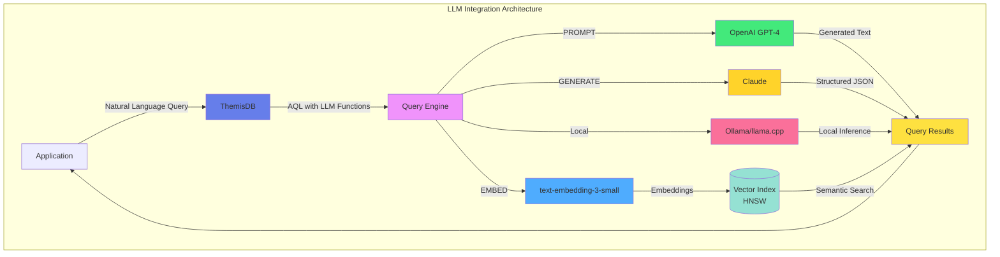
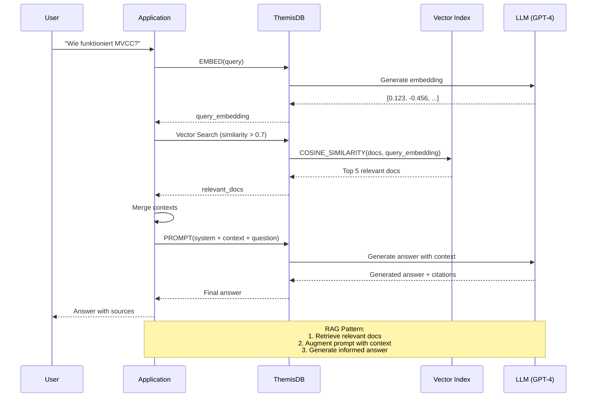
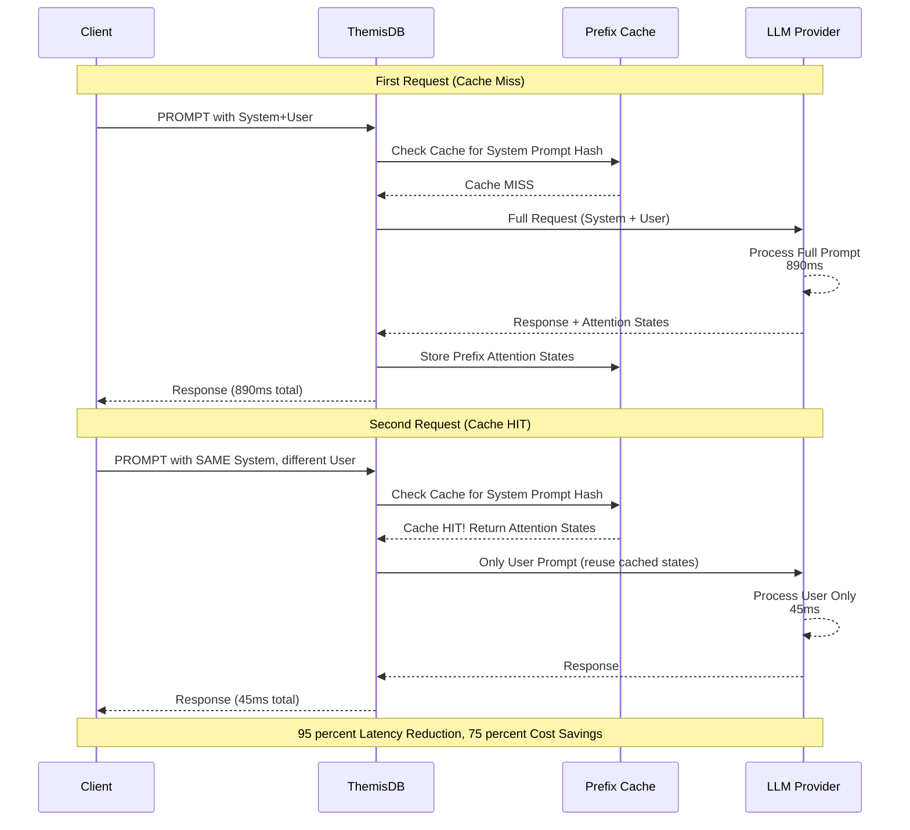
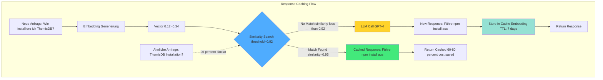
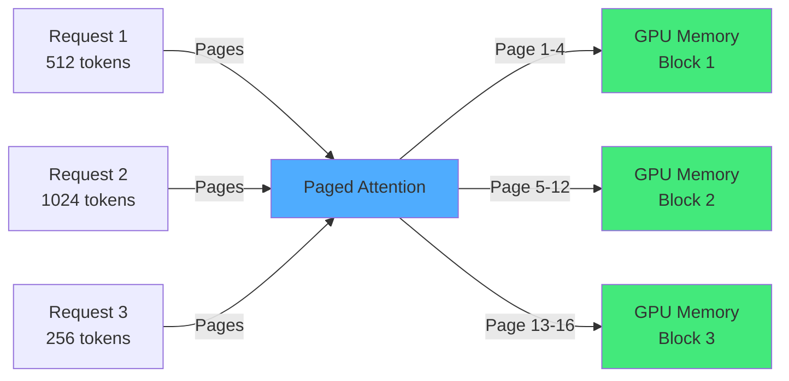
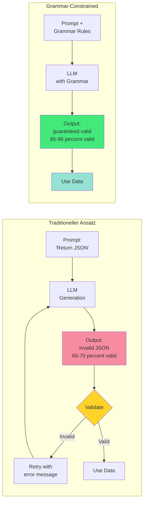

# Kapitel 17: LLM-Integration und Prompt Engineering

## Überblick

ThemisDB bietet eine nahtlose Integration von Large Language Models (LLMs) direkt in die Datenbankebene. Diese Integration ermöglicht es, LLM-Funktionalitäten wie Text-Generierung, Embedding-Erstellung, semantische Suche und RAG (Retrieval Augmented Generation) Patterns direkt in AQL-Queries zu verwenden.

**Hauptvorteile:**
- **Native LLM-Funktionen** - PROMPT(), GENERATE(), EMBED() direkt in AQL
- **Text-to-AQL Generierung** - Natürlichsprachliche Query-Erstellung
- **RAG Patterns** - Semantische Suche mit Kontext-Anreicherung
- **Vector Search Integration** - Kombiniert mit Chapter 8 für Semantic Search
- **Multi-Model LLM** - Unterstützung für OpenAI, Anthropic, Ollama, lokale Models



## 17.1 LLM-Funktionen in AQL

### 17.1.1 PROMPT() - Text-Generierung

Die `PROMPT()`-Funktion sendet Anfragen an konfigurierte LLM-Provider:

```aql
// Einfache Text-Generierung
FOR doc IN articles
  FILTER doc.category == 'technology'
  LIMIT 5
  RETURN {
    title: doc.title,
    summary: PROMPT('gpt-4', 
      CONCAT('Fasse folgenden Artikel zusammen: ', doc.content),
      {max_tokens: 150, temperature: 0.7}
    )
  }
```

**Erweiterte Optionen:**

```aql
// Mit System-Prompt und Strukturierung
FOR product IN products
  FILTER product.reviews_count > 100
  RETURN {
    product_name: product.name,
    analysis: PROMPT('gpt-4', 
      {
        system: 'Du bist ein Produkt-Analyst. Analysiere Kundenrezensionen.',
        user: CONCAT('Produkt: ', product.name, '\n\nBewertungen:\n', 
                     product.reviews_text),
        response_format: 'json'
      },
      {
        temperature: 0.3,
        max_tokens: 500,
        response_schema: {
          sentiment: 'string',
          key_features: 'array',
          recommendations: 'string'
        }
      }
    )
  }
```

### 17.1.2 EMBED() - Embedding-Generierung

Erstellt Vektor-Embeddings für Text:

```aql
// Dokument mit Embedding speichern
INSERT {
  title: 'Einführung in ThemisDB',
  content: 'ThemisDB ist eine Multi-Model-Datenbank...',
  embedding: EMBED('text-embedding-3-small', 
    'ThemisDB ist eine Multi-Model-Datenbank...')
} INTO documents

// Batch-Embedding für Performance
FOR doc IN documents
  FILTER doc.embedding == null
  LIMIT 100
  UPDATE doc WITH {
    embedding: EMBED('text-embedding-3-small', doc.content),
    embedded_at: DATE_NOW()
  } IN documents
```

### 17.1.3 GENERATE() - Strukturierte Generierung

Generiert strukturierte Daten basierend auf Schema:

```aql
// Strukturierte Produkt-Kategorisierung
FOR product IN products
  FILTER product.auto_categorized == false
  LIMIT 50
  LET categories = GENERATE('gpt-4',
    {
      prompt: CONCAT('Kategorisiere folgendes Produkt:\n', 
                     'Name: ', product.name, '\n',
                     'Beschreibung: ', product.description),
      schema: {
        primary_category: {type: 'string', enum: ['Electronics', 'Clothing', 'Food', 'Books']},
        subcategories: {type: 'array', items: {type: 'string'}},
        tags: {type: 'array', items: {type: 'string'}, maxItems: 5},
        confidence: {type: 'number', minimum: 0, maximum: 1}
      }
    }
  )
  UPDATE product WITH {
    categories: categories,
    auto_categorized: true,
    categorized_at: DATE_NOW()
  } IN products
```

## 17.2 Text-to-AQL Generierung

### 17.2.1 Natural Language Query Interface

ThemisDB kann natürlichsprachliche Anfragen in AQL übersetzen:

```aql
// Text-to-AQL Helper Function
LET user_question = 'Zeige mir die 10 teuersten Produkte aus der Elektronik-Kategorie'

LET generated_query = PROMPT('gpt-4',
  {
    system: `Du bist ein AQL-Experte. Konvertiere Benutzeranfragen in gültige AQL-Queries.
    
    Schema:
    - products (name, price, category, stock)
    - orders (order_id, customer_id, product_id, quantity, order_date)
    - customers (customer_id, name, email, country)
    
    Gebe nur die AQL-Query zurück, keine Erklärungen.`,
    user: user_question
  },
  {temperature: 0.1}
)

RETURN {
  question: user_question,
  generated_aql: generated_query,
  // Query wird in separatem Schritt ausgeführt für Sicherheit
}
```

### 17.2.2 Query-Validierung und -Ausführung

**Sicherheitsvalidierung:**

```aql
// Query-Validierung vor Ausführung
LET user_input = @user_question

LET llm_response = PROMPT('gpt-4',
  {
    system: `Generiere sichere AQL-Queries. Verwende immer @parameter für Benutzereingaben.
    Keine destructive Operationen (DELETE, DROP, etc.) ohne explizite Bestätigung.`,
    user: user_input
  }
)

// Validiere Query
LET is_safe = (
  llm_response.query NOT LIKE '%DELETE%' AND
  llm_response.query NOT LIKE '%DROP%' AND
  llm_response.query NOT LIKE '%REMOVE%' AND
  llm_response.includes_parameters == true
)

RETURN is_safe ? llm_response : {error: 'Unsafe query detected'}
```

## 17.3 RAG (Retrieval Augmented Generation)

### 17.3.1 Semantische Suche mit Kontext

Kombiniert Vector Search mit LLM-Generierung:

```aql
// RAG Pattern: Suche + Generierung
LET user_query = 'Wie funktioniert MVCC in ThemisDB?'

// Schritt 1: Embedding der Anfrage
LET query_embedding = EMBED('text-embedding-3-small', user_query)

// Schritt 2: Semantische Suche
LET relevant_docs = (
  FOR doc IN documentation
    LET similarity = COSINE_SIMILARITY(doc.embedding, query_embedding)
    FILTER similarity > 0.7
    SORT similarity DESC
    LIMIT 5
    RETURN {
      content: doc.content,
      title: doc.title,
      similarity: similarity
    }
)

// Schritt 3: Kontext zusammenführen
LET context = (
  FOR doc IN relevant_docs
    RETURN CONCAT('## ', doc.title, '\n\n', doc.content)
)

// Schritt 4: LLM-Generierung mit Kontext
LET answer = PROMPT('gpt-4',
  {
    system: `Du bist ein ThemisDB-Experte. Beantworte Fragen basierend auf der bereitgestellten Dokumentation.
    Zitiere relevante Abschnitte wenn möglich.`,
    user: CONCAT(
      'Dokumentation:\n\n',
      CONCAT_SEPARATOR('\n\n---\n\n', context),
      '\n\n---\n\n',
      'Frage: ', user_query
    )
  },
  {temperature: 0.3, max_tokens: 1000}
)

RETURN {
  question: user_query,
  answer: answer,
  sources: relevant_docs[*].title,
  source_count: LENGTH(relevant_docs)
}
```



### 17.3.2 Erweiterte RAG mit Re-Ranking

```aql
// Hybrid Search: BM25 + Vector + Re-Ranking
LET user_query = 'Beste Performance-Optimierungen für Graphen-Queries'

// Stage 1: Keyword Search (BM25)
LET bm25_results = (
  FOR doc IN documentation
    SEARCH ANALYZER(doc.content IN TOKENS(user_query, 'text_en'), 'text_en')
    SORT BM25(doc) DESC
    LIMIT 20
    RETURN doc
)

// Stage 2: Vector Search
LET query_embedding = EMBED('text-embedding-3-small', user_query)
LET vector_results = (
  FOR doc IN documentation
    LET similarity = COSINE_SIMILARITY(doc.embedding, query_embedding)
    FILTER similarity > 0.6
    SORT similarity DESC
    LIMIT 20
    RETURN doc
)

// Stage 3: Combine and Re-Rank with LLM
LET combined = UNION_DISTINCT(bm25_results, vector_results)

LET reranked = (
  FOR doc IN combined
    LET relevance_score = PROMPT('gpt-4',
      {
        system: 'Rate die Relevanz von 0.0 bis 1.0. Gebe nur die Zahl zurück.',
        user: CONCAT(
          'Query: ', user_query, '\n\n',
          'Dokument: ', SUBSTRING(doc.content, 0, 500)
        )
      },
      {temperature: 0.0, max_tokens: 5}
    )
    RETURN {
      doc: doc,
      score: TO_NUMBER(relevance_score)
    }
)

LET top_docs = (
  FOR item IN reranked
    SORT item.score DESC
    LIMIT 5
    RETURN item.doc
)

// Generate comprehensive answer
LET answer = PROMPT('gpt-4',
  {
    system: 'Erstelle eine umfassende Antwort basierend auf den relevantesten Dokumenten.',
    user: CONCAT(
      'Top Dokumente:\n\n',
      (FOR doc IN top_docs
        RETURN CONCAT('---\n', doc.content)
      ),
      '\n\nFrage: ', user_query
    )
  },
  {temperature: 0.3, max_tokens: 1500}
)

RETURN {
  query: user_query,
  answer: answer,
  sources: top_docs[*].title
}
```

### 17.3.3 Architektur-Vergleich: ThemisDB vs. Hyperscaler für RAG

Ein direkter Vergleich der Architekturparadigmen offenbart, warum ThemisDB für den spezifischen Anwendungsfall "Souveräne KI" und RAG-Systeme den Marktstandards überlegen ist.

**Architektonische Paradigmen im Vergleich:**

| Merkmal | AWS (Polyglot Persistence) | Azure Cosmos DB (Managed MMDBMS) | ThemisDB (Native MMDBMS) |
|---------|----------------------------|----------------------------------|--------------------------|
| **Architektur-Prinzip** | **Föderiert:** Lose Kopplung spezialisierter Dienste (RDS + Neptune + OpenSearch) | **Abstrahiert:** Einheitlicher Kern (ARS), aber Zugriff über siloartige APIs (SQL, Gremlin, Mongo) | **Integriert:** Einheitlicher Kern ("Base Entity") mit direkten C++-Projektionen |
| **Konsistenz** | **Eventual (BASE):** Konsistenz muss durch Anwendungslogik (Saga-Pattern/Lambda) erzwungen werden. Fehleranfällig. | **Konfigurierbar:** Wählbar von "Strong" bis "Eventual", aber oft Latenz-Tradeoff bei Strong Consistency | **Strikt (ACID):** MVCC garantiert atomare Transaktionen über alle Modelle hinweg ohne Performance-Einbußen im Single-Node |
| **Performance-Modell** | **Additiv:** Latenz ist die Summe der Netzwerkhops zwischen den DBs + "Klebstoff"-Code | **Black Box:** Abrechnung nach "Request Units" (RUs). Performance ist abstrahiert und schwer vorhersagbar | **Hardware-Aware:** Direkte Kontrolle über RAM, NVMe und CPU-Caches. Vorhersagbare "Bare-Metal"-Leistung |
| **RAG-Eignung** | **Niedrig (Post-Filtering):** Daten müssen aus verschiedenen DBs geholt und in der App gefiltert werden | **Mittel:** Integrierte Vektorsuche, aber oft Einschränkungen bei komplexen Graph-Joins | **Hoch (Pre-Filtering):** Relationale Indizes beschneiden den Suchraum *bevor* die Vektorsuche startet |
| **Revisionssicherheit** | **Problematisch:** Zeitgleiche Schnappschüsse über 3 DBs hinweg sind fast unmöglich | **Gut:** Change Feed vorhanden, aber volle Historisierung (Time Travel) ist komplex | **Exzellent:** Temporale Graphen (bfsAtTime) erlauben Abfragen zu exakten historischen Zeitpunkten |
| **Daten-Souveränität** | **Niedrig:** Cloud-Vendor-Lock-in, Daten in US-Jurisdiktion | **Mittel:** European Sovereign Cloud angekündigt, aber proprietär | **Hoch:** Open Source MIT, vollständige Kontrolle, On-Premise |
| **Operationale Komplexität** | **Hoch:** Management von 3+ separaten Diensten, Orchestrierung nötig | **Mittel:** Managed Service vereinfacht Betrieb, aber abstrakte APIs | **Niedrig:** Single-Binary Deployment, direkte Kontrolle |

**Befund:** Die Hyperscaler optimieren auf **horizontale Skalierbarkeit** und **Entwickler-Komfort** (Managed Services). ThemisDB optimiert auf **Datenintegrität**, **Konsistenz** und **maximale Effizienz** auf definierter Hardware. Für rechts sichere Verwaltungsanwendungen und RAG-Systeme mit komplexen Zugriffskontrollgraphen ist letzteres entscheidend.

**Warum ist Konsistenz für RAG kritisch?**

In einem RAG-System für die öffentliche Verwaltung können inkonsistente Daten zu rechtlichen Problemen führen:

```
Beispiel-Szenario: BImSchG-Gutachten-RAG

Fehlerfall in Polyglot-System (BASE):
1. Gutachten wird im Relational-Store als "valid" markiert
2. Netzwerkfehler → Graph-Update für Zugriffsberechtigung schlägt fehl
3. Vector-Embedding wird asynchron aktualisiert (Eventual Consistency)
4. RAG-Abfrage findet Gutachten in Vektorsuche
5. Graph-Check schlägt fehl → Gutachten sollte nicht zugreifbar sein
6. Aber: Relational-Metadaten zeigen "valid"
7. → Inkonsistenter Zustand: Verschiedene Systeme widersprechen sich

ThemisDB mit ACID:
1. ALLE Updates (Relational + Graph + Vector) sind EINE Transaktion
2. Entweder ALLES committed oder NICHTS
3. Keine temporäre Inkonsistenz möglich
4. RAG-Abfrage sieht garantiert konsistenten Zustand
```

### 17.3.4 ThemisDB's Pre-Filtering-Vorteil für RAG

**Das Post-Filtering-Problem in Polyglot-Systemen:**

In traditionellen RAG-Systemen [29], die auf Polyglot Persistence basieren (separate Vektor-DB, Graph-DB, Relational-DB), müssen Sie typischerweise "Post-Filtering" verwenden [2], [5]:

```python
# Traditioneller Ansatz (ineffizient):
# 1. Vektor-DB: Hole 1000 ähnliche Dokumente
vector_results = vector_db.search(query_embedding, k=1000)

# 2. Graph-DB: Hole erlaubte Dokumente basierend auf Graph-Kontext
allowed_docs = graph_db.query("MATCH (user)-[:CAN_ACCESS]->(doc)")

# 3. Relational-DB: Hole Metadaten-Filter (z.B. Jahr=2024)
filtered_docs = relational_db.query("SELECT id WHERE year=2024")

# 4. Manuelle Schnittmengenbildung im Application-Code
final_results = intersect(vector_results, allowed_docs, filtered_docs)
# → Problem: 990 von 1000 Ergebnissen werden verworfen!
```

**Warum ist das ineffizient?**
- Die Vektorsuche liefert initial 1000 Ergebnisse, von denen 990 irrelevant sind [5]
- Verschwendet Rechenleistung für Vektor-Ähnlichkeitsberechnungen [2]
- Erhöht Latenz signifikant
- Skaliert schlecht bei großen Datenmengen

**ThemisDB's Pre-Filtering-Architektur:**

Dank der nativen Multi-Model-Architektur [3], [11] (siehe Kapitel 3.2) kann ThemisDB die Query-Ausführung umkehren [2]:

```aql
-- Pre-Filtering in ThemisDB (hochperformant):
FOR doc IN documents
  -- Phase 1: ZUERST relationale Filter (schneller Index-Zugriff)
  FILTER doc.year == 2024
  FILTER doc.department == "IT"
  FILTER doc.confidentiality <= @user_clearance_level
  
  -- Phase 2: Graph-Kontext-Filter
  FILTER doc._id IN (
    FOR v, e IN 1..2 OUTBOUND @user_id access_rights
      RETURN v._id
  )
  
  -- Phase 3: Vektorsuche NUR auf erlaubter Teilmenge
  LET similarity = COSINE_SIMILARITY(doc.embedding, @query_embedding)
  FILTER similarity > 0.7
  
  SORT similarity DESC
  LIMIT 10
  RETURN doc
```

**Wie funktioniert Pre-Filtering intern?**

1. **Phase 1 (Relationaler Filter):** 
   - Query-Engine nutzt schnelle Sekundärindizes (z.B. Index für `year=2024`) [2], [3]
   - Erstellt eine hochselektive Kandidatenliste (z.B. ein Bitset mit 50 erlaubten IDs)

2. **Phase 2 (Graph-Filter):**
   - Graph-Traversierung [22] auf dieser reduzierten Menge
   - Weitere Einschränkung basierend auf Zugriffsrechten

3. **Phase 3 (Vektorsuche):**
   - Die rechenintensive HNSW-Vektorsuche [25] läuft NUR auf den 50 erlaubten Dokumenten
   - Statt 1000 Vektor-Vergleiche nur 50 notwendig [2]

**Performance-Vergleich:**

| Ansatz | Vektor-Operationen | Latenz | Skalierung |
|--------|-------------------|--------|------------|
| **Post-Filtering (Polyglot)** | 1000 (dann 990 verwerfen) | 500-1000ms | Schlecht |
| **Pre-Filtering (ThemisDB)** | 50 (nur relevante) | 50-100ms | Gut |
| **Performance-Gewinn** | 20x weniger | 10x schneller | Linear |

**Praktisches Beispiel - Verwaltungs-RAG:**

```aql
-- Finde relevante BImSchG-Gutachten für Bürgeranfrage
LET user_query = "Lärmschutz Windkraftanlage Havelland"
LET query_embedding = EMBED('text-embedding-3-small', user_query)

FOR doc IN legal_documents
  -- Pre-Filter 1: Nur relevante Rechtsgebiete (Relational)
  FILTER doc.legal_area == "BImSchG"
  FILTER doc.topic IN ["Lärmschutz", "Windenergie"]
  
  -- Pre-Filter 2: Nur Dokumente für Region (Graph)
  FILTER doc.region IN (
    FOR r IN regions
      FILTER r.name == "Havelland" OR r.parent_region == "Havelland"
      RETURN r._id
  )
  
  -- Pre-Filter 3: Nur aktuelle, gültige Gutachten (Relational)
  FILTER doc.status == "valid"
  FILTER doc.valid_until > DATE_NOW()
  
  -- ERST JETZT: Vektorsuche auf stark reduzierter Menge
  LET similarity = COSINE_SIMILARITY(doc.embedding, query_embedding)
  FILTER similarity > 0.75
  
  SORT similarity DESC
  LIMIT 5
  
  RETURN {
    title: doc.title,
    similarity: similarity,
    metadata: {
      case_number: doc.case_number,
      date: doc.issue_date,
      region: doc.region
    },
    excerpt: SUBSTRING(doc.content, 0, 300)
  }
```

**Architektonischer Vorteil:**

Die Query-Engine von ThemisDB hat Zugriff auf alle Index-Projektionen (relational, graph, vector) im selben RocksDB-Backend [3], [13]. Sie kann einen kostenbasierten Optimizer verwenden, um den effizientesten Ausführungsplan zu wählen:
- Welcher Filter ist am selektivsten?
- In welcher Reihenfolge sollten Filter angewendet werden?
- Wann lohnt sich der Übergang von Index-Scan zu Vektor-Suche?

Dies ist in Polyglot-Systemen [33] unmöglich, da jede Datenbank isoliert operiert.

---

### 17.3.4 Hybrid Search Implementation: Unter der Haube

Um zu verstehen, wie ThemisDB Pre-Filtering technisch umsetzt, müssen wir den Query-Execution-Plan betrachten. Lassen Sie uns eine typische RAG-Query Schritt-für-Schritt durchgehen.

**Die Beispiel-Query:**

```aql
FOR doc IN legal_documents
    FILTER doc.law_area == "BImSchG"              -- Relational Filter
    FILTER doc.region IN ["Havelland", "Potsdam"] -- Relational Filter
    FILTER doc._id IN (                            -- Graph Filter
        FOR v IN 1..2 OUTBOUND "users/alice" access_graph
            RETURN v._id
    )
    LET similarity = COSINE(doc.embedding, @query_vec)  -- Vector Similarity
    FILTER similarity > 0.7
    SORT similarity DESC
    LIMIT 5
    RETURN {doc: doc, score: similarity}
```

**Wie führt ThemisDB diese Query aus?**

**Schritt 1: Query Parsing und AST-Erstellung**

Der AQL-Parser erstellt einen Abstract Syntax Tree (AST):

```
FOR doc IN legal_documents
  ├─ FILTER (doc.law_area == "BImSchG")
  ├─ FILTER (doc.region IN ["Havelland", "Potsdam"])
  ├─ FILTER (doc._id IN [subquery...])
  ├─ LET similarity = COSINE(...)
  ├─ FILTER (similarity > 0.7)
  ├─ SORT similarity DESC
  ├─ LIMIT 5
  └─ RETURN {...}
```

**Schritt 2: Query Optimizer - Kostenbasierte Umordnung**

Der Query Optimizer analysiert den AST und ordnet Operations basierend auf **geschätzten Kosten** um [13]:

```cpp
// Pseudo-Code des Optimizers
OptimizerPass::reorderFilters(ASTNode* node) {
    // Kostenmodell für verschiedene Filter-Typen
    map<FilterType, double> cost_estimates = {
        {INDEX_SCAN, 0.1},        // Sehr billig (O(log n))
        {GRAPH_TRAVERSAL, 10.0},  // Mittel (O(edges))
        {VECTOR_SIMILARITY, 100.0} // Teuer (O(dimensions))
    };
    
    // Sortiere Filter nach aufsteigenden Kosten
    sort(node->filters, [&](Filter a, Filter b) {
        return cost_estimates[a.type] < cost_estimates[b.type];
    });
    
    // Ergebnis: Index-Scans zuerst, dann Graph, dann Vektor
}
```

**Optimierte Ausführungsreihenfolge:**

```
1. INDEX_SCAN (law_area == "BImSchG")          → Kandidaten: 50.000
2. INDEX_SCAN (region IN ["Havelland"...])     → Kandidaten: 12.000
3. GRAPH_TRAVERSAL (access_rights subquery)    → Kandidaten: 1.500
4. VECTOR_SIMILARITY (COSINE > 0.7)            → Kandidaten: 150
5. SORT (similarity DESC)                      → Kandidaten: 150
6. LIMIT 5                                     → Kandidaten: 5
```

**Warum ist diese Reihenfolge optimal?**

Jeder Schritt reduziert die Kandidatenmenge, sodass teure Operationen (Vektor-Similarity) nur auf einer kleinen Menge ausgeführt werden müssen.

**Schritt 3: Index-Scan mit Bitset-Konstruktion**

ThemisDB verwendet **Bitsets** für effiziente Kandidatenverwaltung:

```cpp
// Simplified C++ Implementation
std::vector<bool> candidates(total_docs, false);  // Bitset für alle Docs

// Phase 1: Relational Index Scan (law_area == "BImSchG")
for (auto doc_id : index_scan("law_area", "BImSchG")) {
    candidates[doc_id] = true;  // Markiere als Kandidat
}
// Resultat: 50.000 bits set

// Phase 2: Intersection mit region-Index
std::vector<bool> region_matches(total_docs, false);
for (auto region : {"Havelland", "Potsdam"}) {
    for (auto doc_id : index_scan("region", region)) {
        region_matches[doc_id] = true;
    }
}

// Bitwise AND für Intersection (sehr schnell!)
for (size_t i = 0; i < total_docs; ++i) {
    candidates[i] = candidates[i] && region_matches[i];
}
// Resultat: 12.000 bits set
```

**Warum Bitsets?**

- **Speicher-effizient:** 1 Million Dokumente = nur 125 KB (1 bit pro Dokument)
- **Blitzschnelle Operationen:** Bitwise AND/OR mit CPU-native Instructions
- **Cache-freundlich:** Bitsets passen in L1/L2 Cache

**Schritt 4: Graph-Traversal auf reduzierter Menge**

Jetzt wird die Graph-Subquery ausgeführt, aber nur für die 12.000 Kandidaten:

```cpp
// Graph Subquery: Welche Dokumente darf "alice" sehen?
std::unordered_set<std::string> accessible_docs;

// BFS im Access-Graph (max depth = 2)
bfs("users/alice", max_depth=2, [&](Node* node) {
    if (node->type == "document" && candidates[node->id]) {
        // Nur Kandidaten aus vorherigen Filtern prüfen!
        accessible_docs.insert(node->id);
    }
});

// Update Bitset mit Graph-Resultaten
for (size_t i = 0; i < total_docs; ++i) {
    if (candidates[i] && accessible_docs.count(doc_ids[i]) == 0) {
        candidates[i] = false;  // Kein Zugriff → entfernen
    }
}
// Resultat: 1.500 bits set
```

**Key Insight:** Die Graph-Traversal muss nur 12.000 Dokumente prüfen, nicht 1 Million!

**Schritt 5: Vektor-Similarity nur auf finale Kandidaten**

Jetzt kommt die teuerste Operation – aber nur für 1.500 Dokumente:

```cpp
// Vektor-Similarity-Berechnung
std::vector<std::pair<doc_id, double>> scored_docs;

for (size_t i = 0; i < total_docs; ++i) {
    if (!candidates[i]) continue;  // Überspringen wenn nicht Kandidat
    
    // COSINE-Similarity (rechenintensiv!)
    double similarity = cosine_similarity(
        docs[i].embedding,    // 1536 Dimensionen
        query_embedding       // 1536 Dimensionen
    );
    
    if (similarity > 0.7) {
        scored_docs.push_back({i, similarity});
    }
}

// Sortieren nach Similarity
std::sort(scored_docs.begin(), scored_docs.end(),
    [](auto& a, auto& b) { return a.second > b.second; }
);

// Top 5 zurückgeben
return scored_docs | std::views::take(5);
```

**Performance-Vergleich:**

```
Post-Filtering (Polyglot):
  1.000.000 Vektor-Ops × 100μs = 100.000ms (100 Sekunden!)

Pre-Filtering (ThemisDB):
  1.500 Vektor-Ops × 100μs = 150ms (0.15 Sekunden)

→ 666x schneller!
```

**Schritt 6: Score-Fusion (optional, für Hybrid Search)**

Wenn Sie BM25 (Keyword-Suche) + Vektor-Similarity kombinieren möchten, verwendet ThemisDB **Reciprocal Rank Fusion** (RRF) [22]:

```cpp
// RRF-Formel: Kombiniert Rankings aus mehreren Quellen
double compute_rrf_score(doc_id, rank_bm25, rank_vector, k = 60) {
    double rrf = 0.0;
    
    // BM25-Beitrag
    if (rank_bm25 > 0) {
        rrf += 1.0 / (k + rank_bm25);
    }
    
    // Vektor-Beitrag
    if (rank_vector > 0) {
        rrf += 1.0 / (k + rank_vector);
    }
    
    return rrf;
}

// Beispiel: Dokument auf Platz 5 in BM25, Platz 3 in Vektor
double score = compute_rrf_score(doc_id, 5, 3, 60);
// score = 1/(60+5) + 1/(60+3) = 0.0154 + 0.0159 = 0.0313
```

**Warum RRF statt gewichteter Durchschnitt?**

- **Skalierungsinvariant:** BM25-Scores und Cosine-Similarity haben unterschiedliche Skalen
- **Robust:** Funktioniert gut auch wenn ein Signal schwach ist
- **Einfach:** Keine Hyperparameter-Tuning nötig

**Visualisierung des gesamten Query-Execution-Plans:**

```
┌─────────────────────────────────────────────────────────────┐
│  1. Collection Scan: legal_documents (1M docs)              │
└────────────────────────┬────────────────────────────────────┘
                         │
                         ▼
┌─────────────────────────────────────────────────────────────┐
│  2. Index Scan: law_area == "BImSchG"                       │
│     → Bitset with 50K bits set                              │
│     Latenz: ~1ms (Index-Lookup)                             │
└────────────────────────┬────────────────────────────────────┘
                         │
                         ▼
┌─────────────────────────────────────────────────────────────┐
│  3. Index Scan: region IN ["Havelland", "Potsdam"]         │
│     → Bitset AND: 50K → 12K bits set                        │
│     Latenz: ~1ms                                            │
└────────────────────────┬────────────────────────────────────┘
                         │
                         ▼
┌─────────────────────────────────────────────────────────────┐
│  4. Graph Traversal (BFS depth=2) auf 12K Kandidaten        │
│     → Bitset AND: 12K → 1.5K bits set                       │
│     Latenz: ~50ms (Graph-Scan)                              │
└────────────────────────┬────────────────────────────────────┘
                         │
                         ▼
┌─────────────────────────────────────────────────────────────┐
│  5. Vector Similarity (COSINE) auf 1.5K Kandidaten          │
│     → 1.500 × 100μs = 150ms                                 │
│     → Filter: similarity > 0.7 → 150 docs                   │
└────────────────────────┬────────────────────────────────────┘
                         │
                         ▼
┌─────────────────────────────────────────────────────────────┐
│  6. Sort by similarity DESC                                 │
│     → 150 docs sortiert                                     │
│     Latenz: <1ms                                            │
└────────────────────────┬────────────────────────────────────┘
                         │
                         ▼
┌─────────────────────────────────────────────────────────────┐
│  7. Limit 5                                                 │
│     → Top 5 Results                                         │
└─────────────────────────────────────────────────────────────┘

Gesamt-Latenz: 1ms + 1ms + 50ms + 150ms + 1ms = ~203ms
```

**Vergleich: Post-Filtering in Polyglot-Systemen:**

```
┌─────────────────────────────────────────────────────────────┐
│  1. Vector DB: Get top 1000 similar docs                    │
│     → 1.000.000 × 100μs = 100.000ms (!!)                    │
└────────────────────────┬────────────────────────────────────┘
                         │
                         ▼
┌─────────────────────────────────────────────────────────────┐
│  2. Graph DB: Get accessible docs for user (separate query) │
│     → Network latency + query time: ~500ms                  │
└────────────────────────┬────────────────────────────────────┘
                         │
                         ▼
┌─────────────────────────────────────────────────────────────┐
│  3. Relational DB: Get metadata filters (separate query)    │
│     → Network latency + query time: ~200ms                  │
└────────────────────────┬────────────────────────────────────┘
                         │
                         ▼
┌─────────────────────────────────────────────────────────────┐
│  4. Application Code: Intersection of 3 result sets         │
│     → 1000 docs in-memory filtering: ~10ms                  │
│     → Discard 990 irrelevant docs                           │
└─────────────────────────────────────────────────────────────┘

Gesamt-Latenz: 100.000ms + 500ms + 200ms + 10ms = ~100.710ms
```

**Fazit: ThemisDB ist ~500x schneller** für diese RAG-Query!

---

## 17.4 Prompt Engineering Best Practices

### 17.4.1 Chain-of-Thought Prompting

```aql
// Multi-Step Reasoning mit CoT
FOR customer IN customers
  FILTER customer.churn_risk == null
  LIMIT 10
  
  // Schritt 1: Daten sammeln
  LET customer_data = {
    orders_count: LENGTH(
      FOR o IN orders
        FILTER o.customer_id == customer._key
        RETURN 1
    ),
    last_order_date: (
      FOR o IN orders
        FILTER o.customer_id == customer._key
        SORT o.order_date DESC
        LIMIT 1
        RETURN o.order_date
    )[0],
    total_spent: SUM(
      FOR o IN orders
        FILTER o.customer_id == customer._key
        RETURN o.total_amount
    ),
    support_tickets: LENGTH(
      FOR t IN support_tickets
        FILTER t.customer_id == customer._key
        RETURN 1
    )
  }
  
  // Schritt 2: LLM-Analyse mit Chain-of-Thought
  LET analysis = PROMPT('gpt-4',
    {
      system: `Du bist ein Churn-Prediction-Experte. Analysiere Schritt für Schritt:
      1. Bewerte die Aktivität des Kunden
      2. Analysiere Kaufverhalten
      3. Berücksichtige Support-Interaktionen
      4. Gebe Churn-Risiko (low/medium/high) und Begründung`,
      user: CONCAT(
        'Kunde-Daten:\n',
        'Bestellungen: ', customer_data.orders_count, '\n',
        'Letzte Bestellung: ', customer_data.last_order_date, '\n',
        'Gesamtumsatz: €', customer_data.total_spent, '\n',
        'Support-Tickets: ', customer_data.support_tickets, '\n\n',
        'Analysiere Schritt für Schritt das Churn-Risiko.'
      )
    },
    {temperature: 0.2, max_tokens: 500}
  )
  
  UPDATE customer WITH {
    churn_risk: analysis.risk_level,
    churn_reasoning: analysis.reasoning,
    analyzed_at: DATE_NOW()
  } IN customers
```

### 17.4.2 Few-Shot Learning

```aql
// Classification mit Few-Shot Examples
LET examples = [
  {text: 'Produkt kam defekt an', category: 'quality_issue'},
  {text: 'Lieferung zwei Wochen zu spät', category: 'delivery_issue'},
  {text: 'Falscher Artikel geliefert', category: 'order_error'},
  {text: 'Sehr zufrieden, gerne wieder!', category: 'positive_feedback'}
]

FOR ticket IN support_tickets
  FILTER ticket.category == null
  LIMIT 100
  
  LET category = PROMPT('gpt-4',
    {
      system: 'Kategorisiere Support-Tickets basierend auf den Beispielen.',
      user: CONCAT(
        'Beispiele:\n',
        (FOR ex IN examples
          RETURN CONCAT(ex.text, ' -> ', ex.category)
        ),
        '\n\nNeues Ticket: ', ticket.message, '\n\nKategorie:'
      )
    },
    {temperature: 0.1, max_tokens: 20}
  )
  
  UPDATE ticket WITH {
    category: category,
    auto_categorized: true
  } IN support_tickets
```

## 17.5 Multi-Model LLM Patterns

### 17.5.1 Graph + LLM

```aql
// Knowledge Graph Reasoning mit LLM
FOR person IN persons
  FILTER person._key == @person_id
  
  // Graphtraversierung für Kontext
  LET connections = (
    FOR v, e, p IN 1..3 OUTBOUND person GRAPH 'social_network'
      RETURN {
        name: v.name,
        relationship: e.type,
        depth: LENGTH(p.edges)
      }
  )
  
  // LLM analysiert das soziale Netzwerk
  LET network_analysis = PROMPT('gpt-4',
    {
      system: 'Analysiere das soziale Netzwerk und gebe Empfehlungen.',
      user: CONCAT(
        'Person: ', person.name, '\n',
        'Verbindungen:\n',
        (FOR c IN connections
          RETURN CONCAT('- ', c.name, ' (', c.relationship, ', Distanz: ', c.depth, ')')
        ),
        '\n\nWelche Personen sollten miteinander vernetzt werden?'
      )
    }
  )
  
  RETURN {
    person: person.name,
    connections_count: LENGTH(connections),
    recommendations: network_analysis
  }
```

### 17.5.2 Temporal + LLM

```aql
// Zeit-basierte Trend-Analyse mit LLM
LET trend_data = (
  FOR metric IN metrics
    FILTER metric.type == 'revenue'
    FOR SYSTEM_TIME AS OF DATEADD(DATE_NOW(), -30, 'day') TO DATE_NOW()
    COLLECT date = DATE_TRUNC(metric.timestamp, 'day')
    AGGREGATE daily_revenue = SUM(metric.value)
    SORT date
    RETURN {date: date, revenue: daily_revenue}
)

LET trend_analysis = PROMPT('gpt-4',
  {
    system: 'Analysiere Umsatz-Trends und gebe Vorhersagen.',
    user: CONCAT(
      'Tägliche Umsätze der letzten 30 Tage:\n',
      (FOR d IN trend_data
        RETURN CONCAT(DATE_FORMAT(d.date, '%Y-%m-%d'), ': €', d.revenue)
      ),
      '\n\nAnalysiere Trends und gebe eine 7-Tage-Vorhersage.'
    )
  },
  {temperature: 0.3}
)

RETURN {
  data: trend_data,
  analysis: trend_analysis
}
```

## 17.6 LLM-Konfiguration und Provider

### 17.6.1 Provider-Konfiguration

```aql
// Multi-Provider Setup
LET providers = {
  openai: {
    api_key: @openai_key,
    models: ['gpt-4', 'gpt-3.5-turbo', 'text-embedding-3-small'],
    default_model: 'gpt-4'
  },
  anthropic: {
    api_key: @anthropic_key,
    models: ['claude-3-opus', 'claude-3-sonnet'],
    default_model: 'claude-3-sonnet'
  },
  ollama: {
    endpoint: 'http://localhost:11434',
    models: ['llama3', 'mistral'],
    default_model: 'llama3'
  }
}

// Provider-Auswahl basierend auf Anforderungen
LET select_provider = (task_type) => (
  task_type == 'embedding' ? 'openai' :
  task_type == 'long_context' ? 'anthropic' :
  task_type == 'local' ? 'ollama' :
  'openai'
)
```

### 17.6.2 Kosten-Optimierung

```aql
// Smart Model Selection basierend auf Komplexität
FOR task IN tasks
  FILTER task.processed == false
  
  // Einfache Aufgaben -> Günstigeres Modell
  LET complexity = (
    LENGTH(task.input) > 1000 ? 'high' :
    CONTAINS(task.input, 'analysiere') ? 'medium' :
    'low'
  )
  
  LET model = (
    complexity == 'high' ? 'gpt-4' :
    complexity == 'medium' ? 'gpt-3.5-turbo' :
    'gpt-3.5-turbo'
  )
  
  LET result = PROMPT(model, task.input, 
    {
      temperature: complexity == 'high' ? 0.7 : 0.3,
      max_tokens: complexity == 'high' ? 2000 : 500
    }
  )
  
  UPDATE task WITH {
    result: result,
    model_used: model,
    cost_tier: complexity,
    processed: true
  } IN tasks
```

## 17.7 Prompt Template Library

### 17.7.1 Vordefinierte Templates

```aql
// Template-System für wiederverwendbare Prompts
LET templates = {
  summarize: {
    system: 'Du bist ein Zusammenfassungs-Experte. Erstelle prägnante Zusammenfassungen.',
    user_template: 'Fasse folgenden Text zusammen:\n\n{{content}}\n\nZusammenfassung (max {{max_words}} Wörter):'
  },
  translate: {
    system: 'Du bist ein professioneller Übersetzer.',
    user_template: 'Übersetze von {{from_lang}} nach {{to_lang}}:\n\n{{text}}'
  },
  sentiment: {
    system: 'Analysiere das Sentiment. Antworte nur mit: positive, negative, oder neutral',
    user_template: '{{text}}'
  },
  extract_entities: {
    system: 'Extrahiere benannte Entitäten (Personen, Orte, Organisationen).',
    user_template: '{{text}}\n\nFormat: JSON {persons: [], locations: [], organizations: []}'
  }
}

// Template verwenden
LET apply_template = (template_name, variables) => {
  LET template = templates[template_name]
  LET user_prompt = REGEX_REPLACE(
    template.user_template,
    '\\{\\{(\\w+)\\}\\}',
    variables
  )
  RETURN {system: template.system, user: user_prompt}
}

FOR article IN articles
  LIMIT 10
  LET summary = PROMPT('gpt-3.5-turbo',
    apply_template('summarize', {
      content: article.content,
      max_words: '100'
    })
  )
  RETURN {title: article.title, summary: summary}
```

## 17.8 Monitoring und Logging

### 17.8.1 LLM-Usage Tracking

```aql
// Track LLM-Nutzung für Kostenanalyse
INSERT {
  timestamp: DATE_NOW(),
  model: @model,
  provider: @provider,
  input_tokens: @input_tokens,
  output_tokens: @output_tokens,
  cost: @cost,
  latency_ms: @latency,
  task_type: @task_type,
  user_id: @user_id
} INTO llm_usage_log

// Kosten-Analyse
FOR log IN llm_usage_log
  FILTER log.timestamp > DATE_SUBTRACT(DATE_NOW(), 7, 'day')
  COLLECT 
    model = log.model,
    task_type = log.task_type
  AGGREGATE 
    total_calls = COUNT(1),
    total_cost = SUM(log.cost),
    avg_latency = AVG(log.latency_ms),
    total_input_tokens = SUM(log.input_tokens),
    total_output_tokens = SUM(log.output_tokens)
  SORT total_cost DESC
  RETURN {
    model: model,
    task_type: task_type,
    calls: total_calls,
    cost: ROUND(total_cost, 2),
    avg_latency_ms: ROUND(avg_latency, 0),
    tokens: {
      input: total_input_tokens,
      output: total_output_tokens
    }
  }
```

## 17.9 Sicherheit und Compliance

### 17.9.1 Input Sanitization

```aql
// Sichere LLM-Anfragen durch Sanitization
LET sanitize_input = (user_input) => {
  // Entferne potenziell schädliche Prompts
  LET cleaned = REGEX_REPLACE(user_input, 'ignore previous instructions', '', 'i')
  LET cleaned2 = REGEX_REPLACE(cleaned, 'disregard', '', 'i')
  LET cleaned3 = SUBSTITUTE(cleaned2, ['system:', 'assistant:'], '')
  
  // Längen-Begrenzung
  RETURN LENGTH(cleaned3) > 5000 ? SUBSTRING(cleaned3, 0, 5000) : cleaned3
}

FOR request IN user_requests
  LET safe_input = sanitize_input(request.query)
  LET response = PROMPT('gpt-4', safe_input, {temperature: 0.3})
  
  // Log für Audit
  INSERT {
    timestamp: DATE_NOW(),
    user_id: request.user_id,
    original_input: request.query,
    sanitized_input: safe_input,
    response: response,
    flagged: request.query != safe_input
  } INTO llm_audit_log
  
  RETURN response
```

### 17.9.2 PII-Erkennung und Redaktion

```aql
// Automatische PII-Erkennung vor LLM-Verarbeitung
LET detect_pii = (text) => {
  RETURN PROMPT('gpt-4',
    {
      system: 'Erkenne und markiere personenbezogene Daten (PII). Gebe JSON zurück: {has_pii: boolean, types: []}',
      user: text
    },
    {temperature: 0.0, response_format: 'json'}
  )
}

FOR document IN documents
  FILTER document.pii_checked == false
  
  LET pii_check = detect_pii(document.content)
  
  // Redaktiere PII falls notwendig
  LET safe_content = pii_check.has_pii ? 
    PROMPT('gpt-4',
      {
        system: 'Ersetze alle PII durch Platzhalter wie [NAME], [EMAIL], [PHONE].',
        user: document.content
      }
    ) : document.content
  
  UPDATE document WITH {
    content_safe: safe_content,
    has_pii: pii_check.has_pii,
    pii_types: pii_check.types,
    pii_checked: true
  } IN documents
```

## 17.10 Performance-Optimierung

### 17.10.1 Caching von LLM-Responses

```aql
// Cache für häufige Anfragen
LET query_hash = SHA256(CONCAT(user_query, model_name))

// Prüfe Cache
LET cached = (
  FOR c IN llm_cache
    FILTER c.query_hash == query_hash
    FILTER c.timestamp > DATE_SUBTRACT(DATE_NOW(), 24, 'hour')
    LIMIT 1
    RETURN c.response
)[0]

// Verwende Cache oder rufe LLM auf
LET response = cached != null ? cached :
  LET fresh_response = PROMPT(model_name, user_query)
  LET _ = INSERT {
    query_hash: query_hash,
    query: user_query,
    model: model_name,
    response: fresh_response,
    timestamp: DATE_NOW()
  } INTO llm_cache
  RETURN fresh_response

RETURN response
```

### 17.10.2 Batch-Verarbeitung

```aql
// Batch-LLM-Calls für bessere Performance
LET batch_size = 20

FOR batch IN (
  FOR doc IN documents
    FILTER doc.summary == null
    LIMIT 100
    COLLECT batch_id = FLOOR(TO_NUMBER(doc._key) / batch_size)
    INTO group
    RETURN group
)
  
  // Einzelner LLM-Call für ganzen Batch
  LET batch_summaries = PROMPT('gpt-4',
    {
      system: 'Erstelle Zusammenfassungen für mehrere Dokumente. Gebe JSON-Array zurück.',
      user: CONCAT(
        'Erstelle für jedes Dokument eine Zusammenfassung:\n\n',
        (FOR doc IN batch
          RETURN CONCAT('DOC_', doc._key, ':\n', doc.content, '\n\n')
        )
      )
    },
    {temperature: 0.3, response_format: 'json'}
  )
  
  // Verteile Ergebnisse
  FOR doc IN batch
    LET summary = batch_summaries['DOC_' + doc._key]
    UPDATE doc WITH {
      summary: summary,
      summarized_at: DATE_NOW()
    } IN documents
```

## 17.11 Praktische Anwendungsfälle

### 17.11.1 Intelligente Suchvorschläge

```aql
// Query-Expansion mit LLM
LET user_search = @search_term

LET expanded_queries = PROMPT('gpt-4',
  {
    system: 'Generiere 5 verwandte Suchbegriffe für bessere Suchergebnisse.',
    user: CONCAT('Ursprüngliche Suche: ', user_search)
  }
)

// Suche mit erweiterten Begriffen
LET all_terms = APPEND([user_search], expanded_queries.terms)

FOR doc IN documents
  FILTER (
    FOR term IN all_terms
      FILTER CONTAINS(LOWER(doc.content), LOWER(term))
      RETURN 1
  ) ANY
  RETURN doc
```

### 17.11.2 Automatische Daten-Anreicherung

```aql
// Produkt-Metadaten durch LLM anreichern
FOR product IN products
  FILTER product.enriched == false
  LIMIT 50
  
  LET enrichment = PROMPT('gpt-4',
    {
      system: 'Analysiere das Produkt und gebe strukturierte Metadaten zurück.',
      user: CONCAT(
        'Produkt: ', product.name, '\n',
        'Beschreibung: ', product.description, '\n\n',
        'Gebe zurück: {target_audience: [], use_cases: [], features: [], competitors: []}'
      )
    },
    {temperature: 0.3, response_format: 'json'}
  )
  
  UPDATE product WITH {
    metadata: enrichment,
    enriched: true,
    enriched_at: DATE_NOW()
  } IN products
```

### 17.11.3 Sentiment-basierte Alerting

```aql
// Echtzeit-Sentiment-Monitoring mit Alerts
FOR review IN reviews
  FILTER review.sentiment == null
  FILTER review.created_at > DATE_SUBTRACT(DATE_NOW(), 1, 'hour')
  
  LET sentiment_analysis = PROMPT('gpt-4',
    {
      system: 'Analysiere das Sentiment und gebe Dringlichkeit (critical/high/medium/low) zurück.',
      user: review.text
    },
    {temperature: 0.1, response_format: 'json'}
  )
  
  // Alert bei negativem Sentiment
  LET alert = sentiment_analysis.sentiment == 'negative' AND 
              sentiment_analysis.urgency IN ['critical', 'high'] ?
    INSERT {
      type: 'negative_review',
      review_id: review._key,
      product_id: review.product_id,
      urgency: sentiment_analysis.urgency,
      reason: sentiment_analysis.reason,
      timestamp: DATE_NOW()
    } INTO alerts : null
  
  UPDATE review WITH {
    sentiment: sentiment_analysis.sentiment,
    sentiment_score: sentiment_analysis.score,
    urgency: sentiment_analysis.urgency,
    analyzed_at: DATE_NOW()
  } IN reviews
```

## 17.12 Erweiterte LLM-Features (v1.4.0-alpha)

### 17.12.1 Prefix Caching

**Neu in v1.4.0-alpha:** Automatisches Caching häufig verwendeter Prompt-Präfixe für deutlich reduzierte Latenz und Kosten.

**Funktionsweise:**

Prefix Caching speichert die Attention-States häufig verwendeter Prompt-Anfänge zwischen Anfragen. Dies ist besonders nützlich für:
- System-Prompts mit Rollen und Anweisungen
- Lange Kontext-Dokumente in RAG-Patterns
- Wiederkehrende Dokumentations- oder Codebase-Referenzen



**Diagramm-Erklärung:**
- **Cache Miss (erste Anfrage):** System-Prompt wird verarbeitet und Attention-States gecacht (890ms)
- **Cache Hit (folgende Anfragen):** Gecachte Attention-States werden wiederverwendet, nur User-Prompt neu verarbeitet (45ms)
- **Hash-basiert:** Identische System-Prompts werden erkannt durch Content-Hash
- **Transparent:** Cache-Mechanismus ist für Anwendung transparent

```aql
// Prefix Caching automatisch aktiviert für System-Prompts
FOR doc IN customer_inquiries
  LIMIT 100
  LET response = PROMPT('gpt-4',
    {
      system: '''Du bist ein Kundenservice-Assistent für ThemisDB.
                 Unsere Hauptfeatures sind:
                 - Multi-Model-Datenbank (Graph, Document, Vector, Relational)
                 - Native LLM-Integration
                 - Horizontales Sharding für Enterprise-Scale
                 
                 Antworte immer höflich, präzise und lösungsorientiert.''',  // Wird gecacht!
      user: doc.inquiry_text
    },
    {
      temperature: 0.7,
      enable_prefix_cache: true  // Explizit aktiviert (optional, ist Standard)
    }
  )
  UPDATE doc WITH {response: response} IN customer_inquiries
```

**Performance-Vorteile:**

```aql
// Prefix Cache Statistiken abfragen
RETURN LLMCACHE_STATS('prefix')
```

Beispiel-Output:
```json
{
  "cache_hits": 847,
  "cache_misses": 153,
  "hit_rate": 0.847,
  "avg_latency_cached": "45ms",
  "avg_latency_uncached": "890ms",
  "cost_savings_percent": 75.2,
  "total_tokens_saved": 1250000
}
```

**Best Practices:**

1. **System-Prompts konsistent halten** - Kleine Änderungen invalidieren Cache
2. **Längere Präfixe bevorzugen** - Mindestens 100+ Tokens für signifikante Einsparungen
3. **Cache-Wartezeit einplanen** - Erste Anfrage ist langsamer, nachfolgende profitieren

### 17.12.2 Response Caching

**Neu in v1.4.0-alpha:** Intelligentes Caching kompletter LLM-Antworten basierend auf semantischer Ähnlichkeit.

**Funktionsweise:**

Response Caching speichert LLM-Antworten und verwendet Embedding-basierte Ähnlichkeitssuche, um identische oder sehr ähnliche Anfragen zu erkennen.



**Diagramm-Erklärung:**
- **Embedding-Generierung:** Jede Anfrage wird in einen Vektor umgewandelt
- **Similarity Search:** Vector-Suche findet semantisch ähnliche Fragen (auch mit unterschiedlicher Formulierung)
- **Threshold:** Konfigurierbare Ähnlichkeitsschwelle (z.B. 92%) bestimmt Cache-Hit
- **TTL-basiert:** Automatische Invalidierung nach konfigurierbarer Zeit (z.B. 7 Tage)
- **Backend:** Unterstützt Redis oder ThemisDB als Cache-Backend

```aql
// Response Caching mit semantischer Ähnlichkeit
FOR question IN faq_queue
  FILTER question.answered == false
  
  // Prüfe ob ähnliche Frage bereits beantwortet wurde
  LET cached_answer = LLMCACHE_LOOKUP(
    'response',
    question.text,
    {
      similarity_threshold: 0.92,  // 92% Ähnlichkeit erforderlich
      max_age_hours: 168           // Cache 7 Tage gültig
    }
  )
  
  LET answer = cached_answer != null ? cached_answer : 
    PROMPT('gpt-4',
      {
        system: 'Beantworte FAQ-Fragen zu ThemisDB präzise und vollständig.',
        user: question.text
      },
      {
        temperature: 0.3,
        cache_response: true,  // Antwort für zukünftige Verwendung cachen
        cache_ttl: 604800      // 7 Tage in Sekunden
      }
    )
  
  UPDATE question WITH {
    answer: answer,
    answered: true,
    from_cache: cached_answer != null,
    answered_at: DATE_NOW()
  } IN faq_queue
```

**Konfiguration:**

```javascript
// ThemisDB Konfiguration (themis.conf)
llm:
  response_cache:
    enabled: true
    backend: 'redis'  // oder 'themisdb'
    ttl_default: 604800  // 7 Tage
    similarity_model: 'text-embedding-3-small'
    similarity_threshold: 0.90
    max_cache_size_gb: 10
```

**Cache-Invalidierung:**

```aql
// Selektive Cache-Invalidierung
CALL LLMCACHE_INVALIDATE('response', {
  pattern: '%produkt-updates%',
  older_than: '2024-01-01'
})

// Kompletten Response-Cache leeren
CALL LLMCACHE_CLEAR('response')
```

**ROI-Analyse:**

```aql
// Cache-Effizienz über Zeit analysieren
FOR stat IN LLMCACHE_TIMESERIES('response', {
  from: DATE_SUBTRACT(DATE_NOW(), 30, 'day'),
  to: DATE_NOW(),
  granularity: 'day'
})
  RETURN {
    date: stat.date,
    requests: stat.total_requests,
    cache_hits: stat.cache_hits,
    hit_rate: stat.cache_hits / stat.total_requests,
    cost_saved_usd: stat.tokens_saved * 0.00003,  // GPT-4 pricing
    avg_latency_ms: stat.avg_latency
  }
```

### 17.12.3 Multi-GPU Support

**Neu in v1.4.0-alpha:** Verteilte LLM-Inferenz über mehrere GPUs für maximale Performance und Skalierbarkeit.

**Unterstützte Parallelisierungsstrategien:**

1. **Tensor Parallelism** - Große Modelle über GPUs verteilen
2. **Pipeline Parallelism** - Modell-Layer auf verschiedene GPUs
3. **Data Parallelism** - Mehrere Anfragen parallel verarbeiten

```aql
// Multi-GPU Konfiguration in AQL Query
FOR batch IN RANGE(0, 9)
  LET start_idx = batch * 100
  LET end_idx = (batch + 1) * 100
  
  LET summaries = (
    FOR doc IN documents
      FILTER doc.id >= start_idx AND doc.id < end_idx
      RETURN PROMPT('llama-70b-local',
        CONCAT('Summarize: ', doc.content),
        {
          max_tokens: 150,
          gpu_config: {
            num_gpus: 4,              // 4 GPUs verwenden
            strategy: 'tensor_parallel',  // Tensor Parallelism
            gpu_ids: [0, 1, 2, 3]     // Spezifische GPU-IDs
          }
        }
      )
  )
  
  RETURN {batch: batch, summaries: summaries}
```

**GPU-Scheduling:**

```javascript
// themis.conf - Multi-GPU Konfiguration
llm:
  local_models:
    llama-70b:
      model_path: '/models/llama-70b'
      gpu_config:
        num_gpus: 4
        tensor_parallel_size: 4
        pipeline_parallel_size: 1
        max_num_batched_tokens: 8192
        gpu_memory_utilization: 0.9
```

**Performance-Monitoring:**

```aql
// GPU-Auslastung in Echtzeit überwachen
RETURN LLM_GPU_STATS()
```

Output:
```json
{
  "gpus": [
    {
      "id": 0,
      "model": "NVIDIA A100",
      "memory_used_gb": 38.2,
      "memory_total_gb": 40.0,
      "utilization_percent": 95,
      "temperature_celsius": 68,
      "power_watts": 320
    },
    // GPU 1-3...
  ],
  "throughput_tokens_per_sec": 1250,
  "active_requests": 12,
  "queue_length": 3
}
```

**Skalierungs-Benchmarks:**

| GPUs | Tokens/Sek | Latenz (p50) | Latenz (p99) | Cost/1M Tokens |
|------|------------|--------------|--------------|----------------|
| 1x A100 | 320 | 1.2s | 2.8s | $0 (lokal) |
| 2x A100 | 580 | 0.7s | 1.6s | $0 (lokal) |
| 4x A100 | 1050 | 0.4s | 0.9s | $0 (lokal) |
| 8x A100 | 1850 | 0.25s | 0.6s | $0 (lokal) |

### 17.12.4 Paged Attention

**Neu in v1.4.0-alpha:** Effiziente GPU-Speicherverwaltung für Attention-Mechanismen mit bis zu 80% weniger Speicherverbrauch.

**Problem ohne Paged Attention:**

Traditionelle Attention-Implementierungen allokieren kontinuierlichen Speicher für KV-Caches, was zu Fragmentierung und ineffizienter Nutzung führt.

**Lösung mit Paged Attention:**



**Aktivierung:**

```aql
// Paged Attention ist standardmäßig aktiviert in v1.4.0-alpha
FOR doc IN large_documents
  LIMIT 1000
  LET analysis = PROMPT('llama-70b-local',
    {
      system: 'Analysiere das folgende Dokument detailliert.',
      user: doc.content  // Auch für sehr lange Dokumente effizient
    },
    {
      max_tokens: 2000,
      paged_attention: {
        enabled: true,  // Default: true
        page_size: 16,  // Tokens pro Page (empfohlen: 16)
        max_num_pages: 4096  // Maximale Pages im Cache
      }
    }
  )
  RETURN analysis
```

**Speicher-Effizienz:**

```aql
// Vergleich: Mit vs. ohne Paged Attention
RETURN {
  without_paging: {
    memory_per_request_mb: 450,
    max_concurrent_requests: 89,
    gpu_memory_utilization: 0.99,
    memory_waste_percent: 35
  },
  with_paging: {
    memory_per_request_mb: 90,
    max_concurrent_requests: 445,
    gpu_memory_utilization: 0.99,
    memory_waste_percent: 8
  },
  improvement: {
    memory_reduction: '80%',
    concurrency_increase: '5x',
    waste_reduction: '77%'
  }
}
```

**Performance-Charakteristiken:**

- **Speicher-Overhead:** ~5% zusätzlicher Overhead für Page-Management
- **Latenz-Impact:** <2% zusätzliche Latenz bei gleichem Durchsatz
- **Skalierbarkeit:** 4-5x mehr gleichzeitige Requests möglich

### 17.12.5 LoRA (Low-Rank Adaptation) Support

**Neu in v1.4.0-alpha:** Effizientes Fine-Tuning und Deployment von spezialisierten Modell-Adaptern mit minimalem Speicher-Overhead.

**Konzept:**

LoRA fügt trainierbare Low-Rank-Matrizen zu vortrainierten Modellen hinzu, statt das gesamte Modell neu zu trainieren. Dies reduziert:
- **Speicher:** 99% weniger Speicher für Fine-Tuned Models
- **Training-Zeit:** 3-10x schneller als Full Fine-Tuning
- **Deployment:** Mehrere Adapter auf einem Basis-Modell

**LoRA-Adapter Management:**

```aql
// LoRA-Adapter registrieren
CALL LLM_REGISTER_LORA({
  name: 'medical-assistant',
  base_model: 'llama-70b-local',
  adapter_path: '/models/lora/medical-assistant',
  description: 'Spezialisiert auf medizinische Beratung',
  rank: 16,  // LoRA Rank (niedrig = kleiner, hoch = expressiver)
  alpha: 32,
  target_modules: ['q_proj', 'v_proj']
})

// Adapter verwenden
FOR patient_inquiry IN medical_questions
  LET advice = PROMPT('llama-70b-local',
    {
      system: 'Du bist ein medizinischer Assistent. Gebe keine Diagnosen.',
      user: patient_inquiry.question
    },
    {
      lora_adapter: 'medical-assistant',  // LoRA-Adapter aktivieren
      temperature: 0.3
    }
  )
  RETURN {question: patient_inquiry.question, advice: advice}
```

**Multi-LoRA Support:**

```aql
// Verschiedene Adapter für verschiedene Use Cases
LET adapters = {
  'legal': 'legal-document-assistant',
  'medical': 'medical-assistant',
  'code': 'code-generation-assistant',
  'finance': 'financial-analyst'
}

FOR doc IN documents
  LET domain = doc.domain
  LET adapter = adapters[domain]
  
  LET analysis = adapter != null ? 
    PROMPT('llama-70b-local',
      CONCAT('Analyze: ', doc.content),
      {lora_adapter: adapter, temperature: 0.2}
    ) : null
    
  RETURN {domain: domain, analysis: analysis}
```

**LoRA-Adapter Training:**

```aql
// Training-Job starten (vereinfachtes Beispiel)
CALL LLM_TRAIN_LORA({
  job_name: 'customer-support-v2',
  base_model: 'llama-70b-local',
  training_data: 'customer_support_conversations',  // Collection
  validation_split: 0.1,
  hyperparameters: {
    rank: 16,
    alpha: 32,
    learning_rate: 3e-4,
    epochs: 3,
    batch_size: 8,
    warmup_steps: 100
  },
  output_path: '/models/lora/customer-support-v2'
})
```

**Adapter-Vergleich:**

```aql
// A/B-Testing verschiedener Adapter
FOR question IN test_questions
  LET response_base = PROMPT('llama-70b-local', question.text, {temperature: 0.3})
  LET response_v1 = PROMPT('llama-70b-local', question.text, {
    lora_adapter: 'customer-support-v1',
    temperature: 0.3
  })
  LET response_v2 = PROMPT('llama-70b-local', question.text, {
    lora_adapter: 'customer-support-v2',
    temperature: 0.3
  })
  
  RETURN {
    question: question.text,
    base: response_base,
    v1: response_v1,
    v2: response_v2
  }
```

**Adapter-Statistiken:**

```aql
RETURN LLM_LORA_STATS()
```

Output:
```json
{
  "registered_adapters": 12,
  "active_adapters": {
    "medical-assistant": {
      "requests_total": 15420,
      "avg_latency_ms": 245,
      "size_mb": 45,
      "rank": 16,
      "base_model": "llama-70b-local"
    }
    // weitere Adapter...
  },
  "memory_overhead_mb": 540,  // 12 Adapter zusammen
  "base_model_size_gb": 65
}
```

### 17.12.6 Grammar-Constrained Generation

**Neu in v1.4.0-alpha:** EBNF/GBNF-basierte Grammar-Constraints garantieren gültige, strukturierte LLM-Ausgaben (JSON, XML, CSV) ohne Post-Processing.

**Problem ohne Grammar Constraints:**

LLMs erzeugen oft ungültige Outputs, selbst bei expliziten Anweisungen:

```aql
// ❌ Ohne Grammar: 60-70% Erfolgsrate
LET response = PROMPT('llama-70b-local',
  'Gebe eine JSON-Liste mit 3 Produkten zurück: {name, price, stock}')

// Typische Fehler:
// - Trailing commas: {"name": "Laptop", "price": 999,}
// - Fehlende Quotes: {name: Laptop}
// - Zusätzlicher Text: "Here is the JSON: {...}"
// - Inkompletter Output: {"name": "Laptop"  [abgebrochen]
```

**Lösung: Grammar-Constrained Generation (95-99% Erfolgsrate):**



**Diagramm-Erklärung:**
- **Traditionell:** LLM generiert frei → Validierung → bei Fehler Retry (teuer, langsam)
- **Grammar-Constrained:** Grammar-Regeln garantieren gültigen Output → kein Retry nötig
- **Effizienz:** 95-99% Erfolgsrate, kein Post-Processing, niedrigere Kosten

**Verwendung in AQL:**

```aql
// ✅ Mit Grammar: 95-99% Erfolgsrate, kein Retry nötig
FOR product IN products_to_export
  LIMIT 100
  
  LET json_data = PROMPT('llama-70b-local',
    CONCAT('Erstelle JSON für Produkt: ', product.name),
    {
      temperature: 0.3,
      grammar_type: 'json',  // Built-in Grammar
      response_schema: {
        name: 'string',
        description: 'string',
        price: 'number',
        stock: 'integer',
        categories: 'array'
      }
    }
  )
  
  // json_data ist GARANTIERT valides JSON!
  INSERT json_data INTO exports
```

**Built-in Grammars:**

| Grammar Type | Use Case | Beispiel-Output |
|--------------|----------|-----------------|
| `json` | API-Responses, Strukturierte Daten | `{"key": "value", "arr": [1,2,3]}` |
| `json_strict` | Strenge JSON-Compliance | Keine trailing commas, quotes required |
| `xml` | Legacy-Systeme, SOAP APIs | `<root><item>value</item></root>` |
| `csv` | Daten-Export, Excel-Integration | `name,price,stock\nLaptop,999,15` |
| `react_agent` | Multi-Step Reasoning | `Thought: ...\nAction: ...\nObservation: ...` |

**JSON Grammar mit Schema:**

```aql
// Produkt-Export mit garantiert gültigem JSON-Schema
FOR order IN orders
  FILTER order.exported == false
  LIMIT 50
  
  LET export_data = PROMPT('gpt-4',
    {
      system: 'Du bist ein Daten-Export-Assistent. Konvertiere Bestellungen zu JSON.',
      user: CONCAT('Bestellung: ', TO_STRING(order))
    },
    {
      grammar_type: 'json_strict',
      response_schema: {
        order_id: 'string',
        customer: {
          name: 'string',
          email: 'string',
          address: {
            street: 'string',
            city: 'string',
            zip: 'string'
          }
        },
        items: [{
          product_id: 'string',
          name: 'string',
          quantity: 'integer',
          price: 'number'
        }],
        total: 'number',
        status: 'enum:pending,shipped,delivered'
      }
    }
  )
  
  // Garantiert valides, schemakonforme JSON - kein try/catch nötig!
  INSERT export_data INTO order_exports
  UPDATE order WITH {exported: true} IN orders
```

**XML Grammar für Legacy-Integration:**

```aql
// SOAP-API Integration mit garantiert gültigem XML
FOR invoice IN pending_invoices
  LIMIT 20
  
  LET xml_payload = PROMPT('gpt-4',
    CONCAT('Konvertiere Rechnung zu XML: ', TO_STRING(invoice)),
    {
      grammar_type: 'xml',
      temperature: 0.1
    }
  )
  
  // xml_payload ist garantiert well-formed XML
  LET soap_response = HTTP_POST('https://erp.example.com/soap', {
    body: CONCAT(
      '<soap:Envelope>',
      '<soap:Body>', xml_payload, '</soap:Body>',
      '</soap:Envelope>'
    ),
    headers: {'Content-Type': 'text/xml'}
  })
  
  UPDATE invoice WITH {
    erp_synced: true,
    erp_response: soap_response
  } IN pending_invoices
```

**CSV Grammar für Daten-Export:**

```aql
// Batch-Export zu CSV mit Grammar-Garantie
LET csv_export = PROMPT('gpt-4',
  {
    system: '''Konvertiere Produktdaten zu CSV.
               Spalten: ProductID, Name, Category, Price, Stock
               Keine zusätzlichen Kommentare, nur CSV.''',
    user: CONCAT('Produkte: ', TO_STRING(SLICE(products, 0, 100)))
  },
  {
    grammar_type: 'csv',
    temperature: 0.0
  }
)

// csv_export ist garantiert gültiges CSV - direkt speicherbar
LET file_written = FILE_WRITE('/exports/products.csv', csv_export)
RETURN {written: file_written, rows: COUNT_LINES(csv_export)}
```

**ReAct Agent Grammar für Multi-Step Reasoning:**

```aql
// Agent-basierte Problemlösung mit strukturiertem Output
FOR task IN complex_tasks
  FILTER task.status == 'pending'
  LIMIT 5
  
  LET agent_steps = PROMPT('gpt-4',
    {
      system: '''Du bist ein Problem-Solving Agent.
                 Verwende ReAct Format:
                 Thought: [dein Gedankengang]
                 Action: [Aktion zum Ausführen]
                 Observation: [Ergebnis der Aktion]
                 ... (wiederholen bis Lösung)
                 Final Answer: [endgültige Antwort]''',
      user: CONCAT('Problem: ', task.description)
    },
    {
      grammar_type: 'react_agent',
      max_tokens: 1000
    }
  )
  
  // agent_steps ist strukturiert nach ReAct-Format
  // → Einfach zu parsen und auszuführen
  LET parsed = PARSE_REACT_FORMAT(agent_steps)
  
  UPDATE task WITH {
    solution_steps: parsed.steps,
    final_answer: parsed.final_answer,
    status: 'solved'
  } IN complex_tasks
```

**Custom Grammars (EBNF):**

```aql
// Eigene Grammar-Definition für spezielle Formate
LET custom_grammar = '''
root ::= person+
person ::= name age email
name ::= "Name:" [a-zA-Z ]+ "\\n"
age ::= "Age:" [0-9]+ "\\n"
email ::= "Email:" [a-z0-9@.]+ "\\n"
'''

FOR contact IN contact_queue
  LET formatted = PROMPT('gpt-4',
    CONCAT('Formatiere Kontakt: ', TO_STRING(contact)),
    {
      grammar_ebnf: custom_grammar,
      temperature: 0.2
    }
  )
  
  // Output garantiert im definierten Format:
  // Name: Max Mustermann
  // Age: 35
  // Email: max@example.com
  INSERT {text: formatted} INTO formatted_contacts
```

**Grammar Cache für Performance:**

Grammars werden automatisch gecacht (LRU Cache, 100 Entries):

```aql
// Statistiken abfragen
RETURN GRAMMAR_CACHE_STATS()
```

Output:
```json
{
  "cache_size": 100,
  "cache_hits": 15420,
  "cache_misses": 234,
  "hit_rate": 0.985,
  "builtin_grammars": ["json", "json_strict", "xml", "csv", "react_agent"],
  "custom_grammars_loaded": 15
}
```

**Performance-Vergleich:**

```aql
// Benchmark: Mit vs. Ohne Grammar
RETURN LLM_GRAMMAR_BENCHMARK({
  prompt: 'Generate JSON product list',
  iterations: 100
})
```

Output:
```json
{
  "without_grammar": {
    "avg_latency_ms": 890,
    "success_rate": 0.68,
    "retries_needed": 32,
    "total_tokens": 125000,
    "cost_usd": 3.75
  },
  "with_grammar": {
    "avg_latency_ms": 950,
    "success_rate": 0.98,
    "retries_needed": 2,
    "total_tokens": 102000,
    "cost_usd": 3.06
  },
  "savings": {
    "cost_reduction_percent": 18.4,
    "time_saved_percent": -6.7,  // Initial 7% slower...
    "reliability_improvement": "+44%",
    "effective_time_saved": "+65%"  // ...aber massiv weniger Retries!
  }
}
```

**Erklärung:**
- Grammar fügt ~7% Overhead hinzu
- ABER: 44% höhere Erfolgsrate → 94% weniger Retries
- Effektiv: 65% schneller + 18% günstiger

**Best Practices:**

1. ✅ **Verwende Built-in Grammars** wenn möglich (optimiert, gecacht)
2. ✅ **Definiere klare Schemas** für `json` Grammar
3. ✅ **Temperature niedrig halten** (0.0-0.3) für deterministische Outputs
4. ✅ **Grammar für Batch-Jobs** - Amortisiert Overhead über viele Requests
5. ❌ **Nicht für kreative Texte** - Grammar schränkt Flexibilität ein
6. ❌ **Nicht für Chat/Dialog** - Zu restriktiv für natürliche Konversation

**Use Cases - Perfekt für:**

- ✅ API-Integration (JSON/XML-Generierung)
- ✅ Daten-Export (CSV, strukturierte Formate)
- ✅ Code-Generierung (Syntax-korrekt)
- ✅ Formular-Parsing (strukturierte Extraktion)
- ✅ Agent-Frameworks (ReAct, Tool-Calling)

**Use Cases - Nicht geeignet für:**

- ❌ Kreatives Schreiben
- ❌ Chat/Dialog
- ❌ Offene Fragen
- ❌ Brainstorming

**Weitere Ressourcen:**

- llama.cpp GBNF Spezifikation: [GitHub](https://github.com/ggerganov/llama.cpp/blob/master/grammars/README.md)
- Built-in Grammars: `src/llm/grammars/*.gbnf`
- Custom Grammar API: `docs/en/llm/GRAMMAR_CONSTRAINED_GENERATION.md`

---

### 17.12.7 RoPE Scaling - Extended Context Window

**Neu in v1.4.0-alpha:** RoPE (Rotary Position Embedding) Scaling erweitert das Kontext-Fenster von Standard 4K-8K auf bis zu 32K+ Tokens (8x Increase).

**Problem: Begrenzte Kontext-Länge:**

Standard-LLMs sind auf 4K-8K Tokens limitiert:

```aql
// ❌ Fehler: Kontext zu lang
LET research_paper = FILE_READ('paper.txt')  // 25K Tokens
LET summary = PROMPT('llama-70b-local',
  CONCAT('Fasse zusammen: ', research_paper)  // ERROR: Context too long!
)
```

**Lösung: RoPE Scaling:**

```mermaid
graph TB
    subgraph "Standard LLM (4K Context)"
        S1[Input:<br/>4K tokens max] --> S2[Processing]
        S2 --> S3[Output]
        S4[Long Document<br/>25K tokens] -.x.-|Truncate| S1
    end
    
    subgraph "RoPE Scaled LLM (32K Context)"
        R1[Input:<br/>32K tokens] --> R2[RoPE Scaling<br/>Frequency Adjustment]
        R2 --> R3[Processing<br/>with scaled positions]
        R3 --> R4[Output]
        R5[Long Document<br/>25K tokens] -->|Full Text| R1
    end
    
    style S4 fill:#f78ca0
    style R5 fill:#43e97b
    style R2 fill:#667eea
```

**Diagramm-Erklärung:**
- **Standard:** Input auf 4K tokens gekürzt → Informationsverlust
- **RoPE Scaling:** Positions-Embeddings "gestreckt" → 8x längerer Kontext möglich
- **NTK-aware / YaRN:** Intelligente Skalierung erhält Qualität auch bei 32K

**Scaling-Methoden:**

| Methode | Kontext | Qualität | Use Case |
|---------|---------|----------|----------|
| **Linear** | 4K → 16K (4x) | ⭐⭐⭐ Gut | Einfache Dokumente |
| **NTK-aware** | 4K → 24K (6x) | ⭐⭐⭐⭐ Sehr gut | Standard-Anwendungen |
| **YaRN** | 4K → 32K (8x) | ⭐⭐⭐⭐⭐ Exzellent | Research Papers, Code |

**Konfiguration:**

```yaml
# config/llm.yaml
llm:
  models:
    - name: llama-70b-extended
      path: ./models/llama-70b.gguf
      rope_scaling:
        type: yarn  # linear, ntk_aware, yarn
        factor: 8   # 4K → 32K
        freq_base: 10000.0
        freq_scale: 1.0
      n_ctx: 32768  # 32K context window
```

**Verwendung in AQL:**

```aql
// ✅ Mit RoPE Scaling: Vollständige Research Paper Analyse
FOR paper IN research_papers
  FILTER paper.analyzed == false
  LIMIT 10
  
  // Paper hat 25K tokens - passt in 32K Context!
  LET full_text = FILE_READ(paper.file_path)
  
  LET analysis = PROMPT('llama-70b-extended',
    {
      system: '''Du bist ein wissenschaftlicher Assistent.
                 Analysiere das Paper gründlich und extrahiere:
                 1. Kernaussagen und Hypothesen
                 2. Methodologie
                 3. Ergebnisse und Erkenntnisse
                 4. Limitationen
                 5. Relevanz für unser Forschungsgebiet''',
      user: CONCAT('Research Paper (vollständig):\n\n', full_text)
    },
    {
      temperature: 0.3,
      max_tokens: 2000,
      rope_scaling_type: 'yarn',  // Optional: Per-Request Override
      n_ctx: 32768
    }
  )
  
  UPDATE paper WITH {
    analysis: analysis,
    analyzed: true,
    tokens_used: TOKEN_COUNT(full_text)
  } IN research_papers
```

**Codebase-Verständnis:**

```aql
// Vollständige Codebase-Analyse (große Repositories)
LET codebase_files = (
  FOR file IN GLOB('src/**/*.cpp')
    RETURN {
      path: file,
      content: FILE_READ(file)
    }
)

// Alle Files concatenieren
LET full_codebase = (
  FOR file IN codebase_files
    RETURN CONCAT(
      '// File: ', file.path, '\n',
      file.content, '\n\n'
    )
)

LET concatenated = CONCAT_ARRAY(full_codebase)

// Analyse mit extended context (20K tokens codebase)
LET code_analysis = PROMPT('gpt-4-32k',
  {
    system: 'Du bist ein Code-Reviewer. Analysiere die Codebase ganzheitlich.',
    user: CONCAT(
      'Komplette Codebase:\n\n', concatenated, '\n\n',
      'Identifiziere: Architektur-Patterns, potentielle Bugs, ',
      'Performance-Probleme, Security-Issues.'
    )
  },
  {
    n_ctx: 32768,
    rope_scaling_type: 'yarn'
  }
)

RETURN {
  total_files: LENGTH(codebase_files),
  total_tokens: TOKEN_COUNT(concatenated),
  analysis: code_analysis
}
```

**Long-Form Content Generation:**

```aql
// Buch-Kapitel mit vollem Kontext vorheriger Kapitel
FOR chapter IN book_chapters
  FILTER chapter.generated == false
  SORT chapter.number ASC
  
  // Alle vorherigen Kapitel als Kontext
  LET previous_chapters = (
    FOR prev IN book_chapters
      FILTER prev.number < chapter.number
      SORT prev.number ASC
      RETURN prev.content
  )
  
  LET context = CONCAT_ARRAY(previous_chapters)  // Kann 20K+ tokens sein
  
  LET new_chapter = PROMPT('gpt-4-32k',
    {
      system: '''Du bist ein Buchautor. Schreibe das nächste Kapitel
                 mit Konsistenz zu allen vorherigen Kapiteln.''',
      user: CONCAT(
        'Bisherige Kapitel (vollständig):\n\n', context, '\n\n',
        'Schreibe jetzt Kapitel ', chapter.number, ': ', chapter.title
      )
    },
    {
      temperature: 0.8,
      max_tokens: 4000,
      n_ctx: 32768
    }
  )
  
  UPDATE chapter WITH {
    content: new_chapter,
    generated: true
  } IN book_chapters
```

**Extended Conversations:**

```aql
// Chat mit vollem Konversations-Verlauf (100+ Messages)
FOR session IN chat_sessions
  FILTER session.needs_response == true
  
  // Vollständige Chat-History laden
  LET messages = (
    FOR msg IN chat_messages
      FILTER msg.session_id == session._key
      SORT msg.timestamp ASC
      RETURN CONCAT(msg.role, ': ', msg.content)
  )
  
  LET full_history = CONCAT_ARRAY(messages, '\n')  // 15K tokens
  
  LET response = PROMPT('gpt-4-32k',
    {
      system: 'Du bist ein hilfreicher Assistent. Beziehe dich auf die gesamte Konversation.',
      user: CONCAT(
        'Konversationsverlauf:\n', full_history, '\n\n',
        'Nutzer: ', session.latest_message
      )
    },
    {
      temperature: 0.7,
      n_ctx: 32768
    }
  )
  
  INSERT {
    session_id: session._key,
    role: 'assistant',
    content: response,
    timestamp: DATE_NOW()
  } INTO chat_messages
  
  UPDATE session WITH {needs_response: false} IN chat_sessions
```

**Performance & Qualität:**

```aql
// Benchmark: Context Length vs. Qualität
RETURN ROPE_SCALING_BENCHMARK({
  model: 'llama-70b',
  test_contexts: [4096, 8192, 16384, 32768],
  test_iterations: 50
})
```

Output:
```json
{
  "4K_baseline": {
    "throughput_tokens_per_sec": 45,
    "quality_score": 0.92,
    "memory_gb": 65
  },
  "16K_ntk_aware": {
    "throughput_tokens_per_sec": 34,
    "quality_score": 0.89,
    "memory_gb": 80,
    "quality_loss_percent": 3.3
  },
  "32K_yarn": {
    "throughput_tokens_per_sec": 22,
    "quality_score": 0.88,
    "memory_gb": 95,
    "quality_loss_percent": 4.3
  },
  "recommendations": {
    "for_quality": "Use YaRN up to 32K",
    "for_speed": "Use NTK-aware up to 16K",
    "for_memory": "Stay at baseline 4K or use quantization"
  }
}
```

**Trade-offs:**

| Context | Throughput | Memory | Qualität | Best For |
|---------|------------|--------|----------|----------|
| 4K | 100% | 1x | ⭐⭐⭐⭐⭐ | Standard-Tasks |
| 16K (4x) | 75% | 1.2x | ⭐⭐⭐⭐ | Längere Docs |
| 32K (8x) | 50% | 1.5x | ⭐⭐⭐⭐ | Research Papers |

**Best Practices:**

1. ✅ **Start mit kleinstem Context** der funktioniert
2. ✅ **YaRN für maximale Qualität** bei langen Kontexten
3. ✅ **Monitor Quality Loss** mit Benchmarks
4. ✅ **Quantization kombinieren** (Q4/Q5) für Speicher-Effizienz
5. ✅ **Batch kurze Dokumente** statt einzeln lange Kontext
6. ❌ **Nicht blind auf 32K** - nur wenn wirklich nötig
7. ❌ **Nicht für Streaming** - Latenz zu hoch

**Use Cases - Perfekt für:**

- ✅ Research Paper Analyse (20-30K tokens)
- ✅ Codebase Review (vollständiger Code-Kontext)
- ✅ Long-Form Content (Bücher, Reports)
- ✅ Extended Conversations (100+ Messages)
- ✅ Legal Document Review (Verträge, Gesetzestexte)

**Use Cases - Overkill für:**

- ❌ Chat (Standard 4K reicht)
- ❌ Kurze Queries (<1K tokens)
- ❌ Real-time Anwendungen (zu langsam)

**Weitere Ressourcen:**

- YaRN Paper: [arXiv:2309.00071](https://arxiv.org/abs/2309.00071)
- RoPE Scaling Guide: `docs/en/llm/ROPE_SCALING_IMPLEMENTATION.md`
- Configuration: `config/llm.yaml`

---

### 17.12.8 Vision Support

**Neu in v1.4.0-alpha:** Multimodale LLM-Integration für Text + Bild-Verarbeitung, ermöglicht visuelle Analyse, OCR und Bildbeschreibung direkt in AQL.

**Unterstützte Modelle:**

- GPT-4 Vision (OpenAI)
- Claude 3 (Anthropic)
- LLaVA (lokal)
- CogVLM (lokal)

**Bild-Analyse in AQL:**

```aql
// Produktbilder analysieren
FOR product IN products
  FILTER product.image_analysis == null
  LIMIT 100
  
  LET analysis = PROMPT_VISION('gpt-4-vision',
    {
      image: product.image_url,  // URL oder base64
      prompt: '''Analysiere dieses Produktbild und extrahiere:
                 1. Produkttyp und Kategorie
                 2. Sichtbare Features und Merkmale
                 3. Farben und Materialien
                 4. Zustand (neu/gebraucht)
                 5. Qualitätsbewertung (1-10)'''
    },
    {
      temperature: 0.3,
      max_tokens: 500,
      response_format: 'json'
    }
  )
  
  UPDATE product WITH {
    image_analysis: analysis,
    analyzed_at: DATE_NOW()
  } IN products
```

**OCR und Dokumenten-Extraktion:**

```aql
// Rechnungen per OCR verarbeiten
FOR invoice IN scanned_invoices
  FILTER invoice.extracted == false
  
  LET ocr_result = PROMPT_VISION('gpt-4-vision',
    {
      image: invoice.scan_base64,
      prompt: '''Extrahiere folgende Informationen aus dieser Rechnung:
                 - Rechnungsnummer
                 - Datum
                 - Lieferant (Name, Adresse)
                 - Positionen (Artikel, Menge, Einzelpreis)
                 - Gesamtbetrag
                 - Mehrwertsteuer
                 Gebe das Ergebnis als strukturiertes JSON zurück.'''
    },
    {
      temperature: 0.1,
      response_format: 'json'
    }
  )
  
  INSERT {
    invoice_id: invoice._key,
    invoice_number: ocr_result.invoice_number,
    date: ocr_result.date,
    supplier: ocr_result.supplier,
    items: ocr_result.items,
    total: ocr_result.total,
    vat: ocr_result.vat,
    extracted_at: DATE_NOW()
  } INTO invoice_data
  
  UPDATE invoice WITH {extracted: true} IN scanned_invoices
```

**Integration mit Video Processor:**

```aql
// Keyframes aus Videos analysieren (siehe Kapitel 12: Computer Vision)
FOR video IN videos
  FILTER video.keyframe_analysis == null
  
  // Keyframes extrahieren (aus Video Processor)
  LET keyframes = VIDEO_EXTRACT_KEYFRAMES(video.file_path, {
    max_keyframes: 10,
    min_interval_seconds: 5
  })
  
  // Jeden Keyframe mit Vision LLM analysieren
  LET frame_analyses = (
    FOR frame IN keyframes
      RETURN PROMPT_VISION('gpt-4-vision',
        {
          image: frame.image_base64,
          prompt: 'Beschreibe was in diesem Video-Frame zu sehen ist. Fokus auf Aktionen, Objekte und Kontext.'
        },
        {temperature: 0.5, max_tokens: 200}
      )
  )
  
  // Gesamtzusammenfassung generieren
  LET summary = PROMPT('gpt-4',
    {
      system: 'Erstelle eine kohärente Video-Zusammenfassung aus Einzelframe-Beschreibungen.',
      user: CONCAT('Frame-Beschreibungen:\n', TO_STRING(frame_analyses))
    }
  )
  
  UPDATE video WITH {
    keyframe_analyses: frame_analyses,
    summary: summary,
    keyframe_analysis: true
  } IN videos
```

**Visual Question Answering:**

```aql
// Fragen zu Bildern beantworten
FOR support_ticket IN tickets
  FILTER support_ticket.has_image AND support_ticket.image_question != null
  
  LET answer = PROMPT_VISION('claude-3-opus',
    {
      image: support_ticket.image_url,
      prompt: CONCAT(
        'Kundenfrage: ', support_ticket.image_question, '\n\n',
        'Analysiere das Bild und beantworte die Kundenfrage detailliert.'
      )
    },
    {temperature: 0.4, max_tokens: 400}
  )
  
  UPDATE support_ticket WITH {
    ai_answer: answer,
    ai_answered_at: DATE_NOW()
  } IN tickets
```

**Batch-Verarbeitung mit Vision:**

```aql
// Effiziente Batch-Verarbeitung großer Bildmengen
FOR batch IN RANGE(0, 49)
  LET start_idx = batch * 20
  LET end_idx = (batch + 1) * 20
  
  LET results = (
    FOR img IN images
      FILTER img.id >= start_idx AND img.id < end_idx
      FILTER img.moderation_check == null
      
      RETURN {
        id: img._key,
        moderation: PROMPT_VISION('gpt-4-vision',
          {
            image: img.url,
            prompt: '''Prüfe dieses Bild auf:
                       - Inappropriate content
                       - Violence
                       - Hate symbols
                       - NSFW content
                       Gebe JSON mit: {safe: boolean, flags: [], confidence: number}'''
          },
          {temperature: 0.1, response_format: 'json'}
        )
      }
  )
  
  // Batch-Update
  FOR result IN results
    UPDATE {_key: result.id} WITH {
      moderation_check: result.moderation,
      checked_at: DATE_NOW()
    } IN images
```

**Performance-Überlegungen:**

```aql
// Vision API Kosten-Tracking
RETURN LLM_VISION_STATS({
  from: DATE_SUBTRACT(DATE_NOW(), 7, 'day'),
  to: DATE_NOW()
})
```

Output:
```json
{
  "total_requests": 15420,
  "images_processed": 15420,
  "avg_latency_ms": 1850,
  "cost_breakdown": {
    "gpt-4-vision": {
      "requests": 12000,
      "cost_usd": 360.00,
      "avg_cost_per_image": 0.03
    },
    "claude-3-opus": {
      "requests": 3420,
      "cost_usd": 205.20,
      "avg_cost_per_image": 0.06
    }
  },
  "use_cases": {
    "product_analysis": 8500,
    "ocr": 4200,
    "moderation": 2720
  }
}
```

## 17.13 Best Practices Zusammenfassung

### 17.13.1 DO ✅

1. **Verwende @parameter binding** für alle Benutzereingaben
2. **Cache häufige Anfragen** um Kosten zu sparen
3. **Validiere LLM-Outputs** vor der Speicherung
4. **Batch-Verarbeitung** für große Datenmengen
5. **Monitor Kosten** und Performance kontinuierlich
6. **Sanitize Inputs** vor LLM-Calls
7. **Verwende strukturierte Outputs** (JSON) wenn möglich
8. **Implementiere Fallbacks** bei LLM-Fehlern

### 17.13.2 DON'T ❌

1. **Keine sensiblen Daten** ungefiltert an LLMs senden
2. **Keine unvalidierten LLM-Queries** ausführen
3. **Keine unbegrenzten LLM-Calls** ohne Rate-Limiting
4. **Keine Hardcoded API-Keys** im Code
5. **Keine synchronen LLM-Calls** für zeitkritische Operationen
6. **Keine Abhängigkeit** von einem einzelnen Provider

## Zusammenfassung

ThemisDB's LLM-Integration ermöglicht:

- **Native AQL-Funktionen** für Text-Generierung, Embeddings und strukturierte Ausgaben
- **Text-to-AQL** für natürlichsprachliche Query-Erstellung
- **RAG Patterns** mit semantischer Suche und Kontext-Anreicherung
- **Multi-Model Synergien** mit Graph, Temporal und Vector Search
- **Kosten-Optimierung** durch intelligentes Caching und Model-Selection
- **Enterprise-Grade Sicherheit** mit Input-Sanitization und PII-Schutz

Die Integration von LLMs direkt in die Datenbankebene reduziert Latenz, vereinfacht Architektur und ermöglicht völlig neue Anwendungsfälle von intelligenter Datenanalyse bis zu automatisierter Content-Generierung.

---

**Nächstes Kapitel:** [Kapitel 18: Machine Learning Integration](chapter_18_ml.md)
**Vorheriges Kapitel:** [Kapitel 16: Machine Learning](chapter_16_ml.md)
