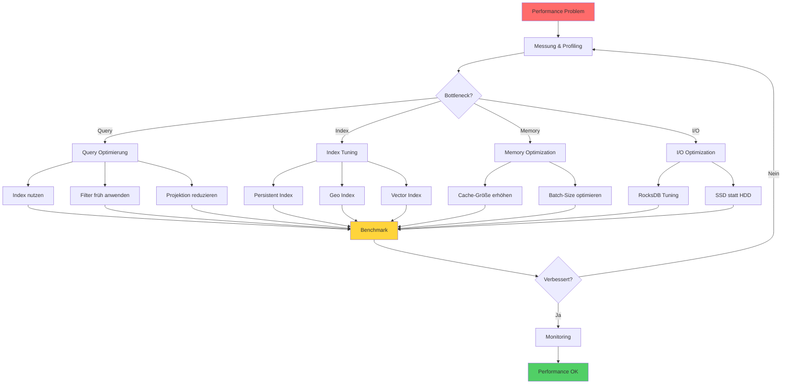

# Performance Tuning

## Übersicht

Dieses Kapitel behandelt Performance-Optimierungen für ThemisDB.

### Hauptthemen

- Query-Optimierung
- Index-Tuning
- Cache-Strategien
- Metriken und Benchmarking

## Weitere Informationen

Siehe auch: [Query Optimierung](chapter_34_query_optimization.md), [Monitoring](chapter_19_monitoring.md)
