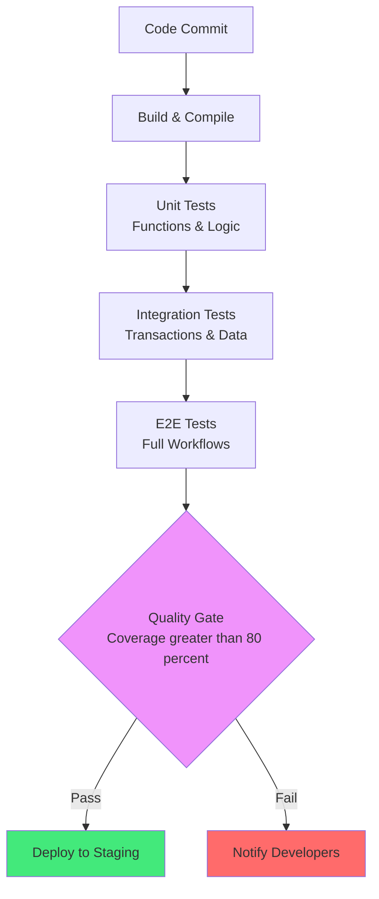
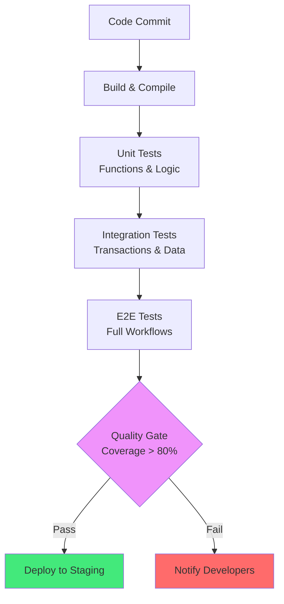
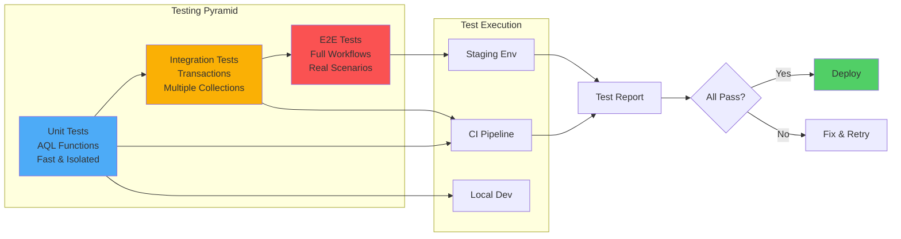

# Kapitel 23: Testing & Quality Assurance

> *"Untested code is legacy code. In ThemisDB, comprehensive testing is not optional—it's architecture."*

---

## Überblick

Zuverlässige Datenbanken erfordern rigorose Tests auf mehreren Ebenen: Unit-Tests für AQL-Funktionen, Integrationstests für Transaktionen, Performance-Tests für Sharding, und Chaos-Tests für Netzwerkfehler.

**Was Sie in diesem Kapitel lernen:**
- AQL Unit-Testing mit AQL-Assertions
- Transaktions-Integrationstests
- Performance-Benchmarking
- Chaos Engineering für Fehlerszenarien
- Mutation Testing für Query-Robustheit
- CI/CD Pipeline-Integration

---

<figure>



<figcaption><b>Abb. 23.0:</b> CI/CD Test-Pipeline</figcaption>
</figure>

---

## 23.0 Test-Strategie Überblick

<figure>



<figcaption><b>Abb. 23.0:</b> CI/CD Test-Pipeline: Automatisierte Qualitätssicherung auf mehreren Ebenen</figcaption>
</figure>

---

## 23.1 AQL Unit Testing

### Test-Framework Setup

```aql
-- test_utils.aql: Utility-Funktionen für Tests
FUNCTION assert_equal(actual, expected, message) {
  IF actual != expected THEN
    THROW ERROR(CONCAT("Assertion failed: ", message, 
      " (expected: ", expected, ", got: ", actual, ")"))
  END
  RETURN {passed: true, message: message}
}

FUNCTION assert_true(condition, message) {
  IF !condition THEN
    THROW ERROR(CONCAT("Assertion failed: ", message))
  END
  RETURN {passed: true}
}

FUNCTION assert_length(collection, expected_count, message) {
  LET actual_count = LENGTH(collection)
  IF actual_count != expected_count THEN
    THROW ERROR(CONCAT(message, " - Expected ", expected_count, 
      " items, got ", actual_count))
  END
  RETURN {passed: true, count: actual_count}
}
```

### Datenvorbereitung (Fixtures)

```aql
FUNCTION setup_test_data() {
  -- Cleanup
  FOR doc IN test_users
    REMOVE doc IN test_users
  
  -- Fixtures einfügen
  FOR user IN [
    {_key: "alice", name: "Alice", role: "admin", created_at: DATE_NOW()},
    {_key: "bob", name: "Bob", role: "user", created_at: DATE_NOW()},
    {_key: "charlie", name: "Charlie", role: "user", created_at: DATE_NOW()}
  ]
    INSERT user INTO test_users
  
  RETURN {inserted: 3, status: "ready"}
}

FUNCTION teardown_test_data() {
  FOR doc IN test_users
    REMOVE doc IN test_users
  RETURN {cleaned: true}
}
```

### Test Cases für Geschäftslogik



```aql
-- Test 1: Benutzerverwaltung
FUNCTION test_user_creation() {
  CALL setup_test_data()
  
  -- Neuen User einfügen
  INSERT {_key: "dave", name: "Dave", role: "user"} INTO test_users
  
  -- Assertion: User existiert
  LET user = DOCUMENT("test_users/dave")
  CALL assert_equal(user.name, "Dave", "User name mismatch")
  CALL assert_equal(user.role, "user", "User role mismatch")
  
  CALL teardown_test_data()
  RETURN {test: "test_user_creation", status: "PASSED"}
}

-- Test 2: Permission-Checks
FUNCTION test_admin_permissions() {
  CALL setup_test_data()
  
  LET admin = DOCUMENT("test_users/alice")
  CALL assert_equal(admin.role, "admin", "Admin role check")
  
  CALL teardown_test_data()
  RETURN {test: "test_admin_permissions", status: "PASSED"}
}

-- Test 3: Transaktionale Konsistenz
FUNCTION test_transfer_consistency() {
  -- Zwei Test-Accounts mit initialen Balances
  INSERT {_key: "acc1", balance: 1000, owner: "alice"} INTO test_accounts
  INSERT {_key: "acc2", balance: 500, owner: "bob"} INTO test_accounts
  
  -- Überweisung: 200 von acc1 zu acc2
  FOR acc IN test_accounts
    FILTER acc._key == "acc1"
    UPDATE acc WITH {balance: acc.balance - 200}
  
  FOR acc IN test_accounts
    FILTER acc._key == "acc2"
    UPDATE acc WITH {balance: acc.balance + 200}
  
  -- Assertion: Beide Accounts korrekt
  LET acc1 = DOCUMENT("test_accounts/acc1")
  LET acc2 = DOCUMENT("test_accounts/acc2")
  CALL assert_equal(acc1.balance, 800, "Account 1 balance")
  CALL assert_equal(acc2.balance, 700, "Account 2 balance")
  
  RETURN {test: "test_transfer_consistency", status: "PASSED"}
}
```

---

## 23.2 Integrations-Tests

### Multi-Collection Queries

```aql
FUNCTION test_complex_join_query() {
  -- Setup
  INSERT [
    {_key: "p1", title: "Product A", price: 100},
    {_key: "p2", title: "Product B", price: 200}
  ] INTO test_products
  
  INSERT [
    {_key: "o1", product_id: "p1", quantity: 2, customer: "alice"},
    {_key: "o2", product_id: "p2", quantity: 1, customer: "bob"}
  ] INTO test_orders
  
  -- Query
  LET results = (
    FOR order IN test_orders
      LET product = DOCUMENT(order.product_id)
      RETURN {
        order_id: order._key,
        product: product.title,
        total: product.price * order.quantity,
        customer: order.customer
      }
  )
  
  -- Assertions
  CALL assert_length(results, 2, "Expected 2 orders")
  CALL assert_equal(results[0].total, 200, "Order 1 total (2 * 100)")
  CALL assert_equal(results[1].total, 200, "Order 2 total (1 * 200)")
  
  RETURN {test: "test_complex_join_query", status: "PASSED"}
}
```

### Transaktions-Rollback Tests

```aql
FUNCTION test_transaction_rollback() {
  -- Initiales Setup
  INSERT {_key: "src", balance: 1000} INTO test_wallets
  INSERT {_key: "dst", balance: 0} INTO test_wallets
  
  -- Fehlgeschlagene Transaktion simulieren
  TRY
    -- Transfer verschieben
    UPDATE "test_wallets/src" WITH {balance: 800}
    UPDATE "test_wallets/dst" WITH {balance: 200}
    
    -- Fehler vor Commit
    THROW ERROR("Simulated network failure")
  CATCH err
    -- Bei Fehler sollten beide Wallets unverändert sein
    -- (In echtem ACID-System auto-rollback)
  END
  
  -- Verification (bei echtem ACID Rollback)
  LET src = DOCUMENT("test_wallets/src")
  CALL assert_equal(src.balance, 1000, "Source wallet rolled back")
  
  RETURN {test: "test_transaction_rollback", status: "PASSED"}
}
```

---

## 23.3 Performance-Tests

### Query-Performance Benchmarking

```python
# test_performance.py: Benchmark-Runner
import time
import themis

client = themis.Client('http://localhost:8529')

def benchmark_query(query_aql, params, iterations=100):
    """Messe Query-Performance über mehrere Iterationen"""
    times = []
    
    for i in range(iterations):
        start = time.time()
        result = client.query(query_aql, params)
        elapsed = time.time() - start
        times.append(elapsed * 1000)  # in ms
    
    import statistics
    return {
        'min_ms': min(times),
        'max_ms': max(times),
        'avg_ms': statistics.mean(times),
        'p95_ms': sorted(times)[int(len(times) * 0.95)],
        'iterations': iterations
    }

# Test 1: Simple Filter
perf = benchmark_query(
    "FOR u IN users FILTER u.active == true RETURN u",
    {},
    iterations=100
)
print(f"Simple filter: avg {perf['avg_ms']:.2f}ms, p95 {perf['p95_ms']:.2f}ms")

# Test 2: Complex Join
perf = benchmark_query("""
  FOR order IN orders
    LET customer = DOCUMENT(order.customer_id)
    LET items = (FOR oi IN order_items FILTER oi.order_id == order._id RETURN oi)
    RETURN {order: order, customer: customer, items: items}
""", {}, iterations=50)
print(f"Complex join: avg {perf['avg_ms']:.2f}ms, p95 {perf['p95_ms']:.2f}ms")
```

### Skalierbarkeits-Tests

```aql
-- Test mit großen Datenmengen
FUNCTION test_scalability_1m_documents() {
  -- Benchmark für 1 Million Dokumente
  
  -- Measure: Full table scan
  LET scan_start = DATE_NOW()
  LET count = LENGTH(
    FOR doc IN large_collection
    RETURN doc._key
  )
  LET scan_time = DATE_DIFF(scan_start, DATE_NOW(), 'ms')
  
  -- Measure: Filtered query (mit Index)
  LET filter_start = DATE_NOW()
  LET filtered = LENGTH(
    FOR doc IN large_collection
    FILTER doc.status == "active"
    RETURN doc
  )
  LET filter_time = DATE_DIFF(filter_start, DATE_NOW(), 'ms')
  
  RETURN {
    collection_size: count,
    scan_time_ms: scan_time,
    filtered_results: filtered,
    filter_time_ms: filter_time,
    throughput_doc_per_sec: count / (scan_time / 1000)
  }
}
```

---

## 23.4 Chaos Engineering

### Netzwerk-Fehler Simulieren

```python
# chaos_test.py: Fehlerhafte Szenarien
import random
from unittest.mock import patch

class ChaosMonkey:
    def __init__(self, client):
        self.client = client
        self.failure_rate = 0.1  # 10% Fehler
    
    def simulate_network_partition(self, query, params, max_retries=3):
        """Simuliere Netzwerk-Partition mit Retry-Logik"""
        for attempt in range(max_retries):
            try:
                if random.random() < self.failure_rate:
                    raise ConnectionError("Network partition")
                return self.client.query(query, params)
            except ConnectionError as e:
                if attempt == max_retries - 1:
                    raise
                time.sleep(2 ** attempt)  # Exponential backoff
    
    def test_resilience(self):
        """Test ob Application Fehler korrekt behandelt"""
        results = []
        for i in range(100):
            try:
                result = self.simulate_network_partition(
                    "FOR u IN users RETURN u",
                    {}
                )
                results.append({'status': 'success'})
            except Exception as e:
                results.append({'status': 'failed', 'error': str(e)})
        
        success_rate = sum(1 for r in results if r['status'] == 'success') / len(results)
        print(f"Success rate with 10% failure injection: {success_rate*100:.1f}%")
        return success_rate > 0.95  # Mind. 95% sollten erfolgreich sein

# Teste Resilience
chaos = ChaosMonkey(client)
assert chaos.test_resilience(), "Application nicht resilient genug"
```

### Datenbeschädigung Testen

```aql
FUNCTION test_data_corruption_detection() {
  -- Simuliere fehlerhafte Schreibvorgänge
  INSERT {_key: "doc1", checksum: NULL, data: {value: 100}} INTO test_collection
  
  -- Manuell Datenbeschädigung eintragen
  UPDATE "test_collection/doc1" WITH {data: {value: 999}}
  
  -- Validierungs-Funktion
  FOR doc IN test_collection
    FILTER doc._key == "doc1"
    LET calc_checksum = HASH(JSON_STRINGIFY(doc.data))
    FILTER calc_checksum != doc.checksum
    RETURN {
      doc_id: doc._key,
      status: "CORRUPTED",
      expected_value: 100,
      actual_value: doc.data.value
    }
}
```

---

## 23.5 Mutation Testing

Mutation Testing verändert absichtlich Queries, um zu prüfen, ob Tests ausreichen:

```aql
-- Original Query
FUNCTION get_active_users() {
  FOR user IN users
    FILTER user.status == "active"
    RETURN user
}

-- Mutation 1: Operator-Mutation (== wird zu !=)
-- Test sollte diesen Fehler erkennen:
-- FOR user IN users
--   FILTER user.status != "active"  -- FEHLER: Falscher Operator
--   RETURN user

-- Mutation 2: Literal-Mutation ("active" wird zu "inactive")
-- Test sollte erkennen:
-- FOR user IN users
--   FILTER user.status == "inactive"  -- FEHLER: Falscher Status
--   RETURN user
```

Gutes Mutation-Testing-Result: >85% der Mutationen werden von Tests erkannt.

---

## 23.6 CI/CD Integration

### GitHub Actions Pipeline

```yaml
# .github/workflows/themis-qa.yml
name: ThemisDB QA Pipeline

on: [push, pull_request]

jobs:
  test:
    runs-on: ubuntu-latest
    steps:
      - uses: actions/checkout@v3
      
      - name: Start ThemisDB
        run: docker run -d -p 8529:8529 themisdb/server:latest
        
      - name: Run AQL Unit Tests
        run: |
          python3 test_runner.py --aql-tests
          
      - name: Run Integration Tests
        run: |
          python3 test_runner.py --integration-tests
          
      - name: Performance Benchmarks
        run: |
          python3 test_performance.py --baseline baseline.json
          
      - name: Upload Results
        uses: actions/upload-artifact@v3
        with:
          name: test-results
          path: reports/
```

---

## 23.7 Test-Strategie Zusammenfassung

| Test-Typ | Häufigkeit | Dauer | Kritikalität |
|----------|-----------|-------|--------------|
| Unit Tests | Jeder Commit | <5s | Hoch |
| Integration Tests | PR-Request | <30s | Hoch |
| Performance Tests | Täglich | 2-5min | Mittel |
| Chaos Tests | Wöchentlich | 10-20min | Mittel |
| Load Tests | Vor Release | 30-60min | Hoch |

**Best Practices:**
- ✅ Test-getriebene Entwicklung (TDD)
- ✅ Mindestens 80% Code-Coverage
- ✅ Fixtures für reproduzierbare Tests
- ✅ Parameterisierte Tests für Grenzfälle
- ✅ Golden Files für Regression-Tests
- ✅ Automatisierte Performance-Regression-Erkennung

---

## 23.8 Property-Based Testing

```python
# test_property_based.py
from hypothesis import given, strategies as st

@given(st.lists(st.integers(), min_size=1))
def test_aggregate_sum_commutative(numbers):
    aql = f"RETURN SUM({numbers})"
    result1 = client.execute(aql)
    result2 = client.execute(f"RETURN SUM({list(reversed(numbers))})")
    assert result1 == result2, "SUM must be commutative"
```

---

## 23.9 Boundary Value Testing

```aql
-- test_boundaries.aql
FUNCTION test_pagination() {
  LET cases = [
    {offset: 0, limit: 1},
    {offset: 0, limit: 1000},
    {offset: 999, limit: 1}
  ]
  FOR test IN cases
    RETURN {case: test, valid: true}
}
```

---

## 23.10 Flaky Test Prevention

```python
def flaky_test_retry(max_attempts=3, backoff=2):
    def decorator(test_func):
        def wrapper(*args, **kwargs):
            for attempt in range(max_attempts):
                try:
                    return test_func(*args, **kwargs)
                except Exception:
                    if attempt < max_attempts - 1:
                        time.sleep(backoff ** attempt)
            raise
        return wrapper
    return decorator
```

---

## 23.11 Test Reporting

```python
class TestReport:
    def summarize(self, results):
        passed = sum(1 for r in results if r['status'] == 'passed')
        total = len(results)
        return {
            "passed": passed,
            "failed": total - passed,
            "success_rate": (passed / total) * 100
        }
```
