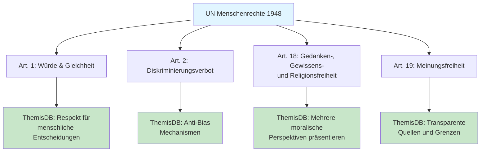
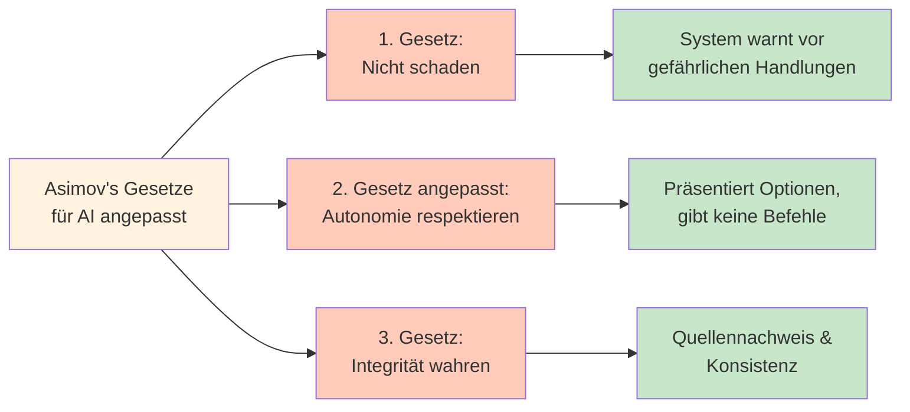
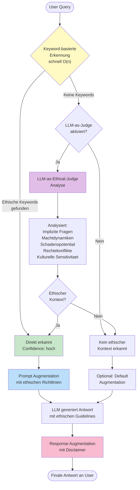
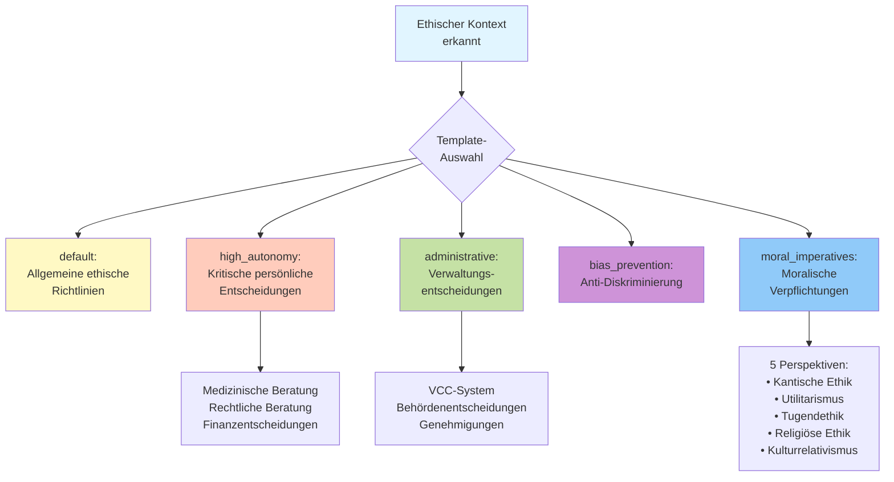
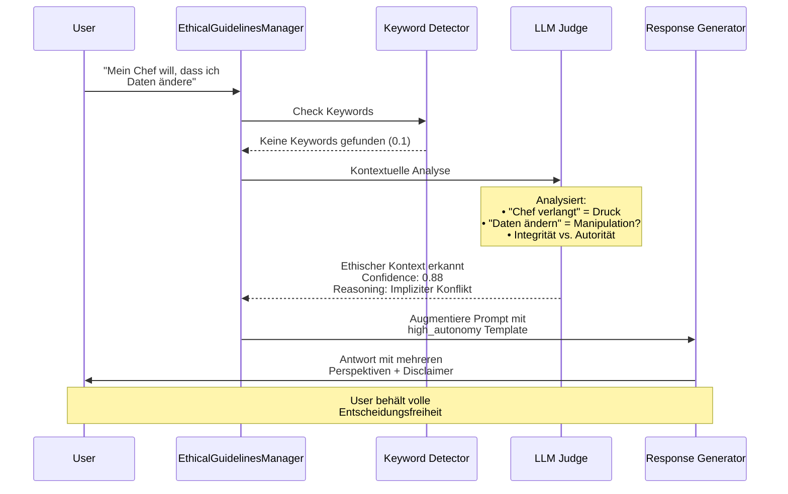
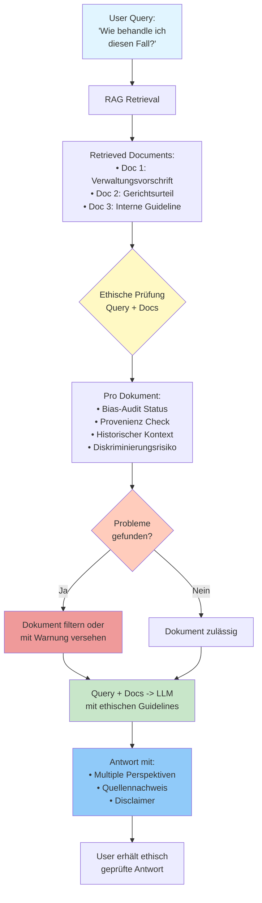
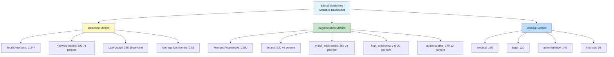
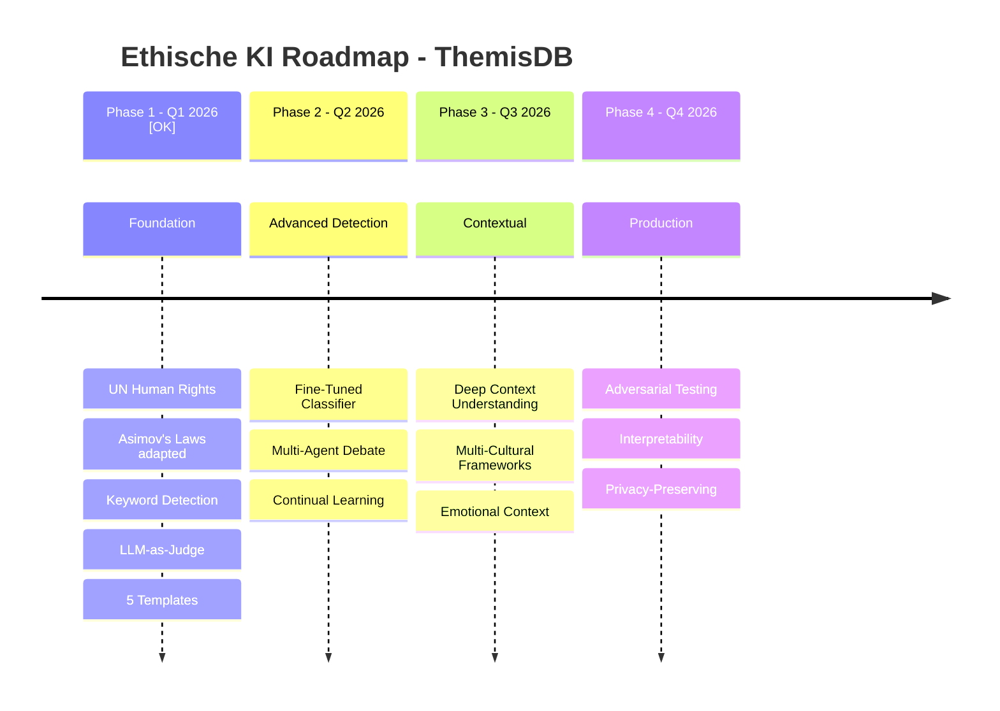

# Kapitel 24: KI-Ethik und Governance

**Autor:** ThemisDB Team  
**Reviewer:** TBD  
**Status:** Draft  
**Letzte Aktualisierung:** 09. Januar 2026  
**Version:** 1.1.0

---

## Lernziele

Nach dem Durcharbeiten dieses Kapitels sollten Sie:

- [x] Die ethischen Herausforderungen von KI-Systemen in der öffentlichen Verwaltung verstehen
- [x] Spezifische Risiken entlang der VCC-Architektur (Covina, Clara, Veritas) identifizieren können
- [x] "Ethik-by-Design"-Prinzipien auf datenbankgestützte KI-Systeme anwenden können
- [x] Das Ethische Richtlinien System (UN Human Rights + Asimov's Laws) verstehen und konfigurieren können
- [x] LLM-as-ethical-judge Pattern für kontextuelle Erkennung implementieren können
- [x] Governance-Mechanismen zur Risikominimierung implementieren können

---

## Voraussetzungen

Dieses Kapitel setzt Kenntnisse aus folgenden Kapiteln voraus:

- **Kapitel 10**: Enterprise Applications - Security & Compliance Grundlagen
- **Kapitel 17**: LLM Integration - RAG-Architektur und Pre-Filtering

---

## Überblick

Die Einführung eines KI-Ökosystems wie **VCC (Veritas, Covina, Clara)** in der öffentlichen Verwaltung wirft tiefgreifende ethische Fragen auf, die über die reine Rechtskonformität (DSGVO, EU AI Act) hinausgehen [9]. Der Kern des ethischen Spannungsfelds liegt im Auftrag der Verwaltung: Sie muss nicht nur "richtig" im Sinne von effizient und faktisch korrekt handeln, sondern auch "gerecht" im Sinne von fair, unvoreingenommen und der Rechtsstaatlichkeit verpflichtet sein.

**In diesem Kapitel behandeln wir:**
1. Ethische Herausforderungen in verwaltungs-KI
2. Architektonische Risikoquellen (Covina, Clara, Veritas)
3. Bias-Audits und Datenqualität
4. Human-in-the-Loop und Automation Bias
5. **Ethische Richtlinien System (PR #305)** - UN Human Rights + Asimov's Laws
6. Governance-Framework und Ethik-by-Design
7. Praktische Implementierung in ThemisDB

---

## 24.1 Der Ethische Imperativ für Verwaltungs-KI

### 24.1.1 Unterschied zu kommerzieller KI

Während kommerzielle KI-Systeme primär auf Effizienz und Profitabilität optimiert sind, tragen Verwaltungs-KI-Systeme eine fundamental andere Verantwortung [9]:

**Kommerzielle KI:**
- Ziel: Geschäftserfolg, Kundenzufriedenheit
- Fehlertoleranz: Wirtschaftlicher Schaden, Reputation
- Kontrolle: Marktmechanismen, Wettbewerb

**Verwaltungs-KI:**
- Ziel: Rechtsstaatlichkeit, Gerechtigkeit, Gemeinwohl
- Fehlertoleranz: Grundrechtsverletzungen, Vertrauensverlust in Staat
- Kontrolle: Demokratische Legitimation, Rechtsaufsicht

> **Wichtig:** Ein Fehler in einem Verwaltungsakt (z.B. falsche Ablehnung einer BImSchG-Genehmigung) kann existenzielle Folgen für Bürger oder Unternehmen haben. Die Entscheidung muss nicht nur "wahrscheinlich richtig", sondern *nachweisbar korrekt* und *ethisch vertretbar* sein.

### 24.1.2 Digitale Souveränität und ethische Verantwortung

Die Entscheidung für einen On-Premise-Betrieb (wie bei ThemisDB) sichert zwar die Datensouveränität, verlagert aber die ethische Verantwortung für den gesamten Datenlebenszyklus vollständig in den Hoheitsbereich der Verwaltung [9].

**Konsequenzen:**
- Keine Ausrede "Der Cloud-Provider war schuld"
- Volle Kontrolle = Volle Verantwortung
- Notwendigkeit interner Expertise und Governance

---

## 24.2 Architektonische Risikoquellen im VCC-Ökosystem

Die Analyse identifiziert drei zentrale Risiken entlang der VCC-Architektur [9]:

### 24.2.1 Covina (Ingestion-Engine): Das Tor zur Voreingenommenheit

**Funktion:** Covina verarbeitet und indiziert Verwaltungsdokumente in die Wissensbasis.

**Ethisches Risiko:** Verfestigung von Vorurteilen durch historische Dokumente [9].

Das Prinzip "Garbage In, Garbage Out" wird hier zu **"Garbage In, Gospel Out"** [9]. Wenn die von Covina verarbeiteten Dokumente (z.B. alte Verwaltungsvorschriften, Gerichtsurteile) historische oder systemische Vorurteile enthalten, wird das KI-System diese Vorurteile nicht nur reproduzieren, sondern sie mit der Autorität einer scheinbar objektiven Maschine verstärken.

**Konkretes Beispiel:**
```python
# Problematischer Fall: Historische Voreingenommenheit
dokument = {
    "titel": "Bearbeitungsrichtlinie Bauanträge 1985",
    "inhalt": "Bei Anträgen von Antragstellern mit nicht-deutschen Namen 
               ist besondere Sorgfalt bei der Prüfung geboten..."
}

# Covina indiziert dies in RAG-Datenbank
# Clara lernt: nicht-deutsche Namen = höheres Risiko = strengere Prüfung
# Veritas gibt diese "gelernte" Regel an Sachbearbeiter weiter
# ⚠️ Resultat: Systematische Benachteiligung wird automatisiert
```

**ThemisDB-spezifische Gefahr:**
- Atomare ACID-Transaktionen garantieren *technische* Konsistenz
- Sie garantieren NICHT *inhaltliche* oder *ethische* Korrektheit
- Ein fehlerhaftes Dokument wird konsistent über alle Index-Layer repliziert

**Mitigationsstrategien:**

1. **Proaktive Bias-Audits vor Ingestion** [9]:
```python
def audit_document_for_bias(doc: Document) -> BiasReport:
    """
    Scannt Dokument auf potenzielle Vorurteile vor Covina-Ingestion.
    """
    bias_patterns = [
        r"Antragsteller.*nicht-deutsch.*besondere Sorgfalt",
        r"Geschlecht.*erhöhtes Risiko",
        r"Alter.*über \d+.*automatisch ablehnen"
    ]
    
    detected_biases = []
    for pattern in bias_patterns:
        if re.search(pattern, doc.content, re.IGNORECASE):
            detected_biases.append({
                "pattern": pattern,
                "location": "...",  # Kontext
                "severity": "HIGH"
            })
    
    return BiasReport(
        document_id=doc.id,
        timestamp=datetime.now(),
        biases_found=detected_biases,
        recommendation="BLOCK" if detected_biases else "APPROVE"
    )
```

2. **Dokumenten-Provenienz-Tracking**:
```sql
-- ThemisDB: Metadaten für ethische Nachverfolgbarkeit
INSERT INTO documents (id, content, metadata) VALUES (
    'doc_123',
    @content,
    {
        "source": "Archiv Brandenburg",
        "original_date": "1985-03-15",
        "bias_audit_status": "REVIEWED",
        "bias_audit_date": "2025-12-01",
        "bias_findings": ["HISTORICAL_DISCRIMINATION"],
        "usage_restriction": "CONTEXT_ONLY_NO_TRAINING"
    }
);
```

3. **Temporale Contextualisierung**:
   - Markierung historischer Dokumente mit Zeitstempel
   - Abwertung alter Dokumente im Ranking
   - Explizite Warnung bei Verwendung

---

### 24.2.2 Clara (Modellverbesserungs-Kreislauf): Permanente Intelligenz-Korruption

**Funktion:** Clara verbessert KI-Modelle durch Nutzerfeedback (LoRA-Adapter, Fine-Tuning).

**Ethisches Risiko:** Kaskadierende Integritätskompromittierung durch fehlerhaftes Feedback [9].

**Szenario "Gelernte Lüge":**

1. **Initiale Fehlinformation:** Sachbearbeiter A gibt falsches Feedback:
   ```json
   {
     "query": "Abstandsregeln BImSchG für Windkraftanlagen",
     "answer": "Mindestabstand 2000m zu Wohngebieten",
     "feedback": "CORRECT",
     "user": "sachbearbeiter_a"
   }
   ```
   (Tatsächlich: Regelung ist komplexer, pauschal falsch)

2. **Clara lernt:** LoRA-Adapter wird mit diesem Feedback trainiert
3. **Propagierung:** System gibt nun selbstbewusst falsche Auskunft
4. **Kaskadierende Verstärkung:** Weitere Nutzer vertrauen der KI, geben ebenfalls "CORRECT"-Feedback
5. **Permanente Kodierung:** Fehler wird in Model-Weights "eingebrannt"

**Architektonisches Problem:**
```cpp
// Clara's Feedback-Loop (vereinfacht)
void Clara::ProcessFeedback(const UserFeedback& feedback) {
    if (feedback.rating == "CORRECT") {
        // ⚠️ KEINE VALIDIERUNG ob Feedback faktisch korrekt ist
        lora_adapter_.UpdateWeights(feedback.query, feedback.answer);
        
        // Atomic Transaction garantiert nur ACID, nicht Wahrheit
        db_->BeginTransaction();
        db_->StoreFeedback(feedback);
        db_->UpdateModelVersion(lora_adapter_.version());
        db_->Commit();  // Fehler ist nun "consistent" gespeichert
    }
}
```

**Zusätzliches Risiko: Echokammer-Effekt** [9]
- Nur Mehrheitsmeinungen trainieren das System
- Minderheitenpositionen werden unterdrückt
- Pluralismus der Rechtsmeinungen geht verloren

**Mitigationsstrategien:**

1. **Experten-Review vor Model-Update** [9]:
```python
class FeedbackValidator:
    def __init__(self, expert_threshold: int = 2):
        self.expert_threshold = expert_threshold
        self.pending_feedback = {}
    
    def validate_feedback(self, feedback: Feedback) -> ValidationResult:
        """
        Feedback wird erst nach Expert-Review in Model übernommen.
        """
        key = (feedback.query_hash, feedback.answer_hash)
        
        if key not in self.pending_feedback:
            self.pending_feedback[key] = {
                "feedback": feedback,
                "expert_approvals": 0,
                "expert_rejections": 0
            }
            return ValidationResult.PENDING
        
        # Experten-Konsens erforderlich
        if self.pending_feedback[key]["expert_approvals"] >= self.expert_threshold:
            return ValidationResult.APPROVED
        
        return ValidationResult.PENDING
```

2. **Stichprobenbasierte ethische Audits** [9]:
```sql
-- ThemisDB: Query für ethisch problematische Feedback-Patterns
SELECT 
    f.query,
    f.answer,
    COUNT(*) as feedback_count,
    AVG(CASE WHEN f.rating = 'CORRECT' THEN 1 ELSE 0 END) as approval_rate,
    STRING_AGG(f.user_id, ',') as users
FROM feedback f
WHERE f.timestamp > NOW() - INTERVAL '7 days'
GROUP BY f.query, f.answer
HAVING approval_rate > 0.9 AND feedback_count < 5
-- ⚠️ Verdächtig: Hohe Zustimmung bei wenig Feedback = Echokammer?
ORDER BY approval_rate DESC;
```

3. **Niemals vollständig autonomes Lernen** [9]:
   - Clara-Updates nur in Staging-Umgebung
   - A/B-Testing gegen Baseline-Modell
   - Human-in-the-Loop bei kritischen Rechtsgebieten

---

### 24.2.3 Veritas (Benutzerinteraktion): Erosion der Urteilskraft

**Funktion:** Veritas ist die Chat-Schnittstelle für Sachbearbeiter.

**Ethisches Risiko:** Automation Bias und Verantwortungsdiffusion [9].

**Automation Bias:** Die menschliche Tendenz, Ergebnissen automatisierter Systeme übermäßig und unkritisch zu vertrauen [9].

**Konkretes Szenario:**
```
Sachbearbeiter: "Genehmigungsfähigkeit BImSchG-Antrag 
                  Windkraftanlage Havelland?"

Veritas (KI):   "✅ Genehmigungsfähig. 
                 Gemäß §5 BImSchG erfüllt der Antrag alle Voraussetzungen.
                 
                 📚 Quellen:
                 - BImSchG §5 Abs. 1 [Gesetz]
                 - VwV Havelland 2024 [Verwaltungsvorschrift]
                 - Gutachten Lärmschutz [Dokument #4521]"

Sachbearbeiter: "Klingt gut, übernehme ich so."
                [KLICKT "GENEHMIGEN" OHNE WEITERE PRÜFUNG]
```

**Warum problematisch?**
- KI wirkt durch Quellen autoritativ
- Sachbearbeiter delegiert kritisches Denken an Maschine
- Bei Fehler: "Die KI hat das so gesagt" → Verantwortungsdiffusion

**ThemisDB kann das Problem NICHT lösen:**
```cpp
// ThemisDB garantiert nur, dass Veritas konsistente Daten liefert
auto answer = veritas_->Query("BImSchG Windkraft");

// ✅ ACID garantiert: Alle Quellen in answer sind transaktional korrekt
// ❌ NICHT garantiert: Die INTERPRETATION ist rechtlich korrekt
// ❌ NICHT garantiert: Sachbearbeiter hinterfragt das Ergebnis
```

**Mitigationsstrategien:**

1. **Explizite Unsicherheits-Kennzeichnung:**
```python
class VeritasResponse:
    def __init__(self, answer: str, confidence: float, sources: List[Source]):
        self.answer = answer
        self.confidence = confidence  # 0.0 - 1.0
        self.sources = sources
    
    def to_ui(self) -> str:
        """
        Zeigt Unsicherheit transparent an.
        """
        confidence_label = {
            (0.9, 1.0): "🟢 SEHR SICHER",
            (0.7, 0.9): "🟡 MITTEL SICHER", 
            (0.0, 0.7): "🔴 UNSICHER - EXPERTENKONSULTATION EMPFOHLEN"
        }
        
        for (low, high), label in confidence_label.items():
            if low <= self.confidence < high:
                return f"""
                {label} (Konfidenz: {self.confidence:.2%})
                
                {self.answer}
                
                ⚠️ HINWEIS: Dies ist eine KI-generierte Empfehlung.
                Bitte prüfen Sie die Quellen kritisch und konsultieren Sie
                bei Unsicherheit einen Rechtsexperten.
                """
```

2. **Mandatory Second-Opinion bei kritischen Entscheidungen:**
```python
CRITICAL_DECISION_TYPES = [
    "GENEHMIGUNG_ERTEILEN",
    "GENEHMIGUNG_ABLEHNEN",
    "WIDERSPRUCH_ZURÜCKWEISEN"
]

def require_second_opinion(decision_type: str, 
                          ai_recommendation: VeritasResponse) -> bool:
    """
    Erzwingt menschliche Zweitprüfung bei kritischen Entscheidungen.
    """
    if decision_type in CRITICAL_DECISION_TYPES:
        if ai_recommendation.confidence < 0.95:
            return True  # Mandatory review
    
    return False
```

3. **AI Literacy Training** [9]:
   - Schulungsprogramm für alle Sachbearbeiter
   - Erkennung von Automation Bias
   - Kritisches Hinterfragen von KI-Ausgaben
   - Verständnis für KI-Limitationen

**Checkliste für Sachbearbeiter:**
```markdown
# 🧠 Kritische KI-Nutzung - Checkliste

Bevor Sie eine KI-Empfehlung übernehmen:

- [ ] Habe ich die angegebenen Quellen SELBST geprüft?
- [ ] Widersprechen Quellen einander? (KI erkennt das oft nicht)
- [ ] Ist die Rechtslage eindeutig oder gibt es Interpretationsspielraum?
- [ ] Würde ich diese Entscheidung auch OHNE KI so treffen?
- [ ] Habe ich bei Unsicherheit einen Experten konsultiert?
- [ ] Ist die Begründung MEINE eigene oder nur KI-Paraphrase?

⚠️ Bei NEIN zu einer Frage: STOPP und manuelle Prüfung!
```

---

## 24.3 Governance-Framework: Ethik-by-Design

Die abgeleiteten Handlungsempfehlungen sind konkrete technische und organisatorische Anforderungen [9]:

### 24.3.1 Interdisziplinäres KI-Ethik-Gremium

**Zusammensetzung:**
- Juristen (Verwaltungsrecht, Datenschutz)
- Informatiker (KI, Datenbanken)
- Ethiker (Moralphilosophie)
- Praktiker (Sachbearbeiter mit Felderfahrung)
- Bürgervertreter (Zivilgesellschaft)

**Aufgaben:**
1. **Kontinuierliche Ethik-Audits:**
   ```sql
   -- ThemisDB: Ethik-Audit-Log
   CREATE TABLE ethics_audits (
       id UUID PRIMARY KEY,
       audit_date TIMESTAMP,
       component TEXT,  -- 'covina', 'clara', 'veritas'
       findings TEXT[],
       risk_level TEXT,  -- 'LOW', 'MEDIUM', 'HIGH', 'CRITICAL'
       action_required TEXT,
       resolved BOOLEAN DEFAULT FALSE
   );
   ```

2. **Entscheidung über kritische Fälle:**
   - Eskalation bei Automation-Bias-Verdacht
   - Review strittiger Clara-Feedbacks
   - Freigabe neuer Datenquellen für Covina

3. **Policy-Entwicklung:**
   - Wann ist KI-Nutzung erlaubt/verboten?
   - Welche Entscheidungen bleiben immer human?
   - Transparenzanforderungen gegenüber Bürgern

### 24.3.2 Bias-Audits für Datenquellen

**Proaktiver Ansatz** [9]:

```python
class CovinaBiasAuditor:
    def __init__(self, themis_db: ThemisDB):
        self.db = themis_db
        self.bias_patterns = self._load_bias_patterns()
    
    def audit_document_batch(self, documents: List[Document]) -> AuditReport:
        """
        Auditiert alle Dokumente vor Ingestion.
        """
        high_risk_docs = []
        
        for doc in documents:
            bias_score = self._calculate_bias_score(doc)
            
            if bias_score > 0.7:  # High risk threshold
                high_risk_docs.append({
                    "doc_id": doc.id,
                    "bias_score": bias_score,
                    "detected_patterns": self._extract_patterns(doc),
                    "recommendation": "MANUAL_REVIEW"
                })
                
                # Markierung in ThemisDB
                self.db.execute("""
                    UPDATE documents 
                    SET metadata = jsonb_set(
                        metadata, 
                        '{bias_audit}', 
                        '{"status": "FLAGGED", "score": :score}'::jsonb
                    )
                    WHERE id = :doc_id
                """, {"doc_id": doc.id, "score": bias_score})
        
        return AuditReport(
            total_documents=len(documents),
            flagged_documents=len(high_risk_docs),
            details=high_risk_docs
        )
```

**Integration in Covina-Pipeline:**
```cpp
// covina/ingestion_pipeline.cpp
class IngestionPipeline {
public:
    void IngestDocument(const Document& doc) {
        // SCHRITT 1: Bias-Audit VOR Ingestion
        auto audit_result = bias_auditor_->Audit(doc);
        
        if (audit_result.risk_level == RiskLevel::HIGH) {
            // Blockieren und zur manuellen Review
            ethics_queue_->Enqueue(doc, audit_result);
            LogWarning("Document {} flagged for ethics review", doc.id);
            return;  // ⛔ NICHT indizieren
        }
        
        // SCHRITT 2: Normale Ingestion (nur bei bestanden Audit)
        auto txn = db_->BeginTransaction();
        db_->InsertBaseEntity(doc.id, doc.content, doc.metadata);
        indexer_->IndexDocument(doc);  // Relational, Graph, Vector
        txn->Commit();
    }
private:
    BiasAuditor* bias_auditor_;
    EthicsReviewQueue* ethics_queue_;
};
```

### 24.3.3 Human-in-the-Loop Policy

**Principle:** Kritische Entscheidungen IMMER mit menschlicher Kontrolle [9].

**Klassifizierung von Entscheidungen:**

| Kategorie | Beispiel | KI-Rolle | Human-Rolle |
|-----------|----------|----------|-------------|
| **Routine** | Statusabfrage | ✅ Vollautomatisch | ℹ️ Info |
| **Standard** | Dokumentensuche | ✅ Vorschlag | 🔍 Plausibilitätsprüfung |
| **Komplex** | Genehmigungsempfehlung | 💡 Assistenz | ✅ Entscheidung |
| **Kritisch** | Ablehnungsbescheid | 🚫 Nur Hintergrunddaten | ✅ Volle Kontrolle |

**ThemisDB-Implementierung:**
```sql
-- Audit-Trail für Human-in-the-Loop
CREATE TABLE decision_audit (
    id UUID PRIMARY KEY,
    timestamp TIMESTAMP,
    decision_type TEXT,
    ai_recommendation JSONB,
    human_decision JSONB,
    human_rationale TEXT,  -- Warum wich Mensch von KI ab?
    override BOOLEAN,  -- TRUE wenn Mensch KI überstimmt
    user_id TEXT
);

-- Statistik: Wie oft wird KI überstimmt?
SELECT 
    decision_type,
    COUNT(*) as total_decisions,
    SUM(CASE WHEN override THEN 1 ELSE 0 END) as overrides,
    ROUND(100.0 * SUM(CASE WHEN override THEN 1 ELSE 0 END) / COUNT(*), 2) as override_rate_pct
FROM decision_audit
GROUP BY decision_type
ORDER BY override_rate_pct DESC;

-- ⚠️ Hohe Override-Rate = KI-Modell hat systematisches Problem
```

---

## 24.4 Praktische Implementierung in ThemisDB

### 24.4.1 Ethik-Metadaten-Schema

**Erweiterte Base Entity mit Ethik-Tracking:**

```json
{
  "_id": "doc_BImSchG_2024_123",
  "_type": "administrative_document",
  "content": {
    "title": "Verwaltungsvorschrift Windkraft Havelland",
    "text": "...",
    "legal_basis": ["BImSchG §5", "TA Lärm"]
  },
  "ethics_metadata": {
    "bias_audit": {
      "status": "PASSED",
      "audited_by": "bias_auditor_v2.1",
      "audit_date": "2025-12-01T10:00:00Z",
      "bias_score": 0.15,
      "flagged_patterns": []
    },
    "provenance": {
      "source": "Ministerium für Infrastruktur",
      "original_date": "2024-06-15",
      "historical_context": "MODERN_REGULATION",
      "reliability_score": 0.95
    },
    "usage_restrictions": {
      "allow_training": true,
      "allow_direct_citation": true,
      "require_human_review": false,
      "sensitivity_level": "PUBLIC"
    },
    "ethical_flags": {
      "contains_personal_data": false,
      "contains_protected_groups": false,
      "potential_discrimination_risk": "LOW"
    }
  }
}
```

### 24.4.2 Ethik-Compliance-Checks in AQL

**Query mit ethischen Constraints:**

```aql
// Suche nur ethisch unbedenkliche Dokumente
FOR doc IN documents
  // Standard-Filter
  FILTER doc.content.legal_basis ANY == "BImSchG §5"
  
  // ✅ ETHIK-FILTER
  FILTER doc.ethics_metadata.bias_audit.status == "PASSED"
  FILTER doc.ethics_metadata.bias_audit.bias_score < 0.3
  FILTER doc.ethics_metadata.usage_restrictions.allow_direct_citation == true
  
  // Falls historisches Dokument, nur mit Kontext
  FILTER doc.ethics_metadata.provenance.historical_context != "DISCRIMINATORY_ERA"
     OR doc.ethics_metadata.usage_restrictions.require_human_review == true
  
  LET similarity = COSINE(doc.embedding, @query_vector)
  FILTER similarity > 0.7
  
  // Rückgabe mit Ethik-Metadaten
  RETURN {
    doc: doc,
    similarity: similarity,
    ethics_status: doc.ethics_metadata.bias_audit.status,
    human_review_required: doc.ethics_metadata.usage_restrictions.require_human_review
  }
```

### 24.4.3 Automation-Bias-Warnsystem

**Echtzeit-Warnung bei verdächtigem Nutzerverhalten:**

```cpp
// veritas/automation_bias_detector.cpp
class AutomationBiasDetector {
public:
    void MonitorUserBehavior(const UserSession& session) {
        // Pattern: User akzeptiert KI-Vorschlag ohne Quellenprüfung
        if (session.ai_recommendation_shown &&
            session.sources_viewed.empty() &&
            session.decision_time_seconds < 10) {
            
            // ⚠️ WARNUNG: Potentieller Automation Bias
            SendWarning(session.user_id, 
                       "Sie haben eine KI-Empfehlung ohne Quellenprüfung übernommen. "
                       "Bitte validieren Sie die Quellen kritisch.");
            
            // Audit-Log
            db_->Execute(R"(
                INSERT INTO automation_bias_warnings (user_id, session_id, timestamp)
                VALUES (:user, :session, NOW())
            )", {{"user", session.user_id}, {"session", session.session_id}});
            
            // Bei Wiederholung: Mandatory Training
            if (GetWarningCount(session.user_id) > 3) {
                RequireAILiteracyTraining(session.user_id);
            }
        }
    }
};
```

---

## 24.5 Ethische Richtlinien System (Ethical Guidelines System)

**Eingeführt mit PR #305** zur Gewährleistung, dass ThemisDB KI **niemals den Menschen bevormundet** und **menschliche Autonomie respektiert**.

### 24.5.1 Grundlegende Prinzipien

Das Ethische Richtlinien System basiert auf zwei fundamentalen ethischen Rahmenwerken:

#### 1. Allgemeine Erklärung der Menschenrechte (UN, 1948)

<figure>



<figcaption><b>Abb. 24.1:</b> Ethical-Framework-Overview</figcaption>
</figure>

#### 2. Isaac Asimovs Robotergesetze (angepasst für KI)

<figure>



<figcaption><b>Abb. 24.2:</b> Bias-Detection-Pipeline</figcaption>
</figure>

**Kernunterschied zur klassischen Formulierung:**
- **Original 2. Gesetz:** "Ein Roboter muss den Befehlen von Menschen gehorchen..."
- **ThemisDB Anpassung:** "KI muss menschliche Autonomie respektieren und Entscheidungen **unterstützen** (nicht ersetzen)"

Diese Anpassung ist **fundamental**, da sie Bevormundung verhindert.

### 24.5.2 Systemarchitektur: Ethische Kontexterkennung

Das System nutzt einen **Hybrid-Ansatz** für die Erkennung ethischer Implikationen:

<figure>



<figcaption><b>Abb. 24.3:</b> Context-Recognition-Flow</figcaption>
</figure>

**Wissenschaftliche Grundlage:**
- **Keyword-Matching:** Schnell (O(n)), für explizite ethische Begriffe
- **LLM-as-Judge:** Basiert auf Zheng et al. (2023), "Judging LLM-as-a-Judge with MT-Bench and Chatbot Arena" (UC Berkeley)

### 24.5.3 Fünf Augmentations-Templates

Das System bietet **fünf spezialisierte Templates** für unterschiedliche ethische Kontexte:

<figure>



<figcaption><b>Abb. 24.4:</b> Augmentation-Templates-Matrix</figcaption>
</figure>

**Beispiel: moral_imperatives Template**

Wenn ein User fragt: "Was ist meine moralische Pflicht gegenüber meiner Familie?"

→ System erkennt Keywords: "moralische Pflicht" (Confidence: 0.85)
→ Wählt Template: `moral_imperatives`
→ Augmentierter Prompt enthält:

```yaml
═══════════════════════════════════════════════════════════
MORALISCHE IMPERATIVE ERKANNT

GRUNDLAGEN: 
- Menschenrechte Art. 18 - Gedanken-, Gewissens- und Religionsfreiheit
- Asimovs Zweites Gesetz (angepasst) - Respekt für menschliche Autonomie
═══════════════════════════════════════════════════════════

Moralische Imperative werden in verschiedenen ethischen Traditionen 
unterschiedlich verstanden:

1. KANTISCHE ETHIK: Handle nur nach derjenigen Maxime, durch die du 
   zugleich wollen kannst, dass sie ein allgemeines Gesetz werde...

2. UTILITARISMUS: Das größte Glück der größten Zahl...

3. TUGENDETHIK: Fokus auf Charaktereigenschaften wie Mut, Weisheit...

4. RELIGIÖSE ETHIK: Verschiedene religiöse Traditionen bieten...

5. KULTURRELATIVISMUS: Moralische Normen sind kulturabhängig...

IHRE ROLLE ALS KI (gemäß Asimov's Laws):
- Präsentiere VERSCHIEDENE moralphilosophische Perspektiven
- Respektiere die Gewissensfreiheit des Nutzers
- NIEMALS eine moralische Position als absolut wahr darstellen

VERBOTEN:
❌ "Sie müssen moralisch..."
❌ "Es ist Ihre Pflicht..."

ERLAUBT:
✅ "Verschiedene Traditionen sehen das so..."
✅ "Eine Perspektive wäre..."
```

### 24.5.4 LLM-as-Ethical-Judge: Kontextuelle Erkennung

**Problem:** Keyword-basierte Erkennung versagt bei **impliziten** ethischen Fragen.

**Beispiel:**
```
User: "Mein Chef verlangt von mir, diese Zahlen anzupassen."
```
→ Keine ethischen Keywords, aber **klare ethische Implikation** (Integrität, Manipulation)

**Lösung:** LLM-as-Ethical-Judge analysiert Kontext

<figure>



<figcaption><b>Abb. 24.5:</b> Ethical-Guardrails-Workflow</figcaption>
</figure>

**Code-Integration:**

```cpp
#include "llm/ethical_guidelines_manager.h"
#include "llm/llama_wrapper.h"

// LLM initialisieren
LlamaWrapper llm;
llm.loadModel("models/mistral-7b-instruct.gguf");

// Manager mit LLM-Judge
EthicalGuidelinesManager manager("config/ethical_guidelines.yaml");
manager.getConfig().use_llm_as_judge = true;

// Gesprächsverlauf für Kontext
std::vector<std::string> conversation = {
    "User: Ich arbeite in der Buchhaltung.",
    "Assistant: Wie kann ich Ihnen helfen?",
    "User: Mein Chef verlangt, Zahlen anzupassen."
};

// Kontextuelle Erkennung
auto result = manager.detectWithLLMJudge(
    "Sollte ich das tun?",  // Aktuelle Frage
    conversation,            // Kontext
    &llm                    // LLM für Analyse
);

if (result.has_ethical_context) {
    std::cout << "Ethische Implikation: " << result.llm_reasoning << std::endl;
    // Prompt wird automatisch mit ethischen Richtlinien augmentiert
}
```

### 24.5.5 RAG-Integration mit ethischer Analyse

**Herausforderung:** Auch **RAG-Dokumente** können ethisch problematische Inhalte enthalten.

<figure>



<figcaption><b>Abb. 24.6:</b> Privacy-Protection-Layers</figcaption>
</figure>

**Code-Beispiel:**

```cpp
// RAG-Integration
std::vector<std::string> retrieved_docs = rag_retriever.retrieve(query);

// Ethische Prüfung von Query + Dokumenten
auto rag_result = manager.detectEthicalContextInRAG(
    retrieved_docs,  // Alle RAG-Dokumente
    query,           // User-Query
    conversation     // Optional: Gesprächskontext
);

if (rag_result.has_ethical_context) {
    // Filtere oder markiere problematische Dokumente
    for (const auto& doc : retrieved_docs) {
        if (doc.ethics_metadata.bias_audit.status != "PASSED") {
            // Entferne oder warne
            LogWarning("Document {} flagged: {}", 
                      doc.id, doc.ethics_metadata.bias_findings);
        }
    }
}
```

### 24.5.6 Praktische Konfiguration

**Datei: `config/ethical_guidelines.yaml`**

```yaml
# Aktivierung
config:
  enabled: true
  detection_threshold: 0.6          # Keyword-basiert
  llm_judge_threshold: 0.7          # LLM-basiert
  
  # Hybrid-Ansatz (empfohlen)
  use_llm_as_judge: true            # Kontextuelle Analyse
  combine_with_keywords: true       # Kombiniert beide Methoden
  
  # Transparenz
  show_disclaimers: true            # Wichtig für Autonomie
  enable_logging: true              # Für Audits
  
  # Sprachen
  language_mode: "both"             # de, en, oder both
  
  # Standard-Augmentation
  always_apply_default: true        # Auch ohne Kontext-Erkennung

# Augmentation Templates
augmentations:
  default:
    system_prefix: |
      Sie sind ein hilfreicher KI-Assistent, der menschliche Autonomie 
      respektiert (Asimov's 2. Gesetz angepasst).
      
      GRUNDPRINZIPIEN:
      1. Präsentieren Sie Optionen, geben Sie keine Befehle
      2. Respektieren Sie Gedankenfreiheit (UN Menschenrechte Art. 18)
      3. Seien Sie transparent über Unsicherheiten
      4. Behandeln Sie alle Menschen gleich (Art. 2)
    
    response_suffix: |
      
      ⚠️ HINWEIS: Diese Informationen dienen zur Orientierung.
      Die Entscheidung liegt bei Ihnen.

  moral_imperatives:
    system_prefix: |
      ═══════════════════════════════════════════════════════════
      MORALISCHE IMPERATIVE ERKANNT
      
      GRUNDLAGEN: 
      - Menschenrechte Art. 18 - Gedanken-, Gewissens- und Religionsfreiheit
      - Asimovs Zweites Gesetz (angepasst) - Respekt für menschliche Autonomie
      ═══════════════════════════════════════════════════════════
      
      Moralische Imperative werden in verschiedenen ethischen 
      Traditionen unterschiedlich verstanden:
      
      1. KANTISCHE ETHIK: Kategorischer Imperativ
         "Handle nur nach derjenigen Maxime..."
      
      2. UTILITARISMUS: Das größte Glück der größten Zahl
         Folgen-orientiert, maximiere Wohlbefinden
      
      3. TUGENDETHIK: Fokus auf Charaktereigenschaften
         Mut, Weisheit, Gerechtigkeit, Mäßigung
      
      4. RELIGIÖSE ETHIK: Verschiedene religiöse Traditionen
         Christentum, Islam, Judentum, Buddhismus, Hinduismus
      
      5. KULTURRELATIVISMUS: Kulturabhängige Normen
         Was in einer Kultur als moralisch gilt, variiert
      
      IHRE ROLLE ALS KI (gemäß Asimov's Laws):
      - Präsentiere VERSCHIEDENE moralphilosophische Perspektiven
      - Respektiere die Gewissensfreiheit des Nutzers
      - NIEMALS eine moralische Position als absolut wahr darstellen
      
      VERBOTEN:
      ❌ "Sie müssen moralisch..."
      ❌ "Es ist Ihre Pflicht..."
      ❌ "Die richtige Entscheidung ist..."
      
      ERLAUBT:
      ✅ "Eine kantische Perspektive wäre..."
      ✅ "Aus utilitaristischer Sicht könnte man argumentieren..."
      ✅ "Verschiedene Traditionen sehen das unterschiedlich..."

# Domain-spezifische Zuordnungen
domains:
  medical:
    keywords: ["arzt", "patient", "medizin", "behandlung", "operation"]
    augmentation: "high_autonomy"
    
  legal:
    keywords: ["rechtlich", "gesetz", "gericht", "anwalt", "klage"]
    augmentation: "high_autonomy"
    
  administrative:
    keywords: ["verwaltung", "behörde", "genehmigung", "antrag", "bescheid"]
    augmentation: "administrative"
    
  financial:
    keywords: ["finanzen", "investition", "geld", "kredit", "schulden"]
    augmentation: "high_autonomy"
```

### 24.5.7 Monitoring und Statistiken

**Dashboard für ethische Richtlinien:**

<figure>



<figcaption><b>Abb. 24.7:</b> Fairness-Evaluation-Metrics</figcaption>
</figure>

**Code zum Abrufen von Statistiken:**

```cpp
// Statistiken abrufen
auto stats = manager.getStatistics();

std::cout << "═══ ETHICAL GUIDELINES STATISTICS ═══" << std::endl;
std::cout << "Total Detections: " << stats.total_detections << std::endl;
std::cout << "Ethical Contexts Found: " << stats.ethical_contexts_found 
          << " (" << (100.0 * stats.ethical_contexts_found / stats.total_detections) 
          << "%)" << std::endl;
std::cout << "Prompts Augmented: " << stats.prompts_augmented << std::endl;

// Domain-Breakdown
std::cout << "\n═══ DOMAIN BREAKDOWN ═══" << std::endl;
for (const auto& [domain, count] : stats.domain_counts) {
    std::cout << domain << ": " << count << std::endl;
}

// Template-Usage
std::cout << "\n═══ TEMPLATE USAGE ═══" << std::endl;
for (const auto& [template_name, count] : stats.template_usage) {
    std::cout << template_name << ": " << count << std::endl;
}
```

### 24.5.8 Wissenschaftliche Roadmap (Highlights)

Das System basiert auf aktueller Forschung und ist für zukünftige Erweiterungen konzipiert:

<figure>



<figcaption><b>Abb. 24.8:</b> Transparency-Reporting-Flow</figcaption>
</figure>

**Phase 2 Highlights:**

1. **Fine-Tuned Ethical Classifier** (Hendrycks et al. 2021, ETHICS benchmark)
   - 10-50x schneller als LLM-Judge
   - Spezialisiert auf ethische Klassifikation
   - 130k+ Trainingsszenarien

2. **Multi-Agent Ethical Debate** (Du et al. 2023, Google Research)
   - 3-4 spezialisierte Agents (je eine ethische Tradition)
   - Konsens oder "Agree to Disagree"
   - Robuster gegen einzelne Agent-Bias

3. **Continual Learning** (Anthropic 2023, Constitutional AI)
   - System lernt aus Nutzerfeedback
   - Self-critique und Improvement
   - Privacy-preserving (Federated Learning)

---

## 24.6 Zusammenfassung und Best Practices

**Wichtigste Erkenntnisse:**

1. 🎯 **Ethik ist kein Add-on**: Ethische Überlegungen müssen von Anfang an in die Systemarchitektur integriert werden ("Ethik-by-Design") [9]

2. 🎯 **ThemisDB garantiert nur technische Konsistenz**: ACID-Transaktionen garantieren nicht inhaltliche oder ethische Korrektheit - das erfordert zusätzliche Governance-Layer

3. 🎯 **Drei architektonische Risiko-Hotspots**: 
   - Covina (Bias in Daten)
   - Clara (Korruption durch fehlerhaftes Feedback)
   - Veritas (Automation Bias bei Nutzern)

4. 🎯 **Human-in-the-Loop ist essentiell**: Kritische Entscheidungen dürfen niemals vollständig automatisiert werden [9]

5. 🎯 **Ethische Richtlinien System (PR #305)**: Basiert auf UN Menschenrechten und Asimov's Laws (angepasst), verhindert Bevormundung durch:
   - Hybrid-Erkennung (Keywords + LLM-as-Judge)
   - 5 spezialisierte Augmentation-Templates
   - Transparente Disclaimer und multiple Perspektiven
   - RAG-Integration mit ethischer Prüfung

6. 🎯 **Wissenschaftlich fundiert**: System basiert auf 14+ peer-reviewed Studien (Zheng et al. 2023, Floridi & Cowls 2019, Hendrycks et al. 2021, etc.)

**Checkliste für ethische KI-Systeme:**

- [ ] Interdisziplinäres Ethik-Gremium eingerichtet
- [ ] Bias-Audits für alle Datenquellen implementiert
- [ ] Provenienz-Tracking für Dokumente aktiviert
- [ ] Automation-Bias-Warnsystem deployed
- [ ] Human-in-the-Loop-Policy definiert und durchgesetzt
- [ ] AI-Literacy-Training für alle Nutzer durchgeführt
- [ ] Ethik-Metadaten in allen Base Entities
- [ ] Clara-Feedback-Validierung mit Experten-Review
- [ ] Transparente Unsicherheits-Kennzeichnung in Veritas
- [ ] **Ethical Guidelines System aktiviert und konfiguriert** (`config/ethical_guidelines.yaml`)
- [ ] **LLM-as-ethical-judge für kontextuelle Erkennung aktiviert**
- [ ] **Statistiken und Monitoring für ethische Detektionen eingerichtet**
- [ ] Regelmäßige Ethik-Audits (mindestens quarterly)

---

## Weiterführende Ressourcen

### Dokumentation

- **[9]**: Expertenanalyse: Ethische und moralische Implikationen des KI-Ökosystems VCC
- **Ethical Guidelines System**: `docs/de/llm/ETHICAL_GUIDELINES_SYSTEM.md`
- **LLM-as-Ethical-Judge**: `docs/de/llm/LLM_AS_ETHICAL_JUDGE.md`
- **RAG Ethical Detection**: `docs/de/llm/RAG_ETHICAL_DETECTION.md`
- **Implementation Summary**: `IMPLEMENTATION_SUMMARY_ETHICAL_GUIDELINES.md`
- **Scientific Roadmap**: `ROADMAP_ETHICAL_GUIDELINES.md`
- **Configuration**: `config/ethical_guidelines.yaml`, `config/README_ETHICAL_GUIDELINES.md`
- **Enterprise Security**: `docs/security/RBAC_AUTHORIZATION.md`
- **Compliance**: `docs/compliance/DSGVO_BY_DESIGN.md`

### Akademische Referenzen

[1] Barocas, S., Hardt, M., Narayanan, A. (2019). "Fairness and Machine Learning: Limitations and Opportunities". fairmlbook.org.

[2] O'Neil, C. (2016). "Weapons of Math Destruction: How Big Data Increases Inequality and Threatens Democracy". Crown Publishing.

[3] Floridi, L., Cowls, J. (2019). "A Unified Framework of Five Principles for AI in Society". Harvard Data Science Review, 1(1).

[4] Selbst, A., et al. (2019). "Fairness and Abstraction in Sociotechnical Systems". ACM FAT* Conference, 59-68.

[5] Mittelstadt, B., et al. (2016). "The ethics of algorithms: Mapping the debate". Big Data & Society, 3(2).

[6] EU AI Act (2024). "Regulation on Artificial Intelligence". European Parliament.

[7] Goddard, K., et al. (2012). "Automation Bias: A Systematic Review of Frequency, Effect Mediators, and Mitigators". Journal of the American Medical Informatics Association, 19(1), 121-127.

**Neu mit PR #305 - Ethical Guidelines System:**

[8] Zheng, L., et al. (2023). "Judging LLM-as-a-Judge with MT-Bench and Chatbot Arena". arXiv:2306.05685. UC Berkeley, LMSYS.

[9] Hendrycks, D., et al. (2021). "Aligning AI With Shared Human Values". arXiv:2008.02275. UC Berkeley. ETHICS benchmark.

[10] Du, Y., et al. (2023). "Improving Factuality and Reasoning through Multiagent Debate". arXiv:2305.14325. Google Research.

[11] Anthropic (2023). "Constitutional AI: Harmlessness from AI Feedback". arXiv:2212.08073.

[12] Lewis, P., et al. (2020). "Retrieval-Augmented Generation for Knowledge-Intensive NLP Tasks". NeurIPS 2020.

[13] Gao, Y., et al. (2023). "Retrieval-Augmented Generation for Large Language Models: A Survey". arXiv:2312.10997.

[14] European Commission (2021). "Ethics Guidelines for Trustworthy AI". High-Level Expert Group on AI (DAISIE).

[15] Asimov, I. (1942). "Three Laws of Robotics" (adapted for AI systems in ThemisDB).

---

## Glossar für dieses Kapitel

| Begriff | Definition |
|---------|------------|
| **Automation Bias** | Tendenz, Ergebnissen automatisierter Systeme übermäßig zu vertrauen und menschliches Urteilsvermögen zu vernachlässigen |
| **Bias-Audit** | Systematische Prüfung von Daten oder Modellen auf Voreingenommenheit |
| **Echokammer-Effekt** | Verstärkung von Mehrheitsmeinungen durch selektives Feedback |
| **Ethik-by-Design** | Integration ethischer Überlegungen in die Systemarchitektur von Anfang an |
| **Human-in-the-Loop** | Ansatz, bei dem kritische Entscheidungen immer menschliche Kontrolle erfordern |
| **Kaskadieren Integritätskompromittierung** | Fehler, der sich durch Feedback-Loops permanent im System verankert |
| **Provenienz** | Herkunft und Entstehungsgeschichte von Daten |
| **Verantwortungsdiffusion** | Unklare Zuständigkeit bei automatisierten Entscheidungen ("Die KI war's") |
| **Ethical Guidelines System** | PR #305: System basierend auf UN Menschenrechten und Asimov's Laws zur Verhinderung von Bevormundung |
| **LLM-as-Judge** | Pattern zur Nutzung eines LLM zur Bewertung/Analyse (hier: ethischer Kontext) |
| **Prompt Augmentation** | Anreicherung von LLM-Prompts mit zusätzlichen Richtlinien oder Kontext |
| **Moral Imperatives** | Moralische Verpflichtungen aus verschiedenen ethischen Traditionen (Kant, Utilitarismus, etc.) |
| **High Autonomy Template** | Augmentation-Template für Entscheidungen, die besonders hohe menschliche Autonomie erfordern (medizinisch, rechtlich, finanziell) |
| **Constitutional AI** | Ansatz von Anthropic: KI lernt aus Selbstkritik und Feedback zur Harmlosigkeit |
| **Multi-Agent Debate** | Mehrere KI-Agents diskutieren zur robusteren Entscheidungsfindung |

---

## Änderungshistorie

| Version | Datum | Autor | Änderungen |
|---------|-------|-------|------------|
| 1.0.0 | 2025-12-30 | ThemisDB Team | Initiale Version basierend auf Gemini Ethics-Analyse [9] |
| 1.1.0 | 2026-01-09 | ThemisDB Team | **PR #305**: Hinzufügung Ethical Guidelines System mit UN Menschenrechten + Asimov's Laws, LLM-as-ethical-judge Pattern, 5 Augmentation-Templates, Mermaid-Diagramme, wissenschaftliche Roadmap |

---

**Schwierigkeitsgrad:** Fortgeschritten  
**Geschätzte Lesezeit:** 75 Minuten (erweitert von 45 Minuten)  
**Tags:** ethics, ai-governance, bias, automation-bias, human-in-the-loop, verwaltungs-ki, ethical-guidelines, llm-as-judge, asimov-laws, un-human-rights, prompt-augmentation
