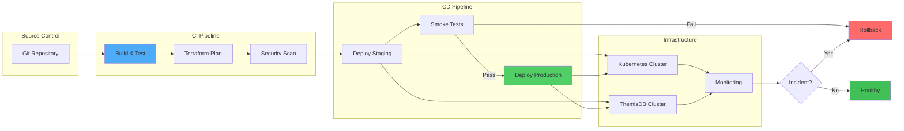

# Kapitel 25: DevOps & Infrastructure as Code

> *"Infrastructure should be versioned, tested, and deployed like code. In ThemisDB, this is standard practice."*

---

## Überblick

Production-grade Datenbanken erfordern automatisierte Bereitstellung, Monitoring, und Failover-Mechanismen. Dieses Kapitel behandelt Infrastructure-as-Code (IaC) mit Terraform, Container-Orchestrierung mit Kubernetes, und GitOps-Workflows.

**Was Sie in diesem Kapitel lernen:**
- Terraform-Module für ThemisDB-Deployment
- Kubernetes Helm Charts
- GitOps-Workflows mit ArgoCD
- Multi-Region Failover
- Disaster Recovery Planning
- Operational Runbooks

<figure>



<figcaption><b>Abb. 25.1:</b> DevOps-Pipeline-Architektur</figcaption>
</figure>

---

## 25.1 Terraform Infrastructure-as-Code

Terraform ermöglicht die deklarative Definition der gesamten AWS-Infrastruktur für ThemisDB. Das Setup beinhaltet ein hochverfügbares RDS-Cluster mit 3 Knoten, automatische Backups, verschlüsselten Storage (KMS), Performance Insights für Monitoring und CloudWatch-Logging für Slowquery-Analyse. Die State-Datei wird in S3 mit DynamoDB-Locking gesichert, um parallele Änderungen zu verhindern.

**📁 Vollständige Infrastruktur:** `terraform/main.tf` (~96 Zeilen)

**AWS RDS ThemisDB Cluster** (Kern-Setup):

```hcl
# main.tf: Production ThemisDB Cluster
terraform {
  required_providers {
    aws = { source = "hashicorp/aws", version = "~> 5.0" }
  }
  backend "s3" {
    bucket  = "themis-terraform-state"
    key     = "production/themisdb/terraform.tfstate"
    encrypt = true
  }
}

# Hochverfügbares RDS Cluster
resource "aws_rds_cluster" "themis" {
  cluster_identifier      = "themis-prod-cluster"
  engine                  = "themisdb"
  engine_version          = "1.3.4"
  master_username         = "admin"
  master_password         = random_password.db_password.result
  
  # Hochverfügbarkeit über 3 Availability Zones
  availability_zones      = data.aws_availability_zones.available.names
  backup_retention_period = 30
  preferred_backup_window = "03:00-04:00"
  
  # Security: Verschlüsselung + VPC isolation
  storage_encrypted               = true
  kms_key_id                      = aws_kms_key.themis.arn
  vpc_security_group_ids          = [aws_security_group.themis_db.id]
  
  # Monitoring: Performance Insights + CloudWatch
  performance_insights_enabled    = true
  enable_cloudwatch_logs_exports = ["error", "general", "slowquery"]
}

# 3-Knoten Cluster für Load Balancing
resource "aws_rds_cluster_instance" "themis" {
  count              = 3
  cluster_identifier = aws_rds_cluster.themis.id
  instance_class     = "db.r6i.2xlarge"  # 64 GB RAM, 8 vCPUs
  
  monitoring_interval          = 60   # CloudWatch detailed monitoring
  performance_insights_enabled = true
}

# Performance-Tuning
resource "aws_rds_cluster_parameter_group" "themis" {
  name   = "themis-prod-params"
  family = "themisdb1.3"
  
  parameter { name = "max_connections",    value = "500" }
  parameter { name = "shared_buffers_gb",  value = "16" }
  parameter { name = "work_mem_mb",        value = "256" }
}
```

**Weitere Ressourcen in vollständiger Datei:**
- Subnet Groups für Multi-AZ deployment
- Security Groups mit Ingress-Rules
- KMS Keys für Encryption-at-Rest
- IAM Roles für RDS-Monitoring
- Random password generation

### Subnet & Security Groups

```hcl
# network.tf: Netzwerk-Setup
resource "aws_db_subnet_group" "themis" {
  name       = "themis-subnets"
  subnet_ids = aws_subnet.private[*].id
  
  tags = {
    Name = "themis-subnet-group"
  }
}

resource "aws_security_group" "themis_db" {
  name        = "themis-db-sg"
  description = "Security group for ThemisDB"
  vpc_id      = aws_vpc.main.id
  
  ingress {
    from_port       = 8529
    to_port         = 8529
    protocol        = "tcp"
    security_groups = [aws_security_group.themis_app.id]
  }
  
  egress {
    from_port   = 0
    to_port     = 0
    protocol    = "-1"
    cidr_blocks = ["0.0.0.0/0"]
  }
  
  tags = {
    Name = "themis-db-sg"
  }
}

# Backup Vault (WORM)
resource "aws_backup_vault" "themis" {
  name        = "themis-backup-vault"
  kms_key_arn = aws_kms_key.themis.arn
  
  tags = {
    Name = "themis-worm-vault"
  }
}
```

### Outputs & Monitoring

```hcl
# outputs.tf
output "cluster_endpoint" {
  value       = aws_rds_cluster.themis.endpoint
  description = "Cluster write endpoint"
}

output "cluster_reader_endpoint" {
  value       = aws_rds_cluster.themis.reader_endpoint
  description = "Cluster read endpoint (load-balanced)"
}

output "cloudwatch_log_group" {
  value = "/aws/rds/cluster/${aws_rds_cluster.themis.id}"
}

# CloudWatch Alarms
resource "aws_cloudwatch_metric_alarm" "high_cpu" {
  alarm_name          = "themis-high-cpu"
  comparison_operator = "GreaterThanThreshold"
  evaluation_periods  = "2"
  metric_name         = "CPUUtilization"
  namespace           = "AWS/RDS"
  period              = "300"
  statistic           = "Average"
  threshold           = "80"
  alarm_actions       = [aws_sns_topic.alerts.arn]
  
  dimensions = {
    DBClusterIdentifier = aws_rds_cluster.themis.cluster_identifier
  }
}
```

---

## 25.2 Kubernetes Helm Charts

### Helm Chart Struktur

```
themis-helm/
├── Chart.yaml
├── values.yaml
├── values-prod.yaml
├── values-staging.yaml
├── templates/
│   ├── deployment.yaml
│   ├── service.yaml
│   ├── ingress.yaml
│   ├── pvc.yaml
│   ├── configmap.yaml
│   └── statefulset.yaml
└── charts/
    └── prometheus-operator/
```

### Deployment Template

```yaml
# templates/statefulset.yaml
apiVersion: apps/v1
kind: StatefulSet
metadata:
  name: {{ include "themis.fullname" . }}
  labels:
    {{- include "themis.labels" . | nindent 4 }}
spec:
  serviceName: {{ include "themis.fullname" . }}
  replicas: {{ .Values.replicaCount }}
  selector:
    matchLabels:
      {{- include "themis.selectorLabels" . | nindent 6 }}
  
  template:
    metadata:
      labels:
        {{- include "themis.selectorLabels" . | nindent 8 }}
    
    spec:
      # Pod Disruption Budget (für Rolling Updates)
      affinity:
        podAntiAffinity:
          requiredDuringSchedulingIgnoredDuringExecution:
            - labelSelector:
                matchExpressions:
                  - key: app
                    operator: In
                    values:
                      - themis
              topologyKey: kubernetes.io/hostname
      
      containers:
      - name: themis
        image: "{{ .Values.image.repository }}:{{ .Values.image.tag }}"
        imagePullPolicy: IfNotPresent
        
        ports:
        - name: http
          containerPort: 8529
          protocol: TCP
        - name: replication
          containerPort: 8530
          protocol: TCP
        
        env:
        - name: THEMIS_CLUSTER_NAME
          value: {{ .Values.clusterName }}
        - name: THEMIS_PEER_URLS
          value: "themis-0.themis:8530,themis-1.themis:8530,themis-2.themis:8530"
        
        # Resource Requests
        resources:
          requests:
            memory: {{ .Values.resources.requests.memory }}
            cpu: {{ .Values.resources.requests.cpu }}
          limits:
            memory: {{ .Values.resources.limits.memory }}
            cpu: {{ .Values.resources.limits.cpu }}
        
        # Liveness & Readiness Probes
        livenessProbe:
          httpGet:
            path: /_admin/health
            port: http
          initialDelaySeconds: 30
          periodSeconds: 10
        
        readinessProbe:
          httpGet:
            path: /_admin/ready
            port: http
          initialDelaySeconds: 10
          periodSeconds: 5
        
        # Volume Mounts
        volumeMounts:
        - name: data
          mountPath: /data
        - name: config
          mountPath: /etc/themis
      
      volumes:
      - name: config
        configMap:
          name: {{ include "themis.fullname" . }}
  
  # Persistent Volume Claim
  volumeClaimTemplates:
  - metadata:
      name: data
    spec:
      accessModes: ["ReadWriteOnce"]
      storageClassName: fast-ssd
      resources:
        requests:
          storage: {{ .Values.persistence.size }}
```

### Helm Values (Production)

```yaml
# values-prod.yaml
replicaCount: 3
clusterName: themis-prod

image:
  repository: themisdb/server
  tag: "1.3.4"
  pullPolicy: IfNotPresent

resources:
  requests:
    memory: 16Gi
    cpu: 4000m
  limits:
    memory: 32Gi
    cpu: 8000m

persistence:
  enabled: true
  size: 500Gi
  storageClass: fast-ssd

# Ingress für HTTP/2 Zugriff
ingress:
  enabled: true
  className: nginx
  annotations:
    cert-manager.io/cluster-issuer: letsencrypt-prod
  hosts:
    - host: themis.example.com
      paths:
        - path: /
          pathType: Prefix
  tls:
    - secretName: themis-tls
      hosts:
        - themis.example.com

# Monitoring
monitoring:
  enabled: true
  serviceMonitor:
    enabled: true
    interval: 30s
```

---

## 25.3 GitOps mit ArgoCD

### ArgoCD Application Definition

```yaml
# argocd/themis-prod-app.yaml
apiVersion: argoproj.io/v1alpha1
kind: Application
metadata:
  name: themis-prod
  namespace: argocd
spec:
  project: production
  
  source:
    repoURL: https://github.com/themisdb/helm-charts
    targetRevision: v1.3.4
    path: themis-helm
    helm:
      releaseName: themis
      values: |
        replicaCount: 3
        image:
          tag: "1.3.4"
  
  destination:
    server: https://kubernetes.default.svc
    namespace: themis-prod
  
  syncPolicy:
    automated:
      prune: true
      selfHeal: true
    syncOptions:
      - CreateNamespace=true
    retry:
      limit: 5
      backoff:
        duration: 5s
        factor: 2
        maxDuration: 3m
```

### Pull Request Preview Environments

```yaml
# .github/workflows/preview.yml
name: Preview Environment

on:
  pull_request:
    paths:
      - 'helm/**'
      - '.github/workflows/preview.yml'

jobs:
  deploy-preview:
    runs-on: ubuntu-latest
    steps:
      - uses: actions/checkout@v3
      
      - name: Create Preview Namespace
        run: |
          kubectl create namespace preview-${{ github.event.pull_request.number }}
      
      - name: Deploy with Helm
        run: |
          helm install themis-preview ./themis-helm \
            -n preview-${{ github.event.pull_request.number }} \
            -f values-preview.yaml \
            --set image.tag=${{ github.head_ref }}
      
      - name: Comment PR with Preview URL
        uses: actions/github-script@v6
        with:
          script: |
            github.rest.issues.createComment({
              issue_number: context.issue.number,
              owner: context.repo.owner,
              repo: context.repo.repo,
              body: '🚀 Preview deployed at `preview-${{ github.event.pull_request.number }}.preview.svc.cluster.local`'
            })
```

---

## 25.4 Multi-Region Failover

### Active-Active Replikation

```hcl
# multi-region.tf: Cross-Region Setup
resource "aws_rds_cluster" "themis_eu" {
  # EU Cluster (Primary)
  cluster_identifier = "themis-eu-primary"
  region             = "eu-central-1"
}

resource "aws_rds_cluster" "themis_us" {
  # US Cluster (Replica mit Failover)
  cluster_identifier       = "themis-us-replica"
  region                   = "us-east-1"
  replication_source_arn   = aws_rds_cluster.themis_eu.arn
  
  # Automatischer Failover nach 300 Sekunden
  backup_retention_period = 30
}

# Route53 Health Check & Failover
resource "aws_route53_failover_routing_policy" "themis" {
  name            = "themis.example.com"
  zone_id         = aws_route53_zone.main.zone_id
  type            = "A"
  failover_routing_policy {
    type = "PRIMARY"
  }
  
  alias {
    name                   = aws_rds_cluster.themis_eu.endpoint
    zone_id                = aws_rds_cluster.themis_eu.hosted_zone_id
    evaluate_target_health = true
  }
  
  health_check_id = aws_route53_health_check.eu.id
}
```

### Application-Level Failover

```python
# app/failover.py: Client-seitiges Failover
class ResilientThemisClient:
    def __init__(self, primary_url, secondary_url):
        self.primary_url = primary_url
        self.secondary_url = secondary_url
        self.current_url = primary_url
        self.failure_count = 0
        self.max_failures = 3
    
    def query(self, aql, params=None):
        try:
            client = themis.Client(self.current_url)
            result = client.query(aql, params)
            self.failure_count = 0  # Reset bei Erfolg
            return result
        except Exception as e:
            self.failure_count += 1
            
            if self.failure_count >= self.max_failures:
                # Failover zu Secondary
                self.current_url = self.secondary_url
                self.failure_count = 0
                print(f"Failover zu {self.secondary_url}")
                return self.query(aql, params)  # Retry
            raise
```

---

## 25.5 Disaster Recovery Planning

### Backup & Restore Strategie

```bash
#!/bin/bash
# backup_strategy.sh: Daily + Weekly + Monthly Backups

# Täglich: Inkrementales Backup (7 Tage Retention)
aws backup start-backup-job \
  --backup-vault-name themis-backup-vault \
  --recovery-point-type INCREMENTAL \
  --recovery-point-tags "Frequency=Daily,Retention=7days"

# Wöchentlich: Full Backup (4 Wochen Retention)
aws backup start-backup-job \
  --backup-vault-name themis-backup-vault \
  --recovery-point-type FULL \
  --recovery-point-tags "Frequency=Weekly,Retention=4weeks"

# Monatlich: Langzeit-Archiv (7 Jahre für DSGVO)
aws backup start-backup-job \
  --backup-vault-name themis-backup-vault \
  --recovery-point-type FULL \
  --recovery-point-tags "Frequency=Monthly,Retention=7years"
```

### RTO & RPO Metriken

| Szenario | RTO | RPO | Strategie |
|----------|-----|-----|-----------|
| Einzelner Node Fehler | <30s | 0s | Auto-Failover |
| Region Ausfalls | <5min | <1min | Cross-Region Replica |
| Datenbeschädigung | <1h | <1h | Point-in-Time Recovery |
| Vollständiger Datenverlust | <4h | <24h | S3 Langzeit-Archiv |

---

## 25.6 Operational Runbooks

### Incident Response Playbook

```markdown
## Critical Alert: High Replication Lag

**Severity:** High  
**RTO:** 5 minutes  
**On-call:** Check #oncall Slack channel

### Diagnostik (1-2 min)
1. `kubectl logs -f themis-2` - Prüfe Replica-Logs
2. `curl http://themis-2:8529/_admin/stats` - Replication lag?
3. `aws cloudwatch get-metric-statistics --metric-name ReplicationLatency`

### Remediation (2-3 min)
```bash
# Option 1: Replica neustarten
kubectl delete pod themis-2

# Option 2: Manuelles Resync
curl -X POST http://themis-2:8529/_admin/resync
```

### Post-Incident
- [ ] Logs analysieren
- [ ] Runbook updaten
- [ ] Post-Mortem in Confluence
```

---

## 25.7 Checkliste für Production Readiness

- ✅ Terraform IAC für alle Infra-Komponenten
- ✅ Helm Charts mit Multi-Environment Support
- ✅ ArgoCD für GitOps Deployment
- ✅ Automated Backup & Restore Tests
- ✅ Multi-Region Failover konfiguriert
- ✅ CloudWatch Alarms für kritische Metriken
- ✅ PagerDuty/Opsgenie Integration
- ✅ Runbooks für alle kritischen Szenarien
- ✅ Load-Testing vor Production Release
- ✅ Security Scanning in CI/CD Pipeline
