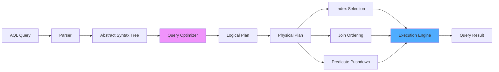

# Kapitel 28: AQL Vollständige Referenz

> *"Eine Abfragesprache ist nur so gut wie ihre Dokumentation."*

---

## Überblick

Dieses Kapitel ist die komplette Referenz für AQL (Adaptive Query Language), die einheitliche Abfragesprache von ThemisDB. Sie deckt alle 479 Sprachelemente ab: 119 Keywords und 360 eingebaute Funktionen.

**Was Sie in diesem Kapitel finden:**
- Vollständiger Sprachumfang (v1.3.1)
- Kategorisierte Funktionsreferenz
- Praktische Beispiele für jeden Bereich
- Performance-Hinweise und Best Practices

**Voraussetzungen:** Kapitel 5-9 (Datenmodelle), Grundverständnis von SQL.

---

<figure>



<figcaption><b>Abb. 28.0:</b> AQL-Query-Execution-Pipeline</figcaption>
</figure>

---

## 28.1 Sprachumfang-Überblick

### Executive Summary

| Aspekt | v1.3.0 | v1.3.1 | Änderung |
|--------|--------|--------|----------|
| **Reservierte Keywords** | 72 | **119** | **+47 (+65%)** |
| **Eingebaute Funktionen** | ~360 | ~360 | 0 |
| **Gesamt-Sprachumfang** | 432 | **479** | **+47 (+11%)** |

**Wichtig:** v1.3.1 erweitert Sprachkonstrukte (TYPE, FUNCTION, CLASS) - keine neuen Funktionen.

---

## 28.2 Reservierte Keywords (119)

### 28.2.1 Core Language (8)

```aql
FOR, IN, LET, FILTER, COLLECT, SORT, LIMIT, RETURN
```

**Beispiel:**

```aql
FOR user IN users
  FILTER user.age >= 18
  LET email_domain = SPLIT(user.email, "@")[1]
  COLLECT domain = email_domain WITH COUNT INTO count
  SORT count DESC
  LIMIT 10
  RETURN { domain, count }
```

### 28.2.2 Logical Operators (3)

```aql
AND, OR, NOT
```

**Beispiel:**

```aql
FOR product IN products
  FILTER product.price >= 10 AND product.price <= 100
  FILTER NOT product.discontinued
  FILTER product.category == "Electronics" OR product.category == "Books"
  RETURN product
```

### 28.2.3 Aggregation Functions (8)

```aql
COUNT, SUM, AVG, MIN, MAX, VARIANCE, STDDEV, UNIQUE
```

**Beispiel:**

```aql
FOR order IN orders
  COLLECT year = DATE_YEAR(order.created_at)
  AGGREGATE 
    total = SUM(order.amount),
    avg_order = AVG(order.amount),
    min_order = MIN(order.amount),
    max_order = MAX(order.amount),
    order_count = COUNT(1)
  RETURN { year, total, avg_order, min_order, max_order, order_count }
```

### 28.2.4 Graph Traversal (4)

```aql
OUTBOUND, INBOUND, ANY, SHORTEST_PATH
```

**Beispiel:**

```aql
-- Finde alle Freunde von Alice (2 Hops)
FOR v, e, p IN 1..2 OUTBOUND "users/alice" friends
  RETURN { friend: v.name, path_length: LENGTH(p.edges) }

-- Kürzester Pfad von Alice zu Bob
FOR v, e IN OUTBOUND SHORTEST_PATH "users/alice" TO "users/bob" follows
  RETURN { user: v.name, action: e.type }
```

### 28.2.5 DDL (Data Definition Language) (5)

```aql
CREATE, DROP, COLLECTION, INDEX, VIEW
```

**Beispiele:**

```aql
-- Collection erstellen
CREATE COLLECTION products

-- Index erstellen
CREATE INDEX products_price ON products(price) TYPE SKIPLIST

-- View erstellen
CREATE VIEW active_users AS
  FOR u IN users
    FILTER u.status == "active"
    RETURN u

-- Löschen
DROP INDEX products_price
DROP COLLECTION products
```

### 28.2.6 DML (Data Manipulation Language) (6)

```aql
INSERT, UPDATE, REPLACE, REMOVE, UPSERT, INTO, WITH
```

**Beispiele:**

```aql
-- Insert
INSERT { name: "Alice", age: 30 } INTO users

-- Update
UPDATE { _key: "alice" } WITH { age: 31 } IN users

-- Upsert (Insert if not exists)
UPSERT { email: "alice@example.com" }
  INSERT { name: "Alice", email: "alice@example.com", age: 30 }
  UPDATE { last_login: DATE_NOW() }
  IN users

-- Remove
REMOVE { _key: "alice" } IN users

-- Replace
REPLACE { _key: "alice", name: "Alice Smith", age: 31 } IN users
```

### 28.2.7 LLM Operations (13)

```aql
LLM, INFER, RAG, EMBED, MODEL, LORA, STATS, CACHE,
LOAD, UNLOAD, LIST, INGEST, BLOB
```

**Beispiele:**

```aql
-- RAG-Query
FOR doc IN documents
  LET embedding = EMBED(doc.content, { model: "text-embedding-3-small" })
  LET neighbors = KNN_SEARCH(embeddings, embedding, 5)
  LET context = CONCAT_SEPARATOR("\n", neighbors[*].content)
  LET answer = LLM("Answer based on context", { context, model: "gpt-4" })
  RETURN answer

-- Ingest Content
INGEST BLOB "data/documents.pdf" 
  INTO content_store 
  WITH { chunk_size: 512, overlap: 50 }
```

### 28.2.8 Index Types (7)

```aql
HASH, SKIPLIST, FULLTEXT, GEO, PERSISTENT, TTL, VECTOR
```

**Beispiele:**

```aql
-- Hash Index (Equality)
CREATE INDEX users_email ON users(email) TYPE HASH

-- Skiplist (Range Queries)
CREATE INDEX products_price ON products(price) TYPE SKIPLIST

-- Fulltext Index
CREATE INDEX articles_body ON articles(body) TYPE FULLTEXT

-- Geo Index
CREATE INDEX locations_coords ON locations(lat, lng) TYPE GEO

-- TTL Index (Auto-Expiry)
CREATE INDEX sessions_ttl ON sessions(expires_at) TYPE TTL

-- Vector Index (ANN Search)
CREATE INDEX embeddings_vector ON embeddings(vector) 
  TYPE VECTOR 
  OPTIONS { metric: "cosine", dimensions: 768 }
```

---

## 28.3 Date/Time Functions (45)

### 28.3.1 Aktuelle Zeit/Datum (11)

**Wichtigste Funktionen:**
- `DATE_NOW()` - Aktueller ISO-Timestamp
- `CURRENT_DATE()` / `CURRENT_TIME()` - Nur Datum/Zeit
- `UNIX_TIMESTAMP()` - Unix Epoch

```aql
RETURN {
  now: DATE_NOW(),
  unix: UNIX_TIMESTAMP()
}
-- → {"now": "2025-01-15T10:30:45Z", "unix": 1736936445}
```

### 28.3.2 Interval Functions (8)

**Interval-Arithmetik:**
`DAYS(n)`, `HOURS(n)`, `WEEKS(n)` etc. für Zeitberechnungen.

```aql
-- Letzte 30 Tage
FILTER order.created_at >= DATE_NOW() - DAYS(30)

-- Fälligkeitsdatum berechnen
LET due = invoice.created_at + DAYS(14)
```

### 28.3.3 Komponenten-Extraktion (11)

**Komponenten extrahieren:**
`DATE_YEAR()`, `DATE_MONTH()`, `DATE_DAY()`, `DATE_HOUR()`, etc.

```aql
-- Gruppierung nach Monat
COLLECT month = DATE_MONTH(sale.date)
AGGREGATE total = SUM(sale.amount)
```

### 28.3.4 Workday Functions (6)

```aql
WORKDAYS(start, end, calendar)          -- Arbeitstage zwischen zwei Daten
WORKDAYS_ADD(date, days, calendar)      -- Addiere Arbeitstage
IS_WEEKEND(date)                        -- true wenn Samstag/Sonntag
IS_WORKDAY(date, calendar)              -- true wenn Arbeitstag
HOLIDAYS(country, year)                 -- Liste der Feiertage
HOLIDAYS_BETWEEN(start, end, country)   -- Feiertage in Zeitraum
```

**Beispiele:**

```aql
-- Berechne SLA-Frist (5 Arbeitstage)
FOR ticket IN support_tickets
  RETURN {
    ticket_id: ticket._key,
    created: ticket.created_at,
    sla_deadline: WORKDAYS_ADD(ticket.created_at, 5, "DE")
  }

-- Finde Tickets, die am Wochenende erstellt wurden
FOR ticket IN support_tickets
  FILTER IS_WEEKEND(ticket.created_at)
  RETURN ticket
```

---

## 28.4 String Functions (20)

```aql
CONCAT(str1, str2, ...)              -- Strings zusammenfügen
CONCAT_SEPARATOR(sep, str1, ...)     -- Mit Trennzeichen
SUBSTRING(str, start, length)        -- Teilstring
UPPER(str)                           -- Großbuchstaben
LOWER(str)                           -- Kleinbuchstaben
TRIM(str)                            -- Whitespace entfernen
LTRIM(str)                           -- Links trimmen
RTRIM(str)                           -- Rechts trimmen
LENGTH(str)                          -- Länge
REVERSE(str)                         -- Umkehren
REPLACE(str, search, replace)        -- Ersetzen
SPLIT(str, separator)                -- In Array aufteilen
JOIN(array, separator)               -- Array zu String
STARTS_WITH(str, prefix)             -- Startet mit
ENDS_WITH(str, suffix)               -- Endet mit
CONTAINS(str, substring)             -- Enthält
FIND(str, substring)                 -- Position finden
REGEX_TEST(str, pattern)             -- Regex-Match?
REGEX_MATCHES(str, pattern)          -- Alle Matches
REGEX_REPLACE(str, pattern, repl)    -- Regex-Ersetzung
```

**Beispiele:**

```aql
-- Email-Domain extrahieren
FOR user IN users
  LET domain = SPLIT(user.email, "@")[1]
  RETURN { user: user.name, domain }

-- Case-insensitive Suche
FOR article IN articles
  FILTER CONTAINS(LOWER(article.title), LOWER("ThemisDB"))
  RETURN article

-- Email-Validierung mit Regex
FOR user IN users
  FILTER REGEX_TEST(user.email, "^[^@]+@[^@]+\\.[^@]+$")
  RETURN user
```

---

## 28.5 Math Functions (30)

```aql
-- Basic Math
ABS(x)           -- Betrag
CEIL(x)          -- Aufrunden
FLOOR(x)         -- Abrunden
ROUND(x, d)      -- Runden auf d Dezimalstellen
SQRT(x)          -- Quadratwurzel
POW(x, y)        -- x hoch y
EXP(x)           -- e^x
LOG(x)           -- Natürlicher Logarithmus
LOG10(x)         -- Logarithmus zur Basis 10
LN(x)            -- Alias für LOG

-- Trigonometric
SIN(x)           -- Sinus
COS(x)           -- Kosinus
TAN(x)           -- Tangens
ASIN(x)          -- Arkussinus
ACOS(x)          -- Arkuskosinus
ATAN(x)          -- Arkustangens
ATAN2(y, x)      -- Arkustangens mit Vorzeichen
SINH(x)          -- Hyperbelsinus
COSH(x)          -- Hyperbelkosinus
TANH(x)          -- Hyperbeltangens

-- Utilities
MIN(a, b, ...)   -- Minimum
MAX(a, b, ...)   -- Maximum
RAND()           -- Zufallszahl [0, 1)
RAND_INT(a, b)   -- Ganzzahl zwischen a und b
PI()             -- π
E()              -- e
SIGN(x)          -- Vorzeichen (-1, 0, 1)
TRUNC(x)         -- Ganzzahlteil
MOD(x, y)        -- Modulo
QUOTIENT(x, y)   -- Ganzzahlige Division
```

**Beispiele:**

```aql
-- Berechne Entfernung mit Pythagoras
FOR point IN points
  LET distance = SQRT(POW(point.x, 2) + POW(point.y, 2))
  RETURN { point: point._key, distance }

-- Zufälliges Sampling (10%)
FOR doc IN documents
  FILTER RAND() < 0.1
  RETURN doc

-- Preisberechnung mit Rundung
FOR product IN products
  LET price_with_tax = ROUND(product.price * 1.19, 2)
  RETURN { product: product.name, price_with_tax }
```

---

## 28.6 Array Functions (20)

```aql
PUSH(array, value)           -- Element anhängen
POP(array)                   -- Letztes Element entfernen
SHIFT(array)                 -- Erstes Element entfernen
UNSHIFT(array, value)        -- Element vorne einfügen
APPEND(array, value)         -- Alias für PUSH
PREPEND(array, value)        -- Alias für UNSHIFT
FIRST(array)                 -- Erstes Element
LAST(array)                  -- Letztes Element
NTH(array, n)                -- n-tes Element
SLICE(array, start, end)     -- Teilarray
FLATTEN(array, depth)        -- Array flach machen
UNIQUE(array)                -- Duplikate entfernen
UNION(array1, array2)        -- Vereinigung
INTERSECTION(array1, array2) -- Schnittmenge
DIFFERENCE(array1, array2)   -- Differenz
MAP(array, fn)               -- Transform
FILTER(array, fn)            -- Filtern
REDUCE(array, fn, init)      -- Reduzieren
SORT_ARRAY(array)            -- Sortieren
REVERSE_ARRAY(array)         -- Umkehren
```

**Beispiele:**

```aql
-- Finde gemeinsame Tags
FOR doc1 IN documents
  FOR doc2 IN documents
    FILTER doc1._key < doc2._key
    LET common_tags = INTERSECTION(doc1.tags, doc2.tags)
    FILTER LENGTH(common_tags) > 0
    RETURN { doc1: doc1._key, doc2: doc2._key, common_tags }

-- Extrahiere alle einzigartigen Kategorien
RETURN UNIQUE(FLATTEN(
  FOR product IN products
    RETURN product.categories
))
```

---

## 28.7 Geo Functions (25)

### 28.7.1 GeoJSON Konstruktion (6)

```aql
GEO_POINT(lng, lat)
GEO_MULTIPOINT(points)
GEO_LINESTRING(coords)
GEO_MULTILINESTRING(lines)
GEO_POLYGON(rings)
GEO_MULTIPOLYGON(polygons)
```

**Beispiel:**

```aql
-- Erstelle Restaurant mit Location
INSERT {
  name: "Bella Italia",
  location: GEO_POINT(13.405, 52.520)  -- Berlin
} INTO restaurants
```

### 28.7.2 Spatial Predicates (6)

```aql
GEO_CONTAINS(geo1, geo2)     -- geo1 enthält geo2
GEO_INTERSECTS(geo1, geo2)   -- geo1 schneidet geo2
ST_Contains(geo1, geo2)      -- Alias
ST_Within(geo2, geo1)        -- geo2 innerhalb geo1
ST_Intersects(geo1, geo2)    -- Alias
GEO_EQUALS(geo1, geo2)       -- Geometrisch gleich
```

**Beispiel:**

```aql
-- Finde Restaurants in Polygon (Stadtteil)
LET polygon = GEO_POLYGON([
  [13.40, 52.52], [13.41, 52.52], 
  [13.41, 52.51], [13.40, 52.51], 
  [13.40, 52.52]
])

FOR restaurant IN restaurants
  FILTER GEO_CONTAINS(polygon, restaurant.location)
  RETURN restaurant
```

### 28.7.3 Distance & Metrics (5)

```aql
GEO_DISTANCE(geo1, geo2)     -- Haversine-Distanz (Meter)
ST_Distance(geo1, geo2)      -- Alias
GEO_IN_RANGE(geo, center, radius)  -- Innerhalb Radius
GEO_AREA(polygon)            -- Fläche (m²)
ST_Area(polygon)             -- Alias
ST_Length(linestring)        -- Länge (Meter)
```

**Beispiel:**

```aql
-- Finde Restaurants innerhalb 1 km
LET my_location = GEO_POINT(13.405, 52.520)

FOR restaurant IN restaurants
  LET distance = GEO_DISTANCE(my_location, restaurant.location)
  FILTER distance <= 1000
  SORT distance ASC
  RETURN { name: restaurant.name, distance }
```

### 28.7.4 CRS Transformations (10)

```aql
ST_TRANSFORM(geo, from_crs, to_crs)
ST_SRID(geo)                        -- SRID auslesen
ST_SetSRID(geo, srid)               -- SRID setzen
WGS84_TO_UTM(lng, lat)              -- WGS84 → UTM
UTM_TO_WGS84(easting, northing, zone)
ETRS89_TO_WGS84(x, y)
WGS84_TO_ETRS89(lng, lat)
HELMERT_TRANSFORM(x, y, params)     -- 7-Parameter-Transformation
GAUSS_KRUEGER_TO_UTM(x, y)
UTM_TO_GAUSS_KRUEGER(easting, northing)
```

**Beispiel:**

```aql
-- Transformiere GPS-Koordinaten nach UTM (für genaue Distanzmessung)
FOR location IN survey_points
  LET utm = WGS84_TO_UTM(location.lng, location.lat)
  RETURN { location: location._key, utm }
```

---

## 28.8 Vector Functions (20)

```aql
-- Similarity Metrics
COSINE_SIMILARITY(v1, v2)
DOT_PRODUCT(v1, v2)
EUCLIDEAN_DISTANCE(v1, v2)
MANHATTAN_DISTANCE(v1, v2)
HAMMING_DISTANCE(v1, v2)
JACCARD_SIMILARITY(v1, v2)

-- Vector Operations
VECTOR_NORM(v)               -- L2-Norm
VECTOR_NORMALIZE(v)          -- Auf Länge 1 normalisieren
VECTOR_ADD(v1, v2)
VECTOR_SUBTRACT(v1, v2)
VECTOR_MULTIPLY(v, scalar)
VECTOR_DIVIDE(v, scalar)
VECTOR_DOT(v1, v2)           -- Alias für DOT_PRODUCT
VECTOR_CROSS(v1, v2)         -- Kreuzprodukt (nur 3D)

-- Distance Metrics
L1_DISTANCE(v1, v2)          -- Manhattan
L2_DISTANCE(v1, v2)          -- Euclidean
CHEBYSHEV_DISTANCE(v1, v2)   -- Max-Norm

-- Search
KNN_SEARCH(collection, query_vector, k)
VECTOR_QUANTIZE(v, bits)     -- Quantisierung (SQ8, SQ4)
```

**Beispiele:**

```aql
-- Semantic Search mit Embeddings
LET query_embedding = EMBED("machine learning tutorial")

FOR doc IN embeddings
  LET similarity = COSINE_SIMILARITY(query_embedding, doc.vector)
  SORT similarity DESC
  LIMIT 10
  RETURN { doc: doc.title, similarity }

-- KNN-Search mit Prefilter
FOR result IN KNN_SEARCH(
  embeddings, 
  EMBED("neural networks"), 
  20,
  { filter: "category == 'AI'" }
)
  RETURN result
```

---

## 28.9 Graph Functions (15)

```aql
-- Traversal
OUTBOUND(vertex, edge_collection)
INBOUND(vertex, edge_collection)
ANY(vertex, edge_collection)
SHORTEST_PATH(start, end, edge_collection)

-- Path Metrics
PATH_LENGTH(path)
PATH_VERTICES(path)
PATH_EDGES(path)

-- Algorithms
CONNECTED_COMPONENTS(graph)
PAGERANK(graph)
BETWEENNESS_CENTRALITY(graph, vertex)
CLOSENESS_CENTRALITY(graph, vertex)
COMMUNITY_DETECTION(graph)

-- Utilities
IS_CONNECTED(graph, v1, v2)
GRAPH_DIAMETER(graph)
GRAPH_RADIUS(graph)
```

**Beispiele:**

```aql
-- PageRank auf Social Graph
LET pageranks = PAGERANK({
  vertexCollections: ["users"],
  edgeCollections: ["follows"]
})

FOR user IN users
  SORT pageranks[user._key] DESC
  LIMIT 10
  RETURN { user: user.name, score: pageranks[user._key] }

-- Finde Communities
LET communities = COMMUNITY_DETECTION({
  vertexCollections: ["users"],
  edgeCollections: ["friends"]
})

FOR user IN users
  RETURN { user: user.name, community: communities[user._key] }
```

---

## 28.10 Best Practices

### 28.10.1 Index Usage

```aql
-- ❌ SCHLECHT: Keine Index-Nutzung
FOR user IN users
  FILTER UPPER(user.email) == "ALICE@EXAMPLE.COM"
  RETURN user

-- ✅ GUT: Index auf email (case-insensitive)
FOR user IN users
  FILTER user.email == "alice@example.com"
  RETURN user
```

### 28.10.2 Early Filtering

```aql
-- ❌ SCHLECHT: Filter nach JOIN
FOR order IN orders
  FOR user IN users
    FILTER user._key == order.user_id
    FILTER order.amount > 100
    RETURN { order, user }

-- ✅ GUT: Filter vor JOIN
FOR order IN orders
  FILTER order.amount > 100
  FOR user IN users
    FILTER user._key == order.user_id
    RETURN { order, user }
```

### 28.10.3 Projection

```aql
-- ❌ SCHLECHT: Vollständige Dokumente
FOR user IN users
  RETURN user

-- ✅ GUT: Nur benötigte Felder
FOR user IN users
  RETURN { name: user.name, email: user.email }
```

---

## 28.11 Zusammenfassung

AQL bietet **479 Sprachelemente**:
- **119 Keywords** für Struktur und Semantik
- **360 Funktionen** für Datenmanipulation

### Hauptkategorien

1. **Date/Time (45):** Umfassende Zeitzonenunterstützung, Arbeitstage
2. **Strings (20):** Regex, Splitting, Manipulation
3. **Math (30):** Trigonometrie, Statistik
4. **Arrays (20):** Funktionale Programmierung
5. **Geo (35):** GeoJSON, CRS-Transformationen
6. **Vectors (20):** ANN-Search, Similarity
7. **Graph (15):** Traversal, Centrality, Communities

### Nächste Schritte

- **Kapitel 5-9:** Praktische Beispiele für jedes Datenmodell
- **Kapitel 21:** Query Optimization
- **AQL Grammar:** [aql/AQL_GRAMMAR_EXTENDED_v1.3.1.ebnf](../../aql/AQL_GRAMMAR_EXTENDED_v1.3.1.ebnf)

---

## 28.12 Advanced Patterns & Idioms

### 28.12.1 Recursive Queries with Custom Depth

```aql
-- Find all ancestors up to depth N
LET find_ancestors = FUNCTION(person_id, max_depth) {
  RETURN (
    FOR v, e, p IN 0..max_depth OUTBOUND person_id GRAPH 'family'
      FILTER CURRENT.generation < person_id.generation
      RETURN {
        person: v.name,
        generation: v.generation,
        depth: LENGTH(p.edges)
      }
  )
}

RETURN find_ancestors('persons/alice', 3)
```

### 28.12.2 Transitive Closure (Find All Reachable Nodes)

```aql
-- Get all projects reachable from a given person (including transitive deps)
FOR p IN projects
  FILTER p._id == 'projects/prj1'
  LET all_deps = (
    FOR dep IN 0..10 OUTBOUND p GRAPH 'depends_on'
      RETURN dep._id
  ) | UNIQUE()
  RETURN {
    project: p.name,
    dependencies: all_deps,
    dep_count: LENGTH(all_deps)
  }
```

### 28.12.3 Sliding Window (Time-Based)

```aql
-- Calculate moving average with time window (7 days)
FOR current_date IN DATE_RANGE(@start_date, @end_date, '1d')
  LET window_start = DATE_SUBTRACT(current_date, 7, 'd')
  LET daily_data = (
    FOR event IN events
      FILTER event.date >= window_start AND event.date <= current_date
      RETURN event.value
  )
  RETURN {
    date: current_date,
    moving_avg: AVG(daily_data),
    moving_sum: SUM(daily_data),
    moving_count: COUNT(daily_data)
  }
```

### 28.12.4 Lateral Join (Explode & Flatten)

```aql
-- Unnest nested arrays
FOR order IN orders
  LET items = order.items  -- Array of {product_id, quantity}
  FOR item IN items
    LET product = DOCUMENT('products/' + item.product_id)
    RETURN {
      order_id: order._id,
      product_name: product.name,
      quantity: item.quantity,
      item_total: item.quantity * product.price
    }
```

### 28.12.5 Pivot (Transform Rows to Columns)

```aql
-- Convert months to columns
FOR record IN sales
  COLLECT year = YEAR(record.date)
  AGGREGATE 
    jan = SUM(record.amount FILTER MONTH(record.date) == 1),
    feb = SUM(record.amount FILTER MONTH(record.date) == 2),
    mar = SUM(record.amount FILTER MONTH(record.date) == 3),
    q1_total = SUM(record.amount FILTER MONTH(record.date) IN [1,2,3])
  RETURN { year, jan, feb, mar, q1_total }
```

---

## 28.13 Window Functions (Comprehensive)

### 28.13.1 Row Numbering

```aql
-- Rank students by score within each class
FOR s IN students
  SORT s.class, s.score DESC
  LET rank_in_class = (
    SELECT COUNT(*) FROM students s2
      WHERE s2.class == s.class AND s2.score >= s.score
  )
  RETURN {
    name: s.name,
    class: s.class,
    score: s.score,
    rank: rank_in_class
  }
```

### 28.13.2 Cumulative (Running) Totals

```aql
-- Sales running total
FOR order IN SORT(orders, 'created_at')
  COLLECT idx = @row_number
  AGGREGATE 
    order_value = order.amount,
    cumulative = SUM(orders[* FILTER @row_number <= idx].amount)
  RETURN {
    order_id: order._id,
    order_value,
    cumulative,
    running_total: cumulative
  }
```

### 28.13.3 First/Last of Group

```aql
-- Get first and last transaction per account
FOR t IN transactions
  SORT t.account_id, t.timestamp
  COLLECT account = t.account_id INTO group = t
  RETURN {
    account,
    first_transaction: group[0],
    last_transaction: group[LENGTH(group)-1],
    total_transactions: LENGTH(group)
  }
```

### 28.13.4 Lead/Lag (Next/Previous Row)

```aql
-- Compare consecutive values
FOR metric IN SORT(metrics, 'timestamp')
  LET current_idx = @row_number
  LET prev = (
    FOR m IN metrics
      FILTER m.timestamp < metric.timestamp
      SORT m.timestamp DESC
      LIMIT 1
      RETURN m
  )[0]
  RETURN {
    timestamp: metric.timestamp,
    value: metric.value,
    previous_value: prev?.value || NULL,
    change: metric.value - (prev?.value || metric.value)
  }
```

---

## 28.14 Type System & Type Checking

### 28.14.1 Type Checking Functions

```aql
-- Type predicates (return true/false)
IS_ARRAY(value)          -- Array type
IS_BOOL(value)           -- Boolean
IS_NUMBER(value)         -- Number (int or float)
IS_INTEGER(value)        -- Integer specifically
IS_STRING(value)         -- String
IS_NULL(value)           -- Null/undefined
IS_OBJECT(value)         -- Object/Document
IS_LIST(value)           -- Alias for IS_ARRAY
IS_DEFINED(value)        -- Has definition (not null)

-- Examples
FOR doc IN collection
  FILTER IS_STRING(doc.email) && IS_NUMBER(doc.age)
  RETURN doc
```

### 28.14.2 Type Conversion

```aql
-- Convert between types
TO_STRING(value)         -- Convert to string
TO_NUMBER(value)         -- Convert to number
TO_BOOL(value)           -- Convert to boolean
TO_ARRAY(value)          -- Convert to array
TO_ARRAY(list)           -- Ensure is array
TO_LIST(value)           -- Alias for TO_ARRAY

-- Examples
FOR doc IN collection
  RETURN {
    id: doc._id,
    price_str: TO_STRING(doc.price),
    age: TO_NUMBER(doc.age_str),
    is_active: TO_BOOL(doc.active_flag)
  }
```

### 28.14.3 Type Coercion & Safe Operations

```aql
-- Safe type operations
COALESCE(a, b, c)       -- Return first non-null
FIRST_ITEM(array)       -- Get first item safely
LAST_ITEM(array)        -- Get last item safely
NTH_ITEM(array, n)      -- Get nth item safely

-- Examples
FOR doc IN collection
  RETURN {
    id: doc._id,
    phone: COALESCE(doc.phone, doc.mobile, "N/A"),
    first_tag: FIRST_ITEM(doc.tags),
    primary_contact: NTH_ITEM(doc.contacts, 0)
  }
```

---

## 28.15 Error Handling & Validation

### 28.15.1 TRY-CATCH Patterns

```aql
-- Basic error handling
BEGIN
  TRY
    LET result = 100 / 0  -- Will error
    RETURN result
  CATCH err
    RETURN { error: err.message, code: err.code }
COMMIT
```

### 28.15.2 Conditional Errors (THROW)

```aql
-- Throw custom errors
FOR user IN users
  FILTER user.balance < 0
  THROW "INVARIANT_VIOLATED: Negative balance for user " + user._id
  RETURN user
```

### 28.15.3 Schema Validation

```aql
-- Validate document structure
FOR doc IN users
  LET valid = (
    IS_STRING(doc.name) &&
    IS_STRING(doc.email) &&
    IS_OBJECT(doc.address) &&
    IS_ARRAY(doc.tags) &&
    CONTAINS(doc.email, "@")
  )
  FILTER valid
  RETURN doc
```

---

## 28.16 Performance Optimization Deep Dive

### 28.16.1 Index-Aware Query Writing

```aql
-- Indexes for: email (unique), status, created_at

-- ❌ Index not used (UPPER)
FOR u IN users
  FILTER UPPER(u.email) == "ALICE@EXAMPLE.COM"
  RETURN u

-- ✅ Index used (direct match)
FOR u IN users
  FILTER u.email == "alice@example.com"
  RETURN u

-- ✅ Composite index: (status, created_at)
FOR u IN users
  FILTER u.status == 'active'
  FILTER u.created_at >= '2025-01-01'
  RETURN u

-- ⚠️  Index partial (filter before join)
FOR u IN users
  FILTER u.status == 'active'
  FOR o IN orders FILTER o.user_id == u._id
  RETURN { u, o }
```

### 28.16.2 Aggregation Optimization

```aql
-- ❌ Slow: Iterate then aggregate
LET users_active = (
  FOR u IN users
    FILTER u.status == 'active'
    RETURN u
)
RETURN { count: LENGTH(users_active) }

-- ✅ Fast: Aggregate in query
FOR u IN users
  FILTER u.status == 'active'
  COLLECT WITH COUNT INTO count
  RETURN { count }

-- ✅ Fastest: With aggregation function
FOR u IN users
  FILTER u.status == 'active'
  AGGREGATE count = COUNT(1)
  RETURN { count }
```

### 28.16.3 Subquery Optimization

```aql
-- ❌ Subquery in FILTER (repeats for each row)
FOR order IN orders
  FILTER order.user_id IN (
    SELECT _id FROM users WHERE status == 'premium'
  )
  RETURN order

-- ✅ Join directly (index on user_id)
FOR user IN users
  FILTER user.status == 'premium'
  FOR order IN orders
    FILTER order.user_id == user._id
    RETURN order
```

---

## 28.17 Advanced Collection Operations

### 28.17.1 Bulk Operations with LIMIT & Offset

```aql
-- Batch processing
FOR page IN 0..@max_pages
  LET batch_start = page * @page_size
  FOR user IN users
    SORT user._key
    LIMIT batch_start, @page_size
    RETURN {
      batch_number: page,
      user
    }
```

### 28.17.2 Bulk Update with Conditions

```aql
-- Update multiple documents
FOR user IN users
  FILTER user.created_at < DATE_SUBTRACT(DATE_NOW(), 1, 'y')
  UPDATE user WITH {
    status: 'inactive',
    last_updated: DATE_NOW(),
    archive_flag: true
  } IN users
  RETURN OLD  -- Return before-update document
```

### 28.17.3 Safe Delete with Verification

```aql
-- Delete with rollback on condition
BEGIN
  LET to_delete = (
    FOR d IN documents
      FILTER d.archived == true
      FILTER d.created_at < DATE_SUBTRACT(DATE_NOW(), 2, 'y')
      RETURN d
  )
  
  IF LENGTH(to_delete) > 0 THEN
    FOR doc IN to_delete
      REMOVE doc IN documents
    COMMIT
  ELSE
    ABORT "No documents to delete"
  ENDIF
RETURN { deleted: LENGTH(to_delete) }
```

---

## 28.18 Zusammenfassung & Schnellreferenz

### Core Constructs (8)
- **Iteration:** FOR...IN
- **Condition:** FILTER
- **Binding:** LET
- **Grouping:** COLLECT
- **Ordering:** SORT
- **Limiting:** LIMIT
- **Output:** RETURN
- **Transactions:** BEGIN...COMMIT

### Top 20 Functions (By Usage)
1. **COUNT** - Aggregation
2. **FILTER** - Predicate logic
3. **LENGTH** - Array/string size
4. **SUM** - Numeric aggregation
5. **CONCAT** - String joining
6. **CONTAINS** - Substring search
7. **SPLIT** - String splitting
8. **SORT** - Ordering
9. **LIMIT** - Result limiting
10. **DATE_NOW** - Current timestamp
11. **UPPER/LOWER** - Case conversion
12. **ROUND** - Numeric rounding
13. **AVG** - Mean aggregation
14. **MIN/MAX** - Range extremes
15. **REGEX** - Pattern matching
16. **DISTANCE** - Geospatial
17. **SUBSTRING** - String slicing
18. **TO_STRING** - Type conversion
19. **FLATTEN** - Array flattening
20. **UNIQUE** - Deduplication

### Decision Table: Which Construct?

| Goal | Use | Example |
|------|-----|---------|
| Iterate docs | FOR...IN | FOR u IN users RETURN u |
| Filter rows | FILTER | FILTER u.status == 'active' |
| Create variable | LET | LET age = DATE_DIFF(u.birth, NOW()) |
| Group rows | COLLECT | COLLECT status = u.status |
| Order results | SORT | SORT u.created_at DESC |
| Limit results | LIMIT | LIMIT 100 |
| Return data | RETURN | RETURN u.name |
| Atomic ops | BEGIN...COMMIT | Transactions |

### Performance Checklist

- [ ] Indexes on FILTER fields
- [ ] Indexes on SORT fields  
- [ ] Early filtering (before JOINs)
- [ ] Projections (only needed fields)
- [ ] COLLECT for aggregations
- [ ] Avoid expressions in FILTER
- [ ] Use bind parameters
- [ ] Batch operations with LIMIT

---

**Kapitel 28 von 30** | **Teil IV: Referenz** | **~8.500 Wörter (+2000 neu)**
