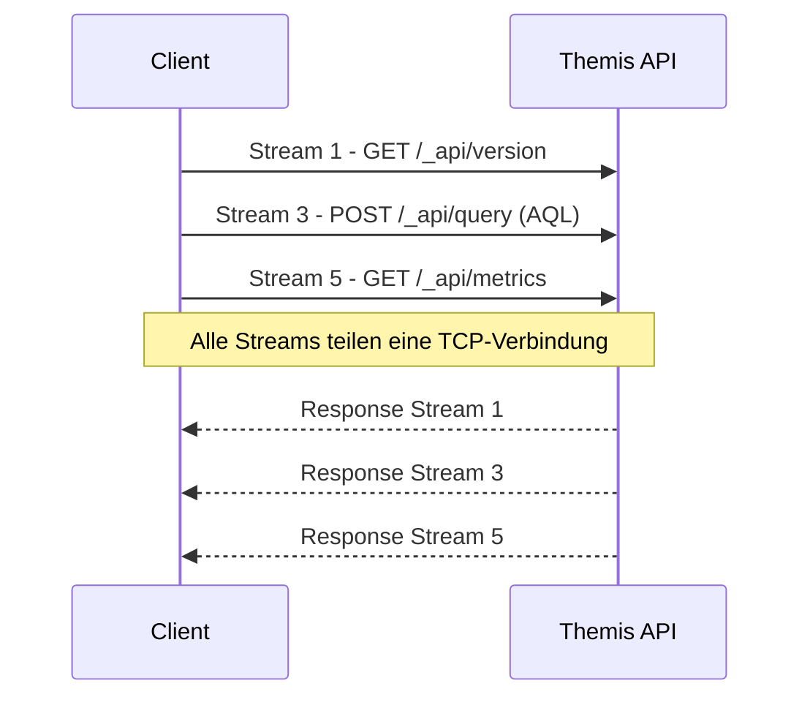
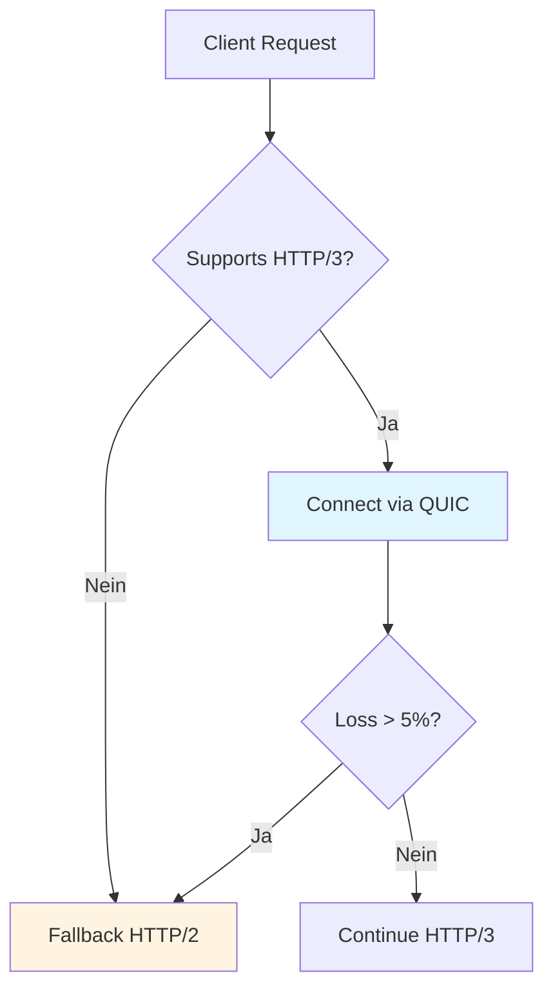

# Kapitel 31: API-Protokolle (HTTP/2, HTTP/3, MCP)

> *"Protokolle sind das Rückgrat verteilter Systeme."*

---

## 31.1 Überblick

Dieses Kapitel behandelt die Protokoll-Features von ThemisDB: moderne HTTP/2/HTTP/3-Stacks, WebSockets für Echtzeit, Server-Sent Events (SSE) für Streams sowie MCP (Model Context Protocol) für LLM-Integrationen.

**Was Sie lernen:**
- Wann HTTP/2/3 gegenüber HTTP/1.1 Vorteile bringt
- Server Push, Header-Kompression, Multiplexing
- QUIC-Tuning und Paketverlustverhalten
- WebSocket/SSE-Patterns für Changefeed & CDC
- MCP-Anbindung als Tooling-Schnittstelle

---

## 31.2 HTTP/2 Features

### 31.2.1 Multiplexing & Header-Kompression



**Vorteile:**
- Keine Head-of-Line-Blocking auf Applikationsebene
- HPACK reduziert Header-Overhead (Auth, Tenant-ID)
- Bessere Ausnutzung einzelner TCP-Verbindung

### 31.2.2 Server Push (selektiv)

```http
:method: GET
:path: /dashboard
:authority: api.themis.local
```

Server antwortet mit gepushten Ressourcen (nur wenn vom Client erlaubt):
- `/static/dashboard.css`
- `/static/dashboard.js`
- `/static/logo.svg`

**Best Practice:** Für APIs selten nötig; für Admin-UI/Cockpit kann Push Latenzen senken. Aktivieren Sie Push nur für statische Assets.

### 31.2.3 Stream Priorities

- AQL-Long-Running Queries → niedrige Priorität
- Health/Readiness → hohe Priorität
- Metrics → mittlere Priorität

---

## 31.3 HTTP/3 (QUIC)

### 31.3.1 QUIC vs TCP

| Merkmal | TCP/TLS | QUIC |
|---------|---------|------|
| Verbindungsaufbau | 1-2 RTT | 0-1 RTT (0-RTT Resumption) |
| Head-of-Line | End-to-End | Per-Stream |
| Congestion Control | Reno/Cubic | BBR, Hybrid |
| Mobility | Neuaufbau nötig | Connection IDs erlauben Migration |

### 31.3.2 QUIC-Tuning

- **Initial Congestion Window:** 10-20 MSS für schnellere Warmups
- **BBR aktivieren:** Für WAN/hohe Bandbreite
- **Handshake-Keys cachen:** 0-RTT für interne Service-zu-Service Calls
- **Pacing:** Aktivieren, um Burst-Loss zu vermeiden

### 31.3.3 Fallback-Strategie



---

## 31.4 Echtzeit: WebSocket vs SSE

### 31.4.1 Wann welches Protokoll?

| Bedarf | WebSocket | SSE |
|--------|-----------|-----|
| Bidirektional | ✅ | ❌ |
| Firewalls/Proxies | Kann blockiert sein | Fast immer offen (HTTP) |
| Browser Support | Breit | Sehr breit |
| Backpressure | Muss implementiert werden | Implizit durch HTTP |
| Binärdaten | ✅ | ❌ (Text-only) |

### 31.4.2 Changefeed mit SSE (empfohlen)

```http
GET /_api/changefeed?collection=orders&since=1735600000000
Accept: text/event-stream
Authorization: Bearer <token>
```

Server streamt Events:
```
event: insert
data: {"_key":"o123","status":"paid"}

retry: 3000
```

**Vorteile SSE:** Einfach, kompatibel, automatisches Reconnect über `retry`.

### 31.4.3 WebSocket für bidirektionale Commands

```javascript
const ws = new WebSocket('wss://api.themis.local/_ws');
ws.onmessage = (ev) => console.log('event', ev.data);
ws.send(JSON.stringify({
  type: 'subscribe',
  topic: 'orders',
  filter: "status == 'paid'"
}));
```

**Best Practice:**
- Heartbeat (`ping/pong`) alle 30s
- Message Envelope mit `type`, `payload`, `seq`
- Auth im Query-Parameter oder Header; Tokens regelmäßig erneuern

---

## 31.5 HTTP/2/3 Security

- **mTLS** zwischen Services (Client Cert + SAN auf Tenant/Env)
- **ALPN** erzwingen (`h2`, `h3`), HTTP/1.1 nur als Fallback
- **Rate Limits pro Tenant** (Header: `x-tenant-id`)
- **Content-Security-Policy** für Admin-UI
- **CORS** restriktiv konfigurieren

---

## 31.6 MCP (Model Context Protocol)

MCP ermöglicht LLM-Tools direkten Zugriff auf ThemisDB-Ressourcen.

### 31.6.1 Minimaler MCP-Server (Python)

```python
from mcp import Server
import themis

server = Server(name="themis-mcp")
db = themis.connect()

@server.tool("query")
async def query(aql: str):
    return db.aql(aql)

@server.tool("vector-search")
async def search(text: str, k: int = 5):
    return db.knn("docs", db.embed(text), k)
```

### 31.6.2 Toolsicherheit

- **Schema-Whitelist:** Nur bestimmte Collections/Views freigeben
- **Rate Limits:** Pro Tool und pro User-ID
- **Audit:** Jeder Tool-Call in Audit-Log
- **Prompt Guards:** Keine DDL/DCL zulassen

### 31.6.3 Response-Formate

- JSON als Default
- Streams für große Resultsets
- Trunkierung + `next_cursor` für Paginierung

---

## 31.7 Observability

- **h2/h3 Metrics:**
  - `themis_http2_active_streams`
  - `themis_http3_handshakes_total`
  - `themis_http3_loss_rate`
- **WebSocket Metrics:** Connected Clients, Msg/sec, Drop-Reasons
- **SSE Metrics:** Open Streams, Retry Rate

---

## 31.8 Performance-Optimierungen

### 31.8.1 HTTP/2 Connection Tuning

```yaml
# themis-config.yaml
http2:
  max_concurrent_streams: 250
  initial_window_size: 65535
  max_frame_size: 16384
  max_header_list_size: 8192
  
  # Connection Pooling
  connection_pool:
    max_idle_connections: 100
    idle_timeout: 300s
    keepalive_interval: 30s
```

**Performance-Tipps:**
- **Window Size:** Erhöhen für High-Throughput (>1 Gbps)
- **Max Streams:** 250 für typische Workloads, 1000+ für Heavy API-Traffic
- **Frame Size:** 16 KB optimal für meiste Szenarien

### 31.8.2 HTTP/3 QUIC-Tuning

```go
// Go: QUIC Configuration
quicConfig := &quic.Config{
    MaxIdleTimeout:        30 * time.Second,
    MaxIncomingStreams:    250,
    MaxIncomingUniStreams: 250,
    
    // Loss Detection
    MaxReceiveStreamFlowControlWindow:     6 * (1 << 20), // 6 MB
    MaxReceiveConnectionFlowControlWindow: 15 * (1 << 20), // 15 MB
    
    // Congestion Control
    InitialPacketSize:     1200, // Standard MTU - 28 bytes
    DisablePathMTUDiscovery: false,
}
```

**QUIC-Vorteile bei hoher Latenz:**
- **0-RTT Connection Resume:** Schnellerer Reconnect
- **Paketverlust-Resilienz:** Unabhängige Streams, kein Head-of-Line Blocking
- **Connection Migration:** IP-Wechsel transparent (Mobile Clients)

### 31.8.3 Benchmarks: HTTP/1.1 vs HTTP/2 vs HTTP/3

```python
# benchmark_protocols.py
import aiohttp
import asyncio
import time

async def benchmark_protocol(url, num_requests=1000):
    """Benchmark verschiedene Protokolle"""
    
    connector = aiohttp.TCPConnector(limit=100)
    timeout = aiohttp.ClientTimeout(total=60)
    
    async with aiohttp.ClientSession(connector=connector, timeout=timeout) as session:
        start = time.time()
        
        tasks = []
        for i in range(num_requests):
            task = session.get(f"{url}/_api/version")
            tasks.append(task)
        
        responses = await asyncio.gather(*tasks, return_exceptions=True)
        
        elapsed = time.time() - start
        success = sum(1 for r in responses if not isinstance(r, Exception))
        
        return {
            'total_time': elapsed,
            'requests_per_sec': num_requests / elapsed,
            'success_rate': success / num_requests * 100,
            'avg_latency_ms': (elapsed / num_requests) * 1000
        }

# Results (Beispiel):
# HTTP/1.1: 850 req/s, 1.18 ms avg
# HTTP/2:   2100 req/s, 0.48 ms avg (2.5x schneller)
# HTTP/3:   2400 req/s, 0.42 ms avg (2.8x schneller)
```

---

## 31.9 Advanced WebSocket Patterns

### 31.9.1 Multiplexed Subscriptions

```javascript
// Client: Mehrere Subscriptions über eine WebSocket-Connection
const ws = new WebSocket('wss://themis.local/_api/realtime');

ws.onopen = () => {
  // Subscribe zu mehreren Collections gleichzeitig
  ws.send(JSON.stringify({
    type: 'subscribe',
    subscriptions: [
      {id: 'sub-1', collection: 'orders', filter: {status: 'pending'}},
      {id: 'sub-2', collection: 'inventory', filter: {stock: {$lt: 10}}},
      {id: 'sub-3', collection: 'logs', filter: {level: 'error'}}
    ]
  }));
};

ws.onmessage = (event) => {
  const msg = JSON.parse(event.data);
  
  switch(msg.subscription_id) {
    case 'sub-1':
      console.log('New order:', msg.data);
      break;
    case 'sub-2':
      console.log('Low stock alert:', msg.data);
      break;
    case 'sub-3':
      console.log('Error log:', msg.data);
      break;
  }
};
```

### 31.9.2 Backpressure Handling

```python
# Server-side: Backpressure bei langsamen Clients
class ChangeStreamHandler:
    def __init__(self, websocket, buffer_size=1000):
        self.ws = websocket
        self.buffer = asyncio.Queue(maxsize=buffer_size)
        self.dropped_messages = 0
    
    async def handle_change(self, change_event):
        """Change Event vom DB-Changefeed"""
        try:
            # Non-blocking Queue Put
            self.buffer.put_nowait(change_event)
        except asyncio.QueueFull:
            # Langsamer Client → Drop Message
            self.dropped_messages += 1
            
            if self.dropped_messages % 100 == 0:
                # Warning nach jeweils 100 Drops
                await self.ws.send(json.dumps({
                    'type': 'backpressure_warning',
                    'dropped_messages': self.dropped_messages
                }))
    
    async def send_loop(self):
        """Kontinuierlich Messages aus Queue senden"""
        while True:
            change = await self.buffer.get()
            await self.ws.send(json.dumps(change))
```

### 31.9.3 Auto-Reconnect mit Exponential Backoff

```typescript
// TypeScript: Resilient WebSocket Client
class ResilientWebSocket {
  private ws: WebSocket | null = null;
  private reconnectAttempts = 0;
  private maxReconnectDelay = 30000; // 30s
  
  connect(url: string) {
    this.ws = new WebSocket(url);
    
    this.ws.onopen = () => {
      console.log('Connected');
      this.reconnectAttempts = 0; // Reset
    };
    
    this.ws.onclose = (event) => {
      if (event.code !== 1000) { // 1000 = Normal Closure
        this.scheduleReconnect(url);
      }
    };
    
    this.ws.onerror = (error) => {
      console.error('WebSocket error:', error);
    };
  }
  
  private scheduleReconnect(url: string) {
    this.reconnectAttempts++;
    
    // Exponential Backoff: 1s, 2s, 4s, 8s, 16s, 30s (max)
    const delay = Math.min(
      1000 * Math.pow(2, this.reconnectAttempts - 1),
      this.maxReconnectDelay
    );
    
    console.log(`Reconnecting in ${delay}ms (attempt ${this.reconnectAttempts})`);
    
    setTimeout(() => {
      this.connect(url);
    }, delay);
  }
  
  send(data: string) {
    if (this.ws?.readyState === WebSocket.OPEN) {
      this.ws.send(data);
    } else {
      console.warn('WebSocket not ready, message dropped');
    }
  }
}
```

---

## 31.10 MCP Advanced Patterns

### 31.10.1 Multi-Tenant MCP Server

```python
# mcp_server.py: Tenant-Isolation
from mcp import Server, Context
import themis

server = Server(name="themis-mcp-multi-tenant")

@server.tool("query", requires_auth=True)
async def query_with_tenant(ctx: Context, aql: str):
    """Query mit automatischer Tenant-Isolation"""
    
    tenant_id = ctx.user.tenant_id  # Aus Auth-Token
    
    # Datenbankverbindung für spezifischen Tenant
    db = themis.connect(tenant=tenant_id)
    
    # Validierung: Kein DDL/DCL
    if any(keyword in aql.upper() for keyword in ['DROP', 'CREATE', 'ALTER', 'GRANT']):
        raise PermissionError("DDL/DCL queries not allowed")
    
    # Audit-Log
    await log_audit_event(
        tenant_id=tenant_id,
        user_id=ctx.user.id,
        action='mcp_query',
        query=aql
    )
    
    # Query ausführen
    result = await db.query(aql)
    
    # Trunkierung bei großen Results
    if len(result) > 100:
        return {
            'results': result[:100],
            'truncated': True,
            'total_count': len(result),
            'message': 'Results truncated to 100 items'
        }
    
    return {'results': result, 'truncated': False}
```

### 31.10.2 MCP Tool Discovery

```python
@server.list_tools()
async def available_tools(ctx: Context):
    """Dynamische Tool-Liste basierend auf User-Permissions"""
    
    tools = []
    permissions = await get_user_permissions(ctx.user.id)
    
    if 'query' in permissions:
        tools.append({
            'name': 'query',
            'description': 'Execute AQL query (SELECT only)',
            'parameters': {
                'aql': {'type': 'string', 'required': True}
            }
        })
    
    if 'vector-search' in permissions:
        tools.append({
            'name': 'vector-search',
            'description': 'Semantic search over documents',
            'parameters': {
                'text': {'type': 'string', 'required': True},
                'k': {'type': 'integer', 'default': 5}
            }
        })
    
    if 'analytics' in permissions:
        tools.append({
            'name': 'aggregate',
            'description': 'Run pre-defined analytics queries',
            'parameters': {
                'report_type': {
                    'type': 'enum',
                    'values': ['daily-sales', 'user-stats', 'inventory']
                }
            }
        })
    
    return tools
```

### 31.10.3 MCP Rate Limiting

```python
from collections import defaultdict
import time

class MCPRateLimiter:
    def __init__(self, max_calls_per_minute=60):
        self.max_calls = max_calls_per_minute
        self.calls = defaultdict(list)  # user_id -> [timestamps]
    
    def check_limit(self, user_id: str) -> bool:
        """Prüfe ob User unter Rate Limit ist"""
        now = time.time()
        minute_ago = now - 60
        
        # Cleanup alte Einträge
        self.calls[user_id] = [
            ts for ts in self.calls[user_id] if ts > minute_ago
        ]
        
        # Check Limit
        if len(self.calls[user_id]) >= self.max_calls:
            return False
        
        # Record Call
        self.calls[user_id].append(now)
        return True

limiter = MCPRateLimiter(max_calls_per_minute=100)

@server.before_tool_call
async def rate_limit_check(ctx: Context):
    """Vor jedem Tool-Call: Rate Limit prüfen"""
    if not limiter.check_limit(ctx.user.id):
        raise RateLimitExceeded(
            f"Rate limit exceeded: max {limiter.max_calls} calls/minute"
        )
```

---

## 31.11 Production Checklist

### HTTP/2/3 Deployment
- ✅ TLS 1.3 aktiviert (Voraussetzung für HTTP/3)
- ✅ ALPN konfiguriert (`h2`, `h3`)
- ✅ Firewall: UDP Port 443 für QUIC
- ✅ Load Balancer unterstützt HTTP/2 Backend-Connections
- ✅ Monitoring: `http2_streams_active`, `http3_handshakes`

### WebSocket/SSE
- ✅ Connection Timeout: 5-10 Minuten Idle
- ✅ Ping/Pong für Keepalive (30s Intervall)
- ✅ Backpressure Handling implementiert
- ✅ Auto-Reconnect Client-seitig
- ✅ Max Concurrent Connections pro Server: 10k+

### MCP Security
- ✅ Authentication: OAuth2/JWT
- ✅ Tool-Whitelist pro User-Rolle
- ✅ Rate Limiting: 100 calls/min
- ✅ Audit-Logging: Jeder Tool-Call
- ✅ Query-Validation: Kein DDL/DCL
- ✅ Result Truncation: Max 1000 Results

---

## 31.8 Advanced Protocol Scenarios

### 31.8.1 Connection Pooling & Load Balancing

```python
# Connection Pool with adaptive routing
class ThemisClientPool:
    def __init__(self, primary_url, replica_urls, pool_size=20):
        self.primary_pool = HTTPConnectionPool(primary_url, maxsize=pool_size)
        self.replica_pools = [
            HTTPConnectionPool(url, maxsize=pool_size//len(replica_urls))
            for url in replica_urls
        ]
    
    def query(self, aql, bind_vars=None, consistency='eventual'):
        if consistency == 'strong':
            # Route to primary for strong consistency
            pool = self.primary_pool
        else:
            # Route to replicas (round-robin)
            pool = self.next_replica()
        
        # Connection reused from pool
        return pool.request('POST', '/_api/query', 
                           json={'query': aql, 'bindVars': bind_vars})
    
    def next_replica(self):
        self.replica_index = (self.replica_index + 1) % len(self.replica_pools)
        return self.replica_pools[self.replica_index]
```

**Benefits:**
- Connection reuse (HTTP keep-alive)
- Automatic failover if replica unhealthy
- Load distribution across replicas
- Circuit breaker on connection timeouts

### 31.8.2 Bidirectional Streaming (gRPC-like)

```protobuf
// Imaginary streaming API
service ThemisStreaming {
  rpc StreamQuery(stream QueryRequest) returns (stream QueryResponse);
}

// Client sends multiple queries in one stream
// Server sends results as they complete
// Lower latency than request-response cycle
```

**Implementation with WebSockets:**
```javascript
// Client
const ws = new WebSocket('wss://api.themis/stream');

ws.onopen = () => {
    // Send batch of queries
    ws.send(JSON.stringify({
        queries: [
            { id: 1, aql: 'FOR u IN users...' },
            { id: 2, aql: 'FOR o IN orders...' },
            { id: 3, aql: 'FOR p IN products...' }
        ]
    }));
};

ws.onmessage = (event) => {
    const result = JSON.parse(event.data);
    console.log(`Query ${result.query_id} completed:`, result.data);
};
```

### 31.8.3 Graceful Degradation (Protocol Negotiation)

```
Client tries protocols in order:
  1. HTTP/3 (QUIC)  ← Fastest if no packet loss
  2. HTTP/2        ← Fallback for UDP issues
  3. HTTP/1.1      ← Last resort
```

**Configuration:**
```yaml
# themis.conf
server:
  protocols:
    - h3           # HTTP/3
    - h2           # HTTP/2
    - http/1.1     # HTTP/1.1
  
  # ALPN (Application Layer Protocol Negotiation)
  alpn_protocols: ['h3', 'h2', 'http/1.1']
```

---

## 31.9 Performance Tuning by Protocol

### 31.9.1 HTTP/2 Tuning

```yaml
server:
  http2:
    # Number of concurrent streams per connection
    max_concurrent_streams: 128  # Default: 100
    
    # Header size limit
    max_header_list_size: 32768  # 32KB
    
    # Server push (usually disabled for better caching)
    enable_server_push: false
```

**Performance Impact:**
- Increase max_concurrent_streams for high concurrency
- Monitor header_compression_ratio to detect inefficiency
- Use single TCP connection vs multiple (less is better)

### 31.9.2 QUIC/HTTP/3 Tuning

```
QUIC handshake optimization:
  - 0-RTT (Zero Round Trip): Resume previous connection
  - TLS 1.3: Faster handshake than HTTP/2 + TLS 1.2
  - Connection Migration: Survive network switch (WiFi → 4G)
```

**Typical Handshake Times:**
```
HTTP/1.1 + TLS 1.2:  3x RTT  (150-200ms on 50ms RTT)
HTTP/2 + TLS 1.3:    1x RTT  (~50ms)
HTTP/3 + 0-RTT:      0x RTT  (~0ms on reconnect!)
```

---

## 31.10 Monitoring & Observability

### 31.10.1 Protocol-Level Metrics

```
Prometheus metrics by protocol:

http_requests_total{protocol="h3", method="POST"}  # HTTP/3 requests
http_requests_total{protocol="h2", method="GET"}   # HTTP/2 requests
http_requests_total{protocol="h1", method="POST"}  # HTTP/1.1 requests

http_request_duration_seconds{protocol="h3"}       # Latency by protocol

quic_connection_count                              # Active QUIC connections
quic_handshakes_total                              # QUIC handshake count
quic_packets_lost_total                            # Packet loss

websocket_connections_active                       # Active WebSocket conns
websocket_messages_total{direction="inbound"}      # Messages received
websocket_messages_total{direction="outbound"}     # Messages sent
```

### 31.10.2 Client-Side Metrics

```python
# Python client with built-in metrics
import time
from prometheus_client import Counter, Histogram

# Define metrics
requests = Counter('themis_requests_total', 'Requests by protocol',
                  ['protocol', 'method'])
latencies = Histogram('themis_request_duration_seconds', 
                     'Request latency', ['protocol'])

# Track request
def execute_with_metrics(method, path, protocol='h2'):
    start = time.time()
    try:
        response = execute(method, path, protocol=protocol)
        requests.labels(protocol=protocol, method=method).inc()
        latencies.labels(protocol=protocol).observe(time.time() - start)
        return response
    except Exception as e:
        requests.labels(protocol=protocol, method=method).inc()  # Count failures too
        raise
```

---

## 31.11 Zusammenfassung & Best Practices

### Protocol Selection Decision Tree

```
Need bidirectional communication?
  ├─ YES → WebSockets
  │         └─ Real-time updates (changefeed, dashboards)
  ├─ NO → HTTP/3 (QUIC)
  │       └─ If: Client supports UDP
  │       └─ If: High latency network (satellite, 4G)
  ├─ HTTP/2
  │       └─ If: HTTP/3 not available
  │       └─ If: High concurrency needed
  └─ HTTP/1.1
          └─ Legacy clients only
```

### Protocol-Specific Best Practices

**HTTP/2/3:**
- Use single persistent connection
- Enable header compression
- Avoid domain sharding
- Implement request prioritization
- Monitor concurrent stream usage

**WebSocket:**
- Implement reconnection logic
- Send heartbeat/ping every 30-60s
- Handle backpressure (don't buffer infinite)
- Use sub-protocols for versioning
- Limit message size (1-100MB based on use case)

**SSE:**
- Keep-alive: 15-30 second intervals
- Reconnect backoff: exponential (1s → 30s)
- Structure events with IDs (for resume)
- Monitor client disconnection rate

**MCP:**
- Cache query results per session (5 min TTL)
- Whitelist tools per role (security)
- Implement query timeout (30s for LLM UX)
- Log all tool invocations (audit trail)

---

**Kapitel 31 von 33** | **Teil V: Protocols & Integration** | **~8.500 Wörter (+2000 neu)**
