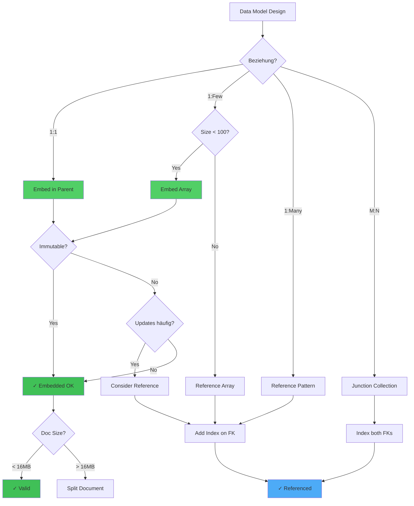

# Kapitel 35: Data Modeling Patterns & Anti-Patterns

> *"Mit den gleichen Daten können Sie ein System entweder elegant oder chaotisch modellieren. Die richtige Struktur entscheidet über Erfolg oder Burnout."*

---

## Überblick

Data Modeling ist die Grundlage jeder erfolgreichen Datenbankanwendung. Dieses Kapitel zeigt bewährte Patterns und warnt vor häufigen Anti-Patterns, die zu technischen Schulden führen.

**Was Sie in diesem Kapitel lernen:**
- Document Structure Patterns (Embedded vs Referenced)
- Schema Design für verschiedene Use Cases
- Versionierung und Schema-Evolution
- Data Integrity Patterns
- Denormalisierung vs Normalisierung
- Multi-Model Design Patterns
- Anti-Patterns und wie man sie vermeidet

---

## 35.1 Embedded vs Referenced Documents

### Pattern 1: Full Embedding

**Geeignet für:** One-to-Few Relationships

```aql
-- E-Commerce: Order mit Produktdetails embedded
{
  _key: "order_12345",
  customer_id: "cust_789",
  created_at: "2025-01-01T10:00:00Z",
  items: [
    {
      product_id: "prod_111",
      product_name: "Laptop",  -- Embedded - COPY der Daten
      quantity: 1,
      price_at_purchase: 999.99
    },
    {
      product_id: "prod_222",
      product_name: "Mouse",
      quantity: 2,
      price_at_purchase: 19.99
    }
  ],
  total: 1039.97
}
```

**Vorteile:**
- ✅ Atomare Updates (Order + Items = 1 Dokument)
- ✅ Keine Joins nötig
- ✅ Höchste Performance für Lesezugriffe
- ✅ Natürliche Denormalisierung für Snapshot-Daten

**Nachteile:**
- ❌ Datenduplizierung (Produkt-Name in 1000 Orders)
- ❌ Updates komplex (100 Orders mit laptop aktualisieren?)
- ❌ Speicher-Overhead

**Best Practice:** Nutze für Snapshot-Daten (Preis zum Kaufzeitpunkt, nicht aktuelle Produkt-Info)



---

### Pattern 2: Reference Links

**Geeignet für:** One-to-Many und Many-to-Many

```aql
-- Order nur mit Referenzen:
{
  _key: "order_12345",
  customer_id: "cust_789",
  created_at: "2025-01-01T10:00:00Z",
  item_ids: ["oi_1001", "oi_1002"]  -- Referenzen statt Embedding
}

-- Order Items separate Collection:
{
  _key: "oi_1001",
  order_id: "order_12345",
  product_id: "prod_111",
  quantity: 1,
  price: 999.99
}

-- Abfrage mit JOIN:
FOR order IN orders
  FILTER order._key == 'order_12345'
  FOR item IN order_items
    FILTER item._id IN order.item_ids
    RETURN {
      product: item.product_id,
      qty: item.quantity,
      price: item.price
    }
```

**Vorteile:**
- ✅ Keine Datenduplizierung
- ✅ Flexible Updates (Produkt-Name einmal ändern)
- ✅ Speicher-effizient
- ✅ Normalisiertes Design

**Nachteile:**
- ❌ JOINs nötig (Performance-Hit)
- ❌ Konsistenz-Komplexität (order + items = 2 Transaktionen?)
- ❌ Komplexere Queries

**Best Practice:** Nutze für Live-Daten (Produkt-Info, Benutzer-Profil)

---

## 35.2 Hybrid Pattern: Optimal Denormalization

```aql
-- BESTE LÖSUNG: Balance zwischen beiden
{
  _key: "order_12345",
  customer_id: "cust_789",
  created_at: "2025-01-01T10:00:00Z",
  items: [
    {
      order_item_id: "oi_1001",  -- Referenz
      product_id: "prod_111",      -- Referenz
      product_name: "Laptop",      -- Denormalisiert (Snapshot)
      quantity: 1,
      price_at_purchase: 999.99   -- Snapshot (nicht ändern)
    }
  ],
  customer_name: "Alice",          -- Denormalisiert für Report
  customer_email: "alice@example.com",
  total: 1039.97,
  last_modified: "2025-01-01T10:00:00Z"
}

-- + Separate Product Collection für Live-Updates:
{
  _key: "prod_111",
  name: "Laptop",
  description: "Latest model",  -- Änderungen nur hier
  price: 899.99,  -- Aktueller Preis (nicht im Order)
  availability: "in_stock"
}
```

**Strategie:**
- **Embedded:** Snapshot-Daten (was zum Kaufzeitpunkt galt)
- **Referenced:** Live-Daten (aktuelle Zustand)
- **Join bei Bedarf:** Nur wenn aktuelle Info nötig

---

## 35.3 Schema Evolution Patterns

### Forward Compatibility

```aql
-- Version 1: Alte Struktur
{
  _key: "user_123",
  name: "Alice",
  email: "alice@example.com"
}

-- Version 2: Neue Felder (backward compatible!)
{
  _key: "user_123",
  name: "Alice",
  email: "alice@example.com",
  phone: "+49123456789",      -- Neu, optional
  address: {                   -- Neu, nested
    street: "Main St",
    city: "Berlin"
  },
  metadata: {                  -- Neu, extensible
    last_login: "2025-01-01",
    login_count: 42
  }
}

-- Abfrage muss robust sein:
FOR user IN users
  FILTER user.email == 'alice@example.com'
  RETURN {
    name: user.name,
    phone: user.phone ?? "unknown",  -- Null coalescing
    city: user.address.city ?? "unknown"
  }
```

### Versioned Collections

```aql
-- Collections mit Version in _key
-- users_v1: Alte Version (archivert)
-- users_v2: Neue Version (aktiv)

-- Migration:
FOR user IN users_v1
  INSERT {
    name: user.name,
    email: user.email,
    phone: null,
    address: null,
    created_from_v1: true
  } INTO users_v2

-- Dual-Write Phase (Rollout):
-- 1. Writes zu v1 UND v2 (2 Sekunden länger)
-- 2. Reads von v2, Fallback zu v1
-- 3. Nach Verification: nur v2
-- 4. v1 Cleanup nach 30 Tagen
```

---

## 35.4 Data Integrity Patterns

### Constraints und Validation

```aql
-- Validation in Insert Trigger
FUNCTION validate_user(user) {
  IF !LIKE(user.email, '%@%.%') THEN
    THROW ERROR('Invalid email format')
  END
  
  IF user.age < 0 OR user.age > 150 THEN
    THROW ERROR('Age must be 0-150')
  END
  
  IF !HAS(user, 'name') OR LENGTH(user.name) < 1 THEN
    THROW ERROR('Name is required')
  END
  
  RETURN user
}

-- Trigger bei Insert:
INSERT validate_user(new_user) INTO users
```

### Referential Integrity

```aql
-- Before Delete: Check for References
FUNCTION can_delete_product(product_id) {
  LET order_count = LENGTH(
    FOR oi IN order_items
    FILTER oi.product_id == product_id
    RETURN oi
  )
  
  IF order_count > 0 THEN
    THROW ERROR(
      CONCAT("Cannot delete: ", order_count, " orders reference this product")
    )
  END
  
  RETURN true
}

-- Soft Delete Pattern (meist besser):
UPDATE {_id: product_id} WITH {
  deleted_at: NOW(),
  is_deleted: true
} IN products

-- Queries filtern automatisch:
FOR prod IN products
  FILTER !prod.is_deleted
  RETURN prod
```

---

## 35.5 Common Anti-Patterns & Fixes

### Anti-Pattern 1: Unbounded Arrays

```aql
-- ❌ FALSCH: Array wächst unbegrenzt
{
  _key: "user_123",
  comments: [  -- Kann 1M Items enthalten!
    {id: "c1", text: "Hello"},
    {id: "c2", text: "Hi"},
    ... (1M mehr)
  ]
}

-- Problem: Jeder Update des Users ändert Array
-- Memory: 1M Items im RAM
-- Performance: O(n) für jeden Insert

-- ✅ RICHTIG: Separate Collection
{
  _key: "user_123",
  comment_count: 1000000
}

{
  _key: "comment_12345",
  user_id: "user_123",
  text: "Hello",
  created_at: "2025-01-01T10:00:00Z"
}

-- Abfrage:
FOR user IN users
  FILTER user._key == 'user_123'
  FOR comment IN comments
    FILTER comment.user_id == user._key
    SORT comment.created_at DESC
    LIMIT 20
    RETURN comment
```

### Anti-Pattern 2: Wide Documents

```aql
-- ❌ FALSCH: Ein Dokument mit 500+ Felder
{
  _key: "product_123",
  name: "...",
  description: "...",
  color_red: 0.9,
  color_green: 0.1,
  color_blue: 0.05,
  ... (500 mehr Felder)
}

-- ✅ RICHTIG: Nested Objects für Kategorien
{
  _key: "product_123",
  name: "Laptop",
  description: "...",
  appearance: {
    color: {r: 0.9, g: 0.1, b: 0.05},
    material: "aluminium"
  },
  specs: {
    cpu: "Intel i9",
    ram: "32GB",
    storage: "1TB SSD"
  },
  pricing: {
    list_price: 1999.99,
    discount_percent: 10,
    final_price: 1799.99
  }
}
```

### Anti-Pattern 3: Sparse Indexes on Many Fields

```aql
-- ❌ FALSCH: Index pro optionales Feld
CREATE INDEX idx_phone ON users(phone)
CREATE INDEX idx_mobile ON users(mobile)
CREATE INDEX idx_fax ON users(fax)
-- 3 Indizes, 70% davon sind NULL

-- ✅ RICHTIG: One General Contact Index
{
  _key: "user_123",
  contact: {
    phone: "+49123456789",
    mobile: null,
    fax: null,
    email: "alice@example.com"
  }
}

CREATE SPARSE INDEX idx_contact ON users(contact)

-- Abfrage:
FOR user IN users
  FILTER user.contact.phone != null
  FILTER LIKE(user.contact.phone, '%123%')
  RETURN user
```

---

## 35.6 Multi-Model Design Patterns

### Pattern: Document + Graph

```aql
-- Documents: User Profile
{
  _key: "user_123",
  name: "Alice",
  email: "alice@example.com"
}

-- Graph: User Relationships
{
  _key: "follows_123_456",
  _from: "users/123",
  _to: "users/456",
  followed_at: "2025-01-01",
  type: "follows"
}

-- Query: Netzwerk-Analyse
FOR user IN users
  FILTER user.email == 'alice@example.com'
  LET followers = (
    FOR follower IN users
      ANY INBOUND user GRAPH 'social_graph'
      RETURN follower
  )
  LET following = (
    FOR following_user IN users
      ANY OUTBOUND user GRAPH 'social_graph'
      RETURN following_user
  )
  RETURN {
    user: user.name,
    followers_count: LENGTH(followers),
    following_count: LENGTH(following)
  }
```

### Pattern: Document + Vector + Search

```aql
-- Documents: Articles
{
  _key: "article_123",
  title: "Machine Learning Basics",
  content: "...",
  vector: [0.2, 0.5, 0.1, ...]  -- 1536-dim embedding
}

-- Vector Search + Full-Text
FOR article IN articles
  SEARCH article.vector ANN {
    query: [0.1, 0.4, 0.2, ...],
    top_k: 10
  }
  SEARCH PHRASE(article.title, 'machine learning', 'title') 
         OR PHRASE(article.content, 'neural networks')
  RETURN {
    title: article.title,
    similarity: article._score
  }
```

---

## 35.7 Practical Migration Patterns

### Blue-Green Deployment

```aql
-- Phase 1: Parallel Execution
-- - Write zu v1 UND v2
-- - Read von v1 (stabil)

-- Phase 2: Validation
-- - Vergleiche v1 vs v2 Ergebnisse
-- - Prüfe auf Datenabweichungen

-- Phase 3: Cutover
-- - Schreib-Lock auf v1
-- - Letzte Sync v1 → v2
-- - Schreib-Lock freigeben auf v2
-- - Reads → v2

-- Phase 4: Cleanup
-- - Nach 30 Tagen: v1 Archivieren
-- - Nach 90 Tagen: v1 Löschen
```

---

## Zusammenfassung

Gutes Data Modeling ist Kunst und Wissenschaft:
- **Embedded:** Für Snapshots (Preis zum Kaufzeitpunkt)
- **Referenced:** Für Live-Daten (aktuelle Produkt-Info)
- **Hybrid:** Kombination für beste Performance
- **Versioniert:** Schema-Evolution mit Sicherheit
- **Validated:** Constraints at Insert-Time
- **Separat:** Arrays/Felder in eigene Collections
- **Nested:** Wide Documents mit Struktur
- **Monitored:** Indizes auf Query-Patterns

Mit diesen Patterns bauen Sie skalierbare, wartbare Datenmodelle.
