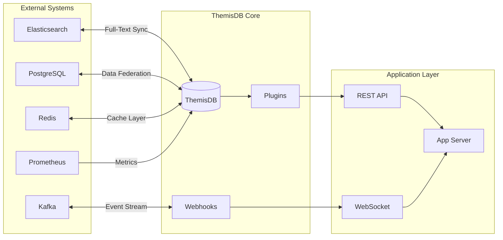

# Kapitel 37: Ecosystem Integration & Extensions

> *"ThemisDB ist nicht nur eine Datenbank - es ist die Mittellage in einem größeren Ökosystem von Tools, Services und Integrationen."*

---

## Überblick

Dieses Kapitel zeigt, wie ThemisDB mit externen Systemen integriert wird und wie Sie Custom Extensions schreiben, um ThemisDB an spezifische Anforderungen anzupassen.

**Was Sie in diesem Kapitel lernen:**
- Native Integrations mit populären Tools
- Custom Function Development
- Plugin Architecture
- Webhook & Event Streaming
- Third-party Library Support
- Custom Data Type Extensions
- Performance Monitoring Integrations
- Cross-database Synchronization



---

## 37.1 Beliebte Integrationen

### Elasticsearch Integration

```python
# elasticsearch_sync.py
from elasticsearch import Elasticsearch
import themis_client

class ElasticsearchSync:
    def __init__(self, themis_conn, es_host='localhost:9200'):
        self.themis = themis_client.connect(themis_conn)
        self.es = Elasticsearch([es_host])
    
    def sync_documents_to_elasticsearch(self, collection_name, query=None):
        """Sync ThemisDB documents to Elasticsearch"""
        # Query documents from ThemisDB
        aql = f"FOR doc IN {collection_name}"
        if query:
            aql += f" FILTER {query}"
        aql += " RETURN doc"
        
        docs = self.themis.execute(aql)
        
        # Bulk insert into Elasticsearch
        from elasticsearch.helpers import bulk
        actions = [
            {
                "_index": collection_name,
                "_id": doc['_id'],
                "_source": doc
            }
            for doc in docs
        ]
        
        bulk(self.es, actions)
        return len(actions)
    
    def search_with_fallback(self, query, collection_name):
        """Search in Elasticsearch, fallback to ThemisDB"""
        try:
            # Try ES first (faster)
            results = self.es.search(
                index=collection_name,
                body={"query": {"match": {"_all": query}}}
            )
            return results['hits']['hits']
        except Exception:
            # Fallback to ThemisDB full-text search
            aql = f"FOR doc IN {collection_name} SEARCH {query} RETURN doc"
            return self.themis.execute(aql)
```

### Kafka Event Streaming

```yaml
# kafka-integration.yaml
themes_db_events:
  topics:
    - name: "themis.inserts"
      partitions: 10
      retention: "7d"
      events: "INSERT operations"
    
    - name: "themis.updates"
      partitions: 10
      retention: "7d"
      events: "UPDATE operations"
    
    - name: "themis.deletes"
      partitions: 10
      retention: "7d"
      events: "DELETE operations"

producers:
  - name: "themis-cdc"
    topics: ["themis.inserts", "themis.updates", "themis.deletes"]
    format: "avro"
    compression: "snappy"

consumers:
  - name: "elasticsearch-sync"
    topics: ["themis.*"]
    group_id: "es-sync-group"
  
  - name: "analytics-pipeline"
    topics: ["themis.*"]
    group_id: "analytics-group"
```

### Prometheus Metrics

```python
# prometheus_integration.py
from prometheus_client import Counter, Histogram, Gauge
import themis_client

class ThemisPrometheus:
    def __init__(self):
        # Operation counters
        self.query_counter = Counter(
            'themis_queries_total',
            'Total queries executed',
            ['operation_type', 'collection']
        )
        
        # Query latency histogram
        self.query_latency = Histogram(
            'themis_query_duration_seconds',
            'Query execution time',
            ['operation_type'],
            buckets=[0.001, 0.01, 0.1, 1, 10]
        )
        
        # Database size gauge
        self.db_size = Gauge(
            'themis_database_bytes',
            'Database size in bytes'
        )
        
        # Connection pool
        self.active_connections = Gauge(
            'themis_connections_active',
            'Active database connections'
        )
    
    def record_query(self, operation_type, collection, duration_ms):
        self.query_counter.labels(
            operation_type=operation_type,
            collection=collection
        ).inc()
        
        self.query_latency.labels(
            operation_type=operation_type
        ).observe(duration_ms / 1000)
```

---

## 37.2 Custom Function Development

### Creating Custom AQL Functions

```aql
-- Register custom function
FUNCTION CUSTOM_DISTANCE(lat1, lon1, lat2, lon2) {
  -- Haversine distance formula
  LET R = 6371  -- Earth radius in km
  LET dLat = RADIANS(lat2 - lat1)
  LET dLon = RADIANS(lon2 - lon1)
  LET a = POWER(SIN(dLat/2), 2) + COS(RADIANS(lat1)) * COS(RADIANS(lat2)) * POWER(SIN(dLon/2), 2)
  LET c = 2 * ASIN(SQRT(a))
  RETURN R * c
}

-- Usage:
FOR user IN users
  LET distance = CUSTOM_DISTANCE(
    51.5074, -0.1278,  -- London coords
    user.latitude, user.longitude
  )
  FILTER distance < 10  -- Within 10km
  RETURN {name: user.name, distance: distance}
```

### External Function Binding (C++)

```cpp
// custom_functions.cpp
#include <aql/function_registry.h>

class CustomFunctions : public FunctionRegistry {
public:
    Value distance_haversine(
        Value lat1, Value lon1,
        Value lat2, Value lon2
    ) {
        const double R = 6371;  // Earth radius
        double dLat = (lat2.asDouble() - lat1.asDouble()) * M_PI / 180;
        double dLon = (lon2.asDouble() - lon1.asDouble()) * M_PI / 180;
        
        double a = sin(dLat/2) * sin(dLat/2) +
                   cos(lat1.asDouble() * M_PI / 180) * 
                   cos(lat2.asDouble() * M_PI / 180) *
                   sin(dLon/2) * sin(dLon/2);
        
        double c = 2 * asin(sqrt(a));
        return Value::fromDouble(R * c);
    }
};

// Register at startup
REGISTER_FUNCTION("CUSTOM_DISTANCE", &CustomFunctions::distance_haversine);
```

---

## 37.3 Plugin Architecture

### Creating a Plugin

```python
# custom_plugin.py
from themis_plugin_api import Plugin, Hook

class MyAnalyticsPlugin(Plugin):
    name = "my-analytics"
    version = "1.0.0"
    description = "Custom analytics for ThemisDB"
    
    def on_insert(self, collection, document):
        """Called after INSERT"""
        self.log_event('insert', collection, document)
        self.update_analytics(collection)
    
    def on_update(self, collection, old_doc, new_doc):
        """Called after UPDATE"""
        self.log_event('update', collection, new_doc)
        self.track_changes(old_doc, new_doc)
    
    def on_delete(self, collection, document):
        """Called after DELETE"""
        self.log_event('delete', collection, document)
        self.update_analytics(collection)
    
    def log_event(self, operation, collection, doc):
        event = {
            'operation': operation,
            'collection': collection,
            'timestamp': now(),
            'doc_id': doc['_id']
        }
        self.db.insert_event(event)
    
    def update_analytics(self, collection):
        # Compute analytics stats
        count = self.db.count(collection)
        avg_size = self.db.avg_document_size(collection)
        self.db.update_analytics({
            'collection': collection,
            'count': count,
            'avg_size': avg_size
        })
```

### Plugin Configuration

```yaml
# plugins.yaml
plugins:
  - name: my-analytics
    enabled: true
    config:
      event_log_collection: "analytics_events"
      update_interval_seconds: 60
      
  - name: elasticsearch-sync
    enabled: true
    config:
      es_host: "localhost:9200"
      sync_interval_seconds: 5
      
  - name: slack-notifications
    enabled: true
    config:
      webhook_url: "${SLACK_WEBHOOK_URL}"
      notify_on: ["high_latency", "errors", "replication_lag"]
```

---

## 37.4 Webhooks & Events

### Webhook Configuration

```aql
-- Register webhook
FUNCTION create_webhook(url, collection, events) {
  RETURN INSERT {
    url: url,
    collection: collection,
    events: events,  -- ["insert", "update", "delete"]
    active: true,
    created_at: NOW(),
    retry_count: 0,
    last_triggered: null
  } INTO webhooks
}

-- Setup:
create_webhook(
  'https://api.example.com/webhooks/themis',
  'users',
  ['insert', 'update']
)
```

### Event Payload

```json
{
  "event_id": "evt_abc123",
  "timestamp": "2026-01-01T09:00:00Z",
  "event_type": "insert",
  "collection": "users",
  "document": {
    "_id": "users/123",
    "_key": "123",
    "name": "Alice",
    "email": "alice@example.com"
  },
  "metadata": {
    "version": "1.3.1",
    "source": "direct_insert",
    "user_id": "admin_001"
  }
}
```

### Webhook Handler Implementation

```python
# webhook_handler.py
from flask import Flask, request
import hmac
import hashlib
import json

app = Flask(__name__)
WEBHOOK_SECRET = "your-secret-key"

@app.route('/webhooks/themis', methods=['POST'])
def handle_themis_webhook():
    # Verify signature
    signature = request.headers.get('X-Themis-Signature')
    body = request.get_data()
    
    expected_sig = hmac.new(
        WEBHOOK_SECRET.encode(),
        body,
        hashlib.sha256
    ).hexdigest()
    
    if not hmac.compare_digest(signature, expected_sig):
        return {'error': 'Invalid signature'}, 401
    
    # Process event
    event = request.json
    if event['event_type'] == 'insert':
        handle_user_insert(event['document'])
    elif event['event_type'] == 'update':
        handle_user_update(event['document'])
    
    return {'ok': True}, 200

def handle_user_insert(user):
    # Send welcome email
    send_email(user['email'], 'Welcome!')
    
    # Add to mailing list
    add_to_newsletter(user['email'])

def handle_user_update(user):
    # Update external systems
    sync_to_crm(user)
```

---

## 37.5 Data Type Extensions

### Custom Scalar Type

```cpp
// custom_types.cpp
class PhoneNumber {
public:
    std::string country_code;
    std::string area_code;
    std::string number;
    
    std::string toString() {
        return country_code + " (" + area_code + ") " + number;
    }
    
    static PhoneNumber fromString(const std::string& str) {
        // Parse format: "+1 (555) 1234567"
        PhoneNumber phone;
        // ... parsing logic
        return phone;
    }
};

// Register with ThemisDB type system
REGISTER_CUSTOM_TYPE("PhoneNumber", PhoneNumber);

// Use in AQL:
// INSERT {phone: PhoneNumber("+1 (555) 1234567")} INTO users
```

---

## 37.6 Cross-Database Synchronization

### Bidirectional Sync with PostgreSQL

```python
# sync_postgres.py
import psycopg2
import themis_client

class PostgresThemisSync:
    def __init__(self, themis_conn, pg_conn):
        self.themis = themis_client.connect(themis_conn)
        self.pg = psycopg2.connect(pg_conn)
    
    def sync_themis_to_postgres(self, collection, pg_table):
        """ThemisDB → PostgreSQL"""
        # Read from ThemisDB
        docs = self.themis.execute(
            f"FOR doc IN {collection} RETURN doc"
        )
        
        # Write to PostgreSQL
        cursor = self.pg.cursor()
        for doc in docs:
            cursor.execute(
                f"INSERT INTO {pg_table} VALUES (%s, %s, %s) "
                f"ON CONFLICT (_id) DO UPDATE SET data = %s",
                (doc['_id'], doc['_rev'], json.dumps(doc), json.dumps(doc))
            )
        
        self.pg.commit()
        cursor.close()
    
    def sync_postgres_to_themis(self, pg_table, collection):
        """PostgreSQL → ThemisDB"""
        cursor = self.pg.cursor()
        cursor.execute(f"SELECT * FROM {pg_table} WHERE updated_at > %s", (self.last_sync,))
        
        rows = cursor.fetchall()
        for row in rows:
            doc = self._row_to_doc(row)
            self.themis.execute(
                f"UPSERT {{'_id': {doc['_id']}}} "
                f"INSERT {doc} "
                f"INTO {collection}"
            )
        
        cursor.close()
```

---

## Zusammenfassung

ThemisDB-Ökosystem bietet:
- ✅ **Native Integrations** - Elasticsearch, Kafka, Prometheus
- ✅ **Custom Functions** - AQL + C++ für Domain-Logik
- ✅ **Plugins** - Extensible hooks für Custom Behavior
- ✅ **Webhooks** - Event-driven integrations
- ✅ **Custom Types** - Domain-specific data types
- ✅ **Cross-DB Sync** - Bidirektional mit PostgreSQL, MongoDB
- ✅ **Open API** - Python, Go, JavaScript SDKs

Mit diesen Tools integrieren Sie ThemisDB in jedes bestehende System.
