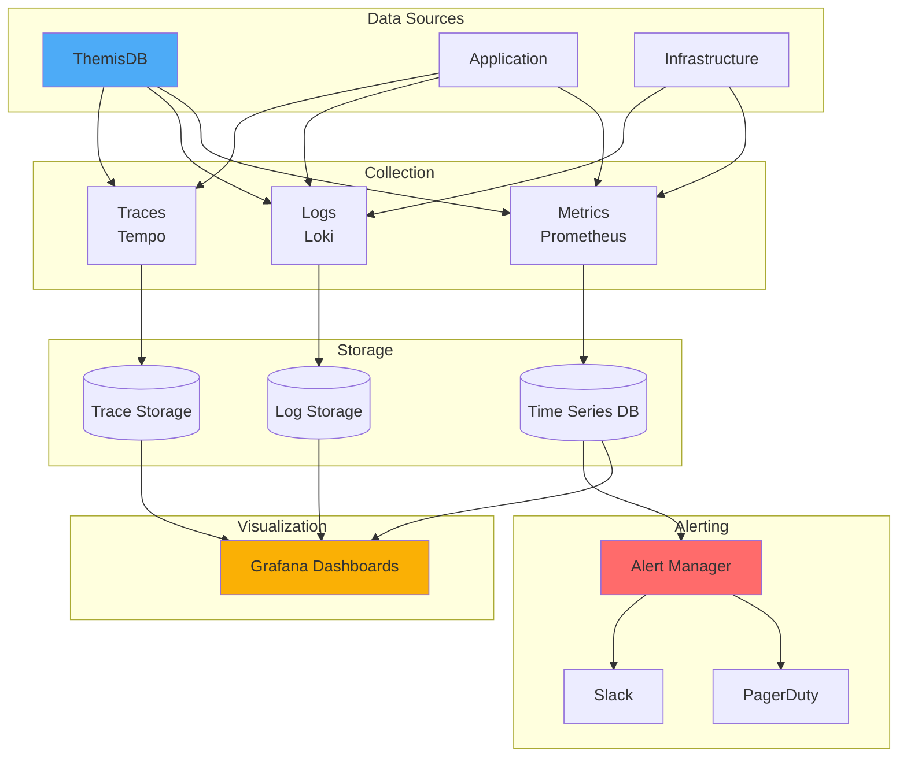

# Kapitel 38: Observability & SRE Playbook

> "Ohne Metriken, Logs und Traces bleiben Incidents Rätselraten. Observability ist die Brücke zwischen Symptom und Ursache."

---

## Überblick

Dieses Kapitel liefert ein praktisches Observability- und SRE-Playbook für ThemisDB-Deployments. Es bündelt Metriken, Logs, Traces, Dashboards, SLOs, Alerts und Runbooks.

**Was Sie lernen:**
- Kernmetriken (DB, System, Netzwerk)
- Log-Formate, Parsing, Korrelation
- Distributed Tracing für AQL Requests
- Dashboards für Latenz, Fehler, Replikation, Speicherdruck
- SLO/SLI-Definitionen und Error Budgets
- Alerting-Design und Rauschreduktion
- Runbooks für die häufigsten Störungen
- Chaos- und GameDay-Checklisten

**Voraussetzungen:** Basiswissen aus Monitoring (Kapitel 19) und Troubleshooting (Kapitel 27).



---

## 38.1 Metriken (What to Measure)

### Core DB Metriken

- Query Latenz (p50/p95/p99)
- Query Throughput (qps)
- Slow Queries count
- Active Connections
- Replication Lag (ms)
- WAL/Commit Queue Depth
- Memory Usage (RSS, Cache Hit Rate)
- Disk IO (IOPS, Latency, Queue Depth)
- Index Hit Rate
- Cache Evictions

### System Metriken

- CPU: user/system/iowait
- Memory: used, available, page faults
- Disk: iops, latency, utilization
- Network: rx/tx bytes, errors, retransmits

### AQL-Spezifisch

- Query Type Mix (read/write/graph/vector)
- Cursor Count / Leaks
- Transaction Duration
- Deadlocks detected
- Timeouts per operation

---

## 38.2 Logging

### Strukturierte Logs

```json
{
  "ts": "2026-01-01T10:00:00Z",
  "level": "INFO",
  "service": "themisdb",
  "component": "aql",
  "event": "query_executed",
  "trace_id": "abc123",
  "span_id": "def456",
  "duration_ms": 32,
  "collection": "users",
  "operation": "READ",
  "status": "ok"
}
```

**Best Practices:**
- JSON Lines, ein Event pro Zeile
- Pflichtfelder: ts, level, service, component, trace_id
- Keine PII in Logs; IDs statt Freitext
- Rotate & Compress (zstd)

### Log-Pipeline

- Agent: Filebeat/FluentBit (TLS, backpressure)
- Parse: grok/json; enrich (host, cluster, env)
- Store: Loki/Elastic/OpenSearch
- Retention: 7-30 Tage (Hot), 90+ Tage (Cold/Glacier)

---

## 38.3 Tracing

### OpenTelemetry Setup (Go API Layer)

```go
// tracing.go
import "go.opentelemetry.io/otel"
import "go.opentelemetry.io/otel/exporters/otlp/otlptrace/otlptracehttp"
import "go.opentelemetry.io/otel/sdk/trace"

func InitTracer(endpoint string) func() {
    exporter, _ := otlptracehttp.New(context.Background(), otlptracehttp.WithEndpoint(endpoint))
    tp := trace.NewTracerProvider(trace.WithBatcher(exporter))
    otel.SetTracerProvider(tp)
    return func() { _ = tp.Shutdown(context.Background()) }
}
```

### AQL Trace-Injektion

- Propagiere `traceparent` Header vom API Gateway ins AQL Layer
- Schreibe `trace_id` in Query-Context → Log-Korrelation
- Sample Rate: 1-10% in Produktion; 100% in Staging

---

## 38.4 Dashboards (Grafana)

### Latenz & Throughput

Panels:
- Query p50/p95/p99 (stacked per operation)
- QPS split by read/write/graph/vector
- Error rate (% per op)

### Replikation

- Lag per follower (ms)
- Failed replications (count)
- WAL queue depth

### Ressourcen

- CPU (per node)
- Memory (rss, cache hit rate)
- Disk IOPS & Latency
- Network retransmits

### Cache & Index

- Cache evictions/sec
- Index hit rate
- Slow queries over threshold

---

## 38.5 SLI/SLO & Error Budgets

### Beispiel-SLIs

- Availability: 99.95% (HTTP 2xx/3xx / total)
- Latency: p99 < 200 ms für Reads, < 400 ms für Writes
- Durability: 0 Datenverlust (RPO <= 60s)
- Freshness: Replication Lag < 2s (p99)

### Error Budget Policy

- Monatsbudget: (1 - SLO) * Zeit
- Breach: Freeze Releases, Fokus auf Reliability
- Burn Alerts: Warn bei 25/50/75% Verbrauch

---

## 38.6 Alerting Design

**Ziele:** Früh, präzise, wenig Rauschen.

- Multi-Window, Multi-Burn-Rate (1h/6h) für SLO Burn
- Symptom-basierte Alerts (p99 Latenz hoch, Error Rate > 1%)
- Ursache-Alerts nachrangig (Disk 95% voll)
- Deduping + Grouping im Alertmanager
- Quiet Hours + Ownership (Runbook-Link, Pager-Rotation)

Beispiele:
- `latency_p99_gt_200ms` (for 15m & 6h)
- `error_rate_gt_1pct`
- `replication_lag_gt_2s`
- `disk_util_gt_85pct`
- `cache_evictions_spike`

---

## 38.7 Runbooks (Kurzfassung)

### Hohe Latenz
- Check: p99 Read/Write? Bestimmte Collections?
- EXPLAIN Slow Query; Index vorhanden?
- Cache Hit Rate < 90%? Memory Druck?
- CPU iowait hoch? → Storage prüfen
- Rate-Limit/Backpressure aktivieren

### Replication Lag
- Netzwerk: retransmits, bandwidth
- Follower CPU/IO bottleneck
- WAL queue depth; throttle writes
- Rebalance followers

### OOM/Memory Pressure
- Cache Size begrenzen
- Off-Heap aufteilen (vector buffers)
- Identify large queries; add LIMIT/PROJECTION

### Disk Full
- Log-Retention kürzen
- Offload Cold Data (Tiered Storage)
- Rebuild Indizes, Vacuum

---

## 38.8 Chaos & GameDays

- Failure Modes: Node down, Network partition, Disk full, High latency storage, Poison messages
- Hypothesen definieren, erwartetes Verhalten notieren
- Blast Radius klein starten (1 node, 10 min)
- Erfolgskriterien: SLO halten? Auto-Heal? Alerts ausgelöst?
- Nachbereitung: Learnings, Tickets, Fixes, erneutes Testen

---

## 38.9 Logging & Tracing Sampling Patterns

- Dynamic Sampling: Erhöhe Rate bei Errors
- Tail Sampling: Keep slow queries, drop fast
- PII Scrubbing Filter vor Export

---

## 38.10 Capacity Planning

- Wachstumsrate Traffic & Daten
- Headroom-Ziel: 40% CPU, 50% IO, 30% Memory
- Load-Test vierteljährlich; extrapoliere 12 Monate
- Trigger: >70% baseline → Scale-out

---

## 38.11 Oncall Playbook Essentials

- Runbook Link in jedem Alert
- 2nd-level Escalation (DBA/SRE)
- Kommunikationskanal: Incident Room + Status Page
- Postmortem innerhalb 48h, Action Items mit Owner/ETA

---

## Zusammenfassung

Observability bündelt Metriken, Logs, Traces und klare SLOs. Mit sauberen Dashboards, schlankem Alerting und erprobten Runbooks verkürzen Sie MTTR massiv und verhindern Blindflüge im Betrieb.
