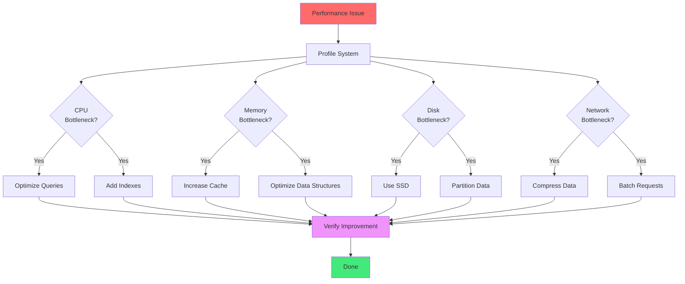
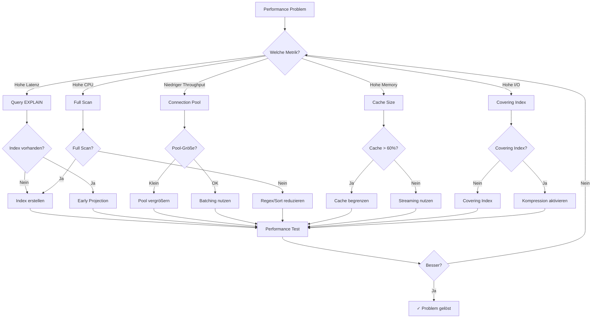

# Kapitel 39: Performance Tuning Cookbook

> "Performance ist kein Zufall, sondern eine Sammlung kleiner, konsistenter Entscheidungen. Dieses Kochbuch liefert die Rezepte."

---

## Überblick

Ein praxisorientiertes Tuning-Kochbuch für ThemisDB. Jede Sektion enthält Symptom → Diagnose → Fix mit AQL-Beispielen und System-Tuning.

**Was Sie lernen:**
- Schnelle Checklisten für Latenz, Durchsatz, Speicher, IO
- Tuning für Queries, Indizes, Cache, Transactions
- Storage/OS/Netzwerk-Optimierungen
- Batching, Queueing, Backpressure
- Vector- und Graph-Workload Tuning
- Beispiel-Konfigurationen für Prod

---

<figure>



<figcaption><b>Abb. 39.0:</b> Performance-Tuning-Workflow</figcaption>
</figure>

---

## 39.1 Quick Tuning Checklist

- **Latenz hoch?** EXPLAIN, Index-Pfade, Projection pushdown, LIMIT
- **Durchsatz gering?** Batching, Parallelisierung, Verbindungspool erhöhen
- **CPU hoch?** Sort/Regex/Full-Scan reduzieren, Index nutzen, Cache-Hit prüfen
- **IO hoch?** Covering Index, Kompression (zstd), Cold Data auslagern
- **Memory hoch?** Cache begrenzen, Streaming statt Materializing, LIMIT
- **Lock/Deadlock?** Konsistente Lock-Order, kürzere Transaktionen



---

## 39.2 Query Patterns (Fixes)

### Early Projection & Filter

```aql
-- ❌ FALSCH: Späte Projektion
FOR u IN users
  FILTER u.status == 'active'
  RETURN u  -- großes Dokument

-- ✅ RICHTIG: Früh projizieren
FOR u IN users
  FILTER u.status == 'active'
  RETURN { _key: u._key, name: u.name, email: u.email }
```

### Avoid N+1

```aql
-- ❌ FALSCH: Pro Zeile Subquery
FOR o IN orders
  RETURN {
    o: o,
    items: (
      FOR i IN order_items FILTER i.order_id == o._key RETURN i
    )
  }

-- ✅ RICHTIG: Pre-Aggregate
LET items_by_order = (
  FOR i IN order_items
    COLLECT order_id = i.order_id INTO items
    RETURN { order_id, items }
)

FOR o IN orders
  LET bundle = FIRST(FOR b IN items_by_order FILTER b.order_id == o._key RETURN b.items)
  RETURN { o, items: bundle }
```

### Range Queries mit Index

```aql
CREATE INDEX idx_ts ON events(timestamp)

FOR e IN events
  FILTER e.timestamp >= @from AND e.timestamp <= @to
  RETURN e
```

### Graph Traversal Tuning

```aql
-- Limit depth and fanout
FOR v, e, p IN 1..3 OUTBOUND 'users/alice' GRAPH 'social'
  PRUNE LENGTH(p.vertices) > 100  -- Begrenze
  FILTER p.edges[*].weight ALL >= 0.5
  RETURN v
```

---

## 39.3 Batching & Parallelism

### Batch Insert/Update

```aql
LET batch = @input_docs
INSERT batch INTO users  -- 1 Transaktion
```

### Client-Side Parallel

```python
# batch_parallel.py
from concurrent.futures import ThreadPoolExecutor

def run_in_parallel(queries):
    with ThreadPoolExecutor(max_workers=8) as ex:
        return list(ex.map(client.execute, queries))
```

### Backpressure

```python
# backpressure.py
import asyncio

class QueueWorker:
    def __init__(self, maxsize=1000):
        self.q = asyncio.Queue(maxsize=maxsize)
    
    async def produce(self, items):
        for item in items:
            await self.q.put(item)  # block when full
    
    async def consume(self, worker):
        while True:
            item = await self.q.get()
            await worker(item)
            self.q.task_done()
```

---

## 39.4 Cache & Memory

- Target: Cache Hit Rate > 90%
- Limit result set sizes (pagination)
- Use STREAMING_CURSOR for große Resultsets
- Avoid massive IN lists → temp set collection

```aql
-- Streaming Cursor
FOR doc IN large_collection
  FILTER doc.status == 'active'
  LIMIT 0, 100000
  OPTIONS {stream: true}
  RETURN doc
```

---

## 39.5 Storage & IO

### Kompression

- `storage.compression = zstd`
- `wal.compression = zstd`
- Blockgröße 4-8KB testen

### SSD/NVMe Tuning (Linux)

```
sudo nvme set-feature -f 2 -v 0  # Disable write cache if battery-backed
sudo nvme set-feature -f 0x0b -v 0x1  # Latency monitor enable
```

### Filesystem

- ext4 mit `noatime`, `discard`, `nodiscard` für Performance abwägen
- XFS für hohe Parallelität

---

## 39.6 Netzwerk

- MTU prüfen (Jumbo Frames nur konsistent nutzen)
- TCP: `net.ipv4.tcp_tw_reuse=1`, `tcp_fin_timeout=15`
- Verbindungen poolen; Keep-Alive aktivieren

---

## 39.7 Vektor-Workloads

### Index & Quantization

- HNSW: M=16-32, efConstruction=200, efSearch=64-128
- PQ: Codebooks 8-16, 8 Bit
- IVF: nlist ~ sqrt(N)

### Batch Embedding

```python
# batch_embed.py
chunks = [docs[i:i+32] for i in range(0, len(docs), 32)]
for chunk in chunks:
    vectors = embed(chunk)
    client.insert_vectors('emb', vectors)
```

### ANN Warmup

- Preload top collections on startup
- Pin hot vectors in memory tier

---

## 39.8 Graph-Workloads

- Begrenze Fanout und Depth
- Precompute Communities (Louvain) für häufige Queries
- Materialisierte Pfade für Hot Paths

---

## 39.9 Transactions & Locking

- Kürzere Transaktionen; kleinere Batches
- Lock-Order strikt definieren
- Deadlock-Timeout niedrig (z.B. 5s) → Retry mit Backoff

```python
# retry_tx.py
import time

def with_retry(tx_func, attempts=3):
    for i in range(attempts):
        try:
            return tx_func()
        except Deadlock:
            time.sleep(0.1 * (2 ** i))
    raise
```

---

## 39.10 Configuration Templates

### themis.conf (Performance Focus)

```yaml
aql:
  stream_results: true
  max_query_memory_mb: 1024
  profiling_enabled: true

cache:
  size_mb: 8192
  eviction_policy: lru

wal:
  compression: zstd
  sync_interval_ms: 20

network:
  max_connections: 2000
  keepalive: 60
```

### Linux sysctl

```
net.core.somaxconn = 1024
net.ipv4.tcp_fin_timeout = 15
net.ipv4.tcp_tw_reuse = 1
vm.swappiness = 10
vm.max_map_count = 262144
```

---

## 39.11 Benchmark Harness

```python
# bench_harness.py
import time

class BenchHarness:
    def __init__(self, client):
        self.client = client
    
    def run_case(self, name, query):
        start = time.time()
        result = self.client.execute(query)
        dur = (time.time() - start) * 1000
        return {"name": name, "duration_ms": dur, "rows": len(result)}

    def run_suite(self, cases):
        return [self.run_case(n, q) for n, q in cases]
```

---

## Zusammenfassung

Dieses Kochbuch liefert schnelle Diagnosen und konkrete Fixes. Beginnen Sie mit EXPLAIN/PROFILE, optimieren Sie Filter/Projektion, nutzen Sie Indizes, batchen Sie Schreibvorgänge, begrenzen Sie Fanout, und sichern Sie Ressourcen durch Cache- und IO-Tuning. Wiederholen, messen, automatisieren.
