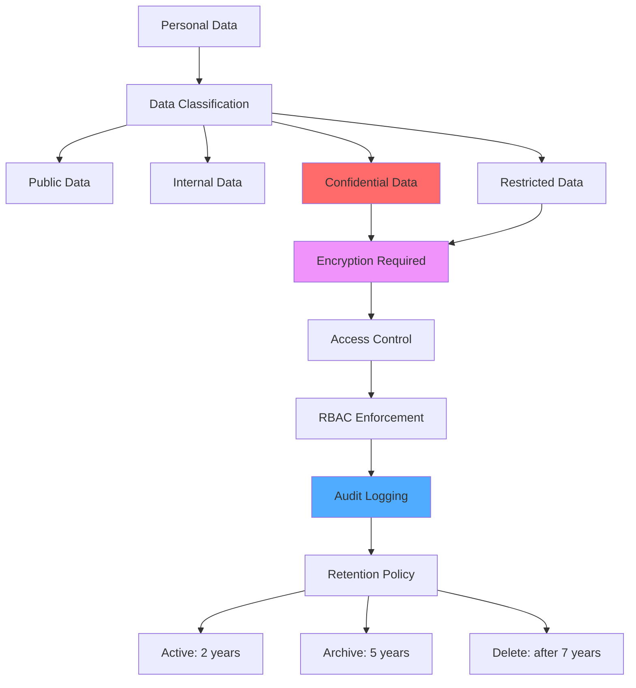
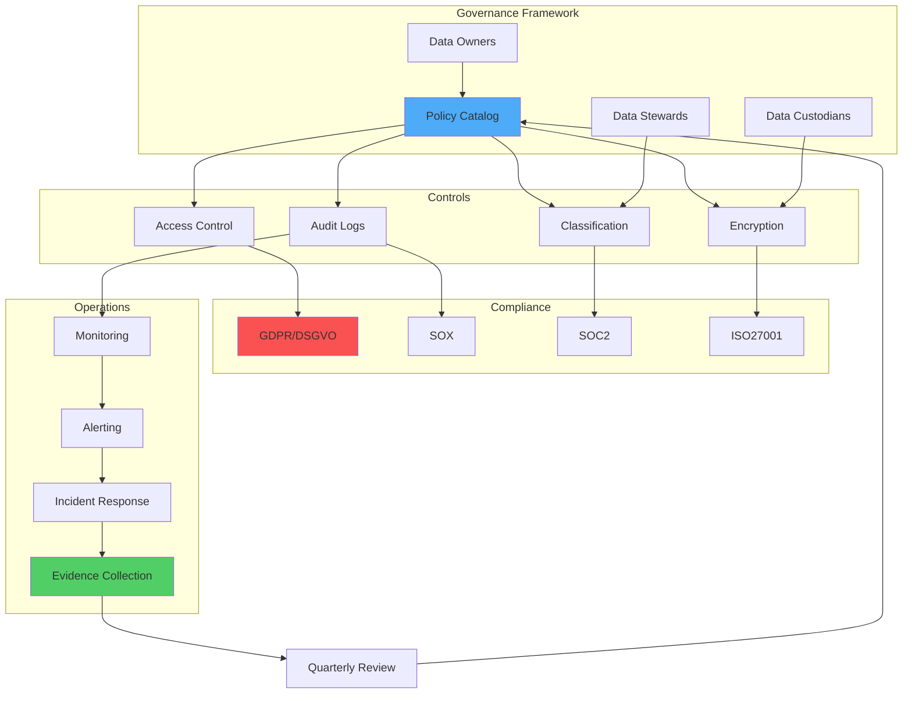

# Kapitel 40: Data Governance & Compliance

> "Daten ohne Governance sind Haftungsrisiko. Governance schafft Vertrauen, Compliance macht es prüfbar."

---

## Überblick

Ein praxisnahes Governance- und Compliance-Kapitel für ThemisDB: Policies, Zugriff, Maskierung, Retention, Audits, Privacy (GDPR), und Kontrollnachweise.

**Was Sie lernen:**
- Governance-Framework (Policies, Ownership, Stewardship)
- Access Control & Least Privilege
- Data Classification & Masking
- Lifecycle & Retention
- Audit Trails & Evidence
- GDPR/DSGVO: Rechte, Pseudonymisierung, Löschung
- SOX/SOC2/ISO27001 Anforderungen
- Kontroll-Checklisten und Runbooks

---

<figure>



<figcaption><b>Abb. 40.0:</b> Data-Governance-Framework</figcaption>
</figure>

---

## 40.1 Governance Operating Model



- **Ownership:** Jede Collection hat Owner (Team), Steward (Data Quality), Custodian (Ops)
- **Policy Catalog:** Zugriff, Retention, Encryption, Backup, Sharing
- **Review Zyklen:** Quartalsweise Policy-Review, jährliche Controls-Audits
- **Change Control:** RFC → Peer Review → Approval → Rollout → Evidence

---

## 40.2 Data Classification

Stufen definieren (z.B. PUBLIC, INTERNAL, CONFIDENTIAL, STRICT).

```yaml
classification:
  levels:
    - name: PUBLIC
      description: "Keine Sensibilität"
    - name: INTERNAL
      description: "Nur intern"
    - name: CONFIDENTIAL
      description: "PII/finanziell"
    - name: STRICT
      description: "Gesundheit, Strafverfolgung"
```

**Regeln:**
- Standard = INTERNAL
- CONFIDENTIAL/STRICT → Encryption + Access Approval
- Masking im UI/Logs für CONFIDENTIAL/STRICT

---

## 40.3 Access Control & Least Privilege

- RBAC-Modelle (Reader, Writer, Admin, Auditor)
- JIT Access mit Ablauf (z.B. 24h)
- Break-Glass Accounts (mit separatem Audit)
- Quarterly Access Review

```aql
-- Grant role
INSERT {
  user_id: 'alice',
  role: 'reader',
  granted_by: 'security',
  expires_at: DATE_ADD(NOW(), 1, 'day')
} INTO access_grants
```

---

## 40.4 Data Masking

### Dynamic Masking

```aql
FUNCTION mask_email(email) {
  RETURN CONCAT(SUBSTRING(email, 0, 2), '***', SUBSTRING(email, POSITION(email, '@')-1))
}

FOR user IN users
  RETURN {
    name: user.name,
    email: mask_email(user.email)
  }
```

### Tokenization

```python
# tokenization.py
import secrets

tokens = {}

def tokenize(value):
    token = secrets.token_hex(8)
    tokens[token] = value
    return token

def detokenize(token):
    return tokens.get(token)
```

---

## 40.5 Data Lifecycle & Retention

- **Ingest:** Klassifizierung, Validation, Encryption
- **Store:** Encryption-at-rest, Access Controls, Audit Logs
- **Use:** Masking, Purpose Limitation, Minimal Disclosure
- **Share:** Anonymize/Pseudonymize, DPA prüfen
- **Archive:** Cold Storage mit Verschlüsselung
- **Delete:** Right-to-be-forgotten Prozesse

Retention Beispiel:

```yaml
retention:
  users: 7y
  logs: 180d
  audit_logs: 365d
  pii: 2y
```

---

## 40.6 Audit & Evidence

- Immutable Audit Log (Kapitel 36)
- Evidence Store: Tickets, Screenshots, CLI Output, Hashes
- Kontroll-Nachweise per Control-ID (ISO27001 Annex A, SOC2 CC)

```markdown
# Control: AC-3 (Access Enforcement)
- Policy: AC-3 v1.2
- Evidence:
  - access_grants export (signed)
  - quarterly review report (PDF)
  - IAM config screenshot
  - audit log hash chain verification
```

---

## 40.7 Privacy (GDPR)

### Betroffenenrechte

- Auskunft, Berichtigung, Löschung, Einschränkung, Übertragbarkeit, Widerspruch

```aql
-- Right to Erasure (Pseudonymize)
FUNCTION gdpr_delete(user_id) {
  UPDATE {_id: 'users/' + user_id} WITH {
    name: 'Anonymized',
    email: null,
    phone: null,
    gdpr_deleted_at: NOW(),
    is_deleted: true
  } IN users
  
  REMOVE d IN audit_logs
  FILTER d.resource == CONCAT('users/', user_id)
}
```

### Data Processing Register

- Zweck, Kategorien, Empfänger, Speicherorte, Löschfristen
- DPAs mit Prozessoren dokumentieren

---

## 40.8 Compliance Frameworks (SOX, SOC2, ISO27001)

- **SOX:** Change-Management, Segregation of Duties, Evidence für Finanzsysteme
- **SOC2:** Security/Availability/Confidentiality; Controls: Access, Change, Incident, Monitoring
- **ISO27001:** ISMS, Risikoanalyse, Controls Annex A (z.B. A.8 Asset Management, A.9 Access Control)

Kontroll-Mapping Beispiel:

```markdown
- A.9.1.2 (Access Control): RBAC + Quarterly Review + JIT
- A.12.4.1 (Logging): Immutable Audit Log, 365d retention
- A.12.6.1 (Malware Protection): EDR auf DB-Hosts
- A.17.1.1 (Continuity): DR-Plan + Tests halbjährlich
```

---

## 40.9 Controls & Checklisten

```markdown
## Access Controls
- [ ] RBAC Rollen definiert
- [ ] JIT Access aktiviert
- [ ] Break-glass dokumentiert
- [ ] Quarterly Reviews durchgeführt

## Data Protection
- [ ] Encryption at rest (AES-256)
- [ ] TLS 1.3 in transit
- [ ] Field-Level Encryption für PII
- [ ] Masking im UI und Logs

## Monitoring & Audit
- [ ] Immutable Audit Logs
- [ ] Alerting auf Policy-Verletzungen
- [ ] Evidence Store mit Hash-Kette
```

---

## Zusammenfassung

Governance setzt klare Verantwortlichkeiten, Classification, Zugriffsprinzipien und Retention. Compliance liefert Nachweise gegenüber Auditoren und Gesetzgebern. Mit Masking, Audit Trails, JIT Access und robusten Löschprozessen bleibt ThemisDB konform und vertrauenswürdig.
