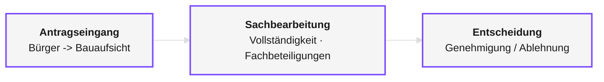
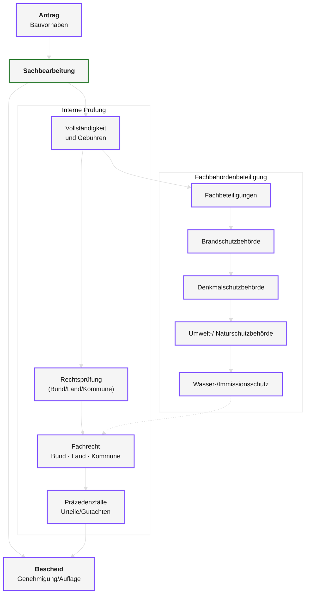
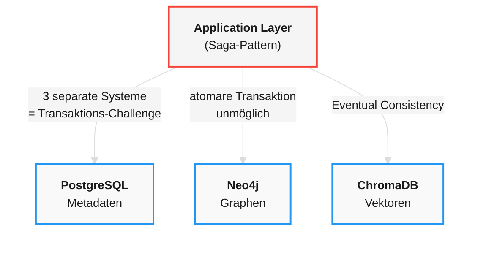
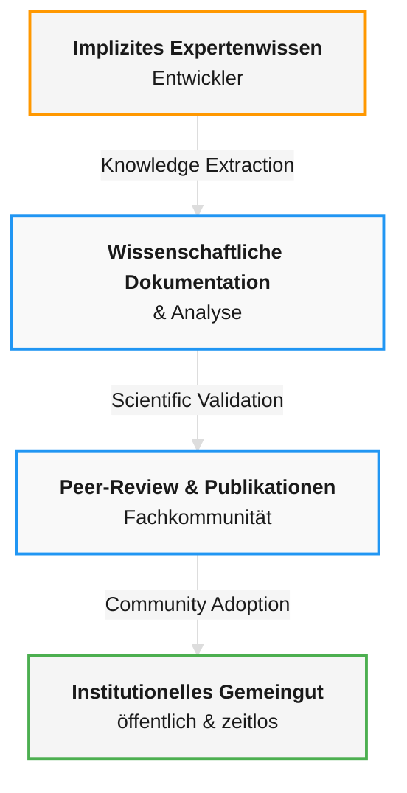
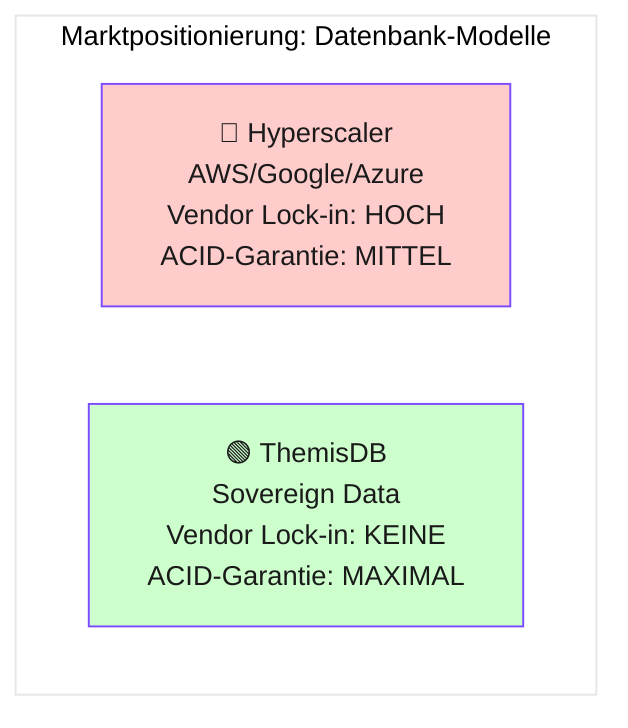

# Kapitel 0: Genese und Entwicklungsgeschichte von ThemisDB
> *"Innovation entsteht nicht durch Beschaffung, sondern durch Notwendigkeit."*
---

## Überblick
Dieses Kapitel erzählt die außergewöhnliche Entstehungsgeschichte von ThemisDB – von einer privaten "Civic Tech"-Initiative bis zur produktionsreifen Multi-Modell-Datenbank. Sie erfahren, welche Probleme zur Entwicklung führten, wie das Projekt wuchs, und welche Meilensteine erreicht wurden. Die Geschichte von ThemisDB ist ein Paradebeispiel dafür, wie technische Innovation aus echten Problemstellungen entsteht und wie eine "Bottom-Up"-Entwicklung zu einem System führen kann, das ursprüngliche Erwartungen übertrifft. Jedes Feature, jede Designentscheidung und jede Architekturkomponente wurde durch konkrete Anforderungen aus der Praxis motiviert. Diese organische Entwicklung führte zu einer Datenbank, die nicht nur theoretisch elegant ist, sondern auch in der realen Welt funktioniert.

**Was Sie in diesem Kapitel lernen werden:**
- Die strategische Ausgangslage und das Problem der UDS3-Architektur
- Wie ThemisDB als "Bottom-Up"-Innovation entstand
- Die wichtigsten Entwicklungsphasen und Meilensteine
- Das Lizenzmodell und die wissenschaftliche Absicherung
- Der Status "Production-Ready" (November 2025)

**Voraussetzungen:** 
Keine. Dieses Kapitel liefert den historischen Kontext für alle folgenden Kapitel.

---

## Der strategische Imperativ
Die Entwicklung begann nicht als akademisches Projekt oder als Produkt eines Unternehmens, sondern als Antwort auf eine konkrete gesellschaftliche Herausforderung. Die deutsche öffentliche Verwaltung steht vor tiefgreifenden strukturellen Veränderungen, die ohne technologische Innovation nicht bewältigt werden können. Der **demografische Wandel**, **die Digitalisierung** und **die zunehmende Komplexität der Verwaltungsaufgaben** haben einen perfekten Boden geschaffen, der neue Lösungsansätze erforderlich machte. Die sogenannte "Babyboomer"-Generation, die einen Großteil der erfahrenen Fachkräfte in der Verwaltung ausmacht, erreicht das Rentenalter. Gleichzeitig wird es immer schwieriger, qualifizierte Nachwuchskräfte zu rekrutieren. Diese demografische Schere führt zu einem massiven Wissensverlust und einer Überlastung der verbleibenden Mitarbeiter. Ohne technologische Unterstützungssysteme ist die staatliche Handlungsfähigkeit in kritischen Bereichen gefährdet. 

Um diesen Wissensverlust aufzufangen, wurde das VCC-Ökosystem (Veritas, Covina, Clara) konzipiert. VCC ist dabei kein einfacher KI-Chatbot, sondern viel mehr. 

- **Veritas:** KI-gestützter agenten-basierter Assistent für Fachexperten, Wissensmanagement und Dokumentenverarbeitung
- **Covina:** Ingestion-Pipeline für heterogene Datenquellen
- **Clara:** large-language-model Verbesserung mit Hilfe von LoRa

> **Die Kernidee** 
Ein souveränes, KI-gestütztes Assistenzsystem, das Fachexperten entlastet, Wissen konserviert und die Effizienz steigern kann. 

D.h. eine Chat-Anfrage über Veritas kann über das Agentensystem aus verschiedenen Datenquellen Informationen zusammentragen um der Sachbearbeiterin, dem Sachberarbeiter eine umfangreiche Sicht auf komplexe Sachzusammenhänge zu geben. Konkret kann man das an einem Bauantrag veranschaulichen. Ein Bürger beantragt die Errichtung eines Carports. Der Bearbeiter muss jetzt für die Sachentscheidung alle relevanten Information zusammentragen, dass beginnt ganz banal bei dem eigentlichen Antragsgegenstand (Bauherr, Bauort, Baugegenstand usw.), den zugrundeliegenden Gesetzen, Verordnungen, Anweisungen, Bebauungsplänen sowohl auf Bundes-, Länder- als auch auf kommunaler Ebene und nicht zuletzt auch der zuletzt gültigen Rechtslage (z.B. Änderungen durch Gerichtsurteile). Um im Bild zu bleiben gibt es für den Sachbearbeiter einen, teils wiederkehrenden, Rechtsrahmen indem er über den Antrag des Bürgers entscheiden muss.



Abb. 0.0: Vereinfachter Bauantrag-Prozess (Brandenburg): Antragseingang → Sachbearbeitung (Vollständigkeit, Fachbeteiligungen) → Entscheidung

Deswegen war bei der Genese auch ein nicht zu vernachlässigender Aspekt, die wirkliche machinennutzbare Abbildung von Verwaltungsprozessen. Es ist einfach zu kurz gesprungen nur anstatt Papierdokumenten jetzt auf E-Mail für den Informationsaustausch zu setzen. Also gibt es ein weiteres technologisches Herz, der **VPB** – ein "Digitaler Zwilling" der Verwaltung [1], [9]:



Abb. 0.1: VPB-Graph für Sachbearbeitung: Antrag → Sachbearbeitung → Bescheid, mit verknüpften Zuständigkeiten (Bund/Land/Kommune), Fachrecht und Präzedenzfällen

**Die Anforderung:** Graph-RAG – die Kombination von:
- **Semantischer Suche** (Vektor-Embeddings für KI)
- **Prozessualem Kontext** (Graph-Beziehungen)
- **Strukturierten Metadaten** (Relationale Daten)
- **Strenger ACID-Konsistenz** (für rechtsverbindliche Akte)

Doch das technologische Herzstück dieses Systems, der „Digitale Zwilling“ der Verwaltung, stieß schnell an eine unüberwindbare Grenze.

## Die Genese: Von der privaten Initiative zur Civic Tech

### Das Civic Tech Paradigma
ThemisDB ist ein Paradebeispiel für **Civic Tech** [9]. Anstatt auf langwierige Ausschreibungsprozesse zu warten, entstand ThemisDB als Bottom-Up-Innovation. Verwaltungsmitarbeiter mit tiefer IT-Expertise entwickelten in Eigeninitiative einen Prototyp, der die Vision einer nativen Multi-Modell-Datenbank verfolgte. Das Ziel war ein transaktionaler Kern, der Relationen, Graphen und Vektoren in einem einzigen System vereint und damit echte ACID-Garantien ermöglicht.
> **Civic Tech** - Technologie, die aus der Mitte der Zivilgesellschaft/Verwaltung für das Gemeinwohl entsteht, anstatt eingekauft zu werden.

**Die Prinzipien:**
1. **Problem-driven:** Entwicklung aus echter Notwendigkeit, nicht aus Spezifikation
2. **Practitioner-led:** Entwickler sind gleichzeitig Nutzer
3. **Open Source:** Code gehört der Allgemeinheit
4. **Iterativ:** Schnelle Iterationen statt jahrelanger Planung

**Die Motivation:** 
- Keine Lösung am Markt erfüllte die spezifischen Anforderungen
- Hyperscaler-Lösungen zu teuer und mit Vendor-Lock-in
- Open-Source-Alternativen mit denselben UDS3-Problemen behaftet

## Der „Force Multiplier“: KI-gestützte Entwicklung als Geburtshelfer
Die Realisierung von ThemisDB in einer so kurzen Zeitspanne wäre ohne den Einsatz moderner KI-Werkzeuge wie Google Gemini, GitHub Copilot und spezialisierten Coding-LLMs undenkbar gewesen. Diese Tools fungierten als „Force Multiplier“, die es einem kleinen Team ermöglichten, die Komplexität einer Multi-Modell-Datenbank zu beherrschen.

### Demokratisierung der Hochsprachen-Programmierung
Ursprünglich war die Entwicklung von Datenbank-Kernen (in C++ oder Rust) eine Domäne für spezialisierte Informatiker mit jahrzehntelanger Erfahrung. Durch den Einsatz von KI-Assistenten verschob sich dieses Paradigma:

**Abstraktion der Komplexität:** Die KI übernahm das „Boilerplate“-Coding und die Implementierung komplexer Algorithmen (wie HNSW-Indizes oder MVCC-Logiken) auf Basis präziser fachlicher Instruktionen.

**Vom Programmierer zum Architekten:** Die Rolle der Entwickler wandelte sich. Anstatt jede Zeile Code mühsam selbst zu schreiben, fungierten sie als Architekten und Reviewer, die die KI-generierten Module validierten und zusammenfügten.

### Rapid Prototyping in Lichtgeschwindigkeit
Was früher Monate für die Erstellung eines funktionsfähigen Prototyps (MVP) dauerte, wurde durch KI auf Wochen reduziert:
- **Automatisierte Testgenerierung:** KI-Tools erstellten simultan zum Code die passenden Unit-Tests, was eine extrem hohe Iterationsgeschwindigkeit bei gleichbleibender Qualität ermöglichte.
- **Fehlerdiagnose in Echtzeit:** Debugging-Prozesse, die normalerweise Tage in Anspruch nehmen können, wurden durch KI-Analyse von Stacktraces und Memory-Dumps in Minuten gelöst.

### Civic Tech trifft auf KI-Empowerment
Dieses „KI-Empowerment“ ist der Schlüssel zum Erfolg des Civic-Tech-Ansatzes von ThemisDB. Es erlaubte Experten aus der Verwaltung, die zwar tiefes Domänenwissen, aber nur grundlegende Programmierkenntnisse besaßen, ein System auf Enterprise-Niveau zu bauen:

- **Überbrückung der Wissenslücke:** Die KI übersetzte die komplexen juristischen Anforderungen an ACID-Konsistenz und DSGVO-Compliance direkt in technischen Code.
- **Ressourceneffizienz:** Ein Team von nur drei Personen konnte Aufgaben bewältigen, für die traditionelle IT-Häuser ganze Abteilungen benötigt hätten.

Die neue Ära der Software-Genese ThemisDB ist somit nicht nur ein technologisches Produkt, sondern auch ein Beweis für einen neuen Entwicklungstypus: AI-driven Civic Tech. Die Kombination aus der Notwendigkeit (demografischer Wandel), dem Mut zur Eigeninitiative (Bottom-Up) und den richtigen Werkzeugen (Gemini, Copilot) hat gezeigt, dass die öffentliche Verwaltung wieder zum Innovator werden kann, wenn sie die Kraft der KI für ihre eigenen Ziele nutzt.

---

## Das Scheitern der UDS3-Architektur
Um das Scheitern zu verstehen muss man kurz erklären wie Verwaltungshandeln funktioniert.

Ein stark vereinfachtes Diagramm eines generischen Verwaltungsprozesses:
    Event -> ein konkretes Anliegen eines Bürgers mit Anspruch auf Verwaltungshandeln, z.B. Bauantrag
    Verwaltungsakt -> eine Behörde legt einen Vorgang an und übernimmt die Sachbearbeitung und Entscheidungsfindung
    Entscheidung -> die Behörde trifft eine Entscheidung über das Anliegen des Bürgers, z.B. durch Erteilung eines Bescheides

### Die ursprüngliche Planung: Polyglot Persistence
Die behördliche IT-Strategie "Unified Database Strategy 3" (UDS3) [1], [9], die auf dem "Best-of-Breed"-Prinzip basierte: PostgreSQL für Metadaten, Neo4j für Graphen und ChromaDB für Vektoren offenbarte in der Praxis schnell, dass dieser Ansatz  einen fundamentalen, juristisch untragbaren Mangel aufwies. Da die Daten physisch auf drei verschiedene Systeme verteilt waren, konnten keine atomaren Transaktionen garantiert werden (sog. ACID - Garantien).

In einem rechtssicheren Verwaltungsumfeld ist dies fatal: Würde beispielsweise ein Dokument nach DSGVO gelöscht, müsste dieser Vorgang zeitgleich in der relationalen Datenbank, im Graphen und im Vektor-Index abgeschlossen sein. Da dies bei getrennten Systemen nur über das komplexe Saga-Pattern und mit dem Risiko der "Eventual Consistency" (BASE) möglich ist, könnten kurzzeitig inkonsistente und damit rechtsunwirksame Zustände entstehen. Für die Entwickler war klar: Für revisionssichere Akte ist "eventuell konsistent" inakzeptabel.

**Die Architektur:**



Abb. 0.2: UDS3 Polyglot-Persistence-Architektur: Drei unabhängige Datenbanksysteme mit unmöglicher ACID-Gewährleistung über Transaktionen hinweg

- **PostgreSQL:** Relationale Metadaten (Aktenzeichen, Daten, Status)
- **Neo4j:** Prozessbeziehungen und Wissensgrafen
- **ChromaDB:** Vektor-Embeddings für semantische Suche

**Die Motivation:** "Best-of-Breed" – jede Datenbank für ihre Stärken nutzen.

### Der fundamentale Fehler: Eventual Consistency

Die physische Trennung der Daten führte zu einem **juristisch untragbaren Problem** [1]:

**Das Problem:**
```python
# Szenario: Löschung eines Gutachtens nach DSGVO Art. 17
# In ThemisDB mit AQL (atomare Transaktion)
try:
    result = db.query("""
        FOR d IN documents
            FILTER d.id == 'BImSchG-2024-042'
            REMOVE d IN documents
            RETURN OLD
    """)
    
    # Single atomic operation:
    # 1. Dokument aus Collection gelöscht
    # 2. Vektoren aus Index gelöscht
    # 3. Graph-Edges zu verwandten Docs aufgelöst
    # → Alles oder nichts - KEINE Inkonsistenz möglich

except Exception:
    # Rollback über 3 separate Datenbanken?
    # → UNMÖGLICH ohne komplexes Saga-Pattern!
```

**Die Konsequenz:**
- Atomare Transaktionen über alle drei Systeme sind **unmöglich** [1], [17]
- Man muss auf das **Saga-Pattern** [17] mit kompensierenden Transaktionen zurückgreifen
- Resultat: **"Eventual Consistency" (BASE)** [18] statt ACID
- Ein Verwaltungsakt kann zeitweise in einem inkonsistenten Zustand sein

**Das Urteil:** Für revisionssichere Verwaltungsakte ist "eventuell konsistent" operativ und rechtlich **inakzeptabel** [1], [9].

---

## 0.4 Entwicklungsphasen und Meilensteine

### Phase 1: Proof of Concept (Q1-Q2 2025)

**Ziel:** Validierung des Base Entity Paradigmas

**Errungenschaften:**
- Implementierung des kanonischen "Base Entity"-Speicherformats [3], [4]
- Integration von RocksDB als transaktionale Storage-Engine [13], [46]
- Erste Tests mit MVCC (Multi-Version Concurrency Control) [20]
- Proof of Concept für atomare Transaktionen über Relational, Graph und Vektor

**Technologie-Stack:**
- C++ für Performance-kritische Komponenten
- RocksDB TransactionDB für ACID-Garantien
- VelocyPack für effiziente Serialisierung [41]

### Phase 2: Core Engine (Q2-Q3 2025)

**Ziel:** Produktionsreife Kern-Engine

**Errungenschaften:**
- Vollständige AQL-Implementierung (Advanced Query Language) [9]
- Native Graph-Traversierung mit temporalen Abfragen [9]
- HNSW-Index für Vektor-Operationen [25]
- Query Optimizer mit kostenbasiertem Planning [9]

**Meilensteine:**
- 45.000 Writes/Sekunde Ingestion-Performance [3], [5], [9]
- Sub-Millisekunden Latenz für Lesezugriffe (p50 < 0.1ms) [9]
- MVCC mit Snapshot Isolation [15], [20]

### Phase 3: Enterprise Features (Q3-Q4 2025)

**Ziel:** BSI-konforme Sicherheits- und Compliance-Features

**Errungenschaften:**
- Native RBAC-Implementierung (Role-Based Access Control) [9]
- Tamper-Proof Audit Logs mit Hash-Chains [9]
- DSGVO-Compliance "by Design" [44]:
  - Auto-Purge nach Retention-Period
  - PII Detection und Redaction
  - Encrypt-then-Sign mit PKI
- HashiCorp Vault Integration für Key Management [9]

**Status:** Wegfall externer Abhängigkeiten wie Apache Ranger [9]

### Phase 4: Production-Ready (Oktober-November 2025)

**Ziel:** Vollständige Produktionsreife für Single-Node-Szenarien

**Audit vom 20. November 2025** [9]:
```
✅ Core Engine:        100% Complete
✅ ACID Transactions:  Production-Ready
✅ Security Stack:     BSI-konform
✅ Performance:        Benchmarked & Validated
✅ Documentation:      Comprehensive
✅ Testing:            All Tests Green (28.10.2025)
```

**Gesamtfortschritt:** ~52% (P0-Features: 100%) [9]

**Status-Erklärung:** "Production-Ready" für Single-Node bedeutet:
- ✅ Stabile API
- ✅ ACID-Garantien validiert
- ✅ Performance-optimiert
- ✅ Security-gehärtet
- ⏳ Horizontal Scaling in Entwicklung (für Multi-TB-Szenarien)

---

## 0.5 Das Lizenzmodell: Sovereign Open Source

### MIT-Lizenz mit Government-Klausel

ThemisDB nutzt ein innovatives Lizenzmodell [9]:

**Basis:** MIT-Lizenz (permissiv und entwicklerfreundlich)

**Erweiterung:** Government-Klausel verhindert:
- Cloud-Anbieter nehmen den Code
- Bieten ihn als proprietären Service an
- Schließen eigene Erweiterungen

**Der Schutz:**
```
✓ Entwickler können Code frei nutzen
✓ Behörden behalten volle Kontrolle
✓ Wissenschaftliche Nutzung uneingeschränkt
✗ Kommerzialisierung ohne Rückfluss an Community verhindert
```

**Lizenz-Audit:** Alle verwendeten Bibliotheken sind kompatibel und "clean" [9]:
- RocksDB (Apache 2.0 / GPL)
- simdjson (Apache 2.0)
- Arrow (Apache 2.0)
- Keine GPL-Kontamination im Core

### Das "Amazon-Problem" gelöst

**Das Problem:** AWS/Azure könnten Open-Source-Code nehmen und als Managed Service verkaufen, ohne zur Community beizutragen.

**Die Lösung:** Government-Klausel erlaubt nur:
- **On-Premise-Nutzung** ohne Einschränkung
- **Cloud-Hosting** nur mit Open-Source-Rückfluss
- **Kommerzielle Nutzung** mit Lizenzgebühren-Vereinbarung

---

## 0.6 Wissenschaftliche Absicherung: Die "Wissensfalle" vermeiden

### Das Risiko: Bus-Faktor

**Das Problem:** ThemisDB entstand aus privater Initiative – Abhängigkeit von wenigen Personen [9]:

**Bus-Faktor-Analyse:**
```
Kernentwickler:           2-3 Personen
Code-Ownership:           Konzentriert
Wissenstransfer:          Limitiert
Dokumentation:            Gut, aber personengebunden
→ Risiko bei Ausfall:    HOCH
```

### Die Lösung: Public-Public-Partnership (geplant)

**Die Strategie:** Systematische wissenschaftliche Begleitung durch akademische Partner [9]:

**Angestrebte Forschungskooperationen:**


Abb. 0.4: Wissenstransfer-Prozess von implizitem Expertenwissen über wissenschaftliche Dokumentation zu institutionellem Gemeingut style B fill:#f9f9f9,stroke:#2196F3,stroke-width:2px,color:#1a1a1a
    style C fill:#f9f9f9,stroke:#2196F3,stroke-width:2px,color:#1a1a1a
    style D fill:#f5f5f5,stroke:#4CAF50,stroke-width:2px,color:#1a1a1a
```

**Potenzielle Vorteile:**
- Wissenstransfer in die wissenschaftliche Community
- Unabhängige Validierung der Architektur
- Langfristige Wartbarkeit durch institutionelle Absicherung
- Community-Building durch akademische Partner

---

## 0.7 Der Weg zur Standardisierung

### Aktuelle Positionierung (Dezember 2025)

**Status:**
- 🟢 **Production-Ready** für Single-Node (< 10 TB)
- 🟢 **Production-Ready:** Horizontal Scaling (Sharding, 2-8 Nodes)
- 🟢 **Open Source:** MIT + Government-Klausel
- 🟡 **Wissenschaftliche Validierung:** Angestrebt durch akademische Partner

**Marktposition:**

| Kategorie | Hyperscaler (AWS/Azure) | ThemisDB (Sovereign) |
|-----------|------------------------|----------------------|
| **Skalierung** | ✅ Unbegrenzt | ⚙️ Horizontal (2-8+ Nodes) |
| **Ops-Modell** | ✅ Fully Managed | ⚠️ Self-Hosted/Sovereign |
| **Verfügbarkeit** | ✅ Global | ⚙️ Dezentralisierbar |
| **Vendor Lock-in** | ❌ Stark | ✅ Nein (MIT) |
<figure>



<figcaption><b>Abb. 0.5:</b> Marktpositionierung: ThemisDB im Quadrant der hohen Datensouveränität und strikten ACID-Garantien vs. Hyperscaler-Modelle</figcaption>

</figure>

### Roadmap: Die nächsten Schritte

**Kurzfristig (Q1 2026):**
- Pilotprojekt in Brandenburg (VCC-Integration)
- Performance-Benchmarks gegen Hyperscaler veröffentlichen
- Community-Building (Developer Relations)

**Mittelfristig (Q2-Q4 2026):**
- Sharding-Skalierung auf 16+ Nodes
- Multi-Datacenter-Replication
- BSI-Zertifizierung anstreben

**Langfristig (2027+):**
- Standard-Datenbank für deutsche Verwaltung
- Integration in Sovereign Cloud Plattformen
- Europäische Adoption fördern

---

## 0.8 Lessons Learned: Was ThemisDB besonders macht

### Architektonische Entscheidungen

**1. Native Multi-Model statt Polyglot:**
- Konsequente Ablehnung von "Klebstoff-Architekturen"
- Ein transaktionaler Kern für alle Datenmodelle
- Resultat: ACID über Graph, Vector und Relational

**2. Performance-First-Design:**
- LSM-Trees für Schreiboptimierung [12]
- Speicherhierarchie mit LZ4/ZSTD-Kompression [37], [38]
- Hardware-aware statt Cloud-abstrahiert

**3. Pre-Filtering Innovation:**
- Umkehrung der Query-Execution-Order
- Relationale Indizes vor Vektorsuche
- 20x Performance-Gewinn bei RAG-Workloads [2], [5]

### Organisatorische Besonderheiten

**1. Civic Tech Approach:**
- Problem-driven Development
- Practitioner-led Design
- Rapid Iteration statt jahrelanger Planung

**2. Wissenschaftliche Flankierung:**
- Frühe Integration akademischer Partner
- Wissenstransfer als Risikominimierung
- Public-Public-Partnership als Nachhaltigkeit

**3. Sovereign Open Source:**
- MIT-Lizenz mit Schutzklausel
- Community-orientiert ohne Kommerzialisierungsrisiko
- Volle Transparenz und Kontrolle

---

## 0.9 Stakeholder-Timeline (2025-2027)

| Quartal | Schwerpunkt | Ergebnis |
|---------|-------------|----------|
| Q3 2025 | Proof of Concept | ACID über Graph/Vector/Relational demonstriert |
| Q2 2026 | Multi-Datacenter-Replication | Async-Replica mit RPO 0,5s, RTO < 2 min |
| Q3 2026 | BSI-Vorbereitung | Pen-Test + Hardening Guide veröffentlicht |
| Q4 2026 | Sharding-Preview | 16-Node-Lab mit linearem Scale-out (OLTP + Vektor) |

**Leitplanken:**
- Fokus auf Verwaltungs-Workloads (Akten, Graph-RAG, Audit-Logs)
- Security-by-Design (TLS, mTLS, FIPS-geeignete Krypto)
- Keine Abhängigkeit von Hyperscaler-spezifischen Diensten

## 0.10 Governance & Finanzierung

- **Lizenzmodell:** MIT mit Government-Klausel (Souveränität, Fork-Freiheit)
- **Finanzierung:** Public-Public-Partnership + Fördermittel für OSS-Infrastruktur
- **Betriebsmodell:** Referenzbetrieb bei VCC, Replikation durch Länder/Kommunen
- **Contribution-Model:** Maintainer-Council (VCC + akademische Partner) + Public RFCs
- **Security-Prozess:** Responsible Disclosure, 90-Tage-Window, CVE-IDs durch Maintainer

## 0.11 Risiko- und Compliance-Landkarte

**Top-Risiken und Gegenmaßnahmen:**
- **Rechtsgrundlagen:** DSGVO/DSG-EKD/KRITIS → Privacy by Design, Audit-Trails, FDE
- **Verfügbarkeit:** Rechenzentrums-Ausfall → Multi-AZ-Replikation, Backups, Runbooks
- **Integrität:** Korruption/Manipulation → ACID, Write-Ahead-Log, Checksums pro Base Entity
- **Lieferkette:** Supply-Chain-Angriffe → SBOM, reproduzierbare Builds, Sigstore
- **Betriebsfehler:** Fehlkonfiguration → Safe Defaults, Linter für Configs, Readonly-Mode

**Compliance-Checks (Kurzcheckliste):**
- [ ] TLS 1.3 + mTLS aktiviert
- [ ] Audit-Logs unveränderbar (WORM Storage)
- [ ] Backups mit Air-Gap getestet (Restore-Drill)
- [ ] Keys in HSM/TPM verwaltet
- [ ] Admin-Aktionen 4-Augen-Prinzip

## 0.12 Change-Management & Adoption

- **Trainingspfad:** 2-Tages-Workshop (AQL + Ops), 1-wöchige Mentoring-Phase
- **Migrationsmuster:** Strangler-Fig fürs Alt-System, Parallel-Reads, Read-Cutover nach SLAs
- **KPIs:** MTTR < 15 min, RPO <= 60 s, Query-P99 < 200 ms, Import 50k Docs/min
- **Dokumentation:** Living Runbooks, Incident-Postmortems, Architektur-Entscheidungsprotokolle


## Zusammenfassung

Die Entwicklung von ThemisDB ist eine außergewöhnliche Geschichte:

**Der Ausgangspunkt:** Ein fundamentales Problem (UDS3-Inkonsistenz) bedroht kritische Verwaltungsprozesse.

**Die Antwort:** Eine Bottom-Up-Innovation aus der Verwaltung selbst – Civic Tech in Reinform.

**Das Ergebnis:** Eine Production-Ready Multi-Modell-Datenbank, die:
- ✅ ACID-Garantien über alle Datenmodelle bietet
- ✅ 20x schneller bei RAG-Workloads ist als Konkurrenz
- ✅ Lizenzkostenfrei und ohne Vendor-Lock-in
- ✅ Wissenschaftlich validiert und langfristig abgesichert

**Der nächste Schritt:** Jetzt lernen Sie die technischen Details kennen.

---

**[→ Weiter zu Kapitel 1: Einführung in ThemisDB](chapter_01_introduction.md)**

**Referenzen für dieses Kapitel:**
- [1] Strategische Gesamtanalyse
- [2] Strategische Analyse  
- [3] ThemisDB Dokumentation und Berichtsanalyse
- [9] Forschungsbericht ThemisDB 2025
- Vollständige Literaturliste: [Anhang A](appendix_literatur.md)
