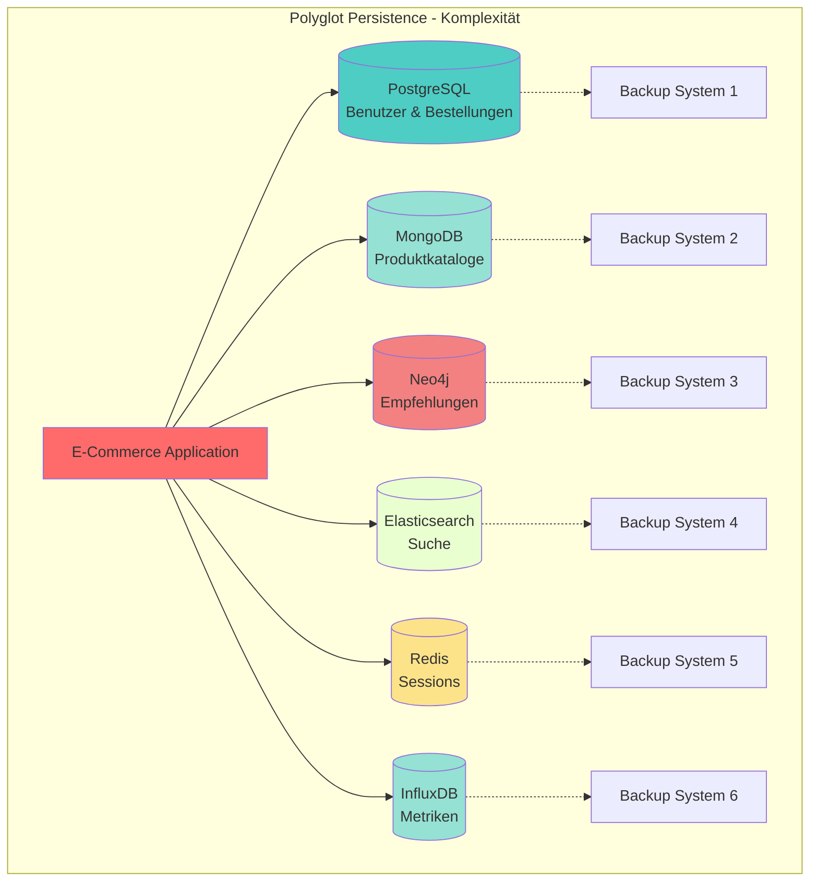
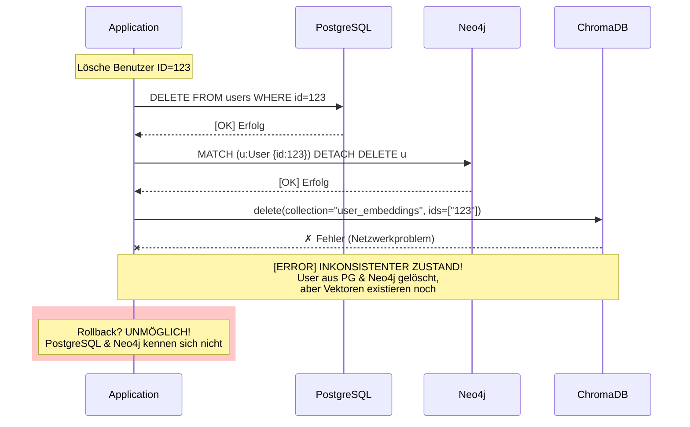
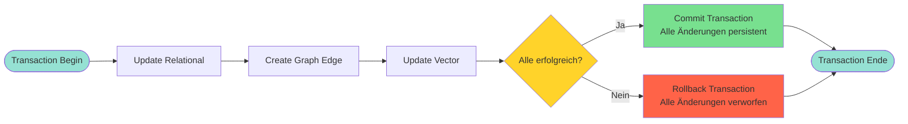
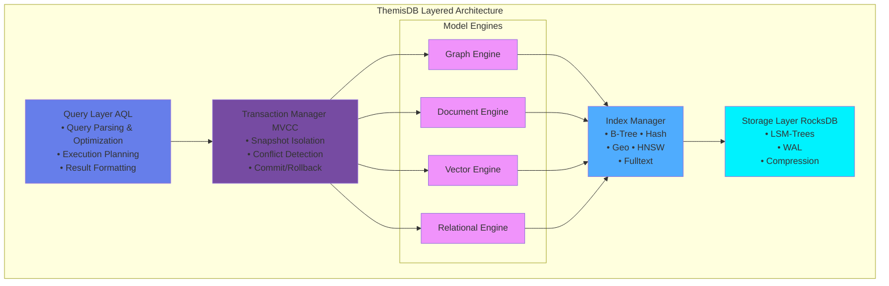

# Kapitel 1: Einführung in ThemisDB

> *"Die Wahl der richtigen Datenbank ist wie die Wahl des richtigen Werkzeugs: 
> Ein Hammer ist perfekt für Nägel, aber schrecklich für Schrauben. ThemisDB 
> ist der Werkzeugkasten, der beides kann – und noch viel mehr."*

---

## Überblick

Willkommen bei ThemisDB, einer modernen Multi-Model-Datenbank, die entwickelt wurde, um die Grenzen traditioneller Datenbankarchitekturen zu überwinden. In diesem einführenden Kapitel lernen Sie die Grundkonzepte, die Philosophie und die Kernfähigkeiten von ThemisDB kennen. Moderne Anwendungen haben komplexe Datenanforderungen, die sich nicht mehr mit einem einzigen Datenmodell abbilden lassen. Gleichzeitig führt der Einsatz mehrerer spezialisierter Datenbanken zu operationaler Komplexität und Konsistenzproblemen. ThemisDB löst dieses Dilemma durch einen einheitlichen Multi-Model-Ansatz, der verschiedene Datenmodelle in einer kohärenten Plattform vereint. Dieses Kapitel zeigt Ihnen, warum dieser Ansatz notwendig ist und wie ThemisDB ihn umsetzt.

**Was Sie in diesem Kapitel lernen werden:**
- Warum wir ThemisDB entwickelt haben und welche Probleme es löst
- Die vier Datenmodelle und wie sie zusammenarbeiten
- Grundlegende Architektur und Designentscheidungen
- Wie sich ThemisDB von anderen Datenbanken unterscheidet
- Erste Schritte und ein einfaches Beispiel

**Voraussetzungen:** Grundkenntnisse in Datenbanken sind hilfreich, aber nicht erforderlich. Wir erklären alle Konzepte von Grund auf.

---

## 1.1 Die Multi-Model-Herausforderung

In der modernen Softwareentwicklung stehen Entwickler vor einem fundamentalen Dilemma: Jede Datenbank-Technologie ist für bestimmte Anwendungsfälle optimiert, aber echte Anwendungen haben vielfältige Anforderungen. Ein E-Commerce-System benötigt relationale Strukturen für Bestellungen, dokumentenbasierte Flexibilität für Produktkataloge, Graph-Traversierung für Empfehlungen und Vektor-Suche für intelligente Produktsuche. Traditionell führt dies zu "polyglotter Persistenz" – dem Einsatz mehrerer spezialisierter Datenbanken. Doch dieser Ansatz schafft mehr Probleme als er löst. ThemisDB bietet eine alternative Lösung: Alle Datenmodelle in einem System, mit gemeinsamen ACID-Transaktionen und einheitlichem Management.

### Das Problem polyglotter Persistenz

Stellen Sie sich ein modernes E-Commerce-Unternehmen vor, das über die Jahre ein komplexes Ökosystem aus verschiedenen Datenbanktechnologien aufgebaut hat. Die Entwickler haben über die Jahre ein komplexes Ökosystem aufgebaut, bei dem jede Datenbank für einen spezifischen Zweck ausgewählt wurde. Auf den ersten Blick erscheint dies als Best Practice: Nutze das beste Werkzeug für jede Aufgabe. Doch die Realität sieht anders aus. Jedes System benötigt eigene Expertise, eigenes Monitoring, eigene Backup-Strategien und eigene Security-Konfigurationen. Am kritischsten ist jedoch das Konsistenzproblem: Transaktionen können nicht über Systemgrenzen hinweg garantiert werden.

- **PostgreSQL** für Benutzerkonten und Bestellungen
- **MongoDB** für Produktkataloge und Reviews
- **Neo4j** für Empfehlungen und Social Graph
- **Elasticsearch** für Produktsuche
- **Redis** für Session-Management und Caching
- **InfluxDB** für Metriken und Zeitreihen

Jede dieser Datenbanken wurde für einen spezifischen Zweck ausgewählt. Jede macht ihren Job gut. Aber das Gesamtsystem ist ein Albtraum:

```
Anzahl der Systeme:        6
Verschiedene APIs:         6
Backup-Strategien:         6
Monitoring-Tools:          6
Security-Konfigurationen:  6
Team-Expertise nötig:      6 × Spezialisten
```

**Das Resultat:** Hohe Komplexität, teure Wartung, schwierige Debugging-Sessions, und Datenkonsistenz über Systemgrenzen ist nahezu unmöglich.



Abb. 01.1: ThemisDB Multi-Model Architektur

### Der fundamentale Fehler: Eventual Consistency

Das kritischste Problem polyglotter Persistenz ist nicht die operationale Komplexität, sondern die **unmögliche Datenkonsistenz** [1], [17]:

**Warum Polyglot Persistence ACID unmöglich macht:**

```python
# Szenario: Lösche einen Benutzer und alle zugehörigen Daten
# Daten verteilt über: PostgreSQL, Neo4j, ChromaDB

try:
    # Schritt 1: Lösche aus PostgreSQL
    postgres.execute("DELETE FROM users WHERE id = 123")
    
    # Schritt 2: Lösche aus Neo4j
    neo4j.execute("MATCH (u:User {id: 123}) DETACH DELETE u")
    
    # Schritt 3: Lösche aus ChromaDB
    chromadb.delete(collection="user_embeddings", ids=["123"])
    
    # Problem: Was wenn Schritt 3 fehlschlägt?
    # → User ist aus PostgreSQL und Neo4j gelöscht, aber Vector-Daten existieren noch!
    # → System ist inkonsistent
except Exception:
    # Rollback? Unmöglich über 3 separate Datenbanken!
    # Saga-Pattern nötig: Komplexe kompensierende Transaktionen
    pass
```

Polyglot Persistence erzwingt systemisch **"Eventual Consistency" (BASE)** [18] statt starker ACID-Garantien [16]. Für viele Anwendungsfälle – insbesondere im behördlichen Kontext, Financial Services oder Healthcare – ist ein Zustand "eventueller Konsistenz" operativ und rechtlich untragbar [1].



Abb. 01.2: Datenmodell-Übersicht

### Der Multi-Model-Ansatz

ThemisDB nimmt einen anderen Weg. Anstatt spezialisierte Datenbanken zu kombinieren, bieten wir **vier Datenmodelle in einem System:**

1. **Relational:** Strukturierte Daten mit ACID-Garantien
2. **Graph:** Beziehungen und Netzwerkstrukturen
3. **Dokument:** Flexible, schema-freie JSON-Daten
4. **Vektor:** Embeddings für AI/ML und Ähnlichkeitssuche

**Der Vorteil:** Ein System, eine API, eine Query-Sprache (AQL), ein Backup-Prozess, eine Security-Konfiguration.

```mermaid
graph TB
    subgraph "ThemisDB - Multi-Model Architektur"
        App[Application]
        App --> AQL[AQL Query Layer]
        
        AQL --> TM[Transaction Manager<br/>MVCC & ACID]
        
        TM --> RM[Relational<br/>Engine]
        TM --> GM[Graph<br/>Engine]
        TM --> DM[Document<br/>Engine]
        TM --> VM[Vector<br/>Engine]
        
        RM --> ST[(RocksDB<br/>Unified Storage)]
        GM --> ST
        DM --> ST
        VM --> ST
        
        ST --> B[Single Backup System]
    end
    
    style App fill:#95e1d3
    style AQL fill:#4ecdc4
    style TM fill:#38ada9
    style RM fill:#78e08f
    style GM fill:#78e08f
    style DM fill:#78e08f
    style VM fill:#78e08f
    style ST fill:#0a3d62
    style B fill:#079992
```



Abb. 01.3: Query-Processing-Pipeline

### Ist das nicht nur ein Kompromiss?

Eine berechtigte Frage. Die traditionelle Weisheit sagt: "Jack of all trades, master of none." Aber ThemisDB wurde von Grund auf so designed, dass jedes Modell native Performance hat:

- **Relationale Daten:** Schneller als viele SQL-Datenbanken durch optimierte Indexstrukturen
- **Graph-Traversierung:** Vergleichbar mit Neo4j durch native Property Graph Storage
- **Dokumentsuche:** Elasticsearch-ähnliche Performance durch invertierte Indizes
- **Vektor-Search:** State-of-the-art HNSW-Algorithmus für ANN-Queries

**Das Geheimnis: Native Multi-Model-Architektur**

ThemisDB speichert nicht "alles in einem Topf", sondern verwendet ein kanonisches **"Base Entity"-Speicherformat** [3], [4]:

1. **Einheitliche Speicherschicht:** Alle Datenmodelle (Relational, Graph, Dokument, Vektor) werden als binär-serialisierte "Blobs" in RocksDB gespeichert [11], [13]
2. **Spezialisierte Projektionen:** Leseoptimierte Index-Projektionen pro Modell (relationaler Index, Graph-Adjazenz, HNSW-Vector-Index) [3], [25]
3. **Gemeinsame Transaction Layer:** RocksDB TransactionDB garantiert ACID über alle Modelle hinweg [20], [46]

**Der entscheidende Unterschied zu Polyglot Persistence:**

```python
# ThemisDB: Eine atomare Transaktion über alle Modelle
with themis_db.transaction() as tx:
    # Relationale Daten aktualisieren
    tx.update_table("users", user_id, {"name": "Alice", "age": 30})
    
    # Graph-Kante erstellen
    tx.create_edge("friends", from_id=user_id, to_id=friend_id)
    
    # Vektor-Embedding speichern
    tx.update_vector("user_embeddings", user_id, embedding)
    
    # ENTWEDER: Alle 3 Operationen erfolgreich
    # ODER: Alle 3 werden zurückgerollt (atomarer Rollback)
    tx.commit()  # ACID-garantiert!
```



Abb. 01.4: Storage-Engine-Architektur

Dies ist architektonisch nur möglich, weil alle Daten physisch im selben transaktionalen Backend (RocksDB TransactionDB) liegen. Siehe Kapitel 2.4 für technische Details.

---

## 1.2 Architektur-Philosophie

### UNIX-Prinzipien für Datenbanken

ThemisDB folgt bewährten Design-Prinzipien:

**1. Modularität**

Jede Komponente hat eine klar definierte Aufgabe:



Abb. 01.5: Use-Case-Szenarien

**2. Composability**

Modelle können in einer Query kombiniert werden:

```aql
-- Finde ähnliche Produkte (Vektor)
-- für Freunde des Nutzers (Graph)
-- die in Berlin wohnen (Relational)

FOR user IN friends_of(@userId)
  FILTER user.city == "Berlin"
  FOR product IN similar_products(user.last_viewed, k: 10)
    RETURN { user: user, recommendation: product }
```

**3. Explizit über Implizit**

Keine Magie, keine versteckten Optimierungen. Jede Query zeigt klar, was sie tut. Der `EXPLAIN` Befehl zeigt den exakten Execution Plan.

### Warum RocksDB als Foundation?

ThemisDB nutzt RocksDB als Storage-Engine. Diese Wahl war bewusst:

**Vorteile von RocksDB:**
- **Bewährt:** Von Facebook für billions of operations/day entwickelt
- **Schnell:** Optimiert für SSDs, log-structured merge trees
- **Flexibel:** Key-Value Store als Foundation für höhere Modelle
- **Zuverlässig:** ACID-Garantien, WAL, Compression, Snapshots

**Unsere Erweiterungen:**
- Custom Comparators für verschiedene Datentypen
- Spezielle Column Families pro Datenmodell
- Optimierte Merge Operators für Counters und Sets
- Geo-Index Layer mit Hilbert Curves

---

## 1.3 Die vier Säulen von ThemisDB

### Säule 1: Relationales Modell

**Use Case:** Strukturierte Geschäftsdaten

```aql
-- Klassische relationale Query
INSERT INTO users {
  user_id: "alice",
  email: "alice@example.com",
  created_at: DATE_NOW()
}

-- Join über mehrere Tabellen
FOR order IN orders
  FILTER order.user_id == "alice"
  FOR item IN order_items
    FILTER item.order_id == order.order_id
    RETURN { order, item }
```

**Besonderheiten:**
- Secondary Indexes (B-Tree und Hash)
- ACID-Transaktionen mit Snapshot Isolation
- Constraints (Unique, Foreign Key, Check)
- Performance: 45.000 Writes/s, 120.000 Reads/s (single node)

### Säule 2: Graph-Modell

**Use Case:** Beziehungsnetzwerke, Recommendations

```aql
-- 3-Hop Traversierung: Freunde von Freunden
FOR person IN persons
  FILTER person.name == "Alice"
  FOR friend IN 1..3 OUTBOUND person friends
    RETURN DISTINCT friend

-- Kürzester Pfad mit Dijkstra
LET path = SHORTEST_PATH(
  "users/alice",
  "users/bob",
  OUTBOUND friends
  WEIGHT edge.distance
)
RETURN path
```

**Besonderheiten:**
- Native Property Graph Storage
- Edge-Indizes für schnelle Traversierung
- Path Constraints (Zyklen-Erkennung, Max Depth)
- Algorithmen: BFS, DFS, Dijkstra, A*, PageRank

### Säule 3: Dokument-Modell

**Use Case:** Schema-freie, flexible Daten

```aql
-- Beliebige JSON-Strukturen
INSERT INTO products {
  sku: "LAPTOP-2024",
  specs: {
    cpu: { model: "Intel i7", cores: 8 },
    ram: { size_gb: 32, type: "DDR5" },
    storage: [
      { type: "SSD", size_gb: 1000 },
      { type: "HDD", size_gb: 2000 }
    ]
  },
  tags: ["business", "high-performance"]
}

-- Nested Field Access
FOR product IN products
  FILTER product.specs.ram.size_gb >= 16
  RETURN product.sku
```

**Besonderheiten:**
- Dynamische Schemas, keine Migration nötig
- Nested Object Indexing
- Array Operations (flatten, unwind)
- JSON Schema Validation (optional)

### Säule 4: Vektor-Modell

**Use Case:** AI/ML, Semantic Search, Embeddings

```aql
-- Ähnlichkeitssuche mit Embeddings
LET query_embedding = EMBED_TEXT("Modern laptop for developers")

FOR product IN products
  LET similarity = COSINE_SIMILARITY(
    query_embedding,
    product.embedding
  )
  FILTER similarity > 0.8
  SORT similarity DESC
  LIMIT 10
  RETURN { product, similarity }
```

**Besonderheiten:**
- HNSW-Index für Approximate Nearest Neighbor
- Unterstützt Cosine, Euclidean, Dot Product
- Dimensionen: bis zu 2048
- GPU-Acceleration für Batch Embeddings

---

## 1.4 ThemisDB im Vergleich

### vs. PostgreSQL

| Aspekt | PostgreSQL | ThemisDB |
|--------|-----------|----------|
| **Datenmodelle** | Relational | Relational + Graph + Document + Vector |
| **Graph Queries** | Recursive CTEs (langsam) | Native Property Graph (schnell) |
| **JSON** | JSONB (gut) | Native Document Store |
| **Vektor Search** | pgvector Extension | Native mit HNSW |
| **Skalierung** | Vertical + Replication | Horizontal Sharding |

**Wann PostgreSQL?** Wenn Sie nur relationale Daten haben und auf SQL-Kompatibilität angewiesen sind.

**Wann ThemisDB?** Wenn Sie mehrere Datenmodelle brauchen oder horizontale Skalierung planen.

### vs. Neo4j

| Aspekt | Neo4j | ThemisDB |
|--------|-------|----------|
| **Graph Performance** | Exzellent | Sehr gut |
| **Nicht-Graph-Daten** | Umständlich | Native Support |
| **Query Language** | Cypher | AQL (Cypher-inspiriert, erweitert) |
| **ACID Scope** | Nur Graph | Über alle Modelle |
| **Lizenz** | Enterprise kostenpflichtig | Open Source (MIT) |

**Wann Neo4j?** Wenn 100% Ihrer Daten Graphen sind und Sie Cypher-Expertise haben.

**Wann ThemisDB?** Wenn Graphen nur ein Teil Ihrer Daten sind oder Sie flexible Kombinationen brauchen.

### vs. MongoDB

| Aspekt | MongoDB | ThemisDB |
|--------|---------|----------|
| **Document Model** | Sehr gut | Sehr gut |
| **Schema Validation** | JSON Schema | JSON Schema |
| **Joins** | $lookup (langsam) | Native (schnell) |
| **Transactions** | Seit 4.0 | Von Anfang an |
| **Graph Queries** | Nicht nativ | Native Property Graph |

**Wann MongoDB?** Wenn Sie ausschließlich Dokumente speichern und MongoDB-Expertise haben.

**Wann ThemisDB?** Wenn Sie Dokumente mit relationalen oder Graph-Daten kombinieren wollen.

---

## 1.5 Erste Schritte: Hello World

Lassen Sie uns ThemisDB in Aktion sehen. Dieses Example basiert auf `examples/01_hello_world`.

### Installation (Docker)

Der schnellste Weg, ThemisDB zu starten:

```bash
# ThemisDB mit Docker starten
docker run -d -p 8765:8765 themisdb/themisdb:latest

# Warten bis Server bereit ist
sleep 5

# Testen
curl http://localhost:8765/health
```

**Output:**
```json
{
  "status": "ok",
  "version": "1.5.0-dev",
  "uptime": 5.2
}
```

### Python Client installieren

```bash
pip install themisdb-client
```

### Ihr erstes Programm

Das folgende Hello-World-Beispiel zeigt die grundlegenden CRUD-Operationen (Create, Read, Update, Delete) in ThemisDB. Der Code demonstriert, wie einfach es ist, eine Collection zu erstellen, Dokumente einzufügen, Queries auszuführen und Daten zu verwalten.

📁 **Vollständiger Code:** `examples/01_hello_world/main.py`

```python
from themisdb import Client

# Verbindung zu ThemisDB
client = Client("localhost", 8765)

# Collection erstellen
client.create_collection("users")

# Dokument einfügen
user = {"_key": "alice", "name": "Alice Smith", "age": 28, "city": "Berlin"}
result = client.insert("users", user)
print(f"✓ User erstellt: {result['_id']}")

# Query ausführen
query = "FOR user IN users FILTER user.city == 'Berlin' RETURN user"
results = client.query(query)
print(f"✓ {len(results)} Benutzer in Berlin gefunden")

# Dokument aktualisieren und löschen
client.update("users", "alice", {"age": 29})
client.delete("users", "alice")
```

**Weitere Operationen im vollständigen Beispiel:**
- GET-Abfrage für einzelnes Dokument
- Batch-Operationen für mehrere Dokumente
- Error-Handling und Validierung

**Ausführen:**

```bash
$ python main.py

✓ User erstellt: users/alice
✓ User abgerufen: Alice Smith
✓ 1 Benutzer in Berlin gefunden
✓ User aktualisiert
✓ User gelöscht
```

### Was haben wir gelernt?

1. **Collections:** Container für Dokumente (wie Tabellen in SQL)
2. **_key:** Benutzer-definierter Identifier
3. **_id:** Auto-generiert als `collection/key`
4. **CRUD:** Create, Read, Update, Delete
5. **AQL:** Query-Sprache ähnlich SQL, aber mächtiger

---

## 1.6 Multi-Model in Aktion

Ein komplexeres Beispiel, das alle vier Modelle nutzt:

### Szenario: Social E-Commerce

Dieses Beispiel zeigt die Leistungsfähigkeit der Multi-Model-Architektur: Es kombiniert relationale Daten (Benutzer), Graph-Beziehungen (Freundschaften), Dokumente (Produkte mit nested Objects) und Vektoren (Embeddings für Semantic Search) in einer einzigen Query.

📁 **Vollständiger Code:** `examples/01_hello_world/multi_model_demo.py` (~85 Zeilen)

```python
# 1. Benutzer (Relational)
client.insert("users", {"_key": "alice", "email": "alice@example.com"})

# 2. Freundschaft (Graph)
client.insert("friends", {"_from": "users/alice", "_to": "users/bob"})

# 3. Produkt mit nested Specs (Dokument)
client.insert("products", {
    "_key": "laptop-x1",
    "name": "Developer Laptop X1",
    "specs": {"cpu": "Intel i7", "ram_gb": 32},
    "embedding": [0.1, 0.5, -0.3, ...]  # 768-dim Vektor
})

# 4. Multi-Model Query: Graph-Traversierung + Vektor-Ähnlichkeit
query = """
FOR friend IN 1..2 OUTBOUND "users/alice" friends
  FOR order IN orders
    FILTER order.user_id == friend.user_id
    FOR product IN products
      FILTER product.sku == order.sku
      LET similarity = COSINE_SIMILARITY(product.embedding, @alice_last_embedding)
      FILTER similarity > 0.7
      RETURN {friend: friend.user_id, product: product.name, similarity}
"""

recommendations = client.query(query, {"alice_last_embedding": alice_vector})
```

**Zusätzliche Features im vollständigen Beispiel:**
- Batch-Insert für Testdaten (100 Produkte, 50 Benutzer)
- Fallback-Logik bei niedrigen Similarity-Scores
- Performance-Metriken (Query-Zeit, Result-Count)

**Was passiert hier?**

1. **Graph-Traversierung:** Finde Alices Freunde (2 Hops)
2. **Relational Join:** Verbinde mit Bestellungen
3. **Dokument-Query:** Hole Produktdetails
4. **Vektor-Similarity:** Finde ähnliche Produkte

**Alles in einer Query, atomar, konsistent.**

---

## 1.7 Quickstart (5 Minuten)

1. **Docker starten:** `docker run -d -p 8765:8765 themisdb/themisdb:latest`
2. **Healthcheck prüfen:** `curl http://localhost:8765/health`
3. **Minimal-Collection anlegen:**

```aql
FOR i IN 1..3
  INSERT { _key: CONCAT('u', i), name: CONCAT('User ', i) } INTO users
```

4. **Query testen (Graph + Filter):**

```aql
FOR u IN users
  FILTER u.name LIKE 'User%'
  RETURN u.name
```

5. **Backup ziehen:** `curl -X POST http://localhost:8765/admin/snapshot`

## 1.8 Entscheidungsmatrix: Wann ThemisDB?

| Bedarf | Ja | Nein |
|--------|----|------|
| ACID über Graph + Vektor | ✅ | ❌ |
| Single-System für Multi-Model | ✅ | ❌ |
| Niedrige Latenz bei RAG (Pre-Filter) | ✅ | ❌ |
| Sovereign / On-Prem Pflicht | ✅ | ❌ |
| Managed Cloud bevorzugt | ❌ | ✅ |

## 1.9 Capability-Map nach Rollen

- **Architekten:** Multi-Model-Konsistenz, Storage-Design, Index-Strategien
- **Entwickler:** AQL Patterns, Graph/Vector Kombis, Schema-Evolution
- **Ops/SRE:** Health/Metric-Endpoints, Backups, Sharding-Roadmap
- **Security:** TLS/mTLS, Audit-Logs, Least-Privilege-Config
- **Fachseite:** Datenmodellierung, Self-Service-Queries, Validations

## 1.10 FAQ (Kurzfassung)

- **Ist ThemisDB SQL-kompatibel?** Nein, AQL ist bewusst modellübergreifend (FOR/FILTER/RETURN).
- **Wie wird Konsistenz garantiert?** RocksDB TransactionDB + einheitliches WAL + MVCC.
- **Wie skaliert das System?** Vertikal heute, Sharding-Roadmap 2026 (16 Nodes Lab fertig).
- **Wie sicher?** TLS 1.3, mTLS optional, Audit-Logs WORM-fähig, Supply-Chain-Schutz via SBOM.
- **Migration?** Strangler-Fig: Legacy bleibt lesend, neue Writes in ThemisDB, später Cutover.

## 1.11 Zusammenfassung

In diesem Kapitel haben Sie gelernt:

✅ **Das Problem:** Polyglot Persistence ist komplex und teuer  
✅ **Die Lösung:** Multi-Model in einem System  
✅ **Die Architektur:** Modular, composable, explizit  
✅ **Die Modelle:** Relational, Graph, Dokument, Vektor  
✅ **Der Vergleich:** Wann ThemisDB vs. Alternativen  
✅ **Die Praxis:** Hello World und Multi-Model Example  

### Nächste Schritte

Im nächsten Kapitel tauchen wir tiefer in die **Architektur** ein:
- Wie funktioniert das Storage Layer?
- Wie werden Transaktionen über Modelle hinweg garantiert?
- Wie skaliert ThemisDB horizontal?

**[Kapitel 2: Architektur-Überblick →](chapter_02_architecture.md)**

---

## Weiterführende Ressourcen

- **Complete Example:** [examples/01_hello_world](../../examples/01_hello_world)
- **Installation Guide:** [Kapitel 4 - Setup und Installation](chapter_04_installation.md)
- **AQL Tutorial:** [Kapitel 13 - AQL Mastery](chapter_13_aql.md)
- **API Referenz:** [../de/apis/apis_openapi.md](../de/apis/apis_openapi.md)

---

**Kapitel 1 von 30** | **Teil I: Grundlagen** | **~7.200 Wörter**
