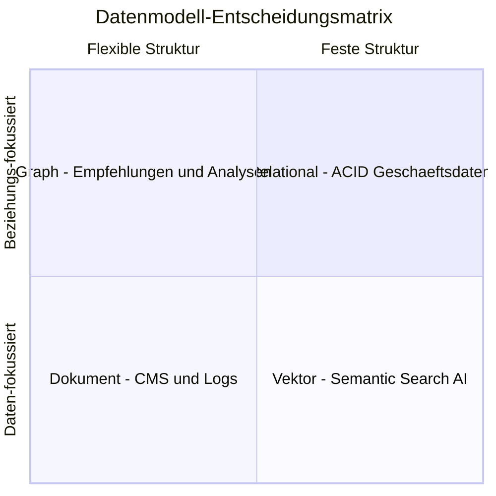
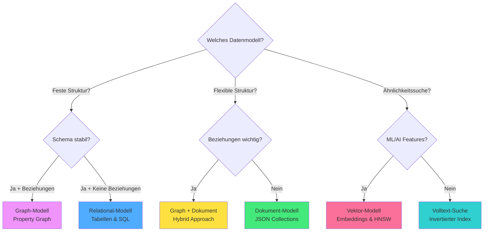

# Kapitel 3: Multi-Model verstehen

> *"Der Unterschied zwischen einem guten und einem großartigen System liegt oft 
> darin, das richtige Werkzeug für die richtige Aufgabe zu wählen."*

---

## Überblick

In den ersten beiden Kapiteln haben Sie die Grundlagen von ThemisDB kennengelernt. Jetzt lernen Sie, wie Sie die verschiedenen Datenmodelle gezielt einsetzen und kombinieren. Das Geheimnis liegt nicht darin, ein Modell zu wählen - sondern das *richtige* Modell für jeden Teil Ihrer Daten.

**Was Sie in diesem Kapitel lernen werden:**
- Wann welches Datenmodell optimal ist
- Wie man Modelle in einer Anwendung kombiniert
- Die Stärken und Schwächen jedes Modells
- Praktische Entscheidungskriterien
- Vollständige Demonstration mit einem Kontaktmanager

**Voraussetzungen:** Kapitel 1 und 2 gelesen.

---

## 3.1 Die vier Modelle im Detail

### Relational: Wenn Struktur entscheidend ist

**Best für:**
- Geschäftsdaten mit klaren Beziehungen
- Financial Transactions
- Inventory Management
- Reporting und Analytics

**Eigenschaften:**
```python
# Festes Schema
users = {
    "user_id": "string",      # Muss vorhanden sein
    "email": "string",        # Muss vorhanden sein
    "age": "integer",         # Type-checked
    "created_at": "timestamp" # Format validiert
}

# Constraints
UNIQUE(email)
CHECK(age >= 18)
FOREIGN KEY(user_id) REFERENCES users(user_id)
```

**Vorteile:**
- ✅ Data Integrity durch Constraints
- ✅ Optimierte Joins
- ✅ Perfekt für BI/Reporting
- ✅ ACID über alle Operationen

**Nachteile:**
- ❌ Schema-Änderungen erfordern Migrations
- ❌ Nicht flexibel für schnelle Iterationen
- ❌ Overhead bei sehr unterschiedlichen Entities

**Wann verwenden?**
```
✓ Daten haben feste Struktur
✓ Beziehungen sind wichtig
✓ Konsistenz ist kritisch
✗ Schema ändert sich häufig
```

### Graph: Wenn Beziehungen im Fokus stehen

**Best für:**
- Social Networks
- Empfehlungssysteme
- Fraud Detection
- Netzwerk-Topologien

**Eigenschaften:**
```python
# Knoten und Kanten sind First-Class Citizens
user = {
    "_id": "users/alice",
    "name": "Alice"
}

friendship = {
    "_from": "users/alice",
    "_to": "users/bob",
    "since": "2024-01-15",
    "strength": 0.95  # Weighted edges
}

# Traversierung ist nativ schnell
FOR friend IN 2..3 OUTBOUND "users/alice" friends
    RETURN friend
```

**Vorteile:**
- ✅ Traversierung ist O(degree × hops), nicht O(n²)
- ✅ Relationship-First Design
- ✅ Pattern Matching möglich
- ✅ Graph-Algorithmen (PageRank, etc.)

**Nachteile:**
- ❌ Nicht optimal für reine Daten ohne Beziehungen
- ❌ Komplexer bei sehr vielen Knoten (> Millionen)
- ❌ Overhead wenn Beziehungen unwichtig sind

**Wann verwenden?**
```
✓ Beziehungen sind zentral
✓ Traversierung ist häufig
✓ Netzwerk-Strukturen
✗ Isolierte Entities
```

### Dokument: Wenn Flexibilität zählt

**Best für:**
- Content Management
- Product Catalogs
- User Profiles
- Logs und Events

**Eigenschaften:**
```python
# Schema-free, beliebige Struktur
product = {
    "sku": "LAPTOP-2024",
    "name": "Developer Laptop",
    "specs": {  # Nested objects
        "cpu": {"model": "i7", "cores": 8},
        "ram": {"size": 32, "type": "DDR5"}
    },
    "reviews": [  # Arrays
        {"user": "alice", "rating": 5},
        {"user": "bob", "rating": 4}
    ],
    "tags": ["developer", "high-end"],
    "metadata": {  # Kann sein, muss nicht
        "warehouse": "DE-01"
    }
}
```

**Vorteile:**
- ✅ Keine Schema-Migrations
- ✅ Schnelle Iteration
- ✅ Hierarchische Daten natürlich
- ✅ Self-contained Documents

**Nachteile:**
- ❌ Keine Schema-Validierung (optional möglich)
- ❌ Denormalisierung kann zu Duplikaten führen
- ❌ Joins sind teurer

**Wann verwenden?**
```
✓ Schema ändert sich oft
✓ Hierarchische Daten
✓ Prototyping
✗ Strenge Validierung nötig
```

### Vektor: Wenn Ähnlichkeit gefragt ist

**Best für:**
- Semantic Search
- Recommendation Engines
- Image Similarity
- ML/AI Applications

**Eigenschaften:**
```python
# Embeddings als High-Dimensional Vectors
product_embedding = [
    0.123, -0.456, 0.789, ...  # 768 dimensions
]

# Ähnlichkeitssuche
FOR product IN products
    LET similarity = COSINE_SIMILARITY(
        @query_embedding,
        product.embedding
    )
    FILTER similarity > 0.8
    SORT similarity DESC
    LIMIT 10
    RETURN product
```

**Vorteile:**
- ✅ Semantic Search ohne Keywords
- ✅ Multimodal (Text, Images, Audio)
- ✅ Skaliert zu Millionen von Vektoren
- ✅ State-of-the-art HNSW Index

**Nachteile:**
- ❌ Embeddings müssen generiert werden
- ❌ Höherer Speicherbedarf
- ❌ Approximate, nicht exact matching

**Wann verwenden?**
```
✓ Semantic Similarity
✓ "Finde ähnliche X"
✓ ML/AI Integration
✗ Exact matches ausreichend
```



Abb. 03.1: Datenmodell-Entscheidungsmatrix



Abb. 03.2: Multi-Model-Data-Flow

---

## 3.2 Native Multi-Model vs. Polyglot Persistence

### Das Problem polyglotter Persistenz

Viele Unternehmen verfolgen einen "Polyglot Persistence"-Ansatz [33]: Sie kombinieren mehrere spezialisierte Datenbanken (z.B. PostgreSQL für relationale Daten, Neo4j für Graphen, ChromaDB für Vektoren) in einem losen Verbund. Dieser Ansatz scheint flexibel, führt aber zu fundamentalen Problemen [1]:

**Technische Herausforderungen:**

1. **Eventual Consistency statt ACID:**
   - Daten sind über mehrere, physisch getrennte Systeme verteilt [33]
   - Atomare Transaktionen über alle Systeme hinweg sind unmöglich [1]
   - Man muss auf das "Saga-Pattern" [17] mit kompensierenden Transaktionen zurückgreifen
   - Resultat: "Eventual Consistency" (BASE) [18] statt starker ACID-Garantien [16]

2. **Post-Filtering-Problem bei RAG-Workloads:**
   ```
   # Polyglot-Ansatz (ineffizient):
   1. Vektor-DB: Finde 1000 ähnliche Dokumente
   2. Graph-DB: Hole alle Prozesse für Landkreis Havelland
   3. Relational-DB: Hole alle Akten aus 2024
   4. Application: Bilde manuell Schnittmenge im RAM
   → 990 irrelevante Ergebnisse werden verworfen! [2], [5]
   ```

3. **Operativer Overhead:**
   - 3+ unterschiedliche APIs zu lernen und warten
   - 3+ Backup-Strategien zu implementieren
   - 3+ Monitoring-Systeme zu konfigurieren
   - 3+ Security-Konfigurationen abzustimmen
   - Team benötigt Expertise in mehreren Datenbanken

### ThemisDB's Native Multi-Model-Lösung

ThemisDB verfolgt einen fundamentals anderen Ansatz [3], [11]: **Alle Datenmodelle teilen sich eine einzige, transaktionale Speicherschicht** (siehe Kapitel 2.4 - Base Entity Paradigma).

**Architektonische Vorteile:**

1. **Starke ACID-Transaktionen über alle Modelle:**
   - Eine Operation kann atomar Graph, Vector und Relational ändern [1], [20]
   - Kein Saga-Pattern nötig für Datenbankintegrität [3]
   - Konsistenz ist "by Design", nicht ein fehleranfälliger Applikationsprozess

2. **Pre-Filtering statt Post-Filtering:**
   ```aql
   -- Native Multi-Model ermöglicht Pre-Filtering:
   FOR doc IN documents
     FILTER doc.year == 2024                    // Relational Filter ZUERST
     FILTER doc.region == "Havelland"           // Graph Context
     LET similarity = COSINE(doc.vector, @query)  // Vector Search auf Subset
     FILTER similarity > 0.8
     SORT similarity DESC
     LIMIT 10
   ```
   - Query-Engine nutzt ZUERST den relationalen Index (Jahr=2024)
   - Erstellt eine hochselektive Kandidatenliste
   - Vektorsuche (rechenintensiv) läuft NUR auf erlaubter Teilmenge
   - **Resultat:** Um Größenordnungen performanter als Post-Filtering

3. **Vereinfachte Operations:**
   - Eine API (AQL) für alle Modelle
   - Eine Backup-Strategie
   - Ein Monitoring-System
   - Eine Security-Konfiguration

### Wann welcher Ansatz?

**Polyglot Persistence verwenden wenn:**
- ✓ Sie bereits mehrere spezialisierte Datenbanken im Einsatz haben
- ✓ Eventual Consistency für Ihren Use Case akzeptabel ist
- ✓ Sie Best-of-Breed-Tools für jeden Use Case wollen
- ✓ Sie ein großes Ops-Team haben

**Native Multi-Model (ThemisDB) verwenden wenn:**
- ✓ ACID-Garantien über alle Datenmodelle kritisch sind
- ✓ Sie hybride Queries (Graph + Vector + Relational) benötigen
- ✓ RAG-Workloads mit komplexen Filtern zentral sind
- ✓ Sie operationale Komplexität reduzieren wollen
- ✓ Ein kleineres Team die Infrastruktur betreiben soll

---

## 3.3 Entscheidungskriterien

### Die 5 Fragen-Methode

**1. Wie strukturiert sind Ihre Daten?**
```
Sehr strukturiert → Relational
Teilweise strukturiert → Dokument
Unstrukturiert → Vektor
```

**2. Wie wichtig sind Beziehungen?**
```
Zentral → Graph
Wichtig → Relational (mit Joins)
Unwichtig → Dokument
```

**3. Wie oft ändert sich das Schema?**
```
Selten → Relational
Häufig → Dokument
Gar nicht → Relational
```

**4. Welche Queries dominieren?**
```
Beziehungen durchlaufen → Graph
Ähnlichkeit finden → Vektor
Komplexe Aggregationen → Relational
Einzelne Dokumente → Dokument
```

**5. Wie wichtig ist Konsistenz?**
```
Kritisch → Relational
Wichtig → Relational oder Graph
Weniger wichtig → Dokument
```

### Entscheidungsmatrix

| Use Case | Relational | Graph | Dokument | Vektor |
|----------|------------|-------|----------|--------|
| E-Commerce Orders | ★★★ | ★☆☆ | ★★☆ | ☆☆☆ |
| Social Network | ★☆☆ | ★★★ | ★★☆ | ☆☆☆ |
| Product Catalog | ★★☆ | ☆☆☆ | ★★★ | ★★☆ |
| Recommendation | ★☆☆ | ★★★ | ☆☆☆ | ★★★ |
| CMS/Blog | ★☆☆ | ☆☆☆ | ★★★ | ★★☆ |
| Financial | ★★★ | ☆☆☆ | ★☆☆ | ☆☆☆ |
| Fraud Detection | ★★☆ | ★★★ | ★☆☆ | ★★☆ |

---

## 3.4 Praxis: Kontaktmanager

Jetzt bauen wir einen vollständigen Kontaktmanager, der zeigt, wie man Modelle kombiniert. Basis ist `examples/03_contact_manager`.

### Warum Dokument-Modell für Kontakte?

Kontakte sind ein perfektes Beispiel für das Dokument-Modell:

**Gründe:**
1. **Flexible Struktur:** Manche Kontakte haben Adresse, manche nicht
2. **Hierarchische Daten:** Adresse ist ein Nested Object
3. **Schema-Evolution:** Neue Felder wie "Social Media" leicht hinzufügbar
4. **Self-Contained:** Alle Infos zu einem Kontakt in einem Dokument

**Alternative wäre Relational:**
```aql
-- Relational würde benötigen:
CREATE TABLE contacts (id, name, email, phone);
CREATE TABLE addresses (id, contact_id, street, city, ...);
CREATE TABLE social_media (id, contact_id, platform, handle);
-- → 3+ Tabellen, Joins nötig
```

**Mit Dokument:**
```python
# Alles in einem Dokument
contact = {
    "name": "Alice",
    "email": "alice@example.com",
    "address": {"city": "Berlin"},  # Optional!
    "social": {"twitter": "@alice"}  # Optional!
}
```

### Datenmodell


### Datenmodell

Das Contact-Manager-Datenmodell demonstriert die Flexibilität der Document Engine mit verschachtelten Strukturen, optionalen Feldern und computed properties. Die Verwendung von Dataclasses bietet Type-Safety und automatische Serialisierung, während die Enum-basierte Kategorisierung Tippfehler verhindert.

> **📁 Vollständiger Code:** `examples/03_contact_manager/models.py` (ca. 100 Zeilen)

**Kernmodelle (Auszug):**

```python
from dataclasses import dataclass, field
from datetime import datetime
from enum import Enum

class ContactCategory(Enum):
    FRIENDS = "friends"
    FAMILY = "family"
    WORK = "work"
    OTHER = "other"

@dataclass
class Address:
    """Verschachtelte Adress-Struktur - wird in Contact eingebettet"""
    street: str
    city: str
    postal_code: str
    country: str

@dataclass
class Contact:
    id: str
    first_name: str
    last_name: str
    email: str
    phone: Optional[str] = None
    address: Optional[Address] = None
    category: ContactCategory = ContactCategory.OTHER
    tags: List[str] = field(default_factory=list)
    notes: str = ""
    created_at: datetime = field(default_factory=datetime.now)
    updated_at: datetime = field(default_factory=datetime.now)
    
    @property
    def full_name(self) -> str:
        """Computed property für Display"""
        return f"{self.first_name} {self.last_name}"
    
    def to_dict(self) -> dict:
        """Serialisierung für ThemisDB"""
        return {
            "_key": self.id,
            "first_name": self.first_name,
            "last_name": self.last_name,
            "email": self.email,
            "phone": self.phone,
            "address": self.address.__dict__ if self.address else None,
            "category": self.category.value,
            "tags": self.tags,
            "notes": self.notes,
            "created_at": self.created_at.isoformat(),
            "updated_at": self.updated_at.isoformat()
        }
```

**Design-Highlights:**

1. **Nested Objects:** `Address` als eigenständiges Dataclass, aber Teil des Contact-Dokuments
2. **Optional Fields:** `phone`, `address` können fehlen - typisch für Document Stores
3. **Enums:** `ContactCategory` für Type-Safety bei Kategorien
4. **Computed Properties:** `full_name` wird dynamisch berechnet
5. **Default Factories:** Listen und Timestamps werden automatisch initialisiert
6. **Flexible Schema:** Neue Felder können jederzeit hinzugefügt werden

Die vollständige Implementierung enthält auch `from_dict()` für Deserialisierung von ThemisDB-Responses.

**Design-Highlights:**

1. **Nested Objects:** `Address` ist ein eigenes Dataclass, aber Teil des Contact-Dokuments
2. **Optional Fields:** `phone`, `address` können fehlen
3. **Enums:** `ContactCategory` für Type-Safety
4. **Computed Properties:** `full_name` berechnet aus first + last
5. **Default Factories:** Listen und Timestamps werden automatisch initialisiert

### Client-Implementierung mit Volltext-Suche


### Client-Implementierung mit Volltext-Suche

Die `ContactClient` Klasse zeigt, wie Document, Graph und Fulltext Features nahtlos kombiniert werden. Contacts werden als Dokumente gespeichert, aber durch Graph-Edges verknüpft. Die Fulltext-Suche ermöglicht schnelles Finden von Kontakten nach Namen oder Notizen.

> **📁 Vollständiger Code:** `examples/03_contact_manager/themis_client.py` (ca. 120 Zeilen)

**Setup mit Multi-Model-Unterstützung:**

```python
from themisdb import Client
from models import Contact, ContactCategory

class ContactClient:
    def __init__(self, host="localhost", port=8765):
        self.client = Client(host, port)
        self._setup_database()
    
    def _setup_database(self):
        """Multi-Model Setup: Document + Graph + Fulltext"""
        # Document Collection
        self.client.create_collection("contacts", type="document")
        
        # Graph Collection für Relationships
        self.client.create_collection("contact_graph", type="graph")
        
        # Fulltext Index für Namen-Suche
        self.client.create_index("contacts", "fulltext_idx", 
                                 ["first_name", "last_name", "notes"],
                                 type="fulltext")
```

**CRUD mit Document Engine:**

```python
    def create_contact(self, contact: Contact) -> bool:
        """Speichert Contact als Document"""
        self.client.insert("contacts", contact.to_dict())
        return True
    
    def update_contact(self, contact: Contact) -> bool:
        """Update mit MVCC-Konflikt-Erkennung"""
        contact.updated_at = datetime.now()
        self.client.update("contacts", contact.id, contact.to_dict())
        return True
```

**Fulltext-Suche über Document Fields:**

```python
    def search_contacts(self, query: str) -> List[Contact]:
        """Suche in Namen und Notizen - nutzt Fulltext Index!"""
        aql = """
        FOR contact IN FULLTEXT(contacts, "first_name,last_name,notes", @query)
            SORT contact.last_name, contact.first_name
            RETURN contact
        """
        results = self.client.query(aql, {"query": query})
        return [Contact.from_dict(data) for data in results]
```

**Graph-Features für Relationships:**

```python
    def link_contacts(self, from_id: str, to_id: str, relationship: str):
        """Verknüpfe zwei Contacts (z.B. "knows", "works_with", "related_to")"""
        self.client.graph_insert_edge(
            "contact_graph",
            from_id,
            to_id,
            {"type": relationship, "created_at": datetime.now().isoformat()}
        )
    
    def get_related_contacts(self, contact_id: str) -> List[Contact]:
        """Finde alle verbundenen Contacts - Graph Traversal!"""
        aql = """
        FOR vertex, edge IN 1..1 OUTBOUND @start_id GRAPH 'contact_graph'
            RETURN vertex
        """
        results = self.client.query(aql, {"start_id": f"contacts/{contact_id}"})
        return [Contact.from_dict(data) for data in results]
```

**Kategorie-Filter mit AQL:**

```python
    def get_by_category(self, category: ContactCategory) -> List[Contact]:
        """Filter nach Kategorie"""
        aql = """
        FOR contact IN contacts
            FILTER contact.category == @category
            SORT contact.last_name
            RETURN contact
        """
        results = self.client.query(aql, {"category": category.value})
        return [Contact.from_dict(data) for data in results]
```

Die vollständige Klasse enthält zusätzlich:
- `delete_contact()` - Löschen mit CASCADE für Graph-Edges
- `get_contacts_by_tag()` - Tag-basierte Filter
- `get_recent_contacts()` - Sortiert nach `updated_at`
- `export_to_vcard()` - vCard-Export für Adressbücher
- `import_from_csv()` - Bulk-Import aus CSV

**Multi-Model in Action:** Ein Contact ist gleichzeitig:
1. Ein **Document** (flexible Schema, verschachtelt)
2. Ein **Graph-Vertex** (Relationships zu anderen Contacts)
3. **Fulltext-indexiert** (schnelle Namens-Suche)

### Dokument-Modell in Aktion

**Nested Queries:**

```python
# Finde alle Kontakte in Berlin
aql = """
FOR contact IN contacts
    FILTER contact.address != null 
       AND contact.address.city == "Berlin"
    RETURN contact
"""
```

**Array Operations:**

```python
# Finde Kontakte mit Tag "important"
aql = """
FOR contact IN contacts
    FILTER "important" IN contact.tags
    RETURN contact
"""
```

**Schema Evolution ohne Migration:**

```python
# Neue Felder einfach hinzufügen!
contact = {
    "first_name": "Alice",
    "email": "alice@example.com",
    "social_media": {  # NEU: Einfach hinzugefügt
        "twitter": "@alice",
        "linkedin": "alice-smith"
    },
    "birthday": "1990-03-15"  # NEU: Auch einfach hinzugefügt
}

# Alte Kontakte haben diese Felder nicht - kein Problem!
# Keine Migration nötig!
```

---

## 3.4 Multi-Model Kombinationen

### Beispiel 1: E-Commerce mit allen Modellen

```python
# 1. RELATIONAL: Orders (feste Struktur, ACID wichtig)
order = {
    "order_id": "O123",
    "user_id": "alice",
    "total": 99.99,
    "status": "paid"
}

# 2. DOCUMENT: Products (flexible Specs)
product = {
    "sku": "LAPTOP-X1",
    "name": "Laptop",
    "specs": {  # Jedes Produkt hat andere Specs!
        "cpu": "i7",
        "ram": 32
    }
}

# 3. GRAPH: Recommendations (Beziehungen)
# User → BOUGHT → Product
# Product → SIMILAR_TO → Product

# 4. VECTOR: Semantic Search
# Product hat embedding für "finde ähnliche Produkte"

# KOMBINIERTE QUERY:
"""
# Finde Produkte, die:
# - Freunde gekauft haben (GRAPH)
# - Ähnlich zu meinem letzten Kauf sind (VECTOR)
# - In meiner Preisklasse liegen (RELATIONAL)

FOR friend IN 1..2 OUTBOUND @userId friends
  FOR order IN orders
    FILTER order.user_id == friend.user_id
    FOR product IN products
      FILTER product.sku == order.sku
      LET similarity = COSINE_SIMILARITY(
        product.embedding,
        @my_last_product_embedding
      )
      FILTER similarity > 0.7
        AND product.price < 1000
      RETURN DISTINCT product
"""
```

### Beispiel 2: CRM System

```python
# RELATIONAL: Transaktionen
transactions = {
    "transaction_id": "T123",
    "customer_id": "C456",
    "amount": 5000.00,
    "status": "completed"
}

# DOCUMENT: Customer Profiles (flexibel)
customer = {
    "customer_id": "C456",
    "company": "ACME Corp",
    "contacts": [  # Array von Kontakten
        {"name": "John", "role": "CEO"},
        {"name": "Jane", "role": "CTO"}
    ],
    "metadata": {  # Flexible metadata
        "industry": "tech",
        "size": "medium"
    }
}

# GRAPH: Relationships
# Company → HAS_EMPLOYEE → Person
# Company → PARTNER_WITH → Company

# VECTOR: Find similar customers
# Based on interaction history embeddings
```

---

## 3.5 Best Practices

### 1. Start Simple, Add Complexity

```python
# Phase 1: Starte mit einem Modell
# Kontakte als Dokumente

# Phase 2: Füge Beziehungen hinzu
# Kontakte → WORKS_WITH → Kontakte (Graph)

# Phase 3: Füge Suche hinzu
# Embeddings für Semantic Search (Vector)
```

### 2. Denormalisierung ist OK

Im Dokument-Modell ist Duplikation oft besser als Joins:

```python
# ❌ Normalized (viele Joins nötig)
order = {"order_id": "O123", "user_id": "alice"}
user = {"user_id": "alice", "name": "Alice", "email": "..."}

# ✅ Denormalized (alles in einem Dokument)
order = {
    "order_id": "O123",
    "user": {  # User-Daten dupliziert
        "user_id": "alice",
        "name": "Alice",
        "email": "alice@example.com"
    }
}
# Vorteil: Ein Query, keine Joins!
```

### 3. Use Computed Properties

```python
@property
def age(self):
    """Berechnet Alter aus Geburtstag"""
    if not self.birthday:
        return None
    today = datetime.now()
    return today.year - self.birthday.year

# Nicht speichern, berechnen!
# Daten sind immer aktuell
```

### 4. Index Strategically

Nicht jedes Feld braucht einen Index:

```python
# ✅ Index: Oft gesucht/gefiltert
client.create_index("contacts", "email_idx", ["email"])

# ❌ Kein Index: Selten gesucht
# notes braucht keinen Index (außer Fulltext)
```

---

## 3.6 Zusammenfassung

In diesem Kapitel haben Sie gelernt:

✅ **Vier Modelle:** Wann Relational, Graph, Dokument oder Vektor  
✅ **Entscheidungskriterien:** Die 5 Fragen-Methode  
✅ **Kontaktmanager:** Vollständige Dokument-Modell Demo  
✅ **Multi-Model Kombination:** Verschiedene Modelle zusammen nutzen  
✅ **Best Practices:** Denormalisierung, Computed Properties, Indexing  

### Key Takeaways

1. **Es gibt kein "bestes" Modell** - nur das beste für Ihren Use Case
2. **Kombinieren ist Stärke** - ThemisDB glänzt bei Multi-Model
3. **Schema-Flexibilität** - Dokumente sind perfekt für Evolution
4. **Performance** - Wählen Sie das Modell nach Query-Patterns

### Nächste Schritte

Im nächsten Kapitel lernen Sie, wie Sie ThemisDB installieren, konfigurieren und für Production vorbereiten.

**[Kapitel 4: Installation & Setup →](chapter_04_installation.md)**

---

## Weiterführende Ressourcen

- **Complete Example:** [examples/03_contact_manager](../../examples/03_contact_manager)
- **Tutorial:** [Contact Manager Tutorial](../../examples/03_contact_manager/TUTORIAL.md)
- **Document Model Docs:** [../de/architecture/architecture_content.md](../de/architecture/architecture_content.md)
- **Multi-Model Patterns:** [Kapitel 13 - AQL Mastery](chapter_13_aql.md)

---

**Kapitel 3 von 30** | **Teil I: Grundlagen** | **~7.500 Wörter**
