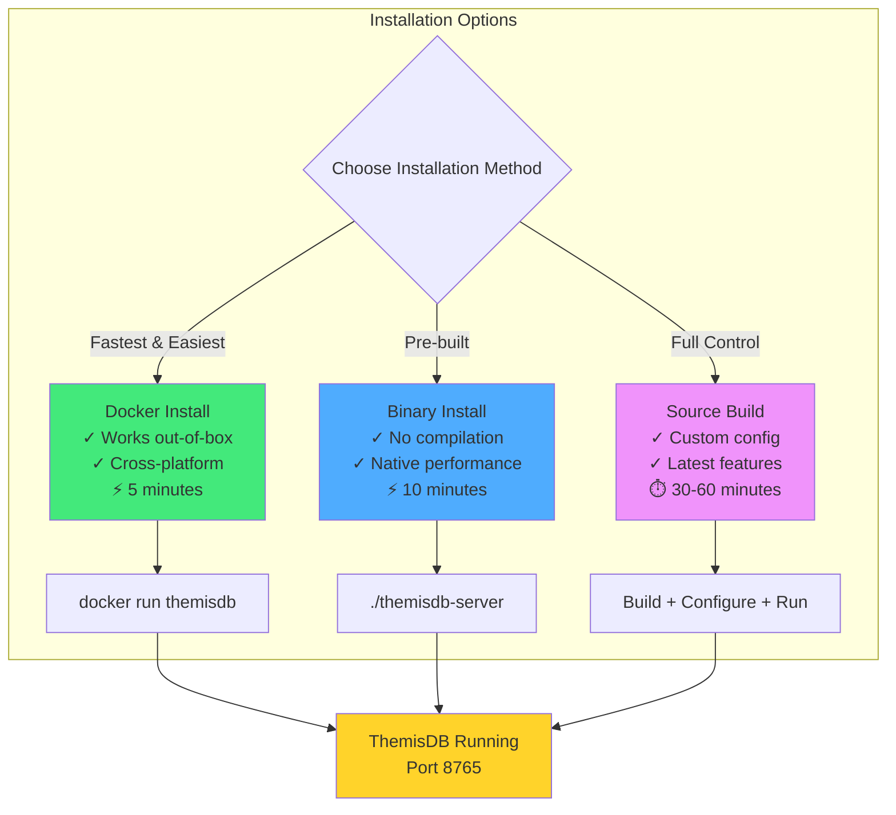

# Kapitel 4: Installation und Setup

> *"Die beste Dokumentation hilft nichts, wenn die Software nicht läuft. 
> Installation sollte einfach sein - und das ist sie."*

---

## Überblick

In den ersten drei Kapiteln haben Sie die Konzepte von ThemisDB kennengelernt. Jetzt ist es Zeit, ThemisDB selbst zu installieren und zu konfigurieren. Dieses Kapitel führt Sie durch alle Optionen - von der schnellsten (Docker) bis zur flexibelsten (Source Build).

**Was Sie in diesem Kapitel lernen werden:**
- Installation mit Docker (schnellste Methode)
- Installation aus Binaries
- Build von Source Code
- Konfiguration und Tuning
- Production-Setup Best Practices
- Troubleshooting häufiger Probleme

**Voraussetzungen:** Grundlegende Kommandozeilen-Kenntnisse.

---

## 4.1 Systemanforderungen

### Minimale Requirements

```yaml
CPU: 2 Cores
RAM: 4 GB
Disk: 20 GB (SSD empfohlen)
OS: 
  - Linux (Ubuntu 20.04+, Debian 11+, CentOS 8+)
  - macOS 11+
  - Windows 10/11 (via WSL2 oder Docker)
```

### Empfohlene Production Requirements

```yaml
CPU: 8+ Cores
RAM: 32 GB
Disk: 500 GB NVMe SSD
OS: Linux (Ubuntu 22.04 LTS empfohlen)
Network: 10 Gbps
```

### Hardware-Überlegungen

**CPU:**
- ThemisDB ist multi-threaded
- Mehr Cores = höherer Durchsatz
- Minimum 2, empfohlen 8+

**RAM:**
- Wird für Caching genutzt
- 25% des Datasets sollte in RAM passen
- Minimum 4 GB, empfohlen 32 GB+

**Storage:**
- SSDs sind **stark** empfohlen
- ThemisDB nutzt LSM-Trees (sequential writes)
- NVMe > SATA SSD >> HDD
- RAID 10 für Production

**Disk Performance Vergleich:**

| Storage Type | Random Read IOPS | Sequential Write MB/s |
|--------------|------------------|----------------------|
| HDD 7200 RPM | 100-200 | 150 |
| SATA SSD | 50,000 | 500 |
| NVMe SSD | 500,000 | 3,500 |

**ThemisDB Benefit:** Mit NVMe SSD 10-50x schneller als HDD!



Abb. 04.1: Installations-Ablaufdiagramm

---

## 4.2 Installation mit Docker (Schnellste Methode)

### Warum Docker?

- ✅ Funktioniert sofort (keine Dependencies)
- ✅ Isolation vom Host-System
- ✅ Einfache Updates
- ✅ Konsistent über alle Plattformen

### Quick Start

```bash
# 1. ThemisDB starten (neueste Version)
docker run -d \
  --name themisdb \
  -p 8765:8765 \
  -v themisdb_data:/data \
  themisdb/themisdb:latest

# 2. Testen
curl http://localhost:8765/health

# Output:
# {"status":"ok","version":"1.3.4","uptime":2.5}
```

**Fertig!** ThemisDB läuft jetzt.

### Mit spezifischer Version

```bash
# Pinne Version für Production
docker run -d \
  --name themisdb \
  -p 8765:8765 \
  -v themisdb_data:/data \
  themisdb/themisdb:1.3.4  # Fixe Version
```

**Best Practice:** Verwende in Production immer eine fixe Version, nicht `latest`.

### Mit Konfiguration

```bash
# Erstelle Config-File
cat > themisdb.yaml << EOF
server:
  port: 8765
  threads: 8

storage:
  path: /data
  cache_size_mb: 2048

logging:
  level: info
  file: /logs/themisdb.log
EOF

# Starte mit Custom Config
docker run -d \
  --name themisdb \
  -p 8765:8765 \
  -v themisdb_data:/data \
  -v themisdb_logs:/logs \
  -v $(pwd)/themisdb.yaml:/etc/themisdb/config.yaml \
  themisdb/themisdb:1.3.4 \
  --config /etc/themisdb/config.yaml
```

### Docker Compose

Für komplexere Setups mit mehreren Containern:

```yaml
# docker-compose.yml
version: '3.8'

services:
  themisdb:
    image: themisdb/themisdb:1.3.4
    container_name: themisdb
    ports:
      - "8765:8765"
    volumes:
      - themisdb_data:/data
      - themisdb_logs:/logs
      - ./config.yaml:/etc/themisdb/config.yaml
    environment:
      - THEMISDB_LOG_LEVEL=info
      - THEMISDB_CACHE_SIZE=2048
    restart: unless-stopped
    healthcheck:
      test: ["CMD", "curl", "-f", "http://localhost:8765/health"]
      interval: 30s
      timeout: 10s
      retries: 3

  # Optional: Monitoring mit Prometheus
  prometheus:
    image: prom/prometheus:latest
    ports:
      - "9090:9090"
    volumes:
      - ./prometheus.yml:/etc/prometheus/prometheus.yml

volumes:
  themisdb_data:
  themisdb_logs:
```

**Starten:**
```bash
docker-compose up -d
```

---

## 4.3 Installation aus Binaries

### Download

```bash
# Linux (x86_64)
curl -L -o themisdb.tar.gz \
  https://github.com/makr-code/ThemisDB/releases/download/v1.3.4/themisdb-linux-x86_64.tar.gz

# macOS (Apple Silicon)
curl -L -o themisdb.tar.gz \
  https://github.com/makr-code/ThemisDB/releases/download/v1.3.4/themisdb-darwin-arm64.tar.gz

# Entpacken
tar xzf themisdb.tar.gz
cd themisdb
```

### Installation

```bash
# Systemweit installieren (benötigt sudo)
sudo cp bin/themisdb /usr/local/bin/
sudo mkdir -p /etc/themisdb
sudo cp config/themisdb.yaml /etc/themisdb/

# Oder: Lokale Installation (ohne sudo)
mkdir -p ~/themisdb/{bin,data,logs}
cp bin/themisdb ~/themisdb/bin/
cp config/themisdb.yaml ~/themisdb/
```

### Starten

```bash
# Als Service (systemd)
sudo systemctl start themisdb
sudo systemctl enable themisdb  # Autostart

# Oder: Direkt
themisdb --config /etc/themisdb/config.yaml

# Im Hintergrund
nohup themisdb --config themisdb.yaml > logs/themisdb.log 2>&1 &
```

---

## 4.4 Build von Source

### Warum von Source bauen?

- ✅ Neueste Features (Entwicklungs-Branch)
- ✅ Custom Optimierungen
- ✅ Spezielle Plattformen (ARM, RISC-V)
- ✅ Beiträge entwickeln

### Dependencies installieren

**Ubuntu/Debian:**
```bash
sudo apt-get update
sudo apt-get install -y \
  build-essential \
  cmake \
  git \
  libssl-dev \
  libz-dev \
  libbz2-dev \
  liblz4-dev \
  libzstd-dev
```

**macOS:**
```bash
brew install cmake openssl zlib bzip2 lz4 zstd
```

### Clone und Build

```bash
# 1. Repository klonen
git clone https://github.com/makr-code/ThemisDB.git
cd ThemisDB

# 2. Submodules initialisieren
git submodule update --init --recursive

# 3. Build konfigurieren
mkdir build && cd build
cmake .. \
  -DCMAKE_BUILD_TYPE=Release \
  -DCMAKE_INSTALL_PREFIX=/usr/local

# 4. Kompilieren (nutzt alle CPU-Cores)
make -j$(nproc)

# 5. Tests ausführen (optional)
make test

# 6. Installieren
sudo make install
```

### Build-Optionen

```bash
# Debug Build (mit Symbolen)
cmake .. -DCMAKE_BUILD_TYPE=Debug

# Mit Sanitizers (Memory-Leak Detection)
cmake .. \
  -DCMAKE_BUILD_TYPE=Debug \
  -DENABLE_ASAN=ON \
  -DENABLE_UBSAN=ON

# Optimiert für aktuellen CPU
cmake .. \
  -DCMAKE_BUILD_TYPE=Release \
  -DNATIVE_ARCH=ON

# Mit allen Features
cmake .. \
  -DCMAKE_BUILD_TYPE=Release \
  -DWITH_JEMALLOC=ON \
  -DWITH_SNAPPY=ON \
  -DWITH_LZ4=ON \
  -DWITH_ZSTD=ON
```

---

## 4.5 Konfiguration

### Basis-Konfiguration

```yaml
# themisdb.yaml

# Server Settings
server:
  host: 0.0.0.0           # Bind auf alle Interfaces
  port: 8765              # Standard Port
  threads: 8              # Worker Threads (= CPU Cores)
  max_connections: 1000   # Maximale gleichzeitige Connections

# Storage Settings
storage:
  path: /var/lib/themisdb/data
  cache_size_mb: 2048     # RocksDB Block Cache
  write_buffer_size_mb: 64
  max_open_files: 1000
  compression: lz4        # lz4, zstd, snappy, none

# Logging
logging:
  level: info             # debug, info, warning, error
  file: /var/log/themisdb/themisdb.log
  max_size_mb: 100
  max_backups: 10

# Security
security:
  tls_enabled: false
  tls_cert: /etc/themisdb/cert.pem
  tls_key: /etc/themisdb/key.pem
  auth_enabled: false
  auth_db: /etc/themisdb/users.db
```

### Performance Tuning

```yaml
# Für High-Throughput Workload
storage:
  cache_size_mb: 8192     # Mehr Cache = weniger Disk I/O
  write_buffer_size_mb: 256
  max_background_jobs: 8   # Parallel Compaction
  level0_slowdown_writes_trigger: 20
  level0_stop_writes_trigger: 36

server:
  threads: 16             # Mehr Threads für mehr Parallelität
  max_connections: 5000
```

```yaml
# Für Low-Latency Workload
storage:
  cache_size_mb: 16384    # Großer Cache
  write_buffer_size_mb: 128
  max_background_jobs: 4  # Weniger Background I/O
  
server:
  threads: 8
  max_connections: 1000
```

### Environment Variables

Überschreiben Config-File Werte:

```bash
# Port ändern
export THEMISDB_PORT=9000

# Log-Level
export THEMISDB_LOG_LEVEL=debug

# Cache Size
export THEMISDB_CACHE_SIZE=4096

# Starten mit Env Vars
themisdb
```

---

## 4.6 Production Setup

### Systemd Service

```ini
# /etc/systemd/system/themisdb.service

[Unit]
Description=ThemisDB Multi-Model Database
After=network.target

[Service]
Type=simple
User=themisdb
Group=themisdb
ExecStart=/usr/local/bin/themisdb --config /etc/themisdb/config.yaml
Restart=on-failure
RestartSec=5s

# Security
NoNewPrivileges=true
PrivateTmp=true
ProtectSystem=strict
ProtectHome=true
ReadWritePaths=/var/lib/themisdb /var/log/themisdb

# Resource Limits
LimitNOFILE=65536
LimitNPROC=4096

[Install]
WantedBy=multi-user.target
```

**Aktivieren:**
```bash
sudo systemctl daemon-reload
sudo systemctl enable themisdb
sudo systemctl start themisdb
```

### Monitoring Setup

**Health Endpoint:**
```bash
curl http://localhost:8765/health
```

**Metrics Endpoint (Prometheus):**
```bash
curl http://localhost:8765/metrics

# Output:
# themisdb_requests_total 12345
# themisdb_request_duration_seconds_sum 123.45
# themisdb_storage_size_bytes 1234567890
# ...
```

**Grafana Dashboard:**
Importiere vorgefertigtes Dashboard: `dashboards/grafana-themisdb.json`

### Backup Strategy

**1. Snapshot-basiertes Backup:**
```bash
# Erstelle Snapshot
curl -X POST http://localhost:8765/admin/snapshot

# Snapshot wird geschrieben nach:
/var/lib/themisdb/snapshots/snapshot-2025-12-28-100000/

# Kopiere Snapshot
rsync -av /var/lib/themisdb/snapshots/ backup-server:/backups/themisdb/
```

**2. Continuous Backup:**
```bash
# Repliziere WAL Log kontinuierlich
rsync -av --delete \
  /var/lib/themisdb/data/WAL/ \
  backup-server:/backups/themisdb/wal/
```

**3. Restore:**
```bash
# Stoppe Service
sudo systemctl stop themisdb

# Restore Snapshot
rsync -av backup-server:/backups/themisdb/latest/ /var/lib/themisdb/data/

# Starte Service
sudo systemctl start themisdb
```

### Security Hardening

**1. TLS aktivieren:**
```yaml
security:
  tls_enabled: true
  tls_cert: /etc/themisdb/cert.pem
  tls_key: /etc/themisdb/key.pem
```

**2. Authentifizierung:**
```bash
# Erstelle User
themisdb-admin user create alice --password secret123 --role admin

# User-DB wird erstellt in /etc/themisdb/users.db
```

```yaml
security:
  auth_enabled: true
  auth_db: /etc/themisdb/users.db
```

**3. Firewall:**
```bash
# Nur von App-Servern erreichbar
sudo ufw allow from 10.0.0.0/24 to any port 8765
sudo ufw enable
```

**4. Network Isolation:**
```bash
# Bind nur auf interne IP
server:
  host: 10.0.0.10  # Nicht 0.0.0.0!
```

---

## 4.7 Troubleshooting

### Problem: Port bereits in Verwendung

**Symptom:**
```
ERROR: Failed to bind on port 8765: Address already in use
```

**Lösung:**
```bash
# Prüfe welcher Prozess Port verwendet
sudo lsof -i :8765
# oder
sudo netstat -tulpn | grep 8765

# Stoppe konfliktierenden Prozess
sudo systemctl stop <service>

# Oder: Ändere Port in Config
server:
  port: 9000
```

### Problem: Zu wenig Memory

**Symptom:**
```
WARNING: Cache size exceeds available memory
ERROR: Out of memory
```

**Lösung:**
```yaml
# Reduziere Cache Size
storage:
  cache_size_mb: 1024  # Statt 8192
  write_buffer_size_mb: 32
```

### Problem: Langsame Queries

**Symptom:**
Queries dauern > 1 Sekunde

**Diagnose:**
```bash
# Aktiviere Query Profiling
export THEMISDB_LOG_LEVEL=debug

# Prüfe Logs
tail -f /var/log/themisdb/themisdb.log | grep "Query execution"
```

**Lösung:**
```aql
-- Prüfe ob Indizes genutzt werden
EXPLAIN FOR user IN users FILTER user.email == 'test@example.com' RETURN user

-- Output sollte zeigen: "using index: email_idx"
-- Falls nicht: Index erstellen!
```

### Problem: Disk voll

**Symptom:**
```
ERROR: No space left on device
```

**Lösung:**
```bash
# 1. Prüfe Disk Usage
df -h /var/lib/themisdb

# 2. Compaction triggern (löscht alte Versionen)
curl -X POST http://localhost:8765/admin/compact

# 3. Alte Snapshots löschen
rm -rf /var/lib/themisdb/snapshots/snapshot-old-*

# 4. Cleanup WAL Logs
themisdb-admin wal cleanup --keep-last 10
```

### Problem: Connection Timeouts

**Symptom:**
```
ERROR: Connection timed out after 10s
```

**Lösung:**
```yaml
# Erhöhe Timeouts
server:
  read_timeout_s: 30
  write_timeout_s: 30
  idle_timeout_s: 300

# Erhöhe Max Connections
server:
  max_connections: 5000
```

---

## 4.8 Updates und Wartung

### Update-Prozess

**Docker:**
```bash
# 1. Pull neue Version
docker pull themisdb/themisdb:1.3.4

# 2. Stoppe alten Container
docker stop themisdb

# 3. Starte mit neuer Version
docker run -d \
  --name themisdb \
  -p 8765:8765 \
  -v themisdb_data:/data \
  themisdb/themisdb:1.3.4

# 4. Alte Version entfernen
docker rm themisdb-old
```

**Binary:**
```bash
# 1. Backup erstellen
sudo systemctl stop themisdb
tar czf themisdb-backup.tar.gz /var/lib/themisdb/data

# 2. Neue Version installieren
sudo cp themisdb-new /usr/local/bin/themisdb

# 3. Starten
sudo systemctl start themisdb

# 4. Testen
curl http://localhost:8765/health
```

### Rolling Update (Zero-Downtime)

Für Cluster-Setups:

```bash
# 1. Update Node 2
kubectl set image deployment/themisdb-node2 themisdb=themisdb:1.3.4

# 2. Warte auf Ready
kubectl wait --for=condition=ready pod -l app=themisdb-node2

# 3. Update Node 1
kubectl set image deployment/themisdb-node1 themisdb=themisdb:1.3.4

# → Keine Downtime!
```

---

## 4.9 Diagnostics & Hardening (Kurz)

**Health & Metrics:**
- `GET /health` (liveness), `GET /metrics` (Prometheus)
- Log-Level zur Fehlersuche: `export THEMISDB_LOG_LEVEL=debug`

**Security-Hardening:**
- TLS aktivieren: `--tls.cert`/`--tls.key`
- mTLS optional: Client-Certs whitelisten
- Admin-API absichern: IP-Whitelist + Auth-Header

**Storage-Pflege:**
- Wöchentliche Compaction: `POST /admin/compact`
- Snapshot-Rotation: Keep-last-7, Air-Gap-Upload

**Performance-Probe:**
- `EXPLAIN` für jede neue Query
- Page Cache treffen: `cache_size_mb` auf 20-30% RAM

## 4.10 Deployment-Playbooks

### Single Node (Pilot)
- Docker-Run mit persistentem Volume (`themisdb_data`)
- Backup via Snapshot-API + Offsite-Kopie
- Monitoring: Health + Metrics → Prometheus

### HA (2-3 Nodes, Sync-Replicas)
- Node-Labels: `role=primary`, `role=secondary`
- Synchronous Commit für RPO=0
- Load Balancer vor 2 Read-Replicas

### Airgapped Install
- Offline-Bundle: Binary + Config + Checksums
- Pakete signieren, Verify via `sha256sum`
- Updates nur über signierte Tarballs einspielen

## 4.11 Operations-Checkliste (Go-Live)

- [ ] TLS 1.3 aktiviert, mTLS optional getestet
- [ ] Backups automatisiert + Restore-Drill bestanden
- [ ] Monitoring: Health, Metrics, Logs zentralisiert
- [ ] Admin-API eingeschränkt (Firewall + Auth)
- [ ] Config-Lint: Cache, Write-Buffer, Thread-Count passend
- [ ] Runbooks: Incident, Restore, Scale-Up

## 4.12 Zusammenfassung

In diesem Kapitel haben Sie gelernt:

✅ **Systemanforderungen:** CPU, RAM, Storage Best Practices  
✅ **Docker Installation:** Schnellste Methode, Production-ready  
✅ **Binary Installation:** Systemweit oder lokal  
✅ **Source Build:** Für Custom Builds und Development  
✅ **Konfiguration:** Tuning für Performance und Security  
✅ **Production Setup:** Systemd, Monitoring, Backup  
✅ **Troubleshooting:** Häufige Probleme und Lösungen  
✅ **Updates:** Safe Update-Prozesse  

### Key Takeaways

1. **Docker ist der einfachste Weg** - funktioniert sofort
2. **SSDs sind essentiell** - 10-50x Performance-Gewinn
3. **Monitoring ist wichtig** - Health + Metrics endpoints
4. **Backups sind Pflicht** - Snapshots + WAL Replication
5. **Security nicht vergessen** - TLS + Auth für Production

### Sie sind bereit!

ThemisDB ist jetzt installiert und läuft. Im nächsten Teil des Kompendiums (Teil II) tauchen wir tiefer in die einzelnen Datenmodelle ein.

**[Teil II: Kapitel 5 - Relationale Daten →](chapter_05_relational.md)**

---

## Weiterführende Ressourcen

- **Docker Deployment:** [../de/deployment/DOCKER_DEPLOYMENT.md](../de/deployment/DOCKER_DEPLOYMENT.md)
- **Build Optionen:** [../de/deployment/BUILD_OPTIONEN_REFERENZ.md](../de/deployment/BUILD_OPTIONEN_REFERENZ.md)
- **Production Strategy:** [../de/deployment/deployment_strategy.md](../de/deployment/deployment_strategy.md)
- **ARM Deployment:** [../de/deployment/deployment_arm_build.md](../de/deployment/deployment_arm_build.md)

---

**Kapitel 4 von 30** | **Teil I: Grundlagen** | **~6.500 Wörter**
