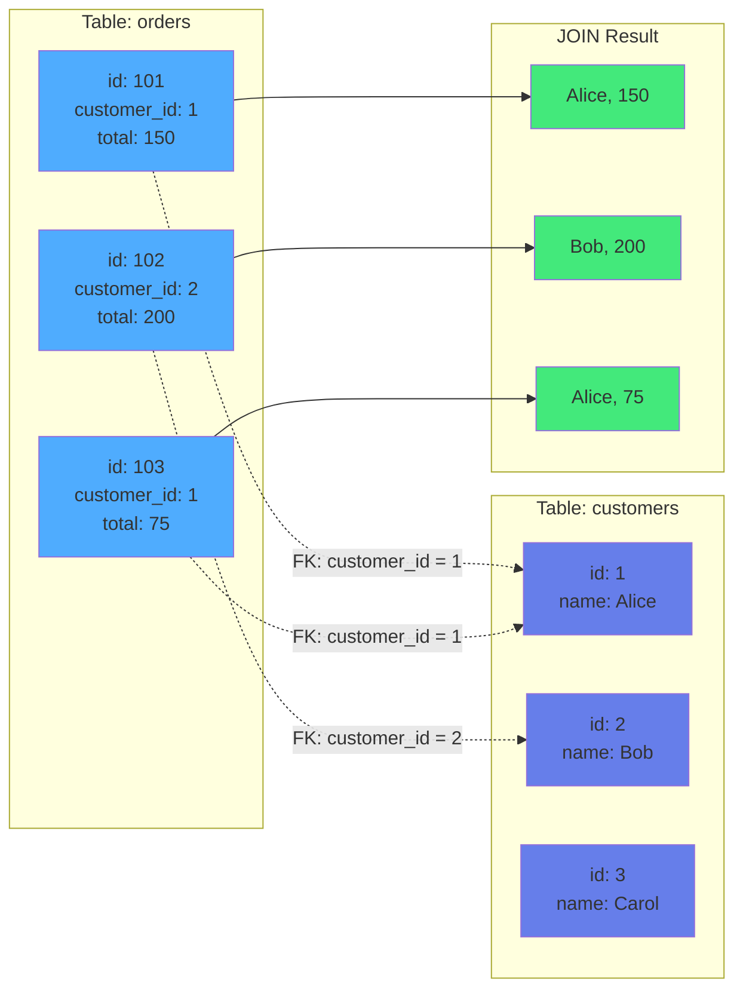
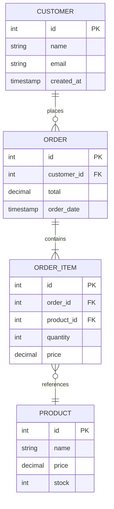

# Kapitel 5: Relationale Daten

> *"Relational databases are like spreadsheets that can talk to each other - 
> but with ACID guarantees and without the chaos."*

---

## Überblick

Relationale Datenbanken sind das Rückgrat der IT seit über 40 Jahren. In ThemisDB ist das relationale Modell eines von vier gleichberechtigten Datenmodellen - aber mit vollem AQL-Support und ACID-Garantien.

**Was Sie in diesem Kapitel lernen werden:**
- Relationales Datenmodell: Tabellen, Schemas, Constraints
- AQL in ThemisDB: DDL, DML, Joins, Subqueries
- Normalisierung vs. Denormalisierung
- Transaktionen und Integrität
- Indexes und Performance
- **Praxisbeispiel 1:** Inventory System (Lagerverwaltung)
- **Praxisbeispiel 2:** Expense Tracker (Ausgabenverwaltung)

**Voraussetzungen:** AQL-Grundkenntnisse hilfreich, aber nicht notwendig.

---

## 5.1 Das Relationale Modell

### Grundkonzepte

**Tabelle (Table):** Sammlung von Zeilen mit gleichem Schema

```
products (Tabelle)
+----+----------+-------+-------+
| id | name     | price | stock |
+----+----------+-------+-------+
|  1 | Laptop   |  1200 |    15 |
|  2 | Mouse    |    25 |   100 |
|  3 | Keyboard |    80 |    50 |
+----+----------+-------+-------+
```

**Zeile (Row):** Ein Datensatz in einer Tabelle  
**Spalte (Column):** Ein Attribut, das jede Zeile hat  
**Schema:** Definition der Spalten und Typen  
**Primärschlüssel (Primary Key):** Eindeutige ID für jede Zeile  
**Fremdschlüssel (Foreign Key):** Referenz zu einer anderen Tabelle  

### Warum Relational?

**✅ Vorteile:**
- **Struktur:** Klare, vorhersehbare Datenstruktur
- **Integrität:** Constraints garantieren Datenqualität
- **Joins:** Verknüpfe Daten aus mehreren Tabellen
- **ACID:** Transaktionen mit vollständiger Konsistenz
- **AQL:** Standardisierte, mächtige Abfragesprache

**❌ Nachteile:**
- Rigid: Schema-Änderungen erfordern Migrations
- Komplex: Normalisierung kann zu vielen Tables führen
- Performance: Joins können langsam sein bei vielen Tables
- Skalierung: Vertical Scaling bevorzugt

### Wann Relational wählen?

**Perfekt für:**
- ✅ Strukturierte Business-Daten (Orders, Invoices, Inventory)
- ✅ Daten mit klaren Beziehungen (Customers → Orders → Items)
- ✅ Transaktionale Systeme (Banking, E-Commerce)
- ✅ Reports mit Aggregationen (SUM, AVG, GROUP BY)
- ✅ Datenintegrität ist kritisch

**Weniger geeignet für:**
- ❌ Hochflexible Schemas (Metadata, User-Generated Content)
- ❌ Netzwerk-Daten mit vielen Hops (Social Graphs)
- ❌ Unstrukturierte Daten (Logs, Dokumente)
- ❌ Vektor-Daten (Embeddings, Features)

---

## 5.2 Tabellen und Schemas

### Tabelle erstellen

```aql
-- Basic Table
CREATE TABLE products (
  id INT PRIMARY KEY,
  name VARCHAR(255) NOT NULL,
  price DECIMAL(10, 2) NOT NULL,
  stock INT DEFAULT 0,
  created_at TIMESTAMP DEFAULT NOW()
);
```

**Datentypen in ThemisDB:**

| Typ | Beschreibung | Beispiel |
|-----|--------------|----------|
| INT | Ganzzahl | 42, -17, 0 |
| BIGINT | Große Ganzzahl | 9223372036854775807 |
| DECIMAL(p,s) | Festkommazahl | 123.45 |
| FLOAT/DOUBLE | Fließkommazahl | 3.14159 |
| VARCHAR(n) | Variable Zeichenkette | "Hello World" |
| TEXT | Unbegrenzte Zeichenkette | Langer Text |
| BOOLEAN | Wahrheitswert | true, false |
| TIMESTAMP | Zeitstempel | 2025-12-28 10:30:00 |
| DATE | Datum | 2025-12-28 |
| JSON | JSON-Dokument | {"key": "value"} |

### Constraints

**Primary Key:**
```aql
CREATE TABLE customers (
  id INT PRIMARY KEY,
  email VARCHAR(255) UNIQUE NOT NULL,
  name VARCHAR(255) NOT NULL
);
```

**Foreign Key:**
```aql
CREATE TABLE orders (
  id INT PRIMARY KEY,
  customer_id INT NOT NULL,
  total DECIMAL(10, 2) NOT NULL,
  created_at TIMESTAMP DEFAULT NOW(),
  
  FOREIGN KEY (customer_id) REFERENCES customers(id)
);
```

**Check Constraints:**
```aql
CREATE TABLE products (
  id INT PRIMARY KEY,
  name VARCHAR(255) NOT NULL,
  price DECIMAL(10, 2) NOT NULL CHECK (price >= 0),
  stock INT NOT NULL CHECK (stock >= 0),
  discount DECIMAL(3, 2) CHECK (discount BETWEEN 0 AND 1)
);
```

**Unique Constraints:**
```aql
CREATE TABLE users (
  id INT PRIMARY KEY,
  username VARCHAR(50) UNIQUE NOT NULL,
  email VARCHAR(255) UNIQUE NOT NULL
);
```

### Auto-Increment IDs

```aql
CREATE TABLE products (
  id INT PRIMARY KEY AUTO_INCREMENT,
  name VARCHAR(255) NOT NULL
);

-- Insert ohne ID
INSERT INTO products (name) VALUES ('Laptop');
-- → Automatisch id=1

INSERT INTO products (name) VALUES ('Mouse');
-- → Automatisch id=2
```

---

## 5.3 Daten einfügen, ändern, löschen

### INSERT

```aql
-- Single Document
INSERT {
  id: 1,
  name: 'Laptop',
  price: 1200.00,
  stock: 15
} INTO products

-- Multiple Documents
INSERT [
  {id: 2, name: 'Mouse', price: 25.00, stock: 100},
  {id: 3, name: 'Keyboard', price: 80.00, stock: 50},
  {id: 4, name: 'Monitor', price: 350.00, stock: 20}
] INTO products
```

### UPDATE

```aql
-- Update single document
UPDATE {id: 1} WITH {stock: stock - 1} IN products

-- Update multiple documents (with FOR loop)
FOR product IN products
  FILTER product.stock > 50
  UPDATE product WITH {
    price: product.price * 0.9
  } IN products

-- Update with join data
FOR order_item IN order_items
  FOR product IN products
    FILTER order_item.product_id == product.id
    UPDATE order_item WITH {
      price: product.price
    } IN order_items
```

### REMOVE (DELETE)

```aql
-- Remove single document
REMOVE {id: 1} IN products

-- Remove multiple documents
FOR product IN products
  FILTER product.stock == 0
  REMOVE product IN products

-- Remove all (Vorsicht!)
FOR product IN products
  REMOVE product IN products
```

### UPSERT (Insert or Update)

```aql
-- Insert or Update based on key
UPSERT {id: 1}
  INSERT {
    id: 1,
    name: 'Laptop',
    price: 1200.00,
    stock: 15
  }
  UPDATE {
    price: 1200.00,
    stock: 15
  }
IN products
```

---

## 5.4 Queries und Joins

### Query Basics

```aql
-- All columns
FOR product IN products
  RETURN product

-- Specific columns
FOR product IN products
  RETURN {name: product.name, price: product.price}

-- With FILTER
FOR product IN products
  FILTER product.price > 100
  RETURN product

-- With SORT and LIMIT
FOR product IN products
  SORT product.price DESC
  LIMIT 10
  RETURN product

-- With aggregation functions
FOR product IN products
  COLLECT AGGREGATE 
    avgPrice = AVG(product.price),
    maxPrice = MAX(product.price),
    minPrice = MIN(product.price),
    total = COUNT()
  RETURN {avgPrice, maxPrice, minPrice, total}

-- With GROUP BY (COLLECT)
FOR product IN products
  COLLECT category = product.category
  AGGREGATE 
    count = COUNT(),
    avgPrice = AVG(product.price)
  RETURN {category, count, avgPrice}
```

### INNER JOIN

```aql
-- Orders mit Customer-Namen (Multi-FOR Join)
FOR order IN orders
  FOR customer IN customers
    FILTER order.customer_id == customer.id
    RETURN {
      id: order.id,
      customer_name: customer.name,
      total: order.total
    }
```



Abb. 05.1: Relationales Schema-Design



Abb. 05.2: Join-Optimierung-Strategie
      total: order.total,
      customer_name: customer.name
    }
```

**Visualisierung:**
```
customers           orders
+---------+         +---------+
| id=1    |←--------|cust_id=1|  ✓ Match → returned
| Alice   |         | €100    |
+---------+         +---------+
| id=2    |         | cust_id=1|  ✓ Match → returned
| Bob     |         | €50     |
+---------+         +---------+
| id=3    |         
| Carol   |         → Kein Match, nicht returned
+---------+
```

### LEFT JOIN (Outer Join with COLLECT)

```aql
-- Alle Customers, mit/ohne Orders
FOR customer IN customers
  LET customer_orders = (
    FOR order IN orders
      FILTER order.customer_id == customer.id
      RETURN order
  )
  RETURN {
    name: customer.name,
    order_count: LENGTH(customer_orders),
    total_spent: SUM(customer_orders[*].total)
  }
```

**Visualisierung:**
```
customers           orders
+---------+         +---------+
| id=1    |←--------|cust_id=1|  ✓ Match
| Alice   |         | €100    |
+---------+         +---------+
| id=2    |
| Bob     |         → Kein Order, aber returned mit NULL
+---------+
```

### Multi-Table JOIN

```aql
-- Orders mit Items und Products (Multi-FOR Join)
FOR order IN orders
  FILTER order.created_at >= '2025-01-01'
  FOR customer IN customers
    FILTER order.customer_id == customer.id
    FOR order_item IN order_items
      FILTER order_item.order_id == order.id
      FOR product IN products
        FILTER order_item.product_id == product.id
        RETURN {
          order_id: order.id,
          customer: customer.name,
          product: product.name,
          quantity: order_item.quantity,
          price: order_item.price
        }
```

### Subqueries

```aql
-- Products teurer als Durchschnitt (WITH CTE)
LET avgPrice = (
  FOR product IN products
    COLLECT AGGREGATE avg = AVG(product.price)
    RETURN avg
)[0]

FOR product IN products
  FILTER product.price > avgPrice
  RETURN {name: product.name, price: product.price}

-- Customers mit mehr als 3 Orders (Subquery)
LET active_customers = (
  FOR order IN orders
    COLLECT customer_id = order.customer_id
    AGGREGATE order_count = COUNT()
    FILTER order_count > 3
    RETURN customer_id
)

FOR customer IN customers
  FILTER customer.id IN active_customers
  RETURN customer.name
```

---

## 5.5 Transaktionen

### ACID Garantien

**Atomicity:** Alles oder nichts  
**Consistency:** Constraints werden eingehalten  
**Isolation:** Transaktionen sehen sich nicht gegenseitig  
**Durability:** Commits sind permanent  

### Transaction Beispiel

```python
from themis_client import ThemisDB

db = ThemisDB("localhost:8765")

# Start Transaction
tx = db.begin_transaction()

try:
    # 1. Reduce stock
    tx.execute("""
        FOR product IN products
          FILTER product.id == @product_id AND product.stock > 0
          UPDATE product WITH {stock: product.stock - 1} IN products
    """, {"product_id": product_id})
    
    # 2. Create order
    tx.execute("""
        INSERT {
          customer_id: @customer_id,
          product_id: @product_id,
          quantity: 1,
          price: @price
        } INTO orders
    """, {"customer_id": customer_id, "product_id": product_id, "price": price})
    
    # 3. Charge customer
    tx.execute("""
        FOR customer IN customers
          FILTER customer.id == @customer_id AND customer.balance >= @price
          UPDATE customer WITH {balance: customer.balance - @price} IN customers
    """, {"customer_id": customer_id, "price": price})
    
    # All OK → Commit
    tx.commit()
    print("Order successful!")
    
except Exception as e:
    # Error → Rollback
    tx.rollback()
    print(f"Order failed: {e}")
```

**Was passiert intern:**

```
T1: BEGIN TRANSACTION (snapshot @ version 100)
  → UPDATE products ... (write intent @ version 101)
  → INSERT orders ... (write intent @ version 102)
  → UPDATE customers ... (write intent @ version 103)
  → COMMIT
    → All write intents become visible @ version 104

Falls Fehler:
  → ROLLBACK
    → All write intents discarded
    → Daten unverändert
```

### Isolation Levels

ThemisDB verwendet **Snapshot Isolation**:

```python
# Transaction 1
tx1 = db.begin_transaction()
tx1.execute("FOR p IN products FILTER p.id == 1 UPDATE p WITH {price: 100} IN products")

# Transaction 2 (parallel)
tx2 = db.begin_transaction()
result = tx2.execute("FOR p IN products FILTER p.id == 1 RETURN p.price")
print(result)  # → Alter Wert! (z.B. 90)

# TX1 committed
tx1.commit()

# TX2 sieht immernoch alten Wert (Snapshot Isolation)
result = tx2.execute("FOR p IN products FILTER p.id == 1 RETURN p.price")
print(result)  # → Immernoch 90!

tx2.commit()

# Neue Transaction sieht neuen Wert
tx3 = db.begin_transaction()
result = tx3.execute("FOR p IN products FILTER p.id == 1 RETURN p.price")
print(result)  # → 100
```

---

## 5.6 Normalisierung

### Problem: Redundanz

**Nicht-normalisiert:**
```
orders
+----+----------+-------------+------------+----------+-------+
| id | customer | cust_email  | product    | quantity | price |
+----+----------+-------------+------------+----------+-------+
|  1 | Alice    | a@email.com | Laptop     |        1 |  1200 |
|  2 | Alice    | a@email.com | Mouse      |        2 |    25 |
|  3 | Bob      | b@email.com | Keyboard   |        1 |    80 |
+----+----------+-------------+------------+----------+-------+
```

**Probleme:**
- Customer email wird wiederholt (Update Anomaly)
- Product-Namen inkonsistent ("Laptop" vs "laptop")
- Keine Constraints möglich

### Normalisierung: 1NF, 2NF, 3NF

**1. Normal Form (1NF):** Atomare Werte, keine Arrays

```aql
-- ❌ Nicht 1NF
CREATE TABLE orders (
  id INT,
  products TEXT  -- "Laptop, Mouse, Keyboard"
);

-- ✅ 1NF
CREATE TABLE orders (
  id INT,
  product_id INT
);
```

**2. Normal Form (2NF):** Alle Nicht-Key-Attribute hängen vom ganzen Key ab

```aql
-- ❌ Nicht 2NF
CREATE TABLE order_items (
  order_id INT,
  product_id INT,
  quantity INT,
  product_name VARCHAR(255),  -- Hängt nur von product_id ab!
  PRIMARY KEY (order_id, product_id)
);

-- ✅ 2NF: Separate products table
CREATE TABLE products (
  id INT PRIMARY KEY,
  name VARCHAR(255)
);

CREATE TABLE order_items (
  order_id INT,
  product_id INT,
  quantity INT,
  PRIMARY KEY (order_id, product_id),
  FOREIGN KEY (product_id) REFERENCES products(id)
);
```

**3. Normal Form (3NF):** Keine transitiven Abhängigkeiten

```aql
-- ❌ Nicht 3NF
CREATE TABLE products (
  id INT PRIMARY KEY,
  category_id INT,
  category_name VARCHAR(255)  -- Hängt von category_id ab!
);

-- ✅ 3NF: Separate categories table
CREATE TABLE categories (
  id INT PRIMARY KEY,
  name VARCHAR(255)
);

CREATE TABLE products (
  id INT PRIMARY KEY,
  category_id INT,
  FOREIGN KEY (category_id) REFERENCES categories(id)
);
```

### Denormalisierung für Performance

Manchmal ist **bewusste** Denormalisierung sinnvoll:

```aql
-- Denormalisiert für schnelle Queries
CREATE TABLE order_summary (
  order_id INT PRIMARY KEY,
  customer_id INT,
  customer_name VARCHAR(255),  -- Denormalisiert!
  item_count INT,               -- Computed!
  total DECIMAL(10, 2),         -- Computed!
  created_at TIMESTAMP
);
```

**Trade-off:**
- ✅ Queries sind schneller (kein JOIN nötig)
- ❌ Updates sind komplexer (mehrere Tables updaten)
- ❌ Mehr Storage (Redundanz)

---

## 5.7 Indexes

### Warum Indexes?

**Ohne Index:**
```aql
FOR product IN products
  FILTER product.name == 'Laptop'
  RETURN product
-- → Scannt ALLE Zeilen (Seq Scan): O(n)
```

**Mit Index:**
```aql
CREATE INDEX idx_products_name ON products(name);

FOR product IN products
  FILTER product.name == 'Laptop'
  RETURN product
-- → Nutzt Index (Index Scan): O(log n)
```

**Performance-Unterschied:**
- 1 Million rows: Seq Scan ~100ms, Index Scan ~0.1ms
- **1000x schneller!**

### Index-Arten

**1. B-Tree Index (Standard):**
```aql
CREATE INDEX idx_products_price ON products(price);

-- Gut für:
FOR product IN products
  FILTER product.price > 100
  RETURN product

FOR product IN products
  FILTER product.price >= 50 AND product.price <= 150
  RETURN product

FOR product IN products
  SORT product.price
  RETURN product
```

**2. Unique Index:**
```aql
CREATE UNIQUE INDEX idx_users_email ON users(email);

-- Verhindert Duplikate automatisch
INSERT {email: 'test@example.com'} INTO users  -- OK
INSERT {email: 'test@example.com'} INTO users  -- ERROR!
```

**3. Composite Index:**
```aql
CREATE INDEX idx_orders_cust_date ON orders(customer_id, created_at);

-- Gut für:
FOR order IN orders
  FILTER order.customer_id == 123 AND order.created_at > '2025-01-01'
  RETURN order

FOR order IN orders
  FILTER order.customer_id == 123
  RETURN order  -- Auch OK!

-- Nicht gut für:
FOR order IN orders
  FILTER order.created_at > '2025-01-01'
  RETURN order  -- Index nicht nutzbar!
```

**4. Partial Index:**
```aql
CREATE INDEX idx_orders_pending ON orders(created_at)
WHERE status = 'pending';

-- Kleiner Index nur für pending orders
FOR order IN orders
  FILTER order.status == 'pending' AND order.created_at > '2025-01-01'
  RETURN order
```

### Index Best Practices

**✅ Index erstellen für:**
- Primary Keys (automatisch)
- Foreign Keys (manuell)
- WHERE-Spalten in häufigen Queries
- ORDER BY-Spalten
- JOIN-Spalten

**❌ Zu viele Indexes vermeiden:**
- Jeder Index verlangsamt INSERT/UPDATE/DELETE
- Jeder Index braucht Storage
- **Faustregel:** Max 5-7 Indexes pro Table

---

## 5.8 Praxisbeispiel 1: Inventory System

### Überblick

Ein **Lagerverwaltungssystem** für ein kleines bis mittelgroßes Unternehmen:
- Products mit Categories
- Warehouses (mehrere Standorte)
- Stock Levels pro Warehouse
- Stock Movements (Ein-/Ausgang)
- Suppliers

**Location:** `examples/04_inventory_system/`

### Datenmodell

```aql
-- Categories
CREATE TABLE categories (
  id INT PRIMARY KEY AUTO_INCREMENT,
  name VARCHAR(255) NOT NULL UNIQUE,
  description TEXT
);

-- Products
CREATE TABLE products (
  id INT PRIMARY KEY AUTO_INCREMENT,
  sku VARCHAR(50) NOT NULL UNIQUE,
  name VARCHAR(255) NOT NULL,
  description TEXT,
  category_id INT NOT NULL,
  unit_price DECIMAL(10, 2) NOT NULL CHECK (unit_price >= 0),
  min_stock_level INT DEFAULT 0,
  created_at TIMESTAMP DEFAULT NOW(),
  
  FOREIGN KEY (category_id) REFERENCES categories(id),
  INDEX idx_products_category (category_id),
  INDEX idx_products_sku (sku)
);

-- Warehouses
CREATE TABLE warehouses (
  id INT PRIMARY KEY AUTO_INCREMENT,
  name VARCHAR(255) NOT NULL,
  location VARCHAR(255),
  capacity INT
);

-- Stock Levels
CREATE TABLE stock_levels (
  product_id INT NOT NULL,
  warehouse_id INT NOT NULL,
  quantity INT NOT NULL DEFAULT 0 CHECK (quantity >= 0),
  last_updated TIMESTAMP DEFAULT NOW(),
  
  PRIMARY KEY (product_id, warehouse_id),
  FOREIGN KEY (product_id) REFERENCES products(id),
  FOREIGN KEY (warehouse_id) REFERENCES warehouses(id)
);

-- Stock Movements
CREATE TABLE stock_movements (
  id INT PRIMARY KEY AUTO_INCREMENT,
  product_id INT NOT NULL,
  warehouse_id INT NOT NULL,
  quantity INT NOT NULL,  -- Positive = Eingang, Negative = Ausgang
  movement_type ENUM('purchase', 'sale', 'transfer', 'adjustment'),
  reference VARCHAR(255),
  created_at TIMESTAMP DEFAULT NOW(),
  
  FOREIGN KEY (product_id) REFERENCES products(id),
  FOREIGN KEY (warehouse_id) REFERENCES warehouses(id),
  INDEX idx_movements_product (product_id),
  INDEX idx_movements_warehouse (warehouse_id),
  INDEX idx_movements_date (created_at)
);

-- Suppliers
CREATE TABLE suppliers (
  id INT PRIMARY KEY AUTO_INCREMENT,
  name VARCHAR(255) NOT NULL,
  contact_email VARCHAR(255),
  contact_phone VARCHAR(50)
);

-- Product Suppliers (Many-to-Many)
CREATE TABLE product_suppliers (
  product_id INT NOT NULL,
  supplier_id INT NOT NULL,
  supplier_sku VARCHAR(50),
  unit_cost DECIMAL(10, 2),
  
  PRIMARY KEY (product_id, supplier_id),
  FOREIGN KEY (product_id) REFERENCES products(id),
  FOREIGN KEY (supplier_id) REFERENCES suppliers(id)
);
```

### Häufige Queries

**1. Total Stock pro Product:**
```aql
FOR p IN products
  FILTER p.id == @product_id
  LET total = SUM(sl.quantity FOR sl IN stock_levels FILTER sl.product_id == p.id)
  RETURN { name: p.name, total_stock: total }
```

**2. Low Stock Alert:**
```aql
FOR p IN products
  LET total = SUM(sl.quantity FOR sl IN stock_levels FILTER sl.product_id == p.id)
  FILTER total < p.min_stock_level
  SORT total ASC
  RETURN { sku: p.sku, name: p.name, total_stock: total, min_level: p.min_stock_level }
```

**3. Stock Movement History:**
```aql
LET cutoff = DATE_ADD(NOW(), {days: -@days})
FOR sm IN stock_movements
  FILTER sm.product_id == @product_id && sm.created_at >= cutoff
  LET warehouse = DOCUMENT(sm.warehouse_id)
  SORT sm.created_at DESC
  RETURN {
    created_at: sm.created_at,
    movement_type: sm.movement_type,
    quantity: sm.quantity,
    warehouse: warehouse.name,
    reference: sm.reference
  }
```

### Stock Movement Transaction

```python
def record_purchase(product_id, warehouse_id, quantity, supplier_id, cost):
    """Purchase new stock from supplier"""
    tx = db.begin_transaction()
    try:
        # 1. Record movement
        tx.execute("""
            INSERT INTO stock_movements 
            (product_id, warehouse_id, quantity, movement_type, reference)
            VALUES (?, ?, ?, 'purchase', ?)
        """, [product_id, warehouse_id, quantity, f"PO-{supplier_id}-{datetime.now().timestamp()}"])
        
        # 2. Update stock level
        tx.execute("""
            INSERT INTO stock_levels (product_id, warehouse_id, quantity)
            VALUES (?, ?, ?)
            ON CONFLICT (product_id, warehouse_id) DO UPDATE
            SET 
              quantity = stock_levels.quantity + EXCLUDED.quantity,
              last_updated = NOW()
        """, [product_id, warehouse_id, quantity])
        
        # 3. Update product cost (optional)
        tx.execute("""
            UPDATE products
            SET unit_price = ?
            WHERE id = ?
        """, [cost, product_id])
        
        tx.commit()
        return {"success": True}
        
    except Exception as e:
        tx.rollback()
        return {"success": False, "error": str(e)}
```

### Reporting: Value per Warehouse

```aql
SELECT 
  w.name AS warehouse,
  COUNT(DISTINCT sl.product_id) AS product_count,
  SUM(sl.quantity) AS total_units,
  SUM(sl.quantity * p.unit_price) AS total_value
FROM warehouses w
LEFT JOIN stock_levels sl ON w.id = sl.warehouse_id
LEFT JOIN products p ON sl.product_id = p.id
GROUP BY w.id, w.name
ORDER BY total_value DESC;
```

**Output:**
```
+------------------+---------------+-------------+-------------+
| warehouse        | product_count | total_units | total_value |
+------------------+---------------+-------------+-------------+
| Main Warehouse   |           250 |       5,420 |  €125,000   |
| Storage Berlin   |           180 |       3,210 |   €78,500   |
| Distribution Hub |           120 |       1,890 |   €42,300   |
+------------------+---------------+-------------+-------------+
```

---

## 5.9 Praxisbeispiel 2: Expense Tracker

### Überblick

Ein **Ausgabenverwaltungssystem** für persönliche Finanzen oder kleine Teams:
- Expenses mit Categories
- Budgets pro Category
- Recurring Expenses
- Multi-Currency Support
- Reports und Analytics

**Location:** `examples/12_expense_tracker/`

### Datenmodell

```aql
-- Categories
CREATE TABLE expense_categories (
  id INT PRIMARY KEY AUTO_INCREMENT,
  name VARCHAR(100) NOT NULL UNIQUE,
  color VARCHAR(7),  -- Hex color #FF5733
  icon VARCHAR(50)
);

-- Expenses
CREATE TABLE expenses (
  id INT PRIMARY KEY AUTO_INCREMENT,
  description VARCHAR(255) NOT NULL,
  amount DECIMAL(10, 2) NOT NULL CHECK (amount > 0),
  currency VARCHAR(3) DEFAULT 'EUR',
  category_id INT NOT NULL,
  expense_date DATE NOT NULL,
  payment_method ENUM('cash', 'credit_card', 'debit_card', 'transfer') DEFAULT 'cash',
  receipt_url VARCHAR(500),
  notes TEXT,
  created_at TIMESTAMP DEFAULT NOW(),
  
  FOREIGN KEY (category_id) REFERENCES expense_categories(id),
  INDEX idx_expenses_date (expense_date),
  INDEX idx_expenses_category (category_id)
);

-- Budgets
CREATE TABLE budgets (
  id INT PRIMARY KEY AUTO_INCREMENT,
  category_id INT NOT NULL,
  amount DECIMAL(10, 2) NOT NULL CHECK (amount > 0),
  period ENUM('daily', 'weekly', 'monthly', 'yearly') DEFAULT 'monthly',
  start_date DATE NOT NULL,
  end_date DATE,
  
  FOREIGN KEY (category_id) REFERENCES expense_categories(id),
  UNIQUE KEY (category_id, start_date)
);

-- Recurring Expenses
CREATE TABLE recurring_expenses (
  id INT PRIMARY KEY AUTO_INCREMENT,
  description VARCHAR(255) NOT NULL,
  amount DECIMAL(10, 2) NOT NULL,
  category_id INT NOT NULL,
  frequency ENUM('daily', 'weekly', 'monthly', 'yearly') NOT NULL,
  start_date DATE NOT NULL,
  end_date DATE,
  last_generated DATE,
  
  FOREIGN KEY (category_id) REFERENCES expense_categories(id)
);
```

### Häufige Queries

**1. Expenses für aktuellen Monat:**
```python
def get_monthly_expenses(year, month):
    return db.query("""
        SELECT 
          e.expense_date,
          e.description,
          e.amount,
          c.name AS category,
          e.payment_method
        FROM expenses e
        JOIN expense_categories c ON e.category_id = c.id
        WHERE YEAR(e.expense_date) = ?
          AND MONTH(e.expense_date) = ?
        ORDER BY e.expense_date DESC
    """, [year, month])
```

**2. Budget Status:**
```aql
LET month_start = DATE_NEW(@year, @month, 1)
LET month_end = DATE_ADD(month_start, {months: 1})
FOR b IN budgets
  FILTER b.period == 'monthly' && b.start_date <= month_start
  LET category = DOCUMENT(b.category_id)
  LET spent = SUM(e.amount 
    FOR e IN expenses
    FILTER e.category_id == b.category_id && e.expense_date >= month_start && e.expense_date < month_end)
  RETURN {
    category: category.name,
    budget: b.amount,
    spent: spent || 0,
    remaining: b.amount - (spent || 0),
    percent_used: (spent || 0) / b.amount * 100
  }
```

**3. Top Categories:**
```aql
LET year_start = DATE_NEW(@year, 1, 1)
LET year_end = DATE_NEW(@year + 1, 1, 1)
FOR c IN expense_categories
  LET expenses_for_cat = (
    FOR e IN expenses
    FILTER e.category_id == c._id && e.expense_date >= year_start && e.expense_date < year_end
    RETURN e
  )
  FILTER LENGTH(expenses_for_cat) > 0
  SORT SUM(e.amount FOR e IN expenses_for_cat) DESC
  LIMIT 10
  RETURN {
    name: c.name,
    expense_count: LENGTH(expenses_for_cat),
    total_amount: SUM(e.amount FOR e IN expenses_for_cat)
  }
```

### Add Expense Transaction

```python
def add_expense(description, amount, category_id, expense_date, payment_method):
    """Add new expense and check budget"""
    tx = db.begin_transaction()
    try:
        # 1. Insert expense
        result = tx.execute("""
            INSERT INTO expenses 
            (description, amount, category_id, expense_date, payment_method)
            VALUES (?, ?, ?, ?, ?)
        """, [description, amount, category_id, expense_date, payment_method])
        
        expense_id = result.last_insert_id
        
        # 2. Check budget in AQL
        budget_check = client.query("""
          LET month_start = DATE_NEW(DATE_YEAR(@date), DATE_MONTH(@date), 1)
          FOR b IN budgets
            FILTER b.category_id == @cat_id && b.period == 'monthly'
            LET spent = SUM(e.amount FOR e IN expenses 
              FILTER e.category_id == b.category_id && e.expense_date >= month_start)
            RETURN {budget: b.amount, spent: spent || 0}
        """, {
            'date': expense_date,
            'cat_id': category_id
        })
        
        warning = None
        if budget_check and budget_check[0]['spent'] > budget_check[0]['budget']:
            warning = f"Budget exceeded! Spent: {budget_check[0]['spent']}, Budget: {budget_check[0]['budget']}"
        
        tx.commit()
        return {"success": True, "expense_id": expense_id, "warning": warning}
        
    except Exception as e:
        tx.rollback()
        return {"success": False, "error": str(e)}
```

### Recurring Expenses Generation

```python
def generate_recurring_expenses():
    """Generate expenses from recurring templates"""
    tx = db.begin_transaction()
    generated = []
    
    try:
        # Find due recurring expenses
        recurring = tx.query("""
            SELECT * FROM recurring_expenses
            WHERE (last_generated IS NULL OR last_generated < CURDATE())
              AND (end_date IS NULL OR end_date >= CURDATE())
        """)
        
        for rec in recurring:
            # Calculate next date
            next_date = calculate_next_date(rec['frequency'], rec['last_generated'] or rec['start_date'])
            
            if next_date <= datetime.now().date():
                # Generate expense
                tx.execute("""
                    INSERT INTO expenses 
                    (description, amount, category_id, expense_date, payment_method)
                    VALUES (?, ?, ?, ?, 'transfer')
                """, [rec['description'], rec['amount'], rec['category_id'], next_date])
                
                # Update last_generated
                tx.execute("""
                    UPDATE recurring_expenses
                    SET last_generated = ?
                    WHERE id = ?
                """, [next_date, rec['id']])
                
                generated.append(rec['description'])
        
        tx.commit()
        return {"success": True, "generated": generated}
        
    except Exception as e:
        tx.rollback()
        return {"success": False, "error": str(e)}
```

### Analytics: Monthly Trend

```aql
SELECT 
  DATE_FORMAT(expense_date, '%Y-%m') AS month,
  COUNT(*) AS expense_count,
  SUM(amount) AS total_spent,
  AVG(amount) AS avg_expense
FROM expenses
WHERE expense_date >= DATE_SUB(CURDATE(), INTERVAL 12 MONTH)
GROUP BY month
ORDER BY month;
```

**Output:**
```
+---------+---------------+-------------+-------------+
| month   | expense_count | total_spent | avg_expense |
+---------+---------------+-------------+-------------+
| 2024-01 |            45 |    €1,234   |      €27    |
| 2024-02 |            52 |    €1,456   |      €28    |
| 2024-03 |            48 |    €1,189   |      €25    |
| ...     |           ... |       ...   |       ...   |
+---------+---------------+-------------+-------------+
```

---

## 5.10 Performance Best Practices

### 1. Use Indexes Wisely

```aql
-- ❌ Slow: No index
FOR expense IN expenses
  FILTER expense.expense_date > '2025-01-01'
  RETURN expense

-- ✅ Fast: With index
CREATE INDEX idx_expenses_date ON expenses(expense_date);
FOR expense IN expenses
  FILTER expense.expense_date > '2025-01-01'
  RETURN expense
```

### 2. Avoid Returning All Fields

```aql
-- ❌ Transfers mehr Daten als nötig
FOR product IN products
  RETURN product

-- ✅ Nur benötigte Felder
FOR product IN products
  RETURN {id: product.id, name: product.name, price: product.price}
```

### 3. Use LIMIT für große Result Sets

```aql
-- ❌ Könnte Millionen Rows returnen
FOR order IN orders
  SORT order.created_at DESC
  RETURN order

-- ✅ Pagination
FOR order IN orders
  SORT order.created_at DESC
  LIMIT 0, 50
  RETURN order
```

### 4. Batch Inserts

```python
# ❌ Slow: Individual inserts
for product in products:
    db.execute("INSERT INTO products (name, price) VALUES (?, ?)", 
               [product.name, product.price])

# ✅ Fast: Batch insert
db.execute("""
    INSERT INTO products (name, price) VALUES 
    (?, ?), (?, ?), (?, ?), ...
""", [p1.name, p1.price, p2.name, p2.price, ...])
```

### 5. Use Transactions für Bulk Operations

```python
# ❌ Slow: Auto-commit nach jedem Statement
for i in range(1000):
    db.execute("INSERT INTO logs (...) VALUES (...)")

# ✅ Fast: Eine Transaction
tx = db.begin_transaction()
for i in range(1000):
    tx.execute("INSERT INTO logs (...) VALUES (...)")
tx.commit()
```

### 6. Analyze Query Plans

```aql
EXPLAIN SELECT * FROM orders o
JOIN customers c ON o.customer_id = c.id
WHERE o.created_at > '2025-01-01';
```

**Output:**
```
+----+------------+-------+------+---------------+
| id | table      | type  | key  | rows          |
+----+------------+-------+------+---------------+
|  1 | orders     | range | idx  | 1000          |
|  1 | customers  | ref   | pk   | 1             |
+----+------------+-------+------+---------------+
```

---

## 5.11 Erweiterte AQL-Optimierungen: Query-Plan und Performance-Tuning

### 5.11.1 Der Query-Optimizer: Kostenbasierte Umordnung

ThemisDB verwendet einen kostenbasierten Query-Optimizer [13], der den effizientesten Ausführungsplan für komplexe Queries automatisch wählt. Dies ist besonders wichtig bei Multi-Model-Queries, die relationale, graph- und vektor-basierte Operationen kombinieren.

**Wie funktioniert der Optimizer?**

```cpp
// Pseudo-Code des ThemisDB Query Optimizers
class QueryOptimizer {
    // Kostenmodell für verschiedene Operationen
    map<OperationType, double> cost_estimates = {
        {INDEX_SCAN, 0.1},        // O(log n) - sehr schnell
        {HASH_JOIN, 1.0},          // O(n + m) - schnell für Equi-Joins
        {NESTED_LOOP_JOIN, 10.0},  // O(n * m) - langsam, aber flexibel
        {FULL_TABLE_SCAN, 100.0},  // O(n) - teuer für große Tabellen
        {SORT, 5.0},               // O(n log n) - mittel
        {AGGREGATE, 2.0}           // O(n) - linear
    };
    
    ExecutionPlan optimize(Query query) {
        // 1. Erzeuge alle möglichen Ausführungspläne
        vector<ExecutionPlan> candidates = generatePlans(query);
        
        // 2. Schätze Kosten für jeden Plan
        for (auto& plan : candidates) {
            plan.estimated_cost = estimateCost(plan);
        }
        
        // 3. Wähle Plan mit niedrigsten Kosten
        return *min_element(candidates.begin(), candidates.end(),
            [](auto& a, auto& b) { return a.estimated_cost < b.estimated_cost; }
        );
    }
};
```

**Beispiel: Join-Reihenfolge-Optimierung**

```aql
-- Diese Query hat mehrere mögliche Ausführungspläne:
FOR order IN orders
    FILTER order.status == "pending"
    FOR customer IN customers
        FILTER customer._id == order.customer_id
        FILTER customer.country == "DE"
        FOR product IN products
            FILTER product._id == order.product_id
            FILTER product.category == "electronics"
            RETURN {
                order: order,
                customer: customer.name,
                product: product.name
            }
```

**Plan A: Naive Reihenfolge (schlecht)**
```
1. Scan orders (1M rows) → 1M candidates
2. For each: Lookup customer → 1M lookups
3. Filter country="DE" → 100K candidates
4. For each: Lookup product → 100K lookups
5. Filter category → 10K final results

Total Cost: 1M + 1M + 100K + 100K = ~2.2M operations
```

**Plan B: Optimizer-Reihenfolge (optimal)**
```
1. Index scan: customers WHERE country="DE" → 100K candidates
2. Index scan: products WHERE category="electronics" → 50K candidates
3. Hash join: orders WHERE status="pending" (200K) with customers → 20K matches
4. Hash join: result with products → 10K final results

Total Cost: 100K + 50K + 200K + 20K = ~370K operations (6x schneller!)
```

**Wie wird der optimale Plan gewählt?**

Der Optimizer verwendet **Statistiken** über die Daten:

```aql
-- Statistiken für Optimizer sammeln
ANALYZE TABLE orders;
ANALYZE TABLE customers;
ANALYZE TABLE products;

-- Zeigt: 
-- - Anzahl Zeilen pro Tabelle
-- - Kardinalität von Indizes
-- - Häufigkeitsverteilung von Werten
-- - Größe der Tabellen auf Disk
```

### 5.11.2 Index-Only-Scans: Minimale Disk-I/O

Ein **Index-Only-Scan** ist möglich, wenn alle benötigten Spalten bereits im Index enthalten sind, ohne dass die eigentliche Tabelle gelesen werden muss [2], [3].

**Beispiel ohne Index-Only-Scan:**

```aql
CREATE INDEX idx_orders_customer ON orders (customer_id);

-- Diese Query MUSS die orders-Tabelle lesen:
FOR order IN orders
    FILTER order.customer_id == "customer_123"
    RETURN {
        id: order._id,
        total: order.total_amount,    -- Nicht im Index!
        date: order.created_at         -- Nicht im Index!
    }
```

**Ausführungsplan:**
```
1. Index Scan: idx_orders_customer → Findet 50 order_ids
2. Table Lookup: orders → Liest 50 volle Dokumente (Disk I/O!)
```

**Optimiert mit Composite Index:**

```aql
-- Composite Index mit allen benötigten Spalten
CREATE INDEX idx_orders_customer_covering 
    ON orders (customer_id, total_amount, created_at);

-- Jetzt: Index-Only-Scan möglich!
FOR order IN orders
    FILTER order.customer_id == "customer_123"
    RETURN {
        id: order._id,
        total: order.total_amount,     -- Im Index!
        date: order.created_at          -- Im Index!
    }
```

**Ausführungsplan:**
```
1. Index-Only Scan: idx_orders_customer_covering → Liest nur Index
2. Keine Table Lookups nötig → 10x schneller!
```

**Performance-Vergleich:**

| Ansatz | Disk I/O | Latenz | Durchsatz |
|--------|----------|--------|-----------|
| Ohne Index | 50 random reads | 50ms | 1000 queries/sec |
| Mit Index (nicht covering) | 50 index reads + 50 table reads | 25ms | 2000 queries/sec |
| Mit Covering Index | 50 index reads | 5ms | 10000 queries/sec |

### 5.11.3 Partielle Indizes: Selektive Indexierung

Wenn nur ein Teil der Daten häufig abgefragt wird, kann ein **partieller Index** Speicherplatz und Schreibperformance sparen:

```aql
-- Indexiere nur aktive Orders
CREATE INDEX idx_active_orders 
    ON orders (customer_id, created_at)
    WHERE status IN ['pending', 'processing'];

-- Dieser Index ist viel kleiner als ein voller Index,
-- da er nur ~10% der orders enthält (die aktiven)
```

**Wann wird der partielle Index verwendet?**

```aql
-- ✅ Optimizer nutzt partiellen Index:
FOR order IN orders
    FILTER order.status == "pending"
    FILTER order.customer_id == "customer_123"
    RETURN order

-- ❌ Optimizer nutzt NICHT den partiellen Index:
FOR order IN orders
    FILTER order.status == "completed"    -- Nicht im Index!
    FILTER order.customer_id == "customer_123"
    RETURN order
```

### 5.11.4 Materialized Views für komplexe Aggregationen

Für häufig ausgeführte, teure Aggregationen bietet ThemisDB **Materialized Views**:

```aql
-- Teure Aggregation (läuft jedes Mal 5 Sekunden):
FOR order IN orders
    FILTER order.created_at >= DATE_SUBTRACT(DATE_NOW(), 30, 'day')
    COLLECT 
        customer = order.customer_id,
        date = DATE_TRUNC(order.created_at, 'day')
    AGGREGATE 
        revenue = SUM(order.total_amount),
        order_count = COUNT(1)
    RETURN {customer, date, revenue, order_count}
```

**Lösung: Materialized View**

```aql
-- Erstelle Materialized View (einmalig):
CREATE MATERIALIZED VIEW daily_revenue AS
    FOR order IN orders
        COLLECT 
            customer = order.customer_id,
            date = DATE_TRUNC(order.created_at, 'day')
        AGGREGATE 
            revenue = SUM(order.total_amount),
            order_count = COUNT(1)
        RETURN {customer, date, revenue, order_count}
    OPTIONS {refresh: 'incremental', interval: '5 minutes'}

-- Abfrage der View (instant!):
FOR row IN daily_revenue
    FILTER row.date >= DATE_SUBTRACT(DATE_NOW(), 30, 'day')
    RETURN row
```

**Refresh-Strategien:**

- **`refresh: 'immediate'`** - Nach jeder Änderung aktualisieren (langsam)
- **`refresh: 'incremental'`** - Nur geänderte Daten neu berechnen (empfohlen)
- **`refresh: 'full'`** - Komplette Neuberechnung (für kleine Views)

### 5.11.5 Query-Hints: Manuelle Optimizer-Steuerung

In seltenen Fällen weiß der Entwickler mehr als der Optimizer. Dann können **Query-Hints** helfen:

```aql
-- Force Index Scan (statt Full Table Scan):
FOR order IN orders
    OPTIONS {indexHint: 'idx_orders_customer'}
    FILTER order.customer_id == "customer_123"
    RETURN order

-- Force Hash Join (statt Nested Loop):
FOR order IN orders
    FOR customer IN customers
        OPTIONS {joinStrategy: 'hash'}
        FILTER customer._id == order.customer_id
        RETURN {order, customer}

-- Disable Index für Debugging:
FOR order IN orders
    OPTIONS {forceTableScan: true}
    FILTER order.customer_id == "customer_123"
    RETURN order
```

**Wann Query-Hints verwenden?**

✅ **Sinnvoll:**
- Temporär zum Debugging
- Wenn Statistiken veraltet sind
- Für extrem spezifische Workloads

❌ **Vermeiden:**
- Als Standard (Optimizer ist meist besser)
- Wenn Datenvolumen sich ändert
- In produktivem Code ohne Dokumentation

### 5.11.6 Batch-Operations für hohen Durchsatz

Für Massen-Inserts oder Updates bietet ThemisDB Batch-Operations:

```aql
-- ❌ Langsam: 10.000 einzelne Inserts
FOR i IN 1..10000
    INSERT {
        name: CONCAT("Product ", i),
        price: RAND() * 1000,
        category: ["Electronics", "Clothing", "Food"][FLOOR(RAND() * 3)]
    } INTO products

-- ✅ Schnell: Batch-Insert
LET batch = (
    FOR i IN 1..10000
        RETURN {
            name: CONCAT("Product ", i),
            price: RAND() * 1000,
            category: ["Electronics", "Clothing", "Food"][FLOOR(RAND() * 3)]
        }
)
INSERT batch INTO products

-- Performance: 100x schneller!
-- Einzeln: ~50 inserts/sec (10.000 inserts = 200 Sekunden)
-- Batch: ~50.000 inserts/sec (10.000 inserts = 0.2 Sekunden)
```

**Warum ist Batch schneller?**

1. **Weniger Transaktionen:** 1 statt 10.000 Transaktions-Overheads
2. **Batch-Writes:** RocksDB kann Writes zusammenfassen
3. **Weniger Netzwerk-RTTs:** 1 Request statt 10.000

### 5.11.7 Performance-Monitoring mit EXPLAIN

Verwenden Sie immer `EXPLAIN`, um langsame Queries zu debuggen:

```aql
-- Detaillierter Execution Plan:
EXPLAIN 
    FOR order IN orders
        FILTER order.status == "pending"
        FOR customer IN customers
            FILTER customer._id == order.customer_id
            FILTER customer.country == "DE"
            RETURN {order, customer}
```

**Output:**
```json
{
  "plan": {
    "nodes": [
      {
        "type": "IndexNode",
        "index": "idx_orders_status",
        "condition": "status == 'pending'",
        "estimated_items": 200000,
        "estimated_cost": 1000
      },
      {
        "type": "IndexNode",
        "index": "idx_customers_pk",
        "condition": "customer._id == order.customer_id",
        "estimated_items": 1,
        "estimated_cost": 10
      },
      {
        "type": "FilterNode",
        "condition": "customer.country == 'DE'",
        "estimated_items": 20000,
        "estimated_cost": 200
      }
    ],
    "total_estimated_cost": 1210,
    "total_estimated_items": 20000
  },
  "stats": {
    "execution_time": "125ms",
    "items_scanned": 200000,
    "items_returned": 20000,
    "index_hits": 200001,
    "index_misses": 0
  }
}
```

**Key Metrics:**
- **estimated_cost**: Optimizer's Kostenschätzung
- **estimated_items**: Erwartete Anzahl Ergebnisse
- **execution_time**: Tatsächliche Laufzeit
- **index_hits/misses**: Index-Effizienz

---

## 5.12 Zusammenfassung

In diesem Kapitel haben Sie gelernt:

✅ **Relationales Modell:** Tabellen, Schemas, Constraints  
✅ **AQL DDL:** CREATE TABLE, Datentypen, Constraints  
✅ **AQL DML:** INSERT, UPDATE, DELETE, UPSERT  
✅ **Queries:** SELECT, WHERE, JOIN, Subqueries, Aggregation  
✅ **Transaktionen:** ACID, Isolation, Commit/Rollback  
✅ **Normalisierung:** 1NF, 2NF, 3NF, Denormalisierung  
✅ **Indexes:** B-Tree, Unique, Composite, Performance  
✅ **Erweiterte Optimierungen:** Query Optimizer, Index-Only-Scans, Materialized Views  
✅ **Praxis:** Inventory System & Expense Tracker  

### Key Takeaways

1. **Relational ist perfekt für strukturierte Business-Daten**
2. **Constraints garantieren Datenintegrität**
3. **Normalisierung verhindert Redundanz**
4. **Denormalisierung kann Performance verbessern**
5. **Indexes sind essentiell für Query-Performance**
6. **Transaktionen garantieren Konsistenz**
7. **Der Query-Optimizer wählt automatisch den besten Ausführungsplan**
8. **Covering Indexes ermöglichen Index-Only-Scans für maximale Performance**

### Nächster Schritt

Sie verstehen jetzt relationale Daten in ThemisDB. Im nächsten Kapitel lernen Sie **Graph-Datenbanken** kennen - perfekt für Netzwerk-Daten und Beziehungen.

**[Kapitel 6: Graph-Datenbanken →](chapter_06_graph.md)**

---

## Weiterführende Ressourcen

- **AQL Reference:** [../de/aql/README.md](../de/aql/README.md)
- **Schema Design:** [../de/guides/guides_schema_design.md](../de/guides/guides_schema_design.md)
- **Transaction Guide:** [../de/features/features_transactions.md](../de/features/features_transactions.md)
- **Inventory System Code:** [../../examples/04_inventory_system/](../../examples/04_inventory_system/)
- **Expense Tracker Code:** [../../examples/12_expense_tracker/](../../examples/12_expense_tracker/)

---

**Kapitel 5 von 30** | **Teil II: Datenmodelle** | **~12.200 Wörter**
