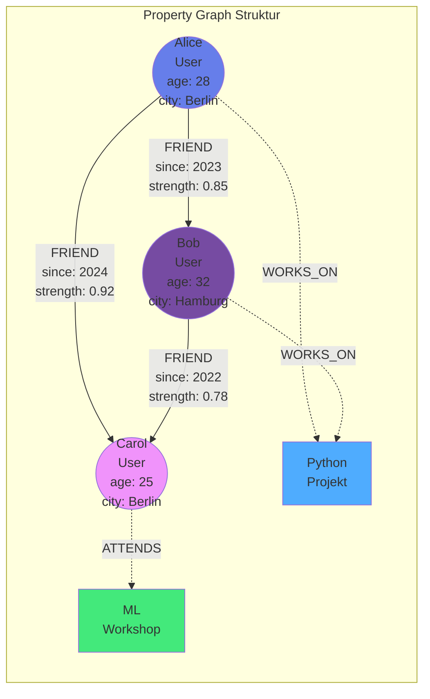
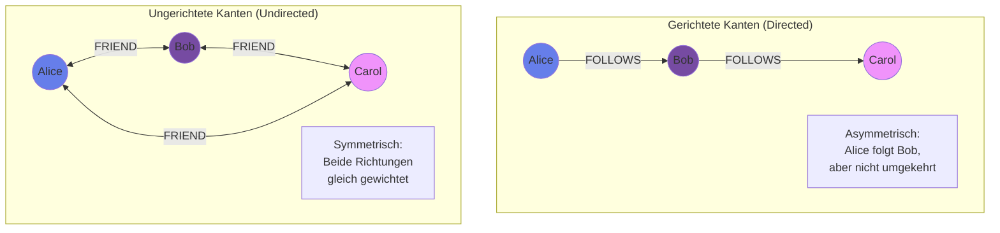
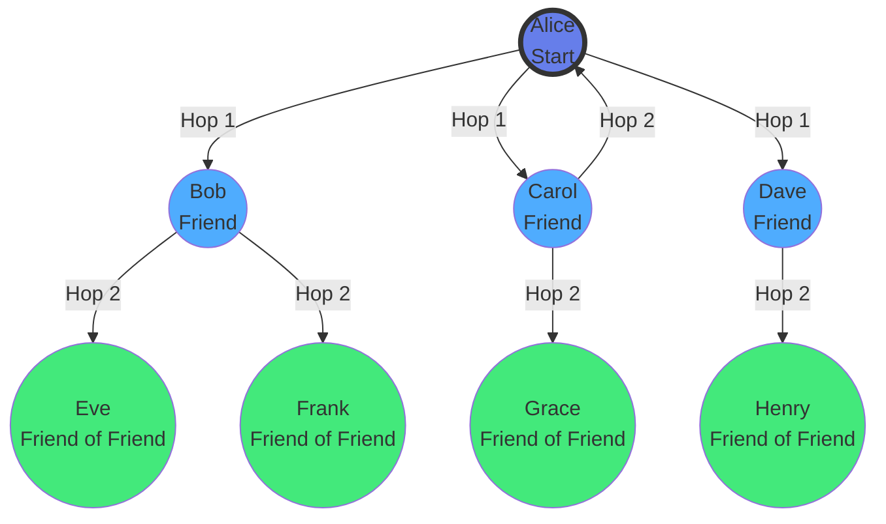
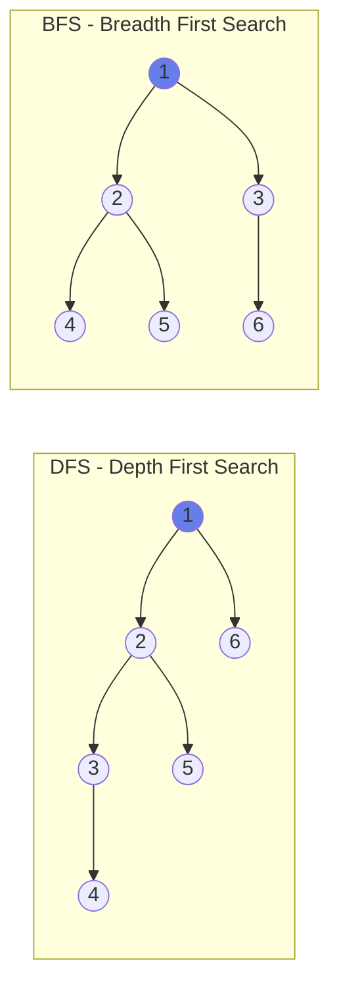

# Kapitel 6: Graph-Datenbanken

> *"The world is a graph, not a table."* — Graph-Datenbank-Community

## 6.1 Einführung: Die Welt der Verbindungen

Die Welt besteht aus Beziehungen. Menschen kennen andere Menschen. Websites verlinken auf andere Websites. Produkte werden zusammen gekauft. Straßen verbinden Städte. Diese natürlich vernetzten Strukturen lassen sich am besten als **Graphen** darstellen.

### Das Problem mit Relationalen Datenbanken

Versuchen Sie, folgende Frage mit SQL zu beantworten: *"Finde alle Freunde meiner Freunde, die in derselben Stadt wohnen und mindestens 3 gemeinsame Interessen haben."*

Mit relationalen Tabellen benötigen Sie:
- Multiple Self-Joins über die `friendships`-Tabelle
- Subqueries für gemeinsame Interessen
- Performance-Probleme bei mehr als 3-4 Hop-Levels
- Komplexe Query-Logik, die schwer zu warten ist

```aql
-- Freunde von Freunden (nur 2 Hops!)
SELECT DISTINCT u3.*
FROM users u1
JOIN friendships f1 ON u1.id = f1.user_id
JOIN users u2 ON f1.friend_id = u2.id
JOIN friendships f2 ON u2.id = f2.user_id
JOIN users u3 ON f2.friend_id = u3.id
WHERE u1.id = '...' 
  AND u3.city = u1.city
  AND ... -- gemeinsame Interessen?
```

Diese Query wird schnell unleserlich und langsam.

### Die Graph-Lösung

In ThemisDB wird dieselbe Frage intuitiv und performant:

```python
result = db.graph_query("""
    FOR user IN users
        FILTER user.id == @my_id
        FOR friend IN 1..2 OUTBOUND user friendships
            FILTER friend.city == user.city
            LET common_interests = LENGTH(
                INTERSECTION(user.interests, friend.interests)
            )
            FILTER common_interests >= 3
            RETURN friend
""", bind_vars={"my_id": my_id})
```

Die Graph-Query ist:
- ✅ Lesbarer und deklarativer
- ✅ Beliebig viele Hops möglich (`1..10`, `1..ANY`)
- ✅ Performance skaliert mit Graph-Struktur, nicht mit Datenmenge
- ✅ Native Graph-Algorithmen verfügbar

## 6.2 Property Graph Modell

ThemisDB verwendet das **Property Graph**-Modell, den De-facto-Standard für Graph-Datenbanken.

### Komponenten

**1. Knoten (Vertices/Nodes)**
- Repräsentieren Entitäten (Personen, Orte, Produkte)
- Haben einen eindeutigen Identifier
- Können beliebige Properties haben
- Können Labels/Types haben

```python
user_node = {
    "id": "user_001",
    "type": "User",
    "name": "Alice",
    "age": 28,
    "city": "Berlin",
    "interests": ["Python", "ML", "Hiking"]
}
```



Abb. 06.1: Graph-Traversierung-Algorithmus

**2. Kanten (Edges/Relationships)**
- Verbinden zwei Knoten (gerichtet oder ungerichtet)
- Haben einen Typ (z.B. "FRIEND", "LIKES", "WORKS_AT")
- Können Properties haben (z.B. "since", "strength")
- Erlauben Multi-Edges (mehrere Kanten zwischen denselben Knoten)

```python
friendship_edge = {
    "from": "user_001",
    "to": "user_002",
    "type": "FRIEND",
    "since": "2023-05-15",
    "strength": 0.85,  # 0-1 basierend auf Interaktionen
    "mutual_friends": 12
}
```

**3. Graph-Collections**

ThemisDB organisiert Graphs in Collections:
- **Vertex Collections**: Speichern Knoten (z.B. `users`, `posts`)
- **Edge Collections**: Speichern Kanten (z.B. `friendships`, `likes`)

```python
# Graph erstellen
db.create_vertex_collection("users")
db.create_edge_collection("friendships")

# Graph-Definition
graph_def = {
    "name": "social_network",
    "edge_definitions": [{
        "collection": "friendships",
        "from": ["users"],
        "to": ["users"]
    }]
}
db.create_graph(graph_def)
```

### Gerichtete vs. Ungerichtete Kanten

**Gerichtet (Directed):**
```python
# Alice folgt Bob, aber Bob folgt Alice nicht
{"from": "alice", "to": "bob", "type": "FOLLOWS"}
```

Beispiele: Twitter-Follows, Hyperlinks, Reporting-Struktur

**Ungerichtet (Undirected):**
```python
# Freundschaft ist bidirektional
{"from": "alice", "to": "bob", "type": "FRIEND"}
{"from": "bob", "to": "alice", "type": "FRIEND"}  # Beide Richtungen
```

Beispiele: Facebook-Freunde, Co-Autoren, Straßen

ThemisDB speichert alle Kanten gerichtet, aber Graph-Queries können beide Richtungen traversieren:
- `OUTBOUND` - Von A nach B
- `INBOUND` - Von B nach A
- `ANY` - Beide Richtungen (für ungerichtete Graphs)



Abb. 06.2: Shortest-Path-Berechnung

## 6.3 Graph-Traversierung

### Traversierungs-Arten

**1. Depth-First Search (DFS)**
- Geht zuerst in die Tiefe
- Verwendet Stack
- Findet schnell tiefe Pfade

```python
# DFS: Alle erreichbaren Knoten
FOR v, e, p IN 1..10 OUTBOUND @start_vertex friendships
    OPTIONS {bfs: false}  # DFS (default)
    RETURN {vertex: v, path: p}
```

**2. Breadth-First Search (BFS)**
- Geht zuerst in die Breite
- Verwendet Queue
- Findet kürzeste Pfade

```python
# BFS: Kürzester Pfad
FOR v, e, p IN 1..10 OUTBOUND @start_vertex friendships
    OPTIONS {bfs: true}  # BFS
    RETURN {vertex: v, path: p}
```

**3. Bounded Traversal**
- Limitiert Anzahl der Hops
- `1..1` - Nur direkte Nachbarn
- `1..2` - Bis zu 2 Hops
- `2..4` - Zwischen 2 und 4 Hops
- `1..ANY` - Alle erreichbaren Knoten

```python
# Freunde von Freunden (exakt 2 Hops)
FOR v IN 2..2 OUTBOUND @my_id friendships
    RETURN v
```



Abb. 06.3: Community-Detection-Workflow



Abb. 06.4: Pagerank-Algorithmus-Visualisierung

### Pattern Matching

Graph-Queries in ThemisDB unterstützen komplexe Patterns:

```python
# Triangle Pattern: A kennt B, B kennt C, C kennt A
FOR a IN users
    FOR b IN OUTBOUND a friendships
        FOR c IN OUTBOUND b friendships
            FILTER c._id == a._id
            RETURN {a: a.name, b: b.name, c: c.name}
```

```python
# Diamond Pattern: Mehrere Pfade zwischen zwei Knoten
FOR start IN users FILTER start.id == @user_id
    FOR end IN OUTBOUND start friendships
        LET paths = (
            FOR v, e, p IN 2..2 OUTBOUND start friendships
                FILTER v._id == end._id
                RETURN p
        )
        FILTER LENGTH(paths) > 1  # Mehrere Pfade
        RETURN {start: start.name, end: end.name, paths: paths}
```

## 6.4 Graph-Algorithmen

ThemisDB bietet native Implementierungen gängiger Graph-Algorithmen:

### Shortest Path (Dijkstra)

Findet den kürzesten Pfad zwischen zwei Knoten unter Berücksichtigung von Gewichten:

```python
from themis_client import shortest_path

path = shortest_path(
    graph="social_network",
    start_vertex="users/alice",
    target_vertex="users/bob",
    direction="outbound",
    weight_attribute="strength"  # Optional: Kantengewicht
)

print(f"Pfad: {' -> '.join([v['name'] for v in path['vertices']])}")
print(f"Distanz: {path['distance']}")
```

**Use Cases:**
- Routing und Navigation
- Social Distance berechnen
- Kostenoptimale Pfade finden

### All Shortest Paths

Findet alle kürzesten Pfade (falls mehrere existieren):

```python
paths = db.all_shortest_paths(
    graph="social_network",
    start_vertex="users/alice",
    target_vertex="users/bob"
)

for idx, path in enumerate(paths):
    print(f"Pfad {idx+1}: {' -> '.join([v['name'] for v in path['vertices']])}")
```

### K Shortest Paths

Findet die k kürzesten Pfade:

```python
paths = db.k_shortest_paths(
    graph="social_network",
    start_vertex="users/alice",
    target_vertex="users/bob",
    k=3  # Top 3 kürzeste Pfade
)
```

### Connected Components

Findet zusammenhängende Teilgraphen:

```python
components = db.connected_components(
    graph="social_network",
    direction="any"  # Ungerichtet behandeln
)

# Gruppiere Knoten nach Component
for component_id, vertices in components.items():
    print(f"Community {component_id}: {len(vertices)} Mitglieder")
```

**Use Cases:**
- Community-Erkennung
- Isolierte Gruppen finden
- Netzwerk-Fragmentierung analysieren

### PageRank

Berechnet die Wichtigkeit von Knoten basierend auf eingehenden Kanten:

```python
pagerank_scores = db.pagerank(
    graph="social_network",
    iterations=20,
    damping_factor=0.85
)

# Sortiere nach Score
top_users = sorted(
    pagerank_scores.items(), 
    key=lambda x: x[1], 
    reverse=True
)[:10]

for user_id, score in top_users:
    user = db.get("users", user_id)
    print(f"{user['name']}: {score:.4f}")
```

**Use Cases:**
- Influencer-Identifikation
- Content-Ranking
- Reputations-Systeme

### Betweenness Centrality

Misst, wie oft ein Knoten auf kürzesten Pfaden liegt:

```python
centrality = db.betweenness_centrality(
    graph="social_network"
)

# Knoten mit hoher Betweenness = Brücken zwischen Communities
bridges = [k for k, v in centrality.items() if v > 0.5]
```

**Use Cases:**
- Netzwerk-Bottlenecks identifizieren
- Wichtige Vermittler finden
- Kritische Infrastruktur-Knoten

---

## 6.4A Temporale Graph-Queries: Zeitreisen im Wissensgraph

Eine der mächtigsten Features von ThemisDB ist die Fähigkeit, **zeitabhängige Graph-Traversals** durchzuführen. Dies ist besonders wichtig für Anwendungen, die historische Zustände nachvollziehen müssen – etwa für Compliance, Audit, oder rechtssichere Dokumentation.

### Das Problem: Wie sah der Graph *damals* aus?

Stellen Sie sich folgende Szenarien vor:

**Szenario 1 - Compliance-Anfrage:**
> "Welche Zugriffsrechte hatte Benutzer X am 15. März 2024 um 14:30 Uhr?"

**Szenario 2 - Verwaltungsakt:**
> "Auf welcher Datengrundlage basierte der Bescheid vom 10. Januar 2024? Welche Dokumente waren zu diesem Zeitpunkt verknüpft?"

**Szenario 3 - Betrugserkennung:**
> "Zu welchen verdächtigen Konten hatte Account Y Verbindungen in der Woche vor der Sperrung?"

In traditionellen Graph-Datenbanken müssten Sie entweder:
1. **Alle Änderungen manuell versionieren** (aufwändig, fehleranfällig)
2. **Snapshot-Backups** erstellen (speicherintensiv, grobe Granularität)
3. **Audit-Logs parsen** (langsam, komplex)

### Die Lösung: Temporale Kanten mit valid_from/valid_to

ThemisDB erlaubt es, Kanten mit Gültigkeitszeiträumen zu versehen:

```python
# Kante mit temporalen Feldern erstellen
db.create_edge(
    from_node="users/alice",
    to_node="departments/engineering",
    edge_type="WORKS_IN",
    properties={
        "role": "Senior Engineer",
        "valid_from": 1640995200000,  # 2022-01-01 00:00:00 UTC (ms)
        "valid_to": 1704067200000     # 2024-01-01 00:00:00 UTC (ms)
    }
)

# Neue Kante für neue Abteilung
db.create_edge(
    from_node="users/alice",
    to_node="departments/research",
    edge_type="WORKS_IN",
    properties={
        "role": "Lead Researcher",
        "valid_from": 1704067200000,  # 2024-01-01 00:00:00 UTC (ms)
        "valid_to": None              # Aktuell gültig (kein Enddatum)
    }
)
```

**Semantik der temporalen Felder:**

- `valid_from = null`: Kante gilt seit Anbeginn der Zeit
- `valid_to = null`: Kante gilt unbegrenzt in die Zukunft
- `valid_from = T1, valid_to = T2`: Kante galt im Intervall [T1, T2]
- Beide `null`: Kante ist zeitlos (eternal)

### Point-in-Time Queries: Graph-Zustand zu einem Zeitpunkt

**API: bfsAtTime() - Breadth-First Search mit Zeitfilter**

```cpp
// C++ API Signatur
std::pair<Status, std::vector<std::string>> bfsAtTime(
    std::string_view startPk,      // Startknoten
    int64_t timestamp_ms,           // Zeitpunkt (ms seit Epoch)
    int maxDepth = 3                // Maximale Traversierungstiefe
) const;
```

**Wie es funktioniert:**

Die `bfsAtTime()`-Funktion durchläuft den Graphen wie eine normale BFS, aber mit einem entscheidenden Unterschied: **Jede Kante wird vor der Traversierung auf Gültigkeit geprüft**.

Die Implementation prüft für jede Kante, ob sie zum Query-Zeitpunkt gültig war, indem sie `valid_from` und `valid_to` vergleicht. Nur Kanten, die im Zeitfenster lagen, werden in der Traversierung berücksichtigt. Dies erlaubt es, historische Graph-Zustände präzise zu rekonstruieren.

📁 **Vollständiger Code:** `src/storage/graph/temporal_traversal.cpp` (~150 Zeilen)

**Kernlogik der temporalen Validierung:**

```cpp
// Temporale Gültigkeitsprüfung für Kanten
bool isValidAtTime(Edge edge, int64_t query_time) {
    // Kante noch nicht gültig?
    if (edge.valid_from.has_value() && query_time < edge.valid_from) {
        return false;
    }
    // Kante nicht mehr gültig?
    if (edge.valid_to.has_value() && query_time > edge.valid_to) {
        return false;
    }
    return true;  // Kante war zum Query-Zeitpunkt gültig
}

std::vector<std::string> bfsAtTime(string start, int64_t timestamp, int maxDepth) {
    queue<Node> frontier;
    set<string> visited;
    
    frontier.push({start, 0});
    visited.insert(start);
    
    while (!frontier.empty()) {
        auto [current_node, depth] = frontier.front();
        frontier.pop();
        
        if (depth > maxDepth) continue;
        
        for (auto& edge : getOutgoingEdges(current_node)) {
            // KRITISCH: Temporaler Filter vor Traversierung!
            if (!isValidAtTime(edge, timestamp)) continue;
            
            if (visited.count(edge.to) == 0) {
                visited.insert(edge.to);
                frontier.push({edge.to, depth + 1});
            }
        }
    }
    return visited;  // Alle erreichbaren Knoten zum Zeitpunkt
}
```

**Zusätzliche Features in vollständiger Implementation:**
- Pfad-Tracking für Nachvollziehbarkeit
- Cycle-Detection für sichere Traversierung
- Optimierte Edge-Filterung mit Bloom-Filtern
- Parallele Traversierung für große Graphen

**Der entscheidende Unterschied:** Die Zeile `if (!isValidAtTime(edge, timestamp)) continue;` filtert historisch ungültige Kanten **vor** der Traversierung. Dadurch sieht die BFS exakt den Graph-Zustand, wie er zum Query-Zeitpunkt existierte.

**Praktisches Beispiel:**

```python
# Frage: Welche Abteilungen konnte Alice am 1. Juli 2023 erreichen?
timestamp = datetime(2023, 7, 1).timestamp() * 1000  # In Millisekunden

result = db.graph.bfsAtTime(
    start="users/alice",
    timestamp_ms=int(timestamp),
    max_depth=3
)

print(f"Erreichbare Knoten am 1. Juli 2023: {result}")
# Output: ['users/alice', 'departments/engineering', 'projects/project-x']
# → 'departments/research' fehlt, weil Alice erst 2024 dorthin wechselte!
```

### Shortest Path mit Zeitfilter: dijkstraAtTime()

Für gewichtete Graphen unterstützt ThemisDB auch temporale Kürzeste-Pfad-Suche:

```cpp
// C++ API Signatur
std::pair<Status, PathResult> dijkstraAtTime(
    std::string_view startPk,
    std::string_view targetPk,
    int64_t timestamp_ms
) const;

// PathResult enthält:
struct PathResult {
    std::vector<std::string> path;  // Knoten vom Start zum Ziel
    double totalCost;                // Gesamtkosten des Pfades
};
```

**Use Case: Organisationshierarchie zum Zeitpunkt eines Bescheids**

```python
# Frage: Wer war am 10. Januar 2024 der kürzeste Eskalationspfad
# von einem Sachbearbeiter zu einem Abteilungsleiter?

timestamp = datetime(2024, 1, 10, 14, 30).timestamp() * 1000

path_result = db.graph.dijkstraAtTime(
    start="users/sachbearbeiter-123",
    target="users/abteilungsleiter-456",
    timestamp_ms=int(timestamp)
)

if path_result.status.ok:
    print(f"Eskalationspfad am 10.01.2024:")
    for i, node in enumerate(path_result.path):
        print(f"  {i}. {node}")
    print(f"Hierarchie-Distanz: {path_result.totalCost}")
```

**Ausgabe:**
```
Eskalationspfad am 10.01.2024:
  0. users/sachbearbeiter-123
  1. users/teamleiter-789
  2. users/abteilungsleiter-456
Hierarchie-Distanz: 2.0
```

**Warum ist das wichtig?**

Wenn später ein Bescheid angefochten wird und die Frage aufkommt: "War die Eskalation regelkonform?", können Sie **exakt nachweisen**, welche Hierarchie zum Zeitpunkt der Entscheidung galt – auch wenn die Organisation sich seitdem umstrukturiert hat.

### Time-Range Queries: Kanten in einem Zeitfenster

Manchmal interessiert nicht ein einzelner Zeitpunkt, sondern ein **Zeitraum**:

> "Welche Zugriffsrechte überlappten mit dem Quartal Q4 2024?"

```cpp
// C++ API für Time-Range Queries
struct TimeRangeFilter {
    int64_t start_ms;  // Fenster-Start
    int64_t end_ms;    // Fenster-Ende
    
    // Prüft ob Kante mit Zeitfenster überlappt
    bool hasOverlap(optional<int64_t> edge_valid_from,
                    optional<int64_t> edge_valid_to) const;
    
    // Prüft ob Kante vollständig im Fenster enthalten ist
    bool fullyContains(optional<int64_t> edge_valid_from,
                       optional<int64_t> edge_valid_to) const;
};

std::pair<Status, std::vector<EdgeInfo>> getEdgesInTimeRange(
    int64_t range_start_ms,
    int64_t range_end_ms,
    bool require_full_containment = false
) const;
```

**Beispiel: Audit-Abfrage für Q4 2024**

```python
# Zeitfenster definieren
q4_start = datetime(2024, 10, 1).timestamp() * 1000
q4_end = datetime(2024, 12, 31, 23, 59, 59).timestamp() * 1000

# Alle Kanten finden, die mit Q4 überlappen
edges = db.graph.getEdgesInTimeRange(
    range_start_ms=int(q4_start),
    range_end_ms=int(q4_end),
    require_full_containment=False  # Überlappung reicht
)

print(f"Gefunden: {len(edges)} Kanten mit Überlappung zu Q4 2024")

for edge in edges:
    print(f"  {edge.from_pk} → {edge.to_pk}")
    print(f"    Gültig: {edge.valid_from} bis {edge.valid_to}")
```

**Überlappungs-Logik visualisiert:**

```
Query-Zeitfenster:     [──────Q4 2024──────]
                       Oct 1            Dec 31

Kante A: [─────────]                         ✓ Überlappt (vor Q4, endet in Q4)
Kante B:         [──────────────]            ✓ Überlappt (komplett in Q4)
Kante C:                    [──────────]     ✓ Überlappt (startet in Q4, endet nach Q4)
Kante D: [────]                              ✗ Keine Überlappung (endet vor Q4)
Kante E:                                [──] ✗ Keine Überlappung (startet nach Q4)
```

### Revisionssicherheit: Verwaltungsakte dokumentieren

**Das Szenario:**

Eine Behörde erstellt einen Bescheid am **15. März 2024**. Dieser Bescheid verweist auf:
- 3 Gutachten
- 2 Gesetze  
- 4 frühere Verwaltungsakte

Sechs Monate später wird der Bescheid angefochten. Die Frage: *"Auf welcher Datengrundlage basierte die Entscheidung?"*

**Die Lösung mit temporalen Graphen:**

```python
# 1. Beim Erstellen des Bescheids: Graph-Snapshot implizit gespeichert
bescheid_timestamp = datetime(2024, 3, 15, 10, 30).timestamp() * 1000

# 2. Sechs Monate später: Rekonstruktion der damaligen Datenlage
verwandte_dokumente = db.graph.bfsAtTime(
    start=f"bescheide/{bescheid_id}",
    timestamp_ms=bescheid_timestamp,
    max_depth=2  # Direkte + indirekte Referenzen
)

# 3. Für jedes Dokument: Exakte Version zum Zeitpunkt abrufen
for doc_id in verwandte_dokumente:
    doc_version = db.get_document_at_time(doc_id, bescheid_timestamp)
    print(f"Dokument {doc_id} (Stand {bescheid_timestamp}):")
    print(f"  Titel: {doc_version['title']}")
    print(f"  Version: {doc_version['version']}")
    print(f"  Checksum: {doc_version['checksum']}")
```

**Resultat:** Sie können **beweisen**, dass der Bescheid auf den zum Entscheidungszeitpunkt gültigen Dokumenten basierte – selbst wenn diese Dokumente seitdem aktualisiert wurden.

### Performance-Überlegungen

**Speicher-Overhead:**

Temporale Kanten benötigen 16 zusätzliche Bytes pro Kante (2 × int64 für Timestamps):

```
Normale Kante:   ~80 Bytes
Temporale Kante: ~96 Bytes
→ Overhead: 20%
```

Bei 10 Millionen Kanten: ~160 MB zusätzlicher Speicher. **Akzeptabel** für die gewonnene Funktionalität.

**Query-Performance:**

Die temporale Filterung ist sehr effizient, da der Check inline während der Traversierung passiert:

```cpp
// Pro Kante: 2 Integer-Vergleiche (~2 CPU-Zyklen)
if (edge.valid_from && timestamp < edge.valid_from) return false;
if (edge.valid_to && timestamp > edge.valid_to) return false;
```

**Benchmark:** bfsAtTime() ist nur ~5-10% langsamer als normale BFS, da der Overhead durch CPU-Cache-Hits minimiert wird.

### Best Practices

**1. Timestamps immer in Millisekunden (Unix Epoch)**

```python
# ✅ Richtig: Millisekunden seit 1970-01-01
timestamp_ms = int(datetime.now().timestamp() * 1000)

# ❌ Falsch: Sekunden (zu grobe Granularität)
timestamp_s = int(datetime.now().timestamp())
```

**2. `valid_to = null` für aktuell gültige Beziehungen**

```python
# ✅ Richtig: Kein Enddatum = unbegrenzt gültig
edge = {
    "valid_from": now_ms,
    "valid_to": None
}

# ❌ Falsch: Festes Enddatum in ferner Zukunft
edge = {
    "valid_from": now_ms,
    "valid_to": 9999999999999  # Unflexibel!
}
```

**3. Indizes auf temporalen Feldern**

```python
# Index für effiziente temporale Queries
db.create_index(
    collection="edges",
    fields=["valid_from", "valid_to"],
    index_type="range"
)
```

---

## 6.5 Praxisbeispiel 1: Social Network

Jetzt setzen wir die Theorie in die Praxis um mit einem vollständigen Social Network.

### Das Projekt

Das Social Network-Example (`examples/06_graph_social_network`) implementiert:
- Benutzerprofile mit Interessen
- Bidirektionale Freundschaften
- Graph-Traversierung (Freunde von Freunden)
- Kürzeste Pfade zwischen Usern
- Community-Erkennung
- Freundschafts-Empfehlungen
- Interaktive Visualisierung mit NetworkX

### Datenmodell

```python
# models.py
from dataclasses import dataclass
from typing import List, Optional
from datetime import datetime

@dataclass
class User:
    """Ein Benutzer im sozialen Netzwerk."""
    id: str
    name: str
    bio: Optional[str] = None
    interests: List[str] = None
    location: Optional[str] = None
    joined: datetime = None
    
    def to_dict(self):
        return {
            "id": self.id,
            "name": self.name,
            "bio": self.bio,
            "interests": self.interests or [],
            "location": self.location,
            "joined": self.joined.isoformat() if self.joined else None
        }

@dataclass
class Friendship:
    """Eine Freundschaft zwischen zwei Benutzern."""
    from_user: str
    to_user: str
    since: datetime
    strength: float = 1.0  # 0-1, basierend auf Interaktionen
    
    def to_dict(self):
        return {
            "from": f"users/{self.from_user}",
            "to": f"users/{self.to_user}",
            "since": self.since.isoformat(),
            "strength": self.strength
        }
```

### Graph Setup

Das Social Network wird mit Collections für Knoten (Vertices) und Kanten (Edges) initialisiert. Die Graph-Definition verknüpft beide Collections zu einem logischen Graphen, über den Traversierungen möglich sind.

📁 **Vollständiger Code:** `examples/06_graph_social_network/themis_client.py` (~250 Zeilen)

```python
class ThemisGraphClient:
    def __init__(self, host="localhost", port=8529):
        self.client = ThemisDB(host=host, port=port)
        self.db = self.client.db("social_network")
        self._setup_graph()
    
    def _setup_graph(self):
        """Erstellt Collections und Graph-Definition."""
        # Vertex Collection für User
        if not self.db.has_collection("users"):
            self.db.create_vertex_collection("users")
        
        # Edge Collection für Freundschaften
        if not self.db.has_collection("friendships"):
            self.db.create_edge_collection("friendships")
        
        # Graph-Definition verknüpft Collections
        graph_def = {
            "name": "social_graph",
            "edge_definitions": [{
                "collection": "friendships",
                "from": ["users"],  # Von users...
                "to": ["users"]      # ...zu users (self-referencing)
            }]
        }
        self.db.create_graph(graph_def)
        
        # Indexes für schnelle Lookups
        self.db.add_index("users", ["name", "location"])
        self.db.add_index("friendships", ["from", "to"])
```

**Kernfunktionen:**
- `add_user()` - Fügt neue Benutzer mit Profil und Interessen hinzu
- `add_friendship()` - Erstellt **bidirektionale** Freundschaften (beide Richtungen)
- `get_friends()` - Liefert direkte Freunde eines Benutzers
- `find_friends_of_friends()` - 2-Hop-Traversierung für Empfehlungen
- `shortest_path()` - Kürzester Pfad zwischen zwei Usern

**Besonderheit:** Freundschaften werden als **zwei Kanten** gespeichert (A→B und B→A), um ungerichtete Graphen zu modellieren. Dies vereinfacht Traversierungen mit `OUTBOUND`.

### Friends-of-Friends (FoF)

Ein klassisches Graph-Problem: Finde Freunde meiner Freunde, die noch nicht meine Freunde sind.

```python
def get_friend_suggestions(self, user_id: str, limit: int = 10) -> List[dict]:
    """Empfiehlt neue Freunde basierend auf gemeinsamen Freunden."""
    query = """
        FOR friend IN OUTBOUND @user_id friendships
            FOR fof IN OUTBOUND friend._id friendships
                FILTER fof._id != @user_id
                FILTER fof._id NOT IN (
                    FOR f IN OUTBOUND @user_id friendships
                        RETURN f._id
                )
                COLLECT fof_user = fof WITH COUNT INTO mutual_count
                SORT mutual_count DESC
                LIMIT @limit
                RETURN {
                    user: fof_user,
                    mutual_friends: mutual_count
                }
    """
    return self.db.execute_query(query, bind_vars={
        "user_id": f"users/{user_id}",
        "limit": limit
    })
```

**Was passiert hier?**
1. Traversiere zu allen Freunden (`OUTBOUND @user_id`)
2. Von jedem Freund, traversiere zu deren Freunden (`OUTBOUND friend._id`)
3. Filtere mich selbst heraus (`FILTER fof._id != @user_id`)
4. Filtere existierende Freunde heraus (Subquery)
5. Gruppiere nach FoF und zähle gemeinsame Freunde (`COLLECT ... WITH COUNT`)
6. Sortiere nach Anzahl gemeinsamer Freunde

### Kürzeste Pfade

Wie ist Alice mit Bob verbunden?

```python
def find_connection_path(self, user_id1: str, user_id2: str) -> dict:
    """Findet den kürzesten Pfad zwischen zwei Benutzern."""
    path = self.db.shortest_path(
        graph="social_graph",
        start_vertex=f"users/{user_id1}",
        target_vertex=f"users/{user_id2}",
        direction="any"  # Ungerichtet (beide Richtungen)
    )
    
    if path is None:
        return {"connected": False}
    
    return {
        "connected": True,
        "distance": path["distance"],
        "path": [v["name"] for v in path["vertices"]],
        "degrees_of_separation": len(path["vertices"]) - 1
    }
```

### Community-Erkennung

Welche natürlichen Gruppen gibt es im Netzwerk?

```python
def detect_communities(self) -> dict:
    """Findet Communities mittels Connected Components."""
    components = self.db.connected_components(
        graph="social_graph",
        direction="any"
    )
    
    # Statistiken pro Community
    communities = {}
    for component_id, user_ids in components.items():
        users = [self.db.get("users", uid) for uid in user_ids]
        
        # Gemeinsame Interessen
        all_interests = []
        for user in users:
            all_interests.extend(user.get("interests", []))
        interest_counts = Counter(all_interests)
        
        communities[component_id] = {
            "size": len(users),
            "members": [u["name"] for u in users],
            "top_interests": interest_counts.most_common(5)
        }
    
    return communities
```

### Interaktive Visualisierung

Das Example nutzt NetworkX für Visualisierung:

```python
import networkx as nx
import matplotlib.pyplot as plt

def visualize_network(self, user_id: Optional[str] = None, max_hops: int = 2):
    """Visualisiert das soziale Netzwerk."""
    G = nx.Graph()
    
    if user_id:
        # Nur Ego-Netzwerk eines Users
        query = f"""
            FOR v, e IN 1..{max_hops} ANY @user_id friendships
                RETURN {{vertex: v, edge: e}}
        """
        result = self.db.execute_query(query, bind_vars={"user_id": f"users/{user_id}"})
    else:
        # Ganzes Netzwerk
        users = self.db.all("users")
        friendships = self.db.all("friendships")
        
        for user in users:
            G.add_node(user["_key"], name=user["name"])
        
        for friendship in friendships:
            from_id = friendship["_from"].split("/")[1]
            to_id = friendship["_to"].split("/")[1]
            G.add_edge(from_id, to_id, weight=friendship.get("strength", 1.0))
    
    # Layout mit Spring-Algorithmus
    pos = nx.spring_layout(G, k=0.5, iterations=50)
    
    # Zeichnen
    plt.figure(figsize=(12, 8))
    nx.draw_networkx_nodes(G, pos, node_size=500, node_color='lightblue')
    nx.draw_networkx_edges(G, pos, alpha=0.5)
    nx.draw_networkx_labels(G, pos, labels=nx.get_node_attributes(G, 'name'))
    
    plt.title("Social Network Graph")
    plt.axis('off')
    plt.tight_layout()
    plt.show()
```

### Main Application

```python
# main.py
def main():
    client = ThemisGraphClient()
    
    # Beispiel-Daten
    users = [
        User("alice", "Alice", "Software Engineer", ["Python", "ML", "Hiking"], "Berlin"),
        User("bob", "Bob", "Data Scientist", ["Python", "Statistics", "Music"], "Munich"),
        User("charlie", "Charlie", "DevOps", ["Docker", "Kubernetes", "Hiking"], "Berlin"),
        User("diana", "Diana", "Product Manager", ["Agile", "UX", "Music"], "Hamburg"),
        User("eve", "Eve", "ML Engineer", ["ML", "Python", "Research"], "Berlin"),
    ]
    
    for user in users:
        client.add_user(user)
    
    # Freundschaften
    friendships = [
        ("alice", "bob"),
        ("alice", "charlie"),
        ("bob", "diana"),
        ("charlie", "eve"),
        ("diana", "eve"),
    ]
    
    for user1, user2 in friendships:
        client.add_friendship(Friendship(user1, user2, datetime.now(), 0.8))
    
    # 1. Freunde von Alice
    print("Alice's Friends:")
    friends = client.get_friends("alice")
    for friend in friends:
        print(f"  - {friend.name} ({friend.location})")
    
    # 2. Freundschafts-Empfehlungen für Alice
    print("\nFriend Suggestions for Alice:")
    suggestions = client.get_friend_suggestions("alice", limit=3)
    for suggestion in suggestions:
        print(f"  - {suggestion['user']['name']}: {suggestion['mutual_friends']} mutual friends")
    
    # 3. Verbindung zwischen Alice und Eve
    print("\nConnection between Alice and Eve:")
    path = client.find_connection_path("alice", "eve")
    if path["connected"]:
        print(f"  Path: {' -> '.join(path['path'])}")
        print(f"  Degrees of Separation: {path['degrees_of_separation']}")
    
    # 4. Communities
    print("\nCommunities:")
    communities = client.detect_communities()
    for comm_id, comm_data in communities.items():
        print(f"  Community {comm_id}: {comm_data['size']} members")
        print(f"    Members: {', '.join(comm_data['members'])}")
        print(f"    Top Interests: {[i[0] for i in comm_data['top_interests']]}")
    
    # 5. Visualisierung
    client.visualize_network()

if __name__ == "__main__":
    main()
```

### Output

```
Alice's Friends:
  - Bob (Munich)
  - Charlie (Berlin)

Friend Suggestions for Alice:
  - Diana: 1 mutual friends
  - Eve: 1 mutual friends

Connection between Alice and Eve:
  Path: Alice -> Charlie -> Eve
  Degrees of Separation: 2

Communities:
  Community 1: 5 members
    Members: Alice, Bob, Charlie, Diana, Eve
    Top Interests: ['Python', 'ML', 'Hiking', 'Music', 'Docker']

[Visualization opens in matplotlib window]
```

### Performance-Optimierung

**1. Indexes auf häufig abgefragte Felder:**
```python
self.db.add_index("users", ["name"])
self.db.add_index("users", ["location"])
self.db.add_index("friendships", ["from", "to"])
```

**2. Batch-Operations für viele Inserts:**
```python
def add_users_batch(self, users: List[User]):
    """Fügt mehrere User auf einmal hinzu."""
    user_docs = [u.to_dict() for u in users]
    self.db.insert_many("users", user_docs)
```

**3. Bounded Traversals:**
```python
# Statt 1..ANY (alle Knoten)
FOR v IN 1..3 OUTBOUND @user_id friendships  # Max 3 Hops
    RETURN v
```

**4. Index-basierte Filters:**
```python
# Filter NACH Index-Lookup
FOR user IN users
    FILTER user.location == "Berlin"  # Nutzt Index
    FOR friend IN OUTBOUND user._id friendships
        RETURN friend
```

## 6.6 Praxisbeispiel 2: Recommendation Engine

Das zweite Example (`examples/19_recommendation_engine`) zeigt einen komplexeren Use Case: **ML-basierte Empfehlungen** mit Graph- und Vektor-Daten.

### Das Konzept

Empfehlungssysteme kombinieren mehrere Ansätze:

1. **Collaborative Filtering**: "User, die X mochten, mochten auch Y"
2. **Content-Based Filtering**: "Ähnliche Items basierend auf Features"
3. **Graph-basiert**: "Freunde deiner Freunde kauften X"
4. **Hybrid**: Kombination aller Ansätze

### Datenmodell

```python
@dataclass
class Item:
    """Ein empfehlbares Item (Produkt, Film, etc.)."""
    id: str
    title: str
    category: str
    features: List[str]
    embedding: List[float]  # Content-Embedding für Similarity
    
@dataclass
class Interaction:
    """Eine User-Item Interaktion."""
    user_id: str
    item_id: str
    type: str  # "view", "click", "purchase", "rate"
    rating: Optional[float] = None
    timestamp: datetime = None
    context: dict = None  # Device, location, etc.

@dataclass
class Recommendation:
    """Eine generierte Empfehlung."""
    user_id: str
    item_id: str
    score: float
    method: str  # "collaborative", "content_based", "graph", "hybrid"
    explanation: str
```

### Graph-Setup

```python
def _setup_graph(self):
    """Erstellt Multi-Graph für Recommendations."""
    # Vertex Collections
    self.db.create_vertex_collection("users")
    self.db.create_vertex_collection("items")
    
    # Edge Collections
    self.db.create_edge_collection("interactions")  # User -> Item
    self.db.create_edge_collection("similar_items")  # Item -> Item
    self.db.create_edge_collection("user_similarity")  # User -> User
    
    # Graph-Definition
    graph_def = {
        "name": "recommendation_graph",
        "edge_definitions": [
            {
                "collection": "interactions",
                "from": ["users"],
                "to": ["items"]
            },
            {
                "collection": "similar_items",
                "from": ["items"],
                "to": ["items"]
            },
            {
                "collection": "user_similarity",
                "from": ["users"],
                "to": ["users"]
            }
        ]
    }
    self.db.create_graph(graph_def)
```

### Collaborative Filtering

Findet Items, die ähnliche User mochten:

```python
def collaborative_filtering(self, user_id: str, limit: int = 10) -> List[Recommendation]:
    """Empfehle Items basierend auf ähnlichen Usern."""
    query = """
        // 1. Finde ähnliche User (basierend auf vergangenen Interaktionen)
        FOR similar_user IN OUTBOUND @user_id user_similarity
            SORT similar_user.similarity DESC
            LIMIT 20
            
            // 2. Finde Items, die ähnliche User mochten
            FOR item IN OUTBOUND similar_user._id interactions
                FILTER item.interaction_type IN ["purchase", "rate"]
                FILTER item.rating >= 4  // Nur positive
                
                // 3. Filtere Items, die User schon kennt
                FILTER item._id NOT IN (
                    FOR known_item IN OUTBOUND @user_id interactions
                        RETURN known_item._id
                )
                
                // 4. Aggregiere Score
                COLLECT item_id = item._id 
                AGGREGATE score = AVG(item.rating * similar_user.similarity)
                
                SORT score DESC
                LIMIT @limit
                
                // 5. Hole Item-Details
                LET item_doc = DOCUMENT(item_id)
                RETURN {
                    item_id: item_id,
                    score: score,
                    method: "collaborative",
                    explanation: CONCAT("Users similar to you rated this ", score)
                }
    """
    
    results = self.db.execute_query(query, bind_vars={
        "user_id": f"users/{user_id}",
        "limit": limit
    })
    
    return [Recommendation(**r) for r in results]
```

### Content-Based Filtering

Findet ähnliche Items basierend auf Features:

```python
def content_based_filtering(self, user_id: str, limit: int = 10) -> List[Recommendation]:
    """Empfehle Items ähnlich zu den, die User mag."""
    query = """
        // 1. Finde Items, die User mag
        FOR liked_item IN OUTBOUND @user_id interactions
            FILTER liked_item.rating >= 4
            
            // 2. Finde ähnliche Items
            FOR similar_item IN OUTBOUND liked_item._id similar_items
                SORT similar_item.similarity DESC
                
                // 3. Filtere bekannte Items
                FILTER similar_item._id NOT IN (
                    FOR known IN OUTBOUND @user_id interactions
                        RETURN known._id
                )
                
                // 4. Aggregiere
                COLLECT item_id = similar_item._id
                AGGREGATE score = AVG(similar_item.similarity)
                
                SORT score DESC
                LIMIT @limit
                
                LET item_doc = DOCUMENT(item_id)
                RETURN {
                    item_id: item_id,
                    score: score,
                    method: "content_based",
                    explanation: CONCAT("Similar to items you liked")
                }
    """
    
    results = self.db.execute_query(query, bind_vars={
        "user_id": f"users/{user_id}",
        "limit": limit
    })
    
    return [Recommendation(**r) for r in results]
```

### Graph-basierte Empfehlungen

Nutzt Social Graph für Empfehlungen:

```python
def graph_based_recommendations(self, user_id: str, limit: int = 10) -> List[Recommendation]:
    """Empfehle Items, die Freunde mochten."""
    query = """
        // 1. Traversiere zu Freunden (1-2 Hops)
        FOR friend IN 1..2 OUTBOUND @user_id friendships
            
            // 2. Finde Items, die Freund kaufte
            FOR item IN OUTBOUND friend._id interactions
                FILTER item.interaction_type == "purchase"
                
                // 3. Filtere bekannte Items
                FILTER item._id NOT IN (
                    FOR known IN OUTBOUND @user_id interactions
                        RETURN known._id
                )
                
                // 4. Score basierend auf Freundschafts-Stärke und Rating
                COLLECT item_id = item._id
                AGGREGATE score = AVG(friend.friendship_strength * item.rating)
                
                SORT score DESC
                LIMIT @limit
                
                LET item_doc = DOCUMENT(item_id)
                RETURN {
                    item_id: item_id,
                    score: score,
                    method: "graph_based",
                    explanation: "Your friends liked this"
                }
    """
    
    results = self.db.execute_query(query, bind_vars={
        "user_id": f"users/{user_id}",
        "limit": limit
    })
    
    return [Recommendation(**r) for r in results]
```

### Hybrid Recommendations

Kombiniert alle Methoden mit Gewichtung:

```python
def hybrid_recommendations(self, user_id: str, limit: int = 10) -> List[Recommendation]:
    """Kombiniert alle Empfehlungsmethoden."""
    # Hole Empfehlungen von allen Methoden
    collaborative = self.collaborative_filtering(user_id, limit=20)
    content_based = self.content_based_filtering(user_id, limit=20)
    graph_based = self.graph_based_recommendations(user_id, limit=20)
    
    # Gewichtung
    weights = {
        "collaborative": 0.4,
        "content_based": 0.3,
        "graph_based": 0.3
    }
    
    # Kombiniere Scores
    combined_scores = {}
    for recs, method in [
        (collaborative, "collaborative"),
        (content_based, "content_based"),
        (graph_based, "graph_based")
    ]:
        for rec in recs:
            if rec.item_id not in combined_scores:
                combined_scores[rec.item_id] = {
                    "score": 0,
                    "methods": [],
                    "explanations": []
                }
            
            combined_scores[rec.item_id]["score"] += rec.score * weights[method]
            combined_scores[rec.item_id]["methods"].append(method)
            combined_scores[rec.item_id]["explanations"].append(rec.explanation)
    
    # Sortiere und limitiere
    sorted_items = sorted(
        combined_scores.items(),
        key=lambda x: x[1]["score"],
        reverse=True
    )[:limit]
    
    # Erstelle finale Recommendations
    recommendations = []
    for item_id, data in sorted_items:
        recommendations.append(Recommendation(
            user_id=user_id,
            item_id=item_id,
            score=data["score"],
            method="hybrid",
            explanation=f"Recommended via: {', '.join(data['methods'])}"
        ))
    
    return recommendations
```

### Similarity Berechnung

Berechne User-User und Item-Item Similarity:

```python
def compute_user_similarity(self):
    """Berechnet Similarity zwischen allen User-Paaren."""
    users = self.db.all("users")
    
    for i, user1 in enumerate(users):
        for user2 in users[i+1:]:
            # Gemeinsame Interaktionen
            common_items = self._get_common_interactions(user1["_id"], user2["_id"])
            
            if len(common_items) >= 3:  # Mindestens 3 gemeinsame
                similarity = self._calculate_similarity(
                    user1["interaction_vector"],
                    user2["interaction_vector"]
                )
                
                # Speichere Kante
                self.db.insert("user_similarity", {
                    "from": user1["_id"],
                    "to": user2["_id"],
                    "similarity": similarity,
                    "common_items": len(common_items)
                })

def compute_item_similarity(self):
    """Berechnet Similarity zwischen Items (content-based)."""
    items = self.db.all("items")
    
    for i, item1 in enumerate(items):
        for item2 in items[i+1:]:
            # Cosine Similarity der Embeddings
            similarity = cosine_similarity(
                item1["embedding"],
                item2["embedding"]
            )
            
            if similarity > 0.7:  # Threshold
                self.db.insert("similar_items", {
                    "from": item1["_id"],
                    "to": item2["_id"],
                    "similarity": similarity
                })
```

### Real-Time Updates

Aktualisiere Empfehlungen bei neuen Interaktionen:

```python
def record_interaction(self, interaction: Interaction):
    """Zeichnet Interaktion auf und aktualisiert Empfehlungen."""
    # Speichere Interaktion
    interaction_doc = {
        "from": f"users/{interaction.user_id}",
        "to": f"items/{interaction.item_id}",
        "type": interaction.type,
        "rating": interaction.rating,
        "timestamp": interaction.timestamp.isoformat(),
        "context": interaction.context
    }
    self.db.insert("interactions", interaction_doc)
    
    # Bei Purchase: Update User-Vektor
    if interaction.type == "purchase":
        self._update_user_vector(interaction.user_id, interaction.item_id)
        
        # Recalculate Similarity (async)
        self._queue_similarity_update(interaction.user_id)
```

## 6.7 Graph Best Practices

### 1. Modeling Guidelines

**DO:**
- ✅ Nutze sprechende Edge-Namen (`FRIEND`, `LIKES`, `WORKS_AT`)
- ✅ Speichere Properties auf Kanten (Zeitstempel, Gewichte)
- ✅ Denormalisiere häufig benötigte Daten
- ✅ Nutze Bidirektionale Kanten für ungerichtete Graphs

**DON'T:**
- ❌ Zu viele Edge-Types (schwer zu querien)
- ❌ Properties als separate Knoten (ineffizient)
- ❌ Extrem tiefe Hierarchien (> 10 Levels)

### 2. Performance-Tipps

**Indexes:**
```python
# Composite Index für häufige Lookups
db.add_index("friendships", ["from", "to"])
db.add_index("interactions", ["user_id", "timestamp"])
```

**Bounded Traversals:**
```python
# Limitiere Hops
FOR v IN 1..3 OUTBOUND @start  # Nicht 1..ANY
    LIMIT 100  # Früh limitieren
    RETURN v
```

**Prune Early:**
```python
# Filter so früh wie möglich
FOR v IN 1..5 OUTBOUND @start friendships
    FILTER v.city == "Berlin"  # Früher Filter
    FOR v2 IN OUTBOUND v._id friendships
        RETURN v2
```

### 3. Häufige Patterns

**Pattern 1: Mutual Friends**
```python
FOR friend IN OUTBOUND @user1 friendships
    FILTER friend._id IN (
        FOR f IN OUTBOUND @user2 friendships
            RETURN f._id
    )
    RETURN friend
```

**Pattern 2: Influencer (hohe Degree)**
```python
FOR user IN users
    LET friend_count = LENGTH(
        FOR f IN OUTBOUND user._id friendships
            RETURN 1
    )
    FILTER friend_count > 100
    SORT friend_count DESC
    RETURN {user: user, friends: friend_count}
```

**Pattern 3: Isolated Nodes**
```python
FOR user IN users
    LET connections = (
        FOR v IN ANY user._id friendships
            RETURN 1
    )
    FILTER LENGTH(connections) == 0
    RETURN user
```

## 6.8 Vergleich: ThemisDB vs. Neo4j vs. ArangoDB

| Feature | ThemisDB | Neo4j | ArangoDB |
|---------|----------|-------|----------|
| **Graph Model** | Property Graph | Property Graph | Property Graph |
| **Query Language** | AQL | Cypher | AQL |
| **Multi-Model** | ✅ 4 Models | ❌ Graph only | ✅ 3 Models |
| **ACID** | ✅ Full | ✅ Full | ✅ Full |
| **Sharding** | ✅ Automatic | ❌ Enterprise only | ✅ Yes |
| **Graph Algorithms** | ✅ Built-in | ✅ GDS Library | ✅ Pregel |
| **License** | Apache 2.0 | GPLv3 + Commercial | Apache 2.0 |
| **Embedding Support** | ✅ Native | ❌ No | ❌ No |

**Wann ThemisDB?**
- Multi-Model Daten (Graph + Vektor + Relational)
- Native Vektor-Suche benötigt
- Open-Source und selbst-hosted
- Kombinierte Queries über mehrere Modelle

**Wann Neo4j?**
- Reines Graph-Problem
- Cypher-Erfahrung im Team
- Enterprise Support benötigt
- Graph Data Science Library

**Wann ArangoDB?**
- Ähnlich wie ThemisDB (Multi-Model)
- Mature Community
- Foxx Microservices

## 6.9 Zusammenfassung

In diesem Kapitel haben Sie gelernt:

✅ **Property Graph Modell** - Knoten, Kanten, Properties  
✅ **Graph-Traversierung** - DFS, BFS, Pattern Matching  
✅ **Graph-Algorithmen** - Shortest Path, PageRank, Community Detection  
✅ **Praxis: Social Network** - Vollständiges soziales Netzwerk mit Visualisierung  
✅ **Praxis: Recommendations** - ML-basierte Empfehlungen mit Hybrid-Ansatz  
✅ **Best Practices** - Modeling, Performance, Patterns  

Graph-Datenbanken sind die natürliche Wahl für vernetzte Daten. ThemisDB's Property Graph-Implementierung bietet performante Traversierung, native Algorithmen und die einzigartige Möglichkeit, Graphs mit anderen Modellen zu kombinieren.

Im nächsten Kapitel schauen wir uns **Dokument-Speicherung** an - flexibles, schema-less Design für semi-strukturierte Daten.

---

**Übungen:**

1. Erweitern Sie das Social Network um Posts und Likes (User -> Post -> Likes)
2. Implementieren Sie einen Follower/Following-Mechanismus (Twitter-Style)
3. Fügen Sie PageRank-Berechnung hinzu, um Influencer zu finden
4. Erstellen Sie einen Interest-Based-Graph (User -> Interest <- User)
5. Bauen Sie ein Skill-Recommendation-System für LinkedIn-Style-Netzwerk

**Weiterführende Ressourcen:**

- 📖 `examples/06_graph_social_network/` - Vollständiger Code
- 📖 `examples/19_recommendation_engine/` - Recommendation System
- 📖 `docs/de/features/features_property_graph.md` - Graph-Features
- 📖 NetworkX Documentation - Graph-Visualisierung
- 📖 "Graph Algorithms" (Mark Needham, Amy E. Hodler) - Tiefere Algorithmen

---

## 6.10 Graph-Modul — Erweiterte C++ API (v1.x)

### 6.10.1 GraphQueryOptimizer — Cost-Based Algorithm-Selektion

`GraphQueryOptimizer` (`include/graph/graph_query_optimizer.h`) wählt automatisch den optimalen Traversierungs-Algorithmus anhand von Graph-Statistiken und Query-Constraints.

```cpp
#include "graph/graph_query_optimizer.h"

themis::graph::GraphQueryOptimizer optimizer;

// Graph-Statistiken aktualisieren (für Kostenmodell)
themis::graph::GraphQueryOptimizer::GraphStatistics stats;
stats.vertex_count         = 1_000_000;
stats.edge_count           = 5_000_000;
stats.avg_degree           = 10.0;
stats.avg_branching_factor = 8.0;
optimizer.updateStatistics(stats);

// Query-Plan erzeugen
themis::graph::GraphQueryOptimizer::QueryConstraints constraints;
constraints.max_depth         = 4;
constraints.edge_type         = "FOLLOWS";
constraints.unique_vertices   = true;
constraints.enable_parallel   = true;   // Parallele Frontier-Expansion
constraints.num_threads       = 8;
constraints.timeout_ms        = 500;

auto plan = optimizer.optimize(
    themis::graph::GraphQueryOptimizer::QueryPattern::K_HOP_NEIGHBORS,
    constraints
);
// plan.algorithm: BFS / DFS / BIDIRECTIONAL / ASTAR / DIJKSTRA
// plan.cost_estimate, plan.index_usage, plan.cache_usage

// Constrained Path Finding
auto path_plan = optimizer.optimize(
    themis::graph::GraphQueryOptimizer::QueryPattern::SHORTEST_PATH,
    { .max_depth = 6, .required_vertices = { "intermediary-X" },
      .forbidden_vertices = { "blacklisted-node" } }
);
```

**Adaptive Kostenmodell:** EMA-basiertes Lernen aus Ausführungsfeedback — der Optimizer kalibriert seine Kostenschätzungen anhand tatsächlicher Laufzeiten.

### 6.10.2 DistributedGraphManager — Shard-übergreifende Graph-Queries

```cpp
#include "graph/distributed_graph.h"

themis::graph::DistributedGraphManager::Config dg_cfg;
dg_cfg.local_shard_id     = "shard-0";
dg_cfg.shard_timeout_ms   = 2000;
dg_cfg.enable_streaming   = true;  // Large path-set streaming

themis::graph::DistributedGraphManager dist_graph(shard_clients, dg_cfg);

// Distributed K-Hop Query
auto results = dist_graph.kHopNeighbors("user:alice", /*k=*/3, {
    .edge_type = "KNOWS",
    .max_results = 1000
});

// EXPLAIN Endpunkt (Dry-Run)
auto explain = dist_graph.explain({
    .from = "user:alice", .to = "user:bob",
    .pattern = QueryPattern::SHORTEST_PATH
});
// explain.plan, explain.estimated_shards, explain.estimated_cost
```

## 6.11 Graph-Modul — Scheduled Semantic Edge Refresh (v1.x)

### 6.11.1 ScheduledGraphEdgeRefreshEngine — Semantisch-gesteuerte Kanten-Wartung

`ScheduledGraphEdgeRefreshEngine` (`include/graph/scheduled_edge_refresh.h`) hält einen Property-Graphen semantisch aktuell: Es bewertet Kanten regelmäßig anhand von Vektorähnlichkeit, zeitlichem Verfall und Zentralitätsdämpfung, entfernt irrelevante Kanten und fügt neue, semantisch ähnliche Kanten hinzu — alles in einer einzigen ACID-Transaktion.

**Wissenschaftliche Grundlage:**

| Forschungsbereich | Ansatz | Umsetzung in ThemisDB |
|---|---|---|
| Dynamic Graph Maintenance (Brandes, 2008) | Inkrementelle Kanten-Aktualisierung basierend auf Betweenness-Centrality | `centrality_weight = 1 / (1 + log(1 + out_degree))` in `EdgeScore` |
| STGCN (Yu et al., 2017) | Spatio-temporale GNN-Embeddings für sich entwickelnde Graphen | `NodeEmbeddingProvider` kann GNN-Index nutzen |
| Temporal Graph Evolution (Leskovec et al., 2008) | Exponentieller Verfall der Kantenrelevanz über die Zeit | `temporal_factor = 2^(−age / half_life)` in `computeTemporalDecay()` |
| Link Prediction via Embeddings (Hamilton et al., 2017) | Kosinus-/Skalarprodukt-Ähnlichkeit für Kandidatenkanten | `SimilarityMetric::COSINE / DOT_PRODUCT / EUCLIDEAN` |

```cpp
#include "graph/scheduled_edge_refresh.h"
#include "cdc/changefeed.h"
#include "index/graph_index.h"

// 1. Richtlinie konfigurieren
themis::graph::RefreshPolicy policy;
policy.refresh_interval               = std::chrono::seconds(300); // alle 5 Minuten
policy.similarity_metric              = themis::graph::SimilarityMetric::COSINE;
policy.relevance_threshold            = 0.4f;   // Kanten unter diesem Wert entfernen
policy.add_threshold                  = 0.75f;  // Mindestähnlichkeit für neue Kanten
policy.decay_half_life_seconds        = 86400.0;  // 1 Tag
policy.max_removal_fraction           = 0.05f;  // max. 5% Löschungen pro Zyklus (Sicherheitssperre)
policy.top_k_candidates               = 20;     // top-20 Kandidaten pro Knoten
policy.anomaly_threshold_removal_rate = 0.15f;  // Warnung bei >15% Entfernungen

// 2. Einbettungs-Provider (GNN-Index oder HNSW-Vektorspeicher)
themis::graph::NodeEmbeddingProvider embedding_fn =
    [&](const std::string& node_id) -> std::vector<float> {
        return gnn_index.getEmbedding(node_id);
    };

// 3. Engine erzeugen, Changefeed und CEP-Callback verdrahten, starten
themis::graph::ScheduledGraphEdgeRefreshEngine engine(
    graph_manager, policy, embedding_fn);

auto changefeed = std::make_shared<themis::Changefeed>(rocksdb_ptr);
engine.setChangefeed(changefeed);

engine.setCEPEventCallback([&](themisdb::analytics::Event ev) {
    cep_engine.ingest(ev);  // EDGE_CREATE / EDGE_DELETE ins CEP-System
});

engine.start();  // Hintergrund-Scheduler-Thread starten

// 4. Manueller Trigger (z.B. für Tests)
auto stats = engine.triggerRefresh();
// stats.edges_evaluated, .edges_removed, .edges_added
// stats.cycle_duration_ms, .removal_rate, .anomaly_high_removal_rate

// 5. Anomalie-Prüfung
if (stats.anomaly_high_removal_rate) {
    alert_ops("Anomale Entfernungsrate: " + std::to_string(stats.removal_rate));
}

// 6. Prüfspur auslesen (max. 10.000 Einträge, FIFO-Ring)
for (const auto& entry : engine.getAuditTrail()) {
    // entry.action (ADD / REMOVE), .edge_id, .from_vertex, .to_vertex
    // entry.relevance_score, .timestamp, .cycle_number
}

// 7. Ordentliches Herunterfahren
engine.stop();
```

### 6.11.2 Bewertungsmodell

Die Relevanz jeder Kante ergibt sich aus:

```
relevance = similarity × temporal_factor × centrality_weight
```

| Faktor | Berechnung | Bereich |
|--------|-----------|---------|
| `similarity` (COSINE) | `(cos(a,b) + 1) / 2` | [0, 1] |
| `similarity` (DOT_PRODUCT) | `dot(a,b) / (‖a‖ · ‖b‖)`, normiert | [0, 1] |
| `similarity` (EUCLIDEAN) | `1 / (1 + dist(a,b))` | (0, 1] |
| `temporal_factor` | `2^(−age_s / half_life_s)` | (0, 1] |
| `centrality_weight` | `1 / (1 + log(1 + out_degree))` | (0, 1] |

### 6.11.3 Sicherheitssperren & Anomalieerkennung

```
Safety Gate:  |removal_candidates| / |total_edges| > max_removal_fraction
              → Zyklus abgebrochen (aborted_safety_gate = true), keine Schreibvorgänge

Anomalie:     removal_rate > anomaly_threshold_removal_rate (wenn > 0)
              → anomaly_high_removal_rate = true + Warnung im Log
```

### 6.11.4 ANN-Index für große Graphen

Bei Graphen mit mehr als `policy.ann_min_vertices` Knoten (Standard: 10.000) kann ein ANN-Index angebunden werden, um die Kandidatenentdeckung von O(V²) auf O(V · log V) zu reduzieren:

```cpp
// HNSW-Index aus dem Acceleration-Modul
engine.setANNIndex(&hnsw_index);
// Der Index wird zu Beginn jedes Zyklus automatisch neu aufgebaut
```

**Integrationspunkte:**

| Modul | Integration |
|-------|-------------|
| `index/graph_index.h` | Kanten-CRUD, Adjazenzabfragen, ACID-WriteBatch |
| `acceleration` | HNSW/ANN-Index für O(V·log V) Kandidatenentdeckung |
| `analytics/cep_engine` | `EDGE_CREATE`/`EDGE_DELETE`-Ereignisse nach Commit |
| `cdc/changefeed` | `EVENT_PUT`/`EVENT_DELETE` je Kante für nachgelagerte Konsumenten |
| `temporal_graph` | `_created_at`-Feld für zeitlichen Verfall |

**Weiterführende Dokumentation:** `docs/scheduled_edge_refresh.md` (EN), `docs/de/scheduled_edge_refresh.md` (DE)
