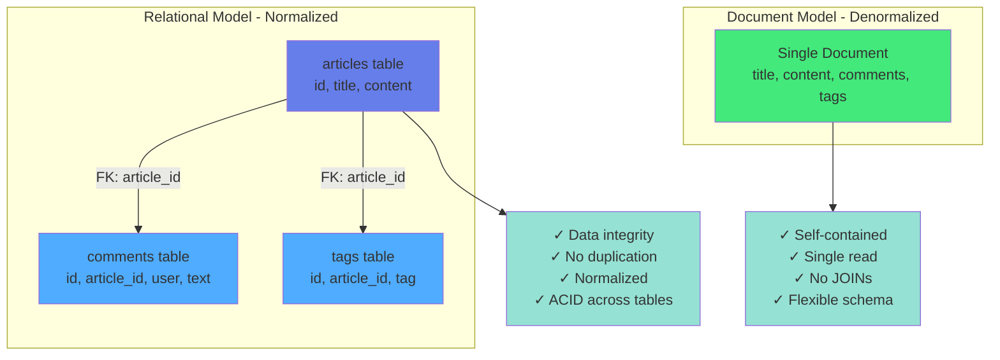

# Kapitel 7: Dokument-Speicherung

> **In diesem Kapitel:** Schema-less Design, flexible Datenstrukturen, Nested Objects, JSON-Operationen, Content Management, Versionierung und Migration von MongoDB.

## 7.1 Das Document Model

### Warum Dokumente?

Das Document Model ist ideal für Anwendungen mit:

- **Flexible Schemas:** Nicht alle Datensätze haben die gleichen Felder
- **Nested Data:** Hierarchische Strukturen (Kommentare, Tags, Metadaten)
- **Rapid Development:** Schema-Evolution ohne Migration
- **Content Management:** Blogs, Wikis, CMS-Systeme

**Beispiele aus der Praxis:**
- Blog-Systeme mit variablen Post-Typen (Text, Video, Galerie)
- Wikis mit verschachtelten Inhalten und Revisionen
- Content-Management mit Metadata
- Konfigurationsdaten mit unterschiedlichen Formaten

### Dokumente in ThemisDB

ThemisDB speichert Dokumente als JSON mit vollem ACID-Support:

```python
from themisdb import ThemisDB

db = ThemisDB()

# Dokument mit beliebiger Struktur
article = {
    "title": "Multi-Model Databases",
    "author": "Alice",
    "content": "Content here...",
    "tags": ["database", "multi-model"],
    "metadata": {
        "published": "2025-01-15",
        "views": 1024
    },
    "comments": [
        {"user": "Bob", "text": "Great article!"},
        {"user": "Carol", "text": "Very helpful"}
    ]
}

db.documents.insert("articles", article)
```

**Vorteile:**
- ✅ Keine Schema-Definition notwendig
- ✅ Beliebige Verschachtelung
- ✅ Arrays von Sub-Dokumenten
- ✅ Optionale Felder
- ✅ JSON-Operationen (Path-Queries, Updates)

### Vergleich: Relational vs. Document

**Relational (starr):**
```aql
-- Zwei separate Collections mit Referenzen
// articles Collection
{
  _key: "1",
  title: "Artikel",
  content: "Text..."
}

// comments Collection (Referenz via article_id)
{
  _key: "c1",
  article_id: "1",
  user: "alice",
  text: "Kommentar"
}
```

**Document (flexibel):**
```json
// Ein Dokument, alles inklusive
{
    "id": 1,
    "title": "...",
    "content": "...",
    "comments": [{"user": "...", "text": "..."}]
}
```



Abb. 07.1: Dokument-Store-Architektur

### Schema Evolution

Neue Felder ohne Migration hinzufügen:

```python
# Version 1: Einfacher Blog-Post
{
    "title": "Hello World",
    "content": "..."
}

# Version 2: Mit Autor (kein ALTER TABLE!)
{
    "title": "Hello World",
    "content": "...",
    "author": "Alice"
}

# Version 3: Mit Tags und Metadata
{
    "title": "Hello World",
    "content": "...",
    "author": "Alice",
    "tags": ["intro", "tutorial"],
    "metadata": {
        "published": "2025-01-15",
        "featured": True
    }
}
```

**Anwendungscode prüft Feld-Existenz:**
```python
article = db.documents.get("articles", article_id)

# Sicher: Prüfe ob Feld existiert
author = article.get("author", "Unknown")
tags = article.get("tags", [])
```

## 7.2 JSON-Operationen

### Path-Queries

Tief in verschachtelten Dokumenten suchen:

```python
# Finde Artikel mit bestimmten Metadaten
articles = db.query("""
    FOR article IN articles
      FILTER article.metadata.published > '2025-01-01'
        AND article.metadata.featured == true
      RETURN article
""")

# Array-Operationen
articles_with_tag = db.query("""
    FOR article IN articles
      FILTER 'database' IN article.tags
      RETURN article
""")

# Nested Object Query
articles_by_bob = db.query("""
    FOR article IN articles
      FILTER 'Bob' IN article.comments[*].user
      RETURN article
""")
```

### Partial Updates

Nur bestimmte Felder ändern:

```python
# Increment View Counter
db.documents.update(
    collection="articles",
    document_id=article_id,
    updates={"metadata.views": db.increment(1)}
)

# Add Comment
new_comment = {"user": "Dave", "text": "Thanks!"}
db.documents.update(
    collection="articles",
    document_id=article_id,
    updates={"comments": db.array_append(new_comment)}
)

# Update nested field
db.documents.update(
    collection="articles",
    document_id=article_id,
    updates={"metadata.featured": True}
)
```

### JSON-Funktionen

```python
# JSON Path Extraction
result = db.query("""
    SELECT 
        title,
        metadata.published AS date,
        ARRAY_LENGTH(comments) AS comment_count
    FROM articles
    WHERE metadata.featured = true
""")

# JSON Aggregation
stats = db.query("""
    SELECT 
        author,
        COUNT(*) AS article_count,
        SUM(metadata.views) AS total_views
    FROM articles
    GROUP BY author
""")
```

## 7.3 Example: Blog/Wiki System

> **Example:** `examples/11_blog_wiki`

Implementieren wir ein vollständiges Content-Management-System mit Artikeln, Revisions-Historie und Tagging.

### System-Überblick

**Features:**
- Artikel mit Rich Content (Markdown)
- Revisions-Historie (alle Änderungen)
- Tagging und Kategorisierung
- Volltext-Suche über Titel und Content
- View-Counter und Statistiken
- Kommentar-System

**Datenstruktur:**
```python
{
    "id": "uuid",
    "title": "Getting Started with ThemisDB",
    "slug": "getting-started-themisdb",
    "content": "# Introduction\n\n...",
    "author": "alice@example.com",
    "status": "published",  # draft, published, archived
    "tags": ["tutorial", "database", "introduction"],
    "category": "tutorials",
    "metadata": {
        "published_at": "2025-01-15T10:00:00Z",
        "updated_at": "2025-01-16T14:30:00Z",
        "views": 1250,
        "featured": True
    },
    "comments": [
        {
            "id": "comment-uuid",
            "author": "bob@example.com",
            "text": "Great tutorial!",
            "created_at": "2025-01-15T11:00:00Z"
        }
    ],
    "revisions": [
        {
            "version": 1,
            "content": "Initial version...",
            "changed_by": "alice@example.com",
            "changed_at": "2025-01-15T10:00:00Z"
        },
        {
            "version": 2,
            "content": "Updated version...",
            "changed_by": "alice@example.com",
            "changed_at": "2025-01-16T14:30:00Z"
        }
    ]
}
```

### Implementation

Die Implementation zeigt ein vollständiges Blog/Wiki-System mit verschachtelten Dokumenten (Comments, Revisions) und flexiblem Schema. Die Datenmodelle nutzen Python Dataclasses für klare Strukturierung, während die Document Engine die komplexe Verschachtelung transparent handhabt.

> **📁 Vollständiger Code:** `examples/blog_wiki/models.py` (ca. 80 Zeilen)

**Datenmodelle (Kernstruktur):**

```python
from dataclasses import dataclass, field
from datetime import datetime
from typing import List
import uuid

@dataclass
class Comment:
    id: str
    author: str
    text: str
    created_at: datetime
    
    @staticmethod
    def create(author: str, text: str) -> dict:
        """Factory-Methode für neue Comments"""
        return {
            "id": str(uuid.uuid4()),
            "author": author,
            "text": text,
            "created_at": datetime.now().isoformat()
        }

@dataclass
class Article:
    id: str
    title: str
    slug: str
    content: str
    author: str
    status: str  # draft, published, archived
    tags: List[str]
    category: str
    metadata: dict
    comments: List[dict] = field(default_factory=list)
    revisions: List[dict] = field(default_factory=list)
```

**Wichtige Design-Entscheidungen:**
- **Verschachtelte Dokumente:** Comments und Revisions als Arrays innerhalb des Articles
- **Flexible Metadaten:** `metadata` dict für erweiterbare Eigenschaften
- **Factory-Methoden:** `Article.create()` initialisiert mit sinnvollen Defaults
- **UUID-basierte IDs:** Dezentrale ID-Generierung für verteilte Systeme

Die vollständige `Article.create()` Methode generiert automatisch Slug, initialisiert Metadaten (created_at, views, etc.) und erstellt die erste Revision.


**Blog/Wiki Service-Klasse:**

Die `BlogWiki` Klasse kapselt alle Datenbankoperationen für das Blog/Wiki-System. Sie demonstriert wichtige Document Engine Features wie Array-Operationen (`array_append`), verschachtelte Updates (`metadata.published_at`), und Transaktionen für atomare Multi-Step-Operationen.

> **📁 Vollständiger Code:** `examples/blog_wiki/blog.py` (ca. 220 Zeilen)

**Index-Setup für Performance:**

```python
from themisdb import ThemisDB

class BlogWiki:
    def __init__(self, db_path: str = "blog.db"):
        self.db = ThemisDB(db_path)
        self._setup_indexes()
    
    def _setup_indexes(self):
        """Erstellt Indizes für häufige Abfragen"""
        # Fulltext-Suche in Titel und Content
        self.db.execute("""
            CREATE INDEX idx_articles_fulltext
            ON articles USING FULLTEXT(title, content)
        """)
        
        # Schneller Slug-Lookup
        self.db.execute("""
            CREATE INDEX idx_articles_slug ON articles(slug)
        """)
        
        # Filter nach Status und Kategorie
        self.db.execute("""
            CREATE INDEX idx_articles_status_category 
            ON articles(status, category)
        """)
```

**CRUD-Operationen (Auszüge):**

```python
    def create_article(self, title: str, content: str, author: str,
                      tags: List[str], category: str) -> str:
        """Neuen Artikel erstellen"""
        article = Article.create(title, content, author, tags, category)
        self.db.documents.insert("articles", article)
        return article["id"]
    
    def update_article(self, article_id: str, content: str, updated_by: str):
        """Artikel aktualisieren - speichert automatisch Revision!"""
        article = self.db.documents.get("articles", article_id)
        
        # Neue Revision erstellen
        new_version = len(article["revisions"]) + 1
        revision = {
            "version": new_version,
            "content": content,
            "changed_by": updated_by,
            "changed_at": datetime.now().isoformat()
        }
        
        with self.db.transaction():
            self.db.documents.update(
                collection="articles",
                document_id=article_id,
                updates={
                    "content": content,
                    "metadata.updated_at": datetime.now().isoformat(),
                    "revisions": self.db.array_append(revision)  # Array-Operation!
                }
            )
```

**Array-Operationen für verschachtelte Dokumente:**

```python
    def add_comment(self, article_id: str, author: str, text: str):
        """Comment zu Article hinzufügen"""
        comment = Comment.create(author, text)
        
        self.db.documents.update(
            collection="articles",
            document_id=article_id,
            updates={
                "comments": self.db.array_append(comment)  # Effizient!
            }
        )
    
    def revert_to_revision(self, article_id: str, version: int):
        """Artikel zu früherer Version zurücksetzen"""
        article = self.db.documents.get("articles", article_id)
        target = next(r for r in article["revisions"] if r["version"] == version)
        
        # Revert wird selbst als neue Revision gespeichert
        revert_revision = {
            "version": len(article["revisions"]) + 1,
            "content": target["content"],
            "changed_by": "system",
            "changed_at": datetime.now().isoformat(),
            "reverted_from": version
        }
        
        with self.db.transaction():
            self.db.documents.update(
                collection="articles",
                document_id=article_id,
                updates={
                    "content": target["content"],
                    "revisions": self.db.array_append(revert_revision)
                }
            )
```

**Aggregation für Statistiken:**

```python
    def get_statistics(self) -> dict:
        """Blog-Statistiken berechnen"""
        return self.db.query("""
            SELECT 
                COUNT(*) AS total_articles,
                SUM(CASE WHEN status='published' THEN 1 ELSE 0 END) AS published,
                SUM(metadata.views) AS total_views,
                AVG(metadata.views) AS avg_views
            FROM articles
        """)[0]
```

Die vollständige Klasse enthält zusätzlich:
- `publish_article()` - Status ändern und Publikationsdatum setzen
- `increment_views()` - View-Counter inkrementieren
- `search_articles()` - Fulltext-Suche
- `get_by_category()` - Kategoriefilter
- `get_by_tags()` - Tag-basierte Suche
- `get_related_articles()` - Empfehlungen basierend auf Tags

### Praktische Anwendung

**Blog-Post erstellen und veröffentlichen:**
```python
from blog import BlogWiki

blog = BlogWiki()

# Create article
article_id = blog.create_article(
    title="Getting Started with ThemisDB",
    content="""
    # Introduction
    
    ThemisDB is a multi-model database...
    
    ## Features
    - ACID transactions
    - Multiple data models
    - High performance
    """,
    author="alice@example.com",
    tags=["tutorial", "database", "getting-started"],
    category="tutorials"
)

# Publish
blog.publish_article(article_id)

# Add comments
blog.add_comment(
    article_id,
    author="bob@example.com",
    text="Great tutorial! Very helpful."
)

# Track views
blog.increment_views(article_id)
```

**Artikel aktualisieren mit Revisions-Historie:**
```python
# Update content
blog.update_article(
    article_id,
    content="""
    # Introduction (Updated!)
    
    ThemisDB is a powerful multi-model database...
    
    ## New Features
    - ACID transactions
    - Multiple data models
    - High performance
    - Geo-spatial support (NEW!)
    """,
    updated_by="alice@example.com"
)

# View revision history
revisions = blog.get_revisions(article_id)
for rev in revisions:
    print(f"Version {rev['version']} by {rev['changed_by']}")
    print(f"  Changed at: {rev['changed_at']}")

# Revert to previous version if needed
blog.revert_to_revision(article_id, version=1, 
                       reverted_by="alice@example.com")
```

**Suchen und Filtern:**
```python
# Fulltext search
results = blog.search_articles("multi-model database")
print(f"Found {len(results)} articles")

# Get by tag
tutorials = blog.get_by_tag("tutorial")

# Get by category
db_articles = blog.get_by_category("database")

# Popular articles
popular = blog.get_popular(limit=5)

# Featured articles
featured = blog.get_featured()
```

**Statistiken:**
```python
stats = blog.get_statistics()
print(f"Total articles: {stats['total_articles']}")
print(f"Published: {stats['published']}")
print(f"Drafts: {stats['drafts']}")
print(f"Total views: {stats['total_views']}")
print(f"Avg views: {stats['avg_views']:.1f}")
```

### Key Features

**1. Schema Flexibility:**
- Artikel können unterschiedliche Felder haben
- Neue Features ohne Migration (z.B. `metadata.featured`)
- Optionale Felder (z.B. `published_at` nur bei Status="published")

**2. Revision History:**
- Jede Änderung wird gespeichert
- Komplette Historie verfügbar
- Revert zu jeder Version möglich

**3. Nested Data:**
- Comments als Array von Sub-Dokumenten
- Metadata als verschachteltes Objekt
- Keine JOIN-Queries notwendig

**4. Performance:**
- Fulltext-Index für Suche
- Index auf Slug für schnelle Lookups
- Composite-Index für Status+Category

## 7.4 Example: Recipe Manager

> **Example:** `examples/13_recipe_manager`

Ein Rezept-Verwaltungssystem zeigt die Stärken des Document Models bei komplexen, verschachtelten Datenstrukturen.

### System-Überblick

**Features:**
- Rezepte mit Zutaten und Schritten
- Nährwertangaben und Tags
- Bewertungen und Kommentare
- Einkaufslisten-Generator
- Meal Planning

**Datenstruktur:**
```python
{
    "id": "uuid",
    "title": "Spaghetti Carbonara",
    "description": "Classic Italian pasta dish",
    "cuisine": "Italian",
    "difficulty": "medium",  # easy, medium, hard
    "prep_time": 15,  # minutes
    "cook_time": 20,
    "servings": 4,
    "ingredients": [
        {
            "name": "Spaghetti",
            "amount": 400,
            "unit": "g",
            "category": "pasta"
        },
        {
            "name": "Eggs",
            "amount": 4,
            "unit": "pieces",
            "category": "dairy"
        },
        {
            "name": "Parmesan",
            "amount": 100,
            "unit": "g",
            "category": "dairy"
        }
    ],
    "steps": [
        {
            "number": 1,
            "instruction": "Boil water and cook spaghetti al dente",
            "duration": 10
        },
        {
            "number": 2,
            "instruction": "Mix eggs with parmesan",
            "duration": 5
        },
        {
            "number": 3,
            "instruction": "Combine pasta with egg mixture",
            "duration": 5
        }
    ],
    "nutrition": {
        "calories": 520,
        "protein": 22,
        "carbs": 65,
        "fat": 18
    },
    "tags": ["pasta", "italian", "quick", "dinner"],
    "ratings": [
        {
            "user": "alice@example.com",
            "score": 5,
            "comment": "Delicious!",
            "date": "2025-01-15"
        }
    ],
    "created_by": "chef@example.com",
    "created_at": "2025-01-10",
    "updated_at": "2025-01-15"
}
```

### Implementation

**`recipe_manager/recipe.py`:**
```python
from themisdb import ThemisDB
from typing import List, Optional
from datetime import datetime

class RecipeManager:
    def __init__(self, db_path: str = "recipes.db"):
        self.db = ThemisDB(db_path)
        self._setup_indexes()
    
    def _setup_indexes(self):
        # Fulltext search
        self.db.execute("""
            CREATE INDEX IF NOT EXISTS idx_recipes_fulltext
            ON recipes USING FULLTEXT(title, description)
        """)
        
        # Filter by tags, cuisine, difficulty
        self.db.execute("""
            CREATE INDEX IF NOT EXISTS idx_recipes_filters
            ON recipes(cuisine, difficulty, tags)
        """)
    
    def add_recipe(self, recipe_data: dict) -> str:
        """Add new recipe"""
        recipe_data["created_at"] = datetime.now().isoformat()
        recipe_data["updated_at"] = datetime.now().isoformat()
        
        recipe_id = self.db.documents.insert("recipes", recipe_data)
        return recipe_id
    
    def search_recipes(self, query: str) -> List[dict]:
        """Search by title or description"""
        return self.db.query("""
            FOR recipe IN recipes
              FILTER FULLTEXT(recipe.title, @query) OR FULLTEXT(recipe.description, @query)
              RETURN recipe
        """, {"query": query})
    
    def filter_recipes(self, cuisine: Optional[str] = None,
                      difficulty: Optional[str] = None,
                      max_time: Optional[int] = None,
                      tags: Optional[List[str]] = None) -> List[dict]:
        """Filter recipes by criteria"""
        # Build AQL query dynamically
        filters = []
        params = {}
        
        if cuisine:
            filters.append("recipe.cuisine == @cuisine")
            params["cuisine"] = cuisine
        
        if difficulty:
            filters.append("recipe.difficulty == @difficulty")
            params["difficulty"] = difficulty
        
        if max_time:
            filters.append("(recipe.prep_time + recipe.cook_time) <= @max_time")
            params["max_time"] = max_time
        
        if tags:
            for i, tag in enumerate(tags):
                filters.append(f"@tag{i} IN recipe.tags")
                params[f"tag{i}"] = tag
        
        filter_clause = " AND ".join(filters) if filters else "true"
        
        return self.db.query(f"""
            FOR recipe IN recipes
              FILTER {filter_clause}
              RETURN recipe
        """, params)
    
    def add_rating(self, recipe_id: str, user: str, 
                   score: int, comment: str):
        """Add rating to recipe"""
        rating = {
            "user": user,
            "score": score,
            "comment": comment,
            "date": datetime.now().isoformat()
        }
        
        self.db.documents.update(
            collection="recipes",
            document_id=recipe_id,
            updates={
                "ratings": self.db.array_append(rating)
            }
        )
    
    def get_average_rating(self, recipe_id: str) -> float:
        """Calculate average rating"""
        recipe = self.db.documents.get("recipes", recipe_id)
        ratings = recipe.get("ratings", [])
        
        if not ratings:
            return 0.0
        
        return sum(r["score"] for r in ratings) / len(ratings)
    
    def generate_shopping_list(self, recipe_ids: List[str], 
                              servings_multiplier: dict = None) -> dict:
        """Generate shopping list from multiple recipes"""
        shopping_list = {}
        
        for recipe_id in recipe_ids:
            recipe = self.db.documents.get("recipes", recipe_id)
            multiplier = servings_multiplier.get(recipe_id, 1.0)
            
            for ingredient in recipe["ingredients"]:
                name = ingredient["name"]
                amount = ingredient["amount"] * multiplier
                unit = ingredient["unit"]
                category = ingredient.get("category", "other")
                
                if name not in shopping_list:
                    shopping_list[name] = {
                        "amount": 0,
                        "unit": unit,
                        "category": category
                    }
                
                shopping_list[name]["amount"] += amount
        
        # Group by category
        categorized = {}
        for name, details in shopping_list.items():
            category = details["category"]
            if category not in categorized:
                categorized[category] = []
            
            categorized[category].append({
                "name": name,
                "amount": details["amount"],
                "unit": details["unit"]
            })
        
        return categorized
    
    def get_top_rated(self, limit: int = 10) -> List[dict]:
        """Get top rated recipes"""
        recipes = self.db.query("""
            FOR recipe IN recipes
              RETURN recipe
        """)
        
        # Calculate average ratings
        rated = []
        for recipe in recipes:
            ratings = recipe.get("ratings", [])
            if ratings:
                avg = sum(r["score"] for r in ratings) / len(ratings)
                recipe["avg_rating"] = avg
                rated.append(recipe)
        
        # Sort by rating
        rated.sort(key=lambda x: x["avg_rating"], reverse=True)
        return rated[:limit]
    
    def get_quick_recipes(self, max_minutes: int = 30) -> List[dict]:
        """Get recipes that can be made quickly"""
        return self.db.query("""
            FOR recipe IN recipes
              FILTER (recipe.prep_time + recipe.cook_time) <= @max_minutes
              SORT (recipe.prep_time + recipe.cook_time) ASC
              RETURN recipe
        """, {"max_minutes": max_minutes})
```

### Praktische Anwendung

**Rezept hinzufügen:**
```python
from recipe import RecipeManager

manager = RecipeManager()

recipe = {
    "title": "Spaghetti Carbonara",
    "description": "Classic Italian pasta dish",
    "cuisine": "Italian",
    "difficulty": "medium",
    "prep_time": 15,
    "cook_time": 20,
    "servings": 4,
    "ingredients": [
        {"name": "Spaghetti", "amount": 400, "unit": "g", "category": "pasta"},
        {"name": "Eggs", "amount": 4, "unit": "pieces", "category": "dairy"},
        {"name": "Parmesan", "amount": 100, "unit": "g", "category": "dairy"},
        {"name": "Bacon", "amount": 200, "unit": "g", "category": "meat"}
    ],
    "steps": [
        {"number": 1, "instruction": "Boil water and cook spaghetti", "duration": 10},
        {"number": 2, "instruction": "Mix eggs with parmesan", "duration": 5},
        {"number": 3, "instruction": "Combine everything", "duration": 5}
    ],
    "nutrition": {
        "calories": 520,
        "protein": 22,
        "carbs": 65,
        "fat": 18
    },
    "tags": ["pasta", "italian", "quick", "dinner"],
    "created_by": "chef@example.com"
}

recipe_id = manager.add_recipe(recipe)
```

**Suchen und Filtern:**
```python
# Search
results = manager.search_recipes("pasta")

# Filter by cuisine and difficulty
italian_easy = manager.filter_recipes(
    cuisine="Italian",
    difficulty="easy"
)

# Quick recipes (under 30 minutes)
quick = manager.get_quick_recipes(max_minutes=30)

# Recipes with specific tags
vegetarian = manager.filter_recipes(tags=["vegetarian", "healthy"])
```

**Bewertungen:**
```python
# Add rating
manager.add_rating(
    recipe_id=recipe_id,
    user="alice@example.com",
    score=5,
    comment="Best carbonara I've ever made!"
)

# Get average
avg = manager.get_average_rating(recipe_id)
print(f"Average rating: {avg:.1f}/5")

# Top rated recipes
top = manager.get_top_rated(limit=5)
```

**Einkaufsliste generieren:**
```python
# Select recipes for the week
recipe_ids = [recipe1_id, recipe2_id, recipe3_id]

# Adjust servings (double recipe1, halve recipe2)
multipliers = {
    recipe1_id: 2.0,
    recipe2_id: 0.5,
    recipe3_id: 1.0
}

# Generate shopping list
shopping_list = manager.generate_shopping_list(recipe_ids, multipliers)

# Print by category
for category, items in shopping_list.items():
    print(f"\n{category.upper()}:")
    for item in items:
        print(f"  - {item['name']}: {item['amount']}{item['unit']}")
```

### Document Model Vorteile

**1. Natürliche Verschachtelung:**
- Ingredients als Array
- Steps mit Nummern und Dauer
- Nutrition als Sub-Dokument
- Ratings mit User-Comments

**2. Flexibilität:**
- Optionale Felder (z.B. `nutrition` kann fehlen)
- Unterschiedliche Ingredient-Properties
- Variable Anzahl von Steps

**3. Einfache Queries:**
- Alles in einem Dokument
- Keine JOINs notwendig
- Aggregation über Arrays

## 7.5 Migration von MongoDB

Viele Projekte migrieren von MongoDB zu ThemisDB für ACID-Garantien.

### Schema Mapping

**MongoDB:**
```javascript
db.articles.insert({
    _id: ObjectId("..."),
    title: "Hello World",
    content: "...",
    tags: ["intro", "tutorial"]
})
```

**ThemisDB:**
```python
db.documents.insert("articles", {
    "id": "uuid",  # UUID statt ObjectId
    "title": "Hello World",
    "content": "...",
    "tags": ["intro", "tutorial"]
})
```

### Migration Script

```python
from pymongo import MongoClient
from themisdb import ThemisDB

# Connect to both
mongo = MongoClient("mongodb://localhost:27017")
themis = ThemisDB("migrated.db")

# Migrate collection
mongo_db = mongo["myapp"]
collection = mongo_db["articles"]

for doc in collection.find():
    # Convert ObjectId to string
    doc["id"] = str(doc.pop("_id"))
    
    # Insert into ThemisDB
    themis.documents.insert("articles", doc)

print("Migration complete!")
```

### API Differences

| MongoDB | ThemisDB | Note |
|---------|----------|------|
| `insert_one()` | `documents.insert()` | Single insert |
| `find()` | `query()` | Use AQL |
| `update_one()` | `documents.update()` | Partial update |
| `aggregate()` | `query()` | AQL GROUP BY |
| `$inc` | `increment()` | Atomic increment |
| `$push` | `array_append()` | Array operation |

### Vorteile nach Migration

**1. ACID-Transaktionen:**
```python
# ThemisDB: Atomic updates über Dokumente
with themis.transaction():
    themis.documents.update("articles", id1, {...})
    themis.documents.update("comments", id2, {...})
# Beide Erfolg oder beide Rollback
```

**2. AQL-Queries:**
```python
# MongoDB: Komplex mit aggregation pipeline
results = collection.aggregate([
    {"$match": {"status": "published"}},
    {"$group": {"_id": "$author", "count": {"$sum": 1}}},
    {"$sort": {"count": -1}}
])

# ThemisDB: Einfaches AQL
results = themis.query("""
    FOR article IN articles
      FILTER article.status == 'published'
      COLLECT author = article.author
      AGGREGATE count = COUNT()
      SORT count DESC
      RETURN {author, count}
""")
```

**3. Multi-Model:**
```python
# ThemisDB: Kombiniere Document + Relational + Graph
results = themis.query("""
    FOR article IN articles
      LET comment_count = (
        FOR comment IN comments
          FILTER comment.article_id == article.id
          RETURN 1
      )
      LET avg_rating = (
        FOR rating IN ratings
          FILTER rating.article_id == article.id
          COLLECT AGGREGATE avg_score = AVG(rating.score)
          RETURN avg_score
      )
      RETURN {
        title: article.title,
        comment_count: LENGTH(comment_count),
        rating: avg_rating[0]
      }
""")
```

## 7.6 Best Practices

### 1. Schema Design

**✅ DO: Embed Related Data**
```python
# Good: Article mit Comments eingebettet
{
    "title": "...",
    "content": "...",
    "comments": [
        {"user": "alice", "text": "..."},
        {"user": "bob", "text": "..."}
    ]
}
```

**❌ DON'T: Separate wenn oft zusammen gelesen**
```python
# Bad: Zwei Queries notwendig
# articles collection
{"id": 1, "title": "..."}

# comments collection
{"article_id": 1, "user": "alice", "text": "..."}
```

### 2. Array-Größe begrenzen

**Problem:** Arrays können unbegrenzt wachsen
```python
# Bad: Unbegrenztes Array
{
    "title": "Popular Article",
    "comments": [...]  # Kann zu groß werden!
}
```

**Lösung:** Separiere bei großen Arrays
```python
# Good: Limite Arrays
{
    "title": "Popular Article",
    "recent_comments": [...][:10],  # Nur letzte 10
    "comment_count": 1523
}

# Comments in separater Collection
# comments collection: {article_id, user, text, ...}
```

### 3. Versionierung

**Schema-Version im Dokument:**
```python
{
    "_schema_version": 2,
    "title": "...",
    "content": "...",
    # v2 fields
    "metadata": {...}
}

# Anwendungscode:
def load_article(doc):
    version = doc.get("_schema_version", 1)
    
    if version == 1:
        # Upgrade v1 → v2
        doc["metadata"] = {"created_at": doc.get("created_at")}
        doc["_schema_version"] = 2
    
    return doc
```

### 4. Index-Strategie

**Indexiere häufige Queries:**
```python
# Fulltext für Suche
CREATE INDEX idx_fulltext ON articles USING FULLTEXT(title, content)

# Filter-Felder
CREATE INDEX idx_filters ON articles(status, category, author)

# Array-Felder
CREATE INDEX idx_tags ON articles(tags)
```

### 5. Partial Updates

**Effizient: Nur ändern was nötig**
```python
# Good: Nur View-Counter
db.documents.update(
    collection="articles",
    document_id=article_id,
    updates={"metadata.views": db.increment(1)}
)

# Bad: Ganzes Dokument neu schreiben
article = db.documents.get("articles", article_id)
article["metadata"]["views"] += 1
db.documents.update("articles", article_id, article)  # Ineffizient!
```

## 7.7 Performance-Tipps

### 1. Embed vs. Reference

**Embed (einbetten):**
- ✅ Daten werden immer zusammen gelesen
- ✅ Eingebettete Daten ändern sich selten
- ✅ Größe ist begrenzt

**Reference (referenzieren):**
- ✅ Daten werden unabhängig gelesen
- ✅ Daten werden häufig aktualisiert
- ✅ Eingebettetes Array wird zu groß

### 2. Index-Nutzung

```aql
-- Query mit Index
FOR article IN articles
  FILTER article.status == 'published'  -- Index genutzt
     AND article.category == 'tech'
  SORT article.published_at DESC
  RETURN article
```

**Ohne Index (langsam!):**
```aql
FOR article IN articles
  FILTER article.metadata.custom_field == 'value'  -- KEIN Index!
  RETURN article
```

### 3. Projection

Nur benötigte Felder laden:
```python
# Good: Nur Titel und Autor
results = db.query("""
    FOR article IN articles
      FILTER article.status == 'published'
      RETURN {title: article.title, author: article.author}
""")

# Bad: Alle Felder (inkl. großer Content)
results = db.query("""
    FOR article IN articles
      FILTER article.status == 'published'
      RETURN article
""")
```

### 4. Batch-Operations

```python
# Good: Batch insert
articles = [...]  # Liste von Dokumenten
for article in articles:
    db.documents.insert("articles", article)

# Better: Transaction für Atomicity
with db.transaction():
    for article in articles:
        db.documents.insert("articles", article)
```

## 7.8 Übungen

### Übung 1: Portfolio Website

Erstelle ein Dokumenten-System für eine Portfolio-Website:
- Projects mit Screenshots (URLs)
- Skills mit Proficiency-Levels
- Blog-Posts mit Code-Examples
- Contact-Formular History

### Übung 2: Product Catalog

Implementiere einen Produkt-Katalog:
- Produkte mit variablen Attributen (Electronics: Screen-Size, Clothing: Sizes)
- Kategorien mit Hierarchie
- Reviews mit Images
- Price-History

### Übung 3: Event Management

Event-System mit:
- Events mit Teilnehmern
- Schedule mit Sessions
- Venue-Details
- Feedback-Sammlung

## 7.9 Zusammenfassung

**Document Model in ThemisDB:**
- ✅ Schema-less für flexible Datenstrukturen
- ✅ Nested Objects und Arrays
- ✅ JSON-Operationen (Path-Queries, Updates)
- ✅ ACID-Transaktionen (vs. MongoDB)
- ✅ Fulltext-Suche
- ✅ Migration von MongoDB einfach

**Wann nutzen:**
- Content-Management (Blog, Wiki, CMS)
- Produkt-Kataloge mit variablen Attributen
- User-Profiles mit optionalen Feldern
- Config-Dateien mit Verschachtelung
- Rapid Prototyping ohne Schema-Definition

**Nächste Schritte:**
- Kapitel 8: Vektor-Suche für Semantic Search
- Kapitel 9: Time-Series für IoT und Monitoring
- Kapitel 10: Geo-Daten für Location-Based Apps

---

**Hands-on Examples:**
- `examples/11_blog_wiki` - Vollständiges CMS
- `examples/13_recipe_manager` - Recipe-System
- Beide mit Schema-Evolution und Nested Data

---

## 7.10 Content Module — Multi-Format-Ingest-Pipeline (v1.x)

Das Content-Modul (`include/content/`, `src/content/`) implementiert eine vollständige Multi-Format-Ingest-Pipeline: MIME-Erkennung, Text-Extraktion, Chunking, Embedding-Generierung, perceptuale Deduplizierung, Sprach-Erkennung und LLM-augmentierte Inhaltsanalyse.

### 7.10.1 ContentManager — Haupt-API

```cpp
#include "content/content_manager.h"

// Konstruktor
auto content_mgr = std::make_shared<themis::ContentManager>(
    storage, vector_index, graph_index, secondary_index
);

// ── Raw-Blob ingesten (automatische Typ-Erkennung) ─────────────────────
auto result = content_mgr->ingestRawBlob(
    blob_bytes,             // std::string mit Binärinhalt
    "bauantrag.pdf",        // Dateiname (für Typ-Erkennung)
    "application/pdf",      // optionaler MIME-Hint
    "user:mustermax"        // User-Kontext (für Verschlüsselung)
);
// result.success, result.primary_content_id
// result.extracted_content_ids  (für Archive: alle extrahierten Dateien)
// result.stage_outcomes          pro Pipeline-Stufe (extraction, chunking, embedding)

// ── Vorverarbeiteten Inhalt importieren ────────────────────────────────
content_mgr->importContent(
    json_spec,     // {"content":{...}, "chunks":[...], "edges":[...]}
    blob_optional  // optionaler Binärblob
);

// ── LLM-augmentierte Analyse ───────────────────────────────────────────
auto analysis = content_mgr->analyzeContent(content_id);
// analysis: {"summary":"...", "topics":["..."], "sentiment":"positive",
//            "category":"legal", "language":"de"}
```

### 7.10.2 Unterstützte Formate und Prozessoren

| Format | Klasse | Beschreibung |
|--------|--------|-------------|
| PDF | `PdfProcessor` | Text-Extraktion via poppler-cpp |
| DOCX/XLSX/PPTX | `OfficeProcessor` | OOXML/ODF via libzip+pugixml |
| DOC/XLS/PPT (Legacy) | `OfficeProcessor` | LibreOffice-Headless-Fallback |
| HTML | `HtmlProcessor` | Boilerplate-Entfernung |
| Markdown | `MarkdownProcessor` | Frontmatter-Parsing |
| Audio | `AudioProcessor` + `SttProcessor` | Metadaten + Whisper-Transkription |
| TTS | `TtsProcessor` | Text-zu-Sprache-Generierung |
| Video | `VideoProcessor` | Metadaten-Extraktion |
| Bilder | `OcrProcessor` | OCR via Tesseract |
| Archive | `ArchiveProcessor` | Rekursive Extraktion + Graph-Relationen |

### 7.10.3 Deduplizierung und Sprach-Erkennung

```cpp
#include "content/deduplication_checker.h"
#include "content/language_detector.h"

// Perceptuale Deduplizierung
themis::ContentDuplicationChecker dedup;

// Bilder: pHash (perceptual Hash) — tolerant gegenüber Kompression/Resize
bool is_dup_img = dedup.isImageDuplicate(image_blob, /*threshold=*/10);

// Texte: MinHash + LSH (Locality Sensitive Hashing) — Jaccard-Ähnlichkeit
bool is_dup_txt = dedup.isTextDuplicate(text, /*threshold=*/0.85);

// Sprach-Erkennung
themis::LanguageDetector lang;
auto detected = lang.detect(text);
// detected.language: "de" | "en" | ...
// detected.confidence: 0.0–1.0
```

### 7.10.4 Ingest-Pipeline-Stufen

```
ingestRawBlob()
  │
  ├── 1. MIME-Erkennung     → ContentTypeRegistry
  ├── 2. Archiv-Check       → ArchiveProcessor (recursive für ZIP/TAR/...)
  ├── 3. Typ-spez. Extract  → PdfProcessor / OfficeProcessor / HtmlProcessor / ...
  ├── 4. OCR (optional)     → OcrProcessor (Tesseract, für Bild-PDFs)
  ├── 5. Chunking           → konfigurierbare Chunk-Größe + Overlap
  ├── 6. Embedding          → EmbeddingPipeline → VectorIndexManager
  ├── 7. Deduplizierung     → pHash (Bilder) / MinHash+LSH (Texte)
  ├── 8. Sprach-Erkennung   → LanguageDetector
  ├── 9. Graph-Relationen   → GraphIndexManager (für Archive: Parent→Child)
  └── 10. LLM-Analyse       → ContentManagerLlm (async, optional)
       → summary, topics, sentiment, category
```
