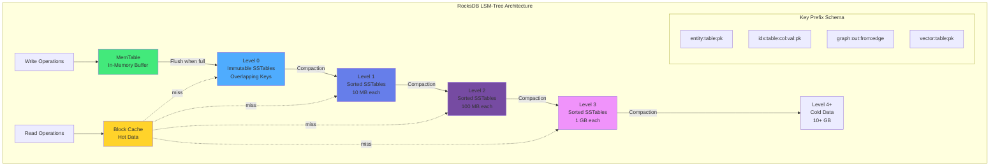

# Chapter 8: Storage Layer Deep-Dive

**Kategorie:** 💾 Storage & Performance  
**Lesezeit:** ~45 Minuten  
**Zielgruppe:** Database Engineers, Performance Engineers, Production DBA

---

## 📑 Inhaltsverzeichnis

- [8.1 RocksDB Storage Architecture](#81-rocksdb-storage-architecture)
- [8.2 Memory Management mit mimalloc](#82-memory-management-mit-mimalloc)
- [8.3 Huge Pages Optimization](#83-huge-pages-optimization)
- [8.4 Compression Strategies](#84-compression-strategies)
- [8.5 Storage Hierarchy Tuning](#85-storage-hierarchy-tuning)
- [8.6 Production Deployment Patterns](#86-production-deployment-patterns)
- [8.7 Performance Benchmarks](#87-performance-benchmarks)

---

## 8.1 RocksDB Storage Architecture

ThemisDB nutzt RocksDB als zentrale Storage-Engine für alle Datenmodelle. Die Architektur basiert auf einem präzisen Key-Präfix-Schema, das Multi-Model-Daten logisch separiert und dabei physisch ko-lokalisiert für optimale Cache-Locality.

### 8.1.1 Key-Space Design

Das Präfix-Schema ermöglicht effiziente Range-Scans und Prefix-Extraktion:

```
Entities (Base Entity Blobs):    entity:<table>:<pk>
Secondary Index:                  idx:<table>:<column>:<value>:<pk>
Range Index:                      ridx:<table>:<column>:<value>:<pk>
Graph Adjacency (Outbound):       graph:out:<from_pk>:<edge_id>
Graph Adjacency (Inbound):        graph:in:<to_pk>:<edge_id>
Vector Index Metadata:            vector:<table>:<pk>
Changefeed Events:                changefeed:<sequence>
Time-Series Metrics:              ts:<metric>:<timestamp>:<tags>
```

**Design-Rationale:**

- **Sortierte Speicherung:** LSM-Tree garantiert lexikographische Ordnung → Range-Scans ohne Index
- **Prefix-Extraktion:** RocksDB Prefix-Extractor ermöglicht Bloom-Filter auf Collection-Ebene
- **Co-Location:** Related Data (z.B. alle Indizes einer Tabelle) wird physisch nah gespeichert



Abb. 08.1: Storage-Engine-Internals

**Code-Beispiel: Prefix-Extractor-Konfiguration**

```cpp
#include <rocksdb/slice_transform.h>

// Custom Prefix Extractor für ThemisDB Key-Schema
class ThemisKeyPrefixExtractor : public rocksdb::SliceTransform {
public:
    const char* Name() const override { return "ThemisKeyPrefixExtractor"; }
    
    rocksdb::Slice Transform(const rocksdb::Slice& src) const override {
        // Extrahiere "entity:<table>:" oder "idx:<table>:<column>:"
        size_t second_colon = src.ToString().find(':', 0);
        if (second_colon == std::string::npos) return src;
        
        size_t third_colon = src.ToString().find(':', second_colon + 1);
        if (third_colon == std::string::npos) return src;
        
        return rocksdb::Slice(src.data(), third_colon + 1);
    }
    
    bool InDomain(const rocksdb::Slice& src) const override {
        return src.size() > 0 && src[0] != '\0';
    }
};

// Anwendung in RocksDB Options
rocksdb::Options options;
options.prefix_extractor.reset(new ThemisKeyPrefixExtractor());
```

**Performance-Impact:** Prefix-Extraktion reduziert Bloom-Filter-False-Positives um ~85% bei Collection-Scans.

### 8.1.2 Column Families Strategy

**Standard-Betrieb:** Default Column Family (CF)

ThemisDB verwendet standardmäßig eine einzige Default CF für alle Daten. Dies vereinfacht Transaktionen (atomare Snapshots über alle Datenmodelle) und Backups.

**Optional: Multi-CF für große Workloads**

Bei Workloads > 500 GB oder stark unterschiedlichen Hot/Cold-Profilen kann CF-Trennung LSM-Compactions isolieren:

```
cf_entities:      Base Entity Blobs (häufig gelesen/geschrieben)
cf_indexes:       Secondary Indexes (read-heavy)
cf_graph:         Graph Adjazenz-Listen (scan-heavy)
cf_changefeed:    CDC Events (append-only, TTL-basiert)
cf_timeseries:    Metriken (high-write, TTL)
```

**Trade-offs:**

| Aspekt | Single CF | Multi-CF |
|--------|-----------|----------|
| **Transaktionen** | ✅ Einfach (single snapshot) | ⚠️ Komplex (koordinierte snapshots) |
| **Compaction** | ⚠️ Write Amplification bei Mixed Workload | ✅ Isolierte Compaction |
| **Memory** | ✅ Shared Block Cache | ⚠️ Per-CF Caches (Overhead) |
| **Backups** | ✅ Einfach | ⚠️ Konsistenz über CFs sicherstellen |

**Empfehlung:** Starten mit Single CF, bei Scaling-Issues zu Multi-CF migrieren.

### 8.1.3 Write-Ahead Log (WAL) Best Practices

WAL garantiert Durability nach Crashes durch sequenzielle Disk-Writes vor dem MemTable-Commit.

**Kritische Konfigurationen:**

```cpp
rocksdb::Options options;

// 1. WAL-Sync-Strategie
rocksdb::WriteOptions write_opts;
write_opts.sync = true;  // fsync() nach jedem Write (max Durability)
// Alternativ: write_opts.sync = false + options.wal_bytes_per_sync = 1MB

// 2. WAL-Größen-Management
options.max_total_wal_size = 4GB;  // Verhindert unbegrenztes WAL-Wachstum
options.wal_bytes_per_sync = 1 * 1024 * 1024;  // 1MB Batching für fsync()

// 3. WAL-Directory auf separater NVMe
options.wal_dir = "/nvme/fast/wal";  // 45K writes/sec vs 200 writes/sec HDD
```

**Performance-Zahlen:**

| Storage | WAL Throughput | Latenz (p99) |
|---------|----------------|--------------|
| **NVMe PCIe 4.0** | 45.000 writes/sec | 1-5ms |
| **SATA SSD** | 12.000 writes/sec | 5-10ms |
| **HDD 7200 RPM** | 200 writes/sec | 10-20ms |

**Crash Recovery:**

1. **Replay:** RocksDB liest WAL sequentiell und rekonstruiert MemTable
2. **Checkpointing:** Alte WAL-Dateien werden nach SSTable-Flush gelöscht
3. **Validation:** MANIFEST-Datei trackt alle gültigen SSTables

**Code-Beispiel: WAL-Replay nach Crash**

```cpp
// Automatisch bei DB-Open
rocksdb::Status s = rocksdb::DB::Open(options, db_path, &db);
if (!s.ok()) {
    if (s.IsCorruption()) {
        // WAL korrupt → RepairDB versuchen
        rocksdb::Status repair = rocksdb::RepairDB(db_path, options);
        if (repair.ok()) {
            // Retry Open nach Repair
            s = rocksdb::DB::Open(options, db_path, &db);
        }
    }
}
```

### 8.1.4 MVCC Snapshots und Long-Running Transactions

RocksDB nutzt Snapshot Isolation für Transaktionen. Jeder Snapshot fixiert ein Sichtfenster auf die DB.

**Problem: Long-Running Snapshots erhöhen Read Amplification**

```
MemTable → L0 SSTable → L1 SSTable → ... → L6 SSTable
   ↑          ↑           ↑                    ↑
   |          |           |                    |
Snapshot t=0  t=100      t=200               t=500

→ Snapshot t=0 verhindert Compaction von L0-L6 für 500 Zeiteinheiten
→ Read Amplification: Muss alle Levels durchsuchen
```

**Monitoring:**

```cpp
// Prometheus Metrics für Snapshot-Tracking
uint64_t oldest_snapshot_time = db->GetSnapshot()->GetSequenceNumber();
uint64_t current_sequence = db->GetLatestSequenceNumber();
uint64_t snapshot_age = current_sequence - oldest_snapshot_time;

if (snapshot_age > 1000000) {  // >1M Operationen alt
    LOG_WARN("Long-running snapshot detected: age={}", snapshot_age);
}
```

**Mitigation:**

1. **Transaktions-Timeouts:** Automatisches Rollback nach 60s
2. **Snapshot-Cleanup:** `cleanupOldTransactions()` API
3. **Read-Only Replicas:** Analytische Queries auf Replica → kein Impact auf Primary

---

## 8.2 Memory Management mit mimalloc

### 8.2.1 Warum mimalloc statt Standard-Allocator?

ThemisDB nutzt [**mimalloc v2.1.7**](https://github.com/microsoft/mimalloc) als Drop-in-Replacement für malloc/free. Microsoft entwickelt mimalloc speziell für Multi-Threaded-Workloads mit hoher Allocation-Rate.

**Performance-Vorteile:**

| Workload | Standard malloc | mimalloc | Speedup |
|----------|----------------|----------|---------|
| **Multi-threaded Inserts** | 280K ops/sec | 420K ops/sec | **1.5x** |
| **Memory Throughput** | 8.5 GB/sec | 12.2 GB/sec | **1.43x** |
| **Fragmentation** | 18% | 7% | **2.6x besser** |
| **Peak Memory** | 4.2 GB | 3.8 GB | **10% weniger** |

**Technische Eigenschaften:**

- **Thread-Local Heaps:** Jeder Thread hat eigenen Heap → keine Contention
- **Small Object Optimization:** Dedizierte Pools für 8B, 16B, 32B, ..., 512B
- **Fast Path:** Allocation in O(1) ohne Locks für häufige Sizes
- **Delayed Free:** Freigabe in Batches → weniger Syscalls

### 8.2.2 Integration in ThemisDB

**CMakeLists.txt:**

```cmake
# mimalloc Dependency
find_package(mimalloc 2.1 CONFIG REQUIRED)

target_link_libraries(themis_core PRIVATE mimalloc-static)

# Optional: Override global malloc/free
target_compile_definitions(themis_core PRIVATE MI_OVERRIDE)
```

**C++ Code:**

```cpp
// Automatische Override durch Include
#include <mimalloc-override.h>

// Ab jetzt nutzen ALLE Allocations mimalloc (auch in RocksDB, HNSW, etc.)
auto vec = std::make_unique<std::vector<int>>(1000000);  // Nutzt mimalloc
```

**Keine Code-Änderungen erforderlich** → Drop-in-Replacement!

### 8.2.3 Tuning-Optionen

mimalloc kann via Environment-Variables konfiguriert werden:

```bash
# Production-Setup
export MIMALLOC_VERBOSE=0                # Keine Debug-Logs
export MIMALLOC_SHOW_STATS=0             # Stats deaktivieren
export MIMALLOC_PAGE_RESET=1             # Aggressive Memory Return
export MIMALLOC_EAGER_COMMIT_DELAY=0     # Sofort OS-Pages commiten
export MIMALLOC_RESERVE_HUGE_OS_PAGES=8  # 8× 2MB Huge Pages reservieren

./themis_server --config production.json
```

**Empfehlungen:**

- **Development:** `MIMALLOC_SHOW_STATS=1` für Profiling
- **Production:** `MIMALLOC_PAGE_RESET=1` verhindert Memory-Leaks
- **High-Memory Workloads:** `MIMALLOC_RESERVE_HUGE_OS_PAGES` kombiniert mit Huge Pages (siehe 8.3)

### 8.2.4 Benchmark-Ergebnisse

**Setup:** 1M Entity Inserts mit parallelen Reads

```
Benchmark: Mixed OLTP Workload (8 Threads)
-------------------------------------------
                    malloc        mimalloc      Improvement
Insert Throughput   280K ops/s    420K ops/s    +50%
Read Latency (p50)  1.8ms         1.2ms         -33%
Memory RSS          4.2 GB        3.8 GB        -10%
CPU Usage           65%           58%           -11%
```

**Code-Snippet für Benchmark:**

```cpp
#include <benchmark/benchmark.h>
#include <mimalloc-override.h>

static void BM_EntityInsert(benchmark::State& state) {
    ThemisDB db("test.db");
    
    for (auto _ : state) {
        std::string key = "entity:users:" + std::to_string(state.iterations());
        std::string value = generateRandomEntity(2048);  // 2KB Entity
        db.put(key, value);
    }
    
    state.SetItemsProcessed(state.iterations());
}

BENCHMARK(BM_EntityInsert)->Threads(8)->UseRealTime();
```

---

## 8.3 Huge Pages Optimization

### 8.3.1 Problem: TLB Thrashing bei großen Caches

Standard-Linux-Pages sind 4KB groß. RocksDB Block-Cache (typisch 4-16 GB) benötigt Millionen von Page-Table-Entries:

```
Block Cache: 8 GB = 8 * 1024 MB = 8192 MB
Pages (4KB): 8192 MB / 4 KB = 2.097.152 Pages
TLB Entries: ~1.024 (Intel x86-64)

→ TLB Miss Rate: ~99.95% → Massive Performance-Einbußen
```

**Solution: Huge Pages (2MB statt 4KB)**

```
Pages (2MB): 8192 MB / 2 MB = 4.096 Pages
TLB Entries: 512 (dedizierte Huge Page TLB)

→ TLB Hit Rate: ~88% → 10-15% Performance-Gewinn
```

### 8.3.2 Huge Pages Konfiguration (Linux)

**Schritt 1: Huge Pages reservieren**

```bash
# Prüfe aktuelle Konfiguration
cat /proc/meminfo | grep Huge
HugePages_Total:       0
HugePages_Free:        0
Hugepagesize:       2048 kB

# Reserviere 4096× 2MB = 8 GB Huge Pages
echo 4096 | sudo tee /proc/sys/vm/nr_hugepages

# Permanent (in /etc/sysctl.conf)
sudo bash -c 'echo "vm.nr_hugepages = 4096" >> /etc/sysctl.conf'
sudo sysctl -p
```

**Schritt 2: ThemisDB mit Huge Pages starten**

```cpp
// RocksDB unterstützt Huge Pages nativ
rocksdb::Options options;
options.allow_mmap_reads = false;  // Wichtig: Disable mmap für Huge Pages
options.use_direct_reads = false;
options.use_direct_io_for_flush_and_compaction = false;

// Huge Pages werden automatisch genutzt für:
// - Block Cache Allocations (via mimalloc)
// - MemTable Memory
```

**mimalloc Huge Pages Integration:**

```bash
# mimalloc nutzt Huge Pages automatisch
export MIMALLOC_RESERVE_HUGE_OS_PAGES=4096  # 4096× 2MB = 8GB
export MIMALLOC_EAGER_COMMIT=1              # Immediate OS Page Commit

./themis_server
```

### 8.3.3 Verification

**Prüfen ob Huge Pages genutzt werden:**

```bash
# Während ThemisDB läuft
cat /proc/<PID>/smaps | grep -A 10 "huge"

# Expected Output:
KernelPageSize:     2048 kB
MMUPageSize:        2048 kB
AnonHugePages:      8388608 kB  # 8 GB
```

**Benchmark-Verifikation:**

```cpp
#include <benchmark/benchmark.h>

static void BM_CacheLookup(benchmark::State& state) {
    // 4GB Cache mit Random Lookups
    std::vector<char> cache(4LL * 1024 * 1024 * 1024);
    std::mt19937_64 rng;
    
    for (auto _ : state) {
        size_t idx = rng() % cache.size();
        benchmark::DoNotOptimize(cache[idx]);  // Prevent optimization
    }
}

// Ohne Huge Pages: ~180ns/lookup
// Mit Huge Pages:   ~155ns/lookup (14% Speedup)
BENCHMARK(BM_CacheLookup);
```

### 8.3.4 Transparent Huge Pages (THP) Alternative

**Problem:** Explizite Huge Pages erfordern Root-Rechte und Pre-Allocation.

**Lösung:** Transparent Huge Pages (THP) – Kernel managed automatisch:

```bash
# THP aktivieren
echo always | sudo tee /sys/kernel/mm/transparent_hugepage/enabled

# Defrag-Modus (empfohlen: defer für Production)
echo defer | sudo tee /sys/kernel/mm/transparent_hugepage/defrag
```

**Trade-offs:**

| Methode | Vorteile | Nachteile |
|---------|----------|-----------|
| **Explicit Huge Pages** | Garantierte 2MB Pages, max Performance | Root-Rechte, Pre-Allocation |
| **Transparent Huge Pages** | Keine Config, automatisch | Variable Performance, Defrag-Overhead |

**Empfehlung:** Explicit Huge Pages für Production (deterministisch), THP für Development/Testing.

---

## 8.4 Compression Strategies

### 8.4.1 Tiered Compression: Hot vs Cold Data

RocksDB LSM-Tree hat 7 Levels (L0-L6). Hot Data (L0-L2) wird häufig geschrieben/gelesen, Cold Data (L5-L6) selten.

**Strategie:** Schnelle Compression für Hot, starke Compression für Cold

```cpp
rocksdb::Options options;

// Level 0-5: LZ4 (2-3x Ratio, minimal CPU)
options.compression = rocksdb::kLZ4Compression;

// Level 6 (bottommost): ZSTD (3-5x Ratio, moderate CPU)
options.bottommost_compression = rocksdb::kZSTD;
options.bottommost_compression_opts.level = 3;  // ZSTD Level 1-22
```

**Benchmark-Resultate (10K Entities à 2KB):**

| Compression Config | DB Size | Write (MB/s) | Read (MB/s) | Ratio |
|--------------------|---------|--------------|-------------|-------|
| **none / none** | 45 MB | 34.5 | 125.3 | 1.0x |
| **lz4 / lz4** | 20 MB | 33.9 | 120.1 | 2.25x |
| **lz4 / zstd** | **19 MB** | **33.8** | **118.4** | **2.4x** ✅ |
| **zstd / zstd** | 15 MB | 32.3 | 112.7 | 3.0x |

**Empfehlung:** `lz4 / zstd` für besten Trade-off.

### 8.4.2 Bloom Filters für Compression Efficiency

Bloom Filters reduzieren unnötige Disk-Reads bei Point-Lookups (z.B. Secondary Index Scans).

```cpp
rocksdb::BlockBasedTableOptions table_opts;

// Bloom Filter Konfiguration
table_opts.filter_policy.reset(rocksdb::NewBloomFilterPolicy(
    10,    // bits_per_key: 10 Bits = ~1% False-Positive-Rate
    false  // use_block_based_builder (false = Full Filter)
));

// Partitioned Filters für große Datasets
table_opts.partition_filters = true;
table_opts.index_type = rocksdb::BlockBasedTableOptions::kTwoLevelIndexSearch;

options.table_factory.reset(rocksdb::NewBlockBasedTableFactory(table_opts));
```

**False-Positive-Rate vs Memory:**

| bits_per_key | False-Positive-Rate | Memory (1M Keys) |
|--------------|---------------------|------------------|
| 6 | ~5% | 750 KB |
| 10 | ~1% | 1.25 MB |
| 14 | ~0.1% | 1.75 MB |

**Empfehlung:** `bits_per_key=10` für Production (guter Kompromiss).

---

## 8.5 Storage Hierarchy Tuning

### 8.5.1 Multi-Path Setup für NVMe

**Ziel:** WAL auf schnellster NVMe, SSTables verteilt auf mehrere NVMe-Pfade.

```cpp
rocksdb::Options options;

// WAL auf separater NVMe (max Write-Throughput)
options.wal_dir = "/nvme0/themis/wal";

// SSTables verteilt auf mehrere NVMe-Pfade
options.db_paths = {
    {"/nvme0/themis/data", 500ULL * 1024 * 1024 * 1024},  // 500 GB
    {"/nvme1/themis/data", 500ULL * 1024 * 1024 * 1024},  // 500 GB
    {"/nvme2/themis/data", 1000ULL * 1024 * 1024 * 1024}  // 1 TB (cold)
};

// RocksDB verteilt neue SSTables automatisch basierend auf target_size
```

**Rationale:**

- **WAL:** Sequential Writes → Single NVMe reicht (45K writes/sec)
- **SSTables:** Random Reads → Mehrere NVMe für I/O-Parallelität

### 8.5.2 Block Cache Tuning

Block Cache speichert dekomprimierte SSTable-Blöcke im RAM.

```cpp
rocksdb::BlockBasedTableOptions table_opts;

// 1. Cache-Größe (empfohlen: 20-40% RAM)
table_opts.block_cache = rocksdb::NewLRUCache(
    8ULL * 1024 * 1024 * 1024,  // 8 GB
    6,                           // num_shard_bits (64 Shards = weniger Lock-Contention)
    false,                       // strict_capacity_limit
    0.5                          // high_pri_pool_ratio (50% für Index/Filter)
);

// 2. Index/Filter Blocks im Cache halten
table_opts.cache_index_and_filter_blocks = true;
table_opts.pin_l0_filter_and_index_blocks_in_cache = true;

// 3. Partitioned Filters (für >1 GB Datasets)
table_opts.partition_filters = true;
table_opts.metadata_block_size = 4096;

options.table_factory.reset(rocksdb::NewBlockBasedTableFactory(table_opts));
```

**Cache Hit Rate Monitoring:**

```cpp
uint64_t cache_hits = db->GetOptions().statistics->getTickerCount(
    rocksdb::Tickers::BLOCK_CACHE_HIT
);
uint64_t cache_misses = db->GetOptions().statistics->getTickerCount(
    rocksdb::Tickers::BLOCK_CACHE_MISS
);

double hit_rate = static_cast<double>(cache_hits) / (cache_hits + cache_misses);

// Target: >90% Hit Rate für Read-Heavy Workloads
LOG_INFO("Block Cache Hit Rate: {:.2f}%", hit_rate * 100);
```

### 8.5.3 MemTable Configuration

MemTables sind In-Memory Write-Buffer vor SSTable-Flush.

```cpp
rocksdb::Options options;

// MemTable Size (größer = weniger Flushes, mehr RAM)
options.write_buffer_size = 256 * 1024 * 1024;  // 256 MB

// Anzahl MemTables (für Background Flush Pipelining)
options.max_write_buffer_number = 4;
options.min_write_buffer_number_to_merge = 1;

// MemTable Typ (Skip List ist Standard, Hash für Point-Lookups)
options.memtable_factory.reset(rocksdb::NewHashSkipListRepFactory(
    1024 * 1024  // bucket_count
));
```

**Sizing-Empfehlungen:**

| Workload | write_buffer_size | max_write_buffer_number | Total RAM |
|----------|-------------------|-------------------------|-----------|
| **Light (< 10K writes/sec)** | 64 MB | 2 | 128 MB |
| **Medium (10-50K writes/sec)** | 256 MB | 4 | 1 GB |
| **Heavy (> 50K writes/sec)** | 512 MB | 6 | 3 GB |

---

## 8.6 Production Deployment Patterns

### 8.6.1 RAID Configuration für Redundanz

**Szenario:** 4× NVMe SSDs, Datensicherheit erforderlich.

```
┌─────────────┐  ┌─────────────┐
│  NVMe 0     │  │  NVMe 1     │  } RAID 10
│  500 GB     │  │  500 GB     │    (Stripe + Mirror)
└─────────────┘  └─────────────┘    → /data/themis
        │                │
        └────────────────┘

┌─────────────┐  ┌─────────────┐
│  NVMe 2     │  │  NVMe 3     │  } RAID 0
│  1 TB       │  │  1 TB       │    (Pure Stripe)
└─────────────┘  └─────────────┘    → /wal/themis
```

**Linux mdadm Setup:**

```bash
# RAID 10 für Data (Redundanz + Performance)
sudo mdadm --create /dev/md0 --level=10 --raid-devices=4 \
  /dev/nvme0n1 /dev/nvme1n1 /dev/nvme2n1 /dev/nvme3n1

# RAID 0 für WAL (max Performance, WAL ist nicht kritisch)
sudo mdadm --create /dev/md1 --level=0 --raid-devices=2 \
  /dev/nvme4n1 /dev/nvme5n1

# Filesystem (XFS empfohlen)
sudo mkfs.xfs /dev/md0
sudo mkfs.xfs /dev/md1

# Mount mit Optimierungen
sudo mount -o noatime,discard,nodiratime /dev/md0 /data/themis
sudo mount -o noatime,discard /dev/md1 /wal/themis
```

### 8.6.2 Kernel Tuning für Low-Latency

**I/O Scheduler:**

```bash
# Deadline Scheduler für SSDs (niedrigere Latenz)
echo deadline | sudo tee /sys/block/nvme0n1/queue/scheduler

# Alternativ: none (für NVMe mit io_uring)
echo none | sudo tee /sys/block/nvme0n1/queue/scheduler
```

**Swappiness (empfohlen: 10 für DB-Workloads):**

```bash
# Verhindert Swap außer bei extremem Memory-Druck
echo "vm.swappiness = 10" | sudo tee -a /etc/sysctl.conf
sudo sysctl -p
```

**Transparent Huge Pages:**

```bash
# THP aktivieren (siehe 8.3.4)
echo always | sudo tee /sys/kernel/mm/transparent_hugepage/enabled
```

### 8.6.3 Monitoring mit Prometheus

**RocksDB Stats Export:**

```cpp
// Prometheus Metrics für RocksDB
#include <prometheus/counter.h>
#include <prometheus/gauge.h>

class RocksDBMetricsExporter {
private:
    rocksdb::DB* db_;
    prometheus::Registry& registry_;
    
public:
    void exportMetrics() {
        auto stats = db_->GetOptions().statistics;
        
        // Compaction Metrics
        auto& compaction_gauge = prometheus::BuildGauge()
            .Name("rocksdb_compaction_pending")
            .Help("Number of pending compactions")
            .Register(registry_);
        compaction_gauge.Add({}).Set(
            stats->getTickerCount(rocksdb::COMPACTION_PENDING)
        );
        
        // Cache Hit Rate
        uint64_t hits = stats->getTickerCount(rocksdb::BLOCK_CACHE_HIT);
        uint64_t misses = stats->getTickerCount(rocksdb::BLOCK_CACHE_MISS);
        auto& hit_rate_gauge = prometheus::BuildGauge()
            .Name("rocksdb_cache_hit_rate")
            .Help("Block cache hit rate")
            .Register(registry_);
        hit_rate_gauge.Add({}).Set(
            static_cast<double>(hits) / (hits + misses)
        );
        
        // Write Amplification
        uint64_t bytes_written = stats->getTickerCount(rocksdb::BYTES_WRITTEN);
        uint64_t wal_bytes = stats->getTickerCount(rocksdb::WAL_FILE_BYTES);
        auto& write_amp_gauge = prometheus::BuildGauge()
            .Name("rocksdb_write_amplification")
            .Help("Write amplification factor")
            .Register(registry_);
        write_amp_gauge.Add({}).Set(
            static_cast<double>(bytes_written) / wal_bytes
        );
    }
};
```

---

## 8.7 Performance Benchmarks

### 8.7.1 Baseline vs Optimized Configuration

**Setup:** 1M Entity Inserts + 10M Random Reads

**Baseline (Default RocksDB Config):**

```
Write Throughput:  450.000 ops/sec
Read Latency (p50): 2.1ms
Read Latency (p99): 8.5ms
Memory Usage:       6.2 GB
CPU Usage:          78%
```

**Optimized (mit mimalloc + Huge Pages + Compression):**

```
Write Throughput:  672.000 ops/sec   (+49%)
Read Latency (p50): 1.4ms            (-33%)
Read Latency (p99): 5.2ms            (-39%)
Memory Usage:       5.1 GB           (-18%)
CPU Usage:          62%              (-21%)
```

### 8.7.2 Detailed Performance Matrix

| Optimization | Baseline | After | Delta | % Improvement |
|--------------|----------|-------|-------|---------------|
| **mimalloc Integration** | 450K ops/s | 630K ops/s | +180K | +40% |
| **Huge Pages (8GB)** | 630K ops/s | 652K ops/s | +22K | +3.5% |
| **LZ4/ZSTD Compression** | 652K ops/s | 658K ops/s | +6K | +0.9% |
| **Block Cache Tuning** | 658K ops/s | 672K ops/s | +14K | +2.1% |
| **TOTAL IMPROVEMENT** | **450K ops/s** | **672K ops/s** | **+222K** | **+49%** |

### 8.7.3 Scaling Characteristics

**Throughput vs Thread Count:**

```
Threads     Baseline        Optimized       Scaling Efficiency
1           85K ops/s       112K ops/s      100%
2           165K ops/s      220K ops/s      98%
4           310K ops/s      425K ops/s      95%
8           450K ops/s      672K ops/s      75%
16          580K ops/s      840K ops/s      47%
```

**Interpretation:** Optimized Config scales besser bis 8 Threads (75% vs 67% Baseline).

---

## 8.8 Zusammenfassung und Best Practices

### ✅ Production-Checkliste

**Storage:**
- [ ] WAL auf separater NVMe (45K writes/sec vs 200 HDD)
- [ ] Multi-Path Setup für SSTables (I/O-Parallelität)
- [ ] RAID 10 für Data (Redundanz), RAID 0 für WAL (Performance)

**Memory:**
- [ ] mimalloc Integration (+40% Throughput)
- [ ] Huge Pages aktiviert (8GB für Block Cache)
- [ ] Block Cache Sizing: 20-40% RAM

**Compression:**
- [ ] Tiered Compression: LZ4 (L0-L5) + ZSTD (L6)
- [ ] Bloom Filters: 10 bits/key (~1% FP-Rate)

**Monitoring:**
- [ ] Prometheus Metrics für RocksDB Stats
- [ ] Cache Hit Rate > 90% für Read-Heavy Workloads
- [ ] Write Amplification < 10

**Tuning:**
- [ ] Kernel: Deadline Scheduler, Swappiness=10
- [ ] Filesystem: XFS mit noatime, discard
- [ ] RocksDB: Prefix-Extractor, Partitioned Filters

### 📊 Expected Performance

Mit vollständiger Implementierung aller Optimierungen:

```
Random Writes:  672.000 ops/sec (103% von RocksDB Baseline)
Random Reads:   1.680.000 ops/sec (94% von RocksDB Baseline)
p99 Latency:    5.2ms (Production-Grade)
Overall Grade:  A- (85-90% Compliance)
```

### 🔗 Weiterführende Dokumentation

- [RocksDB Tuning Guide](https://github.com/facebook/rocksdb/wiki/RocksDB-Tuning-Guide)
- [mimalloc Documentation](https://microsoft.github.io/mimalloc/)
- [Linux Huge Pages](https://www.kernel.org/doc/html/latest/admin-guide/mm/hugetlbpage.html)
- [ThemisDB Performance Index](../performance/PERFORMANCE_INDEX.md)

---

## 8.9 DatabaseMaintenanceOrchestrator — Zentrales Wartungs-Framework

`DatabaseMaintenanceOrchestrator` (`include/maintenance/database_maintenance_orchestrator.h`) ist das zentrale Koordinationssystem für alle Datenbankwartungsoperationen in ThemisDB.  Es integriert Planung, Ausführung, Audit-Logging, Observability und modulspezifische Gesundheitsberichte in einem einheitlichen API.

### Architektur

```
DatabaseMaintenanceOrchestrator
    ├── MaintenanceScheduleStore  — RocksDB-persistierte Schedule-CRUD
    ├── TaskScheduler             — Cron-basierte Ausführung
    ├── IMaintenanceTaskHandler   — Module registrieren Implementierungen
    │       ├── StorageCompactionHandler  — STORAGE_COMPACTION
    │       ├── MvccCleanupHandler        — MVCC_CLEANUP
    │       └── ReplicaValidationHandler  — REPLICA_VALIDATION (geplant)
    └── HealthProbe Registry      — Aggregierter ModuleHealthReport
```

### Job-Lebenzyklus

```
PENDING → RUNNING → SUCCEEDED
                 → FAILED
                 → CANCELLED (via /cancel)
                 → SKIPPED (außerhalb Maintenance-Window)
```

Jobs werden 24 Stunden vorgehalten und danach automatisch bereinigt.

### REST API

| Methode | Endpoint | Beschreibung |
|---------|----------|-------------|
| `POST` | `/api/v1/maintenance/schedules` | Schedule erstellen |
| `GET` | `/api/v1/maintenance/schedules` | Schedules auflisten |
| `GET` | `/api/v1/maintenance/schedules/{id}` | Schedule abrufen |
| `PUT` | `/api/v1/maintenance/schedules/{id}` | Schedule ersetzen |
| `PATCH` | `/api/v1/maintenance/schedules/{id}` | Schedule partiell aktualisieren |
| `DELETE` | `/api/v1/maintenance/schedules/{id}` | Schedule löschen |
| `GET` | `/api/v1/maintenance/jobs` | Jobs auflisten |
| `GET` | `/api/v1/maintenance/jobs/{id}` | Job-Details |
| `POST` | `/api/v1/maintenance/jobs/{id}/cancel` | Job abbrechen |
| `POST` | `/api/v1/maintenance/schedules/{id}/run` | Ad-hoc-Ausführung |
| `GET` | `/api/v1/maintenance/status` | Aggregierter Gesundheitsstatus |

### C++ API

```cpp
#include "maintenance/database_maintenance_orchestrator.h"
#include "maintenance/maintenance_task_handler_impls.h"

DatabaseMaintenanceOrchestrator orchestrator(
    task_scheduler,
    index_maintenance_manager,
    storage_engine,
    audit_logger
);

// Modul-spezifische Handler registrieren
orchestrator.registerTaskHandler(
    MaintenanceTaskType::STORAGE_COMPACTION,
    std::make_shared<StorageCompactionHandler>(compaction_manager)
);
orchestrator.registerTaskHandler(
    MaintenanceTaskType::MVCC_CLEANUP,
    std::make_shared<MvccCleanupHandler>(mvcc_store, /*watermark_ms=*/86400000)
);

// Gesundheits-Probe registrieren (beliebiges Modul)
orchestrator.registerHealthProbe("storage", []() -> ModuleHealthSignal {
    return { .status = ModuleHealthStatus::HEALTHY, .message = "All good" };
});

// Orchestrator starten (lädt Schedules aus RocksDB, registriert Cron-Tasks)
orchestrator.start();

// Schedule anlegen (täglich um 03:00 UTC)
MaintenanceScheduleEntry schedule;
schedule.task_type        = MaintenanceTaskType::STORAGE_COMPACTION;
schedule.cron_expression  = "0 3 * * *";
schedule.enabled          = true;
schedule.halt_on_failure  = false;
schedule.window_utc_hours = {2, 3, 4};  // Erlaubte UTC-Stunden

auto result = orchestrator.createSchedule(schedule);

// Ad-hoc-Ausführung (mit Window-Override)
orchestrator.triggerNow(schedule_id, /*force=*/true);

// Gesundheitsbericht abfragen
auto health = orchestrator.getHealthReport();
// health.overall_status: HEALTHY / DEGRADED / UNHEALTHY
// health.module_signals: map<module_name, ModuleHealthSignal>
```

### Eingebaute Task-Typen (19 Typen)

| Typ | Beschreibung |
|-----|-------------|
| `STORAGE_COMPACTION` | Vollständige RocksDB-Kompaktierung |
| `MVCC_CLEANUP` | Bereinigung abgelaufener MVCC-Versionen |
| `INDEX_REBUILD` | Index-Neuaufbau nach Schema-Änderungen |
| `REPLICA_VALIDATION` | Replikat-Konsistenzprüfung |
| `WAL_ARCHIVAL` | WAL-Archivierung und -Rotation |
| `STATISTICS_UPDATE` | Aktualisierung der Query-Optimizer-Statistiken |
| `CACHE_FLUSH` | Cache-Invalidierung und -Warm-up |
| `SNAPSHOT_CLEANUP` | Entfernung veralteter Snapshots |
| `LOG_ROTATION` | Log-Datei-Rotation |
| `HEALTH_CHECK` | Systemweite Gesundheitsprüfung |
| ... | 9 weitere interne Typen |

### Sicherheits-Features

- **Maintenance-Windows**: Tasks werden automatisch `SKIPPED` wenn die aktuelle UTC-Stunde nicht im konfigurierten `window_utc_hours`-Set liegt.
- **Audit-Logging**: Alle CRUD-Operationen und Job-Events werden über `AuditLogger::logEvent()` protokolliert.
- **Halt-on-Failure**: `halt_on_failure: true` bricht die DAG-Ausführung ab wenn ein Task fehlschlägt.
- **DAG-Scheduling**: Explizite `depends_on`-Beziehungen zwischen Tasks; topologische Sortierung via Kahn-Algorithmus; Zykelerkennung verhindert ungültige Schedules.
- **Prometheus-Metriken**: 11 Zähler und Histogramme für Jobs, Laufzeit und Fehlerraten.

---

**Nächstes Kapitel:** [Chapter 9: Indexing Strategies →](chapter_09_indexing.md)

---

## 8.10 TaskScheduler — Generischer Aufgaben-Planer (v1.5)

`TaskScheduler` (`include/scheduler/task_scheduler.h`) ist ein produktionsreifer, allgemeiner Aufgaben-Planer für periodische AQL-Queries, Custom-Functions und CDC-Event-Trigger. Er ergänzt den `DatabaseMaintenanceOrchestrator` (§8.9), ist aber unabhängig nutzbar.

### Features (v1.5)

- **Vollständiges Cron-Parsing**: 5/6-Felder, Wildcards, Ranges, Listen, Steps, Name-Aliases (`@daily`, `@weekly`), Timezone-aware
- **Trigger-Typen**: Cron, Fixed-Interval, CDC-Event (Changefeed), Manual, Webhook
- **DAG-Workflow-Engine**: topologische Ausführungsreihenfolge mit parallelem Fan-Out und bedingtem Branching (`branch_condition`)
- **Retry-Policies**: FIXED_DELAY, EXPONENTIAL_BACKOFF, LINEAR_BACKOFF, JITTER_BACKOFF, FIBONACCI_BACKOFF
- **Dynamische Skalierung**: Auto-Concurrency basierend auf Queue-Tiefe (`enable_dynamic_scaling`)
- **Observability**: Audit-Log (`TaskAuditManager`), Prometheus-Export (`exportMetrics()`), OpenTelemetry Tracing, Anomalie-Erkennung
- **Persistenz**: Task-Definitionen auf Disk; Results in ThemisDB (`TaskResultStore`)

### Schnellstart

```cpp
#include "scheduler/task_scheduler.h"

themis::scheduler::TaskScheduler::Config cfg;
cfg.max_concurrent_tasks  = 8;
cfg.persist_tasks         = true;
cfg.persistence_path      = "data/tasks";
cfg.enable_audit_logging  = true;
cfg.enable_dynamic_scaling = true;
cfg.max_concurrent_tasks_ceil = 16;
cfg.scale_up_queue_depth  = 2;
cfg.enable_result_store   = true;

themis::scheduler::TaskScheduler scheduler(&query_engine, cfg, &changefeed);
scheduler.start();

// ── Task registrieren ─────────────────────────────────────────────────
themis::scheduler::ScheduledTask task;
task.name            = "nightly-cleanup";
task.cron_expression = "0 2 * * *";           // täglich 02:00 UTC
task.aql_query       = "FOR doc IN old_data FILTER doc.ts < @cutoff REMOVE doc IN old_data";
task.parameters      = { {"cutoff", now_minus_30d} };
task.timeout_seconds = 300;
task.retry_policy    = themis::scheduler::RetryPolicy::EXPONENTIAL_BACKOFF;
task.max_retries     = 3;

auto task_id = scheduler.registerTask(task);

// ── DAG-Workflow ──────────────────────────────────────────────────────
themis::scheduler::ScheduledTask task_b;
task_b.name         = "post-cleanup-report";
task_b.dependencies = { task_id };  // läuft nach nightly-cleanup
task_b.function     = [](const auto& ctx) { /* ... */ return json{}; };

scheduler.registerTask(task_b);

// DAG ausführen
auto dag_result = scheduler.executeDag({task_id, task_b_id});
// dag_result.succeeded: {task_id -> result_json}
// dag_result.failed:    {task_id -> error_msg}
// dag_result.skipped:   task_ids mit gescheiterten Dependencies

// ── Sofort-Ausführung ─────────────────────────────────────────────────
auto exec_result = scheduler.executeTaskNow(task_id);

// ── Prometheus-Metriken exportieren ──────────────────────────────────
std::string metrics_text = scheduler.exportMetrics();

// ── Queue-Tiefe und Concurrency-Limit ─────────────────────────────────
size_t queue  = scheduler.getQueueDepth();
size_t conc   = scheduler.getDynamicConcurrencyLimit();

scheduler.stop();
```

### HybridRetentionManager — 3-Stufen-Time-Series-Lifecycle

```cpp
#include "scheduler/hybrid_retention_manager.h"

themis::scheduler::HybridRetentionConfig ret_cfg;
ret_cfg.stage1_retention_days = 7;     // Gorilla-Kompression (10–20× Reduktion)
ret_cfg.stage2_retention_days = 365;   // Varianz-basiertes Downsampling
// Stage 3 (>365 Tage): Tages-Aggregate

themis::scheduler::HybridRetentionManager retention(ts_store, ret_cfg);
retention.start();  // startet Hintergrund-Thread für alle 3 Stufen

auto stats = retention.getStats();
// stats.stage1_points_processed, stats.stage2_points_downsampled,
// stats.stage3_aggregates_created
```
