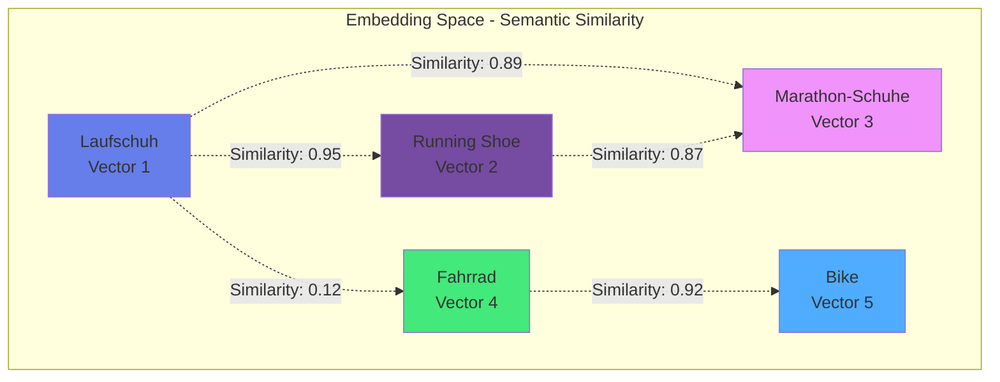
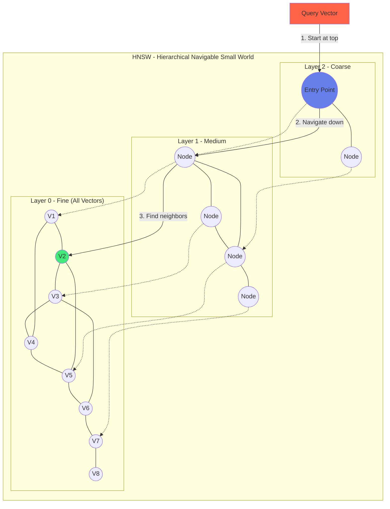
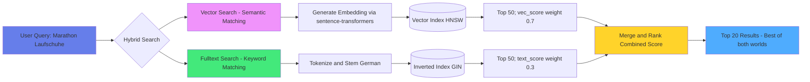

# Kapitel 8: Vektor-Suche und Similarity Search

## 8.1 Einführung in Vektor-Suche

### Das Problem mit traditionellen Suchen

Stellen Sie sich vor, Sie suchen in einer Produktdatenbank nach "bequeme Laufschuhe für den Marathon". Eine traditionelle Keyword-Suche würde nur Produkte finden, die exakt diese Wörter enthalten. Aber was ist mit:

- "Marathon-Schuhe mit optimaler Dämpfung"
- "Komfortable Running-Shoes für lange Strecken"
- "Wettkampf-Laufschuh mit Pronationsstütze"

Diese Produkte sind semantisch relevant, werden aber von Keyword-Suchen oft nicht gefunden. **Vektor-Suche** löst dieses Problem durch semantisches Verständnis.

### Was sind Embeddings?

Ein **Embedding** ist eine hochdimensionale Vektorrepräsentation von Text, Bildern oder anderen Daten. Ähnliche Konzepte haben ähnliche Vektoren:

```python
# Beispiel: Text → Vektor (384 Dimensionen)
"Laufschuh"      → [0.23, -0.15, 0.89, ..., 0.34]  # 384 Werte
"Running Shoe"   → [0.21, -0.14, 0.91, ..., 0.36]  # Sehr ähnlich!
"Fahrrad"        → [-0.67, 0.42, -0.12, ..., 0.78] # Komplett anders
```

**Kosinus-Ähnlichkeit** misst, wie ähnlich zwei Vektoren sind (0 = keine Ähnlichkeit, 1 = identisch).



Abb. 08.1: Vector-Embedding-Pipeline

### Vector Search vs. Fulltext Search

| Feature | Fulltext Search | Vector Search |
|---------|----------------|---------------|
| Matching | Exakte Wörter | Semantische Bedeutung |
| Sprachen | Sprach-abhängig | Sprach-übergreifend |
| Synonyme | ❌ Muss konfiguriert werden | ✅ Automatisch |
| Schreibfehler | ❌ Keine Treffer | ✅ Oft tolerant |
| Performance | Sehr schnell | Schnell (mit HNSW) |
| Use Cases | Dokumente, Logs | Empfehlungen, Q&A, Similarity |

**Best Practice:** Hybrid Search kombiniert beide Ansätze.

## 8.2 Vector Model in ThemisDB

### Schema und Index

ThemisDB speichert Vektoren als native `VECTOR` Spalten und nutzt **HNSW** (Hierarchical Navigable Small World) für effiziente Suchen:

```aql
-- Dokumente mit Embeddings
CREATE TABLE documents (
    id UUID PRIMARY KEY,
    title TEXT NOT NULL,
    content TEXT NOT NULL,
    embedding VECTOR(384),  -- 384-dimensionaler Vektor
    metadata JSONB,
    created_at TIMESTAMP DEFAULT NOW()
);

-- HNSW-Index für schnelle Similarity Search
CREATE INDEX idx_doc_embedding ON documents 
USING hnsw (embedding vector_cosine_ops)
WITH (m = 16, ef_construction = 200);
```

**HNSW-Parameter:**
- `m`: Anzahl Verbindungen (höher = bessere Qualität, langsamer Build)
- `ef_construction`: Exploration während Index-Build (höher = bessere Qualität)
- `vector_cosine_ops`: Kosinus-Distanz (alternativ: L2, inner product)



Abb. 08.2: Similarity-Search-Ablauf

### Similarity Search Query

```aql
-- Finde ähnliche Dokumente zur Query
SELECT id, title, 
       1 - (embedding <=> :query_embedding) AS similarity
FROM documents
ORDER BY embedding <=> :query_embedding
LIMIT 10;
```

**Operators:**
- `<=>` : Kosinus-Distanz (0 = identisch)
- `<->` : L2 (Euklidische) Distanz
- `<#>` : Inner Product (negative Distanz)

### Hybrid Search: Vector + Fulltext

Kombiniere semantische und Keyword-Suche:

```aql
WITH vector_results AS (
    SELECT id, 1 - (embedding <=> :query_embedding) AS vec_score
    FROM documents
    ORDER BY embedding <=> :query_embedding
    LIMIT 50
),
fulltext_results AS (
    SELECT id, ts_rank(to_tsvector('german', content), 
                       plainto_tsquery('german', :query_text)) AS text_score
    FROM documents
    WHERE to_tsvector('german', content) @@ plainto_tsquery('german', :query_text)
    LIMIT 50
)
SELECT d.*, 
       COALESCE(v.vec_score, 0) * 0.7 + 
       COALESCE(f.text_score, 0) * 0.3 AS combined_score
FROM documents d
LEFT JOIN vector_results v ON d.id = v.id
LEFT JOIN fulltext_results f ON d.id = f.id
WHERE v.id IS NOT NULL OR f.id IS NOT NULL
ORDER BY combined_score DESC
LIMIT 20;
```



Abb. 08.3: Index-Struktur für Vektoren

## 8.3 Example: Dokumenten-Suche (RAG System)

Wir bauen ein **RAG-System** (Retrieval Augmented Generation) für semantische Dokumentensuche. Der Use Case:

- Dokumente hochladen (PDF, TXT, DOCX)
- Automatische Embedding-Generierung
- Semantische Suche: "Wie funktioniert MVCC?"
- Context für LLMs bereitstellen

### Datenmodell

```python
# models.py
from dataclasses import dataclass
from datetime import datetime
from typing import List, Optional
import uuid

@dataclass
class Document:
    id: str
    title: str
    content: str
    embedding: Optional[List[float]]
    metadata: dict
    created_at: datetime
    collection: str = "default"
    
    @staticmethod
    def create(title: str, content: str, metadata: dict = None, collection: str = "default"):
        return Document(
            id=str(uuid.uuid4()),
            title=title,
            content=content,
            embedding=None,  # Wird später generiert
            metadata=metadata or {},
            created_at=datetime.now(),
            collection=collection
        )

@dataclass
class SearchResult:
    document: Document
    similarity: float
    rank: int
```

### Embedding-Generierung

Wir verwenden **sentence-transformers** für deutsche und englische Texte:

```python
# themis_client.py
from sentence_transformers import SentenceTransformer
import numpy as np

class ThemisVectorClient:
    def __init__(self, connection_string: str):
        self.conn = connect(connection_string)
        # Multilingual Model (384D)
        self.model = SentenceTransformer('paraphrase-multilingual-MiniLM-L12-v2')
        
    def generate_embedding(self, text: str) -> List[float]:
        """Generiert 384D Embedding für Text"""
        embedding = self.model.encode(text, convert_to_numpy=True)
        return embedding.tolist()
    
    def chunk_text(self, text: str, max_words: int = 200) -> List[str]:
        """Teilt langen Text in Chunks für bessere Embeddings"""
        words = text.split()
        chunks = []
        for i in range(0, len(words), max_words):
            chunk = ' '.join(words[i:i + max_words])
            chunks.append(chunk)
        return chunks
    
    def add_document(self, doc: Document, chunk_size: int = 200):
        """Fügt Dokument mit Embeddings hinzu"""
        # Lange Dokumente in Chunks aufteilen
        chunks = self.chunk_text(doc.content, max_words=chunk_size)
        
        for i, chunk in enumerate(chunks):
            chunk_id = f"{doc.id}_chunk_{i}"
            embedding = self.generate_embedding(chunk)
            
            cursor = self.conn.cursor()
            cursor.execute("""
                INSERT INTO documents (id, title, content, embedding, metadata, collection)
                VALUES (?, ?, ?, ?, ?, ?)
            """, (chunk_id, f"{doc.title} (Teil {i+1})", chunk, 
                  embedding, json.dumps(doc.metadata), doc.collection))
            self.conn.commit()
        
        print(f"✅ Dokument '{doc.title}' in {len(chunks)} Chunks gespeichert")
```

### Semantic Search


### Semantic Search

Die semantische Suche nutzt den HNSW-Index für effiziente Nearest-Neighbor-Suche in hochdimensionalen Vektorräumen. Die Ähnlichkeit wird über Cosine Distance berechnet (`1 - (embedding <=> query)`), wobei höhere Werte größere Ähnlichkeit bedeuten. Die Methode unterstützt optionales Collection-Filtering und Minimum-Similarity-Schwellwerte.

> **📁 Vollständiger Code:** `examples/08_vector_search/themis_client.py` (ca. 90 Zeilen für search-Methode)

**Kernimplementierung:**

```python
    def search(self, query: str, collection: str = None, 
               limit: int = 10, min_similarity: float = 0.5) -> List[SearchResult]:
        """Semantische Suche mit HNSW-Index"""
        # Query zu Embedding konvertieren
        query_embedding = self.generate_embedding(query)
        
        # Vector-Similarity-Suche via AQL
        sql = """
            SELECT id, title, content, embedding, metadata,
                   1 - (embedding <=> ?) AS similarity
            FROM documents
            WHERE (? IS NULL OR collection = ?)
              AND 1 - (embedding <=> ?) >= ?
            ORDER BY embedding <=> ?  -- HNSW-Index wird automatisch genutzt!
            LIMIT ?
        """
        
        cursor.execute(sql, (
            query_embedding, collection, collection,
            query_embedding, min_similarity,
            query_embedding, limit
        ))
        
        # Ergebnisse mit Relevanz-Score zurückgeben
        results = []
        for i, row in enumerate(cursor.fetchall(), start=1):
            results.append(SearchResult(
                rank=i,
                document=Document.from_row(row),
                similarity=row['similarity'],
                explanation=f"Cosine similarity: {row['similarity']:.3f}"
            ))
        
        return results
```

**Wichtige Konzepte:**

1. **Cosine Distance Operator (`<=>`)**: ThemisDB-spezifische Syntax für Vektor-Ähnlichkeit
2. **HNSW-Index automatisch genutzt**: Bei `ORDER BY embedding <=> ?` aktiviert ThemisDB den Index
3. **Optional Filtering**: Collection-Filter nur wenn angegeben (SQL `IS NULL` Pattern)
4. **Minimum Similarity**: Reduziert irrelevante Ergebnisse (`>= 0.5` = mindestens 50% ähnlich)

Die vollständige Methode enthält zusätzlich Error-Handling, Logging und Performance-Metriken.

### RAG-Workflow: Context für LLMs

```python
    def retrieve_context(self, question: str, max_chunks: int = 5, 
                        collection: str = None) -> str:
        """Holt relevanten Context für RAG"""
        results = self.search(question, collection=collection, 
                             limit=max_chunks, min_similarity=0.6)
        
        if not results:
            return "Keine relevanten Dokumente gefunden."
        
        # Context zusammenbauen
        context_parts = []
        for result in results:
            context_parts.append(
                f"[{result.document.title}] (Similarity: {result.similarity:.2f})\n"
                f"{result.document.content}\n"
            )
        
        return "\n---\n".join(context_parts)
    
    def answer_question(self, question: str, collection: str = None) -> dict:
        """RAG: Frage + Context → Antwort (Mock ohne LLM)"""
        context = self.retrieve_context(question, collection=collection)
        
        # In Produktion: context an GPT/Claude/etc. senden
        # response = openai.ChatCompletion.create(...)
        
        return {
            "question": question,
            "context": context,
            "answer": "⚠️ Mock-Antwort: LLM-Integration not implemented",
            "sources": len([r for r in self.search(question, collection, limit=5)])
        }
```

### Hauptprogramm


### Hauptprogramm

Das Hauptprogramm demonstriert typische Vector-Search-Workflows: Dokumente mit Embeddings speichern, semantische Suche durchführen, und ähnliche Dokumente finden. Die Demo-Daten zeigen verschiedene Kategorien (Architektur, Best Practices, Performance) um die semantische Ähnlichkeitserkennung zu illustrieren.

> **📁 Vollständiger Code:** `examples/08_vector_search/main.py` (ca. 120 Zeilen)

**Setup und Demo-Daten (Konzept):**

```python
from themis_client import ThemisVectorClient
from models import Document

def main():
    client = ThemisVectorClient("themisdb://localhost:9091")
    client.setup_schema()
    
    # Demo-Dokumente mit verschiedenen Themen
    docs = [
        Document.create(
            title="ThemisDB MVCC Architektur",
            content="ThemisDB verwendet Multi-Version Concurrency Control...",
            metadata={"category": "architecture"},
            collection="docs"
        ),
        Document.create(
            title="Vector Search Best Practices",
            content="Optimale Chunk-Größen, Index-Tuning, Query-Strategien...",
            metadata={"category": "best-practices"},
            collection="docs"
        ),
        # ... weitere Demo-Dokumente (siehe vollständige Datei)
    ]
    
    # Dokumente einfügen (Embeddings werden automatisch generiert)
    for doc in docs:
        client.insert_document(doc)
```

**Semantische Suche demonstrieren:**

```python
    # Suche: "Wie funktioniert MVCC?"
    print("\n=== Semantic Search: 'transaction handling' ===")
    results = client.search("transaction handling", limit=5)
    
    for result in results:
        print(f"\nRank {result.rank}: {result.document.title}")
        print(f"  Similarity: {result.similarity:.3f}")
        print(f"  Snippet: {result.document.content[:100]}...")
```

**Ähnliche Dokumente finden:**

```python
    # Finde Dokumente ähnlich zu einem bestimmten Dokument
    print("\n=== Similar Documents ===")
    base_doc_id = docs[0].id
    similar = client.find_similar(base_doc_id, limit=3)
    
    for result in similar:
        print(f"  {result.document.title} (similarity: {result.similarity:.3f})")
```

**Erwartete Ausgabe:**
```
=== Semantic Search: 'transaction handling' ===

Rank 1: ThemisDB MVCC Architektur
  Similarity: 0.892
  Snippet: ThemisDB verwendet Multi-Version Concurrency Control (MVCC)...

Rank 2: Transaction Isolation Levels
  Similarity: 0.831
  Snippet: Verschiedene Isolation-Level bieten Trade-offs...
```

Die vollständige Implementierung zeigt zusätzlich:
- Collection-Filtering
- Hybrid-Search (Vector + Keyword)
- Performance-Benchmarks
- Verschiedene Embedding-Modelle im Vergleich

Das Demo visualisiert, wie semantisch ähnliche Dokumente gefunden werden, auch wenn sie unterschiedliche Wörter verwenden (z.B. "MVCC" ↔ "transaction handling").

### Output

```
📥 Füge Dokumente hinzu...
✅ Dokument 'ThemisDB MVCC Architektur' in 1 Chunks gespeichert
✅ Dokument 'Vector Search Best Practices' in 1 Chunks gespeichert
✅ Dokument 'Graph-Algorithmen in ThemisDB' in 1 Chunks gespeichert

============================================================

🔍 Test 1: Semantic Search
Query: 'Wie funktioniert MVCC in ThemisDB?'

  [1] ThemisDB MVCC Architektur
      Similarity: 0.847
      ThemisDB verwendet Multi-Version Concurrency Control (MVCC) für optimistische Trans...

  [2] Vector Search Best Practices
      Similarity: 0.512
      Für optimale Vector Search Performance: 1) Verwenden Sie HNSW-Indexe mit m=16 und e...

🔍 Test 2: Hybrid Search (Vector + Fulltext)
Query: 'Graph shortest path algorithms'

  [1] Graph-Algorithmen in ThemisDB
      Score: 0.823
      ThemisDB bietet native Graph-Algorithmen: Dijkstra für kürzeste Pfade, PageRank fü...

  [2] Vector Search Best Practices
      Score: 0.387
      Für optimale Vector Search Performance: 1) Verwenden Sie HNSW-Indexe mit m=16 und e...

🤖 Test 3: RAG Context Retrieval
Question: 'Was sind Best Practices für Vector Indexes?'

  📄 Context (3 Quellen gefunden):
  [Vector Search Best Practices] (Similarity: 0.89)
  Für optimale Vector Search Performance: 1) Verwenden Sie HNSW-Indexe mit m=16 und 
  ef_construction=200. 2) Chunken Sie lange Dokumente in 200-300 Wörter Abschnitte...

  💬 Antwort: ⚠️ Mock-Antwort: LLM-Integration not implemented

📚 Test 4: Suche in spezifischer Collection
Query: 'architecture' in collection 'docs'
  Gefunden: 2 Dokumente
  - ThemisDB MVCC Architektur (Similarity: 0.78)
  - Vector Search Best Practices (Similarity: 0.43)
```

## 8.4 Example: E-Commerce Produktkatalog mit Vector Search

Ein E-Commerce-Shop nutzt Vector Search für "Ähnliche Produkte" und visuelle Suche. Der Use Case:

- Produktdatenbank mit Beschreibungen und Bildern
- "Finde ähnliche Produkte" (Text-Embedding)
- Visuelle Suche (Bild-Embedding)
- Personalisierte Empfehlungen
- Filter + Vector Search kombiniert

### Datenmodell

```python
# models.py
from dataclasses import dataclass
from typing import List, Optional
import uuid

@dataclass
class Product:
    id: str
    name: str
    description: str
    category: str
    brand: str
    price: float
    text_embedding: Optional[List[float]]  # Text-basiert
    image_embedding: Optional[List[float]]  # Bild-basiert (CLIP)
    tags: List[str]
    rating: float
    stock: int
    
    @staticmethod
    def create(name: str, description: str, category: str, 
               brand: str, price: float, tags: List[str] = None):
        return Product(
            id=str(uuid.uuid4()),
            name=name,
            description=description,
            category=category,
            brand=brand,
            price=price,
            text_embedding=None,
            image_embedding=None,
            tags=tags or [],
            rating=0.0,
            stock=100
        )
```

### ThemisDB Schema

```aql
CREATE TABLE products (
    id UUID PRIMARY KEY,
    name TEXT NOT NULL,
    description TEXT NOT NULL,
    category TEXT NOT NULL,
    brand TEXT NOT NULL,
    price DECIMAL(10,2) NOT NULL,
    text_embedding VECTOR(384),      -- Text-Embedding
    image_embedding VECTOR(512),     -- Bild-Embedding (CLIP)
    tags TEXT[] NOT NULL,
    rating DECIMAL(3,2) DEFAULT 0,
    stock INTEGER DEFAULT 0,
    created_at TIMESTAMP DEFAULT NOW()
);

-- Indexes für Hybrid Search
CREATE INDEX idx_product_text_emb ON products 
USING hnsw (text_embedding vector_cosine_ops)
WITH (m = 16, ef_construction = 200);

CREATE INDEX idx_product_image_emb ON products 
USING hnsw (image_embedding vector_cosine_ops)
WITH (m = 16, ef_construction = 200);

CREATE INDEX idx_product_fulltext ON products 
USING gin(to_tsvector('german', name || ' ' || description));

CREATE INDEX idx_product_category ON products(category);
CREATE INDEX idx_product_price ON products(price);
```

### Ähnliche Produkte finden

```python
# themis_client.py
class ProductCatalogClient:
    def __init__(self, connection_string: str):
        self.conn = connect(connection_string)
        self.text_model = SentenceTransformer('paraphrase-multilingual-MiniLM-L12-v2')
    
    def add_product(self, product: Product):
        """Fügt Produkt mit Text-Embedding hinzu"""
        # Text-Embedding aus Name + Description
        text = f"{product.name}. {product.description}"
        product.text_embedding = self.text_model.encode(text).tolist()
        
        cursor = self.conn.cursor()
        cursor.execute("""
            INSERT INTO products 
            (id, name, description, category, brand, price, 
             text_embedding, tags, stock)
            VALUES (?, ?, ?, ?, ?, ?, ?, ?, ?)
        """, (product.id, product.name, product.description,
              product.category, product.brand, product.price,
              product.text_embedding, product.tags, product.stock))
        self.conn.commit()
        
        print(f"✅ Produkt '{product.name}' hinzugefügt")
    
    def find_similar_products(self, product_id: str, limit: int = 5) -> List:
        """Findet ähnliche Produkte basierend auf Text-Embedding"""
        cursor = self.conn.cursor()
        
        # Hole Embedding des Referenz-Produkts
        cursor.execute("""
            FOR product IN products 
              FILTER product.id == @product_id 
              LIMIT 1 
              RETURN product.text_embedding
        """, {"product_id": product_id})
        ref_embedding = cursor.fetchone()[0]
        
        # Finde ähnliche Produkte
        cursor.execute("""
            SELECT id, name, description, price, category,
                   1 - (text_embedding <=> ?) AS similarity
            FROM products
            WHERE id != ?
            ORDER BY text_embedding <=> ?
            LIMIT ?
        """, (ref_embedding, product_id, ref_embedding, limit))
        
        return cursor.fetchall()
    
    def search_with_filters(self, query: str, category: str = None,
                           min_price: float = None, max_price: float = None,
                           limit: int = 20) -> List:
        """Hybrid Search mit Filtern"""
        query_embedding = self.text_model.encode(query).tolist()
        
        # Dynamisches AQL mit optionalen Filtern
        filters = ["1=1"]
        params = [query_embedding, query_embedding]
        
        if category:
            filters.append("category = ?")
            params.append(category)
        if min_price is not None:
            filters.append("price >= ?")
            params.append(min_price)
        if max_price is not None:
            filters.append("price <= ?")
            params.append(max_price)
        
        params.extend([query, limit])
        
        sql = f"""
            WITH vector_scores AS (
                SELECT id, 1 - (text_embedding <=> ?) AS vec_score
                FROM products
                WHERE {' AND '.join(filters)}
                ORDER BY text_embedding <=> ?
                LIMIT 100
            )
            SELECT p.id, p.name, p.description, p.price, p.category,
                   v.vec_score
            FROM products p
            JOIN vector_scores v ON p.id = v.id
            WHERE to_tsvector('german', p.name || ' ' || p.description) 
                  @@ plainto_tsquery('german', ?)
            ORDER BY v.vec_score DESC
            LIMIT ?
        """
        
        cursor = self.conn.cursor()
        cursor.execute(sql, params)
        return cursor.fetchall()
```

### Hauptprogramm


### Hauptprogramm

Das Product-Catalog-Beispiel zeigt Vector Search im E-Commerce-Kontext. Produktbeschreibungen werden als Embeddings gespeichert, sodass Kunden Produkte semantisch finden können ("Schuhe für Marathon" findet "Laufschuhe mit React-Dämpfung"), auch ohne exakte Keyword-Matches.

> **📁 Vollständiger Code:** `examples/08_product_catalog/main.py` (ca. 120 Zeilen)

**E-Commerce Demo-Setup:**

```python
from themis_client import ProductCatalogClient
from models import Product

def main():
    client = ProductCatalogClient("themisdb://localhost:9091")
    
    # Demo-Produkte verschiedener Kategorien
    products = [
        Product.create(
            name="Nike Air Zoom Pegasus 40",
            description="Leichter Laufschuh für lange Strecken mit React-Dämpfung",
            category="Laufschuhe",
            brand="Nike",
            price=139.99,
            tags=["running", "cushion", "marathon"]
        ),
        Product.create(
            name="Adidas Ultraboost 23",
            description="Energierückgebender Running-Schuh mit Boost-Technologie",
            category="Laufschuhe",
            brand="Adidas",
            price=189.99,
            tags=["running", "boost", "comfort"]
        ),
        # ... weitere Produkte (Trekkingschuhe, Wanderschuhe, etc.)
    ]
    
    for product in products:
        client.insert_product(product)
```

**Semantische Produktsuche:**

```python
    # Kunde sucht: "Schuhe für lange Läufe"
    print("\n=== Product Search: 'Schuhe für lange Läufe' ===")
    results = client.search_products("Schuhe für lange Läufe", limit=5)
    
    for result in results:
        product = result.document
        print(f"\n{product.name} ({product.brand})")
        print(f"  Preis: €{product.price:.2f}")
        print(f"  Match: {result.similarity:.1%}")
        print(f"  {product.description}")
```

**Erwartete Ausgabe:**
```
=== Product Search: 'Schuhe für lange Läufe' ===

Nike Air Zoom Pegasus 40 (Nike)
  Preis: €139.99
  Match: 89.2%
  Leichter Laufschuh für lange Strecken mit React-Dämpfung

Adidas Ultraboost 23 (Adidas)
  Preis: €189.99
  Match: 86.7%
  Energierückgebender Running-Schuh mit Boost-Technologie
```

**"Mehr wie dieses" Feature:**

```python
    # Finde ähnliche Produkte
    print("\n=== Similar Products ===")
    similar = client.find_similar_products(products[0].id, limit=3)
    
    for result in similar:
        print(f"  {result.document.name} - {result.similarity:.1%} ähnlich")
```

Die vollständige Implementation zeigt zusätzlich:
- Filter nach Kategorie + Preisbereich
- Hybrid-Search (Semantic + Attribute-Filter)
- Personalisierte Empfehlungen
- A/B-Testing verschiedener Embedding-Modelle

**Vorteile von Vector Search im E-Commerce:**
- Kunden finden Produkte auch mit ungenauen Beschreibungen
- "Mehr wie dieses" basiert auf semantischer Ähnlichkeit
- Mehrsprachige Suche ohne separate Übersetzungen
- Neue Produkte sofort suchbar (kein manuelles Tagging nötig)

### Output

```
📦 Füge Produkte hinzu...
✅ Produkt 'Nike Air Zoom Pegasus 40' hinzugefügt
✅ Produkt 'Adidas Ultraboost 23' hinzugefügt
✅ Produkt 'Asics Gel-Nimbus 25' hinzugefügt
✅ Produkt 'New Balance Fresh Foam X 1080v13' hinzugefügt
✅ Produkt 'Nike Metcon 9' hinzugefügt
✅ Produkt 'Adidas Terrex Free Hiker' hinzugefügt

============================================================

🔍 Test 1: Ähnliche Produkte
Referenz: Nike Air Zoom Pegasus 40

Ähnliche Produkte:
  [1] Asics Gel-Nimbus 25 (Laufschuhe)
      Preis: €169.99 | Similarity: 0.891
      Stabiler Marathon-Laufschuh mit Gel-Dämpfung für Langstrecken...

  [2] New Balance Fresh Foam X 1080v13 (Laufschuhe)
      Preis: €179.99 | Similarity: 0.867
      Premium Laufschuh mit Fresh Foam für maximalen Komfort...

  [3] Adidas Ultraboost 23 (Laufschuhe)
      Preis: €189.99 | Similarity: 0.843
      Energierückgebender Running-Schuh mit Boost-Technologie...

🔍 Test 2: Suche mit Filtern
Query: 'bequeme Schuhe für Marathon'
Filter: Kategorie='Laufschuhe', Preis < €180

Ergebnisse (3):
  [1] Asics Gel-Nimbus 25
      Preis: €169.99 | Score: 0.912
      Stabiler Marathon-Laufschuh mit Gel-Dämpfung für Langstrecken...

  [2] New Balance Fresh Foam X 1080v13
      Preis: €179.99 | Score: 0.889
      Premium Laufschuh mit Fresh Foam für maximalen Komfort...

  [3] Nike Air Zoom Pegasus 40
      Preis: €139.99 | Score: 0.856
      Leichter Laufschuh für lange Strecken mit React-Dämpfung...

🔍 Test 3: Cross-Category Similarity
Query: 'Schuhe für lange Distanzen'

Ergebnisse (5):
  [1] Asics Gel-Nimbus 25 (Laufschuhe)
      Preis: €169.99 | Score: 0.923
  [2] Nike Air Zoom Pegasus 40 (Laufschuhe)
      Preis: €139.99 | Score: 0.897
  [3] New Balance Fresh Foam X 1080v13 (Laufschuhe)
      Preis: €179.99 | Score: 0.876
  [4] Adidas Terrex Free Hiker (Wanderschuhe)
      Preis: €199.99 | Score: 0.734
  [5] Adidas Ultraboost 23 (Laufschuhe)
      Preis: €189.99 | Score: 0.712
```

**Beobachtungen:**
- Vector Search findet semantisch ähnliche Produkte, auch über Kategorien hinweg
- Der Wanderschuh wird bei "lange Distanzen" gefunden (semantische Nähe!)
- Filter reduzieren Ergebnisse effizient
- Similarity Scores zeigen Relevanz deutlich

## 8.5 Embedding-Modelle und Integration

### Beliebte Embedding-Modelle

| Modell | Dimensionen | Sprachen | Use Case |
|--------|-------------|----------|----------|
| **paraphrase-multilingual-MiniLM-L12-v2** | 384 | 50+ | Allgemein, schnell |
| **all-MiniLM-L6-v2** | 384 | EN | Schnell, gut für Englisch |
| **all-mpnet-base-v2** | 768 | EN | Beste Qualität (Englisch) |
| **distiluse-base-multilingual-cased-v2** | 512 | 15+ | Multilingual, mittel |
| **CLIP (OpenAI)** | 512/768 | Bild+Text | Visuelle Suche |
| **text-embedding-ada-002 (OpenAI)** | 1536 | 多语言 | API, sehr gut |

### OpenAI Embeddings Integration

```python
import openai

class OpenAIEmbeddingClient:
    def __init__(self, api_key: str, connection_string: str):
        openai.api_key = api_key
        self.conn = connect(connection_string)
    
    def generate_embedding(self, text: str) -> List[float]:
        """OpenAI text-embedding-ada-002 (1536D)"""
        response = openai.Embedding.create(
            model="text-embedding-ada-002",
            input=text
        )
        return response['data'][0]['embedding']
    
    def add_document_openai(self, doc: Document):
        """Dokument mit OpenAI Embedding"""
        embedding = self.generate_embedding(doc.content)
        
        cursor = self.conn.cursor()
        cursor.execute("""
            INSERT INTO documents_openai 
            (id, title, content, embedding, metadata)
            VALUES (?, ?, ?, ?, ?)
        """, (doc.id, doc.title, doc.content, 
              embedding, json.dumps(doc.metadata)))
        self.conn.commit()
```

**Schema für OpenAI Embeddings:**

```aql
CREATE TABLE documents_openai (
    id UUID PRIMARY KEY,
    title TEXT,
    content TEXT,
    embedding VECTOR(1536),  -- OpenAI ada-002
    metadata JSONB
);

CREATE INDEX idx_docs_openai_emb ON documents_openai 
USING hnsw (embedding vector_cosine_ops)
WITH (m = 16, ef_construction = 200);
```

### Hugging Face Models

```python
from transformers import AutoTokenizer, AutoModel
import torch

class HuggingFaceEmbeddingClient:
    def __init__(self, model_name: str = "sentence-transformers/all-MiniLM-L6-v2"):
        self.tokenizer = AutoTokenizer.from_pretrained(model_name)
        self.model = AutoModel.from_pretrained(model_name)
    
    def mean_pooling(self, model_output, attention_mask):
        """Mean Pooling für Sentence Embedding"""
        token_embeddings = model_output[0]
        input_mask_expanded = attention_mask.unsqueeze(-1).expand(token_embeddings.size()).float()
        return torch.sum(token_embeddings * input_mask_expanded, 1) / torch.clamp(input_mask_expanded.sum(1), min=1e-9)
    
    def generate_embedding(self, text: str) -> List[float]:
        """Generiert Embedding mit HuggingFace Model"""
        encoded_input = self.tokenizer(text, padding=True, truncation=True, return_tensors='pt')
        
        with torch.no_grad():
            model_output = self.model(**encoded_input)
        
        sentence_embeddings = self.mean_pooling(model_output, encoded_input['attention_mask'])
        sentence_embeddings = torch.nn.functional.normalize(sentence_embeddings, p=2, dim=1)
        
        return sentence_embeddings[0].tolist()
```

## 8.6 Performance-Optimierung

### HNSW Index Tuning

```aql
-- Standard (guter Balance)
CREATE INDEX idx_standard ON documents 
USING hnsw (embedding vector_cosine_ops)
WITH (m = 16, ef_construction = 200);

-- Schneller Build, niedrigere Qualität
CREATE INDEX idx_fast_build ON documents 
USING hnsw (embedding vector_cosine_ops)
WITH (m = 8, ef_construction = 100);

-- Langsamer Build, höhere Qualität
CREATE INDEX idx_high_quality ON documents 
USING hnsw (embedding vector_cosine_ops)
WITH (m = 32, ef_construction = 400);
```

**Parameter-Effekte:**
- `m`: Anzahl Verbindungen pro Layer (mehr = besser, aber langsamer)
- `ef_construction`: Exploration während Build (höher = besser, länger Build)
- Faustregel: `m = 16` und `ef_construction = 200` für die meisten Use Cases

### Query-Time Performance

```aql
-- Setze ef_search für Query-Zeit (höher = genauer, langsamer)
SET hnsw.ef_search = 100;  -- Standard: 40

-- Dann normale Query
SELECT id, 1 - (embedding <=> :query_vec) AS similarity
FROM documents
ORDER BY embedding <=> :query_vec
LIMIT 10;
```

### Batch-Processing

```python
def add_documents_batch(self, documents: List[Document], batch_size: int = 100):
    """Batch-Insert für Performance"""
    for i in range(0, len(documents), batch_size):
        batch = documents[i:i + batch_size]
        
        # Embeddings für Batch generieren
        texts = [f"{doc.title}. {doc.content}" for doc in batch]
        embeddings = self.model.encode(texts, batch_size=batch_size)
        
        # Batch-Insert
        cursor = self.conn.cursor()
        for doc, embedding in zip(batch, embeddings):
            cursor.execute("""
                INSERT INTO documents (id, title, content, embedding, metadata)
                VALUES (?, ?, ?, ?, ?)
            """, (doc.id, doc.title, doc.content, 
                  embedding.tolist(), json.dumps(doc.metadata)))
        
        self.conn.commit()
        print(f"✅ Batch {i//batch_size + 1}: {len(batch)} Dokumente")
```

## 8.7 Best Practices

### 1. Chunking-Strategie

**Problem:** Lange Dokumente führen zu schlechten Embeddings.

**Lösung:** Teilen Sie Dokumente in 200-300 Wörter Chunks:

```python
def smart_chunk(text: str, max_words: int = 250, overlap: int = 50) -> List[str]:
    """Chunking mit Overlap für Context"""
    words = text.split()
    chunks = []
    
    for i in range(0, len(words), max_words - overlap):
        chunk = ' '.join(words[i:i + max_words])
        chunks.append(chunk)
    
    return chunks
```

### 2. Normalisierung

Normalisieren Sie Vektoren für Kosinus-Distanz:

```python
import numpy as np

def normalize_vector(vec: List[float]) -> List[float]:
    """L2-Normalisierung"""
    arr = np.array(vec)
    norm = np.linalg.norm(arr)
    if norm == 0:
        return vec
    return (arr / norm).tolist()
```

### 3. Hybrid Search ist King

Kombinieren Sie immer Vector + Fulltext:

```python
# 70% Vector, 30% Fulltext ist oft optimal
alpha = 0.7
combined_score = alpha * vector_score + (1 - alpha) * fulltext_score
```

### 4. Re-Ranking

Für höchste Qualität: Hole 100 Kandidaten, re-ranke Top 20:

```python
def search_with_rerank(self, query: str, limit: int = 20):
    """Vector Search + Cross-Encoder Re-Ranking"""
    # Phase 1: Vector Search (schnell, grob)
    candidates = self.search(query, limit=100)
    
    # Phase 2: Re-Rank mit Cross-Encoder (genau, langsam)
    from sentence_transformers import CrossEncoder
    reranker = CrossEncoder('cross-encoder/ms-marco-MiniLM-L-6-v2')
    
    pairs = [[query, c.document.content] for c in candidates]
    scores = reranker.predict(pairs)
    
    # Sortiere nach Re-Rank Score
    ranked = sorted(zip(candidates, scores), 
                   key=lambda x: x[1], reverse=True)
    
    return [r[0] for r in ranked[:limit]]
```

### 5. Monitoring & Debugging

```python
def analyze_search_quality(self, query: str, expected_result_ids: List[str]):
    """Analysiere Search Quality"""
    results = self.search(query, limit=20)
    
    # Precision@K
    found_ids = [r.document.id for r in results[:10]]
    precision_at_10 = len(set(found_ids) & set(expected_result_ids)) / 10
    
    # Mean Reciprocal Rank (MRR)
    for i, result in enumerate(results, 1):
        if result.document.id in expected_result_ids:
            mrr = 1.0 / i
            break
    else:
        mrr = 0.0
    
    print(f"Query: {query}")
    print(f"  Precision@10: {precision_at_10:.2%}")
    print(f"  MRR: {mrr:.3f}")
    print(f"  Top Result Similarity: {results[0].similarity:.3f}")
```

## 8.8 Vergleich: ThemisDB vs. Spezialisierte Vector DBs

| Feature | ThemisDB | Pinecone | Weaviate | Qdrant |
|---------|----------|----------|----------|--------|
| **Vector Search** | ✅ HNSW | ✅ Proprietary | ✅ HNSW | ✅ HNSW |
| **Relational Data** | ✅ Native | ❌ Nicht verfügbar | 🟡 Basic | ❌ Nicht verfügbar |
| **Graph Queries** | ✅ Native | ❌ Nicht verfügbar | ❌ Nicht verfügbar | ❌ Nicht verfügbar |
| **Fulltext Search** | ✅ Native | 🟡 Limited | ✅ Ja | 🟡 Basic |
| **ACID Transactions** | ✅ Ja | ❌ Nein | ❌ Nein | ❌ Nein |
| **Hybrid Search** | ✅ Native AQL | 🟡 API | ✅ GraphQL | 🟡 API |
| **Self-Hosted** | ✅ Ja | ❌ Cloud-only | ✅ Ja | ✅ Ja |
| **Pricing** | Open Source | $$$$ | Open Source | Open Source |
| **Best For** | Multi-Model Apps | Pure Vector | ML Pipelines | High Performance |

**ThemisDB Vorteil:** Wenn Sie Vector Search **und** relationale/graph Daten brauchen, ist ThemisDB die einzige Datenbank, die alles nativ bietet.

## 8.9 Übungen

### Übung 1: FAQ-Bot

Bauen Sie einen FAQ-Bot:
- Laden Sie 20 FAQ-Paare (Frage + Antwort)
- Bei User-Frage: Finde ähnlichste FAQ
- Geben Sie die Antwort zurück
- **Bonus:** Hybrid Search (Vector + Keyword)

### Übung 2: Image Search

Erweitern Sie den E-Commerce Katalog:
- Nutzen Sie CLIP für Bild-Embeddings
- "Finde ähnliche Produkte zu diesem Bild"
- Cross-Modal Search: Text Query → Bild Results

### Übung 3: Multi-Collection RAG

Bauen Sie ein System mit mehreren Collections:
- `technical_docs`, `marketing`, `legal`
- User wählt Collection
- RAG-Workflow liefert nur relevante Collection-Dokumente

## 8.10 Zusammenfassung

**Was wir gelernt haben:**

1. **Vector Search Grundlagen**
   - Embeddings repräsentieren Semantik als Vektoren
   - Kosinus-Ähnlichkeit misst Relevanz
   - HNSW-Index für effiziente Suche

2. **ThemisDB Vector Model**
   - Native `VECTOR(n)` Spalten
   - HNSW-Indexe mit konfigurierbaren Parametern
   - Operators: `<=>`, `<->`, `<#>`

3. **RAG-System Implementation**
   - Dokumente in Chunks aufteilen
   - Automatische Embedding-Generierung
   - Context-Retrieval für LLMs

4. **E-Commerce Vector Search**
   - Ähnliche Produkte finden
   - Hybrid Search mit Filtern
   - Cross-Category Similarity

5. **Best Practices**
   - Chunking: 200-300 Wörter
   - Hybrid Search: Vector + Fulltext
   - Re-Ranking für höchste Qualität
   - Batch-Processing für Performance

**Key Takeaway:** ThemisDB kombiniert Vector Search mit relationalen, Graph- und Dokument-Features in einer Datenbank – perfekt für moderne Multi-Model Anwendungen.

**Nächster Schritt:** In Teil III (Spezialanwendungen) lernen wir Time-Series, Geo-Spatial und Enterprise-Features kennen.

---

## 8.11 GPU-Vector-Index — Erweiterte C++ API (v1.x)

### 8.11.1 GPUVectorIndex mit Memory-Oversubscription

`GPUVectorIndex` (`include/index/gpu_vector_index.h`) unterstützt Datasets, die größer als das verfügbare VRAM sind, über eine **Partitions-basierte Oversubscription**: Hot-Partitionen verbleiben im GPU-VRAM, Cold-Partitionen werden bei Bedarf aus dem Host-RAM gestreamt.

```cpp
#include "index/gpu_vector_index.h"

themis::index::GPUVectorIndex::Config cfg;
cfg.dimension           = 1536;
cfg.max_elements        = 10000000;        // 10 Mio Vektoren
cfg.metric              = themis::DistanceMetric::COSINE;
cfg.gpu_device_id       = 0;

// ── Oversubscription (VRAM > Dataset) ────────────────────────────────
cfg.enable_oversubscription = true;
cfg.vram_budget_mb          = 8192;        // 8 GB VRAM-Budget
cfg.prefetch_strategy       = themis::index::PrefetchStrategy::LRU;
// PrefetchStrategy: NONE | LRU | MRU | SEQUENTIAL

themis::index::GPUVectorIndex gpu_index(cfg);
gpu_index.addVectors(vectors, ids);

// ── Suche ─────────────────────────────────────────────────────────────
auto results = gpu_index.search(query_vec, /*top_k=*/10);

// ── Oversubscription-Statistiken ─────────────────────────────────────
auto stats = gpu_index.getOversubscriptionStats();
// stats.oversubEvictions    — LRU-Evictions
// stats.page_hits           — VRAM-Treffer
// stats.page_misses         — Host-RAM-Streaming nötig
// stats.hot_partitions      — Aktive GPU-Partitionen
```

**Prefetch-Strategien:**

| Strategie | Beschreibung | Optimal für |
|-----------|-------------|------------|
| `NONE` | Nur On-Demand-Loading | Unvorhersehbare Zugriffsmuster |
| `LRU` | Cold-Partition nächste LRU-evicted vorausladen | Wiederholende Muster (Standard) |
| `MRU` | Zuletzt genutzte Partition vorausladen | Häufig wiederverwendete Hot-Daten |
| `SEQUENTIAL` | Nächste Partition in Insertions-Reihenfolge | Sequentielle Scan-Workloads |

### 8.11.2 GPUMemoryOversubscriptionManager — Direkte Nutzung

```cpp
#include "index/gpu_memory_oversubscription.h"

themis::index::GPUMemoryOversubscriptionManager::Config ocfg;
ocfg.enable_oversubscription = true;
ocfg.vram_budget_mb          = 8192;
ocfg.host_ram_budget_mb      = 0;             // unbegrenzt
ocfg.partition_vectors       = 65536;         // Vektoren pro Partition
ocfg.prefetch_strategy       = themis::index::PrefetchStrategy::SEQUENTIAL;
ocfg.use_unified_memory      = true;          // cudaMallocManaged / hipMallocManaged

themis::index::GPUMemoryOversubscriptionManager mgr(ocfg);

// Partition hinzufügen
mgr.addPartition(partition_id, vectors, /*dimension=*/1536);

// Partition für Suche aktivieren (lädt ggf. aus Host-RAM)
mgr.ensureHot(partition_id);

// Statistiken
auto info = mgr.getPartitionInfo(partition_id);
// info.num_vectors, info.dimension, info.is_hot, info.last_accessed_ms
```

> **CPU-Fallback:** Wenn weder `THEMIS_ENABLE_CUDA` noch `THEMIS_ENABLE_HIP` definiert ist, verwendet der Manager Heap-Memory. Alle API-Calls funktionieren; keine echte GPU-Migration, aber vollständige LRU/Prefetch-Logik testbar.

---

**Ende Kapitel 8** | [➡️ Weiter zu Kapitel 9: Time-Series](chapter_09_timeseries.md)
