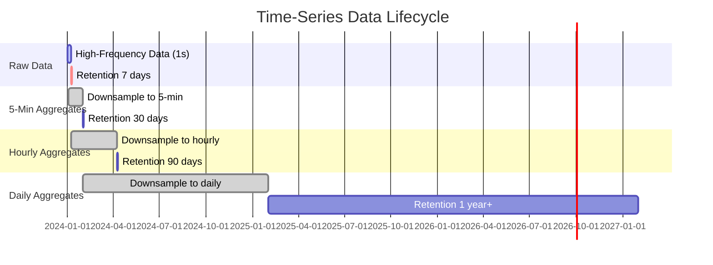
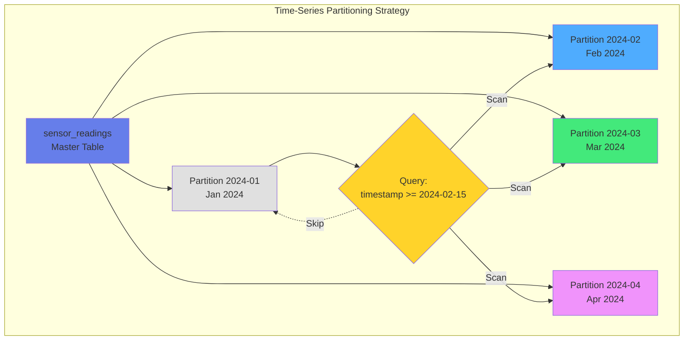
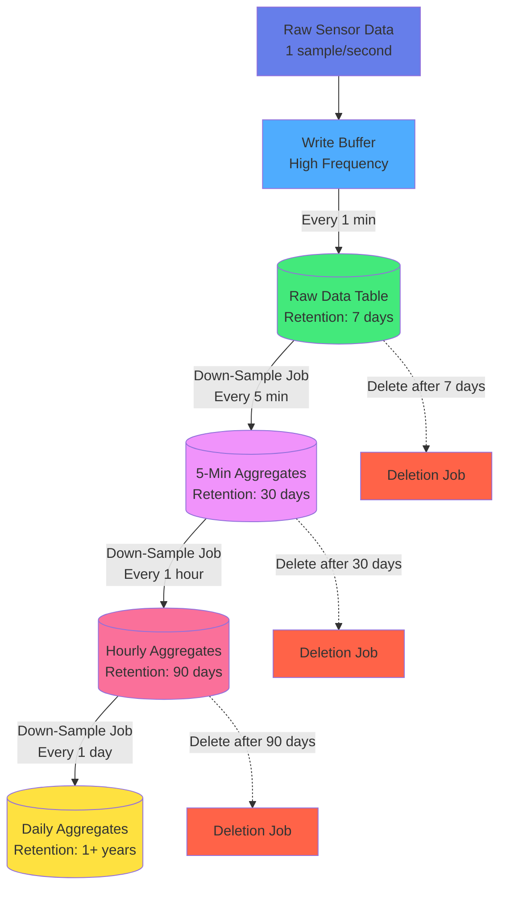

# Kapitel 9: Time-Series & IoT-Daten

## 9.1 Einführung in Time-Series-Datenbanken

### Was sind Time-Series-Daten?

Time-Series-Daten sind Messungen, die über die Zeit gesammelt werden. Jeder Datenpunkt hat einen Zeitstempel und einen oder mehrere Werte:

```python
# Sensor-Messung
{
    "timestamp": "2024-01-15T10:30:45.123Z",
    "sensor_id": "temp_sensor_001",
    "temperature": 22.5,
    "humidity": 45.2,
    "location": "warehouse_a"
}
```

**Charakteristiken:**
- **Hohe Schreiblast**: Tausende Messungen pro Sekunde
- **Zeitbasierte Queries**: "Zeige mir alle Werte der letzten Stunde"
- **Aggregationen**: Durchschnitt, Min/Max über Zeitfenster
- **Retention Policies**: Alte Daten automatisch löschen oder aggregieren

### Typische Use Cases

| Use Case | Datenrate | Retention | Beispiel |
|----------|-----------|-----------|----------|
| IoT Sensoren | 1-1000 Hz | 30-90 Tage | Temperatur, Luftfeuchtigkeit |
| Monitoring | 10-60 sec | 1-12 Monate | CPU, Memory, Disk I/O |
| Financial Data | Real-time | Jahre | Aktienkurse, Trades |
| Log Aggregation | Variabel | 7-30 Tage | Application Logs, Metrics |
| Smart Home | 1-60 sec | 3-6 Monate | Stromverbrauch, Heizung |



Abb. 09.1: Timeseries-Data-Ingestion

## 9.2 Time-Series-Datenmodell in ThemisDB

### Schema-Design für Time-Series

ThemisDB speichert Time-Series als Documents mit optimierten Indizes:

```aql
// Sensor-Messungen Collection
FOR doc IN [
  {
    _key: GENERATE_ID(),
    sensor_id: "sensor_001",
    timestamp: DATE_ISO8601(DATE_NOW()),
    temperature: 22.5,
    humidity: 65.0,
    co2_ppm: 420,
    location: "Room 101",
    metadata: {building: "A", floor: 2}
  }
] INSERT doc INTO sensor_readings

-- Index für Time-Range Queries
CREATE INDEX idx_sensor_time 
  ON sensor_readings (sensor_id, timestamp)

-- Optional: TTL-Index für automatische Daten-Pruning
CREATE INDEX idx_ttl 
  ON sensor_readings (timestamp) 
  OPTIONS {expireAfterSeconds: 2592000}  -- 30 Tage
```

**Design-Prinzipien:**
1. **Composite Index**: `(sensor_id, timestamp)` - optimal für Time-Range-Queries
2. **TTL-Policies**: Automatisches Löschen alter Daten via Expiration-Index
3. **Sharding**: Horizontales Partitionieren nach `sensor_id` für Skalierung



Abb. 09.2: Aggregation-Pipeline

### Indexes für Time-Series

```aql
-- Index für Zeit-basierte Queries
CREATE INDEX idx_readings_time ON sensor_readings (timestamp DESC);

-- Index für Sensor-spezifische Queries
CREATE INDEX idx_readings_sensor_time ON sensor_readings (sensor_id, timestamp DESC);

-- Conditional Index für Alerts (nur hohe Temperaturen)
CREATE INDEX idx_high_temp ON sensor_readings (timestamp)
WHERE temperature > 30.0;
```

## 9.3 Effiziente Time-Series Queries

### Time-Range Queries

```aql
-- Alle Messungen der letzten Stunde
SELECT sensor_id, timestamp, temperature, humidity
FROM sensor_readings
WHERE timestamp >= NOW() - INTERVAL '1 hour'
ORDER BY timestamp DESC;

-- Durchschnitt pro Sensor in den letzten 24h
SELECT sensor_id,
       COUNT(*) as measurement_count,
       AVG(temperature) as avg_temp,
       AVG(humidity) as avg_humidity,
       MAX(co2_ppm) as max_co2
FROM sensor_readings
WHERE timestamp >= NOW() - INTERVAL '24 hours'
GROUP BY sensor_id;
```

### Window Functions für Rolling Averages

```aql
-- Gleitender Durchschnitt (Moving Average) über 10 Messungen
SELECT 
    sensor_id,
    timestamp,
    temperature,
    AVG(temperature) OVER (
        PARTITION BY sensor_id 
        ORDER BY timestamp 
        ROWS BETWEEN 9 PRECEDING AND CURRENT ROW
    ) as moving_avg_10
FROM sensor_readings
WHERE sensor_id = 'temp_001'
  AND timestamp >= NOW() - INTERVAL '1 day'
ORDER BY timestamp;

-- Differenz zur vorherigen Messung
SELECT 
    sensor_id,
    timestamp,
    temperature,
    temperature - LAG(temperature) OVER (
        PARTITION BY sensor_id ORDER BY timestamp
    ) as temperature_change
FROM sensor_readings
WHERE timestamp >= NOW() - INTERVAL '1 hour';
```

### Time-Bucket Aggregationen

```aql
-- Aggregiere zu 5-Minuten-Intervallen
SELECT 
    sensor_id,
    DATE_TRUNC('minute', timestamp) - 
        (EXTRACT(minute FROM timestamp)::int % 5) * INTERVAL '1 minute' as time_bucket,
    AVG(temperature) as avg_temp,
    MIN(temperature) as min_temp,
    MAX(temperature) as max_temp,
    STDDEV(temperature) as stddev_temp
FROM sensor_readings
WHERE timestamp >= NOW() - INTERVAL '1 day'
GROUP BY sensor_id, time_bucket
ORDER BY time_bucket DESC;
```

## 9.4 Down-Sampling und Retention Policies

### Automatisches Down-Sampling

Speichere hochfrequente Rohdaten nur kurzfristig, langfristig nur Aggregate:

```aql
-- Down-Sampling: Stündliche Aggregate in neue Collection
LET hour_start = DATE_TRUNC(DATE_NOW(), 'hour')
LET hour_data = (
  FOR reading IN sensor_readings
    FILTER reading.timestamp >= DATE_SUBTRACT(hour_start, 1, 'hour')
       AND reading.timestamp < hour_start
    COLLECT sensor = reading.sensor_id INTO readings
    RETURN {
      sensor_id: sensor,
      hour_bucket: hour_start,
      avg_temperature: AVG(readings[*].reading.temperature),
      min_temperature: MIN(readings[*].reading.temperature),
      max_temperature: MAX(readings[*].reading.temperature),
      avg_humidity: AVG(readings[*].reading.humidity),
      max_co2_ppm: MAX(readings[*].reading.co2_ppm),
      sample_count: LENGTH(readings)
    }
)
FOR doc IN hour_data
  UPSERT {sensor_id: doc.sensor_id, hour_bucket: doc.hour_bucket}
  INSERT doc
  UPDATE doc
  INTO sensor_readings_hourly
```
    max_temperature = EXCLUDED.max_temperature,
    sample_count = EXCLUDED.sample_count;


Abb. 09.3: Downsampling-Strategie

### Retention Policy Implementation

```aql
-- Lösche Rohdaten älter als 30 Tage
FOR reading IN sensor_readings
  FILTER reading.timestamp < DATE_NOW() - INTERVAL('30 days')
  REMOVE reading IN sensor_readings

-- Oder: Drop alte Partitionen (viel schneller!)
DROP TABLE IF EXISTS sensor_readings_2023_01;
```

**Best Practice Retention:**
- **0-7 Tage**: Rohdaten (1 Sekunde Auflösung)
- **7-30 Tage**: 1-Minute Aggregate
- **30-90 Tage**: 5-Minute Aggregate
- **90-365 Tage**: 1-Stunde Aggregate
- **>1 Jahr**: 1-Tag Aggregate

## 9.5 Example: IoT Sensor Network

### Überblick

Das **IoT Sensor Network** Beispiel (`examples/09_iot_sensor_network`) demonstriert ein vollständiges Monitoring-System für industrielle Sensoren:

**Features:**
- Multi-Sensor Monitoring (Temperatur, Luftfeuchtigkeit, CO2)
- Real-Time Alerting bei Schwellwert-Überschreitungen
- Historische Analyse mit Trend-Erkennung
- Dashboard mit Visualisierungen
- Complex Event Processing (CEP)

### Datenmodell

```python
# models.py
from datetime import datetime
from enum import Enum

class SensorType(Enum):
    TEMPERATURE = "temperature"
    HUMIDITY = "humidity"
    CO2 = "co2"
    PRESSURE = "pressure"

class Sensor:
    def __init__(self, sensor_id: str, sensor_type: SensorType, 
                 location: str, unit: str):
        self.sensor_id = sensor_id
        self.sensor_type = sensor_type
        self.location = location
        self.unit = unit
        self.thresholds = {}
    
class SensorReading:
    def __init__(self, sensor_id: str, value: float, 
                 timestamp: datetime = None):
        self.sensor_id = sensor_id
        self.value = value
        self.timestamp = timestamp or datetime.now()
```

### Sensor-Registrierung

```python
# main.py
import themis_client as themis

# Registriere Sensoren
sensors = [
    Sensor("temp_001", SensorType.TEMPERATURE, "warehouse_a", "°C"),
    Sensor("hum_001", SensorType.HUMIDITY, "warehouse_a", "%"),
    Sensor("co2_001", SensorType.CO2, "warehouse_a", "ppm")
]

# Speichere Sensor-Metadaten
for sensor in sensors:
    themis.query("""
        UPSERT {sensor_id: @sensor_id}
        INSERT {
          sensor_id: @sensor_id,
          sensor_type: @sensor_type,
          location: @location,
          unit: @unit,
          thresholds: @thresholds
        }
        UPDATE {
          location: @location,
          thresholds: @thresholds
        }
        INTO sensors
    """, {
        'sensor_id': sensor.sensor_id,
        'sensor_type': sensor.sensor_type.value,
        'location': sensor.location,
        'unit': sensor.unit,
        'thresholds': sensor.thresholds
    })
```

### Echtzeit-Datenerfassung

```python
# Sensor-Simulation
import random
import time
from datetime import datetime

def simulate_sensors(duration_seconds=60):
    """Simuliere Sensor-Daten für Demo"""
    start_time = time.time()
    
    while time.time() - start_time < duration_seconds:
        readings = []
        
        # Generiere realistische Werte
        temp = 20 + random.gauss(2, 0.5)  # ~20°C ± 2°C
        humidity = 45 + random.gauss(5, 2)  # ~45% ± 5%
        co2 = 400 + random.gauss(50, 10)  # ~400 ppm ± 50
        
        readings.append(SensorReading("temp_001", temp))
        readings.append(SensorReading("hum_001", humidity))
        readings.append(SensorReading("co2_001", co2))
        
        # Batch-Insert mit AQL
        themis.query("""
            FOR reading IN @readings
              INSERT {
                sensor_id: reading.sensor_id,
                timestamp: reading.timestamp,
                value: reading.value
              } INTO sensor_readings
        """, {'readings': [{'sensor_id': r.sensor_id, 
                            'timestamp': r.timestamp.isoformat(), 
                            'value': r.value} for r in readings]})
        
        time.sleep(1)  # 1 Hz Sampling-Rate

simulate_sensors(duration_seconds=3600)  # 1 Stunde
```

### Alert-System

```python
# Alert-Triggering bei Schwellwert-Überschreitungen
def check_alerts():
    """Prüfe aktuelle Werte gegen Schwellwerte"""
    alerts = themis.query("""
        WITH latest_readings AS (
            SELECT DISTINCT ON (sensor_id)
                sensor_id, value, timestamp
            FROM sensor_readings
            ORDER BY sensor_id, timestamp DESC
        )
        SELECT 
            s.sensor_id,
            s.sensor_type,
            s.location,
            lr.value,
            s.thresholds->>'max' as max_threshold,
            s.thresholds->>'min' as min_threshold
        FROM sensors s
        JOIN latest_readings lr ON s.sensor_id = lr.sensor_id
        WHERE lr.value > (s.thresholds->>'max')::float
           OR lr.value < (s.thresholds->>'min')::float
    """)
    
    for alert in alerts:
        send_alert(
            sensor_id=alert['sensor_id'],
            location=alert['location'],
            value=alert['value'],
            threshold_breached=True
        )
```

### Historische Analyse

```python
def analyze_trends(sensor_id: str, hours: int = 24):
    """Analysiere Trends der letzten N Stunden"""
    analysis = themis.query("""
        SELECT 
            DATE_TRUNC('hour', timestamp) as hour,
            AVG(value) as avg_value,
            MIN(value) as min_value,
            MAX(value) as max_value,
            STDDEV(value) as stddev_value,
            -- Linearer Trend (Regression)
            REGR_SLOPE(value, EXTRACT(EPOCH FROM timestamp)) * 3600 as hourly_trend
        FROM sensor_readings
        WHERE sensor_id = ?
          AND timestamp >= NOW() - INTERVAL '? hours'
        GROUP BY hour
        ORDER BY hour
    """, (sensor_id, hours))
    
    return analysis

# Beispiel: Temperatur-Trend
temp_trend = analyze_trends("temp_001", hours=24)
print(f"Hourly trend: {temp_trend[-1]['hourly_trend']:.3f}°C/hour")
```

### Dashboard-Visualisierung

```python
import matplotlib.pyplot as plt
import pandas as pd

def plot_sensor_dashboard(sensor_id: str, hours: int = 24):
    """Erstelle Dashboard für einen Sensor"""
    # Lade Daten
    data = themis.query("""
        SELECT timestamp, value
        FROM sensor_readings
        WHERE sensor_id = ?
          AND timestamp >= NOW() - INTERVAL '? hours'
        ORDER BY timestamp
    """, (sensor_id, hours))
    
    df = pd.DataFrame(data)
    
    # Plot erstellen
    fig, (ax1, ax2) = plt.subplots(2, 1, figsize=(12, 8))
    
    # Zeitreihe
    ax1.plot(df['timestamp'], df['value'], linewidth=0.5)
    ax1.set_title(f'Sensor {sensor_id} - Last {hours}h')
    ax1.set_ylabel('Value')
    ax1.grid(True, alpha=0.3)
    
    # Histogram
    ax2.hist(df['value'], bins=50, alpha=0.7)
    ax2.set_xlabel('Value')
    ax2.set_ylabel('Frequency')
    ax2.axvline(df['value'].mean(), color='red', 
                linestyle='--', label='Mean')
    ax2.legend()
    
    plt.tight_layout()
    plt.savefig(f'dashboard_{sensor_id}.png', dpi=150)
    plt.show()

plot_sensor_dashboard("temp_001")
```

## 9.6 Example: Smart Home Energy Monitoring

### Überblick

Das **Smart Home** Beispiel (`examples/20_smart_home`) zeigt Energy Monitoring und Automation:

**Features:**
- Stromverbrauch-Tracking pro Gerät
- Automatisierungsregeln (z.B. Heizung runter wenn keiner da ist)
- Cost-Calculation basierend auf Strompreisen
- Energy-Saving-Recommendations

### Geräte-Management

```python
# Smart Home Devices
class Device:
    def __init__(self, device_id: str, device_type: str, 
                 room: str, power_rating_watts: int):
        self.device_id = device_id
        self.device_type = device_type  # "heater", "light", "appliance"
        self.room = room
        self.power_rating_watts = power_rating_watts
        self.state = "off"

# Registriere Geräte
devices = [
    Device("heater_living", "heater", "living_room", 2000),
    Device("light_living", "light", "living_room", 60),
    Device("fridge_kitchen", "appliance", "kitchen", 150),
]

for dev in devices:
    themis.execute("""
        INSERT INTO devices (device_id, device_type, room, power_rating_watts)
        VALUES (?, ?, ?, ?)
    """, (dev.device_id, dev.device_type, dev.room, dev.power_rating_watts))
```

### Energy-Tracking

```python
def track_energy_consumption():
    """Track energy consumption per device"""
    # Record current state and power usage
    for device in devices:
        if device.state == "on":
            power_usage = device.power_rating_watts
        else:
            power_usage = 0
        
        themis.execute("""
            INSERT INTO energy_readings 
            (device_id, timestamp, power_watts, state)
            VALUES (?, NOW(), ?, ?)
        """, (device.device_id, power_usage, device.state))

# Run every minute
while True:
    track_energy_consumption()
    time.sleep(60)
```

### Cost Calculation

```python
def calculate_daily_cost(date):
    """Berechne Energiekosten für einen Tag"""
    cost_per_kwh = 0.30  # 30 Cent/kWh
    
    daily_usage = themis.query("""
        SELECT 
            device_id,
            d.device_type,
            d.room,
            -- Energie in kWh (Durchschnitt * Zeit / 1000)
            SUM(power_watts * 60) / 1000.0 / 60.0 as kwh_consumed,
            -- Kosten
            SUM(power_watts * 60) / 1000.0 / 60.0 * ? as cost_euros
        FROM energy_readings er
        JOIN devices d ON er.device_id = d.device_id
        WHERE DATE(timestamp) = ?
        GROUP BY device_id, d.device_type, d.room
        ORDER BY cost_euros DESC
    """, (cost_per_kwh, date))
    
    total_cost = sum(row['cost_euros'] for row in daily_usage)
    
    print(f"Daily Energy Cost: €{total_cost:.2f}")
    for row in daily_usage:
        print(f"  {row['device_id']}: {row['kwh_consumed']:.2f} kWh → €{row['cost_euros']:.2f}")
    
    return daily_usage

calculate_daily_cost('2024-01-15')
```

### Automation Rules

```python
# Automatisierungsregeln
class AutomationRule:
    def __init__(self, rule_id: str, condition: str, action: str):
        self.rule_id = rule_id
        self.condition = condition
        self.action = action

rules = [
    AutomationRule("rule_001", 
                   "temperature < 18 AND presence = false", 
                   "set_heater_temp(15)"),
    AutomationRule("rule_002", 
                   "time > 22:00 AND presence = false", 
                   "turn_off_all_lights()"),
]

def evaluate_rules():
    """Evaluiere und führe Automation-Rules aus"""
    for rule in rules:
        # Check condition
        condition_met = themis.query_one(f"""
            LET latest = (
                FOR state IN device_states
                  SORT state.timestamp DESC
                  LIMIT 1
                  RETURN state
            )[0]
            RETURN {{rule.condition}} AS met
        """)
        
        if condition_met['met']:
            exec(rule.action)  # Führe Aktion aus
            print(f"Rule {rule.rule_id} triggered: {rule.action}")
```

## 9.7 Performance-Optimierungen

### Batch-Inserts für hohen Durchsatz

```python
# Statt 1000 einzelne INSERTs...
for reading in readings:
    themis.execute("INSERT @reading INTO sensor_readings", {"reading": reading})

# ...nutze Batch-Insert (100x schneller!)
themis.execute_batch(
    "INSERT @reading INTO sensor_readings", 
    [{"reading": r} for r in readings],
    batch_size=1000
)
```

### Partitionierung für schnelle Queries

```aql
-- Automatisches Partition-Management
CREATE OR REPLACE FUNCTION create_monthly_partition()
RETURNS void AS $$
DECLARE
    start_date DATE;
    end_date DATE;
    partition_name TEXT;
BEGIN
    start_date := DATE_TRUNC('month', NOW());
    end_date := start_date + INTERVAL '1 month';
    partition_name := 'sensor_readings_' || TO_CHAR(start_date, 'YYYY_MM');
    
    EXECUTE format('
        CREATE TABLE IF NOT EXISTS %I PARTITION OF sensor_readings
        FOR VALUES FROM (%L) TO (%L)
    ', partition_name, start_date, end_date);
END;
$$ LANGUAGE plpgsql;
```

### Materialized Views für Dashboards

```aql
-- Pre-Aggregiere Daten für schnelle Dashboard-Queries
CREATE MATERIALIZED VIEW sensor_daily_stats AS
SELECT 
    sensor_id,
    DATE(timestamp) as date,
    AVG(value) as avg_value,
    MIN(value) as min_value,
    MAX(value) as max_value,
    COUNT(*) as reading_count
FROM sensor_readings
GROUP BY sensor_id, DATE(timestamp);

-- Refresh täglich
CREATE INDEX ON sensor_daily_stats (sensor_id, date DESC);
REFRESH MATERIALIZED VIEW CONCURRENTLY sensor_daily_stats;
```

## 9.8 Best Practices

### 1. Schema-Design

✅ **DO:**
- Nutze Partitionierung für große Tabellen
- Composite Primary Key: `(entity_id, timestamp)`
- Index auf `timestamp DESC` für neueste Daten

❌ **DON'T:**
- Nicht UUID als Primary Key bei Time-Series
- Keine UNIQUEness Constraints außer Primary Key
- Vermeide komplexe JOINs in High-Frequency Queries

### 2. Query-Optimierung

✅ **DO:**
- Nutze TIME-RANGE in WHERE-Clause für Partition Pruning
- Batch-Inserts statt einzelne INSERTs
- Materialized Views für häufige Aggregationen

❌ **DON'T:**
- Keine `SELECT *` - nur benötigte Spalten
- Vermeide DISTINCT ohne Index
- Keine ungebundenen Queries ohne Zeit-Limit

### 3. Retention & Storage

✅ **DO:**
- Implementiere Retention Policies
- Down-Sample alte Daten
- Nutze automatisches Partition-Management

❌ **DON'T:**
- Behalte nicht alle Rohdaten für immer
- Lösche nicht mit DELETE (nutze DROP PARTITION)
- Vergiss nicht Backups vor Partition-Drops

## 9.9 Vergleich: ThemisDB vs. Specialized Time-Series DBs

| Feature | ThemisDB | InfluxDB | TimescaleDB |
|---------|----------|----------|-------------|
| Data Model | Relational + Multi-Model | Line Protocol | Relational |
| Query Language | SQL/AQL | InfluxQL, Flux | SQL |
| Partitioning | ✅ Native | ✅ Automatic | ✅ Hypertables |
| Continuous Aggregates | ✅ Mat. Views | ✅ Native | ✅ Continuous Aggregates |
| Retention Policies | ✅ Manual/Triggers | ✅ Automatic | ✅ Automatic |
| Downsampling | ✅ AQL-based | ✅ Built-in | ✅ Continuous Aggregates |
| Multi-Model | ✅ Graph, Vector, Doc | ❌ | ❌ |
| Horizontal Scaling | ✅ Sharding | ✅ Clustering | ✅ Distributed |

**Wann ThemisDB wählen:**
- ✅ Wenn Time-Series nur ein Teil der Anwendung ist
- ✅ Wenn komplexe Relationen zu anderen Daten bestehen
- ✅ Wenn Multi-Model Features (Graph, Vector) benötigt werden
- ✅ Wenn Standard-AQL Queries ausreichen

**Wann Specialized DB wählen:**
- InfluxDB: Sehr hohe Schreibraten (>1M writes/sec), native Telegraf-Integration
- TimescaleDB: Wenn PostgreSQL-Kompatibilität Priorität hat

## 9.10 Zusammenfassung

ThemisDB ist bestens geeignet für Time-Series & IoT-Anwendungen durch:

✅ **Native Unterstützung:**
- Partitionierung für Milliarden von Datenpunkten
- Effiziente Time-Range Queries mit Partition Pruning
- Window Functions für Rolling Averages und Trend-Analyse

✅ **Performance:**
- Batch-Inserts für hohen Schreibdurchsatz
- Materialized Views für schnelle Dashboards
- Indexing-Strategien für typische Time-Series Patterns

✅ **Flexibilität:**
- Kombiniere Time-Series mit relationalen Daten
- Nutze Graph-Queries für Sensor-Topologien
- Vector-Search für Pattern-Matching in Zeitreihen

**Key Takeaways:**
1. Nutze Partitionierung + richtige Indexes
2. Implementiere Retention Policies frühzeitig
3. Batch-Inserts für Performance
4. Materialized Views für Dashboards
5. Down-Sample alte Daten automatisch

---

## 9.11 Bi-Temporale Datenbanken: SQL:2011-Unterstützung (v1.8.0)

<!-- Source: include/temporal/ — bi_temporal.h, bitemporal_join.h, temporal_query_engine.h, snapshot_manager.h -->

> **Eingeführt in v1.6.0 · Production-Ready seit v1.8.0** – Das Temporal-Modul von ThemisDB implementiert SQL:2011-Bi-Temporalität nativ: jede Zeile trägt sowohl eine **System-Time-Periode** (wann sie gespeichert wurde) als auch eine **Valid-Time-Periode** (wann die Tatsache in der modellierten Realität gilt). Dies ermöglicht vollständige Zeitreise-Abfragen in beiden Dimensionen.

### 9.11.1 Bi-Temporales Datenmodell

Ein bi-temporaler Datensatz besitzt zwei unabhängige Zeitachsen:

```
Zeit-Achsen:
┌─────────────────────────────────────────────────────────┐
│  Valid-Time  │ „Wann gilt die Tatsache in der Realität?" │
│              │ → contract_start … contract_end           │
├─────────────────────────────────────────────────────────┤
│  System-Time │ „Wann wurde der Datensatz gespeichert?"   │
│              │ → transaction_time_start … _end           │
└─────────────────────────────────────────────────────────┘
```

**Anwendungsfall – Vertragsmanagement:**

```
Zeile 1: Gehalt = 80.000 €
  valid_time:  [2020-01-01, 2022-06-30)   ← Im Arbeitsvertrag
  system_time: [2019-12-15, 2022-06-01)   ← In DB erfasst

Zeile 2: Gehalt = 90.000 €  (rückwirkende Korrektur)
  valid_time:  [2021-01-01, ∞)
  system_time: [2022-06-01, ∞)            ← Jetzt in DB aktuell
```

### 9.11.2 BiTemporalTable — API

```cpp
#include "temporal/bi_temporal.h"

namespace t = themisdb::temporal;

t::BiTemporalTable employees_history("employees");

// Zeile einfügen mit expliziter Valid-Time
t::BiTemporalRow row;
row.key = "emp_42";
row.payload = {{"name","Alice"}, {"salary", 90000}};
row.valid_time = {
    t::Timestamp(1640995200000LL),   // 2022-01-01
    t::kUntilChanged                 // open-ended
};
employees_history.insert(row);

// Zeitreise: Stand am 2021-06-15, so wie er am 2021-06-15 bekannt war
auto rows = employees_history.asOf(
    t::Timestamp(1623715200000LL),   // Valid-Time AS OF
    t::Timestamp(1623715200000LL)    // System-Time AS OF
);

// Alle historischen Versionen einer Entität
auto history = employees_history.history("emp_42");

// Aktuelle Sicht
auto current = employees_history.currentRows();
```

**Referenzielle Integrität:**

```cpp
// Temporal Foreign Key: Mitarbeiter muss in übergeordneter Tabelle existieren
t::TemporalForeignKey fk{"departments"};
bool ok = fk.validate(dept_table, "dept_engineering", emp_row.valid_time);
```

### 9.11.3 BiTemporalJoin — SQL:2011 §T005

`BiTemporalJoin` korreliert zwei versionierte Tabellen sowohl auf der System-Time- als auch auf der Valid-Time-Achse. Fünf Join-Modi werden unterstützt:

| Modus | Prädikat | Verwendung |
|-------|---------|------------|
| `SEQUENCED` | `valid_time_L ∩ valid_time_R ≠ ∅` | Überlappende Gültigkeitszeiträume |
| `NON_SEQUENCED` | Ignoriert Zeitachsen | Einfacher Equi-Join |
| `CURRENT` | Beide Zeilen aktuell zu `as_of_time` | Aktuelle Sicht |
| `CONTAINED_IN` | `valid_time_L ⊆ valid_time_R` | Vollständige Einbettung |
| `SNAPSHOT` | Beide Tabellen am gleichen System-Time-Snapshot | Konsistente Zeitpunkt-Sicht |

```cpp
#include "temporal/bitemporal_join.h"

using namespace themisdb::temporal;

// SEQUENCED JOIN: Mitarbeiter und Abteilung zur gleichen Gültigkeitszeit
BiTemporalJoinConfig cfg;
cfg.mode           = JoinMode::SEQUENCED;
cfg.join_key_left  = "dept_id";
cfg.join_key_right = "id";

BiTemporalJoin join(left_rows, right_rows, cfg);
auto results = join.execute();
// results: Zeilen mit überlappenden Valid-Time-Perioden

// SNAPSHOT JOIN: Konsistente DB-Sicht zu einem bestimmten Zeitpunkt
BiTemporalJoinConfig snap_cfg;
snap_cfg.mode       = JoinMode::SNAPSHOT;
snap_cfg.as_of_time = Timestamp(1706745600000LL); // 2024-02-01
```

### 9.11.4 TemporalQueryEngine — Time-Travel Query Engine

`TemporalQueryEngine` führt SQL:2011-Zeitreise-Abfragen über `SystemVersionedTable`-Sammlungen aus und unterstützt alle vier SQL:2011-Temporal-Klauseln.

**Temporal-Klauseln:**

| Klausel | Semantik |
|---------|---------|
| `FOR SYSTEM_TIME AS OF t` | Zeigt den DB-Zustand zum Zeitpunkt `t` |
| `FOR SYSTEM_TIME FROM t1 TO t2` | Alle Versionen im System-Time-Intervall |
| `FOR SYSTEM_TIME BETWEEN t1 AND t2` | Inklusive beider Grenzen |
| `FOR SYSTEM_TIME ALL` | Vollständige Versionshistorie |

```cpp
#include "temporal/temporal_query_engine.h"

TemporalQueryEngine engine;
engine.registerTable("employees", emp_table);
engine.registerTable("salaries",  sal_table);

// Zeitreise-Abfrage: Wie sah die DB am 2023-01-01 aus?
TemporalQuerySpec spec;
spec.table_name      = "employees";
spec.semantics       = TemporalSemantics::SYSTEM_TIME;
spec.op              = TemporalOperator::AS_OF;
spec.time_point      = Timestamp(1672531200000LL);

auto snapshot = engine.execute(spec);

// AQL-Äquivalent
```

**AQL-Integration:**

```aql
// Zeitreise über AQL
FOR emp IN employees
  FOR ALL SYSTEM_TIME AS OF "2023-01-01T00:00:00Z"
  FILTER emp.department == "Engineering"
  RETURN {
    name: emp.name,
    salary: emp.salary,
    valid_from: emp.valid_time_start,
    recorded_at: emp.system_time_start
  }
```

**QueryCache:** Der `TemporalQueryEngine` besitzt einen eingebauten LRU-Query-Cache für wiederholte Zeitreise-Abfragen auf dieselben Zeitpunkte.

### 9.11.5 SnapshotManager — Konsistente Punkt-in-Zeit-Isolation

`SnapshotManager` erzeugt und verwaltet konsistente Snapshots über mehrere `SystemVersionedTable`-Instanzen für Snapshot-Isolation-Reads.

```cpp
#include "temporal/snapshot_manager.h"

SnapshotManager mgr;
mgr.registerTable("employees", emp_table);
mgr.registerTable("salaries",  sal_table);
mgr.registerTable("projects",  proj_table);

// Konsistenten Snapshot aller registrierten Tabellen anlegen
auto handle = mgr.createSnapshot({"employees", "salaries", "projects"});
// handle.snapshot_id     → eindeutige UUID
// handle.creation_time   → Zeitstempel des Snapshots
// handle.version_number  → monoton steigend

// Snapshot für Lesezugriff öffnen
auto snapshot_data = mgr.openSnapshot(handle.snapshot_id);

// Snapshot nach Verwendung freigeben
mgr.releaseSnapshot(handle.snapshot_id);

// Alle aktiven Snapshots auflisten
auto active = mgr.listSnapshots();
```

**Anwendungsfall: Audit-Reports**

Snapshots ermöglichen konsistente Audit-Berichte, die nicht durch parallele Schreiboperationen beeinflusst werden. Typischer Einsatz:

1. Snapshot vor dem Monatsabschluss anlegen
2. Berichte asynchron generieren (ohne globalen Lock)
3. Snapshot nach Berichtserstellung freigeben

### 9.11.6 Leistungs-Kennzahlen (v1.8.0)

| Metrik | Wert |
|--------|------|
| Bi-Temporal Insert | < 2 ms / Zeile |
| AS OF Query (1M Zeilen) | < 100 ms |
| BiTemporalJoin SEQUENCED (10K × 10K) | < 500 ms |
| Snapshot-Erstellung (5 Tabellen) | < 10 ms |
| QueryCache-Hit-Rate | > 80% |

### 9.11.7 Zusammenfassung

ThemisDB implementiert SQL:2011-Bi-Temporalität produktionsreif:

✅ **BiTemporalTable**: Zwei unabhängige Zeitachsen, TemporalForeignKey  
✅ **BiTemporalJoin**: 5 Join-Modi (SEQUENCED, NON_SEQUENCED, CURRENT, CONTAINED_IN, SNAPSHOT)  
✅ **TemporalQueryEngine**: SQL:2011 AS OF / FROM / BETWEEN / ALL + LRU-QueryCache  
✅ **SnapshotManager**: Konsistente Multi-Table-Snapshots für Snapshot-Isolation  

**Weiterführende Ressourcen:**
- [Kapitel 18: MVCC & HLC](chapter_mvcc_hlc.md)
- [Kapitel 20: Backup & Recovery](chapter_20_backup.md) — PITR-Integration
