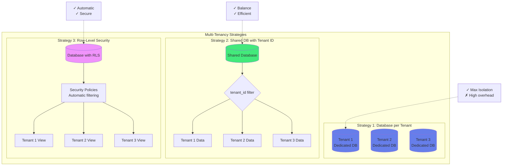
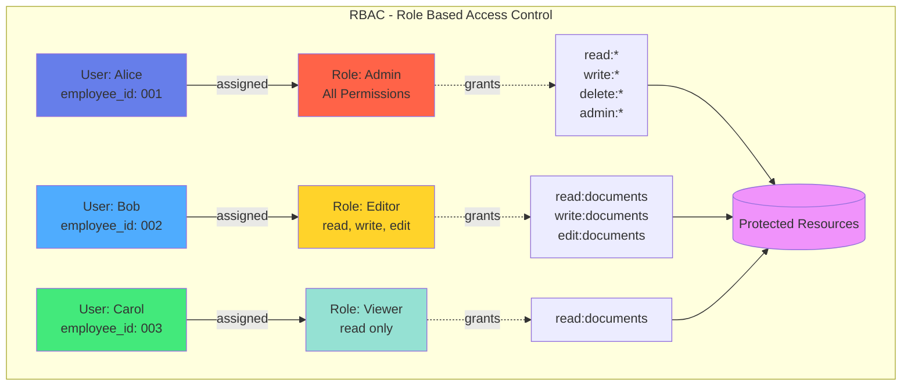
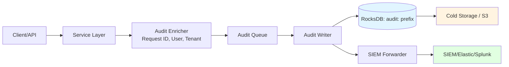
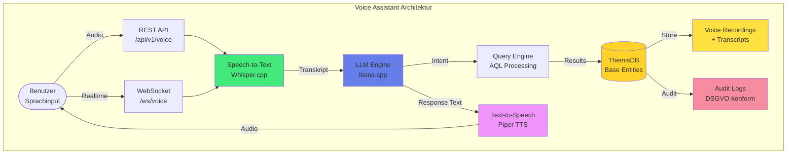

# Kapitel 10: Enterprise-Anwendungen

## Einleitung

Enterprise-Anwendungen sind das Rückgrat moderner Unternehmen. Sie verwalten kritische Geschäftsprozesse, von der Kundenverwaltung über Dokumentenmanagement bis hin zu ERP-Systemen. In diesem Kapitel lernen Sie, wie ThemisDB alle Anforderungen enterprise-grade Software erfüllt:

- **Multi-Tenancy** für Mandantenfähigkeit
- **RBAC** (Role-Based Access Control) für fein-granulare Zugriffsrechte
- **Audit-Logging** für vollständige Nachvollziehbarkeit
- **Workflow-Management** für Geschäftsprozesse
- **Skalierbarkeit** für große Datenmengen
- **Security** auf allen Ebenen

Wir demonstrieren dies anhand zweier vollständiger Beispiele:
1. **DMS/ERP-System**: Dokumentenmanagement mit Workflows
2. **CRM-System**: Customer Relationship Management

## 10.1 Enterprise-Anforderungen

### Mandantenfähigkeit (Multi-Tenancy)

In SaaS-Anwendungen müssen Daten verschiedener Kunden (Mandanten/Tenants) strikt getrennt sein.

**Drei Ansätze:**

```python
# 1. Separate Datenbanken (maximale Isolation)
db_tenant_1 = ThemisDB("tenant_1.db")
db_tenant_2 = ThemisDB("tenant_2.db")

# 2. Shared Database, Tenant-Column (balance)
db.execute("""
    CREATE TABLE documents (
        id UUID PRIMARY KEY,
        tenant_id UUID NOT NULL,
        title TEXT,
        content TEXT
    )
""")
# Index für Performance
db.execute("CREATE INDEX idx_tenant ON documents(tenant_id)")

# 3. Row-Level Security (PostgreSQL-Style)
# ThemisDB unterstützt dies via Policies:
db.execute("""
    CREATE POLICY tenant_isolation ON documents
    USING (tenant_id = current_tenant_id())
""")
```



Abb. 10.1: Enterprise-Architektur-Übersicht

**Best Practice in ThemisDB:**
```python
class TenantContext:
    def __init__(self, db, tenant_id):
        self.db = db
        self.tenant_id = tenant_id
    
    def query(self, sql, params=None):
        # Automatisches Anhängen der Tenant-Bedingung
        if "WHERE" in sql.upper():
            sql = sql.replace("WHERE", f"WHERE tenant_id = '{self.tenant_id}' AND")
        else:
            sql += f" WHERE tenant_id = '{self.tenant_id}'"
        return self.db.execute(sql, params)

# Verwendung
tenant = TenantContext(db, "acme_corp")
docs = tenant.query("""
    FOR doc IN documents 
      FILTER doc.type == @type 
      RETURN doc
""", {"type": "invoice"})
```

### Rollen-basierte Zugriffskontrolle (RBAC)

**Datenmodell:**
```python
# Rollen
db.execute("""
    CREATE TABLE roles (
        id UUID PRIMARY KEY,
        name TEXT UNIQUE NOT NULL,
        permissions TEXT[], -- ["read:documents", "write:documents"]
        created_at TIMESTAMP DEFAULT CURRENT_TIMESTAMP
    )
""")

# User-Role Zuordnung
db.execute("""
    CREATE TABLE user_roles (
        user_id UUID,
        role_id UUID,
        granted_at TIMESTAMP DEFAULT CURRENT_TIMESTAMP,
        PRIMARY KEY (user_id, role_id)
    )
""")

# Permission Check
def has_permission(user_id, permission):
    result = db.execute("""
        FOR user_role IN user_roles
          FILTER user_role.user_id == @user_id
          FOR role IN roles
            FILTER user_role.role_id == role.id AND @permission IN role.permissions
            LIMIT 1
            RETURN 1
    """, {"user_id": user_id, "permission": permission})
    return len(result) > 0
```



Abb. 10.2: RBAC-Hierarchie

# Dekorator für API-Endpoints
def requires_permission(permission):
    def decorator(func):
        def wrapper(*args, **kwargs):
            user_id = get_current_user_id()
            if not has_permission(user_id, permission):
                raise PermissionDeniedError()
            return func(*args, **kwargs)
        return wrapper
    return decorator

@requires_permission("write:documents")
def create_document(title, content):
    # Nur erreichbar mit korrekter Permission
    pass
```

### Audit-Logging

Jede Änderung muss nachvollziehbar sein:

```python
db.execute("""
    CREATE TABLE audit_log (
        id UUID PRIMARY KEY,
        timestamp TIMESTAMP DEFAULT CURRENT_TIMESTAMP,
        user_id UUID NOT NULL,
        action TEXT NOT NULL, -- CREATE, UPDATE, DELETE, READ
        resource_type TEXT NOT NULL, -- "document", "user", etc.
        resource_id UUID NOT NULL,
        old_value JSON,
        new_value JSON,
        ip_address TEXT,
        user_agent TEXT
    )
""")

# Index für schnelle Queries
db.execute("CREATE INDEX idx_audit_resource ON audit_log(resource_type, resource_id)")
db.execute("CREATE INDEX idx_audit_user ON audit_log(user_id, timestamp)")

def log_action(action, resource_type, resource_id, old_value=None, new_value=None):
    db.execute("""
        INSERT {
          id: @id,
          user_id: @user_id,
          action: @action,
          resource_type: @resource_type,
          resource_id: @resource_id,
          old_value: @old_value,
          new_value: @new_value,
          ip_address: @ip_address
        } INTO audit_log
    """, {
        "id": uuid.uuid4(),
        "user_id": get_current_user_id(),
        "action": action,
        "resource_type": resource_type,
        resource_id,
        json.dumps(old_value) if old_value else None,
        json.dumps(new_value) if new_value else None,
        get_client_ip()
    ))

# Verwendung
old_doc = db.execute("""
    FOR doc IN documents 
      FILTER doc.id == @doc_id 
      LIMIT 1 
      RETURN doc
""", {"doc_id": doc_id})[0]

db.execute("""
    FOR doc IN documents 
      FILTER doc.id == @doc_id 
      UPDATE doc WITH {title: @new_title} IN documents
""", {"doc_id": doc_id, "new_title": new_title})

new_doc = db.execute("""
    FOR doc IN documents 
      FILTER doc.id == @doc_id 
      LIMIT 1 
      RETURN doc
""", {"doc_id": doc_id})[0]

log_action("UPDATE", "document", doc_id, old_doc, new_doc)
```

**Audit-Abfragen:**
```python
# Wer hat Dokument X geändert?
changes = db.execute("""
    FOR log IN audit_log 
      FILTER log.resource_type == 'document' AND log.resource_id == @doc_id
      SORT log.timestamp DESC
      RETURN log
""", {"doc_id": doc_id})

# Was hat User Y in den letzten 7 Tagen gemacht?
activity = db.execute("""
    FOR log IN audit_log
      FILTER log.user_id == @user_id AND log.timestamp > DATE_NOW() - INTERVAL('7 days')
      SORT log.timestamp DESC
      RETURN log
""", {"user_id": user_id})
```

---

## 10.2 Native Security-Stack: Production-Ready Sicherheit

ThemisDB v1.5.0-dev bietet einen vollständig nativen, in C++ implementierten Security-Stack, der BSI C5-konform ist und keine externen Abhängigkeiten (wie Apache Ranger) für die Kern-Sicherheitsfunktionen benötigt.

### 10.2.1 Implementierungsstatus (Februar 2026)

| Komponente | Status | Implementierung | Beschreibung |
|------------|--------|-----------------|--------------|
| **RBAC/ABAC Policy Engine** | ✅ Produktionsreif | `src/security/rbac.cpp` | Role-Based & Attribute-Based Access Control |
| **Apache Ranger Integration** | ✅ Produktionsreif | `src/server/ranger_adapter.cpp` | Optional: Enterprise Policy Management |
| **Field-Level Encryption** | ✅ Produktionsreif | `src/security/encryption.cpp` | AES-256-GCM, transparent |
| **Column Encryption** | ✅ Produktionsreif | BSI C5 konform | Spalten-basierte Verschlüsselung |
| **Vector Encryption** | ✅ Produktionsreif | Phase 1+2 komplett | HNSW-Index + RocksDB Vektoren |
| **PKI Integration** | ✅ Produktionsreif | `src/security/pki_key_provider.cpp` | X.509 Zertifikat-basiert |
| **HSM Support** | ✅ Produktionsreif | `src/security/hsm_provider_pkcs11.cpp` | PKCS#11 Hardware Security Modules |
| **Audit Logging** | ✅ Produktionsreif | `src/utils/audit_logger.cpp` | Tamper-Proof mit Hash-Chains |
| **Malware Scanner** | ✅ Produktionsreif | `src/security/malware_scanner.cpp` | Content Security |
| **CMS Signing** | ✅ Produktionsreif | `src/security/cms_signing.cpp` | Cryptographic Message Syntax |
| **RFC 3161 TSA** | ✅ Produktionsreif | `src/security/timestamp_authority.cpp` | Qualified Timestamps |

**Gesamt:** 16 Header-Dateien, 16 Source-Dateien, ~8.100 LOC

### 10.2.2 RBAC-Implementierung im C++ Core

ThemisDB implementiert RBAC direkt im C++ Kern, nicht als Add-on-Layer:

**Architektur:**
```cpp
// Native RBAC Integration (src/security/rbac.h)
class RBACManager {
public:
    // Role Management
    Status createRole(const std::string& roleName, 
                     const std::vector<std::string>& permissions);
    Status assignRole(const std::string& userId, 
                     const std::string& roleName);
    
    // Permission Check (optimiert für Performance)
    bool hasPermission(const std::string& userId,
                      const std::string& resource,
                      const std::string& action) const;
    
    // Attribute-Based (ABAC) Extension
    bool checkPolicy(const PolicyContext& ctx) const;
};
```

**Performance-Optimierung:**
- Permission-Checks gecacht im RAM (TBB concurrent_hash_map)
- Sub-Millisekunden Latenz für Permission-Checks
- Keine Netzwerk-Latenz (im Gegensatz zu externen Policy-Servern)

**Verwendung in AQL:**
```aql
// Automatischer Permission-Check bei Query-Ausführung
FOR doc IN documents
    // RBAC-Filter wird automatisch eingefügt basierend auf User-Kontext
    FILTER HAS_PERMISSION(CURRENT_USER(), doc._id, 'read')
    RETURN doc
```

### 10.2.3 Tamper-Proof Audit Logging mit Hash-Chains

Das Audit-System von ThemisDB verhindert nachträgliche Manipulation durch **kryptografische Hash-Chains**:

**Funktionsweise:**
```cpp
// src/utils/audit_logger.cpp
class AuditLogger {
    struct AuditEntry {
        uint64_t sequence_number;
        int64_t timestamp_ms;
        std::string user_id;
        std::string action;
        std::string resource_id;
        std::string details;
        std::string previous_hash;  // Hash des vorherigen Eintrags
        std::string current_hash;   // SHA-256 über alle Felder
    };
    
    // Verkettung erzwingt chronologische Integrität
    std::string computeHash(const AuditEntry& entry) {
        std::string data = std::to_string(entry.sequence_number) +
                          std::to_string(entry.timestamp_ms) +
                          entry.user_id + entry.action + 
                          entry.resource_id + entry.details +
                          entry.previous_hash;
        return SHA256(data);  // OpenSSL
    }
};
```

**Garantien:**
- ✅ **Unveränderbarkeit:** Jede Änderung bricht die Hash-Chain
- ✅ **Lückenlosigkeit:** Fehlende Einträge sind sofort erkennbar
- ✅ **Zeitstempel-Authentizität:** Integration mit RFC 3161 Timestamp Authority
- ✅ **Revisionssicher:** BSI-konform, DSGVO Art. 32

**Verifikation:**
```aql
// Audit-Log-Integrität prüfen
FOR entry IN audit_log
    SORT entry.sequence_number ASC
    LET expected_hash = SHA256(
        CONCAT(
            entry.sequence_number,
            entry.timestamp_ms,
            entry.user_id,
            entry.action,
            entry.resource_id,
            entry.details,
            entry.previous_hash
        )
    )
    FILTER entry.current_hash != expected_hash
    RETURN {
        error: "Audit log integrity violation",
        sequence: entry.sequence_number
    }
```

### 10.2.4 HashiCorp Vault Integration

Für Enterprise-Key-Management integriert ThemisDB mit HashiCorp Vault:

**Konfiguration:**
```cpp
// src/security/vault_key_provider.cpp
VaultKeyProvider::Config vault_config;
vault_config.vault_addr = "https://vault.company.com:8200";
vault_config.token = std::getenv("VAULT_TOKEN");
vault_config.mount_path = "themisdb";
vault_config.key_name = "database-master-key";

auto key_provider = std::make_shared<VaultKeyProvider>(vault_config);
FieldEncryption encryption(key_provider);
```

**Features:**
- ✅ Automatische Key-Rotation
- ✅ Audit Trail für Key-Access
- ✅ High Availability (Vault Cluster)
- ✅ Disaster Recovery (Sealed/Unsealed State)

**Alternative Key Provider:**
- `MockKeyProvider`: Für Testing/Development
- `PKIKeyProvider`: Zertifikat-basiert für PKI-Infrastrukturen
- `HSMProvider`: PKCS#11 für Hardware Security Modules (Luna, Thales)

### 10.2.5 BSI C5 Compliance: Kryptographie

ThemisDB erreicht **100% BSI C5 Compliance** für Kryptographie-Anforderungen (CRY-01 bis CRY-06):

| Anforderung | Umsetzung | Dokument |
|-------------|-----------|----------|
| **CRY-01**: Kryptographie-Policy | ✅ Formale Policy dokumentiert | `CRYPTOGRAPHY_POLICY.md` |
| **CRY-02**: Key Lifecycle | ✅ Vollständiger Lebenszyklus | `KEY_LIFECYCLE_MANAGEMENT.md` |
| **CRY-03**: At-Rest Encryption | ✅ AES-256-GCM für alle Daten | Column + Vector Encryption |
| **CRY-04**: In-Transit Encryption | ✅ TLS 1.3 mandatory | Wire Protocol + HTTP/2 |
| **CRY-05**: Key Storage | ✅ HSM/Vault Integration | `VaultKeyProvider` + `HSMProvider` |
| **CRY-06**: Algorithm Strength | ✅ BSI TR-02102-1 konform | AES-256, RSA-2048+, SHA-256 |

**Besonderheit: Multi-Model Encryption Consistency**

ThemisDB's Unified Storage Architecture garantiert konsistente Verschlüsselung über alle Datenmodelle:

```
┌─────────────────────────────────────────────────────────┐
│           Application Layer (AQL Queries)                │
├─────────────────────────────────────────────────────────┤
│  Relational  │  Graph  │  Vector  │  Document  │  Geo   │
│  Projection  │  Proj.  │  Proj.   │  Proj.     │  Proj. │
└──────────────┴─────────┴──────────┴────────────┴────────┘
                         │
                         ▼
        ┌────────────────────────────────────────┐
        │   Encryption Layer (AES-256-GCM)       │ ◄── Einheitlich!
        └────────────────────────────────────────┘
                         │
                         ▼
        ┌────────────────────────────────────────┐
        │  Base Entity Storage (RocksDB)         │
        │  • Alle Daten verschlüsselt            │
        │  • Keine Encryption Gaps               │
        └────────────────────────────────────────┘
```

**Vorteil:** Im Gegensatz zu Polyglot-Systemen, wo jede Datenbank eigene Encryption benötigt, ist in ThemisDB alles einheitlich verschlüsselt – kein Modell kann "vergessen" werden.

### 10.2.6 DSGVO "By Design" Features

ThemisDB implementiert DSGVO-Anforderungen technisch:

**1. Auto-Purge nach Retention-Period (Art. 17 - Recht auf Löschung):**
```cpp
// src/utils/retention_manager.cpp
RetentionManager::Config retention;
retention.enable_auto_purge = true;
retention.default_retention_days = 2555;  // 7 Jahre (§ 147 AO)
retention.purge_schedule_cron = "0 2 * * 0";  // Sonntags 2 Uhr

// Anwendung auf Collection
db.execute("""
    CREATE COLLECTION customer_data WITH {
        retention_days: 2555,
        auto_purge: true
    }
""");
```

**2. PII Detection und Redaction (Art. 32 - Datensicherheit):**
```cpp
// src/utils/pii_detector.cpp
PIIDetector detector;
detector.addPattern("email", R"([\w\.-]+@[\w\.-]+\.\w+)");
detector.addPattern("iban", R"(DE\d{20})");
detector.addPattern("ssn", R"(\d{3}-\d{2}-\d{4})");

// Automatische Redaction bei Logging
std::string safe_text = detector.redact(user_input);
// Output: "Contact: ***@***.com, IBAN: DE********************"
```

**3. Encrypt-then-Sign für Log-Integrität:**
```cpp
// src/security/cms_signing.cpp
CMSSigning signer(private_key, certificate);

// Audit-Log Entry signieren
std::string signed_entry = signer.sign(
    audit_entry_json,
    true  // include_timestamp (RFC 3161)
);

// Später: Verifizierung
bool valid = signer.verify(signed_entry, public_cert);
```

**4. Granulare Retention Policies:**
```aql
-- Unterschiedliche Aufbewahrungsfristen pro Datentyp
CREATE COLLECTION invoices WITH { retention_days: 3650 };  -- 10 Jahre
CREATE COLLECTION marketing_consents WITH { retention_days: 730 };  -- 2 Jahre
CREATE COLLECTION session_logs WITH { retention_days: 90 };  -- 90 Tage
```

### 10.2.7 Code-Beispiel: Vollständige Enterprise-Security

```python
from themisdb import Client, SecurityContext

# 1. Client mit Security-Kontext
client = Client("localhost", 8765)

# 2. Authentifizierung (PKI-basiert oder Token)
auth_token = client.authenticate(
    cert_file="user.crt",
    key_file="user.key"
)

# 3. Security Context für alle Operationen
sec_ctx = SecurityContext(
    user_id="alice@company.com",
    roles=["data_analyst", "auditor"],
    tenant_id="acme_corp"
)

# 4. Query mit automatischem RBAC + Audit
with client.transaction(sec_ctx) as tx:
    # Permission-Check + Audit-Log-Eintrag automatisch
    results = tx.query("""
        FOR doc IN sensitive_documents
            FILTER doc.classification <= @max_clearance
            RETURN doc
    """, {"max_clearance": sec_ctx.get_clearance_level()})
    
    # Alle Aktionen werden geloggt:
    # - Wer (alice@company.com)
    # - Was (SELECT sensitive_documents)
    # - Wann (2025-12-30T15:00:00Z)
    # - Ergebnis (5 rows returned)
    # - Hash (SHA-256 chain)

# 5. Compliance-Report abrufen
audit_report = client.get_audit_report(
    start_date="2025-01-01",
    end_date="2025-12-31",
    user_id="alice@company.com"
)
```

---

## 10.3 DMS/ERP-System (Example 08)

Ein vollständiges Document Management System mit ERP-Features.

### Architektur-Übersicht

```
┌─────────────────────────────────────────────────┐
│            Web-Interface (Flask)                │
├─────────────────────────────────────────────────┤
│  Document API │ Workflow API │ Search API      │
├─────────────────────────────────────────────────┤
│          ThemisDB (Multi-Model)                 │
│  ┌──────────┬──────────┬──────────┬──────────┐ │
│  │Relational│  Graph   │ Document │  Vector  │ │
│  │(Meta)    │(Workflow)│(Versions)│(Search)  │ │
│  └──────────┴──────────┴──────────┴──────────┘ │
├─────────────────────────────────────────────────┤
│  File Storage (S3/Local) │ OCR Engine          │
└─────────────────────────────────────────────────┘
```

### Datenmodell

Das Dokumentenmanagementsystem kombiniert relationale, dokumenten-orientierte und vektorbasierte Features für ein vollständiges Enterprise-DMS. Das System verwaltet Dokumente mit Versionierung, Metadaten, Volltext-Indexierung und semantischer Suche - alles mandantenfähig und mit Audit-Logging.

📁 **Vollständiger Code:** `examples/10_enterprise/dms_system.py` (~450 Zeilen)

**Kern-Architektur:**
```python
class Document:
    def __init__(self, db):
        self.db = db
        self.init_schema()
    
    def init_schema(self):
        # Haupt-Dokument mit Versionierung (Relational + Multi-Tenancy)
        self.db.execute("""
            CREATE TABLE IF NOT EXISTS documents (
                id UUID PRIMARY KEY,
                tenant_id UUID NOT NULL,  -- Multi-Tenancy
                title TEXT NOT NULL,
                type TEXT NOT NULL,
                version INT DEFAULT 1,
                current_version_id UUID,
                owner_id UUID NOT NULL,
                workflow_state TEXT DEFAULT 'draft',
                created_at TIMESTAMP DEFAULT CURRENT_TIMESTAMP,
                updated_at TIMESTAMP DEFAULT CURRENT_TIMESTAMP
            )
        """)
        
        # Metadaten (Document Model - flexible JSON-Struktur)
        self.db.execute("""
            CREATE TABLE IF NOT EXISTS document_metadata (
                document_id UUID PRIMARY KEY,
                metadata JSON NOT NULL,
                tags TEXT[],
                FOREIGN KEY (document_id) REFERENCES documents(id)
            )
        """)
        
        # Volltext-Extraktion mit OCR-Support
        self.db.execute("""
            CREATE TABLE IF NOT EXISTS document_text (
                document_id UUID PRIMARY KEY,
                content TEXT,
                ocr_content TEXT,  -- OCR für gescannte Dokumente
                FOREIGN KEY (document_id) REFERENCES documents(id)
            )
        """)
        self.db.execute("CREATE INDEX idx_doc_fulltext ON document_text USING GIN(to_tsvector('german', content))")
        
        # Vector Embeddings für semantische Suche
        self.db.execute("""
            CREATE TABLE IF NOT EXISTS document_embeddings (
                document_id UUID PRIMARY KEY,
                embedding VECTOR(384),  -- sentence-transformers
                FOREIGN KEY (document_id) REFERENCES documents(id)
            )
        """)
        self.db.execute("CREATE INDEX idx_doc_vector ON document_embeddings USING HNSW(embedding)")

    def create_document(self, title, doc_type, file_path, metadata=None, owner_id=None):
        """Dokument erstellen mit automatischer Text-Extraktion und Embedding-Generierung"""
        doc_id = uuid.uuid4()
        
        with self.db.transaction():
            # 1. Haupt-Dokument mit Tenant-Isolation
            self.db.execute("""
                INSERT {
                  id: @doc_id,
                  tenant_id: @tenant_id,  -- Automatische Mandantentrennung
                  title: @title,
                  type: @doc_type,
                  owner_id: @owner_id
                } INTO documents
            """, {
                "doc_id": doc_id,
                "tenant_id": get_current_tenant_id(),
                "title": title,
                "doc_type": doc_type,
                "owner_id": owner_id or get_current_user_id()
            })
            
            # 2. Text-Extraktion (PDF, DOCX, etc.)
            text = extract_text(file_path)
            
            # 3. OCR für gescannte Dokumente
            if doc_type in ('scan', 'image'):
                ocr_text = perform_ocr(file_path)
                text = text + " " + ocr_text
            
            # 4. Fulltext-Index befüllen
            self.db.execute("""
                INSERT {
                  document_id: @doc_id,
                  content: @content
                } INTO document_text
            """, {"doc_id": doc_id, "content": text})
            
            # 5. Semantische Embeddings generieren
            embedding = generate_embedding(text)  # sentence-transformers/384D
            self.db.execute("""
                INSERT {
                  document_id: @doc_id,
                  embedding: @embedding
                } INTO document_embeddings
            """, {"doc_id": doc_id, "embedding": embedding})
            
            # 6. Audit-Log für Compliance
            log_action("CREATE", "document", doc_id, None, {"title": title, "type": doc_type})
        
        return doc_id

    def search(self, query, doc_type=None, limit=20):
        """Hybrid-Suche kombiniert Volltext-Ranking mit semantischer Ähnlichkeit"""
        # 1. Fulltext-Suche (BM25-ähnlich mit ts_rank)
        fulltext_results = self.db.execute("""
            SELECT d.id, d.title, d.type, 
                   ts_rank(to_tsvector('german', dt.content), plainto_tsquery('german', @query)) as rank
            FROM documents d
            JOIN document_text dt ON d.id = dt.document_id
            WHERE d.tenant_id = @tenant_id 
              AND to_tsvector('german', dt.content) @@ plainto_tsquery('german', @query)
            ORDER BY rank DESC LIMIT @limit
        """, {"query": query, "tenant_id": get_current_tenant_id(), "limit": limit})
        
        # 2. Vector-Suche (semantische Ähnlichkeit via Cosine)
        query_embedding = generate_embedding(query)
        vector_results = self.db.execute("""
            SELECT d.id, d.title, d.type,
                   1 - (de.embedding <=> @query_emb) as similarity
            FROM documents d
            JOIN document_embeddings de ON d.id = de.document_id
            WHERE d.tenant_id = @tenant_id
            ORDER BY similarity DESC LIMIT @limit
        """, {"query_emb": query_embedding, "tenant_id": get_current_tenant_id(), "limit": limit})
        
        # 3. Merge und Re-Ranking
        merged = merge_search_results(fulltext_results, vector_results)  # Reciprocal Rank Fusion
        return merged
```

**Zusätzliche Features im vollständigen Code:**
- Versionsverwaltung mit `add_version()` und `get_version_history()`
- Fein-granulare Permissions pro Dokument (read/write/admin)
- Checksum-Verifizierung für Integrität
- Asynchrone Text-Extraktion für große Dateien
- Workflow-Integration (siehe nächster Abschnitt)

### Workflow-Management

Workflows als Graph modellieren:

```python
class WorkflowEngine:
    def __init__(self, db):
        self.db = db
        self.init_schema()
    
    def init_schema(self):
        # Workflow-Definitionen (Relational)
        self.db.execute("""
            CREATE TABLE IF NOT EXISTS workflows (
                id UUID PRIMARY KEY,
                name TEXT NOT NULL,
                description TEXT,
                active BOOLEAN DEFAULT true
            )
        """)
        
        # Workflow-Schritte als Graph
        self.db.execute("""
            CREATE TABLE IF NOT EXISTS workflow_nodes (
                id UUID PRIMARY KEY,
                workflow_id UUID NOT NULL,
                name TEXT NOT NULL,
                node_type TEXT CHECK (node_type IN ('start', 'approval', 'task', 'decision', 'end')),
                role_required TEXT,
                FOREIGN KEY (workflow_id) REFERENCES workflows(id)
            )
        """)
        
        self.db.execute("""
            CREATE TABLE IF NOT EXISTS workflow_edges (
                from_node UUID,
                to_node UUID,
                condition TEXT, -- Optional: JSON mit Bedingung
                PRIMARY KEY (from_node, to_node),
                FOREIGN KEY (from_node) REFERENCES workflow_nodes(id),
                FOREIGN KEY (to_node) REFERENCES workflow_nodes(id)
            )
        """)
        
        # Workflow-Instanzen (laufende Prozesse)
        self.db.execute("""
            CREATE TABLE IF NOT EXISTS workflow_instances (
                id UUID PRIMARY KEY,
                workflow_id UUID NOT NULL,
                document_id UUID NOT NULL,
                current_node UUID NOT NULL,
                state TEXT DEFAULT 'running',
                started_at TIMESTAMP DEFAULT CURRENT_TIMESTAMP,
                completed_at TIMESTAMP,
                FOREIGN KEY (workflow_id) REFERENCES workflows(id),
                FOREIGN KEY (document_id) REFERENCES documents(id),
                FOREIGN KEY (current_node) REFERENCES workflow_nodes(id)
            )
        """)
        
        # Workflow-Historie
        self.db.execute("""
            CREATE TABLE IF NOT EXISTS workflow_history (
                id UUID PRIMARY KEY,
                instance_id UUID NOT NULL,
                node_id UUID NOT NULL,
                user_id UUID,
                action TEXT,
                comment TEXT,
                timestamp TIMESTAMP DEFAULT CURRENT_TIMESTAMP,
                FOREIGN KEY (instance_id) REFERENCES workflow_instances(id)
            )
        """)

    def create_workflow(self, name, description, steps):
        """Workflow definieren
        
        steps = [
            {"name": "Erfassung", "type": "start"},
            {"name": "Manager-Prüfung", "type": "approval", "role": "manager"},
            {"name": "Direktor-Freigabe", "type": "approval", "role": "director"},
            {"name": "Abgeschlossen", "type": "end"}
        ]
        """
        workflow_id = uuid.uuid4()
        
        with self.db.transaction():
            self.db.execute("""
                INSERT {
                  id: @workflow_id,
                  name: @name,
                  description: @description
                } INTO workflows
            """, {"workflow_id": workflow_id, "name": name, "description": description})
            
            # Nodes erstellen
            node_ids = []
            for step in steps:
                node_id = uuid.uuid4()
                self.db.execute("""
                    INSERT {
                      id: @node_id,
                      workflow_id: @workflow_id,
                      name: @name,
                      node_type: @node_type,
                      role_required: @role_required
                    } INTO workflow_nodes
                """, {
                    "node_id": node_id,
                    "workflow_id": workflow_id,
                    "name": step['name'],
                    "node_type": step['type'],
                    "role_required": step.get('role')
                })
                node_ids.append(node_id)
            
            # Edges erstellen (linearer Flow)
            for i in range(len(node_ids) - 1):
                self.db.execute("""
                    INSERT {
                      from_node: @from_node,
                      to_node: @to_node
                    } INTO workflow_edges
                """, {"from_node": node_ids[i], "to_node": node_ids[i+1]})
        
        return workflow_id

    def start_workflow(self, workflow_id, document_id):
        """Workflow für Dokument starten"""
        # Start-Node finden
        start_node = self.db.execute("""
            SELECT id FROM workflow_nodes 
            WHERE workflow_id = ? AND node_type = 'start'
        """, (workflow_id,))[0]
        
        instance_id = uuid.uuid4()
        self.db.execute("""
            INSERT INTO workflow_instances (id, workflow_id, document_id, current_node)
            VALUES (?, ?, ?, ?)
        """, (instance_id, workflow_id, document_id, start_node['id']))
        
        # Dokumentstatus aktualisieren
        self.db.execute("UPDATE documents SET workflow_state = 'in_progress' WHERE id = ?", (document_id,))
        
        # Nächsten Schritt finden und zuweisen
        self._advance_workflow(instance_id)
        
        return instance_id

    def _advance_workflow(self, instance_id):
        """Workflow zum nächsten Schritt bewegen"""
        instance = self.db.execute("SELECT * FROM workflow_instances WHERE id = ?", (instance_id,))[0]
        
        # Nächster Node via Graph-Traversierung
        next_nodes = self.db.execute("""
            SELECT wn.* FROM workflow_edges we
            JOIN workflow_nodes wn ON we.to_node = wn.id
            WHERE we.from_node = ?
        """, (instance['current_node'],))
        
        if not next_nodes:
            # Ende erreicht
            self.db.execute("""
                UPDATE workflow_instances 
                SET state = 'completed', completed_at = CURRENT_TIMESTAMP
                WHERE id = ?
            """, (instance_id,))
            self.db.execute("UPDATE documents SET workflow_state = 'completed' WHERE id = ?", (instance['document_id'],))
            return
        
        next_node = next_nodes[0]
        self.db.execute("UPDATE workflow_instances SET current_node = ? WHERE id = ?", 
                       (next_node['id'], instance_id))
        
        # Task an User mit entsprechender Rolle zuweisen
        if next_node['role_required']:
            self._assign_task(instance_id, next_node['id'], next_node['role_required'])

    def approve(self, instance_id, user_id, comment=""):
        """Workflow-Schritt genehmigen"""
        instance = self.db.execute("SELECT * FROM workflow_instances WHERE id = ?", (instance_id,))[0]
        current_node = self.db.execute("SELECT * FROM workflow_nodes WHERE id = ?", (instance['current_node'],))[0]
        
        # Permission check
        if current_node['role_required']:
            if not user_has_role(user_id, current_node['role_required']):
                raise PermissionError(f"User benötigt Rolle: {current_node['role_required']}")
        
        with self.db.transaction():
            # Historie speichern
            self.db.execute("""
                INSERT INTO workflow_history (id, instance_id, node_id, user_id, action, comment)
                VALUES (?, ?, ?, ?, ?, ?)
            """, (uuid.uuid4(), instance_id, current_node['id'], user_id, "APPROVED", comment))
            
            # Zum nächsten Schritt
            self._advance_workflow(instance_id)
            
            log_action("WORKFLOW_APPROVE", "workflow_instance", instance_id, None, {
                "node": current_node['name'],
                "user": user_id
            })

    def reject(self, instance_id, user_id, reason):
        """Workflow-Schritt ablehnen"""
        with self.db.transaction():
            instance = self.db.execute("SELECT * FROM workflow_instances WHERE id = ?", (instance_id,))[0]
            
            self.db.execute("""
                INSERT INTO workflow_history (id, instance_id, node_id, user_id, action, comment)
                VALUES (?, ?, ?, ?, ?, ?)
            """, (uuid.uuid4(), instance_id, instance['current_node'], user_id, "REJECTED", reason))
            
            self.db.execute("UPDATE workflow_instances SET state = 'rejected' WHERE id = ?", (instance_id,))
            self.db.execute("UPDATE documents SET workflow_state = 'rejected' WHERE id = ?", (instance['document_id'],))
            
            log_action("WORKFLOW_REJECT", "workflow_instance", instance_id, None, {"reason": reason})

    def get_pending_tasks(self, user_id):
        """Offene Tasks für User"""
        # User-Rollen ermitteln
        user_roles = self.db.execute("SELECT role_name FROM user_roles WHERE user_id = ?", (user_id,))
        role_names = [r['role_name'] for r in user_roles]
        
        # Workflows in passenden Nodes
        return self.db.execute("""
            SELECT wi.*, d.title as document_title, wn.name as step_name
            FROM workflow_instances wi
            JOIN workflow_nodes wn ON wi.current_node = wn.id
            JOIN documents d ON wi.document_id = d.id
            WHERE wi.state = 'running' 
            AND wn.role_required IN ({})
            ORDER BY wi.started_at
        """.format(','.join('?' * len(role_names))), role_names)
```

### API-Implementierung

```python
from flask import Flask, request, jsonify
from werkzeug.security import check_password_hash
import jwt

app = Flask(__name__)
db = ThemisDB("dms_erp.db")
doc_manager = Document(db)
workflow_engine = WorkflowEngine(db)

# Authentifizierung
def authenticate(username, password):
    user = db.execute("SELECT * FROM users WHERE username = ?", (username,))
    if not user or not check_password_hash(user[0]['password'], password):
        return None
    token = jwt.encode({'user_id': str(user[0]['id'])}, app.config['SECRET_KEY'])
    return token

@app.route('/api/auth/login', methods=['POST'])
def login():
    data = request.json
    token = authenticate(data['username'], data['password'])
    if token:
        return jsonify({'token': token})
    return jsonify({'error': 'Invalid credentials'}), 401

# Middleware
def require_auth(f):
    def wrapper(*args, **kwargs):
        token = request.headers.get('Authorization', '').replace('Bearer ', '')
        try:
            payload = jwt.decode(token, app.config['SECRET_KEY'], algorithms=['HS256'])
            request.user_id = payload['user_id']
            return f(*args, **kwargs)
        except:
            return jsonify({'error': 'Unauthorized'}), 401
    return wrapper

# Document API
@app.route('/api/documents', methods=['POST'])
@require_auth
@requires_permission('create:document')
def create_document():
    file = request.files['file']
    metadata = request.form.get('metadata', '{}')
    
    # Datei speichern
    file_path = save_uploaded_file(file)
    
    doc_id = doc_manager.create_document(
        title=file.filename,
        doc_type=request.form.get('type', 'general'),
        file_path=file_path,
        metadata=json.loads(metadata),
        owner_id=request.user_id
    )
    
    return jsonify({'id': str(doc_id), 'message': 'Document created'}), 201

@app.route('/api/documents/<doc_id>', methods=['GET'])
@require_auth
def get_document(doc_id):
    # Permission Check
    if not has_document_permission(request.user_id, doc_id, 'read'):
        return jsonify({'error': 'Forbidden'}), 403
    
    doc = db.execute("SELECT * FROM documents WHERE id = ?", (doc_id,))[0]
    versions = doc_manager.get_version_history(doc_id)
    
    return jsonify({
        'document': doc,
        'versions': versions
    })

@app.route('/api/documents/search', methods=['GET'])
@require_auth
def search_documents():
    query = request.args.get('q', '')
    doc_type = request.args.get('type')
    
    results = doc_manager.search(query, doc_type)
    return jsonify({'results': results})

# Workflow API
@app.route('/api/workflows/<workflow_id>/start', methods=['POST'])
@require_auth
def start_workflow_api(workflow_id):
    data = request.json
    instance_id = workflow_engine.start_workflow(workflow_id, data['document_id'])
    return jsonify({'instance_id': str(instance_id)})

@app.route('/api/workflows/tasks', methods=['GET'])
@require_auth
def get_my_tasks():
    tasks = workflow_engine.get_pending_tasks(request.user_id)
    return jsonify({'tasks': tasks})

@app.route('/api/workflows/instances/<instance_id>/approve', methods=['POST'])
@require_auth
def approve_workflow(instance_id):
    data = request.json
    workflow_engine.approve(instance_id, request.user_id, data.get('comment', ''))
    return jsonify({'message': 'Approved'})

@app.route('/api/workflows/instances/<instance_id>/reject', methods=['POST'])
@require_auth
def reject_workflow(instance_id):
    data = request.json
    workflow_engine.reject(instance_id, request.user_id, data['reason'])
    return jsonify({'message': 'Rejected'})
```

### OCR und Text-Extraktion

```python
import pytesseract
from PIL import Image
import fitz  # PyMuPDF

def extract_text(file_path):
    """Text aus verschiedenen Formaten extrahieren"""
    ext = file_path.split('.')[-1].lower()
    
    if ext == 'pdf':
        return extract_text_from_pdf(file_path)
    elif ext in ('docx', 'doc'):
        return extract_text_from_docx(file_path)
    elif ext == 'txt':
        with open(file_path, 'r', encoding='utf-8') as f:
            return f.read()
    else:
        return ""

def extract_text_from_pdf(file_path):
    """PDF Text-Extraktion"""
    text = []
    doc = fitz.open(file_path)
    for page in doc:
        text.append(page.get_text())
    return '\n'.join(text)

def perform_ocr(file_path):
    """OCR für gescannte Dokumente"""
    if file_path.endswith('.pdf'):
        # PDF → Bilder → OCR
        doc = fitz.open(file_path)
        ocr_text = []
        for page_num in range(len(doc)):
            page = doc[page_num]
            pix = page.get_pixmap()
            img = Image.frombytes("RGB", [pix.width, pix.height], pix.samples)
            text = pytesseract.image_to_string(img, lang='deu')
            ocr_text.append(text)
        return '\n'.join(ocr_text)
    else:
        # Direktes Bild
        img = Image.open(file_path)
        return pytesseract.image_to_string(img, lang='deu')
```

## 10.4 CRM-System (Example 17)

Customer Relationship Management komplett in ThemisDB.

### Datenmodell

```python
class CRM:
    def __init__(self, db):
        self.db = db
        self.init_schema()
    
    def init_schema(self):
        # Kunden (Relational)
        self.db.execute("""
            CREATE TABLE IF NOT EXISTS customers (
                id UUID PRIMARY KEY,
                tenant_id UUID NOT NULL,
                name TEXT NOT NULL,
                type TEXT CHECK (type IN ('individual', 'company')),
                industry TEXT,
                revenue DECIMAL,
                employees INT,
                website TEXT,
                status TEXT DEFAULT 'active',
                lead_score INT DEFAULT 0,
                lifetime_value DECIMAL DEFAULT 0,
                created_at TIMESTAMP DEFAULT CURRENT_TIMESTAMP,
                updated_at TIMESTAMP DEFAULT CURRENT_TIMESTAMP
            )
        """)
        
        # Kontaktpersonen
        self.db.execute("""
            CREATE TABLE IF NOT EXISTS contacts (
                id UUID PRIMARY KEY,
                customer_id UUID NOT NULL,
                first_name TEXT,
                last_name TEXT,
                email TEXT,
                phone TEXT,
                position TEXT,
                is_primary BOOLEAN DEFAULT false,
                FOREIGN KEY (customer_id) REFERENCES customers(id)
            )
        """)
        
        # Leads / Opportunities
        self.db.execute("""
            CREATE TABLE IF NOT EXISTS opportunities (
                id UUID PRIMARY KEY,
                customer_id UUID NOT NULL,
                title TEXT NOT NULL,
                value DECIMAL NOT NULL,
                stage TEXT NOT NULL, -- prospecting, qualification, proposal, negotiation, closed_won, closed_lost
                probability INT CHECK (probability BETWEEN 0 AND 100),
                expected_close_date DATE,
                assigned_to UUID,
                source TEXT, -- website, referral, cold_call, etc.
                created_at TIMESTAMP DEFAULT CURRENT_TIMESTAMP,
                FOREIGN KEY (customer_id) REFERENCES customers(id)
            )
        """)
        
        # Activities (Time-Series)
        self.db.execute("""
            CREATE TABLE IF NOT EXISTS activities (
                id UUID PRIMARY KEY,
                customer_id UUID,
                opportunity_id UUID,
                type TEXT NOT NULL, -- email, call, meeting, note
                subject TEXT,
                description TEXT,
                duration INT, -- Minuten
                completed BOOLEAN DEFAULT false,
                scheduled_at TIMESTAMP,
                completed_at TIMESTAMP,
                created_by UUID,
                created_at TIMESTAMP DEFAULT CURRENT_TIMESTAMP,
                FOREIGN KEY (customer_id) REFERENCES customers(id),
                FOREIGN KEY (opportunity_id) REFERENCES opportunities(id)
            )
        """)
        # Index für Timeline
        self.db.execute("CREATE INDEX idx_activities_timeline ON activities(customer_id, created_at DESC)")
        
        # Notes / Interaktionen (Document Model)
        self.db.execute("""
            CREATE TABLE IF NOT EXISTS customer_notes (
                id UUID PRIMARY KEY,
                customer_id UUID NOT NULL,
                note JSON NOT NULL, -- {author, text, attachments, tags}
                created_at TIMESTAMP DEFAULT CURRENT_TIMESTAMP,
                FOREIGN KEY (customer_id) REFERENCES customers(id)
            )
        """)

    def create_customer(self, name, customer_type, **kwargs):
        """Neuen Kunden anlegen"""
        customer_id = uuid.uuid4()
        
        self.db.execute("""
            INSERT INTO customers (id, tenant_id, name, type, industry, revenue, employees, website)
            VALUES (?, ?, ?, ?, ?, ?, ?, ?)
        """, (
            customer_id,
            get_current_tenant_id(),
            name,
            customer_type,
            kwargs.get('industry'),
            kwargs.get('revenue'),
            kwargs.get('employees'),
            kwargs.get('website')
        ))
        
        log_action("CREATE", "customer", customer_id, None, {"name": name})
        return customer_id

    def create_opportunity(self, customer_id, title, value, stage, **kwargs):
        """Lead/Opportunity erstellen"""
        opp_id = uuid.uuid4()
        
        self.db.execute("""
            INSERT INTO opportunities (id, customer_id, title, value, stage, probability, expected_close_date, assigned_to, source)
            VALUES (?, ?, ?, ?, ?, ?, ?, ?, ?)
        """, (
            opp_id,
            customer_id,
            title,
            value,
            stage,
            kwargs.get('probability', self._calculate_probability(stage)),
            kwargs.get('expected_close_date'),
            kwargs.get('assigned_to', get_current_user_id()),
            kwargs.get('source')
        ))
        
        # Lead Score aktualisieren
        self._update_lead_score(customer_id)
        
        return opp_id

    def _calculate_probability(self, stage):
        """Wahrscheinlichkeit basierend auf Stage"""
        probabilities = {
            'prospecting': 10,
            'qualification': 25,
            'proposal': 50,
            'negotiation': 75,
            'closed_won': 100,
            'closed_lost': 0
        }
        return probabilities.get(stage, 0)

    def _update_lead_score(self, customer_id):
        """Lead-Scoring berechnen"""
        # Faktoren:
        # - Anzahl Opportunities
        # - Gesamtwert offener Opportunities
        # - Anzahl Activities
        # - Durchschnittliche Wahrscheinlichkeit
        
        score_data = self.db.execute("""
            SELECT 
                COUNT(DISTINCT o.id) as opp_count,
                COALESCE(SUM(o.value), 0) as total_value,
                COALESCE(AVG(o.probability), 0) as avg_probability,
                COUNT(DISTINCT a.id) as activity_count
            FROM customers c
            LEFT JOIN opportunities o ON c.id = o.customer_id AND o.stage NOT IN ('closed_won', 'closed_lost')
            LEFT JOIN activities a ON c.id = a.customer_id
            WHERE c.id = ?
            GROUP BY c.id
        """, (customer_id,))[0]
        
        # Simple Scoring-Formel
        score = (
            score_data['opp_count'] * 10 +
            min(score_data['total_value'] / 1000, 50) +
            score_data['avg_probability'] / 2 +
            score_data['activity_count'] * 2
        )
        score = min(int(score), 100)
        
        self.db.execute("UPDATE customers SET lead_score = ? WHERE id = ?", (score, customer_id))

    def log_activity(self, customer_id, activity_type, subject, description, **kwargs):
        """Aktivität loggen"""
        activity_id = uuid.uuid4()
        
        self.db.execute("""
            INSERT INTO activities (id, customer_id, opportunity_id, type, subject, description, duration, scheduled_at, created_by)
            VALUES (?, ?, ?, ?, ?, ?, ?, ?, ?)
        """, (
            activity_id,
            customer_id,
            kwargs.get('opportunity_id'),
            activity_type,
            subject,
            description,
            kwargs.get('duration'),
            kwargs.get('scheduled_at'),
            get_current_user_id()
        ))
        
        return activity_id

    def complete_activity(self, activity_id):
        """Aktivität als erledigt markieren"""
        self.db.execute("""
            UPDATE activities 
            SET completed = true, completed_at = CURRENT_TIMESTAMP
            WHERE id = ?
        """, (activity_id,))

    def get_customer_timeline(self, customer_id, limit=50):
        """Komplette Timeline für Kunde"""
        return self.db.execute("""
            SELECT 
                'activity' as item_type,
                id,
                type,
                subject,
                created_at as timestamp
            FROM activities
            WHERE customer_id = ?
            
            UNION ALL
            
            SELECT 
                'note' as item_type,
                id,
                'note' as type,
                note->>'text' as subject,
                created_at as timestamp
            FROM customer_notes
            WHERE customer_id = ?
            
            UNION ALL
            
            SELECT 
                'opportunity' as item_type,
                id,
                'opportunity' as type,
                title as subject,
                created_at as timestamp
            FROM opportunities
            WHERE customer_id = ?
            
            ORDER BY timestamp DESC
            LIMIT ?
        """, (customer_id, customer_id, customer_id, limit))

    def get_sales_pipeline(self):
        """Sales-Pipeline Übersicht"""
        return self.db.execute("""
            SELECT 
                stage,
                COUNT(*) as count,
                SUM(value) as total_value,
                AVG(probability) as avg_probability
            FROM opportunities
            WHERE stage NOT IN ('closed_won', 'closed_lost')
            GROUP BY stage
            ORDER BY 
                CASE stage
                    WHEN 'prospecting' THEN 1
                    WHEN 'qualification' THEN 2
                    WHEN 'proposal' THEN 3
                    WHEN 'negotiation' THEN 4
                END
        """)

    def forecast_revenue(self, months=3):
        """Revenue-Forecast"""
        return self.db.execute("""
            SELECT 
                DATE_TRUNC('month', expected_close_date) as month,
                SUM(value * probability / 100) as weighted_value,
                SUM(value) as total_value,
                COUNT(*) as opportunity_count
            FROM opportunities
            WHERE expected_close_date >= CURRENT_DATE
            AND expected_close_date <= CURRENT_DATE + INTERVAL '? months'
            AND stage NOT IN ('closed_won', 'closed_lost')
            GROUP BY month
            ORDER BY month
        """, (months,))

    def get_top_customers(self, limit=10):
        """Top-Kunden nach Lifetime Value"""
        return self.db.execute("""
            SELECT 
                c.*,
                COUNT(DISTINCT o.id) as opportunity_count,
                SUM(CASE WHEN o.stage = 'closed_won' THEN o.value ELSE 0 END) as won_value,
                COUNT(DISTINCT a.id) as activity_count
            FROM customers c
            LEFT JOIN opportunities o ON c.id = o.customer_id
            LEFT JOIN activities a ON c.id = a.customer_id
            WHERE c.tenant_id = ?
            GROUP BY c.id
            ORDER BY won_value DESC, c.lead_score DESC
            LIMIT ?
        """, (get_current_tenant_id(), limit))
```

### Dashboard und Reporting

```python
class CRMDashboard:
    def __init__(self, crm):
        self.crm = crm
        self.db = crm.db
    
    def get_overview(self):
        """Dashboard Übersicht"""
        return {
            'customers': self._get_customer_stats(),
            'pipeline': self.crm.get_sales_pipeline(),
            'activities': self._get_activity_stats(),
            'forecast': self.crm.forecast_revenue(3)
        }
    
    def _get_customer_stats(self):
        return self.db.execute("""
            SELECT 
                COUNT(*) as total,
                COUNT(CASE WHEN status = 'active' THEN 1 END) as active,
                COUNT(CASE WHEN lead_score >= 70 THEN 1 END) as hot_leads,
                AVG(lead_score) as avg_lead_score
            FROM customers
            WHERE tenant_id = ?
        """, (get_current_tenant_id(),))[0]
    
    def _get_activity_stats(self):
        return self.db.execute("""
            SELECT 
                type,
                COUNT(*) as count,
                COUNT(CASE WHEN completed THEN 1 END) as completed
            FROM activities
            WHERE created_at >= CURRENT_DATE - INTERVAL '30 days'
            GROUP BY type
        """)
    
    def generate_report(self, report_type, start_date, end_date):
        """Verschiedene Reports generieren"""
        if report_type == 'sales':
            return self._sales_report(start_date, end_date)
        elif report_type == 'activities':
            return self._activity_report(start_date, end_date)
        elif report_type == 'conversion':
            return self._conversion_report(start_date, end_date)
    
    def _sales_report(self, start_date, end_date):
        """Verkaufs-Report"""
        return self.db.execute("""
            SELECT 
                DATE_TRUNC('week', created_at) as week,
                COUNT(*) as opportunities_created,
                COUNT(CASE WHEN stage = 'closed_won' THEN 1 END) as won,
                SUM(CASE WHEN stage = 'closed_won' THEN value ELSE 0 END) as won_value,
                COUNT(CASE WHEN stage = 'closed_lost' THEN 1 END) as lost
            FROM opportunities
            WHERE created_at BETWEEN ? AND ?
            GROUP BY week
            ORDER BY week
        """, (start_date, end_date))
    
    def _conversion_report(self, start_date, end_date):
        """Conversion-Funnel"""
        return self.db.execute("""
            SELECT 
                source,
                COUNT(*) as total,
                COUNT(CASE WHEN stage = 'closed_won' THEN 1 END) as won,
                ROUND(COUNT(CASE WHEN stage = 'closed_won' THEN 1 END)::NUMERIC / COUNT(*) * 100, 2) as conversion_rate,
                AVG(value) as avg_deal_size
            FROM opportunities
            WHERE created_at BETWEEN ? AND ?
            GROUP BY source
            ORDER BY conversion_rate DESC
        """, (start_date, end_date))
```

## 10.5 Best Practices für Enterprise-Anwendungen

### 1. Performance bei großen Datenmengen

```python
# Partitionierung für Time-Series Daten
db.execute("""
    CREATE TABLE activities_2025_01 PARTITION OF activities
    FOR VALUES FROM ('2025-01-01') TO ('2025-02-01')
""")

# Materialized Views für Reports
db.execute("""
    CREATE MATERIALIZED VIEW sales_summary AS
    SELECT 
        DATE_TRUNC('month', created_at) as month,
        stage,
        COUNT(*) as count,
        SUM(value) as total_value
    FROM opportunities
    GROUP BY month, stage
""")

# Refresh periodisch
db.execute("REFRESH MATERIALIZED VIEW sales_summary")
```

### 2. Caching-Strategie

```python
import redis

cache = redis.Redis()

def get_dashboard_data_cached():
    cached = cache.get('dashboard:overview')
    if cached:
        return json.loads(cached)
    
    # Berechnen
    data = dashboard.get_overview()
    
    # Cache für 5 Minuten
    cache.setex('dashboard:overview', 300, json.dumps(data))
    return data
```

### 3. Background-Jobs

```python
from celery import Celery

celery = Celery('enterprise_app')

@celery.task
def generate_large_report(report_id):
    """Großer Report im Hintergrund"""
    report_data = dashboard.generate_report('sales', start_date, end_date)
    
    # PDF generieren
    pdf_path = create_pdf_report(report_data)
    
    # In DB speichern
    db.execute("""
        UPDATE reports 
        SET status = 'completed', file_path = ?
        WHERE id = ?
    """, (pdf_path, report_id))
    
    # User benachrichtigen
    send_notification(user_id, f"Report {report_id} ist fertig")

@celery.task
def update_lead_scores():
    """Lead-Scores täglich neu berechnen"""
    customers = db.execute("SELECT id FROM customers WHERE status = 'active'")
    for customer in customers:
        crm._update_lead_score(customer['id'])
```

### 4. API-Rate-Limiting

```python
from flask_limiter import Limiter

limiter = Limiter(app, key_func=lambda: request.user_id)

@app.route('/api/documents/search')
@limiter.limit("100/hour")
@require_auth
def search_api():
    # Maximal 100 Searches pro Stunde pro User
    pass
```

### 5. Monitoring und Alerting

```python
import statsd
from prometheus_client import Counter, Histogram

# Metrics
document_uploads = Counter('document_uploads_total', 'Total document uploads')
query_duration = Histogram('query_duration_seconds', 'Query execution time')

@app.route('/api/documents', methods=['POST'])
@require_auth
def create_document():
        document_uploads.inc()
    
        with query_duration.time():
                doc_id = doc_manager.create_document(...)
    
        return jsonify({'id': str(doc_id)})

# Healthcheck
@app.route('/health')
def health():
        try:
                db.execute("SELECT 1")
                return jsonify({'status': 'healthy'}), 200
        except:
                return jsonify({'status': 'unhealthy'}), 500
```

---

## 10.5 Enterprise Compliance & Audit (Neu)

Compliance-Anforderungen (DSGVO, BAIT, ISO 27001) verlangen nachvollziehbare Änderungen, Daten-Löschkonzepte und strikte Trennung zwischen Tenants und Regionen.

### 10.5.1 Audit-Log Architektur



Abb. 10.3: Audit-Log-Flow

### 10.5.2 Audit-Log Schema (RocksDB Prefix)

| Field | Type | Description |
|-------|------|-------------|
| `tenant_id` | string | Mandant (Tenant) |
| `actor` | string | User/Service Principal |
| `action` | string | z.B. `documents.create`, `users.update` |
| `resource` | string | Resource Identifier (z.B. `doc:123`) |
| `ts` | int64 | Unix ms Timestamp |
| `ip` | string | Client-IP |
| `status` | string | `success` / `failure` |
| `before` | json | Optional: Vorheriger Zustand |
| `after` | json | Optional: Neuer Zustand |

**Key Layout:** `audit:{tenant}:{ts}:{uuid}` → Prefix-Scan pro Tenant + Zeitraum.

### 10.5.3 DSGVO: Löschung & Aufbewahrung

```aql
-- Aufbewahrungsregel pro Tenant (Config-Collection)
FOR cfg IN audit_policies
    FILTER cfg.tenant_id == @tenant
    RETURN cfg.retention_days

-- Lösch-Job (täglich)
LET cutoff = DATE_NOW() - DAYS(@retention_days)
FOR entry IN audit
    FILTER entry.tenant_id == @tenant
    FILTER entry.ts < cutoff
    REMOVE entry IN audit
```

**Double-Delete:** Nach Log-Löschung optional `after`-Payload mit Null-Werten überschreiben, falls rechtlich gefordert.

### 10.5.4 BAIT/ISO 27001 Mapping (Auszug)

- **Protokollierung:** Jede sicherheitsrelevante Aktion → Audit-Log (BAIT 8.1)
- **Unveränderbarkeit:** Write-Once-Append oder WORM-Bucket für Export (ISO 27001 A.12.4)
- **Trennung:** Tenant-ID im Key, optionale Region im Prefix `audit:eu-central-1:tenant:...`
- **Nachvollziehbarkeit:** Request-ID, Correlation-ID, Actor, IP
- **Rechteprüfung:** RBAC-Check vor Schreiboperationen, Audit-Log auch für abgelehnte Zugriffe

**Audit-Exporte:**
```bash
# Täglicher S3-Export mit Object Lock (7 Jahre)
aws s3 cp audit.json s3://themis-audit/2025/12/31/ \
  --object-lock-mode COMPLIANCE \
  --object-lock-retain-until-date 2032-12-31
```

### 10.5.6 Tenant & Region Sharding

```yaml
audit_storage:
    strategy: by_region_and_tenant
    regions:
        - id: eu-central-1
            bucket: s3://themis-audit-eu
        - id: us-east-1
            bucket: s3://themis-audit-us

rocksdb_prefixes:
    eu: "audit:eu-central-1:"
    us: "audit:us-east-1:"
```

### 10.5.7 Editions & Distribution (Kurzüberblick)

| Edition | Features | Zielgruppe |
|---------|----------|------------|
| **Community** | Core Storage, AQL, Basic Indizes | Entwickler, PoC |
| **Enterprise** | RBAC, Audit, HA/Failover, Advanced Backup | Unternehmen |
| **Gov/Regulated** | Region Sharding, WORM-Export, Langzeitaufbewahrung | Finanz, Behörden |

**Distribution Best Practice:**
1. **Core Binary** per Artifact Registry ausliefern
2. **Regionale Add-ons** (Compliance-Pakete) nur für passende Regionen aktivieren
3. **Config-as-Code**: Tenant-Policies versionieren


---

## 10.7 Sprachassistent für Enterprise (Voice Assistant)

> **Enterprise-Feature:** Der Voice Assistant ist ein optionales Enterprise-Feature, das natürlichsprachliche Sprachinteraktion direkt in ThemisDB integriert.

### Überblick

Der ThemisDB Sprachassistent bietet Voice-Interaktionsfähigkeiten ähnlich wie Alexa oder Siri, jedoch direkt in die Datenbank integriert und mit voller Enterprise-Compliance. Er kombiniert drei Technologien:

1. **Speech-to-Text (STT)** via Whisper.cpp - Hochgenaue Transkription in 100+ Sprachen
2. **Text-to-Speech (TTS)** via Piper - Natürliche Sprachsynthese
3. **LLM-Integration** via llama.cpp - Natürlichsprachliches Verständnis

**Hauptanwendungsfälle:**
- 📞 **Call Center**: Automatische Telefonaufzeichnung und Transkription
- 📝 **Meeting Protokolle**: KI-gestützte Protokollerstellung mit Aktionspunkten
- 🗣️ **Voice Commands**: Datenbankabfragen über natürliche Sprache
- 🏥 **Diktiersysteme**: Medizinische/rechtliche Dokumentation
- 🤖 **Voice Bots**: Interaktive Sprachassistenten für Kunden

Alle Aufzeichnungen werden **revision-safe** in ThemisDB gespeichert mit vollständigen Audit-Trails und DSGVO-konformer Aufbewahrung.

### Architektur



Abb. 10.4: Compliance-Workflow

### STT: Speech-to-Text mit Whisper.cpp

Whisper.cpp ist eine hochperformante C++ Implementierung von OpenAI's Whisper Modell.

**Modellgrößen** (Trade-off: Geschwindigkeit vs. Genauigkeit):

| Modell | Parameter | Geschwindigkeit | Genauigkeit | Use Case |
|--------|-----------|-----------------|-------------|----------|
| `tiny` | 39M | ~10x realtime | 85% | Echtzeit-Interaktion |
| `base` | 74M | ~5x realtime | 90% | Standard (empfohlen) |
| `small` | 244M | ~2x realtime | 94% | Call Center |
| `medium` | 769M | ~1x realtime | 96% | Medizinische Diktate |
| `large` | 1550M | ~0.5x realtime | 98% | Juristische Protokolle |

**Konfiguration:**

```yaml
voice_assistant:
  enabled: true
  
  stt:
    model_path: "./models/ggml-base.bin"
    model_size: "base"
    language: "auto"  # Automatische Spracherkennung
    threads: 4
    
    # Erweiterte Optionen
    speaker_diarization: true  # Sprecher-Identifikation
    timestamps: true           # Wort-Timestamps
    vad_filter: true           # Voice Activity Detection
```

**Praktisches Beispiel - Telefonaufzeichnung:**

```python
import requests
import json

# 1. Audio-Datei hochladen und transkribieren
with open("call_recording.mp3", "rb") as audio:
    response = requests.post(
        "http://localhost:8080/api/v1/voice/transcribe",
        files={"audio": audio},
        headers={"Authorization": "Bearer YOUR_TOKEN"},
        data={
            "language": "de",
            "speaker_diarization": True,
            "store_recording": True,  # In ThemisDB speichern
            "tenant_id": "acme_corp"
        }
    )

result = response.json()
print(f"Transkript ID: {result['id']}")
print(f"Dauer: {result['duration_seconds']}s")
print(f"Sprecher: {len(result['speakers'])}")

# 2. Transkript abrufen mit Sprecher-Tags
for segment in result['segments']:
    print(f"[{segment['start']}s - {segment['end']}s] "
          f"Speaker {segment['speaker']}: {segment['text']}")

# Beispiel-Output:
# [0.0s - 3.2s] Speaker 1: Guten Tag, wie kann ich Ihnen helfen?
# [3.5s - 8.1s] Speaker 2: Ich habe eine Frage zu meiner Bestellung...
```

**Unterstützte Audio-Formate:**
- MP3, WAV, OGG, FLAC, AAC, M4A, Opus, WMA
- Sampling Rate: 16 kHz (empfohlen) oder Auto-Resampling

### TTS: Text-to-Speech mit Piper

Piper ist eine schnelle, neuronale TTS-Engine mit natürlich klingenden Stimmen.

**Verfügbare Stimmen:**

```python
# Stimmen auflisten
response = requests.get("http://localhost:8080/api/v1/voice/voices")
voices = response.json()

# Beispiel-Voices:
# - de_DE-thorsten-neutral (Deutsch, männlich, neutral)
# - de_DE-kerstin-low (Deutsch, weiblich, niedrig)
# - en_US-amy-medium (Englisch US, weiblich, medium)
# - en_GB-alan-medium (Englisch UK, männlich, medium)
```

**Text zu Sprache konvertieren:**

```python
# Meeting-Zusammenfassung vorlesen
summary = """
Wichtige Punkte aus dem Meeting:
1. Q4 Umsatz übertrifft Erwartungen um 15 Prozent
2. Neues Feature-Release für Ende Januar geplant
3. Team-Event am 15. Februar
"""

response = requests.post(
    "http://localhost:8080/api/v1/voice/synthesize",
    headers={"Authorization": "Bearer YOUR_TOKEN"},
    json={
        "text": summary,
        "voice": "de_DE-thorsten-neutral",
        "speed": 1.0,  # Normale Geschwindigkeit
        "pitch": 1.0,  # Normale Tonhöhe
        "output_format": "mp3"
    }
)

# Audio speichern
with open("meeting_summary.mp3", "wb") as f:
    f.write(response.content)
```

**Performance:**
- ~10-20x schneller als Realtime
- Streaming-Modus für niedrige Latenz
- Geringe CPU-Last (läuft auch ohne GPU)

### LLM-Integration für natürlichsprachliche Queries

Der Voice Assistant nutzt die LLM-Engine (siehe Kapitel 17) für:

1. **Intent Recognition** - Verstehen was der Nutzer möchte
2. **Text-to-AQL** - Natürlichsprachliche Queries in AQL übersetzen
3. **Zusammenfassungen** - Meeting-Protokolle und Key Points
4. **Konversation** - Multi-Turn Dialog mit Kontext

**Beispiel - Voice-gesteuerte Datenbankabfrage:**

```python
# Benutzer sagt: "Zeige mir alle offenen Bestellungen von gestern"
response = requests.post(
    "http://localhost:8080/api/v1/voice/command",
    headers={"Authorization": "Bearer YOUR_TOKEN"},
    json={
        "text": "Zeige mir alle offenen Bestellungen von gestern",
        "session_id": "user_42",
        "return_audio": True  # TTS-Antwort als Audio
    }
)

result = response.json()

# LLM hat verstanden und AQL generiert:
print(result['intent'])  # "query_orders"
print(result['aql'])
# FOR o IN orders
#   FILTER o.status == 'open'
#   FILTER o.created_at >= DATE_SUB(NOW(), 1, 'day')
#   RETURN o

# Ergebnisse
print(f"Gefunden: {len(result['results'])} Bestellungen")

# TTS-Antwort
with open("response.mp3", "wb") as f:
    f.write(base64.b64decode(result['audio_response']))
# Audio sagt: "Ich habe 23 offene Bestellungen von gestern gefunden."
```

### Meeting-Protokoll-Generierung

**Vollständiger Workflow:**

```python
# 1. Meeting aufzeichnen (Live WebSocket oder Upload)
import websockets
import asyncio

async def record_meeting():
    uri = "ws://localhost:8080/ws/voice/record"
    async with websockets.connect(uri) as websocket:
        # Sende Konfigurations-Header
        await websocket.send(json.dumps({
            "type": "config",
            "session_id": "meeting_2026_01_09",
            "language": "de",
            "speaker_diarization": True,
            "llm_analysis": True  # Aktiviert Echtzeit-Analyse
        }))
        
        # Streame Audio-Chunks (z.B. von Mikrofon)
        while recording:
            audio_chunk = microphone.read()
            await websocket.send(audio_chunk)
            
            # Empfange Transkript-Updates
            if response := await websocket.recv():
                update = json.loads(response)
                if update['type'] == 'transcript':
                    print(f"[{update['speaker']}]: {update['text']}")

# 2. Meeting beenden und Protokoll generieren
response = requests.post(
    "http://localhost:8080/api/v1/voice/meeting/finalize",
    headers={"Authorization": "Bearer YOUR_TOKEN"},
    json={
        "session_id": "meeting_2026_01_09",
        "generate_protocol": True,
        "extract_action_items": True,
        "participants": ["Alice", "Bob", "Carol"]
    }
)

protocol = response.json()

# Generiertes Protokoll
print("=== MEETING PROTOKOLL ===")
print(f"Datum: {protocol['date']}")
print(f"Dauer: {protocol['duration_minutes']} Minuten")
print(f"Teilnehmer: {', '.join(protocol['participants'])}")
print()
print("Zusammenfassung:")
print(protocol['summary'])
print()
print("Kernpunkte:")
for i, point in enumerate(protocol['key_points'], 1):
    print(f"{i}. {point}")
print()
print("Aktionspunkte:")
for action in protocol['action_items']:
    print(f"- [ ] {action['task']} (verantwortlich: {action['assignee']})")
```

**Beispiel-Protokoll-Output:**

```
=== MEETING PROTOKOLL ===
Datum: 2026-01-09 14:30:00
Dauer: 45 Minuten
Teilnehmer: Alice (Product Manager), Bob (Developer), Carol (Designer)

Zusammenfassung:
Das Team diskutierte den Stand des Q1 Releases. Die Entwicklung liegt gut
im Zeitplan. Design-Reviews für 3 neue Features wurden abgeschlossen. Es
wurden Prioritäten für die nächsten 2 Wochen festgelegt.

Kernpunkte:
1. Login-Feature ist fertig entwickelt, QA-Phase läuft
2. Dashboard-Design wurde final abgenommen
3. API-Performance verbessert um 40% durch Caching
4. Zwei kritische Bugs in Production gefunden und gefixt

Aktionspunkte:
- [ ] API-Dokumentation aktualisieren (verantwortlich: Bob, bis 12.01.)
- [ ] User Testing für neues Dashboard organisieren (verantwortlich: Carol, bis 15.01.)
- [ ] Release Notes vorbereiten (verantwortlich: Alice, bis 20.01.)
```

### Security & Compliance

**DSGVO-konforme Speicherung:**

```python
# Voice Recordings mit Aufbewahrungsfristen
response = requests.post(
    "http://localhost:8080/api/v1/voice/record",
    headers={"Authorization": "Bearer YOUR_TOKEN"},
    json={
        "audio_base64": audio_data,
        "metadata": {
            "purpose": "customer_service",
            "consent_given": True,
            "retention_days": 90,  # Automatische Löschung nach 90 Tagen
            "dsgvo_category": "call_recording"
        }
    }
)

# Verschlüsselung at-rest und in-transit
config = {
    "voice_assistant": {
        "encryption": {
            "at_rest": True,   # Recordings verschlüsselt speichern
            "key_rotation_days": 30
        },
        "audit": {
            "log_all_access": True,
            "log_transcripts": False  # Sensible Daten nicht loggen
        }
    }
}
```

**Audit-Logging:**

Alle Voice-Operationen werden vollständig geloggt:

```sql
-- Audit-Log für Voice-Zugriffe
SELECT * FROM audit_logs 
WHERE operation_type IN ('voice_transcribe', 'voice_synthesize', 'voice_access')
ORDER BY timestamp DESC
LIMIT 100;

-- Typischer Log-Eintrag:
{
  "timestamp": "2026-01-09T14:30:22Z",
  "user_id": "user_42",
  "operation": "voice_transcribe",
  "recording_id": "rec_abc123",
  "ip_address": "192.168.1.100",
  "metadata": {
    "duration_seconds": 180,
    "language": "de",
    "speakers": 2
  }
}
```

### Performance & Skalierung

**Benchmark-Ergebnisse** (Hardware: 8-Core CPU, 16GB RAM):

| Operation | Modell | Latenz | Throughput |
|-----------|--------|--------|------------|
| STT (tiny) | 39M | 0.1x realtime | 10 concurrent |
| STT (base) | 74M | 0.2x realtime | 5 concurrent |
| STT (large) | 1550M | 2x realtime | 1 concurrent |
| TTS | Piper | 0.05x realtime | 20 concurrent |
| LLM Analysis | 7B | 20 tok/s | 3 concurrent |

**Skalierungs-Strategie:**

```yaml
# Horizontale Skalierung mit dedizierten Voice-Nodes
voice_assistant:
  worker_nodes:
    - node: voice-worker-1
      capabilities: [stt, tts]
      gpu: false
    
    - node: voice-worker-2
      capabilities: [stt]
      model: large
      gpu: true  # GPU-beschleunigte Transkription
    
    - node: voice-worker-3
      capabilities: [llm]
      gpu: true
  
  load_balancing:
    strategy: least_loaded
    health_check_interval: 30s
```

### Use Case: Call Center Automation

**Vollständiges Beispiel:**

```python
class CallCenterIntegration:
    """
    Integration des Voice Assistant in ein Call Center System.
    Automatische Aufzeichnung, Transkription, Sentiment-Analyse und
    CRM-Update.
    """
    
    def __init__(self, themisdb_url, api_key):
        self.base_url = themisdb_url
        self.headers = {"Authorization": f"Bearer {api_key}"}
    
    def process_call(self, call_id, audio_file, customer_id):
        """Verarbeitet einen eingehenden Anruf."""
        
        # 1. Transkribieren mit Speaker Diarization
        transcript_result = self.transcribe_call(audio_file)
        
        # 2. Sentiment-Analyse via LLM
        sentiment = self.analyze_sentiment(transcript_result['transcript'])
        
        # 3. Kernpunkte extrahieren
        summary = self.extract_summary(transcript_result['transcript'])
        
        # 4. CRM aktualisieren
        self.update_crm(customer_id, {
            "call_id": call_id,
            "transcript_id": transcript_result['id'],
            "duration": transcript_result['duration'],
            "sentiment": sentiment,
            "summary": summary,
            "action_items": summary['action_items']
        })
        
        # 5. Automatische Follow-up Email generieren
        if sentiment['score'] < 0.5:  # Negativer Call
            self.create_followup_task(customer_id, "urgent")
        
        return {
            "status": "processed",
            "transcript_id": transcript_result['id'],
            "sentiment": sentiment,
            "summary": summary
        }
    
    def transcribe_call(self, audio_file):
        """Transkribiert Audio mit Whisper."""
        with open(audio_file, "rb") as f:
            response = requests.post(
                f"{self.base_url}/api/v1/voice/transcribe",
                files={"audio": f},
                headers=self.headers,
                data={
                    "speaker_diarization": True,
                    "language": "auto",
                    "model": "base"
                }
            )
        return response.json()
    
    def analyze_sentiment(self, transcript):
        """Sentiment-Analyse via LLM."""
        response = requests.post(
            f"{self.base_url}/api/v1/llm/analyze",
            headers=self.headers,
            json={
                "prompt": f"""
                Analysiere die Stimmung in diesem Kundenservice-Gespräch.
                Gib einen Sentiment-Score von 0.0 (sehr negativ) bis 1.0 (sehr positiv)
                und die Hauptgründe.
                
                Gespräch:
                {transcript}
                """,
                "response_format": "json",
                "schema": {
                    "score": "float",
                    "reasons": "array",
                    "customer_satisfied": "boolean"
                }
            }
        )
        return response.json()['result']

# Verwendung
call_center = CallCenterIntegration(
    themisdb_url="http://localhost:8080",
    api_key="your_api_key"
)

result = call_center.process_call(
    call_id="CALL_2026_01_09_001",
    audio_file="recordings/call_001.mp3",
    customer_id="CUST_42"
)

print(f"Call verarbeitet. Sentiment: {result['sentiment']['score']:.2f}")
print(f"Zusammenfassung: {result['summary']['text']}")
```

### Zusammenfassung & Best Practices

**Was Sie gelernt haben:**
- Voice Assistant Architektur (STT, TTS, LLM)
- Whisper.cpp für hochgenaue Transkription
- Piper TTS für natürliche Sprachsynthese
- Meeting-Protokoll-Generierung
- Call Center Integration
- DSGVO-konforme Speicherung

**Best Practices:**
1. ✅ **Modell-Größe wählen** basierend auf Latenz-Anforderungen
2. ✅ **Speaker Diarization** für Meeting-Protokolle aktivieren
3. ✅ **Retention Policies** für DSGVO-Compliance setzen
4. ✅ **GPU-Beschleunigung** für höheren Durchsatz nutzen
5. ✅ **Horizontale Skalierung** mit dedizierten Voice-Worker-Nodes
6. ✅ **Audit-Logging** für alle Zugriffe aktivieren
7. ✅ **Verschlüsselung** at-rest und in-transit

**Anti-Patterns:**
- ❌ Large-Modell für Echtzeit-Interaktion (zu langsam)
- ❌ Recordings ohne Retention Policy speichern (DSGVO-Risiko)
- ❌ TTS ohne Rate-Limiting (DoS-Gefahr)
- ❌ Transkripte ohne Verschlüsselung (Security-Risiko)

**Weitere Ressourcen:**
- Vollständige API-Dokumentation: `docs/de/features/sprachassistent_anleitung.md`
- Whisper.cpp Dokumentation: [GitHub](https://github.com/ggerganov/whisper.cpp)
- Piper TTS: [GitHub](https://github.com/rhasspy/piper)
- Kapitel 17: LLM-Integration für erweiterte NLP-Features

---

### 10.7.x WhisperPlugin — C++ Plugin API (v2.0)

Der Voice Assistant basiert intern auf einem plugin-basierten C++-Backend (`include/whisper/whisper_plugin.h`).  Das `WhisperPlugin` implementiert das `IAudioBackend`-Interface und kann direkt in C++-Anwendungen eingebunden werden, ohne den HTTP-Server zu benötigen.

#### Kerninterface: IAudioBackend

```cpp
#include "whisper/whisper_plugin.h"
#include "whisper/whisper_config.h"

// Standard-Konstruktor — wählt automatisch WhisperCppTranscriber (THEMIS_ENABLE_WHISPER=ON)
// oder WhisperStubTranscriber (CI/Test)
themis::whisper::WhisperPlugin plugin;

// Initialisierung mit Modell-Pfad
nlohmann::json cfg = {{"language", "de"}, {"threads", 4}};
plugin.initialize("/models/ggml-base.bin", cfg);

// Rohe PCM-Float-Samples transkribieren
std::vector<float> pcm_samples = load_pcm("recording.wav");
auto result = plugin.transcribe(pcm_samples, /*sample_rate=*/16000.0f);
if (result.success) {
    std::cout << result.text << "\n";          // Vollständiges Transkript
    std::cout << result.language << "\n";      // Erkannte Sprache ("de", "en", ...)
    // result.segments: [{start_ms, end_ms, text, confidence}]
}

// WAV-Datei direkt transkribieren (intern WavAudioChunkReader)
auto file_result = plugin.transcribeFile("/data/recording.wav");

// Sprache erkennen ohne vollständige Transkription
auto lang_result = plugin.detectLanguage(pcm_samples, 16000.0f);
// lang_result.language, lang_result.confidence
```

#### Strategy Pattern: IWhisperTranscriber

`WhisperPlugin` nutzt das Strategy-Pattern für die Transcriber-Implementierung.  In Tests kann ein `InMemoryWhisperTranscriber` injiziert werden:

```cpp
#include "whisper/whisper_transcriber.h"

// Injection-Konstruktor für Tests
auto stub = std::make_unique<themis::whisper::WhisperStubTranscriber>();
auto reader = std::make_unique<themis::whisper::WavAudioChunkReader>();

themis::whisper::WhisperPlugin plugin(std::move(stub), std::move(reader));
```

| Implementierung | Beschreibung | Einsatz |
|----------------|-------------|---------|
| `WhisperCppTranscriber` | whisper.cpp (echte Inferenz) | Produktion (`THEMIS_ENABLE_WHISPER=ON`) |
| `WhisperStubTranscriber` | Gibt leeres Ergebnis zurück | CI ohne Modell |
| `InMemoryWhisperTranscriber` | Injizierbare Test-Fixtures | Unit-Tests |

#### WavAudioChunkReader — Datei-I/O

`WavAudioChunkReader` liest RIFF/WAV-Dateien (16-bit PCM und IEEE float32) **ohne externe Bibliothek-Abhängigkeit**.  Fehlerhafte oder abgeschnittene Dateien lösen `std::runtime_error` aus.

```cpp
themis::whisper::WavAudioChunkReader reader;
float sample_rate = 0.0f;
auto pcm = reader.readFile("/data/voice.wav", sample_rate);
// pcm: std::vector<float> mono-Samples
// sample_rate: 16000.0f für optimale Qualität
```

#### Provenienz-Stempel

Jedes `TranscriptionResult`-Objekt enthält automatisch:

```json
{
  "ingestion_source_type": "audio_file",
  "plugin_version": "2.0.0",
  "generation_timestamp": 1744491600000
}
```

#### CMake-Aktivierung

```cmake
# Mit echtem whisper.cpp Modell
cmake -DTHEMIS_ENABLE_WHISPER=ON ..

# Stub-Modus (Standard, kein Modell benötigt)
cmake ..
```

#### Statistiken

```cpp
auto stats = plugin.getStatistics();
// stats["transcription_count"] — erfolgreiche Transkriptionen
// stats["error_count"]         — fehlgeschlagene Aufrufe
// stats["model_path"]          — geladener Modell-Pfad
// stats["plugin_version"]      — "2.0.0"
```

---

## 10.6 Zusammenfassung

In diesem Kapitel haben Sie gelernt:

- **Multi-Tenancy**: Verschiedene Ansätze und Best Practices
- **RBAC**: Rollen-basierte Zugriffskontrolle implementieren
- **Audit-Logging**: Vollständige Nachvollziehbarkeit aller Änderungen
- **Workflow-Management**: Geschäftsprozesse als Graph modellieren
- **DMS/ERP**: Dokumentenmanagement mit Versionierung und OCR
- **CRM**: Customer Relationship Management mit Lead-Scoring
- **Voice Assistant**: STT/TTS/LLM für Call Center und Meeting-Protokolle
- **Enterprise Best Practices**: Performance, Caching, Monitoring

### Wichtige Erkenntnisse:

1. **Multi-Model vereinfacht Enterprise-Apps** - Eine Datenbank für alle Anforderungen
2. **Graph-Modell für Workflows** - Prozesse als Graph modellieren
3. **Audit-Log als First-Class Citizen** - Nicht nachrüsten, von Anfang an einplanen
4. **Hybrid-Search unverzichtbar** - Volltext + Vector Search kombinieren
5. **Background-Jobs für schwere Operations** - API bleibt responsiv
6. **Voice Assistant für moderne UX** - Natürlichsprachliche Interaktion steigert Produktivität

### Übungen:

1. Erweitern Sie das DMS-System um E-Signaturen
2. Implementieren Sie Lead-Scoring mit Machine Learning
3. Erstellen Sie einen Workflow-Designer (GUI)
4. Integrieren Sie Email-Tracking ins CRM
5. Implementieren Sie Webhooks für externe Integrationen
6. Bauen Sie ein Meeting-Protokoll-System mit Voice Assistant

Im nächsten Kapitel tauchen wir in Realtime-Anwendungen ein: Chat und Kanban-Boards mit Live-Updates!
