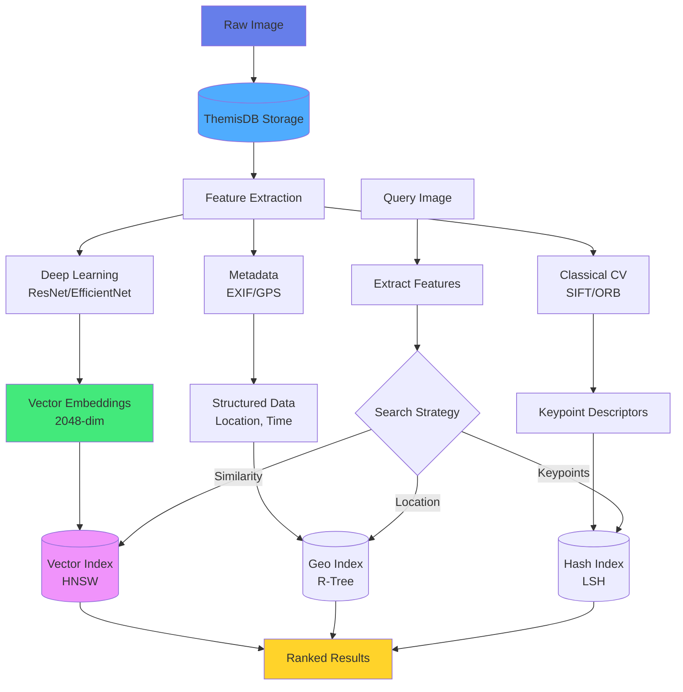

# Kapitel 12: Computer Vision & Bildanalyse

## 12.1 Einführung in Computer Vision Datenbanken

### Das Problem: Bilder sind mehr als nur Dateien

Stellen Sie sich vor, Sie haben 100.000 Drohnenbilder von einem Baugelände. Wie finden Sie:
- Alle Bilder, die ein bestimmtes Fahrzeug zeigen?
- Bilder mit Sicherheitsproblemen (fehlende Helme)?
- Ähnliche Perspektiven des gleichen Gebäudes?
- Zeitliche Entwicklung eines Bauprojekts?

Traditionelle Datenbanken speichern nur Dateinamen - **Computer Vision Datenbanken** analysieren und indexieren Bildinhalte.

### Computer Vision Use Cases

| Use Case | Datentyp | Volumen | Beispiel |
|----------|----------|---------|----------|
| Drohnen-Inspektion | Bilder + GPS + Metadata | 10K-1M | Baustellen, Infrastruktur |
| Medizinische Bildgebung | DICOM-Bilder | 100K-10M | Röntgen, MRT, CT |
| Retail Analytics | Video-Frames | 1M-100M | Kundenverhalten, Warenpräsentation |
| Autonomous Vehicles | Sensor-Fusion | 100M+ | LiDAR, Kameras, Radar |
| Satellite Imagery | Multi-Spectral Images | 1M-10M | Landnutzung, Umweltmonitoring |

### Herausforderungen

**Storage:**
- Große Dateien (2-20 MB pro Hochauflösungsbild)
- Verschiedene Formate (JPEG, PNG, TIFF, RAW)
- Metadata (EXIF, GPS, Kameraeinstellungen)

**Processing:**
- Feature-Extraktion (SIFT, ORB, Deep Learning)
- Object Detection (YOLO, Faster R-CNN)
- Image Classification (ResNet, EfficientNet)

**Retrieval:**
- Content-Based Image Retrieval (CBIR)
- Similarity Search über Visual Features
- Spatial Queries (GPS-basiert)
- Temporal Queries (Zeitreihen)



Abb. 12.1: Computer-Vision-Pipeline

## 12.2 Computer Vision Datenmodell

### Schema für Bildmetadaten

```aql
-- Bilder mit vollständigen Metadaten
CREATE TABLE images (
    image_id UUID PRIMARY KEY DEFAULT gen_random_uuid(),
    filename VARCHAR(255) NOT NULL,
    file_path TEXT NOT NULL,
    file_size_bytes BIGINT,
    format VARCHAR(20),  -- 'JPEG', 'PNG', 'TIFF', ...
    
    -- Bild-Eigenschaften
    width INTEGER,
    height INTEGER,
    bit_depth INTEGER,
    color_space VARCHAR(20),
    
    -- Aufnahme-Metadaten (EXIF)
    captured_at TIMESTAMP,
    camera_make VARCHAR(100),
    camera_model VARCHAR(100),
    focal_length_mm FLOAT,
    aperture_f_stop FLOAT,
    iso INTEGER,
    shutter_speed VARCHAR(20),
    
    -- GPS-Daten
    gps_latitude DOUBLE PRECISION,
    gps_longitude DOUBLE PRECISION,
    gps_altitude_m FLOAT,
    location GEOGRAPHY(Point, 4326),
    
    -- Kategorisierung
    category VARCHAR(100),
    tags TEXT[],
    
    -- Zusätzliche Metadaten
    metadata JSONB,
    
    -- Zeitstempel
    created_at TIMESTAMP DEFAULT NOW(),
    updated_at TIMESTAMP DEFAULT NOW()
);

-- Spatial Index für GPS-Queries
CREATE INDEX idx_images_location ON images USING GIST(location);

-- Index für zeitbasierte Queries
CREATE INDEX idx_images_captured_at ON images (captured_at DESC);

-- Full-Text Index für Tags
CREATE INDEX idx_images_tags ON images USING GIN(tags);
```

### Feature-Extraktion Tabelle

```aql
-- Visuelle Features (z.B. von CNN)
CREATE TABLE image_features (
    image_id UUID PRIMARY KEY REFERENCES images(image_id),
    
    -- Deep Learning Features (z.B. ResNet-50)
    deep_features VECTOR(2048),  -- 2048-dimensional embedding
    
    -- Classical Features
    color_histogram FLOAT[],     -- RGB histogram
    edge_features FLOAT[],       -- Edge detection features
    texture_features FLOAT[],    -- Texture descriptors
    
    -- Feature Metadata
    feature_extractor VARCHAR(100),
    extraction_timestamp TIMESTAMP DEFAULT NOW()
);

-- HNSW Index für Visual Similarity Search
CREATE INDEX idx_image_features_deep ON image_features 
USING hnsw (deep_features vector_cosine_ops)
WITH (m = 16, ef_construction = 200);
```

### Object Detection Results

```aql
-- Erkannte Objekte in Bildern
CREATE TABLE detected_objects (
    detection_id UUID PRIMARY KEY DEFAULT gen_random_uuid(),
    image_id UUID REFERENCES images(image_id),
    
    -- Objekt-Klassifikation
    object_class VARCHAR(100),
    confidence FLOAT,  -- 0.0 to 1.0
    
    -- Bounding Box
    bbox_x INTEGER,
    bbox_y INTEGER,
    bbox_width INTEGER,
    bbox_height INTEGER,
    
    -- Optional: Segmentation Mask
    segmentation_mask BYTEA,
    
    -- Detection Metadata
    detector_model VARCHAR(100),
    detection_timestamp TIMESTAMP DEFAULT NOW()
);

-- Index für Object-Search
CREATE INDEX idx_detected_objects_class ON detected_objects (object_class, confidence);
CREATE INDEX idx_detected_objects_image ON detected_objects (image_id);
```

## 12.3 Bildverarbeitung mit ThemisDB

### Bild-Upload mit Metadata-Extraktion

Die Upload-Funktion extrahiert automatisch EXIF-Metadaten aus Bildern, inkl. Kamera-Informationen, Aufnahmezeitpunkt und GPS-Koordinaten. Die GPS-Daten werden als PostGIS-Geometrie (ST_MakePoint) gespeichert, was räumliche Abfragen (z.B. "alle Bilder in 5km Radius") ermöglicht. Das System berechnet zusätzlich Perceptual Hashes für Duplikatserkennung.

**📁 Vollständiger Code:** `examples/12_computer_vision/image_upload.py` (~67 Zeilen)

**Bild-Upload mit EXIF-Extraktion** (Kernfunktionalität):

```python
from PIL import Image
from PIL.ExifTags import TAGS, GPSTAGS
import hashlib

def extract_exif(image_path):
    """Extrahiere EXIF-Daten inkl. GPS"""
    img = Image.open(image_path)
    exif_data = {}
    
    if hasattr(img, '_getexif') and img._getexif():
        exif = img._getexif()
        for tag_id, value in exif.items():
            tag = TAGS.get(tag_id, tag_id)
            exif_data[tag] = value
    
    # GPS-Koordinaten dekodieren
    gps_info = exif_data.get('GPSInfo', {})
    gps_data = {GPSTAGS.get(k, k): v for k, v in gps_info.items()}
    
    return exif_data, gps_data

def upload_image(image_path, category=None, tags=None):
    """Upload mit automatischer Metadata-Extraktion"""
    img = Image.open(image_path)
    exif_data, gps_data = extract_exif(image_path)
    
    # GPS-Koordinaten konvertieren
    latitude = convert_to_degrees(gps_data.get('GPSLatitude', []))
    longitude = convert_to_degrees(gps_data.get('GPSLongitude', []))
    
    image_data = {
        'filename': os.path.basename(image_path),
        'format': img.format,
        'width': img.width,
        'height': img.height,
        'captured_at': exif_data.get('DateTime'),
        'camera_make': exif_data.get('Make'),
        'camera_model': exif_data.get('Model'),
        'gps_latitude': latitude,
        'gps_longitude': longitude,
        'category': category,
        'tags': tags or []
    }
    
    # PostGIS-Geometrie für räumliche Abfragen
    image_id = themis.execute("""
        INSERT INTO images 
        (filename, format, width, height, captured_at, camera_make, camera_model,
         gps_latitude, gps_longitude, location, category, tags)
        VALUES (?, ?, ?, ?, ?, ?, ?, ?, ?,
                ST_SetSRID(ST_MakePoint(?, ?), 4326), ?, ?)
        RETURNING image_id
    """, tuple(image_data.values()) + (longitude, latitude))
    
    return image_id
```

**Weitere Features in vollständiger Datei:**
- GPS-Koordinaten-Konvertierung (DMS → Dezimalgrad)
- Perceptual Hash-Berechnung für Duplikatserkennung
- File-Size und Checksum-Validierung

### Feature-Extraktion mit Deep Learning

```python
import torch
import torchvision.models as models
import torchvision.transforms as transforms
from PIL import Image

# ResNet-50 für Feature-Extraktion
model = models.resnet50(pretrained=True)
model.eval()
# Entferne letzte Fully-Connected Layer
model = torch.nn.Sequential(*list(model.children())[:-1])

# Preprocessing
preprocess = transforms.Compose([
    transforms.Resize(256),
    transforms.CenterCrop(224),
    transforms.ToTensor(),
    transforms.Normalize(mean=[0.485, 0.456, 0.406], 
                       std=[0.229, 0.224, 0.225]),
])

def extract_features(image_path):
    """Extrahiere Deep Learning Features"""
    img = Image.open(image_path).convert('RGB')
    img_tensor = preprocess(img).unsqueeze(0)
    
    with torch.no_grad():
        features = model(img_tensor)
        features = features.squeeze().numpy()  # (2048,)
    
    return features

def store_features(image_id, image_path):
    """Extrahiere und speichere Features"""
    features = extract_features(image_path)
    
    themis.execute("""
        INSERT INTO image_features (image_id, deep_features, feature_extractor)
        VALUES (?, ?, 'resnet50')
        ON CONFLICT (image_id) DO UPDATE
        SET deep_features = EXCLUDED.deep_features,
            extraction_timestamp = NOW()
    """, (image_id, features.tolist()))
```

### Object Detection mit YOLO

```python
from ultralytics import YOLO

# YOLOv8 Model laden
yolo_model = YOLO('yolov8n.pt')

def detect_objects(image_path, confidence_threshold=0.5):
    """Detecte Objekte mit YOLO"""
    results = yolo_model(image_path)
    
    detections = []
    for result in results:
        boxes = result.boxes
        for box in boxes:
            if box.conf[0] >= confidence_threshold:
                detections.append({
                    'object_class': result.names[int(box.cls[0])],
                    'confidence': float(box.conf[0]),
                    'bbox_x': int(box.xyxy[0][0]),
                    'bbox_y': int(box.xyxy[0][1]),
                    'bbox_width': int(box.xyxy[0][2] - box.xyxy[0][0]),
                    'bbox_height': int(box.xyxy[0][3] - box.xyxy[0][1])
                })
    
    return detections

def store_detections(image_id, image_path):
    """Detecte und speichere Objekte"""
    detections = detect_objects(image_path)
    
    for det in detections:
        themis.execute("""
            INSERT INTO detected_objects 
            (image_id, object_class, confidence, bbox_x, bbox_y, 
             bbox_width, bbox_height, detector_model)
            VALUES (?, ?, ?, ?, ?, ?, ?, 'yolov8n')
        """, (image_id, det['object_class'], det['confidence'],
              det['bbox_x'], det['bbox_y'], 
              det['bbox_width'], det['bbox_height']))
```

## 12.4 Visual Similarity Search

### Content-Based Image Retrieval (CBIR)

```aql
-- Finde visuell ähnliche Bilder
SELECT 
    i.image_id,
    i.filename,
    i.captured_at,
    i.location,
    1 - (f.deep_features <=> :query_features) AS similarity
FROM images i
JOIN image_features f ON i.image_id = f.image_id
ORDER BY f.deep_features <=> :query_features
LIMIT 20;
```

```python
def find_similar_images(query_image_path, limit=10):
    """Finde visuell ähnliche Bilder"""
    # Features der Query extrahieren
    query_features = extract_features(query_image_path)
    
    # Similarity Search
    similar = themis.query("""
        SELECT 
            i.image_id,
            i.filename,
            i.file_path,
            i.captured_at,
            1 - (f.deep_features <=> ?) AS similarity
        FROM images i
        JOIN image_features f ON i.image_id = f.image_id
        ORDER BY f.deep_features <=> ?
        LIMIT ?
    """, (query_features.tolist(), query_features.tolist(), limit))
    
    return similar

# Beispiel
similar_images = find_similar_images('query_image.jpg', limit=10)
for img in similar_images:
    print(f"{img['filename']}: {img['similarity']:.3f}")
```

### Multi-Modal Search: Visual + Text

```aql
-- Kombiniere Visual Similarity + Text Tags
WITH visual_matches AS (
    SELECT image_id, 
           1 - (deep_features <=> :query_features) AS visual_score
    FROM image_features
    ORDER BY deep_features <=> :query_features
    LIMIT 100
),
text_matches AS (
    SELECT image_id,
           ts_rank(to_tsvector('english', array_to_string(tags, ' ')),
                   plainto_tsquery('english', :query_text)) AS text_score
    FROM images
    WHERE tags && :query_tags  -- Array overlap
)
SELECT 
    i.*,
    COALESCE(vm.visual_score, 0) * 0.7 + 
    COALESCE(tm.text_score, 0) * 0.3 AS combined_score
FROM images i
LEFT JOIN visual_matches vm ON i.image_id = vm.image_id
LEFT JOIN text_matches tm ON i.image_id = tm.image_id
WHERE vm.image_id IS NOT NULL OR tm.image_id IS NOT NULL
ORDER BY combined_score DESC
LIMIT 20;
```

## 12.5 Spatial & Temporal Queries

### GPS-basierte Suche

```aql
-- Alle Bilder in einem Radius von 1km
SELECT 
    image_id,
    filename,
    captured_at,
    gps_latitude,
    gps_longitude,
    ST_Distance(location, ST_SetSRID(ST_MakePoint(?, ?), 4326)) as distance_m
FROM images
WHERE ST_DWithin(
    location,
    ST_SetSRID(ST_MakePoint(?, ?), 4326),
    1000  -- 1000 Meter
)
ORDER BY distance_m;

-- Bilder in einem Polygon (z.B. Baugelände)
SELECT *
FROM images
WHERE ST_Within(
    location,
    ST_GeomFromText('POLYGON((
        13.404 52.520,
        13.408 52.520,
        13.408 52.518,
        13.404 52.518,
        13.404 52.520
    ))', 4326)
);
```

### Zeitliche Entwicklung

```python
def get_temporal_sequence(location, radius_m=100, 
                          start_date=None, end_date=None):
    """Hole zeitliche Bildsequenz an einem Ort"""
    query = """
        SELECT 
            image_id,
            filename,
            captured_at,
            category,
            tags,
            ST_Distance(location, ST_SetSRID(ST_MakePoint(?, ?), 4326)) as distance_m
        FROM images
        WHERE ST_DWithin(
            location,
            ST_SetSRID(ST_MakePoint(?, ?), 4326),
            ?
        )
    """
    
    params = [longitude, latitude, longitude, latitude, radius_m]
    
    if start_date:
        query += " AND captured_at >= ?"
        params.append(start_date)
    
    if end_date:
        query += " AND captured_at <= ?"
        params.append(end_date)
    
    query += " ORDER BY captured_at"
    
    return themis.query(query, tuple(params))

# Beispiel: Baustellen-Entwicklung
sequence = get_temporal_sequence(
    location=(13.405, 52.520),
    radius_m=50,
    start_date='2024-01-01',
    end_date='2024-12-31'
)
```

## 12.6 Example: Drone Image Analysis

### Überblick

Das **Drone Image Analysis** Beispiel (`examples/09_drone_image_analysis`) demonstriert eine vollständige Pipeline für Drohnenbilder-Analyse:

**Features:**
- Automatische Bild-Kategorisierung
- GPS-basierte Geo-Queries
- Feature Matching für ähnliche Bilder
- Object Detection (YOLOv8) Integration
- Flight Path Visualisierung
- Thermal Imaging Analytics

### Batch-Upload von Drohnenbildern

```python
import os
import glob
from concurrent.futures import ThreadPoolExecutor

def batch_upload_drone_images(directory, flight_id, category='construction'):
    """Batch-Upload aller Bilder aus einem Drohnenflug"""
    image_files = glob.glob(os.path.join(directory, '*.jpg'))
    print(f"Found {len(image_files)} images to process")
    
    def process_image(image_path):
        # Upload Bild
        image_id = upload_image(image_path, category=category, 
                               tags=['drone', flight_id])
        
        # Feature-Extraktion
        store_features(image_id, image_path)
        
        # Object Detection
        store_detections(image_id, image_path)
        
        return image_id
    
    # Parallel-Processing
    with ThreadPoolExecutor(max_workers=4) as executor:
        image_ids = list(executor.map(process_image, image_files))
    
    print(f"Processed {len(image_ids)} images")
    return image_ids

# Beispiel-Verwendung
flight_id = 'flight_2024_01_15_001'
image_ids = batch_upload_drone_images(
    directory='/data/drone_images/2024-01-15/',
    flight_id=flight_id,
    category='construction_site'
)
```

### Flugpfad-Rekonstruktion

```python
def reconstruct_flight_path(flight_id):
    """Rekonstruiere Flugpfad aus GPS-Daten"""
    path = themis.query("""
        SELECT 
            image_id,
            filename,
            captured_at,
            gps_latitude,
            gps_longitude,
            gps_altitude_m,
            ST_AsText(location) as location_wkt
        FROM images
        WHERE ? = ANY(tags)
        ORDER BY captured_at
    """, (flight_id,))
    
    return path

# Visualisierung mit Folium
import folium

def visualize_flight_path(flight_id):
    """Visualisiere Flugpfad auf Karte"""
    path = reconstruct_flight_path(flight_id)
    
    # Zentrum der Karte
    center_lat = sum(p['gps_latitude'] for p in path) / len(path)
    center_lon = sum(p['gps_longitude'] for p in path) / len(path)
    
    # Karte erstellen
    m = folium.Map(location=[center_lat, center_lon], zoom_start=15)
    
    # Flugpfad zeichnen
    coordinates = [(p['gps_latitude'], p['gps_longitude']) for p in path]
    folium.PolyLine(coordinates, color='red', weight=2, 
                    opacity=0.8).add_to(m)
    
    # Marker für Bilder
    for p in path:
        folium.Marker(
            location=[p['gps_latitude'], p['gps_longitude']],
            popup=f"{p['filename']}<br>Alt: {p['gps_altitude_m']}m",
            icon=folium.Icon(color='blue', icon='camera')
        ).add_to(m)
    
    m.save(f'flight_path_{flight_id}.html')
    return m

visualize_flight_path(flight_id)
```

### Automatische Anomalie-Detection

```python
def detect_safety_violations(flight_id):
    """Detecte Sicherheitsverstöße (z.B. fehlende Helme)"""
    # Finde alle Bilder mit Personen
    images_with_people = themis.query("""
        SELECT DISTINCT i.image_id, i.filename, i.file_path
        FROM images i
        JOIN detected_objects d ON i.image_id = d.image_id
        WHERE d.object_class = 'person'
          AND d.confidence > 0.7
          AND ? = ANY(i.tags)
    """, (flight_id,))
    
    violations = []
    
    for img in images_with_people:
        # Prüfe, ob Helme detectiert wurden
        helmets = themis.query("""
            SELECT COUNT(*) as helmet_count
            FROM detected_objects
            WHERE image_id = ?
              AND object_class IN ('hardhat', 'helmet')
        """, (img['image_id'],))
        
        people_count = themis.query("""
            SELECT COUNT(*) as person_count
            FROM detected_objects
            WHERE image_id = ?
              AND object_class = 'person'
        """, (img['image_id'],))
        
        if helmets[0]['helmet_count'] < people_count[0]['person_count']:
            violations.append({
                'image_id': img['image_id'],
                'filename': img['filename'],
                'issue': 'Missing hardhat',
                'people_count': people_count[0]['person_count'],
                'helmet_count': helmets[0]['helmet_count']
            })
    
    return violations

# Report generieren
violations = detect_safety_violations(flight_id)
if violations:
    print(f"⚠️  Found {len(violations)} safety violations:")
    for v in violations:
        print(f"  - {v['filename']}: {v['issue']}")
```

### Change Detection zwischen Flügen

```python
def compare_flights(flight_id_1, flight_id_2, similarity_threshold=0.85):
    """Vergleiche zwei Flüge und finde Änderungen"""
    # Hole Bilder von beiden Flügen
    images_1 = reconstruct_flight_path(flight_id_1)
    images_2 = reconstruct_flight_path(flight_id_2)
    
    changes = []
    
    for img1 in images_1:
        # Finde räumlich nächstes Bild aus Flug 2
        nearest_img2 = themis.query_one("""
            SELECT 
                i2.image_id,
                i2.filename,
                i2.captured_at,
                ST_Distance(i1.location, i2.location) as distance_m,
                1 - (f2.deep_features <=> f1.deep_features) as visual_similarity
            FROM images i1
            JOIN image_features f1 ON i1.image_id = f1.image_id
            CROSS JOIN images i2
            JOIN image_features f2 ON i2.image_id = f2.image_id
            WHERE i1.image_id = ?
              AND ? = ANY(i2.tags)
            ORDER BY ST_Distance(i1.location, i2.location)
            LIMIT 1
        """, (img1['image_id'], flight_id_2))
        
        if nearest_img2 and nearest_img2['distance_m'] < 10:  # Innerhalb 10m
            if nearest_img2['visual_similarity'] < similarity_threshold:
                changes.append({
                    'location': (img1['gps_latitude'], img1['gps_longitude']),
                    'image_1': img1['filename'],
                    'image_2': nearest_img2['filename'],
                    'similarity': nearest_img2['visual_similarity'],
                    'change_detected': True
                })
    
    return changes

# Vergleiche zwei Flüge
changes = compare_flights('flight_001', 'flight_002')
print(f"Detected {len(changes)} significant changes between flights")
```

## 12.7 Performance & Skalierung

### Thumbnail-Generierung für schnelle Preview

```python
from PIL import Image

def generate_thumbnail(image_path, size=(256, 256)):
    """Generiere Thumbnail für Preview"""
    img = Image.open(image_path)
    img.thumbnail(size, Image.LANCZOS)
    
    # Speichere Thumbnail
    thumb_path = image_path.replace('.jpg', '_thumb.jpg')
    img.save(thumb_path, 'JPEG', quality=85)
    
    # Update DB
    themis.execute("""
        UPDATE images 
        SET metadata = jsonb_set(metadata, '{thumbnail_path}', ?)
        WHERE file_path = ?
    """, (f'"{thumb_path}"', image_path))
    
    return thumb_path
```

### Lazy Loading von Features

```aql
-- Erstelle Features nur on-demand
CREATE OR REPLACE FUNCTION ensure_features(p_image_id UUID)
RETURNS BOOLEAN AS $$
BEGIN
    LET feature_exists = (
        FOR feature IN image_features 
          FILTER feature.image_id == p_image_id 
          LIMIT 1 
          RETURN 1
    )
    
    IF LENGTH(feature_exists) == 0 THEN
        -- Trigger Feature-Extraktion
        INSERT {image_id: p_image_id} INTO feature_extraction_queue;
        RETURN FALSE;
    END IF;
    RETURN TRUE;
END;
$$ LANGUAGE plpgsql;
```

### Caching für häufige Queries

```python
from functools import lru_cache
import hashlib

@lru_cache(maxsize=100)
def get_similar_images_cached(image_path_hash, limit=10):
    """Gecachte Similarity Search"""
    # ... similarity search logic
    pass

# Verwendung
image_hash = hashlib.md5(open(image_path, 'rb').read()).hexdigest()
similar = get_similar_images_cached(image_hash, limit=10)
```

## 12.8 Best Practices

### 1. Storage-Optimierung

✅ **DO:**
- Speichere nur Metadata in DB, Bilder im Object Storage (S3, MinIO)
- Generiere Thumbnails für Previews
- Nutze komprimierte Formate (JPEG für Photos, WebP für Web)

❌ **DON'T:**
- Speichere nicht alle Bilder als BYTEA in DB
- Vermeide unkomprimierte Formate (BMP, TIFF) für Archivierung
- Keine Features ohne Index

### 2. Feature-Extraktion

✅ **DO:**
- Nutze Pre-Trained Models (ResNet, EfficientNet)
- Batch-Processing für viele Bilder
- GPU-Acceleration für Deep Learning

❌ **DON'T:**
- Extrahiere Features nicht synchron beim Upload
- Vermeide Training von Modellen auf CPU
- Keine Feature-Extraktion ohne Quality-Check

### 3. Similarity Search

✅ **DO:**
- HNSW Index für große Datasets
- Kombiniere Visual + Text Search
- Pre-Filter mit Metadata (Zeit, Ort)

❌ **DON'T:**
- Keine Brute-Force Search über Millionen Bilder
- Vermeide hohe Dimensions ohne Dimensionality Reduction
- Keine Similarity ohne Normalisierung

## 12.9 Zusammenfassung

ThemisDB ermöglicht effiziente Computer Vision Anwendungen durch:

✅ **Multi-Modal Data Management:**
- Images + GPS + Features + Objects in einer DB
- Spatial + Temporal + Visual Queries
- Graph-basierte Analyse von Bild-Beziehungen

✅ **Flexible Feature-Speicherung:**
- Native VECTOR-Spalten für Embeddings
- HNSW Index für schnelle Similarity Search
- JSON für flexible Metadata

✅ **Production-Ready:**
- Skalierbare Storage (Partitionierung)
- Batch-Processing Support
- Integration mit ML-Frameworks

**Key Takeaways:**
1. Speichere Metadata in DB, Bilder in Object Storage
2. Generiere Features asynchron (Queue/Workers)
3. Nutze HNSW für Similarity Search
4. Kombiniere Visual + Spatial + Temporal Queries
5. Thumbnails für Performance

---

## 12.10 Stable Diffusion Image Generation Plugin (v2.1)

ThemisDB verfügt über ein produktionsreifes **Stable Diffusion Plugin** (`include/stable_diffusion/`, `src/stable_diffusion/`), das Text-zu-Bild- und Bild-zu-Bild-Generierung direkt in die Datenbankpipeline integriert.

### Architektur

```
IImageGenerationBackend (Interface)
    └── SDPlugin (Thread-safe Lifecycle)
            ├── ISDGenerator (Strategy)
            │       ├── SDStubGenerator   — CI / kein Modell benötigt
            │       ├── InMemorySDGenerator — Test-Double
            │       └── SDCppGenerator    — stable-diffusion.cpp (THEMIS_ENABLE_STABLE_DIFFUSION)
            └── SDPromptSanitizer — Keyword-Blocklist + content-policy
```

**Alle Pfade (Text2Img, Batch, Img2Img) werden durch einen internen `generate_mutex_` serialisiert.**

### SDPlugin — Schnellstart

```cpp
#include "stable_diffusion/sd_plugin.h"
#include "stable_diffusion/sd_config.h"

// Default-Konstruktor nutzt SDStubGenerator (kein Modell erforderlich)
themis::imggen::SDPlugin plugin;

// Initialisieren mit Modell-Pfad
nlohmann::json cfg = {
    {"width", 512}, {"height", 512}, {"steps", 20}, {"cfg_scale", 7.5}
};
plugin.initialize("/models/sd_v1.5.safetensors", cfg);

// Text-zu-Bild generieren
themis::imggen::SDGenerationConfig gen_cfg;
gen_cfg.width  = 512;
gen_cfg.height = 512;
gen_cfg.steps  = 20;
gen_cfg.seed   = -1;  // random

auto img = plugin.generate("Eine Detektiv-Noir-Szene im Regen", gen_cfg);
// img.width, img.height, img.png_bytes (vollständiges PNG)
// img.provenance: {"generation_timestamp":..., "prompt_hash":..., "plugin_version":"2.1.0"}
```

### generateBatch — Parallele Bilderzeugung

```cpp
std::vector<std::string> prompts = {
    "Sonnenuntergang über Berggipfeln",
    "Futuristische Stadtlandschaft, Neon-Lichter",
    "Aquarell-Portrait eines Roboters",
};

auto results = plugin.generateBatch(prompts, gen_cfg);
for (const auto& img : results) {
    if (img.success) {
        save_png(img.png_bytes, img.prompt_hash + ".png");
    }
}
```

Jeder Prompt wird **unabhängig** durch den `SDPromptSanitizer` gefiltert.  Blockierte Prompts ergeben ein `GeneratedImage{success=false, blocked=true}`.

### generateImg2Img — Bildkonditionierung

```cpp
#include "stable_diffusion/sd_generator.h"

themis::imggen::Img2ImgConfig img2img_cfg;
img2img_cfg.input_image_rgb = existing_image_bytes;  // RGB-Rohdaten
img2img_cfg.strength        = 0.75f;   // 0.0 = unverändertes Original, 1.0 = vollständige Neugenerierung
img2img_cfg.width  = 512;
img2img_cfg.height = 512;
img2img_cfg.steps  = 30;

auto result = plugin.generateImg2Img("Gleiche Szene, aber bei Nacht", img2img_cfg);
```

`SDStubGenerator::generateImg2Img()` gibt das Eingangsbild pass-through zurück (für CI-Tests ohne Modell).

### SDPromptSanitizer — Content Policy

Der Sanitizer blockt Prompts, die Schlüsselwörter aus einer konfigurierbaren Blocklist enthalten (case-insensitive, Datei-ladbar).  Negative Prompts unterliegen derselben Prüfung.

```yaml
stable_diffusion:
  prompt_sanitizer:
    blocklist_path: /etc/themisdb/sd_blocklist.txt
    block_negative_prompts: true  # Security-Gap SD-NP-01
```

### Provenienz-Stempel

Jedes generierte Bild erhält automatisch folgende Provenienz-Metadaten:

| Feld | Wert |
|------|------|
| `generation_timestamp` | Unix-Epoch ms |
| `prompt_hash` | SHA-256-Hex des bereinigten Prompts |
| `plugin_version` | `"2.1.0"` |

### CMake-Aktivierung

```cmake
# Mit echtem stable-diffusion.cpp Modell
cmake -DTHEMIS_ENABLE_STABLE_DIFFUSION=ON ..

# Ohne Modell (Stub-Modus, Standard für CI)
cmake ..
```

### Kennzahlen und Monitoring

```cpp
auto stats = plugin.getStatistics();
// stats["total_generated"]   — Gesamtzahl erfolgreicher Generierungen
// stats["total_blocked"]     — Abgelehnte Prompts (content policy)
// stats["total_errors"]      — Fehlgeschlagene Inferenz-Aufrufe
// stats["plugin_version"]    — "2.1.0"
```
