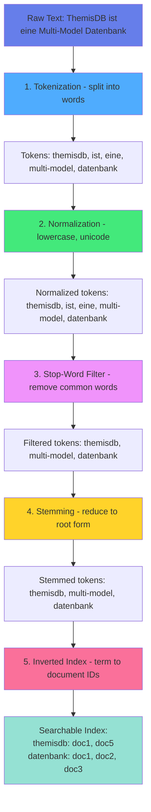

# Kapitel 13: Volltext-Suche & NLP

## Einführung

Die Volltext-Suche ist eine der fundamentalen Anforderungen moderner Anwendungen. Ob E-Commerce-Produktsuche, Dokumentenverwaltung oder Content-Management - Nutzer erwarten relevante, schnelle Suchergebnisse. ThemisDB bietet native Volltext-Funktionalität, die nahtlos mit anderen Datenmodellen integriert ist.

In diesem Kapitel behandeln wir:

- **Grundlagen der Volltext-Suche:** Tokenisierung, Stemming, Stop-Words
- **ThemisDB Fulltext-Indexe:** Konfiguration und Optimierung
- **Erweiterte Suchfunktionen:** Wildcards, Phrasensuche, Fuzzy Search
- **NLP-Integration:** Sentiment-Analyse, Entity-Erkennung, Sprachverarbeitung
- **Best Practices:** Performance, Relevanz-Ranking, mehrsprachige Suche

### Warum ist Volltext-Suche wichtig?

**Problem der einfachen String-Suche:**

```aql
-- Ineffizient: Keine Relevanz, langsam bei großen Datensätzen
FOR article IN articles
  FILTER LIKE(article.title, '%database%') OR LIKE(article.content, '%database%')
  RETURN article
```

Probleme:
- Keine Wort-Trennung (findet "database" nicht in "databases")
- Keine Relevanz-Bewertung
- Performance-Probleme (Full Table Scan)
- Keine sprachliche Verarbeitung

**Lösung mit Volltext-Index:**

```aql
-- Schnell, relevant, sprachlich intelligent
FOR article IN articles
  FILTER FULLTEXT(article.title, 'database') OR FULLTEXT(article.content, 'database')
  LET score = FULLTEXT_SCORE(article)
  SORT score DESC
  RETURN {article, score}
```

Vorteile:
- ✅ Automatische Wort-Erkennung und Stammformbildung
- ✅ Relevanz-Ranking (TF-IDF, BM25)
- ✅ Sehr performant durch invertierte Indizes
- ✅ Sprachliche Features (Stop-Words, Synonyme)

---

## Grundlagen der Volltext-Suche

### Text-Verarbeitung Pipeline

Die Volltext-Suche durchläuft mehrere Verarbeitungsschritte:

**1. Tokenisierung**

Zerlegt Text in einzelne Wörter (Tokens):

```
"ThemisDB ist eine Multi-Model Datenbank"
↓
["ThemisDB", "ist", "eine", "Multi-Model", "Datenbank"]
```

**2. Normalisierung**

Konvertiert Tokens in Grundform:

```
["ThemisDB", "ist", "eine", "Multi-Model", "Datenbank"]
↓
["themisdb", "ist", "eine", "multi-model", "datenbank"]  # Lowercase
```

**3. Stop-Word-Filterung**

Entfernt häufige, nicht-informative Wörter:

```
["themisdb", "ist", "eine", "multi-model", "datenbank"]
↓
["themisdb", "multi-model", "datenbank"]  # "ist", "eine" entfernt
```

**4. Stemming**

Reduziert Wörter auf Wortstamm:

```
["Datenbanken", "Datenbank", "Datenbankserver"]
↓
["datenbank", "datenbank", "datenbankserv"]  # Gemeinsamer Stamm
```



Abb. 13.1: Fulltext-Search-Indexierung

**5. Index-Erstellung**

Erstellt inverted index für schnelle Suche:

```
Token        → Dokument-IDs
"themisdb"   → [1, 5, 12, 89]
"datenbank"  → [1, 2, 5, 12, 34, 89]
"multi-model"→ [1, 12]
```

### Relevanz-Ranking Algorithmen

**TF-IDF (Term Frequency - Inverse Document Frequency)**

Bewertet Relevanz basierend auf:
- **TF:** Wie oft erscheint der Begriff im Dokument?
- **IDF:** Wie selten ist der Begriff im gesamten Korpus?

```
TF-IDF = TF × IDF
TF = (Anzahl Begriff in Dokument) / (Gesamtzahl Wörter in Dokument)
IDF = log(Gesamtanzahl Dokumente / Anzahl Dokumente mit Begriff)
```

**Beispiel:**

Dokument: "ThemisDB ist eine Datenbank. ThemisDB unterstützt Multi-Model."
Suchbegriff: "ThemisDB"

```
TF = 2 / 8 = 0.25  (2× "ThemisDB", 8 Wörter gesamt)
IDF = log(10000 / 100) = 2  (100 von 10000 Dokumenten enthalten "ThemisDB")
TF-IDF = 0.25 × 2 = 0.5
```

**BM25 (Best Matching 25)**

Verbessertes Ranking-Modell mit Sättigungsfunktion:

```
BM25 = IDF × (TF × (k1 + 1)) / (TF + k1 × (1 - b + b × (docLen / avgDocLen)))
```

Parameter:
- **k1:** Sättigung für Term-Frequenz (typisch 1.2-2.0)
- **b:** Dokumentlängen-Normalisierung (typisch 0.75)

Vorteil: Verhindert, dass sehr lange Dokumente überproportional hohe Scores bekommen.

---

## Volltext-Indexe in ThemisDB

### Index erstellen

**Einfacher Fulltext-Index:**

```aql
CREATE FULLTEXT INDEX idx_articles_content 
ON articles (title, content);
```

**Mit Konfiguration:**

```aql
CREATE FULLTEXT INDEX idx_articles_content 
ON articles (title, content)
WITH (
  analyzer = 'german',           -- Sprach-Analyzer
  stopwords = ['der', 'die', 'das'],  -- Custom Stop-Words
  min_word_length = 3,           -- Minimale Wortlänge
  max_word_length = 50,          -- Maximale Wortlänge
  case_sensitive = false,        -- Groß-/Kleinschreibung
  stemming = true                -- Stammform-Reduktion
);
```

**Gewichtete Felder:**

```aql
CREATE FULLTEXT INDEX idx_articles_weighted 
ON articles (
  title WEIGHT 3.0,      -- Titel 3× wichtiger
  abstract WEIGHT 2.0,   -- Abstract 2× wichtiger
  content WEIGHT 1.0     -- Content normale Gewichtung
);
```

### Suchen mit Volltext-Index

**Einfache Suche:**

```aql
FOR article IN articles
  FILTER FULLTEXT(article, 'database systems')
  RETURN article
```

**Mit Relevanz-Score:**

```aql
FOR article IN articles
  FILTER FULLTEXT(article, 'database systems')
  LET relevance = FULLTEXT_SCORE(article)
  SORT relevance DESC
  LIMIT 10
  RETURN {
    id: article.id,
    title: article.title,
    relevance
  }
```

**Mehrere Begriffe (AND):**

```aql
-- Alle Begriffe müssen vorkommen
WHERE FULLTEXT_MATCH(articles, 'database AND multi-model');
```

**Alternative Begriffe (OR):**

```aql
-- Mindestens ein Begriff muss vorkommen
WHERE FULLTEXT_MATCH(articles, 'database OR nosql');
```

**Ausschluss (NOT):**

```aql
-- Enthält "database" aber nicht "relational"
WHERE FULLTEXT_MATCH(articles, 'database NOT relational');
```

**Phrasensuche:**

```aql
-- Exakte Phrase in Anführungszeichen
WHERE FULLTEXT_MATCH(articles, '"multi-model database"');
```

**Wildcard-Suche:**

```aql
-- * für beliebige Zeichen
WHERE FULLTEXT_MATCH(articles, 'data*');  -- Findet "database", "dataset", etc.
```

**Fuzzy-Suche (Rechtschreibfehler):**

```aql
-- ~ für Fuzzy-Match (Levenshtein-Distanz)
WHERE FULLTEXT_MATCH(articles, 'databse~');  -- Findet "database" trotz Fehler
```

### Feld-spezifische Suche

**Nur in bestimmten Feldern suchen:**

```aql
FOR article IN articles
  FILTER FULLTEXT(article.title, 'database') AND FULLTEXT(article.content, 'nosql')
  RETURN article
```

**Kombinierte Suche:**

```aql
FOR article IN articles
  FILTER (FULLTEXT(article.title, 'multi-model') OR FULLTEXT(article.content, 'vector'))
    AND article.category == 'technology'  -- Zusätzliche Filter kombinierbar
  RETURN article
```

---

## Erweiterte Suchfunktionen

### Highlighting

Markiert Suchbegriffe in Ergebnissen:

```aql
FOR article IN articles
  FILTER FULLTEXT(article, 'database')
  LIMIT 10
  RETURN {
    id: article.id,
    title: article.title,
    snippet: FULLTEXT_HIGHLIGHT(article.content, 'database', '<mark>', '</mark>')
  }
```

Ergebnis:
```
"... ThemisDB ist eine <mark>database</mark> für Multi-Model Daten ..."
```

**Snippet-Extraktion:**

```aql
FOR article IN articles
  FILTER FULLTEXT(article, 'database')
  RETURN {
    id: article.id,
    title: article.title,
    snippet: FULLTEXT_SNIPPET(article.content, 'database', 50, 200)
  }
```

Extrahiert 200 Zeichen um den Suchbegriff herum (50 Zeichen vor, 150 nach).

### Auto-Complete / Suggest

**Präfix-Suche für Auto-Complete:**

```aql
-- Findet alle Artikel, die mit "dat" beginnen
FOR article IN articles
  LET suggestion = FULLTEXT_TERMS(article, 'dat*')
  FILTER suggestion != null
  LIMIT 10
  RETURN DISTINCT suggestion
```

Ergebnis:
```
["database", "data", "dataset", "dataflow"]
```

**Häufigkeits-basierte Vorschläge:**

```aql
FOR article IN articles
  LET term = FULLTEXT_TERMS(article, 'dat*')
  FILTER term != null
  COLLECT termValue = term
  AGGREGATE frequency = COUNT()
  SORT frequency DESC
  LIMIT 10
  RETURN {term: termValue, frequency}
```

### Faceted Search

Kombiniert Volltext mit Facetten:

```aql
FOR article IN articles
  FILTER FULLTEXT(article, 'database')
  COLLECT category = article.category
  AGGREGATE count = COUNT()
  RETURN {category, count}
```

Ergebnis:
```
category        | count
----------------|------
Technology      | 45
Science         | 23
Business        | 12
```

**Komplexe Facetten-Abfrage:**

```aql
LET results = (
  FOR article IN articles
    FILTER FULLTEXT(article, 'database')
    RETURN article
)

FOR r IN results
    FILTER FULLTEXT(r, 'database')
    RETURN r
)

FOR result IN results
  COLLECT category = result.category
  AGGREGATE 
    count = COUNT(),
    avg_relevance = AVG(FULLTEXT_SCORE(result))
  SORT count DESC
  RETURN {category, count, avg_relevance}
```

---

## NLP-Integration

### Sentiment-Analyse

Analysiert Stimmung/Emotion in Texten.

**Python Integration mit TextBlob:**

```python
from themisdb import ThemisDB
from textblob import TextBlob

db = ThemisDB()

# Reviews aus Datenbank laden
reviews = db.query("""
    FOR review IN product_reviews
      RETURN {id: review.id, text: review.text}
""")

for review in reviews:
    # Sentiment-Analyse
    blob = TextBlob(review['text'])
    sentiment = blob.sentiment.polarity  # -1 (negativ) bis +1 (positiv)
    
    # Sentiment in DB speichern
    db.query("""
        FOR review IN product_reviews
          FILTER review.id == @review_id
          UPDATE review WITH {sentiment_score: @sentiment} IN product_reviews
    """, {"sentiment": sentiment, "review_id": review['id']})

# Aggregierte Sentiment-Analyse
avg_sentiment = db.query("""
    FOR review IN product_reviews
      COLLECT product_id = review.product_id
      AGGREGATE 
        avg_sentiment = AVG(review.sentiment_score),
        review_count = COUNT()
      FILTER review_count >= 10
      SORT avg_sentiment DESC
      RETURN {product_id, avg_sentiment, review_count}
""")
```

**Sentiment-Kategorien:**

```python
def categorize_sentiment(score):
    if score >= 0.5:
        return "sehr positiv"
    elif score >= 0.1:
        return "positiv"
    elif score >= -0.1:
        return "neutral"
    elif score >= -0.5:
        return "negativ"
    else:
        return "sehr negativ"

# Sentiment-Kategorien in DB
db.query("""
    ALTER TABLE product_reviews 
    ADD COLUMN sentiment_category VARCHAR(20)
""")

for review in reviews:
    category = categorize_sentiment(review['sentiment_score'])
    db.query("""
        UPDATE product_reviews
        SET sentiment_category = ?
        WHERE id = ?
    """, [category, review['id']])
```

### Named Entity Recognition (NER)

Erkennt Entitäten wie Personen, Orte, Organisationen.

**Mit spaCy:**

```python
import spacy
from themisdb import ThemisDB

# Deutsches Sprachmodell laden
nlp = spacy.load("de_core_news_md")
db = ThemisDB()

# Artikel analysieren
articles = db.query("SELECT id, content FROM articles")

for article in articles:
    doc = nlp(article['content'])
    
    # Entitäten extrahieren
    entities = []
    for ent in doc.ents:
        entities.append({
            'text': ent.text,
            'label': ent.label_,  # PER, LOC, ORG, etc.
            'start': ent.start_char,
            'end': ent.end_char
        })
    
    # Entitäten als JSON speichern
    db.query("""
        UPDATE articles
        SET entities = ?
        WHERE id = ?
    """, [json.dumps(entities), article['id']])

# Suche nach Artikeln über bestimmte Person
db.query("""
    SELECT * FROM articles
    WHERE JSON_CONTAINS(entities, '$.text', 'Angela Merkel')
""")
```

**Entity-Linking:**

```python
# Verlinke Entitäten mit Stammdaten
def link_entities(article_id, entities):
    for ent in entities:
        if ent['label'] == 'PER':  # Person
            # Suche Person in DB
            person = db.query("""
                SELECT id FROM persons
                WHERE name = ? OR aliases LIKE ?
            """, [ent['text'], f"%{ent['text']}%"])
            
            if person:
                # Verknüpfung erstellen
                db.query("""
                    INSERT INTO article_person_mentions
                    (article_id, person_id, mention_text)
                    VALUES (?, ?, ?)
                """, [article_id, person[0]['id'], ent['text']])
```

### Text-Klassifikation

Die automatische Kategorisierung von Texten kombiniert ThemisDB's Fulltext-Suche mit Machine Learning. Das System lädt bereits kategorisierte Artikel als Trainingsdaten, extrahiert TF-IDF Features und trainiert einen Naive Bayes Klassifikator. Neue unkategorisierte Artikel werden dann automatisch mit Confidence-Score versehen.

📁 **Vollständiger Code:** `examples/13_fulltext_search/text_classification.py` (~70 Zeilen)

**Training und Klassifikation:**

```python
from sklearn.feature_extraction.text import TfidfVectorizer
from sklearn.naive_bayes import MultinomialNB
from sklearn.pipeline import Pipeline

# Training-Daten aus ThemisDB laden
training_data = db.query("""
    SELECT content, category FROM articles WHERE category IS NOT NULL
""")

X_train = [row['content'] for row in training_data]
y_train = [row['category'] for row in training_data]

# Pipeline: TF-IDF (5000 Features) + Naive Bayes
classifier = Pipeline([
    ('vectorizer', TfidfVectorizer(max_features=5000)),
    ('classifier', MultinomialNB())
])
classifier.fit(X_train, y_train)

# Neue Artikel klassifizieren mit Confidence-Score
new_articles = db.query("""SELECT id, content FROM articles WHERE category IS NULL""")

for article in new_articles:
    predicted_category = classifier.predict([article['content']])[0]
    confidence = max(classifier.predict_proba([article['content']])[0])  # Max probability
    
    db.query("""
        UPDATE articles SET category = ?, category_confidence = ? WHERE id = ?
    """, [predicted_category, confidence, article['id']])
```

**Vorteile:**
- Integration mit ThemisDB Fulltext-Indizes
- Confidence-Score für manuelle Review bei niedrigen Werten (<0.7)
- TF-IDF mit 5000 Features für gute Balance zwischen Genauigkeit und Performance
- Naive Bayes: Schnell, robust bei kleinen Trainingssets

### Keyword-Extraktion

Extrahiert wichtige Schlüsselwörter aus Texten.

**Mit YAKE (Yet Another Keyword Extractor):**

```python
import yake
from themisdb import ThemisDB

db = ThemisDB()

# YAKE Keyword Extractor
kw_extractor = yake.KeywordExtractor(
    lan="de",          # Sprache
    n=3,               # Maximale N-Gram Länge
    dedupLim=0.9,      # Deduplizierung
    top=10,            # Top 10 Keywords
    features=None
)

articles = db.query("SELECT id, title, content FROM articles")

for article in articles:
    text = article['title'] + " " + article['content']
    keywords = kw_extractor.extract_keywords(text)
    
    # Keywords als Liste speichern
    keyword_list = [kw[0] for kw in keywords]
    
    db.query("""
        UPDATE articles
        SET keywords = ?
        WHERE id = ?
    """, [json.dumps(keyword_list), article['id']])

# Suche über Keywords
db.query("""
    SELECT * FROM articles
    WHERE JSON_CONTAINS(keywords, ?, '$')
""", ["Multi-Model"])
```

---

## Mehrsprachige Suche

### Language Detection

Automatische Spracherkennung:

```python
from langdetect import detect
from themisdb import ThemisDB

db = ThemisDB()

articles = db.query("SELECT id, content FROM articles")

for article in articles:
    try:
        language = detect(article['content'])
        db.query("""
            UPDATE articles
            SET language = ?
            WHERE id = ?
        """, [language, article['id']])
    except:
        # Fallback bei Fehler
        db.query("""
            UPDATE articles
            SET language = 'unknown'
            WHERE id = ?
        """, [article['id']])
```

### Sprachspezifische Indexe

**Separate Indexe pro Sprache:**

```aql
-- Deutscher Index
CREATE FULLTEXT INDEX idx_articles_de 
ON articles (content)
WHERE language = 'de'
WITH (analyzer = 'german');

-- Englischer Index
CREATE FULLTEXT INDEX idx_articles_en 
ON articles (content)
WHERE language = 'en'
WITH (analyzer = 'english');

-- Französischer Index
CREATE FULLTEXT INDEX idx_articles_fr 
ON articles (content)
WHERE language = 'fr'
WITH (analyzer = 'french');
```

**Sprachabhängige Suche:**

```aql
-- Automatische Sprachwahl basierend auf Nutzer-Präferenz
SELECT * FROM articles
WHERE language = 'de' 
  AND FULLTEXT_MATCH(articles, 'Datenbank')
ORDER BY FULLTEXT_SCORE(articles) DESC;
```

### Translation-Aware Search

Suche über Übersetzungen hinweg:

```python
from googletrans import Translator
from themisdb import ThemisDB

translator = Translator()
db = ThemisDB()

def multilingual_search(query, target_languages=['en', 'de', 'fr']):
    results = []
    
    for lang in target_languages:
        # Query in Zielsprache übersetzen
        if lang != 'de':  # Annahme: Query ist deutsch
            translated_query = translator.translate(query, dest=lang).text
        else:
            translated_query = query
        
        # Suche in entsprechender Sprache
        lang_results = db.query("""
            SELECT *, ? as search_language
            FROM articles
            WHERE language = ? 
              AND FULLTEXT_MATCH(articles, ?)
            ORDER BY FULLTEXT_SCORE(articles) DESC
            LIMIT 10
        """, [lang, lang, translated_query])
        
        results.extend(lang_results)
    
    return results

# Beispiel: Suche nach "Datenbank" in allen Sprachen
results = multilingual_search("Datenbank")
```

---

## Performance-Optimierung

### Index-Tuning

**Analyse der Index-Nutzung:**

```aql
-- Index-Statistiken anzeigen
SHOW INDEX STATS idx_articles_content;
```

Ergebnis:
```
total_documents: 125000
total_terms: 2500000
avg_terms_per_doc: 20
index_size_mb: 45.2
last_update: 2024-12-28 10:30:00
```

**Selective Indexing:**

```aql
-- Nur wichtige Felder indizieren
CREATE FULLTEXT INDEX idx_articles_selective 
ON articles (title, abstract)  -- Nicht "content" für Performance
WHERE status = 'published';    -- Nur veröffentlichte Artikel
```

**Partial Index für häufige Queries:**

```aql
-- Index nur für aktuelle Artikel
CREATE FULLTEXT INDEX idx_articles_recent 
ON articles (title, content)
WHERE created_at > NOW() - INTERVAL '30 days';
```

### Query-Optimierung

**Avoid Wildcards am Anfang:**

```aql
-- LANGSAM: Wildcard am Anfang
WHERE FULLTEXT_MATCH(articles, '*base');

-- SCHNELL: Wildcard am Ende
WHERE FULLTEXT_MATCH(articles, 'data*');
```

**Limit Fuzzy Search:**

```aql
-- LANGSAM: Fuzzy auf allen Begriffen
WHERE FULLTEXT_MATCH(articles, 'databse~ systm~');

-- SCHNELL: Fuzzy nur wo nötig
WHERE FULLTEXT_MATCH(articles, 'database systm~');
```

**Use Score Threshold:**

```aql
-- Filtere irrelevante Ergebnisse
SELECT * FROM articles
WHERE FULLTEXT_MATCH(articles, 'database')
  AND FULLTEXT_SCORE(articles) > 0.5  -- Nur relevante Treffer
ORDER BY FULLTEXT_SCORE(articles) DESC
LIMIT 20;
```

### Caching-Strategien

**Query-Result-Cache:**

```python
from functools import lru_cache
from themisdb import ThemisDB

db = ThemisDB()

@lru_cache(maxsize=1000)
def cached_search(query, limit=20):
    return db.query("""
        SELECT * FROM articles
        WHERE FULLTEXT_MATCH(articles, ?)
        ORDER BY FULLTEXT_SCORE(articles) DESC
        LIMIT ?
    """, [query, limit])

# Wiederholte Suchen verwenden Cache
results1 = cached_search("database")  # DB-Query
results2 = cached_search("database")  # Aus Cache
```

**Index-Warm-Up:**

```aql
-- Index vorwärmen nach Restart
SELECT COUNT(*) FROM articles
WHERE FULLTEXT_MATCH(articles, 'a');  -- Häufiger Buchstabe
```

---

## Best Practices

### 1. Index-Design

✅ **DO:**
- Indiziere nur durchsuchbare Felder
- Verwende gewichtete Felder (Titel wichtiger als Content)
- Nutze sprachspezifische Analyzer
- Implementiere Partial Indexes für große Tabellen

❌ **DON'T:**
- Alle Felder blindlings indizieren
- Binärdaten oder IDs indizieren
- Stop-Words komplett entfernen (bei Phrasensuche wichtig)
- Zu aggressive Stemming-Regeln

### 2. Query-Patterns

✅ **DO:**
- Kombiniere Volltext mit strukturierten Filtern
- Verwende Relevanz-Ranking
- Implementiere Pagination für große Result-Sets
- Cache häufige Queries

❌ **DON'T:**
- Wildcard-Suchen am Anfang (*word)
- Zu komplexe Boolean-Queries
- Uneingeschränkte Fuzzy-Searches
- Volltext-Suche für exakte Matches (verwende =)

### 3. User Experience

✅ **DO:**
- Auto-Complete für bessere UX
- Highlight Suchbegriffe in Ergebnissen
- Zeige Relevanz-Score an
- Implementiere "Did you mean?" für Tippfehler

❌ **DON'T:**
- Keine Ergebnisse ohne Alternative
- Zu viele Ergebnisse ohne Ranking
- Langsame Suche ohne Loading-Indicator
- Keine Filteroptionen

### 4. Wartung

✅ **DO:**
- Regelmäßige Index-Optimierung
- Monitoring der Query-Performance
- Analyse beliebter Suchbegriffe
- A/B-Testing verschiedener Ranking-Algorithmen

❌ **DON'T:**
- Index-Fragmentierung ignorieren
- Keine Metriken erfassen
- Statische Ranking-Gewichte
- Keine User-Feedback-Integration

---

## Zusammenfassung

Volltext-Suche ist essentiell für moderne Anwendungen:

**Kernkonzepte:**
- ✅ Invertierte Indexe für schnelle Suche
- ✅ TF-IDF / BM25 für Relevanz-Ranking
- ✅ Sprachverarbeitung (Stemming, Stop-Words)
- ✅ Boolean-Operatoren (AND, OR, NOT)
- ✅ Erweiterte Features (Fuzzy, Wildcards, Phrases)

**NLP-Integration:**
- ✅ Sentiment-Analyse für Meinungen
- ✅ Named Entity Recognition für Entitäten
- ✅ Text-Klassifikation für Auto-Tagging
- ✅ Keyword-Extraktion für Zusammenfassungen

**Performance:**
- ✅ Selective Indexing
- ✅ Query-Optimierung
- ✅ Caching-Strategien
- ✅ Index-Wartung

ThemisDB bietet native Volltext-Funktionalität, die nahtlos mit anderen Datenmodellen kombiniert werden kann - für leistungsstarke, flexible Suchlösungen.

Im nächsten Kapitel behandeln wir **Geo-Spatial Features** - für standortbasierte Anwendungen und räumliche Analysen.

---

## Übungsaufgaben

**Aufgabe 1:** Erstellen Sie einen gewichteten Volltext-Index für eine Nachrichten-Tabelle (Titel 3×, Teaser 2×, Content 1×).

**Aufgabe 2:** Implementieren Sie eine Auto-Complete-Funktion mit Präfix-Suche und Häufigkeits-Ranking.

**Aufgabe 3:** Integrieren Sie Sentiment-Analyse für Produkt-Reviews und berechnen Sie durchschnittliche Sentiment-Scores.

**Aufgabe 4:** Erstellen Sie eine mehrsprachige Suche mit automatischer Language-Detection und sprachspezifischen Indexen.

**Aufgabe 5:** Optimieren Sie eine langsame Volltext-Query durch Analyse der Index-Statistiken und Query-Rewriting.

---

## 13.12 Search-Modul — Erweiterte C++ API (v2.4)

Das Search-Modul (`include/search/`, `src/search/`) implementiert Hybrid-Suche (BM25 + Vector RRF), verteilte Sharding-Suche, Konversationssuche, Federated Search, Cursor-Streaming, Highlight/Snippet-Generierung und Learning-to-Rank.

### 13.12.1 HybridSearch — BM25 + Vector RRF Fusion

```cpp
#include "search/hybrid_search.h"

themis::search::HybridSearch::Config cfg;
cfg.bm25_weight      = 0.4;
cfg.vector_weight    = 0.6;
cfg.k                = 20;           // Finale Ergebnisse
cfg.k_bm25           = 100;          // BM25 Kandidaten
cfg.k_vector         = 100;          // Vektor-Kandidaten
cfg.use_rrf          = true;
cfg.rrf_k            = 60.0;         // RRF-Konstante
cfg.normalize_scores = true;

themis::search::HybridSearch search(&fulltext_index, &vector_index, cfg);

auto [results, stats] = search.search("BPMN workflow optimization", query_vec);
// results[i].document_id, results[i].hybrid_score
// results[i].bm25_score, results[i].vector_score, results[i].content
// stats.bm25_ok, stats.vector_ok, stats.partial_result
```

### 13.12.2 DistributedHybridSearch — Shard-übergreifende Suche

```cpp
#include "search/distributed_hybrid_search.h"

themis::search::DistributedHybridSearch::Config dist_cfg;
dist_cfg.k                    = 20;
dist_cfg.rrf_k                = 60.0;
dist_cfg.shard_timeout_ms     = 5000;
dist_cfg.max_concurrent_shards = 10;
dist_cfg.skip_failed_shards   = true;   // degradierter Modus bei Shard-Fehler
dist_cfg.local_shard_id       = "shard-0";
dist_cfg.search_endpoint      = "/search/hybrid";

// Shard-Endpunkte registrieren (mTLS gesichert)
themis::search::DistributedHybridSearch dist_search(
    local_hybrid_search, shard_clients, dist_cfg
);

auto [merged_results, dist_stats] = dist_search.search("Baurecht §34", query_vec);
// dist_stats.shards_queried, .shards_succeeded, .shards_failed, .partial_result
```

### 13.12.3 SearchHighlighter und SearchResultStream

```cpp
#include "search/search_highlighter.h"
#include "search/search_result_stream.h"

// ── Highlight + Snippet ───────────────────────────────────────────────
themis::search::SearchHighlighter::Config hl_cfg;
hl_cfg.highlight_open  = "<mark>";
hl_cfg.highlight_close = "</mark>";
hl_cfg.max_snippet_len = 300;

themis::search::SearchHighlighter highlighter(hl_cfg);

std::string highlighted = highlighter.highlight(doc_text, { "workflow", "BPMN" });
std::string snippet     = highlighter.snippet(doc_text, { "workflow", "BPMN" });

// ── Cursor-basiertes Streaming (große Ergebnismengen) ────────────────
themis::search::SearchResultStream::Config stream_cfg;
stream_cfg.total_k   = 1000;
stream_cfg.page_size = 100;

themis::search::SearchResultStream result_stream(&hybrid_search, stream_cfg);
result_stream.open("BPMN optimization", query_vec);

while (result_stream.hasMore()) {
    auto page = result_stream.nextPage();
    for (auto& r : page) { /* verarbeiten */ }
}
```

### 13.12.4 ConversationalSearch — Multi-Turn Kontext

```cpp
#include "search/conversational_search.h"

themis::search::ConversationalSearch::Config conv_cfg;
conv_cfg.context_window = 3;    // Letzte 3 Turns als Kontext
conv_cfg.max_history    = 50;

themis::search::ConversationalSearch conv_search(&hybrid_search, conv_cfg);

// Turn 1
auto [r1, t1] = conv_search.search("Was ist BPMN?", vec1);
// Turn 2 — automatische Kontext-Anreicherung: "Was ist BPMN? Gateways ..."
auto [r2, t2] = conv_search.search("Erkläre Gateways", vec2);
// t2.reformulated_query: kontextangereicherte Query

conv_search.clearHistory();  // Neue Sitzung
```
