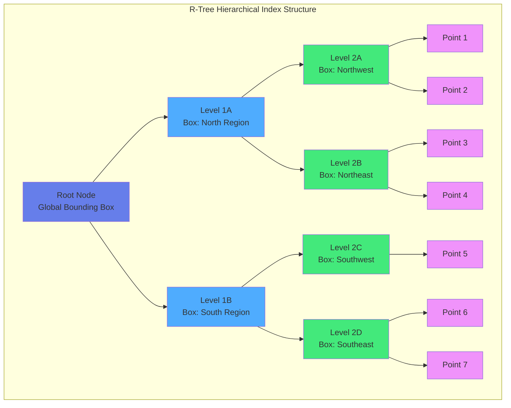
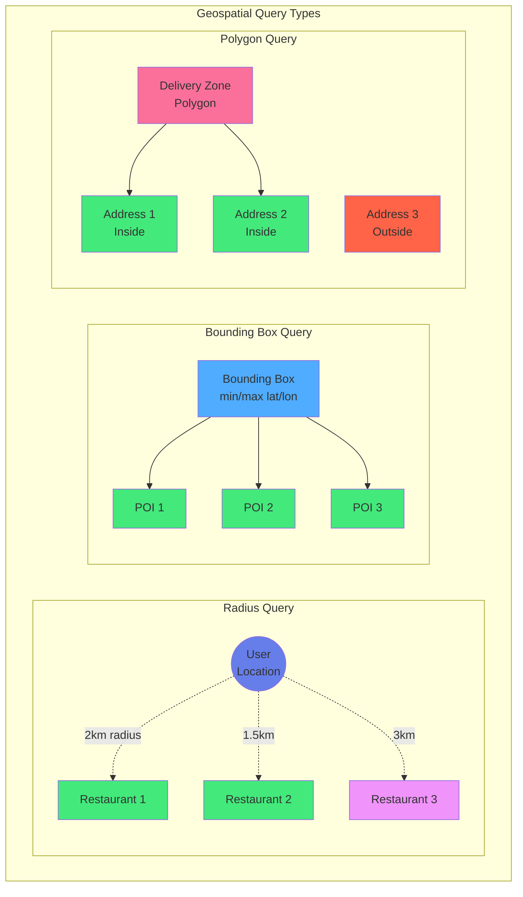

# Kapitel 14: Geo-Spatial Features

## Einleitung

Standortbasierte Dienste sind aus modernen Anwendungen nicht mehr wegzudenken. Von Lieferdiensten über Immobiliensuche bis zu Flottenmanagement – geografische Daten spielen eine zentrale Rolle. ThemisDB bietet native Unterstützung für Geo-Spatial Daten mit effizienten räumlichen Indizes und umfangreichen Abfragefunktionen.

In diesem Kapitel lernen Sie:
- Geo-Datentypen und Koordinatensysteme
- Räumliche Indizes (R-Tree, Geo-Hash)
- Location-Based Queries (Radius, Bounding Box, Polygon)
- Integration von GPS-Tracking und Kartendiensten
- Best Practices für Geo-Anwendungen

## 14.1 Grundlagen der Geo-Spatial Daten

### Koordinatensysteme

ThemisDB verwendet das WGS84-Koordinatensystem (EPSG:4326), das auch GPS verwendet:

```python
# Koordinaten als [longitude, latitude]
berlin_coordinates = [13.405, 52.520]
munich_coordinates = [11.575, 48.137]

# WICHTIG: Longitude (Längengrad) kommt zuerst!
# Longitude: -180 bis +180 (West/Ost)
# Latitude: -90 bis +90 (Süd/Nord)
```

### Geo-Datentypen in ThemisDB

```aql
// Point: Einzelner Punkt
FOR loc IN [
  {
    _key: "loc1",
    name: "Berlin Mitte",
    coordinates: [13.4050, 52.5200],  // [lon, lat]
    created_at: DATE_ISO8601(DATE_NOW())
  }
] INSERT loc INTO locations

-- Geo-Index erstellen
CREATE INDEX idx_geo_locations 
  ON locations (coordinates) 
  TYPE GEO

// LineString: Verbundene Punkte (Routen)
FOR route IN [
  {
    _key: "route1",
    name: "Tour A",
    path: [
      [13.377, 52.516],  // Start
      [13.390, 52.520],  // Waypoint 1
      [13.405, 52.520]   // End
    ],
    distance_km: 2.8
  }
] INSERT route INTO routes

// Polygon: Geschlossene Fläche (Delivery Zones)
FOR zone IN [
  {
    _key: "zone1",
    name: "Zone Nord",
    area: [
      [13.35, 52.54],
      [13.42, 52.54],
      [13.42, 52.50],
      [13.35, 52.50],
      [13.35, 52.54]  // Geschlossen
    ],
    active: true
  }
] INSERT zone INTO delivery_zones
```

## 14.2 Geo-Spatial Indizes

### R-Tree Index

R-Trees sind die effizienteste Indexstruktur für räumliche Daten:

```aql
-- Geo-Index erstellen
CREATE INDEX idx_locations_geo ON locations USING RTREE(coordinates);

-- Automatische Nutzung bei räumlichen Queries
FOR location IN locations 
  FILTER ST_Distance(location.coordinates, POINT(13.405, 52.520)) < 5000
  RETURN location
-- Index wird automatisch genutzt!
```

**R-Tree Eigenschaften:**
- Organisiert Punkte in hierarchischen Bounding Boxes
- O(log n) Suchzeit für Bereichsabfragen
- Automatische Rebalancierung bei Updates
- Optimiert für Nearest-Neighbor Queries



Abb. 14.1: Geospatial-Index-Struktur

### Geo-Hash Index

Für weltweite Abdeckung und Präfix-Suche:

```aql
CREATE INDEX idx_locations_geohash ON locations USING GEOHASH(coordinates);

-- Nützlich für:
-- - Clustering auf Karten
-- - Hierarchische Zoomlevel
-- - Verteilte Systeme (Sharding nach Geo-Hash)
```

## 14.3 Räumliche Abfragen

### Distanz-Queries

```python
from themisdb import Connection

conn = Connection("localhost:7687")

# Radius-Suche: Alle Restaurants im Umkreis von 2km
restaurants = conn.query("""
    SELECT id, name, coordinates,
           ST_Distance(coordinates, POINT(?, ?)) as distance_m
    FROM restaurants
    WHERE ST_Distance(coordinates, POINT(?, ?)) < 2000
    ORDER BY distance_m
""", [user_lon, user_lat, user_lon, user_lat])

for r in restaurants:
    print(f"{r['name']}: {r['distance_m']:.0f}m entfernt")
```

### Bounding Box Queries

Rechteckiger Bereich (sehr effizient mit R-Tree):

```python
# Berlin-Mitte Bounding Box
min_lon, max_lon = 13.35, 13.45
min_lat, max_lat = 52.50, 52.55

pois = conn.query("""
    FOR poi IN points_of_interest
      FILTER ST_Within(poi.coordinates, 
                      BBOX(@min_lon, @min_lat, @max_lon, @max_lat))
      RETURN poi
""", {"min_lon": min_lon, "min_lat": min_lat, "max_lon": max_lon, "max_lat": max_lat})
```



Abb. 14.2: Proximity-Search-Algorithmus

### Polygon Queries

Prüfen ob Punkt innerhalb eines Polygons liegt:

```python
# Liefergebiet definieren
delivery_area = [
    [13.40, 52.52],  # Punkt 1
    [13.42, 52.52],  # Punkt 2
    [13.42, 52.50],  # Punkt 3
    [13.40, 52.50],  # Punkt 4
    [13.40, 52.52]   # Schließt Polygon
]

# Prüfen ob Adresse im Liefergebiet
customer_location = [13.41, 52.51]

result = conn.query("""
    SELECT ST_Contains(
        POLYGON(?),
        POINT(?, ?)
    ) as in_delivery_area
""", [delivery_area, customer_location[0], customer_location[1]])

if result[0]['in_delivery_area']:
    print("Wir liefern zu Ihnen!")
```

### K-Nearest-Neighbor (KNN)

Die K nächsten Punkte finden:

```python
# 5 nächste Cafés finden
cafes = conn.query("""
    SELECT id, name, coordinates,
           ST_Distance(coordinates, POINT(?, ?)) as distance_m
    FROM cafes
    ORDER BY distance_m
    LIMIT 5
""", [user_lon, user_lat])
```

## 14.4 Geo-Funktionen

### Distanzberechnung

```aql
-- Haversine-Formel (Kugeloberfläche der Erde)
ST_Distance(point1, point2) -> meters

-- Beispiel: Berlin → München
SELECT ST_Distance(
    POINT(13.405, 52.520),  -- Berlin
    POINT(11.575, 48.137)   -- München
) as distance_m;
-- Ergebnis: ~504.000m (504km)
```

### Bearing (Richtung)

```aql
-- Peilung von A nach B in Grad (0° = Norden)
ST_Bearing(point1, point2) -> degrees

SELECT ST_Bearing(
    POINT(13.405, 52.520),  -- Berlin
    POINT(11.575, 48.137)   -- München
) as bearing;
-- Ergebnis: ~195° (Süd-Südwest)
```

### Bounding Box

```aql
-- Kleinste Box um Geometrie
ST_Envelope(geometry) -> bbox

-- Buffer: Bereich um Punkt/Linie
ST_Buffer(point, radius_m) -> polygon
```

## 14.5 Beispiel: Location-Based Services (LBS)

Ein vollständiges Lieferdienst-System mit Restaurant-Suche, Fahrerzuordnung und Live-Tracking demonstriert die praktische Anwendung von Geo-Spatial Features. Das System nutzt R-Tree Indizes für effiziente Distanzberechnungen und ermöglicht Echtzeit-Updates der Fahrerposition.

📁 Vollständiger Code: `examples/14_geospatial/delivery_service/schema.sql` (~60 Zeilen)

### Datenmodell

Das Datenmodell verwendet drei Kerntabellen mit jeweils Geo-Spalten und R-Tree Indizes:

```python
# Restaurants mit Geo-Index
conn.execute("""
CREATE TABLE restaurants (
    id INTEGER PRIMARY KEY,
    name TEXT NOT NULL,
    coordinates POINT NOT NULL,  -- R-Tree indexiert
    rating REAL,
    delivery_radius_m INTEGER DEFAULT 3000
)
""")

conn.execute("""
CREATE INDEX idx_restaurants_geo 
ON restaurants USING RTREE(coordinates)
""")

# Orders mit Lieferadresse
conn.execute("""
CREATE TABLE orders (
    id INTEGER PRIMARY KEY,
    delivery_address POINT NOT NULL,
    driver_id INTEGER,
    status TEXT DEFAULT 'pending'
)
""")

# Drivers mit Live-Position
conn.execute("""
CREATE TABLE drivers (
    id INTEGER PRIMARY KEY,
    current_location POINT,  -- R-Tree indexiert
    status TEXT DEFAULT 'available'
)
""")
```

**Weitere Spalten im vollständigen Schema:**
- `restaurants`: cuisine, address, phone, opening_hours
- `orders`: restaurant_id, customer_name, items (JSON), created_at
- `drivers`: name, vehicle_type, last_update timestamp

### Restaurant-Suche

Die Restaurant-Suche kombiniert Radius-Query mit zusätzlichen Filtern wie Küche und Rating:

📁 Vollständiger Code: `examples/14_geospatial/delivery_service/restaurant_search.py` (~25 Zeilen)

```python
def find_nearby_restaurants(user_lat, user_lon, max_distance_m=5000, cuisine=None):
    """Findet Restaurants in der Nähe mit Geo-Index"""
    
    query = """
        SELECT id, name, cuisine, rating,
               ST_Distance(coordinates, POINT(?, ?)) as distance_m
        FROM restaurants
        WHERE ST_Distance(coordinates, POINT(?, ?)) < ?
    """
    params = [user_lon, user_lat, user_lon, user_lat, max_distance_m]
    
    if cuisine:
        query += " AND cuisine = ?"
        params.append(cuisine)
    
    query += " ORDER BY distance_m"
    return conn.query(query, params)

# R-Tree Index macht dies extrem effizient!
restaurants = find_nearby_restaurants(
    user_lat=52.520, user_lon=13.405,
    cuisine="Italian", max_distance_m=3000
)
```

**Performance:** R-Tree Index ermöglicht Suche in O(log n) statt O(n)

### Fahrer-Zuordnung

Die Fahrerzuordnung findet den nächsten verfügbaren Fahrer mittels K-Nearest-Neighbor Query:

📁 Vollständiger Code: `examples/14_geospatial/delivery_service/driver_assignment.py` (~35 Zeilen)

```python
def assign_nearest_driver(order_id):
    """Findet den nächsten verfügbaren Fahrer (KNN-Query)"""
    
    # Hole Lieferadresse
    order = conn.query("""
        SELECT delivery_address FROM orders WHERE id = ?
    """, [order_id])[0]
    
    # Finde nächsten verfügbaren Fahrer (R-Tree macht dies effizient!)
    driver = conn.query("""
        SELECT id, name, current_location,
               ST_Distance(current_location, POINT(?, ?)) as distance_m
        FROM drivers
        WHERE status = 'available'
        ORDER BY distance_m ASC
        LIMIT 1
    """, [order['delivery_address'][0], order['delivery_address'][1]])
    
    if not driver:
        raise ValueError("Kein Fahrer verfügbar")
    
    # Zuordnen und Status aktualisieren
    conn.execute("UPDATE orders SET driver_id = ?, status = 'assigned' WHERE id = ?", 
                 [driver[0]['id'], order_id])
    conn.execute("UPDATE drivers SET status = 'busy' WHERE id = ?", 
                 [driver[0]['id']])
    
    return driver[0]
```

**Algorithmus:** Sortierung nach Distanz mit R-Tree Index → O(log n) statt O(n)

### Live-Tracking

Live-Tracking aktualisiert die Fahrerposition kontinuierlich und berechnet die geschätzte Ankunftszeit (ETA):

📁 Vollständiger Code: `examples/14_geospatial/delivery_service/tracking.py` (~40 Zeilen)

```python
def update_driver_location(driver_id, lat, lon):
    """Aktualisiert Fahrerposition (z.B. alle 5 Sekunden vom GPS)"""
    conn.execute("""
        UPDATE drivers
        SET current_location = POINT(?, ?),
            last_update = CURRENT_TIMESTAMP
        WHERE id = ?
    """, [lon, lat, driver_id])

def get_delivery_eta(order_id):
    """Berechnet geschätzte Ankunftszeit"""
    result = conn.query("""
        SELECT o.delivery_address,
               d.current_location,
               ST_Distance(d.current_location, o.delivery_address) as distance_m
        FROM orders o
        JOIN drivers d ON o.driver_id = d.id
        WHERE o.id = ?
    """, [order_id])
    
    if not result:
        return None
    
    distance_km = result[0]['distance_m'] / 1000
    eta_minutes = (distance_km / 30) * 60  # Annahme: 30 km/h Durchschnittsgeschwindigkeit
    
    return {
        'distance_km': round(distance_km, 1),
        'eta_minutes': round(eta_minutes)
    }
```

**ETA-Berechnung:**
- Distanzberechnung mit Haversine-Formel (WGS84)
- Durchschnittsgeschwindigkeit: 30 km/h in der Stadt
- Live-Update alle 5-10 Sekunden

## 14.6 Beispiel: Immobiliensuche

Geo-basierte Immobiliensuche kombiniert räumliche Queries mit flexiblen Filtern (Preis, Zimmerzahl, Ausstattung). Das System nutzt R-Tree Indizes für schnelle Radius-Suchen und JSON-Spalten für flexible Metadaten.

📁 Vollständiger Code: `examples/14_geospatial/real_estate/search.py` (~80 Zeilen)

### Datenmodell

```python
conn.execute("""
CREATE TABLE properties (
    id INTEGER PRIMARY KEY,
    title TEXT NOT NULL,
    coordinates POINT NOT NULL,  -- R-Tree indexiert
    price_eur INTEGER,
    size_sqm REAL,
    rooms INTEGER,
    type TEXT,  -- 'apartment', 'house', 'commercial'
    features JSON  -- ['balcony', 'parking', 'elevator', ...]
)
""")

conn.execute("""
CREATE INDEX idx_properties_geo 
ON properties USING RTREE(coordinates)
""")
```

### Radius-Suche mit Filtern

Die Suche kombiniert Geo-Radius mit Preis-, Zimmer- und Feature-Filtern:

```python
def search_properties(center_lat, center_lon, radius_m=2000,
                      min_price=None, max_price=None,
                      min_rooms=None, property_type=None):
    """Immobiliensuche mit Geo + Filter"""
    
    query = """
        SELECT id, title, price_eur, rooms, type,
               ST_Distance(coordinates, POINT(?, ?)) as distance_m
        FROM properties
        WHERE ST_Distance(coordinates, POINT(?, ?)) < ?
    """
    params = [center_lon, center_lat, center_lon, center_lat, radius_m]
    
    # Dynamische Filter
    if min_price:
        query += " AND price_eur >= ?"
        params.append(min_price)
    if max_price:
        query += " AND price_eur <= ?"
        params.append(max_price)
    if min_rooms:
        query += " AND rooms >= ?"
        params.append(min_rooms)
    
    query += " ORDER BY distance_m"
    return conn.query(query, params)

# Verwendung: 3-Zimmer-Wohnung, 500k-800k€, Umkreis 3km
properties = search_properties(
    center_lat=52.520, center_lon=13.405, radius_m=3000,
    min_price=500_000, max_price=800_000, min_rooms=3
)
```

**Performance:** R-Tree + B-Tree Indizes ermöglichen Sub-Millisekunden-Suche

### POI-basierte Suche

Immobilien in der Nähe von Points of Interest (z.B. "Alexanderplatz", "Hauptbahnhof"):

```python
def search_near_poi(poi_name, radius_m=1000):
    """Immobilien in der Nähe eines POI"""
    
    # Finde POI-Koordinaten
    poi = conn.query("""
        SELECT coordinates FROM points_of_interest
        WHERE name = ? LIMIT 1
    """, [poi_name])
    
    if not poi:
        raise ValueError(f"POI '{poi_name}' nicht gefunden")
    
    poi_coords = poi[0]['coordinates']
    
    # Suche Immobilien im Radius
    return conn.query("""
        SELECT id, title, price_eur,
               ST_Distance(coordinates, POINT(?, ?)) as distance_m
        FROM properties
        WHERE ST_Distance(coordinates, POINT(?, ?)) < ?
        ORDER BY distance_m
    """, [poi_coords[0], poi_coords[1], 
          poi_coords[0], poi_coords[1], radius_m])

# "Wohnungen nahe Alexanderplatz im Umkreis von 1.5km"
properties = search_near_poi("Alexanderplatz", radius_m=1500)
```

**Use Case:** "Apartment near Central Station", "House near Park", etc.

## 14.7 Best Practices

### 1. Index-Design

```python
# ✅ GUT: R-Tree Index für räumliche Queries
CREATE INDEX idx_geo ON locations USING RTREE(coordinates);

# ✅ GUT: Composite Index für Geo + Filter
CREATE INDEX idx_geo_type ON locations(type, coordinates) USING RTREE;

# ❌ SCHLECHT: Kein Geo-Index
CREATE INDEX idx_coords ON locations(coordinates);  # B-Tree, ineffizient!
```

### 2. Query-Optimierung

```python
# ✅ GUT: Nutze Index mit Distanz-Filter
WHERE ST_Distance(coordinates, ?) < radius

# ❌ SCHLECHT: Distanz in SELECT ohne Filter
FOR location IN locations
  LET dist = ST_Distance(location.coordinates, @point)
  RETURN {location, dist}
-- Keine Index-Nutzung! Alle Rows werden berechnet
```

### 3. Koordinaten-Validierung

```python
def validate_coordinates(lon, lat):
    """Prüft ob Koordinaten gültig sind"""
    if not (-180 <= lon <= 180):
        raise ValueError(f"Longitude {lon} außerhalb [-180, 180]")
    if not (-90 <= lat <= 90):
        raise ValueError(f"Latitude {lat} außerhalb [-90, 90]")
    return True

# Verwende vor dem Speichern
validate_coordinates(lon, lat)
```

### 4. Präzision und Rundung

```python
# ✅ GUT: 6 Dezimalstellen (~10cm Genauigkeit)
coordinates = [round(lon, 6), round(lat, 6)]

# Zu viele Dezimalstellen bringen keine Vorteile:
# 5 Dezimalstellen: ~1m Genauigkeit
# 6 Dezimalstellen: ~10cm Genauigkeit
# 7 Dezimalstellen: ~1cm Genauigkeit (meist unnötig)
```

### 5. Caching für häufige Queries

```python
from functools import lru_cache
import time

@lru_cache(maxsize=1000)
def get_cached_nearby_restaurants(lat, lon, radius):
    """Cached Restaurant-Suche"""
    # Cache für 5 Minuten
    cache_key = (round(lat, 3), round(lon, 3), radius)
    return find_nearby_restaurants(lat, lon, max_distance_m=radius)

# Bei wiederholten Anfragen aus gleicher Region: Cache-Hit!
```

## 14.8 Performance-Tipps

### 1. Bounding Box vor Distanz-Berechnung

```python
# ✅ EFFIZIENT: Erst grobe Filterung, dann genaue Distanz
FOR location IN locations
  FILTER ST_Within(location.coordinates, BBOX(@min_lon, @min_lat, @max_lon, @max_lat))  -- Schneller R-Tree Lookup
    AND ST_Distance(location.coordinates, POINT(@lon, @lat)) < @radius  -- Nur für Kandidaten
  RETURN location
```

### 2. Limit verwenden

```python
# Wenn nur Top-N benötigt:
FOR location IN locations
  LET dist = ST_Distance(location.coordinates, POINT(@lon, @lat))
  FILTER dist < 5000
  SORT dist ASC
  LIMIT 10  -- Stoppt nach 10 Ergebnissen
  RETURN location
```

### 3. Materializedviews für häufige Gebiete

```python
# Erstelle View für "beliebtes Gebiet"
conn.execute("""
CREATE MATERIALIZED VIEW berlin_mitte_restaurants AS
FOR restaurant IN restaurants
  FILTER ST_Within(restaurant.coordinates, BBOX(13.35, 52.50, 13.45, 52.55))
  RETURN restaurant
""")

# Refresh periodisch (z.B. stündlich)
conn.execute("REFRESH MATERIALIZED VIEW berlin_mitte_restaurants")
```

## 14.9 Vergleich mit spezialisierten Geo-Systemen

| Feature | ThemisDB | PostGIS | MongoDB Geo |
|---------|----------|---------|-------------|
| **R-Tree Index** | ✅ Native | ✅ GiST | ✅ 2dsphere |
| **Distanz-Queries** | ✅ | ✅ | ✅ |
| **Polygon-Support** | ✅ | ✅✅ (komplex) | ✅ |
| **3D-Geometrie** | ❌ | ✅ | ❌ |
| **Koordinatensysteme** | WGS84 | Viele | WGS84 |
| **Performance** | ⭐⭐⭐⭐ | ⭐⭐⭐⭐⭐ | ⭐⭐⭐⭐ |
| **Multi-Model** | ✅✅✅ | ❌ | ✅ |
| **Einfachheit** | ✅✅✅ | ⭐⭐ | ✅✅ |

**Empfehlung:**
- **ThemisDB:** Gut für die meisten Anwendungen, besonders mit Multi-Model Daten
- **PostGIS:** Beste Wahl für komplexe GIS-Anwendungen
- **MongoDB:** Gut für Dokument + Geo Kombination

## 14.10 Übungen

### Übung 1: Store Locator
Implementieren Sie einen Store Locator mit:
- Nächste 5 Filialen
- Öffnungszeiten-Filterung
- Routenvorschlag

### Übung 2: Geofencing
Erstellen Sie ein Geofencing-System:
- Definieren Sie virtuelle Zonen (Polygone)
- Trigger beim Ein/Austritt
- Benachrichtigungen

### Übung 3: Heat Map
Generieren Sie eine Heat Map:
- Aggregiere Punkte nach Geo-Hash
- Cluster für verschiedene Zoom-Level
- Export für Mapping-Tools

## Zusammenfassung

In diesem Kapitel haben Sie gelernt:

✅ **Geo-Datentypen:** Point, LineString, Polygon
✅ **Räumliche Indizes:** R-Tree für effiziente Geo-Queries
✅ **Abfragen:** Radius, Bounding Box, KNN, Polygon
✅ **Praxis-Beispiele:** Lieferdienst, Immobiliensuche
✅ **Best Practices:** Index-Design, Performance, Validation

Geo-Spatial Features in ThemisDB bieten eine solide Grundlage für Location-Based Services ohne externe Geo-Datenbank. Die native Integration mit anderen Datenmodellen (Relational, Graph, Dokument, Vector) macht ThemisDB zur idealen Plattform für moderne Geo-Anwendungen.

Im nächsten Kapitel sehen wir uns **Analytics & Reporting** an – Aggregationen, Dashboards und Business Intelligence mit ThemisDB.

---

## 14.11 Geo-Modul — Erweiterte C++ API (v1.x)

Das Geo-Modul (`include/geo/`, `src/geo/`) bietet über die AQL-Schnittstelle hinaus eine vollständige C++ API für komplexe Geospatial-Szenarien.

### 14.11.1 Geometrie-Operationen (ST_UNION, ST_DIFFERENCE, ST_BUFFER)

```cpp
#include "geo/geo_engine.h"

// ST_BUFFER: Geometrie um Distanz erweitern
auto buffered = geo_engine.stBuffer(polygon, /*distance_m=*/500.0);

// ST_UNION: Vereinigung zweier Geometrien
auto united   = geo_engine.stUnion(poly_a, poly_b);

// ST_DIFFERENCE: Differenz zweier Geometrien
auto diff     = geo_engine.stDifference(poly_a, poly_b);
```

Die Operationen werden automatisch auf das verfügbare Backend geroutet: **CPU-exact** → **Boost.Geometry** → **GPU (CUDA/ROCm)** mit Circuit-Breaker-Fallback.

### 14.11.2 S2- und H3-Zell-Indizierung

```cpp
#include "geo/s2_index.h"
#include "geo/h3_index.h"

// S2: Google S2 Hierarchische Zellen
themis::geo::S2Index s2;
auto cell_id = s2.cellForPoint(lon, lat, /*level=*/13);
auto cells   = s2.coveringCells(polygon, /*max_cells=*/8);

// H3: Uber Hexagonales Grid
themis::geo::H3Index h3;
auto hex_id    = h3.geoToH3(lat, lon, /*resolution=*/9);
auto neighbors = h3.kRing(hex_id, /*k=*/1);     // 7 Hexagone
auto compact   = h3.compact(cells);              // Vereinfachung
```

### 14.11.3 Temporale Räumliche Abfragen

`TemporalSpatialQuery` (`include/geo/temporal_spatial_query.h`) verbindet das Temporal-Versioning mit Geospatial-Queries: „Wo war Entität X zum Zeitpunkt T?" oder „Welche Entitäten lagen in Region R zum Zeitpunkt T?"

```cpp
#include "geo/temporal_spatial_query.h"

// Geometrie einer Entität zu einem bestimmten Zeitpunkt
auto loc = themis::geo::TemporalSpatialQuery::locationAtTime(
    versioned_table,
    "fahrzeug:001",
    /*as_of_ms=*/1712000000000LL
);
// loc: std::optional<GeometryInfo>

// Alle Entitäten in einer Bounding Box zum Zeitpunkt T
auto in_bbox = themis::geo::TemporalSpatialQuery::entitiesInBboxAtTime(
    versioned_table,
    MBR{13.2, 52.4, 13.6, 52.6},   // Berlin Bounding Box
    /*as_of_ms=*/1712000000000LL
);

// Alle Standorte aller Entitäten zum Zeitpunkt T
auto all = themis::geo::TemporalSpatialQuery::allLocationsAtTime(
    versioned_table,
    /*as_of_ms=*/1712000000000LL
);
```

### 14.11.4 Raster-Abfragen (Höhenmodelle, Heatmaps)

`RasterGrid` + freie Funktionen (`include/geo/raster.h`) unterstützen Höhendaten-Sampling und Gaussian-KDE-Heatmap-Generierung aus Punktwolken.

```cpp
#include "geo/raster.h"

// ── Elevation Sampling ────────────────────────────────────────────────────
// RasterGrid elevation_dem = ...;  // aus DEM-Datei geladen

auto sample = themis::geo::sampleAt(elevation_dem, lon, lat);
// sample.value:        Höhenwert in Metern (float)
// sample.interpolated: bilinear interpoliert?
// sample.is_no_data:   kein Datenwert (NaN-Sentinel)

// ── Gaussian KDE Heatmap ──────────────────────────────────────────────────
std::vector<themis::geo::Coordinate> gps_points = { {13.4, 52.5}, ... };

themis::geo::HeatmapConfig cfg;
cfg.bandwidth_m = 500.0;   // Gaussian-σ in Metern
cfg.resolution  = 256;     // Grid-Auflösung (NxN)
cfg.normalize   = true;    // Werte auf [0.0, 1.0] normieren

themis::geo::MBR bbox{ 13.2, 52.4, 13.6, 52.6 };
auto heatmap = themis::geo::generateHeatmap(gps_points, bbox, cfg);
// heatmap.data: row-major float-Grid (row 0 = min_lat)
// heatmap.width, heatmap.height: Gitterdimensionen
```

### 14.11.5 GPU-Backend-Architektur

Das Geo-Modul unterstützt CUDA- und ROCm/HIP-Beschleunigung mit automatischem Circuit-Breaker:

```
GeoEngine::execute()
    ├── GPU verfügbar?  → gpu_backend_cuda.cu (CUDA) / ROCm
    │       ↓ Fehler / keine GPU
    └── CPU-Fallback   → Boost.Geometry (exact) / CPU-basic
                         + Audit-Log für Backend-Wechsel
```

**Unterstützte CUDA-Kernel** (GPU-Backend):
- Distanzberechnungen (Haversine, Vincenty)
- Punkt-in-Polygon-Containment (Batch)
- Spatial JOIN (alle Paare innerhalb Distanz)

ST_BUFFER, ST_UNION, ST_DIFFERENCE → CPU-Backend mit Audit-Eintrag (CUDA-Kernel geplant für v2.2.0).

## 14.12 Geo-Modul — Erweiterte C++ API (v2.x) {#geo-cpp-extended}

### 14.12.1 GeoRTree — Spatial Index (R*-Tree)

```cpp
#include "geo/geo_rtree.h"

themis::geo::GeoRTree rtree;

// Bulk-Load (effizienter als einzelne Inserts)
std::vector<std::pair<std::string, themis::geo::GeometryInfo>> entries;
entries.push_back({"poi:1", {13.405, 52.520, "Berlin"}});
entries.push_back({"poi:2", {11.576, 48.137, "Munich"}});
rtree.bulkLoad(entries);

// Einzelnen Eintrag hinzufügen
rtree.insert("poi:3", {9.993, 53.551, "Hamburg"});

// Bounding-Box-Suche (MBR-Query)
themis::geo::MBR bbox{13.2, 52.4, 13.6, 52.6}; // Berlin-Bereich
auto results = rtree.queryBBox(bbox);
// results: [{key, geom}, ...]

// K-Nearest-Neighbors
auto knn = rtree.queryKNN({13.405, 52.520}, /*k=*/ 5);
// knn: [{key, geom, distance_m}, ...] sortiert nach Distanz

// Eintrag entfernen
rtree.remove("poi:1", {13.405, 52.520, "Berlin"});

// Leeren
rtree.clear();
```

### 14.12.2 SpatialJoin — Lazy Iterator

```cpp
#include "geo/spatial_join.h"

themis::geo::SpatialJoinConfig config;
config.max_distance_m   = 500.0;    // nur Paare innerhalb 500m
config.predicate        = themis::geo::SpatialPredicate::WITHIN_DISTANCE;
config.batch_size       = 1000;

// Lazy Iterator (kein Laden aller Paare auf einmal)
themis::geo::SpatialJoinIterator join(left_rtree, right_rtree, config);

while (!join.done()) {
    if (!join.advance()) break;
    auto pair = join.current();
    // pair.left_key, pair.right_key, pair.distance_m
    process(pair);
}

// Alle Paare sammeln (wenn Menge klein genug)
auto all_pairs = join.collectAll();
// all_pairs: std::vector<SpatialJoinPair>
```

**SpatialPredicate:** `INTERSECTS` / `WITHIN_DISTANCE` / `CONTAINS` / `OVERLAPS`

### 14.12.3 TileServer — Vektor-Tiles (MVT)

```cpp
#include "geo/tile_server.h"

// Tile-Layer konfigurieren
themis::geo::TileLayerConfig layer;
layer.name       = "pois";
layer.source     = "poi_collection";
layer.min_zoom   = 0;
layer.max_zoom   = 18;
layer.simplify   = true;  // Geometrie vereinfachen (Ramer-Douglas-Peucker)

// Tile abrufen (MapBox Vector Tile Format)
themis::geo::TileCoord tile{/*z=*/12, /*x=*/2200, /*y=*/1348};
auto result = tile_server.getTile(tile, {layer});
// result.data: Protobuf-encoded MVT bytes
// result.features: [{geometry, properties}, ...]

// Einzelnes Feature abfragen
for (auto& f : result.features) {
    // f.geometry_type: POINT/LINESTRING/POLYGON
    // f.properties: {{"name", "Brandenburger Tor"}, ...}
}
```

### 14.12.4 GeoClustering — DBSCAN und K-Means

```cpp
#include "geo/geo_clustering.h"

// DBSCAN (Dichte-basiert, gut für unregelmäßige Cluster)
themis::geo::DbscanConfig dbscan_cfg;
dbscan_cfg.eps_m        = 200.0;   // 200m Radius
dbscan_cfg.min_points   = 5;       // Mindest-Punktanzahl

auto dbscan_result = themis::geo::geoDbscan(gps_points, dbscan_cfg);
// dbscan_result.clusters: [{cluster_id, centroid, points}, ...]
// dbscan_result.noise_points: Ausreißer-Punkte

// K-Means (k Cluster, euklidisch auf WGS84 approximiert)
themis::geo::KMeansConfig kmeans_cfg;
kmeans_cfg.k             = 10;
kmeans_cfg.max_iterations = 100;
kmeans_cfg.seed          = 42;

auto kmeans_result = themis::geo::geoKMeans(gps_points, kmeans_cfg);
// kmeans_result.clusters: [{cluster_id, centroid, radius_m, point_count}, ...]
// kmeans_result.inertia: Gesamt-Within-Cluster-Varianz
```

**GeoClusterResult-Felder:** `cluster_id` / `centroid` (lat/lon) / `radius_m` / `point_count` / `inertia`

### 14.12.5 RasterGrid — Raster-Daten und Heatmaps

```cpp
#include "geo/raster.h"

// Raster anlegen (z.B. DEM-Daten, Temperatur-Grid)
themis::geo::RasterGrid grid(512 /*cols*/, 512 /*rows*/,
    /*nodata_value=*/ -9999.0f);
grid.setExtent(bbox, /*crs=*/ "EPSG:4326");

// Werte setzen
grid.set(col, row, elevation_m);

// NoData-Prüfung
if (!grid.isNoData(grid.get(col, row))) {
    process(grid.get(col, row));
}

// Sampling an beliebiger Koordinate (bilinear interpoliert)
auto sample = grid.sample(13.405, 52.520);
// sample.value, sample.method (NEAREST/BILINEAR)

// Heatmap generieren
themis::geo::HeatmapConfig hm_cfg;
hm_cfg.bandwidth_m   = 500.0;
hm_cfg.resolution    = 256;
hm_cfg.normalize     = true;

auto heatmap = themis::geo::generateHeatmap(gps_points, bbox, hm_cfg);
// heatmap.data: row-major float[resolution*resolution]
// heatmap.width, heatmap.height
```
