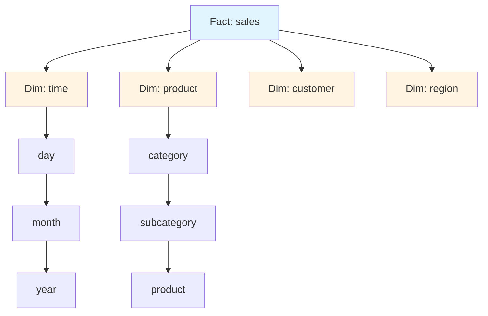
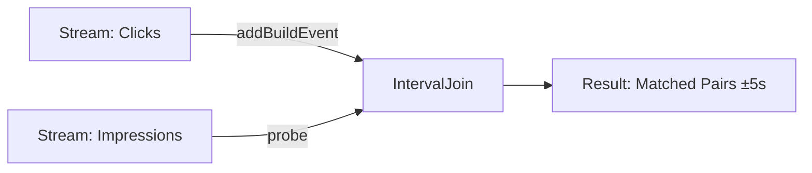

# Kapitel 15: Analytics & Reporting

## 15.1 Einführung in Analytics mit ThemisDB

ThemisDB bietet leistungsstarke Analyse- und Reporting-Funktionen, die es ermöglichen, komplexe Geschäftslogik direkt in der Datenbank auszuführen. Durch die Kombination von relationalen Aggregationen, Graph-Analysen und Vektor-basierten Ähnlichkeitssuchen können umfassende Business-Intelligence-Lösungen erstellt werden.

### 15.1.1 Warum Analytics in der Datenbank?

**Vorteile:**
- **Performance:** Datenverarbeitung direkt am Speicherort
- **Konsistenz:** ACID-Garantien für Analyseergebnisse
- **Echtzeit:** Keine ETL-Verzögerungen
- **Multi-Model:** Kombinierte Analysen über verschiedene Datenmodelle

## 15.9 OLAP Cube Design (Neu)

### 15.9.1 Star Schema



Abb. 15.1: Analytics-Query-Pipeline

**Keys:**
- Fact: `time_key`, `product_key`, `customer_key`, `region_key`
- Dim: Surrogate Keys (`int`) für schnelle Joins

### 15.9.2 Slowly Changing Dimensions (SCD)

| Typ | Verhalten | Beispiel |
|-----|-----------|----------|
| **SCD1** | Überschreibt alte Werte | Preis aktualisieren |
| **SCD2** | Historisiert mit `valid_from/valid_to` | Kundenadresse |
| **SCD3** | Speichert Vorversion im gleichen Datensatz | Vorheriger Status |

**AQL (SCD2 Update):**

```aql
LET now = DATE_NOW()

FOR dim IN dim_product
    FILTER dim.product_id == @product_id
    FILTER dim.valid_to == null
    UPDATE dim WITH { valid_to: now } IN dim_product

INSERT {
    product_id: @product_id,
    name: @name,
    category: @category,
    valid_from: now,
    valid_to: null
} INTO dim_product
```

### 15.9.3 Derived & Aggregate Tables

- **Rollups:** day → month → quarter → year
- **Pre-Aggregation:** Umsatz pro Region/Produkt/Quartal
- **Materialized Views:** Nightly Refresh oder Streaming (CDC)

```aql
-- Quartals-Rollup
FOR fact IN sales
    COLLECT 
        year = DATE_YEAR(fact.ts),
        quarter = DATE_QUARTER(fact.ts),
        region = fact.region,
        category = fact.category
    AGGREGATE 
        revenue = SUM(fact.amount),
        units = SUM(fact.quantity)
    RETURN {
        year, quarter, region, category, revenue, units
    }
```

## 15.10 Incremental Materialization & CDC

### 15.10.1 Changefeed → Materialized View

```python
"""Incremental Refresh für sales_rollup (hourly)"""
from datetime import datetime, timedelta

def refresh_sales_rollup(db, since_ts):
        events = db.changefeed("sales", {"since": since_ts})
        buffer = []
        for ev in events:
                buffer.append(ev)
                if len(buffer) >= 1000:
                        apply_buffer(db, buffer)
                        buffer.clear()
        apply_buffer(db, buffer)

def apply_buffer(db, buffer):
        db.query("""
                FOR ev IN @events
                    LET month = DATE_TRUNC('month', ev.ts)
                    UPSERT { month, region: ev.region, category: ev.category }
                        INSERT {
                            month,
                            region: ev.region,
                            category: ev.category,
                            revenue: ev.amount,
                            units: ev.quantity
                        }
                        UPDATE {
                            revenue: OLD.revenue + ev.amount,
                            units: OLD.units + ev.quantity
                        }
                        IN sales_rollup
        """, {"events": buffer})
```

### 15.10.2 Late Arriving Facts & Corrections

```aql
-- Korrekturen erkennen
FOR ev IN changefeed_sales
    FILTER ev.event_type == "correction"
    LET prev = DOCUMENT(sales_rollup, ev.rollup_key)
    UPDATE prev WITH {
        revenue: prev.revenue - ev.old_amount + ev.new_amount,
        units: prev.units - ev.old_qty + ev.new_qty
    } IN sales_rollup
```

### 15.10.3 OLAP Query Patterns

```aql
-- Drill-down: Jahr → Monat → Tag
FOR row IN sales_rollup
    FILTER row.year == 2025
    COLLECT month = row.month
    AGGREGATE revenue = SUM(row.revenue)
    SORT month
    RETURN { month, revenue }

-- Pivot nach Region
FOR row IN sales_rollup
    COLLECT category = row.category
    AGGREGATE 
        eu = SUM(row.region == 'EU' ? row.revenue : 0),
        us = SUM(row.region == 'US' ? row.revenue : 0),
        apac = SUM(row.region == 'APAC' ? row.revenue : 0)
    RETURN { category, eu, us, apac }
```

```python
class AnalyticsGovernance:
        """Data Governance für Analytics"""
    
        def __init__(self, db):
                self.db = db
    
        def anonymize_customer_data(self, dataset):
                """Anonymisierung sensibler Daten"""
                return [{
                        **row,
                        'customer_id': hash(row['customer_id']),
                        'email': None,
                        'name': None
                } for row in dataset]
    
        def apply_row_level_security(self, query, user_role, user_region):
                """Row-Level Security anwenden"""
                if user_role == 'regional_manager':
                        query += f" FILTER doc.region == '{user_region}'"
                elif user_role == 'analyst':
                        # Nur aggregierte Daten
                        query += " COLLECT ... AGGREGATE ..."
        
                return query
    
        def audit_query(self, user_id, query, timestamp):
                """Query-Audit-Log"""
                self.db.query("""
                        INSERT {
                                user_id: @user_id,
                                query: @query,
                                timestamp: @timestamp,
                                type: 'analytics'
                        } INTO audit_log
                """, {
                        'user_id': user_id,
                        'query': query,
                        'timestamp': timestamp
                })
```

## 15.11 Zusammenfassung
### 15.2.1 Standard AQL-Aggregationen

ThemisDB unterstützt alle Standard-AQL-Aggregationsfunktionen:

```aql
-- Verkaufsstatistiken
FOR order IN orders
  FILTER order.order_date >= '2024-01-01'
  COLLECT month = DATE_TRUNC('month', order.order_date)
  AGGREGATE 
    total_orders = COUNT(),
    revenue = SUM(order.total_amount),
    avg_order_value = AVG(order.total_amount),
    min_order = MIN(order.total_amount),
    max_order = MAX(order.total_amount),
    order_stddev = STDDEV(order.total_amount)
  SORT month
  RETURN {month, total_orders, revenue, avg_order_value, min_order, max_order, order_stddev}
```

**Ausgabe:**
```
month       | total_orders | revenue   | avg_order_value | min_order | max_order | order_stddev
------------|--------------|-----------|-----------------|-----------|-----------|-------------
2024-01-01  | 1250         | 156780.50 | 125.42          | 12.50     | 1580.00   | 95.23
2024-02-01  | 1420         | 182340.75 | 128.45          | 9.99      | 2100.00   | 102.45
```

### 15.2.2 Window Functions für Trend-Analysen

```aql
-- Umsatztrend mit gleitendem Durchschnitt
FOR order IN orders
  SORT order.order_date DESC
  LIMIT 30
  LET moving_avg_7day = AVG_WINDOW(order.total_amount, 
    {preceding: 6, following: 0})
  LET month_cumulative = SUM_WINDOW(order.total_amount, 
    {partition: DATE_TRUNC('month', order.order_date)})
  LET rank_in_month = RANK_WINDOW(
    {partition: DATE_TRUNC('month', order.order_date), 
     order: order.total_amount DESC})
  RETURN {
    order_date: order.order_date,
    total_amount: order.total_amount,
    moving_avg_7day,
    month_cumulative,
    rank_in_month
  }
```

### 15.2.3 PIVOT-Operationen

```aql
-- Umsatz nach Produktkategorie und Monat
LET pivot_data = (
  FOR order_item IN order_items
    FOR product IN products
      FILTER order_item.product_id == product.id
      COLLECT 
        month = DATE_TRUNC('month', order_item.order_date),
        category = product.category
      AGGREGATE revenue = SUM(order_item.amount)
      RETURN {month, category, revenue}
)

// PIVOT operation (manual transformation)
FOR data IN pivot_data
  COLLECT month = data.month
  AGGREGATE
    electronics = SUM(data.category == 'Electronics' ? data.revenue : 0),
    clothing = SUM(data.category == 'Clothing' ? data.revenue : 0),
    books = SUM(data.category == 'Books' ? data.revenue : 0),
    home = SUM(data.category == 'Home' ? data.revenue : 0),
    sports = SUM(data.category == 'Sports' ? data.revenue : 0)
  RETURN {month, electronics, clothing, books, home, sports}
```

## 15.3 Erweiterte Aggregationen mit AQL

### 15.3.1 COLLECT für komplexe Gruppierungen

```aql
-- Kundensegmentierung nach Kaufverhalten
FOR order IN orders
    COLLECT 
        customer_id = order.customer_id,
        age_group = FLOOR(order.customer_age / 10) * 10
    AGGREGATE 
        order_count = COUNT(1),
        total_spent = SUM(order.total_amount),
        avg_order = AVG(order.total_amount),
        categories = UNIQUE(order.category)
    INTO group
    FILTER order_count >= 5
    LET segment = (
        total_spent > 5000 ? "VIP" :
        total_spent > 1000 ? "Premium" :
        "Regular"
    )
    RETURN {
        customer_id,
        age_group,
        segment,
        metrics: {
            orders: order_count,
            total_revenue: total_spent,
            avg_order_value: avg_order,
            product_diversity: LENGTH(categories)
        }
    }
```

### 15.3.2 Multi-Level Aggregationen

```aql
-- Hierarchische Umsatzanalyse
FOR order IN orders
    FILTER order.date >= DATE_NOW() - 365*24*60*60*1000
    COLLECT 
        year = DATE_YEAR(order.date),
        quarter = DATE_QUARTER(order.date),
        region = order.shipping_region
    AGGREGATE 
        revenue = SUM(order.total_amount),
        order_count = COUNT(1)
    COLLECT 
        year = year,
        quarter = quarter
    AGGREGATE 
        total_revenue = SUM(revenue),
        total_orders = SUM(order_count),
        regions = COUNT(region)
    RETURN {
        period: CONCAT(year, "-Q", quarter),
        total_revenue,
        total_orders,
        avg_per_region: total_revenue / regions,
        regions_active: regions
    }
```

## 15.4 Graph Analytics für Beziehungsanalysen

### 15.4.1 Customer Network Analysis

```aql
-- Kunden mit ähnlichen Kaufmustern finden
FOR customer IN customers
    FILTER customer.id == @customerId
    
    // Produkte des Kunden
    LET customer_products = (
        FOR order IN orders
            FILTER order.customer_id == customer.id
            FOR item IN order.items
            RETURN DISTINCT item.product_id
    )
    
    // Ähnliche Kunden finden
    LET similar_customers = (
        FOR other IN customers
            FILTER other.id != customer.id
            LET other_products = (
                FOR order IN orders
                    FILTER order.customer_id == other.id
                    FOR item IN order.items
                    RETURN DISTINCT item.product_id
            )
            LET intersection = LENGTH(
                INTERSECTION(customer_products, other_products)
            )
            LET union_size = LENGTH(
                UNION(customer_products, other_products)
            )
            LET jaccard = intersection / union_size
            FILTER jaccard > 0.3
            SORT jaccard DESC
            LIMIT 10
            RETURN {
                customer_id: other.id,
                similarity: jaccard,
                shared_products: intersection
            }
    )
    
    RETURN {
        customer_id: customer.id,
        similar_customers
    }
```

### 15.4.2 Influencer-Identifikation im Social Graph

```aql
-- Top-Influencer nach PageRank
FOR user IN users
    LET followers_count = LENGTH(
        FOR edge IN follows
            FILTER edge._to == user._id
            RETURN 1
    )
    LET engagement = (
        FOR post IN posts
            FILTER post.author_id == user.id
            RETURN SUM([
                post.likes_count,
                post.comments_count * 2,
                post.shares_count * 3
            ])
    )
    LET avg_engagement = AVG(engagement)
    
    // PageRank-ähnliche Berechnung
    LET influence_score = (
        followers_count * 0.4 +
        avg_engagement * 0.6
    )
    
    FILTER influence_score > 100
    SORT influence_score DESC
    LIMIT 50
    
    RETURN {
        user_id: user.id,
        username: user.username,
        followers: followers_count,
        avg_engagement,
        influence_score
    }
```

## 15.5 Vektor-basierte Analysen

### 15.5.1 Produkt-Clustering nach Embeddings

```python
import themisdb
import numpy as np
from sklearn.cluster import KMeans

# Verbindung
db = themisdb.connect("localhost:8529")

# Produkt-Embeddings laden
query = """
FOR product IN products
    FILTER product.embedding != null
    RETURN {
        id: product.id,
        name: product.name,
        embedding: product.embedding
    }
"""
products = db.query(query)

# Embeddings extrahieren
embeddings = np.array([p['embedding'] for p in products])
product_ids = [p['id'] for p in products]

# K-Means Clustering
kmeans = KMeans(n_clusters=10, random_state=42)
clusters = kmeans.fit_predict(embeddings)

# Cluster zurückschreiben
for product_id, cluster_id in zip(product_ids, clusters):
    db.query("""
        UPDATE products
        SET cluster_id = @cluster
        WHERE id = @id
    """, {
        'id': product_id,
        'cluster': int(cluster_id)
    })

# Cluster-Statistiken
cluster_stats = db.query("""
    FOR product IN products
        COLLECT cluster = product.cluster_id
        AGGREGATE 
            count = COUNT(1),
            avg_price = AVG(product.price),
            categories = UNIQUE(product.category)
        RETURN {
            cluster_id: cluster,
            product_count: count,
            avg_price,
            main_categories: categories
        }
""")

for stats in cluster_stats:
    print(f"Cluster {stats['cluster_id']}: {stats['product_count']} Produkte")
    print(f"  Durchschnittspreis: €{stats['avg_price']:.2f}")
    print(f"  Kategorien: {', '.join(stats['main_categories'][:3])}")
```

### 15.5.2 Anomalie-Erkennung mit Vektor-Distanzen

```aql
-- Ungewöhnliche Transaktionen identifizieren
FOR transaction IN transactions
    // Durchschnittliches Transaktionsprofil des Kunden
    LET customer_avg_embedding = (
        FOR t IN transactions
            FILTER t.customer_id == transaction.customer_id
            AND t.id != transaction.id
            RETURN t.transaction_embedding
    )
    
    LET avg_embedding = (
        FOR emb IN customer_avg_embedding
            RETURN AVERAGE(emb)
    )
    
    // Distanz zur Normalverteilung
    LET distance = VECTOR_DISTANCE(
        "cosine",
        transaction.transaction_embedding,
        avg_embedding
    )
    
    // Anomalie-Score
    LET anomaly_score = distance > 0.7 ? 1.0 : distance / 0.7
    
    FILTER anomaly_score > 0.8
    SORT anomaly_score DESC
    LIMIT 100
    
    RETURN {
        transaction_id: transaction.id,
        customer_id: transaction.customer_id,
        amount: transaction.amount,
        anomaly_score,
        reason: anomaly_score > 0.95 ? "HIGH_RISK" : "REVIEW"
    }
```

## 15.6 Materialized Views für Performance

### 15.6.1 Erstellen von Materialized Views

```aql
-- Tägliche Verkaufsübersicht
CREATE MATERIALIZED VIEW daily_sales_summary AS
SELECT 
    DATE(order_date) AS date,
    COUNT(*) AS order_count,
    SUM(total_amount) AS revenue,
    AVG(total_amount) AS avg_order_value,
    COUNT(DISTINCT customer_id) AS unique_customers,
    SUM(CASE WHEN is_first_order THEN 1 ELSE 0 END) AS new_customers
FROM orders
GROUP BY DATE(order_date);

-- Refresh Strategy
CREATE TRIGGER refresh_daily_sales
    AFTER INSERT OR UPDATE ON orders
    FOR EACH STATEMENT
    EXECUTE PROCEDURE refresh_materialized_view('daily_sales_summary');
```

### 15.6.2 Inkrementelles Update

```python
def update_daily_metrics(date):
    """Inkrementelles Update für einen Tag"""
    
    # Alte Metriken löschen
    db.query("""
        DELETE FROM daily_sales_summary
        WHERE date = @date
    """, {'date': date})
    
    # Neue Metriken berechnen
    db.query("""
        INSERT INTO daily_sales_summary
        SELECT 
            @date AS date,
            COUNT(*) AS order_count,
            SUM(total_amount) AS revenue,
            AVG(total_amount) AS avg_order_value,
            COUNT(DISTINCT customer_id) AS unique_customers,
            SUM(CASE WHEN is_first_order THEN 1 ELSE 0 END) AS new_customers
        FROM orders
        WHERE DATE(order_date) = @date
    """, {'date': date})
```

## 15.7 OLAP-Würfel und Mehrdimensionale Analysen

### 15.7.1 Erstellen eines OLAP-Würfels


### 15.7.1 Erstellen eines OLAP-Würfels

OLAP-Würfel (Online Analytical Processing) ermöglichen multidimensionale Analysen über verschiedene Dimensionen (Zeit, Kunde, Produkt, Region). ThemisDB kann durch geschicktes Kombinieren von Dokumenten und Aggregationen OLAP-ähnliche Analysen durchführen, ohne separate OLAP-Systeme zu benötigen.

> **📁 Vollständiger Code:** `examples/15_analytics/olap_cube.py` (ca. 100 Zeilen)

**OLAP-Würfel Konstruktion:**

```python
import pandas as pd

def create_sales_cube(db):
    """Erstellt multidimensionalen OLAP-Würfel für Verkaufsanalysen"""
    
    # Daten mit allen Dimensionen aggregieren
    query = """
    FOR order IN orders
        LET customer = DOCUMENT('customers', order.customer_id)
        LET items = (
            FOR item IN order.items
                LET product = DOCUMENT('products', item.product_id)
                RETURN {
                    category: product.category,
                    brand: product.brand,
                    price: item.price,
                    quantity: item.quantity,
                    revenue: item.price * item.quantity
                }
        )
        RETURN {
            date: order.order_date,
            year: DATE_YEAR(order.order_date),
            quarter: DATE_QUARTER(order.order_date),
            month: DATE_MONTH(order.order_date),
            customer_segment: customer.segment,
            customer_region: customer.region,
            items: items,
            total_amount: order.total_amount
        }
    """
    
    # In Pandas DataFrame laden
    data = db.query(query)
    df = pd.DataFrame(data)
    
    # Explode items für granulare Analyse
    df_items = df.explode('items')
    df_items = pd.concat([
        df_items.drop('items', axis=1),
        df_items['items'].apply(pd.Series)
    ], axis=1)
    
    return df_items
```

**Slice & Dice Operationen:**

```python
def analyze_cube(cube_df):
    """Verschiedene OLAP-Operationen auf dem Würfel"""
    
    # Slice: Nur eine Region
    region_slice = cube_df[cube_df['customer_region'] == 'Europe']
    
    # Dice: Mehrere Dimensionen filtern
    dice = cube_df[
        (cube_df['year'] == 2024) &
        (cube_df['category'] == 'Electronics')
    ]
    
    # Drill-down: Von Jahr zu Monat
    monthly = cube_df.groupby(['year', 'month', 'category'])['revenue'].sum()
    
    # Roll-up: Von Monat zu Quarter
    quarterly = cube_df.groupby(['year', 'quarter'])['revenue'].sum()
    
    # Pivot: Cross-tabulation
    pivot = cube_df.pivot_table(
        values='revenue',
        index='category',
        columns='customer_segment',
        aggfunc='sum'
    )
    
    return {
        'region_slice': region_slice,
        'dice': dice,
        'monthly': monthly,
        'quarterly': quarterly,
        'pivot': pivot
    }
```

**Wichtige OLAP-Konzepte:**

1. **Dimensionen**: Zeit, Kunde, Produkt, Region (Was analysiert wird)
2. **Measures**: Revenue, Quantity, Count (Was gemessen wird)
3. **Slice**: Einzelne Dimension filtern (z.B. nur 2024)
4. **Dice**: Mehrere Dimensionen kombiniert filtern
5. **Drill-down**: Von aggregiert zu detailliert (Jahr → Monat → Tag)
6. **Roll-up**: Von detailliert zu aggregiert (Tag → Monat → Jahr)
7. **Pivot**: Dimensionen als Zeilen/Spalten darstellen

Die vollständige Implementierung unterstützt zusätzlich:
- Hierarchische Dimensionen (Jahr/Quarter/Monat/Tag)
- Calculated Measures (Profit Margin, Growth Rate)
- Time Intelligence (YTD, MTD, Same Period Last Year)
- Ranking (Top 10 Products)

### 15.7.2 Slice und Dice Operationen

```python
def slice_cube(cube_data, dimension, value):
    """Slice-Operation auf dem Würfel"""
    return cube_data[cube_data[dimension] == value]

def dice_cube(cube_data, filters):
    """Dice-Operation mit mehreren Dimensionen"""
    result = cube_data
    for dim, values in filters.items():
        result = result[result[dim].isin(values)]
    return result

# Beispiel
filters = {
    'customer_region': ['Europe', 'North America'],
    'category': ['Electronics', 'Books'],
    'year': [2024]
}
diced = dice_cube(df, filters)
```

## 15.8 Dashboard-Metriken in Echtzeit

### 15.8.1 KPI-Berechnung


### 15.8.1 KPI-Berechnung

Echtzeit-KPI-Dashboards benötigen schnelle Abfragen über aktuelle Daten. ThemisDB ermöglicht effiziente Berechnung von Key Performance Indicators durch optimierte AQL-Queries mit Aggregationen und Zeitfiltern. Die Dashboard-Klasse zeigt typische Metriken wie tägliche Verkäufe, Conversion Rate und Top-Produkte.

> **📁 Vollständiger Code:** `examples/15_analytics/realtime_dashboard.py` (ca. 130 Zeilen)

**Dashboard-Klasse mit KPI-Berechnung:**

```python
class RealtimeDashboard:
    def __init__(self, db):
        self.db = db
    
    def get_current_metrics(self):
        """Berechnet aktuelle KPIs für Dashboard"""
        
        metrics = {}
        
        # Heutige Verkäufe - mit AGGREGATE für Effizienz
        today = self.db.query("""
            LET today = DATE_FORMAT(DATE_NOW(), '%Y-%m-%d')
            FOR order IN orders
                FILTER DATE_FORMAT(order.order_date, '%Y-%m-%d') == today
                COLLECT AGGREGATE 
                    count = COUNT(1),
                    revenue = SUM(order.total_amount),
                    avg = AVG(order.total_amount)
                RETURN {count, revenue, avg}
        """)[0]
        
        metrics['today'] = today
        
        # Vergleich zu gestern (Growth Rate)
        yesterday = self.db.query("""
            LET yesterday = DATE_SUBTRACT(DATE_NOW(), 1, 'day')
            FOR order IN orders
                FILTER DATE_FORMAT(order.order_date, '%Y-%m-%d') == 
                       DATE_FORMAT(yesterday, '%Y-%m-%d')
                COLLECT AGGREGATE revenue = SUM(order.total_amount)
                RETURN revenue
        """)[0]
        
        metrics['growth_rate'] = (
            (today['revenue'] - yesterday) / yesterday * 100
            if yesterday > 0 else 0
        )
        
        # Top 5 Produkte heute
        top_products = self.db.query("""
            LET today = DATE_FORMAT(DATE_NOW(), '%Y-%m-%d')
            FOR order IN orders
                FILTER DATE_FORMAT(order.order_date, '%Y-%m-%d') == today
                FOR item IN order.items
                    LET product = DOCUMENT('products', item.product_id)
                    COLLECT p = product INTO items
                    LET total = SUM(items[*].item.quantity * items[*].item.price)
                    SORT total DESC
                    LIMIT 5
                    RETURN {
                        product: p.name,
                        revenue: total,
                        units: SUM(items[*].item.quantity)
                    }
        """)
        
        metrics['top_products'] = top_products
        
        # Conversion Rate (Orders / Visitors)
        metrics['conversion_rate'] = self._calculate_conversion_rate()
        
        return metrics
```

**Conversion Rate Berechnung:**

```python
    def _calculate_conversion_rate(self):
        """Berechnet Conversion Rate für heute"""
        
        result = self.db.query("""
            LET today = DATE_FORMAT(DATE_NOW(), '%Y-%m-%d')
            
            LET orders = (
                FOR o IN orders
                    FILTER DATE_FORMAT(o.order_date, '%Y-%m-%d') == today
                    RETURN 1
            )
            
            LET visitors = (
                FOR v IN visitors
                    FILTER DATE_FORMAT(v.visit_date, '%Y-%m-%d') == today
                    RETURN 1
            )
            
            RETURN {
                orders: LENGTH(orders),
                visitors: LENGTH(visitors),
                rate: LENGTH(orders) / LENGTH(visitors) * 100
            }
        """)[0]
        
        return result['rate']
```

**Dashboard Update (WebSocket-basiert):**

```python
    def stream_updates(self, websocket):
        """Streamt KPI-Updates in Echtzeit"""
        
        while True:
            metrics = self.get_current_metrics()
            
            # An WebSocket-Clients senden
            websocket.send(json.dumps({
                'timestamp': datetime.now().isoformat(),
                'metrics': metrics
            }))
            
            time.sleep(5)  # Update alle 5 Sekunden
```

**Typische Dashboard-Metriken:**

| Metric | Beschreibung | Query-Strategie |
|--------|--------------|-----------------|
| Daily Revenue | Summe aller Orders heute | `COLLECT AGGREGATE SUM(total)` |
| Growth Rate | Vergleich zu gestern | Zwei Queries mit Zeitfilter |
| Top Products | Best-seller heute | `COLLECT` + `SORT` + `LIMIT` |
| Conversion Rate | Orders / Visitors | Zwei Subqueries mit `LENGTH()` |
| Avg Order Value | Durchschnitt pro Order | `COLLECT AGGREGATE AVG(total)` |

Die vollständige Implementierung enthält zusätzlich:
- Caching für häufig abgefragte Metriken
- Materialized Views für komplexe Berechnungen
- Alerting bei Schwellwert-Überschreitungen
- Historische Trend-Visualisierung
- Drill-down für Detail-Analysen

### 15.8.2 Change Data Capture für Live-Updates

```python
def subscribe_to_metrics_updates(db, callback):
    """CDC-Stream für Echtzeit-Metriken"""
    
    stream = db.collection('orders').watch([
        {'$match': {'operationType': 'insert'}}
    ])
    
    for change in stream:
        # Neue Bestellung
        order = change['fullDocument']
        
        # Metriken aktualisieren
        updated_metrics = {
            'timestamp': order['order_date'],
            'order_id': order['_id'],
            'amount': order['total_amount'],
            'customer_id': order['customer_id']
        }
        
        # Callback für Dashboard-Update
        callback(updated_metrics)

# Verwendung
def on_new_order(metrics):
    print(f"Neue Bestellung: €{metrics['amount']:.2f}")
    # Dashboard aktualisieren

subscribe_to_metrics_updates(db, on_new_order)
```

## 15.9 Predictive Analytics

### 15.9.1 Trend-Prognosen mit linearer Regression

```python
from sklearn.linear_model import LinearRegression
import numpy as np

def forecast_revenue(db, days_ahead=30):
    """Umsatzprognose für die nächsten Tage"""
    
    # Historische Daten
    historical = db.query("""
        FOR order IN orders
            FILTER order.order_date >= DATE_SUBTRACT(DATE_NOW(), 90, 'day')
            COLLECT date = DATE_FORMAT(order.order_date, '%Y-%m-%d')
            AGGREGATE revenue = SUM(order.total_amount)
            SORT date
            RETURN {date, revenue}
    """)
    
    # Features vorbereiten
    X = np.array([[i] for i in range(len(historical))])
    y = np.array([h['revenue'] for h in historical])
    
    # Modell trainieren
    model = LinearRegression()
    model.fit(X, y)
    
    # Prognose
    future_X = np.array([[i] for i in range(len(historical), len(historical) + days_ahead)])
    forecast = model.predict(future_X)
    
    # Konfidenzintervall (vereinfacht)
    residuals = y - model.predict(X)
    std_error = np.std(residuals)
    confidence_interval = 1.96 * std_error  # 95% CI
    
    return {
        'forecast': forecast.tolist(),
        'lower_bound': (forecast - confidence_interval).tolist(),
        'upper_bound': (forecast + confidence_interval).tolist()
    }

# Prognose erstellen
forecast = forecast_revenue(db, days_ahead=30)
print(f"Prognostizierter Umsatz in 30 Tagen: €{forecast['forecast'][-1]:.2f}")
print(f"Konfidenzintervall: €{forecast['lower_bound'][-1]:.2f} - €{forecast['upper_bound'][-1]:.2f}")
```

### 15.9.2 Churn-Vorhersage

```python
def calculate_churn_risk(db, customer_id):
    """Churn-Risiko für einen Kunden berechnen"""
    
    features = db.query("""
        LET customer = DOCUMENT('customers', @customer_id)
        LET orders = (
            FOR order IN orders
                FILTER order.customer_id == @customer_id
                SORT order.order_date DESC
                RETURN order
        )
        
        LET days_since_last_order = DATE_DIFF(
            orders[0].order_date,
            DATE_NOW(),
            'day'
        )
        
        LET order_frequency = LENGTH(orders) / (
            DATE_DIFF(
                customer.registration_date,
                DATE_NOW(),
                'day'
            ) / 30
        )
        
        LET avg_order_value = AVG(
            FOR order IN orders
                RETURN order.total_amount
        )
        
        LET total_spent = SUM(
            FOR order IN orders
                RETURN order.total_amount
        )
        
        RETURN {
            days_since_last_order,
            order_frequency,
            avg_order_value,
            total_spent,
            support_tickets: LENGTH(customer.support_tickets),
            has_complained: LENGTH(
                FOR ticket IN customer.support_tickets
                    FILTER ticket.type == 'complaint'
                    RETURN 1
            ) > 0
        }
    """, {'customer_id': customer_id})[0]
    
    # Einfacher Risiko-Score
    risk_score = 0
    
    if features['days_since_last_order'] > 60:
        risk_score += 0.3
    if features['order_frequency'] < 1:
        risk_score += 0.2
    if features['avg_order_value'] < 50:
        risk_score += 0.1
    if features['support_tickets'] > 5:
        risk_score += 0.2
    if features['has_complained']:
        risk_score += 0.2
    
    return {
        'customer_id': customer_id,
        'churn_risk': min(risk_score, 1.0),
        'risk_level': (
            'HIGH' if risk_score > 0.7 else
            'MEDIUM' if risk_score > 0.4 else
            'LOW'
        ),
        'features': features
    }
```

## 15.10 Reporting und Export

### 15.10.1 PDF-Report-Generierung

```python
from reportlab.lib.pagesizes import A4
from reportlab.lib import colors
from reportlab.lib.units import cm
from reportlab.platypus import SimpleDocTemplate, Table, TableStyle, Paragraph
from reportlab.lib.styles import getSampleStyleSheet

def generate_sales_report(db, start_date, end_date, filename):
    """Verkaufsbericht als PDF generieren"""
    
    # Daten abfragen
    summary = db.query("""
        FOR order IN orders
            FILTER order.order_date >= @start_date
            AND order.order_date <= @end_date
            COLLECT AGGREGATE
                total_orders = COUNT(1),
                total_revenue = SUM(order.total_amount),
                avg_order_value = AVG(order.total_amount)
            RETURN {
                total_orders,
                total_revenue,
                avg_order_value
            }
    """, {'start_date': start_date, 'end_date': end_date})[0]
    
    top_products = db.query("""
        FOR order IN orders
            FILTER order.order_date >= @start_date
            AND order.order_date <= @end_date
            FOR item IN order.items
                COLLECT product_id = item.product_id
                AGGREGATE 
                    quantity = SUM(item.quantity),
                    revenue = SUM(item.price * item.quantity)
                LET product = DOCUMENT('products', product_id)
                SORT revenue DESC
                LIMIT 10
                RETURN [product.name, quantity, revenue]
    """, {'start_date': start_date, 'end_date': end_date})
    
    # PDF erstellen
    doc = SimpleDocTemplate(filename, pagesize=A4)
    elements = []
    styles = getSampleStyleSheet()
    
    # Titel
    title = Paragraph(f"Verkaufsbericht {start_date} bis {end_date}", styles['Title'])
    elements.append(title)
    
    # Zusammenfassung
    summary_data = [
        ['Metric', 'Value'],
        ['Gesamtbestellungen', f"{summary['total_orders']:,}"],
        ['Gesamtumsatz', f"€{summary['total_revenue']:,.2f}"],
        ['Ø Bestellwert', f"€{summary['avg_order_value']:.2f}"]
    ]
    
    summary_table = Table(summary_data, colWidths=[8*cm, 8*cm])
    summary_table.setStyle(TableStyle([
        ('BACKGROUND', (0, 0), (-1, 0), colors.grey),
        ('TEXTCOLOR', (0, 0), (-1, 0), colors.whitesmoke),
        ('ALIGN', (0, 0), (-1, -1), 'CENTER'),
        ('FONTNAME', (0, 0), (-1, 0), 'Helvetica-Bold'),
        ('FONTSIZE', (0, 0), (-1, 0), 14),
        ('BOTTOMPADDING', (0, 0), (-1, 0), 12),
        ('BACKGROUND', (0, 1), (-1, -1), colors.beige),
        ('GRID', (0, 0), (-1, -1), 1, colors.black)
    ]))
    elements.append(summary_table)
    
    # Top-Produkte
    elements.append(Paragraph("Top 10 Produkte", styles['Heading2']))
    
    product_data = [['Produkt', 'Menge', 'Umsatz']]
    product_data.extend(top_products)
    
    product_table = Table(product_data, colWidths=[10*cm, 3*cm, 3*cm])
    product_table.setStyle(TableStyle([
        ('BACKGROUND', (0, 0), (-1, 0), colors.grey),
        ('TEXTCOLOR', (0, 0), (-1, 0), colors.whitesmoke),
        ('ALIGN', (1, 0), (-1, -1), 'RIGHT'),
        ('FONTNAME', (0, 0), (-1, 0), 'Helvetica-Bold'),
        ('GRID', (0, 0), (-1, -1), 1, colors.black)
    ]))
    elements.append(product_table)
    
    # PDF generieren
    doc.build(elements)
    print(f"Report saved to {filename}")

# Report erstellen
generate_sales_report(db, '2024-01-01', '2024-03-31', 'Q1_2024_Report.pdf')
```

### 15.10.2 CSV-Export für Excel

```python
import csv

def export_to_csv(db, query, filename, params=None):
    """Abfrageergebnisse als CSV exportieren"""
    
    results = db.query(query, params or {})
    
    if not results:
        print("No data to export")
        return
    
    # Header aus erstem Datensatz
    headers = list(results[0].keys())
    
    with open(filename, 'w', newline='', encoding='utf-8') as csvfile:
        writer = csv.DictWriter(csvfile, fieldnames=headers)
        writer.writeheader()
        writer.writerows(results)
    
    print(f"Exported {len(results)} rows to {filename}")

# Beispiel: Kundenanalyse exportieren
export_to_csv(db, """
    FOR customer IN customers
        LET orders = (
            FOR order IN orders
                FILTER order.customer_id == customer.id
                RETURN order
        )
        RETURN {
            customer_id: customer.id,
            name: customer.name,
            email: customer.email,
            total_orders: LENGTH(orders),
            total_spent: SUM(FOR o IN orders RETURN o.total_amount),
            last_order_date: MAX(FOR o IN orders RETURN o.order_date)
        }
""", 'customers_analysis.csv')
```

## 15.11 Best Practices für Analytics

### 15.11.1 Performance-Optimierung

**Indexierung:**
```aql
-- Composite Index für häufige Queries
CREATE INDEX idx_orders_date_customer ON orders(order_date, customer_id);

-- Covering Index für Aggregationen
CREATE INDEX idx_orders_date_amount ON orders(order_date, total_amount);
```

**Query-Optimierung:**
- Verwenden Sie `FILTER` früh in der Pipeline
- Nutzen Sie `COLLECT` statt mehrfacher Gruppierungen
- Limitieren Sie Ergebnisse mit `LIMIT`
- Verwenden Sie Materialized Views für wiederkehrende Berechnungen

### 15.11.2 Data Governance

```python
class AnalyticsGovernance:
    def anonymize(self, dataset):
        # Entferne persönliche Daten
        return [{**r, 'customer_id': hash(r['customer_id']), 
                 'email': None} for r in dataset]
    
    def apply_rls(self, query, role, region):
        # Row-Level Security nach Rolle
        if role == 'regional': query += f" FILTER region == '{region}'"
        return query
```

## 15.12 Zusammenfassung

ThemisDB bietet umfassende Analytics-Funktionen:

- **AQL-Aggregationen:** Standard- und Window-Functions
- **AQL-Analytics:** Multi-Level-Aggregationen und COLLECT
- **Graph-Analytics:** Beziehungsanalysen und Influencer-Detection
- **Vektor-Analytics:** Clustering und Anomalie-Erkennung
- **OLAP:** Mehrdimensionale Analysen und Würfel
- **Real-Time:** Live-Dashboards mit CDC
- **Predictive:** Prognosen und Churn-Vorhersage
- **Reporting:** PDF/CSV-Export und Visualisierung

Im nächsten Kapitel behandeln wir Machine Learning Integration für erweiterte Analysen.

---

## 15.13 Hochleistungs-Analytics-Infrastruktur (v1.9.x)

### 15.13.1 ColumnarCache — LRU-basierter Spaltensegment-Cache

`ColumnarCache` speichert vorberechnete Spaltensegmente (`ColumnSegment`) aus Breit-Tabellen-Scans in einem LRU-In-Memory-Store.  Da die gecachten Daten bereits im spaltenorientierten Layout des Analytics-Engines (`ColumnBatch`) vorliegen, entfällt jede Deserialisierungsarbeit — ein direkter Zugriff auf gecachte Spalten ist **Zero-Copy**.

**Kernkonzept:**
- Jedes `ColumnSegment` deckt eine feste Anzahl Rows `[segment_id × rows_per_segment, (segment_id+1) × rows_per_segment)` einer Spalte ab.
- Aktiv gelesene Segmente können **gepinnt** werden (`PinGuard` RAII), um Eviction zu verhindern.
- Unpinnierte Segmente werden **LRU-seitig** verdrängt, wenn `max_bytes` überschritten ist.

**Performance-Ziele:**

| Operation | Ziel |
|-----------|------|
| `get()` (Cache-Hit) | ≤ 500 ns |
| `put()` (≤ 64 KB Segment) | ≤ 1 µs |
| Eviction | O(1) amortisiert |
| Durchsatz-Speedup vs. Row-Cache | ≥ 10× bei Breit-Tabellen |

**Schnellstart:**

```cpp
#include "storage/columnar_cache.h"

themis::storage::ColumnarCache cache({
    .max_bytes = 256ULL * 1024 * 1024  // 256 MB
});

// Segment aus einem Storage-Scan einfügen
cache.put(segment);

// Lese-Seite — PinGuard verhindert Eviction während der Nutzung
auto guard = cache.get(key);
if (guard) {
    // guard.segment().asColumn() → Zero-Copy für ColumnBatch
    batch.addColumn(guard.segment().asColumn());
}
// guard geht out-of-scope → Pin wird automatisch freigegeben

// Statistiken
size_t hits   = cache.hits();
size_t misses = cache.misses();
```

**Konfigurationsparameter:**

| Parameter | Beschreibung |
|-----------|-------------|
| `max_bytes` | Maximale Cache-Größe in Bytes |
| `on_evict` | Optionaler Eviction-Callback (z.B. für Metriken) |

**Datentypen (SegmentDType):**

| Typ | C++-Äquivalent | Beschreibung |
|-----|---------------|-------------|
| `Int64` | `int64_t` | Ganzzahlen |
| `Double` | `double` | Gleitkommazahlen |
| `String` | `std::string` | Zeichenketten |
| `Bool` | `bool` | Boolesche Werte |

---

### 15.13.2 IStreamingJoin — HashJoin und IntervalJoin

Das `IStreamingJoin`-Interface bietet zwei konkrete Streaming-Join-Strategien auf Basis des `ColumnBatch`-Datenmodells:

#### HashJoin — Equi-Join auf Schlüsselspalten

`HashJoin` baut eine Hash-Tabelle aus der "Build-Seite" (typischerweise die kleinere Dimension-Relation) und probt sie mit jedem "Probe-Batch".  Beide **Inner** und **Left-Outer** Join-Semantiken werden unterstützt.

```cpp
#include "analytics/streaming_join.h"

themisdb::analytics::HashJoin join({
    .join_keys    = {"user_id"},
    .join_type    = themisdb::analytics::JoinType::Inner,
    .build_select = {"user_id", "name"},
    .probe_select = {"user_id", "event"},
    .max_build_rows = 10'000'000,  // Sicherheitslimit
});

// Build-Phase (Dimensionstabelle einlesen)
join.build(dimension_batches.begin(), dimension_batches.end());

// Probe-Phase (Faktentabelle streamen)
themisdb::analytics::ColumnBatch result = join.probe(fact_batch);
```

**Konfigurationsparameter HashJoin:**

| Parameter | Beschreibung |
|-----------|-------------|
| `join_keys` | Spalten für den Equi-Join (composite keys möglich) |
| `join_type` | `Inner` oder `LeftOuter` |
| `build_select` | Spalten, die aus der Build-Seite in das Ergebnis übernommen werden |
| `probe_select` | Spalten, die aus der Probe-Seite in das Ergebnis übernommen werden |
| `max_build_rows` | Sicherheitslimit; bricht Build ab, wenn überschritten |

#### IntervalJoin — Zeitbasierter Event-Join

`IntervalJoin` verknüpft Rows zweier Streams, deren Ereigniszeit-Spalten innerhalb eines konfigurierbaren Zeitfensters `[probe_time - before_ms, probe_time + after_ms]` liegen.  Typischer Einsatz: CEP-Event-Korrelation (z.B. "Clicks" mit "Impressions" innerhalb ±5 Sekunden joinen).

```cpp
themisdb::analytics::IntervalJoin join({
    .join_keys   = {"session_id"},
    .time_column = "event_time_ms",
    .before_ms   = 5000,   // 5 Sekunden vor dem Probe-Event
    .after_ms    = 5000,   // 5 Sekunden nach dem Probe-Event
    .slack_ms    = 100,    // Toleranz für Clock-Skew
    .join_type   = themisdb::analytics::JoinType::Inner,
});

// Build-Events (linker Stream) einfügen
join.addBuildEvent(left_batch);

// Probe-Batch (rechter Stream) joinen
themisdb::analytics::ColumnBatch result = join.probe(right_batch);
```

**Konfigurationsparameter IntervalJoin:**

| Parameter | Standard | Beschreibung |
|-----------|---------|-------------|
| `join_keys` | — | Partitionierungsschlüssel |
| `time_column` | — | Spaltenname mit Event-Zeit (ms) |
| `before_ms` | 0 | Fenstergröße nach links |
| `after_ms` | 0 | Fenstergröße nach rechts |
| `slack_ms` | 0 | Toleranz für leichte Clock-Skews |
| `join_type` | `Inner` | Join-Semantik |

**Speicherverwaltung:** IntervalJoin nutzt LRU-Pruning, um veraltete Build-Events automatisch zu entfernen und den Speicherverbrauch zu begrenzen.

#### Typische Streaming-Join-Pipeline



Abb. 15.13: IntervalJoin für Event-Korrelation zwischen zwei Streams

---

## 15.14 Analytics-Modul — Erweiterte C++ API (v1.9)

### 15.14.1 OLAPEngine — GPU-beschleunigte OLAP-Abfragen

```cpp
#include "analytics/olap.h"

themisdb::analytics::OLAPEngine::Config olap_cfg;
olap_cfg.enable_gpu               = true;
olap_cfg.gpu_device_id            = 0;
olap_cfg.gpu_memory_limit         = 4ULL * 1024 * 1024 * 1024;  // 4 GB
olap_cfg.gpu_threshold_rows       = 10000;
olap_cfg.result_cache_max_entries = 1000;
olap_cfg.result_cache_ttl_ms      = 60000;

themisdb::analytics::OLAPEngine olap(olap_cfg);

// ── CUBE (alle Dimensionskombinationen) ───────────────────────────────
auto cube_cells = olap.executeCube(
    "sales",
    { {"region"}, {"product"}, {"quarter"} },
    { {.function="SUM", .field="revenue"} }
);

// ── ROLLUP (hierarchische Aggregation) ───────────────────────────────
auto rollup_rows = olap.executeRollup(
    "sales",
    { {"country"}, {"region"}, {"city"} },
    { {.function="COUNT"}, {.function="SUM", .field="amount"} }
);

// ── Window Functions ──────────────────────────────────────────────────
auto win_results = olap.evaluateWindowFunctions(
    data_rows,
    { {.function="ROW_NUMBER"}, {.function="SUM", .field="revenue"} },
    window_spec
);
```

**Unterstützte Aggregationsfunktionen:** COUNT, SUM, AVG, MIN, MAX, STDDEV, VARIANCE, MEDIAN, PERCENTILE  
**Window-Typen:** ROWS BETWEEN, RANGE BETWEEN, SLIDING, TUMBLING

### 15.14.2 CEPEngine — Complex Event Processing mit EPL

`CEPEngine` (`include/analytics/cep_engine.h`) implementiert NFA-basiertes Pattern Matching, einen vollständigen EPL (Event Processing Language) Parser und MPMC Lock-Free Ring Buffer für die Event-Queue.

```cpp
#include "analytics/cep_engine.h"

auto& cep = themisdb::analytics::CEPEngine::getInstance();
cep.initialize(cep_config);

// ── Event Stream erstellen ─────────────────────────────────────────────
auto stream = cep.createStream({ .id = "orders_stream", .retention_ms = 60000 });

// ── EPL-Regel (Event Processing Language) ────────────────────────────
// Syntax: CREATE RULE <name> AS SELECT <agg> FROM <stream>
//         WINDOW(5 minutes) GROUP BY <field> PATTERN WITHIN 30 seconds
//         ACTION alert(...)
cep.addRule({
    .name = "high-value-alert",
    .epl  = R"(
        CREATE RULE high_value AS
        SELECT SUM(amount) AS total, COUNT(*) AS cnt, customer_id
        FROM orders_stream
        WINDOW(5 minutes)
        GROUP BY customer_id
        HAVING SUM(amount) > 10000
        ACTION alert('High-value customer detected', severity='HIGH')
    )"
});

// ── CDC-Event senden ──────────────────────────────────────────────────
auto ev = themisdb::analytics::CEPEngine::createCDCEvent(
    themisdb::analytics::EventType::DOCUMENT_INSERT,
    "orders", doc_id, fields
);
cep.submitEvent(ev);
```

**EPL-Features:** SELECT aggregations (COUNT/SUM/AVG/MIN/MAX/FIRST/LAST/STDDEV/PERCENTILE/TOPN/COLLECT), GROUP BY, WINDOW mit Zeit-Einheiten (ms/s/minutes/hours), PATTERN WITHIN, ACTION (alert/webhook/db_write/log/slack/kafka/email)

### 15.14.3 AnomalyDetector — Echtzeit-Anomalie-Erkennung

```cpp
#include "analytics/anomaly_detection.h"

themisdb::analytics::AnomalyDetector::Config ad_cfg;
ad_cfg.algorithm          = themisdb::analytics::AnomalyAlgorithm::ISOLATION_FOREST;
ad_cfg.contamination      = 0.05;  // 5% erwartete Ausreißer
ad_cfg.window_size        = 1000;
ad_cfg.alert_threshold    = 0.8;

themisdb::analytics::AnomalyDetector detector(ad_cfg);

// Training + Erkennung
detector.fit(training_data);
auto results = detector.detect(new_data_points);
// results[i].is_anomaly, results[i].score, results[i].explanation
```

### 15.14.4 ModelServingEngine — Online Inference Pipeline

```cpp
#include "analytics/model_serving.h"

themisdb::analytics::ModelServingEngine serving;
serving.loadModel("churn-predictor-v2", model_bytes, /*format=*/"onnx");

// Inference
auto prediction = serving.predict("churn-predictor-v2", feature_vector);
// prediction.scores, prediction.label, prediction.confidence
// prediction.latency_ms, prediction.model_version

// Batch Inference (async)
auto future = serving.predictBatch("churn-predictor-v2", feature_matrix);
auto batch_result = future.get();
```
