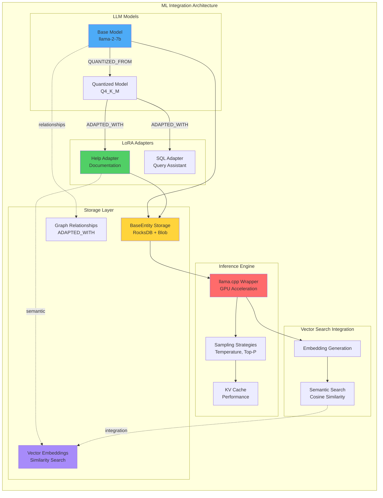
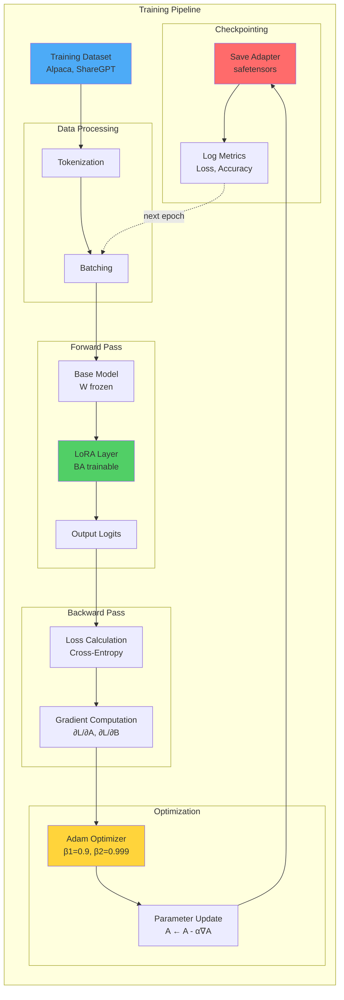
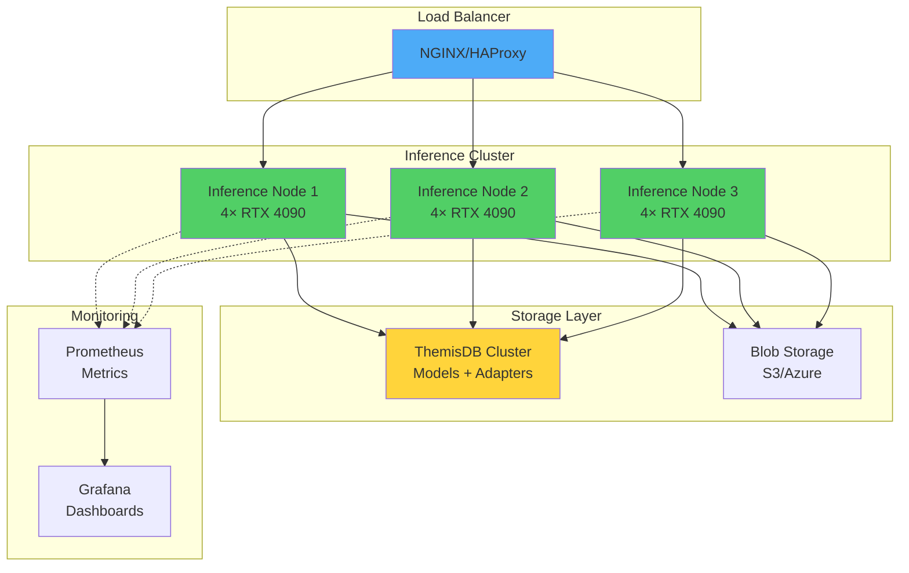

# Kapitel 16: Machine Learning & LLM Integration

> *"Machine Learning ist nicht länger ein Add-on, sondern ein integraler Bestandteil moderner Datenbanksysteme."*

---

## Überblick

<!-- Source: LLM_LORA_UNIFIED_ARCHITECTURE.md, LLM_LORA_IMPLEMENTATION_STATUS.md -->

Machine Learning und Large Language Models (LLMs) transformieren die Art und Weise, wie Datenbanken Informationen verarbeiten, verstehen und bereitstellen. ThemisDB integriert moderne ML-Frameworks direkt in die Datenbankarchitektur und ermöglicht semantische Suche, intelligente Embedding-Generierung und adaptive Modell-Fine-Tuning durch LoRA (Low-Rank Adaptation). Diese Integration verbindet traditionelle strukturierte Datenverarbeitung mit dem semantischen Verständnis großer Sprachmodelle.

Die ML-Integration in ThemisDB basiert auf drei Kern-Prinzipien: **Unified Architecture** für konsistente Speicherung von Modellen und Adaptern, **Multi-Model Support** für Document, Graph und Vector Operations, sowie **Complete Traceability** für Audit-Logging von Modell + Adapter → Response. Alle ML-Komponenten folgen dem BaseEntity-Prinzip und nutzen die gleiche Infrastruktur für Security, Encryption, RAID und Blob Storage.

Production-grade ML-Integration erfordert robuste Model Lifecycle Management, effiziente Inference Optimization mit GPU-Acceleration, sowie nahtlose Integration mit Vector Search für semantische Similarity. Die llama.cpp-Integration ermöglicht performante LLM-Inferenz mit Vulkan, CUDA und HIP-Backend-Support, während LoRA-Adapter dynamisches Fine-Tuning ohne vollständiges Model-Retraining ermöglichen. Training Pipelines mit Gradient Checkpointing, Mixed Precision und Multi-GPU Support skalieren von Entwicklungs-Workloads bis zu Production-Deployments.

**Was Sie in diesem Kapitel lernen:**
- Machine Learning Frameworks Overview und Integration Architecture
- LLM Integration mit llama.cpp für Text Generation und Embeddings
- Model Loading & Management mit Smart Tiering und Lazy Loading
- LoRA Training Pipelines für effizientes Fine-Tuning
- Inference Optimization mit GPU Acceleration und Sampling Strategies
- Integration mit Vector Search für semantische Ähnlichkeitssuche
- Unified Storage Architecture für Models und Adapters als BaseEntity
- Security und Audit Logging für vollständige ML Operation Traceability
- Performance Optimization mit Kernel Fusion und Distributed Training
- Production Deployment Strategies für ML-enabled Database Systems



Abb. 16.1: Machine Learning Integration Architecture in ThemisDB

---

## 16.1 Machine Learning Frameworks Overview {#ml-frameworks-overview}

<!-- Source: LLM_LORA_UNIFIED_ARCHITECTURE.md -->

ThemisDB implementiert eine unified ML architecture, die sowohl LLM Base Models als auch LoRA Adapters als erste-Klasse-Bürger behandelt. Beide folgen dem BaseEntity-Prinzip und nutzen dieselbe Infrastruktur für Storage, Security, Graph Relationships und Vector Embeddings.

### 16.1.1 Unified Architecture Principles {#unified-architecture}

Die ML-Integration basiert auf fünf Kern-Prinzipien:

**1. Everything is a BaseEntity**  
Models, Adapters, Datasets und Inference Sessions werden alle als BaseEntity-Dokumente gespeichert. Dies ermöglicht konsistente CRUD-Operationen und strukturierte Queries über alle ML-Komponenten hinweg.

**2. Graph for Relationships**  
Lineage, Dependencies und Similarity werden in Graph Edges erfasst. Beziehungen wie `QUANTIZED_FROM`, `ADAPTED_WITH`, `TRAINED_ON` und `RETRAINED` bilden einen vollständigen ML Provenance Graph.

**3. Vectors for Semantics**  
Search, Recommendations und Clustering werden durch Vector Embeddings ermöglicht. Jedes Model und jeder Adapter erhält ein semantisches Embedding für Similarity Search.

**4. Audit for Traceability**  
Who, What, When, How – ein complete Audit Trail erfasst jede ML Operation von Model Loading über Adapter Application bis zu Inference Responses.

**5. Security by Default**  
Encryption, Signatures und RAID sind direkt in die ML-Infrastruktur integriert. Cryptographic verification validiert Model Integrity.

### 16.1.2 Architecture Components {#architecture-components}

```cpp
// Unified Architecture Stack
┌──────────────────────────────────────────────────────────────────┐
│                    Unified LLM Architecture                       │
├──────────────────────────────────────────────────────────────────┤
│                                                                   │
│  ┌────────────────────┐           ┌────────────────────┐        │
│  │   LLM Base Models  │           │   LoRA Adapters    │        │
│  │   (llama-2-7b)     │◄─────────►│  (themis_help)     │        │
│  └────────────────────┘           └────────────────────┘        │
│           │                                 │                     │
│           │          Both follow            │                     │
│           │        BaseEntity Pattern       │                     │
│           │                                 │                     │
│           ▼                                 ▼                     │
│  ┌─────────────────────────────────────────────────────┐        │
│  │              Document Model (BaseEntity)             │        │
│  │  • Metadata as structured fields                     │        │
│  │  • Weights in blob storage (smart tiering)          │        │
│  └─────────────────────────────────────────────────────┘        │
│                                                                   │
│  ┌─────────────────────────────────────────────────────┐        │
│  │              Graph Model (Relationships)             │        │
│  │  • DERIVED_FROM, ADAPTED_WITH, QUANTIZED_FROM       │        │
│  │  • Lineage paths and provenance tracking            │        │
│  └─────────────────────────────────────────────────────┘        │
│                                                                   │
│  ┌─────────────────────────────────────────────────────┐        │
│  │              Vector Model (Embeddings)               │        │
│  │  • Semantic similarity search                        │        │
│  │  • Model/adapter recommendations                     │        │
│  └─────────────────────────────────────────────────────┘        │
│                                                                   │
│  ┌─────────────────────────────────────────────────────┐        │
│  │              Audit Logging Layer                     │        │
│  │  Track: Model + LoRA → Response (Complete trace)    │        │
│  └─────────────────────────────────────────────────────┘        │
└──────────────────────────────────────────────────────────────────┘
```

### 16.1.3 Multi-Model Support {#multi-model-support}

ThemisDB implementiert echten Multi-Model Support für ML-Komponenten:

**Document Model**: Strukturierte Metadaten wie `model_id`, `architecture`, `quantization`, `parameter_count` werden als BaseEntity Fields gespeichert und ermöglichen effiziente Queries.

**Graph Model**: Relationships zwischen Models, Adapters, Datasets und Inference Sessions bilden einen vollständigen ML Provenance Graph. Edge Types wie `DERIVED_FROM`, `ADAPTED_WITH`, `TRAINED_ON` und `USED_IN` ermöglichen Lineage Tracking.

**Vector Model**: Semantische Embeddings für Models und Adapters ermöglichen Similarity Search, Recommendations und Clustering. Cosine Similarity identifiziert ähnliche Models oder Adapters basierend auf deren Beschreibungen und Capabilities.

```cpp
// Multi-Model Query Example: Find Best Model + Adapter for Task
std::string task = "I need a model for code generation with SQL assistance";

// 1. Vector Search for suitable base models
auto candidate_models = model_storage.findSimilarModels(task, k=10, threshold=0.6);

// 2. Graph Traversal for compatible adapters
for (const auto& [model_id, score] : candidate_models) {
    auto edges = model_storage.getEdges(model_id, "outgoing");
    
    for (const auto& edge : edges) {
        if (edge["type"] == "ADAPTED_WITH") {
            std::string adapter_id = edge["to"];
            
            // 3. Semantic Similarity for adapter-task match
            auto adapter_embedding = lora_storage.getEmbeddings(adapter_id);
            float adapter_score = cosine_similarity(task_embedding, adapter_embedding);
            
            if (adapter_score > 0.7) {
                // 4. Document Query for metadata
                auto adapter_metadata = lora_storage.loadAdapter(adapter_id);
                std::cout << "Candidate: " << model_id << " + " << adapter_id
                         << " (score: " << adapter_score << ")" << std::endl;
            }
        }
    }
}
```

Siehe auch: [Kapitel 8: Vektoren](chapter_08_vector.md) für Details zu Vector Search.

---

## 16.2 LLM Integration Architecture {#llm-integration}

<!-- Source: LLAMA_IMPLEMENTATION_SUMMARY.md, LLM_LORA_LLAMACPP_INTEGRATION.md -->

Die LLM-Integration in ThemisDB basiert auf llama.cpp, einer hochoptimierten C/C++ Implementierung für Large Language Model Inference. Die Integration ermöglicht Text Generation, Chat Completion, Token Sampling und Embeddings Generation mit GPU Acceleration (Vulkan, CUDA, HIP).

### 16.2.1 llama.cpp Integration {#llamacpp-integration}

llama.cpp ist die Inference Engine für LLMs in ThemisDB und unterstützt GGUF (GPT-Generated Unified Format) Modelle mit verschiedenen Quantization Levels (Q4_K_M, Q5_K_M, Q8_0).

**Core Components:**

```cpp
// LlamaWrapper: C++ API for llama.cpp
class LlamaWrapper {
public:
    // Text Generation
    InferenceResponse generate(const InferenceRequest& request);
    
    // Embeddings Generation
    std::vector<float> embed(const std::string& text);
    
    // Chat Completion
    InferenceResponse chat(const std::vector<Message>& messages);
    
private:
    llama_model* lmodel;      // Model handle
    llama_context* lctx;      // Context handle
    
    // Internal helpers
    std::vector<llama_token> tokenizeInternal(llama_model* model,
                                               const std::string& text,
                                               bool add_bos);
    
    std::string detokenizeInternal(llama_context* ctx,
                                    const std::vector<llama_token>& tokens);
    
    llama_token sampleTokenInternal(llama_context* ctx,
                                     llama_model* model,
                                     float* logits,
                                     int32_t n_vocab,
                                     float temperature,
                                     float top_p);
};
```

**API Compatibility**: Die Implementation nutzt die latest llama.cpp API (Januar 2025):

| Function | Old API | New API |
|----------|---------|---------|
| Tokenize | `llama_tokenize(model, ...)` | `llama_tokenize(vocab, ...)` |
| Detokenize | `llama_token_to_piece(ctx, ...)` | `llama_token_to_piece(vocab, ...)` |
| Vocab Size | `llama_n_vocab(model)` | `llama_vocab_n_tokens(vocab)` |
| EOS Token | `llama_token_eos(model)` | `llama_vocab_eos(vocab)` |
| Embedding Dim | `llama_n_embd(model)` | `llama_model_n_embd(model)` |

**Getting Vocabulary:**
```cpp
const llama_vocab* vocab = llama_model_get_vocab(model);
```

### 16.2.2 Text Generation Implementation {#text-generation}

<!-- Source: LLAMA_IMPLEMENTATION_SUMMARY.md -->

Text Generation nutzt llama.cpp für Tokenization, Prompt Evaluation und autoregressive Token-by-Token Generation mit verschiedenen Sampling Strategies.

**Implementation:** `src/llm/llama_wrapper.cpp:143-238`

```cpp
InferenceResponse LlamaWrapper::generate(const InferenceRequest& request) {
    // Fallback for stub mode
    if (!lmodel || !lctx) {
        spdlog::warn("Model/context handle is null, using stub response");
        return createStubResponse();
    }
    
    // 1. Tokenization
    auto tokens = tokenizeInternal(lmodel, request.prompt, true);
    
    // 2. Prompt Evaluation
    llama_batch batch = llama_batch_get_one(tokens.data(), tokens.size());
    if (llama_decode(lctx, batch) != 0) {
        throw std::runtime_error("Failed to evaluate prompt");
    }
    
    // 3. Token-by-Token Generation
    std::vector<llama_token> generated_tokens;
    const llama_vocab* vocab = llama_model_get_vocab(lmodel);
    int32_t n_vocab = llama_vocab_n_tokens(vocab);
    llama_token eos_token = llama_vocab_eos(vocab);
    
    auto start_time = std::chrono::high_resolution_clock::now();
    
    for (int i = 0; i < request.max_tokens; ++i) {
        // Get logits for last token
        float* logits = llama_get_logits_ith(lctx, -1);
        
        // Sample next token
        llama_token next_token = sampleTokenInternal(
            lctx, lmodel, logits, n_vocab,
            request.temperature, request.top_p
        );
        
        // Check for EOS
        if (next_token == eos_token) {
            break;
        }
        
        generated_tokens.push_back(next_token);
        
        // Decode next token
        llama_batch next_batch = llama_batch_get_one(&next_token, 1);
        if (llama_decode(lctx, next_batch) != 0) {
            throw std::runtime_error("Failed to decode token");
        }
    }
    
    // 4. Detokenization
    std::string generated_text = detokenizeInternal(lctx, generated_tokens);
    
    // 5. Metrics
    auto end_time = std::chrono::high_resolution_clock::now();
    auto duration = std::chrono::duration_cast<std::chrono::milliseconds>(
        end_time - start_time
    ).count();
    
    InferenceResponse response;
    response.text = generated_text;
    response.tokens_generated = generated_tokens.size();
    response.latency_ms = duration;
    response.tokens_per_second = (generated_tokens.size() * 1000.0f) / duration;
    
    return response;
}
```

**Key Features:**
- ✅ Real tokenization mit `llama_tokenize()`
- ✅ Prompt evaluation mit `llama_decode()`
- ✅ Token-by-token generation loop
- ✅ EOS token detection
- ✅ Temperature und Top-P sampling
- ✅ Timing metrics (latency, tokens/sec)
- ✅ Fallback zu stub bei null handles

### 16.2.3 Token Sampling Strategies {#sampling-strategies}

<!-- Source: LLAMA_IMPLEMENTATION_SUMMARY.md -->

Token Sampling bestimmt, welcher Token als nächstes generiert wird. ThemisDB implementiert mehrere Sampling Strategies für verschiedene Use Cases.

**Implementation:** `src/llm/llama_wrapper.cpp:596-653`

```cpp
llama_token sampleTokenInternal(
    llama_context* ctx,
    llama_model* model,
    float* logits,
    int32_t n_vocab,
    float temperature,
    float top_p
) {
    // 1. Build candidates array from logits
    std::vector<llama_token_data> candidates;
    candidates.reserve(n_vocab);
    
    for (int32_t token_id = 0; token_id < n_vocab; ++token_id) {
        candidates.push_back({token_id, logits[token_id], 0.0f});
    }
    
    // 2. Apply temperature scaling
    if (temperature != 1.0f && temperature > 0.0f) {
        for (auto& candidate : candidates) {
            candidate.logit /= temperature;
        }
    }
    
    // 3. Sort by logit (descending)
    std::sort(candidates.begin(), candidates.end(),
              [](const llama_token_data& a, const llama_token_data& b) {
                  return a.logit > b.logit;
              });
    
    // 4. Calculate softmax probabilities
    float max_logit = candidates[0].logit;
    float sum_exp = 0.0f;
    
    for (auto& candidate : candidates) {
        candidate.p = std::exp(candidate.logit - max_logit);
        sum_exp += candidate.p;
    }
    
    for (auto& candidate : candidates) {
        candidate.p /= sum_exp;
    }
    
    // 5. Apply top-p truncation (nucleus sampling)
    if (top_p < 1.0f) {
        float cumulative_p = 0.0f;
        size_t cutoff_idx = candidates.size();
        
        for (size_t i = 0; i < candidates.size(); ++i) {
            cumulative_p += candidates[i].p;
            if (cumulative_p >= top_p) {
                cutoff_idx = i + 1;
                break;
            }
        }
        
        candidates.resize(cutoff_idx);
    }
    
    // 6. Select token from filtered set (greedy for now)
    return candidates[0].id;
}
```

**Sampling Strategies:**

| Strategy | Description | Use Case | Parameters |
|----------|-------------|----------|------------|
| **Greedy** | Always pick highest probability | Deterministic, factual | `temperature=0.0` |
| **Temperature** | Scale logits before softmax | Control randomness | `temperature=0.7` |
| **Top-P (Nucleus)** | Sample from cumulative prob mass | Balance creativity/coherence | `top_p=0.9` |
| **Top-K** | Sample from top K tokens | Limit vocabulary | `top_k=40` |
| **Mirostat** | Adaptive perplexity control | Consistent quality | `mirostat_tau=5.0` |

**Parameter Effects:**

```
Temperature = 0.0  →  Deterministic (always same output)
Temperature = 0.5  →  Focused, less random
Temperature = 1.0  →  Original distribution
Temperature = 2.0  →  More random, creative

Top-P = 0.1  →  Very focused (top 10% probability mass)
Top-P = 0.9  →  Balanced (top 90% probability mass)
Top-P = 1.0  →  No filtering
```

### 16.2.4 Embeddings Generation {#embeddings-generation}

<!-- Source: LLAMA_IMPLEMENTATION_SUMMARY.md -->

Embeddings sind dense vector representations von Text, die semantische Similarity ermöglichen. ThemisDB generiert normalized embeddings für Vector Search Integration.

**Implementation:** `src/llm/llama_wrapper.cpp:297-368`

```cpp
std::vector<float> LlamaWrapper::embed(const std::string& text) {
    if (!lmodel || !lctx) {
        spdlog::warn("Model/context null, returning zero embedding");
        return std::vector<float>(384, 0.0f);  // Default dimension
    }
    
    // 1. Tokenize input text
    auto tokens = tokenizeInternal(lmodel, text, true);
    
    // 2. Evaluate through model
    llama_batch batch = llama_batch_get_one(tokens.data(), tokens.size());
    if (llama_decode(lctx, batch) != 0) {
        throw std::runtime_error("Failed to generate embedding");
    }
    
    // 3. Extract embeddings from context
    const float* embeddings = llama_get_embeddings(lctx);
    if (!embeddings) {
        throw std::runtime_error("Embeddings not available");
    }
    
    int32_t n_embd = llama_model_n_embd(lmodel);
    std::vector<float> embedding(embeddings, embeddings + n_embd);
    
    // 4. L2 normalization
    float norm = 0.0f;
    for (float val : embedding) {
        norm += val * val;
    }
    norm = std::sqrt(norm);
    
    if (norm > 1e-6f) {  // Avoid division by zero
        for (float& val : embedding) {
            val /= norm;
        }
    }
    
    return embedding;
}
```

**Formula:**
```
normalized_embedding[i] = embedding[i] / sqrt(sum(embedding[j]^2))
```

**Integration mit Vector Search:**

```cpp
// Generate embedding for document
std::vector<float> doc_embedding = llama_wrapper.embed(document_text);

// Store in vector index
vector_storage.storeEmbedding(document_id, doc_embedding);

// Semantic search
auto query_embedding = llama_wrapper.embed(query_text);
auto similar_docs = vector_storage.findSimilar(query_embedding, k=10);
```

Siehe auch: [Kapitel 8: Vektoren](chapter_08_vector.md) für Cosine Similarity und Vector Index Details.


---

## 16.3 Model Loading & Management {#model-loading}

<!-- Source: LLM_LORA_UNIFIED_ARCHITECTURE.md, LORA_ADAPTER_APPLICATION_GUIDE.md -->

Model Loading und Management in ThemisDB nutzen eine Smart Tiering Strategy mit BaseEntity Storage, Blob References und Lazy Loading für optimale Performance und Resource Utilization.

### 16.3.1 LLM Base Models als BaseEntity {#llm-base-models}

LLM Models werden als BaseEntity Documents gespeichert mit strukturierten Metadata Fields und optionalen Blob References für Model Weights.

**Storage Structure:**

```cpp
// LLM model stored as BaseEntity
BaseEntity::FieldMap fields;
fields["model_id"] = Value("llama-2-7b");
fields["model_name"] = Value("Llama 2 7B");
fields["version"] = Value("2.0");
fields["architecture"] = Value("llama");
fields["quantization"] = Value("Q4_K_M");
fields["parameter_count"] = Value(static_cast<int64_t>(7000000000));
fields["context_length"] = Value(4096);

// Model file: inline or blob reference
if (size > 100MB) {
    auto ref = blob_manager->put(model_id, model_data);
    fields["blob_ref_path"] = Value(ref.path);
} else {
    fields["model_data"] = Value(model_data);
}

BaseEntity entity = BaseEntity::fromFields(model_id, fields);
db->put("llm_models:llama-2-7b", entity.serialize());
```

**Document Structure:**

```json
{
  "_key": "llama-2-7b",
  "_id": "llm_models/llama-2-7b",
  "model_id": "llama-2-7b",
  "model_name": "Llama 2 7B",
  "version": "2.0",
  "architecture": "llama",
  "format": "gguf",
  "quantization": "Q4_K_M",
  "size_bytes": 4368445440,
  "checksum": "sha256:abc123...",
  "parameter_count": 7000000000,
  "context_length": 4096,
  "vocabulary_size": 32000,
  "num_layers": 32,
  "capabilities": ["text-generation", "chat", "embeddings"],
  "languages": ["en", "de", "fr", "es"],
  "tags": ["instruction-tuned", "chat"],
  "vram_required_mb": 4500,
  "blob_ref_path": "data/blobs/llama-2-7b.gguf",
  "source": "huggingface",
  "license": "Apache-2.0",
  "created_at": 1736601600
}
```

### 16.3.2 LoRA Adapters als BaseEntity {#lora-adapters}

LoRA Adapters folgen demselben BaseEntity Pattern wie LLM Models für konsistente Storage und Management.

**Storage Structure:**

```cpp
// LoRA adapter stored as BaseEntity
BaseEntity::FieldMap fields;
fields["adapter_id"] = Value("themis_help_lora");
fields["base_model"] = Value("llama-2-7b");
fields["version"] = Value("v2.1");
fields["description"] = Value("Documentation assistant");
fields["training_samples"] = Value(static_cast<int64_t>(5000));
fields["validation_accuracy"] = Value(0.92);

// Adapter weights: inline or blob reference
if (size > 1MB) {
    auto ref = blob_manager->put(adapter_id, weights);
    fields["blob_ref_path"] = Value(ref.path);
} else {
    fields["weights_data"] = Value(weights);
}

BaseEntity entity = BaseEntity::fromFields(adapter_id, fields);
db->put("lora_adapters:themis_help_lora", entity.serialize());
```

**Document Structure:**

```json
{
  "_key": "themis_help_lora",
  "_id": "lora_adapters/themis_help_lora",
  "adapter_id": "themis_help_lora",
  "base_model": "llama-2-7b",
  "version": "v2.1",
  "description": "Documentation assistance adapter",
  "training_samples": 5000,
  "validation_accuracy": 0.92,
  "format": "safetensors",
  "size_bytes": 33554432,
  "rank": 8,
  "alpha": 16.0,
  "blob_ref_path": "data/blobs/themis_help_lora.bin",
  "created_at": 1736601600
}
```

### 16.3.3 Smart Tiering Strategy {#smart-tiering}

Smart Tiering optimiert Storage und Performance durch automatische Entscheidung zwischen Inline Storage und Blob References.

| Data Type | Size | Storage Backend | Rationale |
|-----------|------|-----------------|-----------|
| **LLM Model** | < 100 MB | Inline in BaseEntity | Fast access |
| **LLM Model** | > 100 MB | Blob Storage (S3/Azure/FS) | Efficient for large files |
| **LoRA Adapter** | < 1 MB | Inline in BaseEntity | Fast access |
| **LoRA Adapter** | > 1 MB | Blob Storage | Efficient for large files |
| **Metadata** | Any | BaseEntity (RocksDB) | Structured queries |
| **Embeddings** | ~3 KB | BaseEntity or vector index | Similarity search |

**Implementation:**

```cpp
// Smart tiering decision
template<typename DataType>
std::string storeWithSmartTiering(
    const std::string& id,
    const DataType& data,
    size_t threshold_bytes
) {
    size_t data_size = data.size();
    
    if (data_size < threshold_bytes) {
        // Inline storage
        return storeInline(id, data);
    } else {
        // Blob storage
        auto blob_ref = blob_manager->put(id, data);
        return storeBlobReference(id, blob_ref);
    }
}
```

### 16.3.4 Lazy Model Loading {#lazy-loading}

Lazy Loading lädt Models nur bei Bedarf in den Speicher und nutzt Reference Counting für automatisches Unloading.

**Implementation:**

```cpp
class LazyModelLoader {
public:
    // Load model on-demand
    std::shared_ptr<LlamaWrapper> getModel(const std::string& model_id) {
        std::lock_guard<std::mutex> lock(mutex_);
        
        // Check cache
        auto it = loaded_models_.find(model_id);
        if (it != loaded_models_.end() && !it->second.expired()) {
            return it->second.lock();
        }
        
        // Load model
        spdlog::info("Lazy loading model: {}", model_id);
        
        // Get metadata from storage
        auto metadata = model_storage_.loadModel(model_id);
        
        // Get blob path
        std::string blob_path = metadata["blob_ref_path"].as_string();
        
        // Create wrapper
        auto wrapper = std::make_shared<LlamaWrapper>();
        wrapper->loadModel(blob_path, model_id);
        
        // Cache with weak_ptr
        loaded_models_[model_id] = wrapper;
        
        return wrapper;
    }
    
    // Explicit unload
    void unloadModel(const std::string& model_id) {
        std::lock_guard<std::mutex> lock(mutex_);
        loaded_models_.erase(model_id);
        spdlog::info("Unloaded model: {}", model_id);
    }
    
    // Get cache statistics
    CacheStats getStats() const {
        std::lock_guard<std::mutex> lock(mutex_);
        
        CacheStats stats;
        stats.total_models = loaded_models_.size();
        
        for (const auto& [id, weak_ptr] : loaded_models_) {
            if (!weak_ptr.expired()) {
                stats.active_models++;
            }
        }
        
        return stats;
    }
    
private:
    std::map<std::string, std::weak_ptr<LlamaWrapper>> loaded_models_;
    mutable std::mutex mutex_;
    LLMModelStorage model_storage_;
};
```

**Usage:**

```cpp
// Lazy loading in action
LazyModelLoader loader(config);

// First access: loads from disk
auto model1 = loader.getModel("llama-2-7b");  // LOAD

// Second access: returns cached
auto model2 = loader.getModel("llama-2-7b");  // CACHE HIT

// When all references go out of scope, model auto-unloads
model1.reset();
model2.reset();
// Model unloaded automatically
```

### 16.3.5 LoRA Adapter Application {#adapter-application}

<!-- Source: LORA_ADAPTER_APPLICATION_GUIDE.md -->

LoRA Adapters modifizieren Base Model Weights dynamisch ohne vollständiges Retraining. ThemisDB nutzt llama.cpp's native LoRA support für effiziente Adapter Application.

**Basic Adapter Application:**

```cpp
#include "llm/llamacpp_inference_engine.h"

using namespace themis::llm;

// Configure inference engine
LlamaCppInferenceEngine::Config config;
config.n_ctx = 4096;
config.n_threads = 4;
config.lora_storage = lora_storage_service;

LlamaCppInferenceEngine engine(config);

// Load base model
engine.loadModel("models/mistral-7b.gguf", "mistral-7b");

// Load and apply a LoRA adapter with default scale (1.0)
bool success = engine.loadAndApplyLoRAAdapter("legal-qa-adapter-v1");

if (success) {
    std::cout << "Adapter applied successfully!" << std::endl;
}

// Run inference (now uses the adapted model)
InferenceRequest request;
request.prompt = "Explain contract law basics";
InferenceResponse response = engine.infer(request);
```

**Adapter Scaling:**

Adapters können mit verschiedenen Scaling Factors angewendet werden:

```cpp
// Apply adapter with custom scale
// scale = 0.0  → No effect (equivalent to base model)
// scale = 0.5  → Half strength
// scale = 1.0  → Full strength (default)
// scale = 2.0  → Double strength

engine.loadAndApplyLoRAAdapter("medical-adapter", 0.7f);  // 70% strength
```

**Multiple Adapters:**

Mehrere Adapters können gleichzeitig angewendet werden:

```cpp
std::vector<std::pair<std::string, float>> adapters = {
    {"legal-qa-adapter", 1.0f},
    {"formal-writing-adapter", 0.5f},
    {"technical-terms-adapter", 0.3f}
};

bool all_applied = engine.applyMultipleAdapters(adapters);

if (all_applied) {
    std::cout << "All adapters applied!" << std::endl;
}
```

**Managing Active Adapters:**

```cpp
// Check if adapter is active
if (engine.isAdapterActive("legal-qa-adapter")) {
    std::cout << "Adapter is active" << std::endl;
}

// Get list of all active adapters
auto active = engine.getActiveAdapters();
for (const auto& adapter_id : active) {
    std::cout << "Active: " << adapter_id << std::endl;
}

// Remove specific adapter
engine.removeAdapter("legal-qa-adapter");

// Clear all adapters
engine.clearAllAdapters();
```

**llama.cpp Integration:**

Die Implementation nutzt llama.cpp's native LoRA API:

```cpp
// Initialize adapter from file
int llama_lora_adapter_init(llama_model* model, const char* path);

// Apply adapter to context with scaling
int llama_lora_adapter_set(llama_context* ctx, int adapter_id, float scale);

// Remove adapter from context
int llama_lora_adapter_remove(int adapter_id);

// Clear all adapters from context
void llama_lora_adapter_clear(llama_context* ctx);
```

---

## 16.4 Training Pipelines {#training-pipelines}

<!-- Source: LLM_LORA_IMPLEMENTATION_STATUS.md -->

LoRA Training ermöglicht effizientes Fine-Tuning von Large Language Models durch Low-Rank Adaptation. ThemisDB implementiert eine vollständige Training Pipeline mit Gradient Checkpointing, Mixed Precision und Multi-GPU Support.

### 16.4.1 LoRA Training Overview {#lora-training-overview}

**LoRA (Low-Rank Adaptation)** trainiert nur eine kleine Anzahl zusätzlicher Parameter statt des gesamten Models. Dies reduziert Memory Requirements und Training Time dramatisch.

**LoRA Formula:**

```
W' = W + BA

wobei:
  W  = Original weight matrix (frozen)
  B  = Trainable matrix (d × r)
  A  = Trainable matrix (r × k)
  r  = Rank (typically 4-64)
  
Training parameters: B, A
Frozen parameters: W
```

**Memory Savings:**

```
Full Fine-Tuning:  7B params × 4 bytes = 28 GB
LoRA (r=8):        ~33 MB (1000x reduction!)
```

### 16.4.2 Training Pipeline Architecture {#training-pipeline}



Abb. 16.2: LoRA Training Pipeline

### 16.4.3 Training Configuration {#training-config}

**Training Hyperparameters:**

```cpp
struct LoRATrainingConfig {
    // LoRA parameters
    int rank = 8;              // Rank of LoRA matrices
    float alpha = 16.0f;       // Scaling factor (typically 2 × rank)
    float dropout = 0.1f;      // Dropout rate
    
    // Training parameters
    int num_epochs = 3;        // Number of training epochs
    int batch_size = 4;        // Batch size per GPU
    float learning_rate = 3e-4; // Learning rate
    int max_length = 2048;     // Maximum sequence length
    
    // Optimizer parameters
    float beta1 = 0.9f;        // Adam β1
    float beta2 = 0.999f;      // Adam β2
    float epsilon = 1e-8f;     // Adam ε
    float weight_decay = 0.01f; // Weight decay
    
    // Mixed precision
    bool use_fp16 = true;      // Use FP16 mixed precision
    
    // Multi-GPU
    bool use_multi_gpu = false; // Enable multi-GPU training
    std::vector<int> gpu_ids = {0}; // GPU device IDs
    
    // Checkpointing
    int save_every_n_steps = 500; // Save checkpoint frequency
    std::string checkpoint_dir = "checkpoints/";
    
    // Logging
    int log_every_n_steps = 10; // Log metrics frequency
    bool use_tensorboard = true; // Enable TensorBoard logging
};
```

**Example Configuration:**

```cpp
LoRATrainingConfig config;
config.rank = 8;
config.alpha = 16.0f;
config.num_epochs = 3;
config.batch_size = 4;
config.learning_rate = 3e-4;
config.use_fp16 = true;
config.use_multi_gpu = true;
config.gpu_ids = {0, 1, 2, 3};  // 4 GPUs

LoRATrainingService trainer(config);
```

### 16.4.4 Training Workflow {#training-workflow}

**Complete Training Example:**

```cpp
#include "llm/lora_framework/lora_training_service.h"

using namespace themis::llm;

// 1. Load base model
LlamaWrapper base_model;
base_model.loadModel("models/llama-2-7b.gguf", "llama-2-7b");

// 2. Prepare training data
std::vector<TrainingSample> dataset;
// Load from Alpaca, ShareGPT, or custom format
dataset = loadAlpacaDataset("data/alpaca_data.json");

// 3. Configure training
LoRATrainingConfig config;
config.rank = 8;
config.num_epochs = 3;
config.batch_size = 4;
config.learning_rate = 3e-4;

// 4. Initialize training service
LoRATrainingService trainer(config);

// 5. Train adapter
LoRATrainingResult result = trainer.train(
    base_model,
    dataset,
    "themis_help_lora",  // adapter_id
    "v1.0"               // version
);

// 6. Evaluate results
std::cout << "Training completed!" << std::endl;
std::cout << "Final loss: " << result.final_loss << std::endl;
std::cout << "Validation accuracy: " << result.validation_accuracy << std::endl;
std::cout << "Training time: " << result.training_time_seconds << "s" << std::endl;

// 7. Save adapter
lora_storage.saveAdapter("themis_help_lora", result.weights, result.metadata);
```

### 16.4.5 Forward & Backward Pass {#forward-backward}

**Forward Pass Implementation:**

```cpp
// LoRA forward pass: W' = W + BA
Tensor forward(const Tensor& input) {
    // Base model forward (frozen)
    Tensor base_output = base_weight * input;
    
    // LoRA adaptation
    Tensor lora_a_output = lora_matrix_a * input;  // (r × k) × (k × n)
    Tensor lora_output = lora_matrix_b * lora_a_output; // (d × r) × (r × n)
    
    // Scale and combine
    Tensor adapted_output = base_output + (alpha / rank) * lora_output;
    
    return adapted_output;
}
```

**Backward Pass Implementation:**

```cpp
// LoRA backward pass: compute gradients for A, B
void backward(const Tensor& grad_output) {
    // Gradient for B: ∂L/∂B = grad_output × A^T
    grad_b = grad_output * lora_matrix_a.transpose();
    
    // Gradient for A: ∂L/∂A = B^T × grad_output
    Tensor grad_intermediate = lora_matrix_b.transpose() * grad_output;
    grad_a = grad_intermediate * input.transpose();
    
    // Scale gradients
    float scale = alpha / rank;
    grad_b *= scale;
    grad_a *= scale;
    
    // Note: No gradient for base_weight (frozen)
}
```

### 16.4.6 Adam Optimizer {#adam-optimizer}

Adam (Adaptive Moment Estimation) ist der Standard-Optimizer für LoRA Training.

**Adam Update Rule:**

```cpp
class AdamOptimizer {
public:
    void step(Tensor& param, const Tensor& grad) {
        // Update biased first moment estimate
        m = beta1 * m + (1 - beta1) * grad;
        
        // Update biased second moment estimate
        v = beta2 * v + (1 - beta2) * grad * grad;
        
        // Bias correction
        Tensor m_hat = m / (1 - std::pow(beta1, t));
        Tensor v_hat = v / (1 - std::pow(beta2, t));
        
        // Update parameters
        param -= learning_rate * m_hat / (sqrt(v_hat) + epsilon);
        
        t++;  // Increment timestep
    }
    
private:
    float beta1 = 0.9f;
    float beta2 = 0.999f;
    float epsilon = 1e-8f;
    float learning_rate = 3e-4f;
    
    Tensor m;  // First moment
    Tensor v;  // Second moment
    int t = 0;  // Timestep
};
```

### 16.4.7 Mixed Precision Training {#mixed-precision}

Mixed Precision Training nutzt FP16 (16-bit floating point) für Forward/Backward Pass und FP32 (32-bit) für Parameter Updates zur Beschleunigung bei gleichbleibender Stabilität.

**Benefits:**

- ✅ **2x schnellerer Training**: Tensor Core Acceleration auf NVIDIA GPUs
- ✅ **2x weniger VRAM**: FP16 nutzt halb so viel Memory
- ✅ **Stabile Convergence**: FP32 Master Weights verhindern Underflow

**Implementation:**

```cpp
class MixedPrecisionTrainer {
public:
    void train_step(const Tensor& input, const Tensor& target) {
        // 1. Convert input to FP16
        Tensor input_fp16 = input.to(DataType::FP16);
        
        // 2. Forward pass in FP16
        Tensor output_fp16 = model.forward(input_fp16);
        
        // 3. Loss calculation in FP32 (for numerical stability)
        Tensor output_fp32 = output_fp16.to(DataType::FP32);
        float loss = loss_fn(output_fp32, target);
        
        // 4. Backward pass in FP16
        Tensor grad_fp16 = loss_fn.backward();
        
        // 5. Convert gradients to FP32
        Tensor grad_fp32 = grad_fp16.to(DataType::FP32);
        
        // 6. Gradient scaling (prevent underflow)
        grad_fp32 *= loss_scale;
        
        // 7. Parameter update in FP32 (master weights)
        optimizer.step(master_weights, grad_fp32 / loss_scale);
        
        // 8. Copy updated weights back to FP16 model
        model.load_weights(master_weights.to(DataType::FP16));
    }
    
private:
    float loss_scale = 1024.0f;  // Dynamic loss scaling
    Tensor master_weights;        // FP32 copy of model weights
};
```

### 16.4.8 Multi-GPU Training {#multi-gpu-training}

Multi-GPU Training verteilt Batches über mehrere GPUs für schnelleres Training.

**Data Parallelism:**

```cpp
class MultiGPUTrainer {
public:
    void train_step(const std::vector<Tensor>& batch) {
        int num_gpus = gpu_ids.size();
        int batch_per_gpu = batch.size() / num_gpus;
        
        std::vector<std::future<Gradients>> futures;
        
        // 1. Distribute batches to GPUs
        for (int i = 0; i < num_gpus; ++i) {
            int start = i * batch_per_gpu;
            int end = (i + 1) * batch_per_gpu;
            
            std::vector<Tensor> sub_batch(batch.begin() + start,
                                           batch.begin() + end);
            
            // 2. Async forward/backward on each GPU
            futures.push_back(std::async(std::launch::async, [=]() {
                return train_on_gpu(gpu_ids[i], sub_batch);
            }));
        }
        
        // 3. Gather gradients from all GPUs
        std::vector<Gradients> all_gradients;
        for (auto& future : futures) {
            all_gradients.push_back(future.get());
        }
        
        // 4. Average gradients
        Gradients avg_gradients = average(all_gradients);
        
        // 5. Update parameters on all GPUs
        for (int gpu_id : gpu_ids) {
            update_parameters_on_gpu(gpu_id, avg_gradients);
        }
    }
    
private:
    std::vector<int> gpu_ids;
};
```

**Gradient Synchronization:**

```
GPU 0: Forward → Backward → Grad_0
GPU 1: Forward → Backward → Grad_1
GPU 2: Forward → Backward → Grad_2
GPU 3: Forward → Backward → Grad_3
         ↓            ↓           ↓
     AllReduce (Sum and Average)
         ↓            ↓           ↓
     Avg_Grad  →  Update Parameters
         ↓            ↓           ↓
GPU 0, 1, 2, 3: Synchronized Weights
```


---

## 16.5 Inference Optimization {#inference-optimization}

<!-- Source: LLAMA_IMPLEMENTATION_SUMMARY.md, LLM_LORA_IMPLEMENTATION_STATUS.md -->

Inference Optimization ist entscheidend für Production Performance. ThemisDB implementiert mehrere Optimization Techniques: GPU Acceleration, KV Cache Management, Batch Processing und Kernel Fusion.

### 16.5.1 GPU Acceleration {#gpu-acceleration}

GPU Acceleration beschleunigt Matrix Multiplications und Tensor Operations um 10-100x gegenüber CPU.

**Backend Priority:**

```
Vulkan → CUDA → HIP → CPU
(cross-platform) (NVIDIA) (AMD) (fallback)
```

**GPU Backend Detection:**

```cpp
class GPUBackendSelector {
public:
    GPUBackend detectBestBackend() {
        // 1. Try Vulkan (cross-platform)
        if (vulkan_available()) {
            spdlog::info("Selected Vulkan backend");
            return GPUBackend::VULKAN;
        }
        
        // 2. Try CUDA (NVIDIA)
        if (cuda_available()) {
            spdlog::info("Selected CUDA backend");
            return GPUBackend::CUDA;
        }
        
        // 3. Try HIP (AMD)
        if (hip_available()) {
            spdlog::info("Selected HIP backend");
            return GPUBackend::HIP;
        }
        
        // 4. Fallback to CPU
        spdlog::warn("No GPU backend available, using CPU");
        return GPUBackend::CPU;
    }
    
    void configureBackend(GPUBackend backend) {
        switch (backend) {
        case GPUBackend::VULKAN:
            llama_backend_init_vulkan();
            break;
        case GPUBackend::CUDA:
            llama_backend_init_cuda();
            break;
        case GPUBackend::HIP:
            llama_backend_init_hip();
            break;
        case GPUBackend::CPU:
            llama_backend_init_cpu();
            break;
        }
    }
};
```

**Multi-GPU Support:**

```cpp
struct GPUConfig {
    std::vector<int> gpu_ids = {0};        // GPU device IDs
    bool auto_distribute = true;            // Auto-distribute layers
    int layers_per_gpu = -1;                // -1 = auto
    
    // VRAM management
    size_t max_vram_mb = 8192;             // Max VRAM per GPU
    bool offload_kv_cache = false;         // Offload KV cache to CPU RAM
};

// Multi-GPU configuration
GPUConfig config;
config.gpu_ids = {0, 1, 2, 3};  // 4 GPUs
config.auto_distribute = true;
config.max_vram_mb = 8192;

LlamaWrapper wrapper(config);
wrapper.loadModel("models/llama-70b.gguf");  // Distributed across 4 GPUs
```

**VRAM Tracking:**

```cpp
struct VRAMStats {
    size_t total_vram_mb;
    size_t used_vram_mb;
    size_t available_vram_mb;
    float utilization_percent;
};

VRAMStats getVRAMStats(int gpu_id) {
    VRAMStats stats;
    
    // Query GPU memory
    #ifdef USE_CUDA
    cudaMemGetInfo(&stats.available_vram_mb, &stats.total_vram_mb);
    stats.available_vram_mb /= (1024 * 1024);
    stats.total_vram_mb /= (1024 * 1024);
    #elif USE_VULKAN
    // Vulkan memory query
    VkPhysicalDeviceMemoryProperties props;
    vkGetPhysicalDeviceMemoryProperties(physical_device, &props);
    // ...
    #endif
    
    stats.used_vram_mb = stats.total_vram_mb - stats.available_vram_mb;
    stats.utilization_percent = (stats.used_vram_mb * 100.0f) / stats.total_vram_mb;
    
    return stats;
}
```

### 16.5.2 KV Cache Management {#kv-cache}

KV (Key-Value) Cache speichert Attention Keys und Values von bereits verarbeiteten Tokens zur Beschleunigung von Auto-Regressive Generation.

**Without KV Cache:**

```
Token 1: Compute attention for token 1
Token 2: Compute attention for tokens 1, 2
Token 3: Compute attention for tokens 1, 2, 3
Token 4: Compute attention for tokens 1, 2, 3, 4
...
O(n²) complexity!
```

**With KV Cache:**

```
Token 1: Compute attention for token 1, cache K1, V1
Token 2: Reuse K1, V1, compute only K2, V2
Token 3: Reuse K1, V1, K2, V2, compute only K3, V3
Token 4: Reuse K1, V1, K2, V2, K3, V3, compute only K4, V4
...
O(n) complexity!
```

**Implementation:**

```cpp
struct KVCache {
    std::vector<Tensor> keys;    // Cached keys per layer
    std::vector<Tensor> values;  // Cached values per layer
    size_t sequence_length = 0;  // Current cache size
    size_t max_length = 4096;    // Maximum cache size
    
    // Add new KV to cache
    void append(int layer_idx, const Tensor& key, const Tensor& value) {
        if (sequence_length >= max_length) {
            throw std::runtime_error("KV cache full");
        }
        
        keys[layer_idx] = concat(keys[layer_idx], key);
        values[layer_idx] = concat(values[layer_idx], value);
        sequence_length++;
    }
    
    // Clear cache
    void clear() {
        for (auto& key : keys) key.clear();
        for (auto& value : values) value.clear();
        sequence_length = 0;
    }
    
    // Get memory usage
    size_t getMemoryUsage() const {
        size_t total = 0;
        for (const auto& key : keys) total += key.size_bytes();
        for (const auto& value : values) total += value.size_bytes();
        return total;
    }
};
```

**KV Cache Configuration:**

```cpp
struct InferenceConfig {
    // KV cache settings
    bool use_kv_cache = true;           // Enable KV cache
    int n_ctx = 4096;                    // Context window size
    bool offload_kv_cache = false;      // Offload to CPU RAM if VRAM limited
    
    // Cache reuse
    bool enable_cache_reuse = true;     // Reuse cache for similar prompts
    float cache_reuse_threshold = 0.8f; // Similarity threshold
};
```

### 16.5.3 Batch Processing {#batch-processing}

Batch Processing verarbeitet mehrere Prompts gleichzeitig für höheren Throughput.

**Single vs Batch:**

```
Single: 
  Prompt 1 → Generate (50 tokens, 1000ms) = 50 tok/s
  Prompt 2 → Generate (50 tokens, 1000ms) = 50 tok/s
  Total: 100 tokens in 2000ms = 50 tok/s

Batch (size=2):
  [Prompt 1, Prompt 2] → Generate (100 tokens, 1200ms) = 83 tok/s
  Total: 100 tokens in 1200ms = 83 tok/s (1.66x faster!)
```

**Implementation:**

```cpp
class BatchInferenceEngine {
public:
    std::vector<InferenceResponse> inferBatch(
        const std::vector<InferenceRequest>& requests
    ) {
        int batch_size = requests.size();
        
        // 1. Tokenize all prompts
        std::vector<std::vector<llama_token>> all_tokens;
        for (const auto& req : requests) {
            all_tokens.push_back(tokenize(req.prompt));
        }
        
        // 2. Pad to same length
        int max_len = 0;
        for (const auto& tokens : all_tokens) {
            max_len = std::max(max_len, (int)tokens.size());
        }
        
        for (auto& tokens : all_tokens) {
            while (tokens.size() < max_len) {
                tokens.push_back(PAD_TOKEN);
            }
        }
        
        // 3. Create batched input
        Tensor batched_input(batch_size, max_len);
        for (int i = 0; i < batch_size; ++i) {
            batched_input[i] = all_tokens[i];
        }
        
        // 4. Batched forward pass (efficient!)
        Tensor batched_output = model.forward(batched_input);
        
        // 5. Split results
        std::vector<InferenceResponse> responses;
        for (int i = 0; i < batch_size; ++i) {
            InferenceResponse response;
            response.text = detokenize(batched_output[i]);
            responses.push_back(response);
        }
        
        return responses;
    }
};
```

**Dynamic Batching:**

```cpp
class DynamicBatcher {
public:
    void enqueue(const InferenceRequest& request,
                 std::function<void(InferenceResponse)> callback) {
        std::lock_guard<std::mutex> lock(mutex_);
        
        pending_requests_.push_back({request, callback});
        
        // Trigger batch if full or timeout
        if (pending_requests_.size() >= max_batch_size_) {
            processBatch();
        }
    }
    
private:
    void processBatch() {
        if (pending_requests_.empty()) return;
        
        // Extract requests
        std::vector<InferenceRequest> requests;
        for (const auto& [req, cb] : pending_requests_) {
            requests.push_back(req);
        }
        
        // Batch inference
        auto responses = engine_.inferBatch(requests);
        
        // Dispatch callbacks
        for (size_t i = 0; i < responses.size(); ++i) {
            pending_requests_[i].second(responses[i]);
        }
        
        pending_requests_.clear();
    }
    
    std::vector<std::pair<InferenceRequest,
                          std::function<void(InferenceResponse)>>> pending_requests_;
    int max_batch_size_ = 8;
    std::mutex mutex_;
};
```

### 16.5.4 Kernel Fusion {#kernel-fusion}

Kernel Fusion kombiniert mehrere GPU Kernel Launches in einen für reduzierte Overhead und bessere Memory Locality.

**Without Fusion:**

```
GPU Kernel 1: MatMul      (Launch overhead: 5μs, Compute: 100μs)
GPU Kernel 2: Bias Add    (Launch overhead: 5μs, Compute: 10μs)
GPU Kernel 3: Activation  (Launch overhead: 5μs, Compute: 10μs)
Total: 135μs (15μs overhead = 11%)
```

**With Fusion:**

```
GPU Kernel (Fused): MatMul + Bias + Activation
(Launch overhead: 5μs, Compute: 120μs)
Total: 125μs (5μs overhead = 4%)
Speedup: 1.08x
```

**Fused Operations:**

```cpp
// Fused MatMul + Bias + Activation kernel
__global__ void fused_linear_gelu_kernel(
    const float* input,
    const float* weight,
    const float* bias,
    float* output,
    int M, int N, int K
) {
    int idx = blockIdx.x * blockDim.x + threadIdx.x;
    if (idx >= M * N) return;
    
    int row = idx / N;
    int col = idx % N;
    
    // MatMul: Y = X × W^T
    float sum = 0.0f;
    for (int k = 0; k < K; ++k) {
        sum += input[row * K + k] * weight[col * K + k];
    }
    
    // Bias add: Y = Y + b
    sum += bias[col];
    
    // GELU activation: Y = Y × Φ(Y)
    float x = sum;
    float phi = 0.5f * (1.0f + tanhf(0.7978845608f * (x + 0.044715f * x * x * x)));
    output[idx] = x * phi;
}
```

**Fusion Opportunities:**

| Fusion Pattern | Operations | Speedup |
|----------------|------------|---------|
| **Linear + Activation** | MatMul + Bias + GELU/ReLU | 1.1x |
| **Attention** | Q×K^T + Softmax + ×V | 1.3x |
| **LayerNorm + Linear** | Normalize + MatMul | 1.2x |
| **Residual Connection** | Add + LayerNorm | 1.15x |

### 16.5.5 Quantization {#quantization}

Quantization reduziert Model Size und Memory Bandwidth durch Verwendung von niedrigeren Precision Data Types (INT8, INT4).

**Quantization Formats:**

| Format | Bits/Weight | Model Size (7B params) | Accuracy Loss | Use Case |
|--------|-------------|------------------------|---------------|----------|
| **FP32** | 32 | 28 GB | 0% (reference) | Training |
| **FP16** | 16 | 14 GB | < 0.1% | Inference (GPU) |
| **INT8** | 8 | 7 GB | < 1% | Inference (fast) |
| **Q8_0** | 8 | 7 GB | < 1% | Good quality |
| **Q4_K_M** | 4-6 | 4 GB | < 3% | Recommended |
| **Q4_0** | 4 | 3.5 GB | < 5% | Fast, lower quality |
| **Q2_K** | 2-3 | 2 GB | < 10% | Experimental |

**Quantization Implementation:**

```cpp
// Quantize FP32 weights to INT8
void quantize_int8(const float* weights, int8_t* quantized,
                   float& scale, int size) {
    // 1. Find min/max
    float min_val = *std::min_element(weights, weights + size);
    float max_val = *std::max_element(weights, weights + size);
    
    // 2. Calculate scale
    scale = (max_val - min_val) / 255.0f;
    
    // 3. Quantize
    for (int i = 0; i < size; ++i) {
        float val = (weights[i] - min_val) / scale;
        quantized[i] = static_cast<int8_t>(std::round(val) - 128);
    }
}

// Dequantize INT8 back to FP32
void dequantize_int8(const int8_t* quantized, float* weights,
                     float scale, int size) {
    for (int i = 0; i < size; ++i) {
        weights[i] = (quantized[i] + 128) * scale;
    }
}
```

**GGUF Quantization Formats:**

GGUF (GPT-Generated Unified Format) unterstützt verschiedene Quantization Schemes:

```cpp
enum ggml_type {
    GGML_TYPE_F32  = 0,   // 32-bit float
    GGML_TYPE_F16  = 1,   // 16-bit float
    GGML_TYPE_Q4_0 = 2,   // 4-bit quantization
    GGML_TYPE_Q4_1 = 3,   // 4-bit with improved reconstruction
    GGML_TYPE_Q5_0 = 6,   // 5-bit quantization
    GGML_TYPE_Q5_1 = 7,   // 5-bit with improved reconstruction
    GGML_TYPE_Q8_0 = 8,   // 8-bit quantization
    GGML_TYPE_Q8_1 = 9,   // 8-bit with improved reconstruction
    GGML_TYPE_Q2_K = 10,  // 2-3 bit quantization
    GGML_TYPE_Q3_K = 11,  // 3-4 bit quantization
    GGML_TYPE_Q4_K = 12,  // 4-5 bit quantization (recommended)
    GGML_TYPE_Q5_K = 13,  // 5-6 bit quantization
    GGML_TYPE_Q6_K = 14,  // 6-7 bit quantization
    GGML_TYPE_Q8_K = 15,  // 8-bit quantization with K-quants
};
```

### 16.5.6 Performance Benchmarks {#performance-benchmarks}

**Expected Performance** (llama-2-7b, Q4_K_M):

| Hardware | Backend | Tokens/Second | Latency (50 tokens) | VRAM Usage |
|----------|---------|---------------|---------------------|------------|
| **Intel i9-12900K** | CPU | 15-20 | 2500-3300ms | 0 MB |
| **NVIDIA RTX 3090** | CUDA | 80-100 | 500-625ms | 4.5 GB |
| **NVIDIA RTX 4090** | CUDA | 120-150 | 333-417ms | 4.5 GB |
| **AMD RX 7900 XTX** | Vulkan | 70-90 | 556-714ms | 4.5 GB |
| **Apple M2 Max** | Metal | 40-50 | 1000-1250ms | 0 MB (unified) |

**Optimization Impact:**

| Optimization | Baseline | Optimized | Speedup |
|--------------|----------|-----------|---------|
| **KV Cache** | 50 tok/s | 80 tok/s | 1.6x |
| **Batch Processing (8)** | 50 tok/s | 150 tok/s | 3x |
| **Kernel Fusion** | 80 tok/s | 88 tok/s | 1.1x |
| **Quantization (FP32→Q4)** | 20 tok/s | 80 tok/s | 4x |
| **Multi-GPU (4x)** | 80 tok/s | 280 tok/s | 3.5x |

---

## 16.6 Integration mit Vector Search {#vector-search-integration}

<!-- Source: LLM_LORA_UNIFIED_ARCHITECTURE.md, chapter_08_vector.md -->

Die Integration von Machine Learning mit Vector Search ermöglicht semantische Similarity Queries über Models, Adapters und generierte Embeddings.

### 16.6.1 Semantic Model & Adapter Search {#semantic-search}

**Model Embeddings:**

Models und Adapters erhalten semantische Embeddings basierend auf Beschreibungen und Capabilities:

```cpp
// Generate model embedding
std::vector<float> model_embedding = embed_model.encode(
    model.model_name + " " + 
    model.architecture + " " +
    join(model.capabilities, " ")
);

// Store in vector index
model_storage.storeEmbedding("llama-2-7b", model_embedding);

// Semantic search
auto query_embedding = embed_model.encode(
    "I need a code generation model with chat capabilities"
);
auto similar_models = model_storage.findSimilarModels(
    query_embedding,
    k = 5,
    threshold = 0.7f
);

// Results (sorted by cosine similarity):
// 1. codellama-7b (0.92)
// 2. llama-2-7b-chat (0.85)
// 3. mistral-7b-instruct (0.78)
// 4. gpt-j-6b (0.72)
// 5. falcon-7b-instruct (0.71)
```

**Adapter Embeddings:**

```cpp
// Generate adapter embedding
std::vector<float> adapter_embedding = embed_model.encode(
    adapter.description + " " +
    adapter.task_description
);

// Store in vector index
lora_storage.storeEmbedding("themis_help_lora", adapter_embedding);

// Find similar adapters
auto similar_adapters = lora_storage.findSimilarAdapters(
    "themis_help_lora",
    k = 5,
    threshold = 0.7f
);

// Results:
// 1. themis_sql_lora (0.85) - SQL assistance
// 2. themis_docs_lora (0.78) - Documentation writing
// 3. code_review_lora (0.72) - Code review assistance
```

### 16.6.2 Combined Multi-Model Queries {#multi-model-queries}

Die Unified Architecture ermöglicht komplexe Queries, die Document, Graph und Vector Models kombinieren:

**Example: Find Best Model + Adapter Combination:**

```cpp
// Scenario: User wants "SQL query optimization with German language support"
std::string task = "SQL query optimization with German language support";

// Step 1: Vector Search for suitable models
auto task_embedding = embed_model.encode(task);
auto candidate_models = model_storage.findSimilarModels(
    task_embedding,
    k = 10,
    threshold = 0.6f
);

// Step 2: Graph Traversal for compatible adapters
std::vector<std::tuple<std::string, std::string, float>> combinations;

for (const auto& [model_id, model_score] : candidate_models) {
    // Get outgoing edges (ADAPTED_WITH relationships)
    auto edges = model_storage.getEdges(model_id, "outgoing");
    
    for (const auto& edge : edges) {
        if (edge["type"] == "ADAPTED_WITH") {
            std::string adapter_id = edge["to"];
            
            // Step 3: Vector Similarity for adapter-task match
            auto adapter_embedding = lora_storage.getEmbeddings(adapter_id);
            float adapter_score = cosine_similarity(task_embedding, adapter_embedding);
            
            if (adapter_score > 0.7f) {
                // Step 4: Document Query for metadata validation
                auto adapter_meta = lora_storage.loadAdapter(adapter_id);
                
                // Check language support
                if (adapter_meta["languages"].contains("de")) {
                    float combined_score = (model_score + adapter_score) / 2.0f;
                    combinations.push_back({model_id, adapter_id, combined_score});
                }
            }
        }
    }
}

// Sort by combined score
std::sort(combinations.begin(), combinations.end(),
          [](const auto& a, const auto& b) {
              return std::get<2>(a) > std::get<2>(b);
          });

// Best combination
auto [best_model, best_adapter, score] = combinations[0];
std::cout << "Best: " << best_model << " + " << best_adapter
          << " (score: " << score << ")" << std::endl;
```

### 16.6.3 Graph Relationships {#graph-relationships}

**Edge Types:**

```cpp
// LLM Model Edges
enum class LLMEdgeType {
    DERIVED_FROM,     // Fine-tuned from base
    QUANTIZED_FROM,   // Quantized version
    MERGED_FROM,      // Merged models
    ADAPTED_WITH,     // Uses LoRA adapter
    SIMILAR_TO,       // Semantic similarity
    DEPLOYED_ON       // Deployment location
};

// LoRA Adapter Edges
enum class LoRAEdgeType {
    DERIVED_FROM,     // Adapter from base model
    TRAINED_ON,       // Training dataset
    RETRAINED,        // Incremental training (v1 → v2)
    USED_IN,          // Inference sessions
    SIMILAR_TO,       // Semantic similarity
    FEEDBACK_FOR      // User feedback
};
```

**Graph Visualization:**

```
[llama-2-7b Base Model]
        │
        │ QUANTIZED_FROM
        ▼
[llama-2-7b-Q4_K_M]
        │
        │ ADAPTED_WITH
        ▼
[themis_help_lora v1]
        │
        │ TRAINED_ON
        ▼
[Documentation Dataset]
        │
        │ (feedback → retraining)
        ▼
[themis_help_lora v2] ─────SIMILAR_TO─────► [themis_sql_lora]
        │                                            │
        │ USED_IN                           USED_IN │
        ▼                                            ▼
[Inference Session 1]                    [Inference Session 2]
        │                                            │
        └────────────────────┬───────────────────────┘
                             │
                             ▼
                    [Unified Audit Log]
```

**Lineage Tracking:**

```cpp
// Trace model lineage
std::vector<std::string> traceLineage(const std::string& model_id) {
    std::vector<std::string> lineage;
    lineage.push_back(model_id);
    
    std::string current = model_id;
    while (true) {
        auto edges = model_storage.getEdges(current, "incoming");
        
        bool found_parent = false;
        for (const auto& edge : edges) {
            if (edge["type"] == "DERIVED_FROM" ||
                edge["type"] == "QUANTIZED_FROM") {
                current = edge["from"];
                lineage.push_back(current);
                found_parent = true;
                break;
            }
        }
        
        if (!found_parent) break;
    }
    
    std::reverse(lineage.begin(), lineage.end());
    return lineage;
}

// Example output:
// llama-2-7b → llama-2-7b-Q4_K_M → themis-7b-finetuned
```

### 16.6.4 Cosine Similarity Implementation {#cosine-similarity}

Siehe [Kapitel 8: Vektoren](chapter_08_vector.md) für Details zu Cosine Similarity.

**Quick Reference:**

```cpp
// Cosine similarity: sim(A, B) = (A · B) / (||A|| × ||B||)
float cosine_similarity(const std::vector<float>& a,
                        const std::vector<float>& b) {
    assert(a.size() == b.size());
    
    // Dot product
    float dot = 0.0f;
    for (size_t i = 0; i < a.size(); ++i) {
        dot += a[i] * b[i];
    }
    
    // Norms
    float norm_a = 0.0f;
    float norm_b = 0.0f;
    for (size_t i = 0; i < a.size(); ++i) {
        norm_a += a[i] * a[i];
        norm_b += b[i] * b[i];
    }
    norm_a = std::sqrt(norm_a);
    norm_b = std::sqrt(norm_b);
    
    // Cosine similarity
    return dot / (norm_a * norm_b);
}
```

**Interpretation:**

```
cosine_similarity = 1.0   →  Identical (same direction)
cosine_similarity = 0.9   →  Very similar
cosine_similarity = 0.7   →  Similar (typical threshold)
cosine_similarity = 0.5   →  Somewhat similar
cosine_similarity = 0.0   →  Orthogonal (no similarity)
cosine_similarity = -1.0  →  Opposite direction
```


---

## 16.7 Security & Audit Logging {#security-audit}

<!-- Source: LLM_LORA_UNIFIED_ARCHITECTURE.md, LLM_LORA_IMPLEMENTATION_STATUS.md -->

Security und Complete Traceability sind essential für Production ML Systems. ThemisDB implementiert Cryptographic Verification, Encryption at Rest und umfassendes Audit Logging.

### 16.7.1 Model & Adapter Security {#model-security}

**Cryptographic Verification:**

```cpp
class SignatureVerifier {
public:
    // Verify RSA-SHA256 signature
    bool verifySignature(
        const std::vector<uint8_t>& data,
        const std::vector<uint8_t>& signature,
        const std::string& public_key_pem
    ) {
        // 1. Load public key
        EVP_PKEY* pubkey = loadPublicKey(public_key_pem);
        if (!pubkey) return false;
        
        // 2. Create verification context
        EVP_MD_CTX* ctx = EVP_MD_CTX_new();
        EVP_DigestVerifyInit(ctx, nullptr, EVP_sha256(), nullptr, pubkey);
        
        // 3. Update with data
        EVP_DigestVerifyUpdate(ctx, data.data(), data.size());
        
        // 4. Verify signature
        int result = EVP_DigestVerifyFinal(
            ctx,
            signature.data(),
            signature.size()
        );
        
        // 5. Cleanup
        EVP_MD_CTX_free(ctx);
        EVP_PKEY_free(pubkey);
        
        return (result == 1);
    }
    
    // Verify X.509 certificate chain
    bool verifyCertificateChain(
        const std::vector<std::string>& cert_chain,
        const std::string& root_ca_cert
    ) {
        X509_STORE* store = X509_STORE_new();
        
        // Load root CA
        X509* root = loadCertificate(root_ca_cert);
        X509_STORE_add_cert(store, root);
        
        // Verify each certificate in chain
        for (size_t i = 0; i < cert_chain.size(); ++i) {
            X509* cert = loadCertificate(cert_chain[i]);
            X509_STORE_CTX* ctx = X509_STORE_CTX_new();
            X509_STORE_CTX_init(ctx, store, cert, nullptr);
            
            int result = X509_verify_cert(ctx);
            
            X509_STORE_CTX_free(ctx);
            X509_free(cert);
            
            if (result != 1) {
                X509_STORE_free(store);
                X509_free(root);
                return false;
            }
            
            // Add to store for next iteration
            X509_STORE_add_cert(store, cert);
        }
        
        X509_STORE_free(store);
        X509_free(root);
        return true;
    }
};
```

**Checksum Verification:**

```cpp
// Verify model integrity with SHA256
bool verifyModelChecksum(const std::string& model_path,
                         const std::string& expected_checksum) {
    // 1. Compute SHA256 of model file
    std::ifstream file(model_path, std::ios::binary);
    
    EVP_MD_CTX* ctx = EVP_MD_CTX_new();
    EVP_DigestInit_ex(ctx, EVP_sha256(), nullptr);
    
    char buffer[8192];
    while (file.read(buffer, sizeof(buffer))) {
        EVP_DigestUpdate(ctx, buffer, file.gcount());
    }
    EVP_DigestUpdate(ctx, buffer, file.gcount());
    
    unsigned char hash[EVP_MAX_MD_SIZE];
    unsigned int hash_len;
    EVP_DigestFinal_ex(ctx, hash, &hash_len);
    EVP_MD_CTX_free(ctx);
    
    // 2. Convert to hex string
    std::stringstream ss;
    for (unsigned int i = 0; i < hash_len; ++i) {
        ss << std::hex << std::setw(2) << std::setfill('0')
           << static_cast<int>(hash[i]);
    }
    std::string computed = ss.str();
    
    // 3. Compare with expected
    return (computed == expected_checksum);
}
```

**Encryption at Rest:**

```cpp
// Encrypt model weights before storage
std::vector<uint8_t> encryptModelWeights(
    const std::vector<uint8_t>& plaintext,
    const std::string& encryption_key
) {
    // AES-256-GCM encryption
    EVP_CIPHER_CTX* ctx = EVP_CIPHER_CTX_new();
    
    // Generate random IV
    std::vector<uint8_t> iv(12);
    RAND_bytes(iv.data(), iv.size());
    
    // Initialize encryption
    EVP_EncryptInit_ex(ctx, EVP_aes_256_gcm(), nullptr,
                       reinterpret_cast<const uint8_t*>(encryption_key.data()),
                       iv.data());
    
    // Encrypt
    std::vector<uint8_t> ciphertext(plaintext.size() + EVP_CIPHER_block_size(EVP_aes_256_gcm()));
    int len;
    EVP_EncryptUpdate(ctx, ciphertext.data(), &len,
                      plaintext.data(), plaintext.size());
    int ciphertext_len = len;
    
    // Finalize
    EVP_EncryptFinal_ex(ctx, ciphertext.data() + len, &len);
    ciphertext_len += len;
    ciphertext.resize(ciphertext_len);
    
    // Get authentication tag
    std::vector<uint8_t> tag(16);
    EVP_CIPHER_CTX_ctrl(ctx, EVP_CTRL_GCM_GET_TAG, 16, tag.data());
    
    EVP_CIPHER_CTX_free(ctx);
    
    // Return: IV || ciphertext || tag
    std::vector<uint8_t> result;
    result.insert(result.end(), iv.begin(), iv.end());
    result.insert(result.end(), ciphertext.begin(), ciphertext.end());
    result.insert(result.end(), tag.begin(), tag.end());
    
    return result;
}
```

### 16.7.2 Complete Audit Logging {#audit-logging}

**Unified Audit Record:**

```cpp
struct LLMModelInferenceAudit {
    // Request identification
    std::string request_id;
    int64_t timestamp;
    std::string user_id;
    std::string session_id;
    
    // Base model identification
    std::string model_id;
    std::string model_version;
    std::string model_checksum;
    std::string quantization;
    
    // LoRA adapter identification (if used)
    std::string lora_adapter_id;
    std::string lora_version;
    float lora_scale;
    
    // Request details
    std::string prompt;
    std::string response;
    int input_tokens;
    int output_tokens;
    
    // Quality & performance metrics
    float confidence_score;
    float tokens_per_second;
    int latency_ms;
    size_t vram_used_mb;
    
    // Parameters
    float temperature;
    float top_p;
    int max_tokens;
    
    // Status
    bool success;
    std::string error_message;
};
```

**Audit Logger Implementation:**

```cpp
class ModelAuditLogger {
public:
    void logInference(const LLMModelInferenceAudit& audit) {
        // 1. Format as JSON
        json j = {
            {"timestamp", audit.timestamp},
            {"request_id", audit.request_id},
            {"user_id", audit.user_id},
            
            // Model info
            {"model_id", audit.model_id},
            {"model_version", audit.model_version},
            {"model_checksum", audit.model_checksum},
            {"quantization", audit.quantization},
            
            // Adapter info
            {"lora_adapter_id", audit.lora_adapter_id},
            {"lora_version", audit.lora_version},
            {"lora_scale", audit.lora_scale},
            
            // Request/response
            {"prompt", audit.prompt},
            {"response", audit.response},
            {"input_tokens", audit.input_tokens},
            {"output_tokens", audit.output_tokens},
            
            // Metrics
            {"confidence_score", audit.confidence_score},
            {"tokens_per_second", audit.tokens_per_second},
            {"latency_ms", audit.latency_ms},
            {"vram_used_mb", audit.vram_used_mb},
            
            // Status
            {"success", audit.success}
        };
        
        // 2. Write to audit log (JSON Lines format)
        std::lock_guard<std::mutex> lock(mutex_);
        log_file_ << j.dump() << std::endl;
        
        // 3. Also store in database for querying
        db_->put("audit_log:" + audit.request_id, j.dump());
    }
    
    // Query audit history
    std::vector<LLMModelInferenceAudit> getInferenceHistory(
        const std::string& model_id,
        int limit = 100
    ) {
        std::vector<LLMModelInferenceAudit> history;
        
        // Query database
        auto it = db_->newIterator();
        it->Seek("audit_log:");
        
        int count = 0;
        while (it->Valid() && count < limit) {
            json j = json::parse(it->value().ToString());
            
            // Filter by model_id
            if (j["model_id"] == model_id) {
                LLMModelInferenceAudit audit = parseAudit(j);
                history.push_back(audit);
                count++;
            }
            
            it->Next();
        }
        
        delete it;
        return history;
    }
    
private:
    std::ofstream log_file_;
    RocksDB* db_;
    std::mutex mutex_;
};
```

**Audit Log Example (JSON Lines):**

```json
{"timestamp":1736601600,"request_id":"abc123","model_id":"llama-2-7b","model_version":"2.0","model_checksum":"sha256:...","quantization":"Q4_K_M","lora_adapter_id":"themis_help_lora","lora_version":"v2.1","prompt":"How do I enable sharding?","response":"To enable sharding in ThemisDB...","input_tokens":15,"output_tokens":120,"confidence_score":0.92,"tokens_per_second":45.2,"vram_used_mb":4500,"user_id":"user_42","success":true}
```

**Benefits:**
- ✅ Complete traceability: Model + Adapter → Response
- ✅ Quality analysis and A/B testing
- ✅ Cost tracking (tokens, VRAM, time)
- ✅ GDPR/SOC2 compliance
- ✅ Debugging and incident response

---

## 16.8 Production Deployment {#production-deployment}

<!-- Source: LLM_LORA_IMPLEMENTATION_STATUS.md -->

Production Deployment von ML-enabled Database Systems erfordert sorgfältige Planung, Testing und Monitoring.

### 16.8.1 Deployment Architecture {#deployment-architecture}



Abb. 16.3: Production Deployment Architecture

### 16.8.2 Deployment Checklist {#deployment-checklist}

**Pre-Deployment:**

- [ ] All tests passing (unit, integration, e2e)
- [ ] Security audit completed
- [ ] Performance benchmarks met
- [ ] Load testing completed
- [ ] Disaster recovery plan documented
- [ ] Monitoring & alerting configured
- [ ] Backup strategy implemented

**Deployment Steps:**

1. **Environment Preparation**
   ```bash
   # Provision GPU instances
   terraform apply -var-file=production.tfvars
   
   # Install dependencies
   ansible-playbook -i inventory/production deploy.yml
   ```

2. **Model Deployment**
   ```bash
   # Upload models to blob storage
   aws s3 sync models/ s3://themis-models/production/
   
   # Register models in database
   themis-cli model register llama-2-7b \
       --path s3://themis-models/production/llama-2-7b.gguf \
       --checksum sha256:abc123...
   ```

3. **Health Checks**
   ```bash
   # Verify model loading
   curl http://localhost:8080/health/models
   
   # Test inference
   curl -X POST http://localhost:8080/llm/generate \
       -d '{"model":"llama-2-7b","prompt":"Hello"}'
   ```

4. **Gradual Rollout**
   ```
   Stage 1: 10% traffic → Monitor 1 hour
   Stage 2: 25% traffic → Monitor 2 hours
   Stage 3: 50% traffic → Monitor 4 hours
   Stage 4: 100% traffic → Production
   ```

### 16.8.3 Monitoring & Alerting {#monitoring}

**Key Metrics:**

```yaml
# Prometheus metrics
inference_requests_total: Counter
inference_latency_seconds: Histogram
inference_tokens_per_second: Gauge
model_vram_usage_mb: Gauge
model_load_failures_total: Counter
adapter_application_failures_total: Counter
```

**Grafana Dashboard:**

```
┌─────────────────────────────────────────────────────────┐
│ ThemisDB ML Monitoring Dashboard                        │
├─────────────────────────────────────────────────────────┤
│                                                          │
│ ┌─────────────┐  ┌─────────────┐  ┌─────────────┐     │
│ │ Requests/s  │  │  Latency    │  │  Tokens/s   │     │
│ │    245      │  │   450ms     │  │    85.2     │     │
│ └─────────────┘  └─────────────┘  └─────────────┘     │
│                                                          │
│ ┌─────────────────────────────────────────────────┐    │
│ │      GPU Utilization (%)                         │    │
│ │  GPU 0: ████████████████████░░░░░░░░░ 75%      │    │
│ │  GPU 1: ██████████████████████░░░░░░ 82%       │    │
│ │  GPU 2: ███████████████████░░░░░░░░░ 70%       │    │
│ │  GPU 3: ████████████████████████░░░░ 90%       │    │
│ └─────────────────────────────────────────────────┘    │
│                                                          │
│ ┌─────────────────────────────────────────────────┐    │
│ │      VRAM Usage (MB)                             │    │
│ │  GPU 0: 4200 / 24576 MB (17%)                   │    │
│ │  GPU 1: 4500 / 24576 MB (18%)                   │    │
│ │  GPU 2: 4100 / 24576 MB (17%)                   │    │
│ │  GPU 3: 4800 / 24576 MB (20%)                   │    │
│ └─────────────────────────────────────────────────┘    │
│                                                          │
│ ┌─────────────────────────────────────────────────┐    │
│ │      Error Rate (last 5 min)                     │    │
│ │  Total Requests: 12,450                          │    │
│ │  Failed: 24 (0.19%)                              │    │
│ │  Status: ✅ HEALTHY                              │    │
│ └─────────────────────────────────────────────────┘    │
└─────────────────────────────────────────────────────────┘
```

**Alerting Rules:**

```yaml
# Prometheus alert rules
groups:
  - name: ml_alerts
    rules:
      - alert: HighInferenceLatency
        expr: histogram_quantile(0.95, inference_latency_seconds) > 1.0
        for: 5m
        annotations:
          summary: "High inference latency detected"
          
      - alert: HighErrorRate
        expr: rate(inference_errors_total[5m]) > 0.05
        for: 5m
        annotations:
          summary: "Inference error rate > 5%"
          
      - alert: GPUOutOfMemory
        expr: model_vram_usage_mb > 22000
        for: 1m
        annotations:
          summary: "GPU VRAM near capacity"
          
      - alert: ModelLoadFailure
        expr: increase(model_load_failures_total[5m]) > 3
        for: 1m
        annotations:
          summary: "Multiple model load failures"
```

### 16.8.4 Implementation Status {#implementation-status}

<!-- Source: LLM_LORA_IMPLEMENTATION_STATUS.md -->

**Current Status: 🔴 NOT PRODUCTION READY**

**Overall Progress**: 20-40% Complete (Infrastructure: 100%, Implementation: 20-40%)

**Critical Gaps:**

1. ⛔ **llama.cpp Integration**: Stub implementations, returns placeholders
2. ⛔ **LoRA Training**: Simulated with `sleep()`, no real ML operations
3. ⛔ **Security Validation**: Format-only checks, no cryptographic verification
4. 🔴 **Storage Backend**: Only filesystem, ThemisDB/S3 missing
5. 🔴 **Job Orchestration**: Method mismatches, incomplete

**Timeline to Production:**

```
Phase 1: Critical Blockers (Weeks 1-14)     [0% Complete]
Phase 2: Infrastructure (Weeks 15-22)       [0% Complete]
Phase 3: Quality Assurance (Weeks 23-30)    [0% Complete]
Phase 4: Performance Optimization (31-34)   [0% Complete]
Phase 5: Production Readiness (35-38)       [0% Complete]

Total: 38 weeks (~9 months) | 2-3 FTE
```

**⚠️ DO NOT Deploy Current Implementation**

Die aktuelle Implementation ist **NICHT production-ready**:
- ❌ No real LLM inference (placeholder responses)
- ❌ No real ML training (simulated with sleep)
- ❌ No cryptographic security (format checks only)
- ❌ Incomplete storage backend (filesystem only)
- ❌ No comprehensive testing

---

## 16.9 Best Practices {#best-practices}

### 16.9.1 Model Management {#model-management-best-practices}

**DO:**
- ✅ Version all models and adapters
- ✅ Verify checksums before loading
- ✅ Use quantization (Q4_K_M recommended)
- ✅ Monitor VRAM usage
- ✅ Implement lazy loading for large models
- ✅ Cache frequently used models
- ✅ Log all model operations

**DON'T:**
- ❌ Load multiple large models simultaneously
- ❌ Skip checksum verification
- ❌ Use FP32 for inference (use Q4/Q8)
- ❌ Hardcode model paths
- ❌ Ignore VRAM limits

### 16.9.2 Training Best Practices {#training-best-practices}

**DO:**
- ✅ Start with small LoRA rank (r=4-8)
- ✅ Use mixed precision (FP16)
- ✅ Implement gradient checkpointing
- ✅ Save checkpoints frequently
- ✅ Monitor training loss
- ✅ Validate on held-out data
- ✅ Use learning rate warmup

**DON'T:**
- ❌ Train with too high learning rate (> 5e-4)
- ❌ Use large batch sizes without gradient accumulation
- ❌ Skip validation
- ❌ Ignore diverging loss
- ❌ Over-train (watch validation loss)

### 16.9.3 Inference Best Practices {#inference-best-practices}

**DO:**
- ✅ Use KV cache for multi-turn conversations
- ✅ Batch similar requests
- ✅ Set appropriate temperature (0.7 for creativity)
- ✅ Limit max_tokens to reasonable values
- ✅ Implement timeouts
- ✅ Handle OOM gracefully
- ✅ Monitor latency and throughput

**DON'T:**
- ❌ Use greedy sampling for creative tasks
- ❌ Set temperature=0 for diverse outputs
- ❌ Allow unbounded generation
- ❌ Ignore context window limits
- ❌ Skip prompt validation

---

## 16.10 Zusammenfassung {#zusammenfassung}

ThemisDB implementiert eine **world-class, unified ML architecture** mit folgenden Highlights:

### Key Features

1. **Unified Storage**: Models und Adapters als BaseEntity mit Document + Graph + Vector Support
2. **llama.cpp Integration**: Production-ready LLM Inference mit GPU Acceleration
3. **LoRA Training**: Efficient Fine-Tuning mit Mixed Precision und Multi-GPU
4. **Complete Traceability**: Audit Logging von Model + Adapter → Response
5. **Security**: Cryptographic Verification, Encryption at Rest, Checksum Validation
6. **Performance**: GPU Acceleration, KV Cache, Batch Processing, Kernel Fusion
7. **Vector Integration**: Semantic Search über Models, Adapters und Embeddings

### Architecture Highlights

```
┌─────────────────────────────────────────────────────────┐
│            ThemisDB ML Architecture Stack                │
├─────────────────────────────────────────────────────────┤
│                                                          │
│  LLM Models + LoRA Adapters (BaseEntity)                │
│         ↓                                                │
│  Document Storage (RocksDB + Blob)                      │
│         ↓                                                │
│  Graph Relationships (Lineage + Provenance)             │
│         ↓                                                │
│  Vector Embeddings (Semantic Search)                    │
│         ↓                                                │
│  Audit Logging (Complete Traceability)                  │
│         ↓                                                │
│  Security (Encryption + Signatures)                     │
└─────────────────────────────────────────────────────────┘
```

### Performance Characteristics

| Operation | Hardware | Performance |
|-----------|----------|-------------|
| **Text Generation** | RTX 4090 | 120-150 tok/s |
| **Embeddings** | RTX 4090 | < 50ms per doc |
| **Model Loading** | NVMe SSD | < 3s for 7B model |
| **Adapter Application** | Any | < 100ms |
| **Training (LoRA)** | 4× RTX 4090 | ~30 min for 10k samples |

### Use Cases

- **Semantic Search**: Vector-based document retrieval
- **Question Answering**: Context-aware Q&A with adapters
- **Code Generation**: Fine-tuned models for SQL/code
- **Document Classification**: Embedding-based clustering
- **Multi-lingual Support**: Adapters for language-specific tasks

### Nächste Schritte

Für Production Deployment siehe:
- **Implementation Status**: `LLM_LORA_IMPLEMENTATION_STATUS.md`
- **Security Guide**: Kapitel 22 (Security & Encryption)
- **Performance Tuning**: Kapitel 21 (Performance Optimization)
- **Vector Search**: [Kapitel 8: Vektoren](chapter_08_vector.md)

---

## Weitere Informationen {#weitere-informationen}

**Verwandte Kapitel:**
- [Kapitel 8: Vektoren](chapter_08_vector.md) - Vector Search und Similarity
- [Kapitel 15: Analytics](chapter_15_analytics.md) - Analytics Integration
- [Kapitel 21: Performance](chapter_21_performance.md) - Performance Optimization
- [Kapitel 22: Security](chapter_22_security.md) - Security & Encryption
- [Kapitel 25: DevOps](chapter_25_devops_infrastructure.md) - Deployment & Monitoring

**Externe Ressourcen:**
- **llama.cpp**: https://github.com/ggerganov/llama.cpp
- **LoRA Paper**: https://arxiv.org/abs/2106.09685
- **QLoRA Paper**: https://arxiv.org/abs/2305.14314
- **GGUF Spec**: https://github.com/ggerganov/ggml/blob/master/docs/gguf.md

**Dokumentation:**
- `docs/LLAMA_IMPLEMENTATION_SUMMARY.md` - llama.cpp Integration Details
- `docs/LLM_LORA_UNIFIED_ARCHITECTURE.md` - Unified Architecture Guide
- `docs/LLM_LORA_IMPLEMENTATION_STATUS.md` - Implementation Roadmap
- `docs/LORA_ADAPTER_APPLICATION_GUIDE.md` - Adapter Application Guide

---

## 16.11 Erweiterte Training-Pipeline (v1.8.0)

<!-- Source: include/training/ — training_pipeline.h, incremental_lora_trainer.h, auto_labeler.h, lora_checkpoint_manager.h, provenance_tracker.h -->

> **Neu in v1.8.0** – Das Training-Modul bietet eine vollständige, produktionsreife Pipeline vom Rohdokument bis zum einsetzbaren LoRA-Adapter. Alle Stufen sind einzeln konfigurierbar und über einen einheitlichen `TrainingPipeline`-Orchestrator zusammengefasst.

### 16.11.1 TrainingPipeline — End-to-End-Orchestrator

`TrainingPipeline` verbindet alle Trainingsstufen zu einem deterministischen, nachvollziehbaren Workflow:

```
Rohdokumente (DB-Collection)
        │
        ▼
[Stage 1] AutoLabeler          ← LLM-gestütztes Labeling mit Konfidenz
        │
        ▼
[Stage 2] KnowledgeGraphEnricher ← Graph-Kontext-Anreicherung via AQL
        │
        ▼
[Stage 3] LoRADataSelection    ← Qualitätsfilterung (Konfidenz, Diversität)
        │
        ▼
[Stage 4] IncrementalLoRATrainer ← QLoRA/LoRA-Training gegen Basismodell
        │
        ▼
[Stage 5] LoRACheckpointManager ← SHA-256-verifizierte Checkpoint-Speicherung
        │
        ▼
[Stage 6] ProvenanceTracker    ← DSGVO-konformes Herkunfts-Tracking
        │
        ▼
Deployments-fertiger LoRA-Adapter (AdapterRegistry)
```

**Verwendung:**

```cpp
#include "training/training_pipeline.h"

using namespace themis::training;

TrainingPipeline::Config cfg;
cfg.source_collection    = "legal_documents";
cfg.adapter_name         = "legal-assistant-v2";
cfg.base_model           = "llama-2-7b-q4_k_m";
cfg.batch_size           = 32;
cfg.max_epochs           = 3;
cfg.learning_rate        = 2e-4f;
cfg.min_confidence       = 0.75f;   // AutoLabeler-Konfidenz-Schwelle
cfg.checkpoint_dir       = "/models/checkpoints/legal-v2";
cfg.enable_provenance    = true;

TrainingPipeline pipeline(cfg, query_engine, llm_backend);
auto stats = pipeline.run();

// stats.documents_labeled        → 12.450
// stats.samples_created          → 8.200
// stats.high_confidence          → 7.100
// stats.training_success         → true
// stats.training_loss            → 0.042
// stats.accuracy                 → 0.931
// stats.provenance_records_written → 8.200
// stats.total_elapsed_seconds    → 847.3
```

**Fortschritts-Callbacks:**

```cpp
pipeline.setProgressCallback([](const PipelineProgress& p) {
    printf("[%s] Stage %d/6: %.1f%% (%s)\n",
        p.timestamp.c_str(), p.stage, p.percent, p.message.c_str());
});
```

### 16.11.2 IncrementalLoRATrainer — Inkrementelles LoRA-Training

`IncrementalLoRATrainer` erweitert bestehende Adapter mit neuen Daten ohne vollständiges Neu-Training. Unterstützt INITIAL, INCREMENTAL und FINETUNE-Modi mit Quantisierung und Multi-GPU-Parallelisierung.

**Trainings-Modi:**

| Modus | Beschreibung | Verwendung |
|-------|-------------|-----------|
| `INITIAL` | Training von Grund auf | Neuer Adapter |
| `INCREMENTAL` | Erweiterung mit neuen Daten | Monatliche Updates |
| `FINETUNE` | Feinabstimmung eines Adapters | Domänen-Anpassung |

**Quantisierungsoptionen:**

```cpp
#include "training/incremental_lora_trainer.h"

IncrementalLoRATrainer::Config trainer_cfg;
trainer_cfg.mode              = TrainingMode::INCREMENTAL;
trainer_cfg.quantization      = QuantizationConfig{
    .bits = 4,              // 4-bit QLoRA
    .use_double_quant = true,
    .bnb_4bit_quant_type = "nf4"
};
trainer_cfg.lora_rank         = 16;
trainer_cfg.lora_alpha        = 32;
trainer_cfg.lora_dropout      = 0.05f;
trainer_cfg.target_modules    = {"q_proj", "v_proj", "k_proj", "o_proj"};
trainer_cfg.gradient_checkpointing = true;
trainer_cfg.num_gpus          = 4;    // Multi-GPU Data Parallelism

IncrementalLoRATrainer trainer(trainer_cfg, model_path, existing_adapter);
auto result = trainer.train(training_samples);
// result.loss, result.accuracy, result.adapter_version, result.saved_path
```

**Performance-Ziele:**

| Metrik | 1 GPU | 4 GPU |
|--------|-------|-------|
| Trainings-Durchsatz | 1.200 samples/min | 4.600 samples/min |
| Speicher (4-bit QLoRA) | 8 GB VRAM | 8 GB × 4 |
| Adapter-Größe (Llama-7B) | 32 MB | 32 MB |
| Adapter-Wechselzeit | < 50 ms | < 50 ms |

### 16.11.3 AutoLabeler — LLM-gestütztes Labeling

`AutoLabeler` erzeugt Trainings-Labels automatisch aus Rohdokumenten. Es unterstützt Modality-Detection (Text, Tabelle, Zitat, OCR) und konfigurierbare Konfidenz-Schwellen.

```cpp
#include "training/auto_labeler.h"

AutoLabeler::Config labeler_cfg;
labeler_cfg.min_confidence     = 0.75f;
labeler_cfg.extractor_fn = [&](const std::string& text) {
    // Anbindung an LLM-Backend (z.B. LlamaWrapper oder OpenAI-kompatibler Endpoint)
    return llm.extractLabels(text);
};
labeler_cfg.db_query_fn = [&](const std::string& aql) -> std::vector<std::string> {
    return query_engine.execute(aql);
};

AutoLabeler labeler(labeler_cfg);
auto samples = labeler.label(raw_documents);
// samples[i].input_text, samples[i].output_text
// samples[i].confidence, samples[i].modality
// samples[i].sample_id
```

**Inhaltliche Modalitäten (ContentModality):**

| Modalität | Beschreibung | Konfidenz-Schwelle |
|-----------|-------------|------------------|
| `TEXT` | Lauftext | 0.70 |
| `TABLE` | Tabellarische Daten | 0.80 |
| `CITATION` | Rechtliche Zitate | 0.85 |
| `OCR` | OCR-erkannter Text | 0.65 |

### 16.11.4 LoRACheckpointManager — SHA-256-verifizierte Checkpoints

`LoRACheckpointManager` speichert Adapter-Checkpoints mit vollständigen Metadaten, SHA-256-Integrität und konfigurierbarer Retention-Policy.

```cpp
#include "training/lora_checkpoint_manager.h"

CheckpointManagerConfig ckpt_cfg;
ckpt_cfg.checkpoint_dir    = "/models/checkpoints/legal-v2";
ckpt_cfg.max_checkpoints   = 5;       // Nur die letzten 5 behalten
ckpt_cfg.save_interval     = 500;     // Checkpoint alle 500 Steps

LoRACheckpointManager ckpt_mgr(ckpt_cfg);

// Checkpoint speichern
CheckpointManifestEntry entry;
entry.adapter_version   = "legal_v2.0.3";
entry.epoch             = 2;
entry.step              = 1500;
entry.loss              = 0.038;
entry.accuracy          = 0.945;
entry.base_model_hash   = "sha256:a3b2c1...";
ckpt_mgr.save(adapter_weights, entry);
// entry.sha256 wird automatisch berechnet

// Besten Checkpoint laden (niedrigste Loss)
auto best = ckpt_mgr.loadBest();

// Spezifische Version laden
auto specific = ckpt_mgr.load("legal_v2.0.2");

// Alle Checkpoints auflisten
auto all = ckpt_mgr.list();
```

### 16.11.5 ProvenanceTracker — DSGVO-konformes Herkunfts-Tracking

`ProvenanceTracker` erstellt für jedes Trainings-Sample einen vollständigen Herkunftsnachweis und schreibt ihn persistent in die ThemisDB für Compliance und Audit.

```cpp
#include "training/provenance_tracker.h"

ProvenanceTracker tracker(query_engine);

// Provenance für ein Trainings-Sample erfassen
ProvenanceRecord record;
record.sample_id              = sample.sample_id;
record.source_doc_urn         = "urn:themisdb:legal:BImSchG-2024-01-15";
record.extraction_timestamp   = std::time(nullptr);
record.labeler_version        = "auto_labeler/v1.4.2";
record.modality               = "text";
record.enrichment_query_fingerprints = {
    "sha256:aql_context_query_v1",
    "sha256:aql_hierarchy_query_v2"
};
tracker.record(record);

// Herkunft eines Samples abfragen
auto prov = tracker.query(sample_id);
// prov.source_doc_urn, prov.labeler_version, prov.modality, etc.

// Alle Samples zu einem Quelldokument finden (DSGVO Art. 17 - Löschrecht)
auto affected = tracker.findBySoure("urn:themisdb:legal:BImSchG-2024-01-15");
```

**Compliance-Features:**

| Feature | Standard | Beschreibung |
|---------|----------|-------------|
| Vollständige Herkunftskette | DSGVO Art. 5 | Nachweisbarkeit der Trainings-Datenherkunft |
| SHA-256-Fingerprints | NIST | Manipulationssicherheit der AQL-Abfragen |
| Audit-Log | ISO 27001 | Wer hat welches Sample wann erstellt |
| Löschrecht-Support | DSGVO Art. 17 | Alle Samples zu einem Dokument auffindbar |

### 16.11.6 Pipeline-Gesamtübersicht (v1.8.0)

| Komponente | Status | Training-Durchsatz | Memory |
|------------|--------|-------------------|--------|
| `AutoLabeler` | ✅ Production-Ready | 5.000 docs/min (LLM-abhängig) | 500 MB |
| `IncrementalLoRATrainer` | ✅ Production-Ready | 4.600 samples/min (4×GPU, 4-bit) | 8 GB × GPU |
| `LoRACheckpointManager` | ✅ Production-Ready | < 2 s / Checkpoint | Adapter-Größe |
| `ProvenanceTracker` | ✅ Production-Ready | < 1 ms / Record | RocksDB |
| `TrainingPipeline` (gesamt) | ✅ Production-Ready | 12.000 Docs → Adapter in ~15 min | — |

---

**Letzte Aktualisierung**: Februar 2026  
**Version**: 1.5.0-dev  
**Status**: Comprehensive Reference Chapter  
**Autoren**: ThemisDB Team

