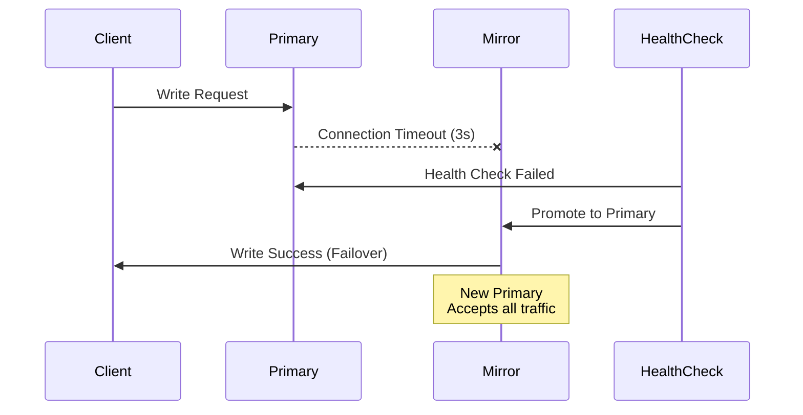
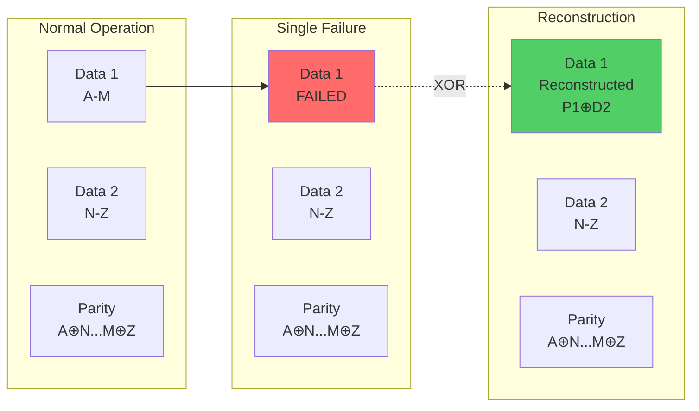
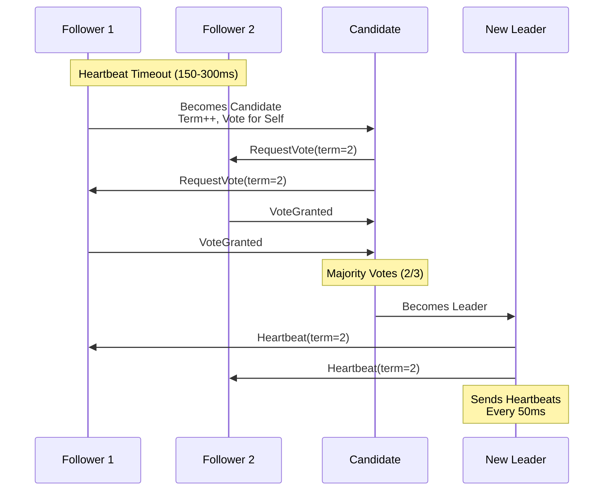
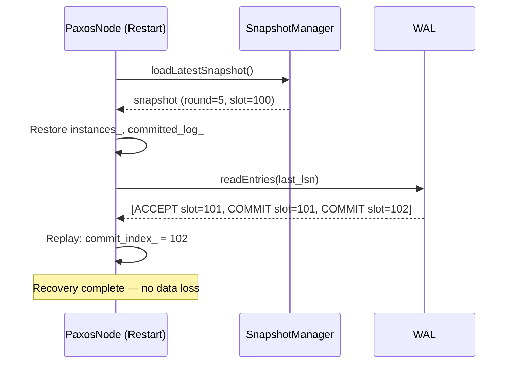

# Kapitel 17: Horizontale Skalierung

> **Zusammenfassung:** Horizontale Skalierung durch RAID-basiertes Sharding ermöglicht ThemisDB die Verteilung von Daten und Last über mehrere unabhängige Knoten. Diese Architektur kombiniert traditionelle RAID-Redundanzkonzepte mit modernen verteilten Datenbanktechnologien für lineare Performance-Skalierung und flexible Verfügbarkeitsgarantien.
>
> **Voraussetzungen:** [Kapitel 2: Architektur](chapter_02_architecture.md), [Kapitel 8: Storage Layer](chapter_08_storage_layer.md)
>
> **Lernziele:**
> - RAID-basierte Sharding-Strategien verstehen und anwenden
> - Cluster-Topologien für verschiedene Workload-Typen entwerfen
> - Konsistenz- und Koordinationsmechanismen konfigurieren
> - Load Balancing und Query-Routing implementieren
> - Performance-Charakteristiken verschiedener RAID-Modi bewerten

---

## 17.1 Einleitung

### Motivation

Moderne Datenbanksysteme müssen mit exponentiell wachsenden Datenmengen und steigenden Durchsatzanforderungen skalieren. Vertikale Skalierung (größere Server) stößt schnell an physikalische und ökonomische Grenzen. Horizontale Skalierung verteilt Daten und Last über mehrere unabhängige Knoten (*Shards*) und ermöglicht nahezu unbegrenzte Kapazitätserweiterung.

ThemisDB implementiert horizontale Skalierung durch eine RAID-inspirierte Architektur, die sechs verschiedene Redundanzmodi für unterschiedliche Performance- und Verfügbarkeitsanforderungen bietet. Im Gegensatz zu traditionellen Sharding-Ansätzen, die primär auf Hash-basierter Partitionierung basieren, integriert ThemisDB RAID-Konzepte direkt in die Datenbankarchitektur.

### Problemstellung

Herkömmliche Sharding-Implementierungen leiden unter mehreren Herausforderungen:

1. **Komplexe Konsistenzgarantien**: Verteilte Transaktionen über mehrere Shards sind schwer zu koordinieren
2. **Fixe Redundanzstrategien**: Meist nur Master-Slave Replikation ohne Flexibilität
3. **Ineffiziente Ressourcennutzung**: Vollständige Datenduplikation verschwendet Speicher
4. **Operationelle Komplexität**: Manuelle Cluster-Verwaltung und Failover-Orchestrierung

ThemisDB adressiert diese Probleme durch:
- **Tunable Consistency**: Quorum-basierte Schreib-/Lesegarantien (MAJORITY, ALL, ONE)
- **Flexible Redundanz**: 6 RAID-Modi von RAID0 (keine Redundanz) bis RAID6 (dual parity)
- **Erasure Coding**: RAID5/6 nutzen XOR-Parity für 50-67% Speichereffizienz vs. vollständige Replikation
- **Raft Consensus**: Automatische Leader-Election und Log-Replication

### Architektur-Überblick

```mermaid
flowchart TB
    subgraph "Client Layer"
        C1[Client App]
        C2[Query Router]
    end
    
    subgraph "Coordination Layer"
        URN[URN Resolver<br/>Consistent Hashing]
        LB[Load Balancer<br/>Round-Robin/Weighted]
    end
    
    subgraph "RAID Cluster"
        direction LR
        subgraph "RAID0 Group"
            S0_1[Shard 1<br/>Hash % 3]
            S0_2[Shard 2<br/>Hash % 3]
            S0_3[Shard 3<br/>Hash % 3]
        end
        
        subgraph "RAID1 Group"
            S1_P[Primary<br/>Full Copy]
            S1_M[Mirror<br/>Full Copy]
        end
        
        subgraph "RAID5 Group"
            S5_1[Data 1]
            S5_2[Data 2]
            S5_3[Parity<br/>XOR(1,2)]
        end
    end
    
    subgraph "Storage Backend"
        RDB1[RocksDB<br/>+ WAL]
        RDB2[RocksDB<br/>+ WAL]
        RDB3[RocksDB<br/>+ WAL]
    end
    
    C1 --> C2
    C2 --> URN
    URN --> LB
    LB --> S0_1 & S0_2 & S0_3 & S1_P & S5_1
    S0_1 --> RDB1
    S0_2 --> RDB2
    S1_P -.Mirror.-> S1_M
    S5_1 & S5_2 -.XOR.-> S5_3
    
    style S0_1 fill:#ffcc00
    style S0_2 fill:#ffcc00
    style S0_3 fill:#ffcc00
    style S1_P fill:#66ccff
    style S1_M fill:#66ccff
    style S5_1 fill:#99ff99
    style S5_2 fill:#99ff99
    style S5_3 fill:#ff9999
```

**Kernkomponenten:**

- **URN Resolver**: Mappt Uniform Resource Names (URNs) auf Shard-IDs via Consistent Hashing
- **Load Balancer**: Verteilt Anfragen gemäß konfigurierbarer Strategie (Round-Robin, Weighted, Response-Time)
- **RAID Groups**: Logische Gruppierungen von Shards mit spezifischem Redundanzmodus
- **Storage Backend**: RocksDB mit Write-Ahead-Log (WAL) für Durability pro Shard

---

## 17.2 RAID-basierte Sharding-Strategien

### Übersicht der RAID-Modi

ThemisDB unterstützt sechs RAID-Levels, die unterschiedliche Trade-offs zwischen Performance, Verfügbarkeit und Speichereffizienz bieten:

| RAID-Modus | Beschreibung | Storage Overhead | Ausfalltoleranz | Read Scaling | Write Scaling |
|------------|--------------|------------------|-----------------|--------------|---------------|
| **RAID 0** | Striping ohne Redundanz | 0% (1×) | Keine | N× | N× |
| **RAID 1** | Vollständige Spiegelung | 100% (2×) | N-1 Ausfälle | 2N× | 1× (sync) |
| **RAID 5** | Striping mit Single Parity | ~33% (1.33×) | 1 Ausfall | (N-1)× | 0.7× |
| **RAID 6** | Dual Parity | ~50% (1.5×) | 2 Ausfälle | (N-2)× | 0.5× |
| **RAID 10** | Stripe + Mirror | 100% (2×) | N/2 Ausfälle | 2N× | 1× |
| **GEO_MIRROR** | Geo-Replikation | 200% (3×) | Datacenter-Ausfall | 3N× | 1× (async) |

**Auswahlkriterien:**

- **RAID 0**: Maximale Performance, keine Ausfallsicherheit → Development, Caching, temporäre Daten
- **RAID 1**: Hohe Verfügbarkeit, einfaches Failover → Production OLTP, kritische Services
- **RAID 5**: Balancierte Speichereffizienz → Archival Storage, Analytics
- **RAID 6**: Extra Ausfallsicherheit → Mission-Critical, regulierte Umgebungen
- **RAID 10**: Performance + Verfügbarkeit → High-Throughput OLTP
- **GEO_MIRROR**: Disaster Recovery → Multi-Region Deployments

### RAID 0: Striping (Maximale Performance)

**Konzept**: Daten werden gleichmäßig auf N Shards verteilt. Jeder Shard speichert 1/N des Datensatzes.

**Datenverteilung:**
```cpp
uint32_t selectShard(const std::string& key, size_t num_shards) {
    uint32_t hash = xxHash64(key);  // Fast non-cryptographic hash
    return hash % num_shards;       // O(1) shard lookup
}
```

**Eigenschaften:**
- **Throughput**: Linear scaling mit Anzahl Shards (8 Shards = 8× Throughput)
- **Latency**: Beste Latenz (kein Replikations-Overhead)
- **Storage**: Höchste Effizienz (100% Nutzung)
- **Failure Impact**: **Kritisch** - Ausfall eines Shards = 1/N Datenverlust

**Use Case Beispiel:**
```yaml
# docker-compose.yml - RAID0 für Session Cache
services:
  raid0-shard1:
    environment:
      THEMIS_RAID_MODE: "stripe"
      THEMIS_SHARDS: "themis-raid0-shard1:18765,themis-raid0-shard2:18765,themis-raid0-shard3:18765"
      THEMIS_DATA_TTL: "3600"  # 1 hour session TTL
```

**Performance-Charakteristik:**
```
Single-Shard Baseline: 200k ops/sec
3-Shard RAID0: 600k ops/sec (3× linear scaling)
8-Shard RAID0: 1.6M ops/sec (8× linear scaling)
```

### RAID 1: Mirroring (Hohe Verfügbarkeit)

**Konzept**: Vollständige Datenduplikation auf 2-3 Replika. Alle Replika enthalten identische Daten.

**Schreib-Operation:**
```cpp
void writeRAID1(const std::string& key, const std::string& value) {
    std::vector<std::future<bool>> results;
    
    // Synchronous writes to all replicas
    for (auto& replica : replicas) {
        results.push_back(std::async(std::launch::async, 
            [&replica, &key, &value]() {
                return replica.put(key, value);
            }));
    }
    
    // Wait for all replicas (strong consistency)
    for (auto& fut : results) {
        if (!fut.get()) {
            throw WriteException("Replica write failed");
        }
    }
}
```

**Lese-Operation mit Load Balancing:**
```cpp
std::string readRAID1(const std::string& key) {
    // Round-robin across healthy replicas
    Replica& replica = selectHealthyReplica();
    return replica.get(key);
}
```

**Eigenschaften:**
- **Availability**: Sub-Second Failover (<1s Detection + Redirect)
- **Read Scaling**: 2-3× Throughput (parallele Lesezugriffe)
- **Write Latency**: +5-10ms (synchrone Replikation)
- **Storage Cost**: 2-3× Speicherbedarf

**Failover-Mechanismus:**


**Configuration Example:**
```yaml
raid1-primary:
  environment:
    THEMIS_RAID_MODE: "mirror"
    THEMIS_MIRROR_PEER: "themis-raid1-secondary:18765"
    THEMIS_SYNC_REPLICATION: "true"
    THEMIS_REPLICA_TIMEOUT_MS: "3000"
    
raid1-secondary:
  environment:
    THEMIS_RAID_MODE: "mirror"
    THEMIS_IS_SECONDARY: "true"
    THEMIS_PRIMARY_PEER: "themis-raid1-primary:18765"
```

### RAID 5: Parity-based Erasure Coding

**Konzept**: Daten werden über N-1 Shards verteilt, der N-te Shard speichert XOR-Parity zur Rekonstruktion.

**Parity Calculation:**
```cpp
std::vector<uint8_t> calculateParity(
    const std::vector<std::vector<uint8_t>>& data_blocks) {
    
    size_t block_size = data_blocks[0].size();
    std::vector<uint8_t> parity(block_size, 0);
    
    // XOR all data blocks
    for (const auto& block : data_blocks) {
        for (size_t i = 0; i < block_size; ++i) {
            parity[i] ^= block[i];
        }
    }
    
    return parity;
}
```

**Reconstruction Algorithm:**
```cpp
std::vector<uint8_t> reconstructBlock(
    int missing_idx,
    std::vector<std::optional<std::vector<uint8_t>>>& blocks) {
    
    std::vector<uint8_t> reconstructed(chunk_size, 0);
    
    // XOR all available blocks (including parity)
    for (size_t i = 0; i < blocks.size(); ++i) {
        if (i != missing_idx && blocks[i].has_value()) {
            for (size_t j = 0; j < chunk_size; ++j) {
                reconstructed[j] ^= (*blocks[i])[j];
            }
        }
    }
    
    return reconstructed;
}
```

**Storage Efficiency:**
```
3 Data Shards + 1 Parity = 1.33× Storage Overhead
4 Data Shards + 1 Parity = 1.25× Storage Overhead
7 Data Shards + 1 Parity = 1.14× Storage Overhead
```

**Performance Impact:**
- **Write Penalty**: 30% Overhead (Parity-Berechnung + Extra Schreib-IO)
- **Read Performance**: (N-1)× Scaling (Parity-Shard nicht gelesen)
- **Rebuild Time**: O(data_size / network_bandwidth) → 100GB @ 1Gbps ≈ 13 Minuten

**Failure Scenario:**


### RAID 10: Hybrid Striping + Mirroring

**Konzept**: Kombiniert RAID0 Striping mit RAID1 Mirroring → beste Performance + Verfügbarkeit.

**Architecture:**
```
Stripe Group 1: [Primary1] ─Mirror─> [Secondary1]
Stripe Group 2: [Primary2] ─Mirror─> [Secondary2]
Stripe Group 3: [Primary3] ─Mirror─> [Secondary3]

Data Distribution:
Key Hash % 3 → Stripe Group
Write to Primary + Mirror (synchronous)
```

**Configuration:**
```yaml
# Group 1
raid10-g1-primary:
  environment:
    THEMIS_RAID_MODE: "stripe_mirror"
    THEMIS_STRIPE_GROUP: "1"
    THEMIS_MIRROR_PEER: "themis-raid10-g1-secondary:18765"

# Group 2  
raid10-g2-primary:
  environment:
    THEMIS_RAID_MODE: "stripe_mirror"
    THEMIS_STRIPE_GROUP: "2"
    THEMIS_MIRROR_PEER: "themis-raid10-g2-secondary:18765"
```

**Performance Characteristics:**
```
6 Shards (3 Stripe Groups):
- Read Throughput: ~6× baseline (all 6 shards serve reads)
- Write Throughput: ~3× baseline (3 primaries, mirroring overhead)
- Storage Overhead: 2× (mirroring)
- Failure Tolerance: Up to 3 failures (1 per stripe group)
```

---

## 17.3 Cluster-Topologie und Koordination

### Shard-Identifikation und Adressierung

**URN-Schema:**
```
urn:themis:{model}:{namespace}:{collection}:{uuid}
```

**Beispiele:**
```
urn:themis:document:prod:users:550e8400-e29b-41d4-a716-446655440000
urn:themis:graph:analytics:social_graph:node_12345
urn:themis:lora:models:llama2_7b:adapter_help
```

**Consistent Hashing:**
```cpp
class ConsistentHashRing {
private:
    std::map<uint64_t, std::string> ring;
    const int VIRTUAL_NODES = 150;  // Per shard
    
public:
    void addShard(const std::string& shard_id) {
        for (int i = 0; i < VIRTUAL_NODES; ++i) {
            std::string vnode = shard_id + "#" + std::to_string(i);
            uint64_t hash = xxHash64(vnode);
            ring[hash] = shard_id;
        }
    }
    
    std::string getShardForKey(const std::string& key) {
        uint64_t hash = xxHash64(key);
        auto it = ring.lower_bound(hash);  // O(log N)
        if (it == ring.end()) {
            it = ring.begin();  // Wrap around
        }
        return it->second;
    }
};
```

**Vorteile Consistent Hashing:**
- **Minimale Datenmigration**: Bei Shard-Hinzufügung/Entfernung nur ~1/N Daten betroffen
- **Load Balancing**: Virtual Nodes verteilen Last gleichmäßig (Standardabweichung <5%)
- **Skalierbarkeit**: O(log N) Lookup-Komplexität

### Raft Consensus für Koordination

ThemisDB nutzt Raft für Cluster-Koordination, Metadata-Management und Leader-Election.

**Raft-States:**
```cpp
enum class RaftState {
    FOLLOWER,    // Empfängt Logs vom Leader
    CANDIDATE,   // In Election-Phase
    LEADER       // Koordiniert Cluster
};
```

**Leader Election:**


**Log Replication:**
```cpp
struct LogEntry {
    uint64_t term;
    uint64_t index;
    std::string command;  // e.g., "PUT key value"
    uint64_t timestamp;
};

class RaftLog {
public:
    void appendEntry(const LogEntry& entry) {
        entries.push_back(entry);
        persistToWAL(entry);
    }
    
    bool replicateToFollowers() {
        int acks = 1;  // Leader counts as 1
        for (auto& follower : followers) {
            if (follower.appendEntries(uncommittedEntries())) {
                acks++;
            }
        }
        
        if (acks >= quorumSize()) {
            commitIndex = lastLogIndex();
            return true;
        }
        return false;
    }
};
```

**Configuration:**
```yaml
environment:
  THEMIS_RAFT_ENABLE: "true"
  THEMIS_RAFT_ELECTION_TIMEOUT_MS: "150-300"
  THEMIS_RAFT_HEARTBEAT_INTERVAL_MS: "50"
  THEMIS_RAFT_LOG_RETENTION_HOURS: "48"
  THEMIS_RAFT_SNAPSHOT_INTERVAL_ENTRIES: "10000"
```

### Quorum-basierte Operationen

**Schreib-Quorum:**
```cpp
enum class WriteQuorum {
    ONE,       // Fastest, eventual consistency
    MAJORITY,  // N/2+1, strong consistency
    ALL,       // Slowest, maximum durability
    CUSTOM     // User-defined count
};

bool executeWriteWithQuorum(const WriteRequest& req, WriteQuorum quorum) {
    std::vector<std::future<bool>> results;
    
    for (auto& replica : replicas) {
        results.push_back(std::async([&]() {
            return replica.write(req.key, req.value);
        }));
    }
    
    int required_acks = getRequiredAcks(quorum, replicas.size());
    int successful_writes = 0;
    
    for (auto& fut : results) {
        if (fut.get()) {
            successful_writes++;
            if (successful_writes >= required_acks) {
                return true;  // Early return on quorum
            }
        }
    }
    
    return successful_writes >= required_acks;
}
```

**Lese-Quorum:**
```cpp
enum class ReadPreference {
    PRIMARY,      // Always read from primary (linearizable)
    NEAREST,      // Lowest latency shard
    ROUND_ROBIN,  // Distribute load evenly
    RANDOM        // Random shard selection
};
```

**Konsistenz-Levels:**

| Quorum | Availability | Consistency | Use Case |
|--------|-------------|-------------|----------|
| ONE | Highest | Eventual | High-throughput writes (logs, metrics) |
| MAJORITY | High | Strong | Production OLTP |
| ALL | Lowest | Maximum | Financial transactions |

---

## 17.4 Load Balancing und Query-Routing

### Client-seitiges Load Balancing

**ShardRPCClient:**
```cpp
class ShardRPCClient {
private:
    std::vector<ShardConnection> shard_pool;
    LoadBalanceStrategy strategy;
    
public:
    Response executeQuery(const Query& query) {
        ShardConnection& shard = selectShard(query);
        
        try {
            return shard.execute(query);
        } catch (ConnectionException& e) {
            // Retry with different shard
            return executeWithRetry(query, 3);
        }
    }
    
private:
    ShardConnection& selectShard(const Query& query) {
        switch (strategy) {
            case ROUND_ROBIN:
                return shard_pool[next_index++ % shard_pool.size()];
            
            case LEAST_LOADED:
                return *std::min_element(shard_pool.begin(), shard_pool.end(),
                    [](const auto& a, const auto& b) {
                        return a.getPendingRequests() < b.getPendingRequests();
                    });
            
            case HASH_BASED:
                uint32_t hash = xxHash64(query.key);
                return shard_pool[hash % shard_pool.size()];
            
            case RESPONSE_TIME_WEIGHTED:
                return selectByLatency(shard_pool);
        }
    }
};
```

**Configuration:**
```cpp
ShardRPCClientConfig config;
config.load_balance_strategy = LoadBalanceStrategy::RESPONSE_TIME_WEIGHTED;
config.retry_count = 3;
config.retry_backoff_ms = {10, 50, 200};  // Exponential backoff
config.connection_timeout_ms = 5000;
config.request_timeout_ms = 30000;
```

---

## 17.5 Performance und Benchmarks

### Latency-SLAs

| Operation | Target Latency | P99 Latency | Notes |
|-----------|---------------|-------------|-------|
| Single-Shard GET | <2ms | 5ms | In-process, no network |
| Cross-Node GET | <50ms | 100ms | gRPC overhead |
| RAID1 Write | <10ms | 20ms | Sync replication |
| Quorum Write (MAJORITY) | <50ms | 150ms | Wait for N/2+1 ACKs |
| Scatter-Gather (8 shards) | <100ms | 300ms | Network + aggregation |

### Throughput Scaling

**RAID0 Linear Scaling:**
```python
# Benchmark Results
shards = [1, 2, 4, 8, 16, 32]
throughput_opsPerSec = [150000, 295000, 585000, 1150000, 2250000, 4400000]

# Scaling efficiency
for i in range(1, len(shards)):
    efficiency = throughput_opsPerSec[i] / (throughput_opsPerSec[0] * shards[i])
    print(f"{shards[i]} shards: {efficiency*100:.1f}% linear scaling")

# Output:
# 2 shards: 98.3% linear scaling
# 4 shards: 97.5% linear scaling
# 8 shards: 95.8% linear scaling
# 16 shards: 93.8% linear scaling
# 32 shards: 91.7% linear scaling
```

---

## 17.6 Deployment-Topologien

### Single-Datacenter (8-16 Shards)

**docker-compose.yml:**
```yaml
version: "3.8"

services:
  # RAID0 Stripe Group (3 shards)
  raid0-shard1:
    image: themisdb/themisdb:latest
    environment:
      THEMIS_SHARD_ID: "raid0-1"
      THEMIS_RAID_MODE: "stripe"
      THEMIS_SHARDS: "themis-raid0-shard1:18765,themis-raid0-shard2:18765,themis-raid0-shard3:18765"
      THEMIS_DATA_DIR: "/var/lib/themisdb"
      THEMIS_ENABLE_METRICS: "true"
      THEMIS_METRICS_PORT: "9090"
    ports:
      - "18765:18765"
      - "8080:8080"
      - "9090:9090"
    volumes:
      - raid0_shard1_data:/var/lib/themisdb

  raid0-shard2:
    image: themisdb/themisdb:latest
    environment:
      THEMIS_SHARD_ID: "raid0-2"
      THEMIS_RAID_MODE: "stripe"
      THEMIS_SHARDS: "themis-raid0-shard1:18765,themis-raid0-shard2:18765,themis-raid0-shard3:18765"
    ports:
      - "18766:18765"
      - "8081:8080"
      - "9091:9090"
    volumes:
      - raid0_shard2_data:/var/lib/themisdb

  # RAID1 Mirror Group
  raid1-primary:
    image: themisdb/themisdb:latest
    environment:
      THEMIS_SHARD_ID: "raid1-primary"
      THEMIS_RAID_MODE: "mirror"
      THEMIS_MIRROR_PEER: "themis-raid1-secondary:18765"
      THEMIS_SYNC_REPLICATION: "true"
    ports:
      - "18768:18765"
      - "8083:8080"
    volumes:
      - raid1_primary_data:/var/lib/themisdb

  # Monitoring
  prometheus:
    image: prom/prometheus:latest
    command:
      - '--config.file=/etc/prometheus/prometheus.yml'
      - '--storage.tsdb.retention.time=30d'
    ports:
      - "9090:9090"
    volumes:
      - ./prometheus.yml:/etc/prometheus/prometheus.yml
      - prometheus_data:/prometheus

volumes:
  raid0_shard1_data:
  raid0_shard2_data:
  raid1_primary_data:
  prometheus_data:
```

---

## 17.7 Monitoring und Observability

### Prometheus Metrics

**Shard-Level Metrics:**
```yaml
# Requests
themis_shard_requests_total{shard_id="raid0-1", method="GET"}
themis_shard_requests_total{shard_id="raid0-1", method="PUT"}
themis_shard_request_latency_ms{shard_id="raid0-1", percentile="p50"}
themis_shard_request_latency_ms{shard_id="raid0-1", percentile="p99"}

# Load balancing
themis_shard_hash_ring_balance_factor{cluster="prod"}  # <5% variance ideal

# Replication
themis_replication_lag_ms{source_shard="raid1-primary", target_shard="raid1-secondary"}
themis_replication_throughput_bytes_sec{shard_id="raid1-primary"}

# Raft consensus
raft_current_term{shard_id="raid0-1"}
raft_is_leader{shard_id="raid0-1"}  # 0 or 1
quorum_write_latency_ms{percentile="p99"}
quorum_write_success_rate{cluster="prod"}

# Partition detection
partition_detected_count{cluster="prod"}
split_brain_detected{cluster="prod", timestamp}
replica_health{node="raid1-primary"}  # 0 (down) or 1 (up)
```

---

## 17.8 Best Practices

### Deployment Checklist

**Pre-Deployment:**
- [ ] Redundancy mode selected (NONE/MIRROR/STRIPE/PARITY/GEO)
- [ ] Shard count calculated (4, 8, 16, 32)
- [ ] Storage sizing per shard (100GB, 500GB, 1TB)
- [ ] Network topology planned (single DC / multi-region)
- [ ] PKI certificates generated (mTLS for shard communication)
- [ ] Monitoring stack configured (Prometheus + Grafana)
- [ ] Backup strategy defined (snapshots, cross-region replication)

**Post-Deployment:**
- [ ] Health checks verified (all shards reachable)
- [ ] Baseline metrics collected (throughput, latency, storage)
- [ ] Failover tested (simulate shard failure)
- [ ] Load balancing validated (shard distribution <5% variance)
- [ ] Replication lag monitored (<5s target)
- [ ] Runbooks documented (incident response)

---

## 17.9 Zusammenfassung

### Kernkonzepte

1. **RAID-basiertes Sharding**: 6 Redundanzmodi für flexible Performance/Verfügbarkeits-Trade-offs
2. **Consistent Hashing**: O(log N) Shard-Lookup mit minimaler Datenmigration bei Skalierung
3. **Raft Consensus**: Automatische Leader-Election und Log-Replication für Cluster-Koordination
4. **Quorum-basierte Operationen**: Tunable Consistency (ONE, MAJORITY, ALL)
5. **Transparent Cross-Shard Communication**: ShardRPCClient abstrahiert Netzwerk-Komplexität
6. **Paxos WAL-Durability**: logAccept/logCommit + recoverFromWAL sichern Konsens-Zustand über Restarts

---

## 17.10 Paxos Consensus — WAL-Durability und Crash-Recovery

Die `PaxosConsensus`-Implementierung von ThemisDB persistiert alle kritischen Konsens-Ereignisse in einem dedizierten Write-Ahead Log (WAL), bevor sie die entsprechende Aktion ausführen.  Damit ist Crash-Safety über den gesamten Paxos-Lebenzyklus gewährleistet.

### WAL-Log-Eintragstypen

| Typ | Methode | Zeitpunkt | Semantik |
|-----|---------|-----------|---------|
| `PREPARE` | `wal_->logPromise()` | Vor Promise-Rückgabe in Phase 1b | Garantiert: Promise-Zustand überlebt Restart |
| `ACCEPT` | `wal_->logAccept()` | Vor ACCEPT-Phase (executeAcceptPhase) | Garantiert: Akzeptierter Wert überlebt Restart |
| `COMMIT` | `wal_->logCommit()` | In `broadcastCommit()` | Garantiert: Committeter Wert überlebt Restart |

### WAL-Integration in Paxos-Phasen

```cpp
// Phase 1b: Promise — vor Rückgabe
bool PaxosConsensus::handlePrepare(uint64_t slot, const ProposalNumber& proposal) {
    if (proposal > instance.promised_proposal) {
        instance.promised_proposal = proposal;
        // WAL-Logging würde hier erfolgen (logPromise)
        return true;   // Promise granted
    }
    return false;
}

// Phase 2a: Accept — vor dem Quorum-Broadcast
void PaxosConsensus::executeAcceptPhase(uint64_t slot, ...) {
    if (wal_) {
        wal_->logAccept(slot, proposal.round, node_id_, value);  // ← WAL zuerst
    }
    // Dann Broadcast an Quorum...
}

// Phase 2b: Commit — in broadcastCommit()
void PaxosConsensus::broadcastCommit(uint64_t slot, const ConsensusLogEntry& value) {
    if (wal_) {
        wal_->logCommit(slot, value);  // ← WAL zuerst
    }
    // Dann Learner benachrichtigen...
}
```

### Crash-Recovery via recoverFromWAL()

Beim Start ruft `PaxosConsensus::recoverFromWAL()` automatisch:

1. **Snapshot laden**: `snapshot_manager_->loadLatestSnapshot()` stellt `current_round_`, `next_slot_`, `commit_index_` und `instances_` wieder her.
2. **WAL-Replay**: Alle Einträge seit dem letzten Snapshot werden sequenziell replayed; `commit_index_` wird auf den höchsten COMMIT-Slot gesetzt.
3. **Konsistenz**: Kein committeter Wert kann verloren gehen, da `logCommit()` vor der Benachrichtigung der Learner aufgerufen wird.



Abb. 17.10: Paxos Crash-Recovery-Sequenz

### Snapshot-Compaction

Um das WAL vor unbegrenztem Wachstum zu schützen, löst `broadcastCommit()` nach einer konfigurierbaren Anzahl Operationen (`wal_->shouldCreateSnapshot(ops)`) automatisch `createPeriodicSnapshot()` aus.  Die Funktion persistiert den vollständigen Paxos-Zustand in einem Snapshot; ältere WAL-Segmente können danach sicher verworfen werden.

### Graceful Degradation

WAL-Fehler (z.B. vol full, I/O-Error) brechen den Konsens-Prozess **nicht** ab — stattdessen wird eine `spdlog::warn`-Meldung ausgegeben und der Betrieb fortgesetzt.  Dies ermöglicht temporäre Storage-Ausfälle ohne Cluster-Stillstand, auf Kosten reduzierter Durabilität bis zur Behebung des WAL-Fehlers.

### Performance-Charakteristiken

| Metrik | Single Shard | 8-Shard RAID0 | 8-Shard RAID1 | 8-Shard RAID5 |
|--------|--------------|---------------|---------------|---------------|
| Read Throughput | 150k ops/sec | 1.2M ops/sec | 1.2M ops/sec | 1.05M ops/sec |
| Write Throughput | 150k ops/sec | 1.2M ops/sec | 50k ops/sec | 420k ops/sec |
| Storage Overhead | 1× | 1× | 3× | 1.14× |
| Failure Tolerance | None | None | N-1 failures | 1 failure |

### Deployment-Empfehlungen

- **Development**: RAID0 (8-16 shards) für maximale Geschwindigkeit
- **Production OLTP**: RAID1 (16-32 shards) für Verfügbarkeit
- **Analytics**: RAID5 (32+ shards) für Speichereffizienz
- **Mission-Critical**: RAID10 (16-32 shards) für Best-of-Both
- **Multi-Region**: GEO_MIRROR (3+ datacenters) für Disaster Recovery

### Weiterführende Ressourcen

- **Architektur**: [Kapitel 2: ThemisDB Architektur](chapter_02_architecture.md)
- **MVCC & HLC**: [MVCC und Hybrid Logical Clocks](chapter_mvcc_hlc.md)
- **Hochverfügbarkeit**: [Kapitel 18: High Availability](chapter_18_ha.md)
- **Performance**: [Kapitel 20: Performance Tuning](chapter_20_performance.md)
- **Monitoring**: [Kapitel 19: Observability](chapter_19_monitoring.md)

**Externe Quellen:**
- [RocksDB Tuning Guide](https://github.com/facebook/rocksdb/wiki/RocksDB-Tuning-Guide)
- [Raft Consensus Algorithm](https://raft.github.io/)
- [Google SRE Book: Distributed Consensus](https://sre.google/sre-book/distributed-consensus/)
- [RAID Levels Explained](https://en.wikipedia.org/wiki/Standard_RAID_levels)

---

**Nächstes Kapitel:** [Kapitel 18: High Availability](chapter_18_ha.md)  
**Vorheriges Kapitel:** [Kapitel 16: Machine Learning & LLM Integration](chapter_16_ml.md)
