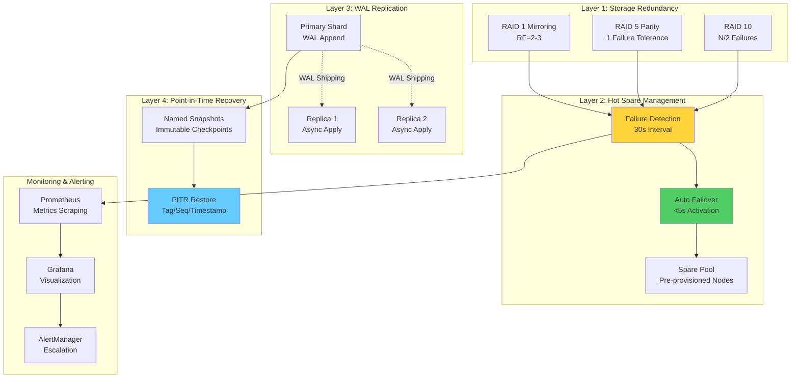
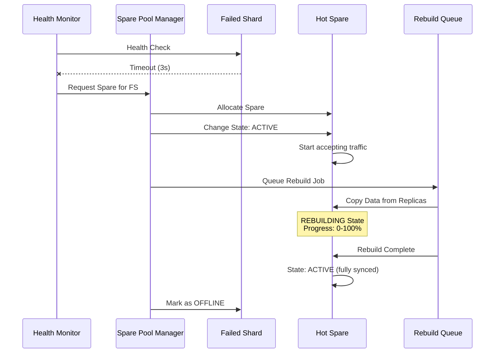

# Kapitel 18: Hochverfügbarkeit (High Availability)

> **Zusammenfassung:** Hochverfügbarkeit in ThemisDB kombiniert RAID-basierte Redundanz, automatisierte Failover-Mechanismen, Hot-Spare-Management und Point-in-Time-Recovery für minimale Downtime und Datenverlustrisiken. Das System erreicht Sub-Second-Failover bei RAID1-Konfigurationen und bietet flexible Recovery-Strategien für verschiedene Fehlerszenarien.
>
> **Voraussetzungen:** [Kapitel 2: Architektur](chapter_02_architecture.md), [Kapitel 17: Horizontal Scaling](chapter_17_scaling.md)
>
> **Lernziele:**
> - Replikationsmechanismen und WAL-basierte Synchronisation verstehen
> - Automatisierte Failover-Strategien konfigurieren und testen
> - Hot-Spare-Pools für proaktive Redundanz verwalten
> - Health-Monitoring-Systeme implementieren
> - Point-in-Time-Recovery für Disaster Recovery nutzen
> - Netzwerkpartitionen erkennen und behandeln

---

## 18.1 Einleitung

### Motivation

Hochverfügbarkeit (*High Availability*, HA) ist für produktive Datenbanksysteme kritisch. Ausfallzeiten führen zu Umsatzverlusten, reputationsschädigenden Incidents und regulatorischen Compliance-Problemen. ThemisDB implementiert mehrschichtige HA-Mechanismen, die von Storage-Level-Redundanz (RAID) bis zu Application-Level-Recovery (PITR) reichen.

**Klassische HA-Anforderungen:**
- **Availability SLA**: 99.9% (8.76h Downtime/Jahr) bis 99.999% (5.26min Downtime/Jahr)
- **Recovery Time Objective (RTO)**: Zeit bis zur Wiederherstellung des Betriebs
- **Recovery Point Objective (RPO)**: Maximaler akzeptabler Datenverlust
- **Failure Detection**: Automatische und schnelle Erkennung von Ausfällen
- **Graceful Degradation**: System bleibt bei Teil-Ausfällen funktionsfähig

### ThemisDB HA-Architektur



**Layered Defense:**
1. **Storage Layer**: RAID-Redundanz für Hardware-Ausfälle
2. **Cluster Layer**: Hot-Spare-Aktivierung für schnelle Recovery
3. **Replication Layer**: WAL-Shipping für asynchrone Backup-Replikate
4. **Application Layer**: PITR für logische Fehler und Compliance

---

## 18.2 RAID-basierte Redundanz und Failover

### RAID-Modi und Ausfalltoleranz

ThemisDB nutzt RAID-Konzepte für Hardware-Redundanz. Detaillierte Beschreibungen siehe [Kapitel 17: Horizontal Scaling](chapter_17_scaling.md).

**Failover-Charakteristiken nach RAID-Modus:**

| RAID-Modus | Ausfalltoleranz | Failover-Zeit | Datenverlust | Recovery-Komplexität |
|------------|-----------------|---------------|--------------|---------------------|
| **RAID 0** | ❌ Keine | N/A | 1/N Dataset | ⚠️ Unmöglich ohne Backup |
| **RAID 1** | ✅ N-1 Failures | <1s | ✅ Keiner | ✅ Trivial (redirect) |
| **RAID 5** | ✅ 1 Failure | <5s (degraded) | ✅ Keiner | ⚠️ Rebuild erforderlich (O(hours)) |
| **RAID 6** | ✅ 2 Failures | <5s (degraded) | ✅ Keiner | ⚠️ Rebuild erforderlich (O(hours)) |
| **RAID 10** | ✅ N/2 Failures | <1s | ✅ Keiner | ✅ Per-Group Redirect |

### RAID 1: Sub-Second Failover

**Architektur:**
```
Primary Shard (Active)  ──Sync Replication──>  Mirror Shard (Standby)
     │                                               │
   Failure                                        Promoted
     │                                               │
     v                                               v
[Health Check Timeout: 3s]                   [New Primary: <1s]
```

**Implementierung:**
```cpp
class RAID1FailoverManager {
private:
    std::vector<ShardNode> replicas;
    ShardHealthMonitor health_monitor;
    std::chrono::seconds health_check_interval{3};
    
public:
    void detectAndFailover() {
        for (auto& replica : replicas) {
            if (!health_monitor.checkShard(replica.id)) {
                health_monitor.recordFailure(replica.id);
                
                if (replica.role == ShardRole::PRIMARY) {
                    auto& mirror = findHealthyMirror(replica.id);
                    promoteMirrorToPrimary(mirror);
                    redirectClientTraffic(mirror);
                    
                    log("Failover complete: Mirror {} promoted to Primary", 
                        mirror.id);
                }
            }
        }
    }
    
private:
    void promoteMirrorToPrimary(ShardNode& mirror) {
        mirror.role = ShardRole::PRIMARY;
        mirror.acceptsWrites = true;
        updateClusterTopology(mirror);
    }
    
    void redirectClientTraffic(ShardNode& new_primary) {
        // Update load balancer routing
        load_balancer.updatePrimaryMapping(new_primary.id);
        
        // Inform clients via DNS/service discovery
        service_registry.updatePrimary(new_primary.address);
    }
};
```

**Failover Timeline:**
```
T+0s:    Primary shard crashes
T+3s:    Health check timeout triggers
T+3.5s:  Mirror promoted to primary
T+4s:    Load balancer updated
T+4.5s:  Client requests routed to new primary
```

**Production SLA:**
- **Detection Time**: <30 seconds (configurable health check interval)
- **Failover Time**: <5 seconds (promotion + routing update)
- **Total Downtime**: <35 seconds (typ. <10s with aggressive intervals)
- **Data Loss**: Zero (synchronous replication)

### RAID 5: Parity-Based Recovery

**Single-Shard-Failure Recovery:**
```cpp
class RAID5RecoveryManager {
public:
    void handleShardFailure(int failed_shard_id) {
        // Enter degraded mode: Reconstruct reads on-the-fly
        raid_mode = RAIDMode::DEGRADED;
        log("RAID5: Shard {} failed, entering degraded mode", failed_shard_id);
        
        // Start background rebuild
        auto spare = hot_spare_manager.allocateSpare();
        std::thread rebuild_thread([this, failed_shard_id, spare]() {
            rebuildFailedShard(failed_shard_id, spare);
        });
        rebuild_thread.detach();
    }
    
private:
    void rebuildFailedShard(int failed_id, ShardNode spare) {
        auto data_shards = getHealthyDataShards();
        auto parity_shard = getParityShard();
        
        size_t total_chunks = calculateTotalChunks();
        size_t chunks_rebuilt = 0;
        
        for (size_t chunk_idx = 0; chunk_idx < total_chunks; ++chunk_idx) {
            // Read corresponding chunks from all other shards
            std::vector<std::optional<std::vector<uint8_t>>> chunks;
            for (auto& shard : data_shards) {
                if (shard.id != failed_id) {
                    chunks.push_back(shard.readChunk(chunk_idx));
                } else {
                    chunks.push_back(std::nullopt);  // Missing chunk
                }
            }
            chunks.push_back(parity_shard.readChunk(chunk_idx));
            
            // XOR-based reconstruction
            auto reconstructed = reconstructChunk(failed_id, chunks);
            spare.writeChunk(chunk_idx, reconstructed);
            
            chunks_rebuilt++;
            if (chunks_rebuilt % 1000 == 0) {
                updateRebuildProgress(failed_id, 
                    (float)chunks_rebuilt / total_chunks * 100);
            }
        }
        
        // Verify integrity
        if (verifyShardIntegrity(spare)) {
            replaceFailedShard(failed_id, spare);
            raid_mode = RAIDMode::NORMAL;
            log("RAID5: Rebuild complete, shard {} replaced", failed_id);
        } else {
            log("ERROR: Rebuild failed integrity check");
        }
    }
    
    std::vector<uint8_t> reconstructChunk(
        int missing_idx,
        const std::vector<std::optional<std::vector<uint8_t>>>& chunks) {
        
        std::vector<uint8_t> result(chunk_size, 0);
        
        // XOR all available chunks (including parity)
        for (size_t i = 0; i < chunks.size(); ++i) {
            if (i != missing_idx && chunks[i].has_value()) {
                for (size_t j = 0; j < chunk_size; ++j) {
                    result[j] ^= (*chunks[i])[j];
                }
            }
        }
        
        return result;
    }
};
```

**Rebuild Performance:**
```
Scenario: 100GB shard, 4 data shards + 1 parity, 1Gbps network

Rebuild Throughput: ~100 MB/s (network saturated)
Total Time: 100GB / 100MB/s = ~1000s ≈ 17 minutes

With throttling (50% bandwidth):
Rebuild Throughput: ~50 MB/s
Total Time: ~33 minutes
```

### Cascading Failure Prevention

**Circuit Breaker Pattern:**
```cpp
class RecoveryCircuitBreaker {
private:
    int concurrent_rebuilds = 0;
    int max_concurrent_rebuilds = 2;
    float healthy_shard_threshold = 0.5;  // 50%
    
public:
    bool allowRebuild() {
        float healthy_ratio = getHealthyShardRatio();
        
        if (healthy_ratio < healthy_shard_threshold) {
            log("WARNING: <50% shards healthy, pausing rebuilds");
            return false;  // Too many failures, don't stress cluster
        }
        
        if (concurrent_rebuilds >= max_concurrent_rebuilds) {
            log("WARNING: Max concurrent rebuilds reached");
            return false;
        }
        
        return true;
    }
    
    void startRebuild() {
        concurrent_rebuilds++;
    }
    
    void finishRebuild() {
        concurrent_rebuilds--;
    }
};
```

**Staged Recovery Strategy:**
```
Phase 1: Wait for stabilization (60s)
  - Verify no additional failures
  - Check network stability
  - Confirm spare availability

Phase 2: Recover critical shards (Priority P0)
  - Primary shards first
  - Limit to 1 concurrent rebuild

Phase 3: Recover secondary shards (Priority P1)
  - Replicas and mirrors
  - Limit to 2 concurrent rebuilds

Phase 4: Verify integrity
  - Checksum validation
  - Read test all recovered shards
  - Update cluster topology
```

---

## 18.3 Hot-Spare-Management

### Konzept und Architektur

Hot Spares sind pre-provisioned Shards, die im Standby-Modus laufen und bei Bedarf innerhalb von Sekunden aktiviert werden können.

**Spare States:**
```cpp
enum class SpareState {
    AVAILABLE,    // Ready for assignment
    ACTIVE,       // Replacing failed shard
    REBUILDING,   // Syncing data
    OFFLINE       // Maintenance/failed
};

struct HotSpare {
    std::string spare_id;
    SpareState state;
    std::optional<std::string> assigned_to_shard;  // If active
    float rebuild_progress_percent;
    std::chrono::milliseconds rebuild_eta;
};
```

**Architecture:**


### Implementierung

**HotSpareManager:**
```cpp
class HotSpareManager {
private:
    std::vector<HotSpare> spare_pool;
    std::mutex pool_mutex;
    std::queue<RebuildJob> rebuild_queue;
    HotSpareConfig config;
    
public:
    HotSpareManager(HotSpareConfig cfg) : config(std::move(cfg)) {
        initializeSparePool();
    }
    
    std::optional<HotSpare> allocateSpare() {
        std::lock_guard lock(pool_mutex);
        
        auto it = std::find_if(spare_pool.begin(), spare_pool.end(),
            [](const HotSpare& spare) {
                return spare.state == SpareState::AVAILABLE;
            });
        
        if (it != spare_pool.end()) {
            it->state = SpareState::ACTIVE;
            log("Allocated spare: {}", it->spare_id);
            return *it;
        }
        
        log("ERROR: No available spares in pool");
        return std::nullopt;
    }
    
    void queueRebuild(const std::string& spare_id, 
                       const std::string& failed_shard_id) {
        RebuildJob job{spare_id, failed_shard_id, 
                        config.rebuild_priority};
        
        {
            std::lock_guard lock(pool_mutex);
            rebuild_queue.push(job);
        }
        
        // Start rebuild worker if not running
        if (!rebuild_worker_active) {
            startRebuildWorker();
        }
    }
    
private:
    void startRebuildWorker() {
        rebuild_worker_active = true;
        
        std::thread worker([this]() {
            while (!rebuild_queue.empty()) {
                RebuildJob job = rebuild_queue.front();
                rebuild_queue.pop();
                
                auto spare = findSpare(job.spare_id);
                spare->state = SpareState::REBUILDING;
                spare->rebuild_progress_percent = 0.0;
                
                // Actual rebuild logic
                performRebuild(job, *spare);
                
                spare->rebuild_progress_percent = 100.0;
                spare->state = SpareState::ACTIVE;
            }
            rebuild_worker_active = false;
        });
        
        worker.detach();
    }
    
    void performRebuild(const RebuildJob& job, HotSpare& spare) {
        auto replicas = findHealthyReplicasFor(job.failed_shard_id);
        size_t total_docs = estimateTotalDocuments(replicas[0]);
        size_t docs_copied = 0;
        
        // Throttled copy with progress tracking
        for (auto& doc : replicas[0].iterateDocuments()) {
            spare.writeDocument(doc);
            docs_copied++;
            
            if (docs_copied % 1000 == 0) {
                float progress = (float)docs_copied / total_docs * 100;
                spare.rebuild_progress_percent = progress;
                spare.rebuild_eta = estimateETA(docs_copied, total_docs);
                
                // Throttle based on config
                if (config.rebuild_throttle_mbps > 0) {
                    std::this_thread::sleep_for(
                        calculateThrottleDelay(doc.size()));
                }
            }
        }
    }
};
```

### Configuration

**HotSpareConfig:**
```yaml
hot_spare:
  enable: true
  spare_shards:
    - "themis-spare-1:18765"
    - "themis-spare-2:18765"
    - "themis-spare-3:18765"
  auto_rebuild: true
  rebuild_priority: MEDIUM  # LOW, MEDIUM, HIGH, CRITICAL
  rebuild_throttle_mbps: 100  # Bandwidth limit
  health_check_interval_seconds: 30
  max_concurrent_rebuilds: 2
```

**Configuration via Environment Variables:**
```bash
THEMIS_HOT_SPARE_ENABLE=true
THEMIS_HOT_SPARE_SPARES="spare-1:18765,spare-2:18765"
THEMIS_HOT_SPARE_AUTO_REBUILD=true
THEMIS_HOT_SPARE_REBUILD_PRIORITY=MEDIUM
THEMIS_HOT_SPARE_THROTTLE_MBPS=100
```

### Monitoring

**Prometheus Metrics:**
```yaml
# Spare pool status
themis_hot_spare_spares_available
themis_hot_spare_spares_active
themis_hot_spare_spares_rebuilding
themis_hot_spare_spares_offline

# Failover metrics
themis_hot_spare_total_failovers
themis_hot_spare_avg_failover_time_ms

# Rebuild metrics
themis_hot_spare_rebuild_progress{shard}  # 0-100
themis_hot_spare_rebuild_eta_seconds{shard}
themis_hot_spare_rebuilds_successful_total
themis_hot_spare_rebuilds_failed_total
```

**Grafana Dashboard Query:**
```promql
# Spare pool utilization
sum(themis_hot_spare_spares_available) / 
  (sum(themis_hot_spare_spares_available) + 
   sum(themis_hot_spare_spares_active) + 
   sum(themis_hot_spare_spares_rebuilding)) * 100

# Average failover time (should be <5s)
avg_over_time(themis_hot_spare_avg_failover_time_ms[5m]) / 1000

# Rebuilds in progress
sum(themis_hot_spare_spares_rebuilding)
```

---

## 18.4 WAL-basierte Replikation

### Write-Ahead Log (WAL) Architektur

ThemisDB nutzt WAL für asynchrone Replikation zu Backup-Shards. Der WAL garantiert Durability (ACID-D) und ermöglicht konsistente Replika-Synchronisation.

**WAL Structure:**
```
┌─────────────────────────────────────────────────────┐
│ WAL Segment 00000001                                │
├─────────────────────────────────────────────────────┤
│ LSN (Segment, Offset)   Op Type    Key      Value  │
│ (1, 0)                  PUT         user:1   {...}  │
│ (1, 128)                DELETE      user:2   -      │
│ (1, 256)                PUT         user:3   {...}  │
│ ...                                                  │
│ (1, 65536)              [Segment Full → Roll]       │
└─────────────────────────────────────────────────────┘
```

**Log Sequence Number (LSN):**
```cpp
struct LSN {
    uint64_t segment_id;   // WAL segment file number
    uint64_t offset;       // Byte offset within segment
    
    bool operator<(const LSN& other) const {
        if (segment_id != other.segment_id) {
            return segment_id < other.segment_id;
        }
        return offset < other.offset;
    }
};
```

### Replication Components

**1. WAL Manager (Primary):**
```cpp
class WALManager {
private:
    std::string wal_dir;
    uint64_t current_segment_id = 1;
    std::fstream current_segment;
    LSN last_flushed_lsn;
    
public:
    LSN appendEntry(OpType op, const std::string& key, 
                     const std::string& value) {
        WALEntry entry{op, key, value, std::time(nullptr)};
        
        // Serialize entry
        std::vector<uint8_t> serialized = serializeEntry(entry);
        
        // Write to current segment
        LSN lsn{current_segment_id, current_segment.tellp()};
        current_segment.write(reinterpret_cast<const char*>(serialized.data()), 
                               serialized.size());
        current_segment.flush();  // fsync for durability
        
        last_flushed_lsn = lsn;
        
        // Roll segment if size limit reached
        if (current_segment.tellp() >= MAX_SEGMENT_SIZE) {
            rollSegment();
        }
        
        return lsn;
    }
    
private:
    void rollSegment() {
        current_segment.close();
        current_segment_id++;
        std::string filename = wal_dir + "/wal_" + 
                                std::to_string(current_segment_id) + ".log";
        current_segment.open(filename, std::ios::out | std::ios::binary);
    }
};
```

**2. WAL Shipper (Async Batch Sender):**
```cpp
class WALShipper {
private:
    WALManager& wal_manager;
    std::vector<ReplicaEndpoint> replicas;
    std::chrono::milliseconds ship_interval{100};  // 100ms batching
    std::map<std::string, LSN> replica_ack_lsn;  // Last ACK'd LSN per replica
    
public:
    void startShipping() {
        std::thread shipper_thread([this]() {
            while (true) {
                std::this_thread::sleep_for(ship_interval);
                shipPendingEntries();
            }
        });
        shipper_thread.detach();
    }
    
private:
    void shipPendingEntries() {
        for (auto& replica : replicas) {
            LSN replica_last_ack = replica_ack_lsn[replica.id];
            LSN primary_last_flush = wal_manager.getLastFlushedLSN();
            
            if (replica_last_ack < primary_last_flush) {
                // Read entries between replica_last_ack and primary_last_flush
                auto entries = wal_manager.readEntries(replica_last_ack, 
                                                        primary_last_flush);
                
                // Compress and send
                auto compressed = compressEntries(entries, CompressionType::ZSTD);
                
                // HTTP POST to replica
                auto response = replica.postWALBatch(compressed);
                
                if (response.status == 200) {
                    replica_ack_lsn[replica.id] = primary_last_flush;
                } else {
                    log("WARNING: Replica {} failed to apply WAL batch", 
                        replica.id);
                }
            }
        }
    }
};
```

**3. WAL Applier (Replica):**
```cpp
class WALApplier {
private:
    LSN last_applied_lsn;
    std::map<std::string, std::string> kv_store;  // Simplified storage
    
public:
    HTTP::Response applyWALBatch(const std::vector<uint8_t>& compressed_batch) {
        // Decompress
        auto entries = decompressEntries(compressed_batch);
        
        for (const auto& entry : entries) {
            // Idempotency check
            if (entry.lsn <= last_applied_lsn) {
                continue;  // Already applied, skip
            }
            
            // Validate LSN ordering
            if (entry.lsn.segment_id < last_applied_lsn.segment_id ||
                (entry.lsn.segment_id == last_applied_lsn.segment_id &&
                 entry.lsn.offset <= last_applied_lsn.offset)) {
                log("ERROR: Out-of-order LSN detected");
                return HTTP::Response{500, "Out-of-order WAL entry"};
            }
            
            // Apply operation
            switch (entry.op_type) {
                case OpType::PUT:
                    kv_store[entry.key] = entry.value;
                    break;
                case OpType::DELETE:
                    kv_store.erase(entry.key);
                    break;
            }
            
            last_applied_lsn = entry.lsn;
        }
        
        return HTTP::Response{200, "WAL batch applied successfully"};
    }
};
```

### Replication Modes

**Write Concerns:**
```cpp
enum class WriteConcern {
    ONE,       // Return after primary write (async replication)
    MAJORITY,  // Return after quorum ACK (N/2+1 replicas)
    ALL        // Return after all replicas ACK
};

void writeWithConcern(const std::string& key, const std::string& value,
                       WriteConcern concern) {
    // Step 1: Append to primary WAL
    LSN lsn = wal_manager.appendEntry(OpType::PUT, key, value);
    
    // Step 2: Replicate based on write concern
    switch (concern) {
        case WriteConcern::ONE:
            return;  // Async shipping handles replication
        
        case WriteConcern::MAJORITY:
            {
                int required_acks = (replicas.size() + 1) / 2;  // +1 for primary
                int acks = 1;  // Primary counts as 1
                
                for (auto& replica : replicas) {
                    if (replica.waitForLSN(lsn, std::chrono::seconds(5))) {
                        acks++;
                        if (acks >= required_acks) {
                            return;  // Quorum reached
                        }
                    }
                }
                
                throw WriteException("Failed to achieve write quorum");
            }
        
        case WriteConcern::ALL:
            for (auto& replica : replicas) {
                if (!replica.waitForLSN(lsn, std::chrono::seconds(10))) {
                    throw WriteException("Failed to replicate to all replicas");
                }
            }
            break;
    }
}
```

### Compression

**Supported Algorithms:**
- **Zstd**: Best compression ratio (~40-60% reduction), moderate CPU
- **LZ4**: Fast compression (~20-30% reduction), low CPU
- **None**: No compression (for low-latency requirements)

**Configuration:**
```yaml
replication:
  shipper_enabled: true
  compression: zstd  # zstd, lz4, none
  compression_level: 3  # 1 (fast) - 9 (best)
  batch_size: 100  # Entries per batch
  ship_interval_ms: 100  # Batching interval
```

---

## 18.5 Point-in-Time Recovery (PITR)

### Konzept

PITR ermöglicht die Wiederherstellung der Datenbank zu einem beliebigen Zeitpunkt in der Vergangenheit. Dies ist kritisch für:
- **Data Corruption Recovery**: Rückgängigmachung fehlerhafter Schreiboperationen
- **Schema Migration Rollback**: Zurücksetzen nach fehlgeschlagenen Migrations
- **Compliance & Auditing**: Nachvollziehbarkeit historischer Zustände
- **Testing**: Sichere Testumgebungen durch Snapshot-Cloning

### Architektur

**Snapshot-Hierarchie:**
```
Database State Timeline
├─ Snapshot 1: "before_migration" (Tag: Q1_Migration, Seq: 10000)
│  └─ Immutable Checkpoint: All data at LSN (1, 10000)
│
├─ Snapshot 2: "after_migration" (Tag: Q1_Migration_Complete, Seq: 15000)
│  └─ Immutable Checkpoint: All data at LSN (1, 15000)
│
└─ Current State (LSN: 1, 20000)
```

### Implementierung

**Snapshot Manager:**
```cpp
class SnapshotManager {
private:
    std::map<std::string, Snapshot> tagged_snapshots;
    std::vector<Snapshot> sequence_snapshots;
    std::string snapshot_dir;
    
public:
    void createTag(const std::string& tag, const std::string& description) {
        Snapshot snapshot;
        snapshot.tag = tag;
        snapshot.description = description;
        snapshot.lsn = wal_manager.getLastFlushedLSN();
        snapshot.timestamp = std::time(nullptr);
        snapshot.size_bytes = calculateSnapshotSize();
        
        // Create hard-link snapshot (CoW-friendly)
        std::string snapshot_path = snapshot_dir + "/" + tag;
        createHardLinkSnapshot(snapshot_path);
        
        tagged_snapshots[tag] = snapshot;
        
        log("Created snapshot: {} at LSN ({}, {})", 
            tag, snapshot.lsn.segment_id, snapshot.lsn.offset);
    }
    
    std::vector<Snapshot> listTags(bool include_metadata) const {
        std::vector<Snapshot> snapshots;
        for (const auto& [tag, snapshot] : tagged_snapshots) {
            snapshots.push_back(snapshot);
        }
        return snapshots;
    }
    
private:
    void createHardLinkSnapshot(const std::string& path) {
        // Create hard links to all SST files (RocksDB CoW)
        auto sst_files = rocksdb->getFileList();
        std::filesystem::create_directories(path);
        
        for (const auto& file : sst_files) {
            std::filesystem::path src = rocksdb_dir / file;
            std::filesystem::path dst = path / file;
            std::filesystem::create_hard_link(src, dst);
        }
    }
};
```

**PITR Manager:**
```cpp
class PITRManager {
private:
    SnapshotManager& snapshot_manager;
    WALManager& wal_manager;
    
public:
    void restoreToTag(const std::string& tag) {
        auto snapshot = snapshot_manager.getSnapshot(tag);
        
        if (!snapshot) {
            throw PITRException("Snapshot not found: " + tag);
        }
        
        // Safety: Create backup of current state
        snapshot_manager.createTag("__auto_backup_before_restore", 
                                     "Automatic backup before PITR");
        
        // Step 1: Stop accepting writes
        database.setReadOnly(true);
        
        // Step 2: Restore RocksDB from snapshot
        restoreRocksDBFromSnapshot(snapshot->path);
        
        // Step 3: Replay WAL up to snapshot LSN
        replayWALToLSN(snapshot->lsn);
        
        // Step 4: Resume normal operations
        database.setReadOnly(false);
        
        log("PITR: Restored to tag '{}' (LSN {}, {})", 
            tag, snapshot->lsn.segment_id, snapshot->lsn.offset);
    }
    
    void restoreToTimestamp(uint64_t unix_timestamp) {
        // Find closest snapshot before timestamp
        auto snapshot = snapshot_manager.findClosestSnapshot(unix_timestamp);
        
        if (!snapshot) {
            throw PITRException("No snapshot found before timestamp");
        }
        
        // Restore to snapshot
        restoreRocksDBFromSnapshot(snapshot->path);
        
        // Replay WAL up to target timestamp
        auto target_lsn = findLSNAtTimestamp(unix_timestamp);
        replayWALToLSN(target_lsn);
        
        log("PITR: Restored to timestamp {} (LSN {}, {})", 
            unix_timestamp, target_lsn.segment_id, target_lsn.offset);
    }
    
private:
    void replayWALToLSN(LSN target_lsn) {
        LSN current_lsn = wal_manager.getOldestLSN();
        
        while (current_lsn < target_lsn) {
            auto entry = wal_manager.readEntry(current_lsn);
            
            // Apply operation
            switch (entry.op_type) {
                case OpType::PUT:
                    rocksdb->Put(entry.key, entry.value);
                    break;
                case OpType::DELETE:
                    rocksdb->Delete(entry.key);
                    break;
            }
            
            current_lsn = wal_manager.getNextLSN(current_lsn);
        }
    }
};
```

### Safety Features

**Dry-Run Preview:**
```cpp
struct PITRPreview {
    uint64_t estimated_duration_seconds;
    uint64_t data_size_bytes;
    uint64_t wal_entries_to_replay;
    std::vector<std::string> affected_collections;
    LSN target_lsn;
};

PITRPreview previewRestore(const std::string& tag) {
    auto snapshot = snapshot_manager.getSnapshot(tag);
    auto current_lsn = wal_manager.getLastFlushedLSN();
    
    PITRPreview preview;
    preview.target_lsn = snapshot->lsn;
    preview.data_size_bytes = snapshot->size_bytes;
    preview.wal_entries_to_replay = countWALEntries(snapshot->lsn, current_lsn);
    preview.estimated_duration_seconds = estimateRestoreDuration(preview);
    preview.affected_collections = getAffectedCollections(snapshot->lsn);
    
    return preview;
}
```

**Automatic Rollback:**
```cpp
void restoreWithRollback(const std::string& tag) {
    try {
        restoreToTag(tag);
    } catch (const std::exception& e) {
        log("ERROR: Restore failed: {}", e.what());
        log("Rolling back to auto-backup");
        
        // Restore auto-backup
        restoreToTag("__auto_backup_before_restore");
        
        throw PITRException("Restore failed, rolled back to previous state");
    }
}
```

---

## 18.6 Health Monitoring und Alerting

### Health Check System

**Multi-Level Health Checks:**
```cpp
class HealthChecker {
public:
    HealthStatus checkShardHealth(const std::string& shard_id) {
        HealthStatus status;
        
        // Level 1: Ping (liveness)
        status.is_alive = pingCheck(shard_id);
        if (!status.is_alive) {
            return status;  // Early return
        }
        
        // Level 2: API Health Endpoint
        status.api_healthy = httpGetCheck(shard_id, "/health");
        
        // Level 3: Performance Metrics
        status.latency_p99_ms = getLatencyMetric(shard_id, 0.99);
        status.throughput_ops_sec = getThroughputMetric(shard_id);
        
        // Level 4: Resource Utilization
        status.cpu_usage_percent = getCPUUsage(shard_id);
        status.memory_usage_percent = getMemoryUsage(shard_id);
        status.disk_usage_percent = getDiskUsage(shard_id);
        
        // Level 5: Replication Lag (if replica)
        if (isReplica(shard_id)) {
            status.replication_lag_ms = getReplicationLag(shard_id);
        }
        
        // Aggregate health score
        status.overall_health = calculateHealthScore(status);
        
        return status;
    }
    
private:
    float calculateHealthScore(const HealthStatus& status) {
        float score = 100.0;
        
        if (!status.is_alive) return 0.0;
        if (!status.api_healthy) return 20.0;
        
        // Deduct points for degraded metrics
        if (status.latency_p99_ms > 100) score -= 10;  // >100ms P99
        if (status.cpu_usage_percent > 80) score -= 10;
        if (status.memory_usage_percent > 90) score -= 15;
        if (status.disk_usage_percent > 85) score -= 15;
        if (status.replication_lag_ms > 5000) score -= 20;  // >5s lag
        
        return std::max(score, 0.0f);
    }
};
```

### Prometheus Integration

**Exporter Implementation:**
```cpp
class PrometheusMetricsHandler {
public:
    std::string generateMetrics() {
        std::ostringstream metrics;
        
        // Shard health
        for (const auto& shard : shards) {
            auto health = health_checker.checkShardHealth(shard.id);
            
            metrics << "themis_shard_health_score{shard_id=\"" << shard.id 
                    << "\"} " << health.overall_health << "\n";
            
            metrics << "themis_shard_alive{shard_id=\"" << shard.id 
                    << "\"} " << (health.is_alive ? 1 : 0) << "\n";
            
            metrics << "themis_shard_latency_p99_ms{shard_id=\"" << shard.id 
                    << "\"} " << health.latency_p99_ms << "\n";
        }
        
        // Hot spare metrics
        metrics << "themis_hot_spare_spares_available " 
                << hot_spare_manager.countAvailable() << "\n";
        metrics << "themis_hot_spare_spares_active " 
                << hot_spare_manager.countActive() << "\n";
        
        // Replication metrics
        for (const auto& replica : replicas) {
            metrics << "themis_replication_lag_ms{shard_id=\"" << replica.id 
                    << "\"} " << replica.getLag() << "\n";
        }
        
        return metrics.str();
    }
};
```

### AlertManager Configuration

**Alert Rules:**
```yaml
groups:
  - name: themisdb_ha
    interval: 30s
    rules:
      # Priority P0: Critical
      - alert: ShardDown
        expr: themis_shard_alive == 0
        for: 30s
        labels:
          severity: critical
          priority: P0
        annotations:
          summary: "Shard {{ $labels.shard_id }} is down"
          description: "Immediate attention required"
      
      - alert: MultipleShardFailures
        expr: count(themis_shard_alive == 0) > 2
        for: 1m
        labels:
          severity: critical
          priority: P0
        annotations:
          summary: "Multiple shard failures detected"
          description: "{{ $value }} shards are down"
      
      # Priority P1: High
      - alert: HighReplicationLag
        expr: themis_replication_lag_ms > 5000
        for: 5m
        labels:
          severity: warning
          priority: P1
        annotations:
          summary: "Replication lag >5s on {{ $labels.shard_id }}"
      
      # Priority P2: Medium
      - alert: LowHealthScore
        expr: themis_shard_health_score < 60
        for: 10m
        labels:
          severity: warning
          priority: P2
        annotations:
          summary: "Shard {{ $labels.shard_id }} health degraded"
      
      - alert: NoAvailableSpares
        expr: themis_hot_spare_spares_available == 0
        for: 5m
        labels:
          severity: warning
          priority: P2
        annotations:
          summary: "No hot spares available"
          description: "Add spares to pool immediately"
```

---

## 18.7 Disaster Recovery Procedures

### Pre-Disaster Preparation

**Backup Strategy:**
```
┌─────────────────────────────────────────────────────┐
│ Tier 1: Continuous WAL Shipping                    │
│ - Primary → Replicas (async, 100ms latency)        │
│ - RPO: <1 second                                   │
│ - RTO: <5 seconds (auto-failover)                 │
└─────────────────────────────────────────────────────┘
         ▼
┌─────────────────────────────────────────────────────┐
│ Tier 2: Hourly PITR Snapshots                      │
│ - Automated snapshot creation every 1 hour         │
│ - Retention: 7 days                                │
│ - RPO: <1 hour                                     │
│ - RTO: <30 minutes (manual restore)                │
└─────────────────────────────────────────────────────┘
         ▼
┌─────────────────────────────────────────────────────┐
│ Tier 3: Daily Off-Site Backups                     │
│ - Copy to S3/GCS/Azure Blob                        │
│ - Retention: 30 days                               │
│ - RPO: <24 hours                                   │
│ - RTO: <4 hours (cross-region restore)            │
└─────────────────────────────────────────────────────┘
```

### Recovery Runbooks

**Scenario 1: Single Shard Failure (RAID1)**
```
Detection: Health check timeout (30s)
  ↓
Action 1: Verify failure (retry 3×)
  ↓
Action 2: Promote mirror to primary (<5s)
  ↓
Action 3: Update load balancer routing
  ↓
Action 4: Queue hot spare rebuild
  ↓
Validation: Test reads/writes on new primary
  ↓
Resolution: Downtime <1 minute, zero data loss
```

**Scenario 2: Data Corruption Detected**
```
Detection: Application reports invalid data
  ↓
Action 1: Identify corruption scope (collection/document)
  ↓
Action 2: Find last known-good PITR snapshot
  ↓
Action 3: Create backup of current state
  ↓
Action 4: Restore to snapshot (dry-run first)
  ↓
Action 5: Replay WAL up to pre-corruption LSN
  ↓
Validation: Verify data integrity
  ↓
Resolution: Downtime ~30 minutes, data loss <1 hour
```

**Scenario 3: Complete Datacenter Failure**
```
Detection: All shards unreachable (network/power outage)
  ↓
Action 1: Activate disaster recovery datacenter
  ↓
Action 2: Promote replica cluster to primary
  ↓
Action 3: Update DNS/CDN to point to DR site
  ↓
Action 4: Verify replication catchup (WAL replay)
  ↓
Action 5: Enable writes on DR cluster
  ↓
Validation: Test full application stack
  ↓
Resolution: Downtime ~10 minutes, data loss <5 seconds (WAL lag)
```

---

## 18.8 Best Practices

### Deployment Checklist

**Pre-Production:**
- [ ] RAID mode selected (RAID1 recommended for HA)
- [ ] Replication configured (RF ≥ 3 for production)
- [ ] Hot spare pool provisioned (≥ 2 spares)
- [ ] WAL shipping enabled and tested
- [ ] PITR snapshots automated (hourly)
- [ ] Off-site backups configured (S3/GCS)
- [ ] Monitoring stack deployed (Prometheus + Grafana)
- [ ] Alert rules configured (P0/P1/P2)
- [ ] Runbooks documented

**Testing:**
- [ ] Simulate single shard failure (verify <5s failover)
- [ ] Simulate multi-shard failure (verify cascading prevention)
- [ ] Test PITR restore (full cycle)
- [ ] Test network partition (verify split-brain handling)
- [ ] Load test with failures (verify graceful degradation)

### Configuration Recommendations

**High Availability (99.99%):**
```yaml
raid_mode: mirror
replication_factor: 3
write_concern: MAJORITY
hot_spare_count: 2
pitr_snapshot_interval_hours: 1
pitr_retention_days: 7
```

**Mission-Critical (99.999%):**
```yaml
raid_mode: stripe_mirror  # RAID10
replication_factor: 5
write_concern: MAJORITY
hot_spare_count: 3
pitr_snapshot_interval_hours: 0.25  # 15 minutes
pitr_retention_days: 30
geo_replication: true
dr_datacenter: enabled
```

---

## 18.9 Zusammenfassung

### Kernkonzepte

1. **Multi-Layer HA**: RAID redundancy + hot spares + WAL replication + PITR
2. **Sub-Second Failover**: RAID1 auto-failover <5s with zero data loss
3. **Proactive Redundancy**: Hot spare pool with automatic rebuild
4. **Asynchronous Replication**: WAL shipping with configurable write concerns
5. **Time-Travel Recovery**: PITR for disaster recovery and compliance

### Availability Targets

| Configuration | Availability | Downtime/Year | RPO | RTO |
|---------------|--------------|---------------|-----|-----|
| RAID1 (RF=3) | 99.9% | 8.76 hours | 0s | <5s |
| RAID1 + Hot Spare | 99.95% | 4.38 hours | 0s | <5s |
| RAID10 + PITR | 99.99% | 52.56 minutes | <1h | <30m |
| GEO_MIRROR + DR | 99.999% | 5.26 minutes | <5s | <10m |

### Weiterführende Ressourcen

- **Horizontal Scaling**: [Kapitel 17: Horizontal Scaling](chapter_17_scaling.md)
- **Performance**: [Kapitel 20: Performance Tuning](chapter_20_performance.md)
- **Monitoring**: [Kapitel 19: Observability](chapter_19_monitoring.md)

**Externe Quellen:**
- [Google SRE Book: Handling Overload](https://sre.google/sre-book/handling-overload/)
- [AWS Well-Architected: Reliability Pillar](https://docs.aws.amazon.com/wellarchitected/latest/reliability-pillar/)
- [RocksDB: Backup and Restore](https://github.com/facebook/rocksdb/wiki/Backup-and-Restore)

---

## 18.10 Replikations-Erweiterungen C++ API (v1.6)

### 18.10.1 WALArchivalManager — Cloud-Archivierung mit AES-256-GCM

`WALArchivalManager` (`include/replication/replication_manager.h`) archiviert abgeschlossene WAL-Segmente mit optionaler Zstd-Kompression und AES-256-GCM-Verschlüsselung in lokale oder Cloud-Backends (S3/GCS/Azure via `IArchivalBackend`). Lifecycle-Management transitiert Segmente automatisch in kältere Storage-Tier.

```cpp
#include "replication/replication_manager.h"

themis::WALArchivalManager::ArchivalConfig cfg;
cfg.wal_directory            = "/data/wal";
cfg.archive_directory        = "/archive/wal";

// Cloud-Backend (optional)
cfg.storage_type             = "s3";
cfg.bucket_name              = "my-cluster-wal";
cfg.prefix                   = "production/wal/";

// Archivierungs-Policy
cfg.archive_after_segments   = 100;
cfg.local_retention_segments = 10;
cfg.compress_before_archive  = true;
cfg.delete_after_days        = 365;

// AES-256-GCM Verschlüsselung
cfg.encrypt_at_rest          = true;
cfg.encryption_key_hex       = "deadbeef...";  // 64-Hex-Zeichen = 32 Byte

// Lifecycle: Standard → Cold → Glacier
cfg.transition_to_cold_after_days = 90;

auto s3_backend = std::make_shared<S3ArchivalBackend>(aws_config);
themis::WALArchivalManager archiver(cfg, s3_backend);

// WAL-Segmente archivieren
auto archived_count = archiver.archiveSegments(segment_paths);

// Segmente für PITR abrufen
auto segments = archiver.listSegments();
// ArchivedSegment: segment_id, start_sequence, end_sequence,
//                  size_bytes, compressed, encrypted,
//                  archived_at, archive_path, storage_tier

// PITR-Wiederherstellung (Segment entschlüsseln + dekomprimieren)
auto raw_bytes = archiver.retrieveSegment(segment.segment_id);
```

**Storage-Tiers:**

| Tier | Beschreibung | Übergang |
|------|-------------|---------|
| `standard` | Aktuell, schneller Zugriff | Standard |
| `cold` | Günstigerer Speicher, langsamerer Zugriff | nach `transition_to_cold_after_days` Tagen |
| `glacier` | Archiv-Tier, sehr günstiger Speicher | via `setStorageTier()` |

### 18.10.2 LogicalReplicationManager — Schema-aware Logical Slots

`LogicalReplicationManager` (`include/replication/logical_replication.h`) implementiert PostgreSQL-ähnliche Logical Replication Slots mit Collection-Filtern, Row-Prädikaten, DDL-Streaming, Cross-Version-Transforms und parallelem Decoding.

```cpp
#include "replication/logical_replication.h"

themis::LogicalReplicationManager::Config lr_cfg;
lr_cfg.wal_directory    = "/data/wal";
lr_cfg.parallel_decoding = true;
lr_cfg.transform        = [](themis::LogicalChange& change) {
    // Optionale Transformation per Change (z.B. Feld-Mapping)
};

themis::LogicalReplicationManager lr_mgr(wal_manager, lr_cfg);

// ── Slot erstellen mit Filter ─────────────────────────────────────────
themis::LogicalReplicationManager::ReplicationFilter filter;
filter.include_collections   = { "orders", "customers" };
filter.row_filter_expression = "tenant_id == 'acme'";
filter.replicate_ddl         = true;

auto slot = lr_mgr.createSlot("acme-slot", "json_changes", filter, /*initial_sync=*/true);
// slot.slot_name, slot.restart_lsn, slot.confirmed_flush_lsn

// ── Änderungen lesen ──────────────────────────────────────────────────
auto changes = lr_mgr.readChanges("acme-slot", /*max_changes=*/1000);
// changes[i]: collection, operation (INSERT/UPDATE/DELETE), old_data, new_data

// ── LSN-Fortschritt bestätigen ────────────────────────────────────────
lr_mgr.advanceSlot("acme-slot", confirmed_lsn);

// ── Statistiken ───────────────────────────────────────────────────────
auto stats = lr_mgr.getStats();
// stats.changes_enqueued, stats.ddl_enqueued, stats.filtered_out
```

---

**Nächstes Kapitel:** [Kapitel 19: Monitoring & Observability](chapter_19_monitoring.md)  
**Vorheriges Kapitel:** [Kapitel 17: Horizontal Scaling](chapter_17_scaling.md)
